[](...menustart)

- [Lecture 10.2 :  Scheduling](#e60d07a2276dd36a7d773fe7cd27bd41)
    - [CPU Scheduling](#8fcbb9a0a25e5acc174128998b728417)
    - [Scheduling Assumptions](#2419f2fbd020f118b23694c1f0e47206)
    - [Assumption: CPU Bursts](#1a52cbfd158e7b68d0f91ed7b02de6d3)
    - [Scheduling Policy Goals/Criteria](#71f5cba64c54a9ccd02a0dc20998f03f)
    - [First-Come, First-Served (FCFS) Scheduling](#934d08f0fe90032b3d2b69e171bed01a)
    - [Round Robin (RR)](#4d9cb10d6aed8975b338c4064f6a0925)
        - [Example of RR with Time Quantum = 20](#8c9abdd49b5817b01b784b3a3dc74129)
        - [Round-Robin Discussion](#73b976e6777c18b0646b8fba53c74f1f)
    - [Comparisons between FCFS and Round Robin](#a17cc4d1e78d599c26e90059b67d5d79)
        - [Earlier Example with Different Time Quantum](#c20b726dfc6cd74004f79d30362040d2)
    - [Summary (Scheduling)](#906d3fda01d00ac165cea4ea04f36b6a)
- [Lecture 11 : Scheduling (con't)  / Protection: Kernel and Address Spaces](#7da24b9369b762c967f238adee7993bf)
    - [What if we Knew the Future?](#3f92d4014064c6ce70d7bba6c004291d)
    - [Discussion](#eed9474fd944d045ff056d20004acaa3)
        - [Example to illustrate benefits of SRTF](#fc449a6dd196bacba2d7e0ae4535f0a1)
    - [Predicting the Length of the Next CPU Burst](#cb6a025806000bb1a4cd415ed9363242)
    - [Multi-Level Feedback Scheduling](#b368ccd38ca1f20e9180849717ae985e)
    - [Scheduling Details](#0f566175567203ebe404bbd822b25ce3)
    - [Scheduling Fairness](#97f1f705024fb4bac7d649b68cb2ac90)
    - [Lottery Scheduling](#45cf7e2476f1de886b762a6e617f5811)
        - [Lottery Scheduling Example](#cf0f12552ddb45c69e45ed54dc2f5ff1)
    - [How to Evaluate a Scheduling algorithm?](#33afb76a6ff1f10de47fadb924c09d27)
    - [A Final Word On Scheduling](#31f0723d929b04251bfc845445af1867)
    - [Virtualizing Resources](#5221e88f6aad30fda4e4c5f05fbfec0c)
    - [Important Aspects of Memory Multiplexing](#cea69a0c5085e78dbfde9cc73a34bd85)
    - [Binding of Instructions and Data to Memory](#8b47f1e39f922927e58c299f8a0a9977)
    - [Multi-step Processing of a Program for Execution](#8e342d50a842d8b770ec01d2e1a6f834)
    - [Multiprogramming (First Version)](#88606f8ea46da947c105e71fa640cf11)
    - [Multiprogramming (Version with Protection)](#3743788a25e4eae2c8ffbd8b73cb741d)
    - [Segmentation with Base and Limit registers](#eabe64c3ad5f33e2c57aa521b8e17db8)
    - [Issues with simple segmentation method](#1481bffc1d7d34c5d0dab0491bcdd551)
    - [Multiprogramming (Translation and Protection version 2)](#e8f5488c454d6ab1f3f774b77bb9e83a)
    - [Example of General Address Translation](#8cb0ddad9e2227d129016417865b8804)
    - [Two Views of Memory](#82f0f63373d278fc12a45e84e20b2e8f)
    - [Example of Translation Table Format](#3fcf38fc343c687c120a30b93e5afaa2)
    - [Summary](#290612199861c31d1036b185b4e69b75)
    - [Summary (2)](#17f8807634b643b8281b1e4a680d5ced)

[](...menuend)


<h2 id="e60d07a2276dd36a7d773fe7cd27bd41"></h2>

# Lecture 10.2 :  Scheduling

<h2 id="8fcbb9a0a25e5acc174128998b728417"></h2>

## CPU Scheduling


- Earlier, we talked about the life-cycle of a thread
    - Active threads work their way from Ready queue to Running to various waiting queues.
- Question: How is the OS to decide which of several tasks to take off a queue?
    - Obvious queue to worry about is ready queue
    - Others can be scheduled as well, however
- **Scheduling:**  deciding which threads are given access to resources from moment to moment 

<h2 id="2419f2fbd020f118b23694c1f0e47206"></h2>

## Scheduling Assumptions

- CPU scheduling big area of research in early 70’s
- Many implicit assumptions for CPU scheduling:
    - One program per user
    - One thread per program
    - Programs are independent
- Clearly, these are unrealistic but they simplify the problem so it can be solved
    - For instance: is “fair” about fairness among users or programs? 
        - If I run one compilation job and you run five, you get five times as much CPU on many operating systems
- The high-level goal: Dole out CPU time to optimize some desired parameters of system
    - so the first thing is to define the policy
    - user1 -> user2 -> user3 -> user1 -> user2 ...
    - Time ------> 

<h2 id="1a52cbfd158e7b68d0f91ed7b02de6d3"></h2>

## Assumption: CPU Bursts

One thing we can do is we can say well what's the behavior of typical programs running. If you were to take all the programs running on a system and then you were to sort of say how long do thy go for CPU before they hit an I/O operation.

And you'd put a histogram , you'd acutally see something like this where there's a peak and then a long tail. 

Why if I'm graphing the amount of time that the thread actually uses the CPU I get this kind of peaked behavior ? 

This peak is waying there's a lot of short bursts and some long bursts. 

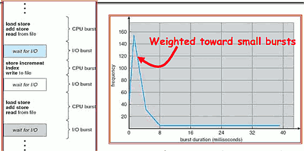

- Execution model: programs alternate between bursts of CPU and I/O
    - Program typically uses the CPU for some period of time, then does I/O, then uses CPU again
    - Each scheduling decision is about which job to give to the CPU for use by its next CPU burst
    - With timeslicing, thread may be forced to give up CPU before finishing current CPU burst

<h2 id="71f5cba64c54a9ccd02a0dc20998f03f"></h2>

## Scheduling Policy Goals/Criteria

- Minimize Response Time
    - Minimize elapsed time to do an operation (or job)
    - Response time is what the user sees:
        - Time to echo a keystroke in editor
        - Time to compile a program
        - Real-time Tasks: Must meet deadlines imposed by World
- Maximize Throughput
    - Maximize operations (or jobs) per second
    - Throughput related to response time, but not identical:
        - Minimizing response time will lead to more context switching than if you only maximized throughput
    - Two parts to maximizing throughput
        - Minimize overhead (for example, context-switching)
        - Efficient use of resources (CPU, disk, memory, etc)
- Fairness
    - Share CPU among users in some equitable way
    - Fairness is not minimizing average response time:
        - Better average response time by making system less fair

<h2 id="934d08f0fe90032b3d2b69e171bed01a"></h2>

## First-Come, First-Served (FCFS) Scheduling

- First-Come, First-Served (FCFS)
    - Also “First In, First Out” (FIFO) or “Run until done”
        - In early systems, FCFS meant one program scheduled until done (including I/O)
        - Now, means keep CPU until thread blocks
- Example:

```
Process     Burst Time
P1          24
P2          3
P3          3
```  

- Example cont.
    - Suppose processes arrive in the order: P1 , P2 , P3 The Gantt Chart for the schedule is:
        - 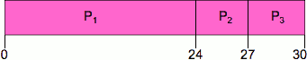
    - Waiting time for P1 = 0; P2 = 24; P3 = 27
    - Average waiting time: (0 + 24 + 27)/3 = 17
    - Average Completion time: (24 + 27 + 30)/3 = 27
- Convoy effect: short process behind long process

---

- Example continued:
    - Suppose that processes arrive in order: P2 , P3 , P1 Now, the Gantt chart for the schedule is:
        - 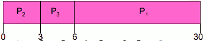
    - Waiting time for P1 = 6; P2 = 0; P3 = 3 
    - Average waiting time: (6 + 0 + 3)/3 = 3
    - Average Completion time: (3 + 6 + 30)/3 = 13
- In second case:
    - average waiting time is much better (before it was 17)
    - Average completion time is better (before it was 27) 
- FIFO Pros and Cons:
    - Simple (+)
    - Short jobs get stuck behind long ones (-)
        - Safeway: Getting milk, always stuck behind cart full of small items. Upside: get to read about space aliens

<h2 id="4d9cb10d6aed8975b338c4064f6a0925"></h2>

## Round Robin (RR)

- FCFS Scheme: Potentially bad for short jobs!
    - Depends on submit order
    - If you are first in line at supermarket with milk, you don’t care who is behind you, on the other hand…
- Round Robin Scheme
    - Each process gets a small unit of CPU time (time quantum), usually 10-100 milliseconds
    - After quantum expires, the process is preempted and added to the end of the ready queue.
    - n processes in ready queue and time quantum is q => 
        - Each process gets 1/ n of the CPU time 
        - In chunks of at most q time units
        - No process waits more than ( n-1)q time units
- Performance
    - q large => FCFS
    - q small => Interleaved (really small => hyperthreading?)
    - q must be large with respect to context switch, otherwise overhead is too high (all overhead)

<h2 id="8c9abdd49b5817b01b784b3a3dc74129"></h2>

### Example of RR with Time Quantum = 20

```
Process     Burst Time
P1          53
P2          8
P3          68
P4          24
```

- Example:
    - The Gantt chart is:
        - 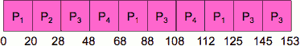

    - Waiting time for P1=(68-20)+(112-88)=72
        - P2=(20-0)=20
        - P3=(28-0)+(88-48)+(125-108)=85
        - P4=(48-0)+(108-68)=88
    - Average waiting time = (72+20+85+88)/4=66¼
    - Average completion time = (125+28+153+112)/4 = 104½
- Thus, Round-Robin Pros and Cons:
    - Better for short jobs, Fair (+)
    - Context-switching time adds up for long jobs (-)

<h2 id="73b976e6777c18b0646b8fba53c74f1f"></h2>

### Round-Robin Discussion

- How do you choose time slice?
    - What if too big?
        - Response time suffers
    - What if infinite (∞ ) ?
        - Get back FIFO
    - What if time slice too small?
        - Throughput suffers! 
- Actual choices of timeslice:
    - Initially, UNIX timeslice one second:
        - Worked ok when UNIX was used by one or two people.
        - What if three compilations going on? 3 seconds to echo each keystroke!
    - In practice, need to balance short-job performance and long-job throughput:
        - Typical time slice today is between 10ms – 100ms
        - Typical context-switching overhead is 0.1ms – 1ms
        - Roughly 1% overhead due to context-switching

<h2 id="a17cc4d1e78d599c26e90059b67d5d79"></h2>

## Comparisons between FCFS and Round Robin

- Assuming zero-cost context-switching time, is RR always better than FCFS?
- Simple example:
    - 10 jobs, each take 100s of CPU time RR scheduler quantum of 1s All jobs start at the same time
- Completion Times:
    - 
    - Both RR and FCFS finish at the same time
    - Average response time is much worse under RR!
        - Bad when all jobs same length
    - Also: Cache state must be shared between all jobs with RR but can be devoted to each job with FIFO
        - Total time for RR longer even for zero-cost switch!

<h2 id="c20b726dfc6cd74004f79d30362040d2"></h2>

### Earlier Example with Different Time Quantum

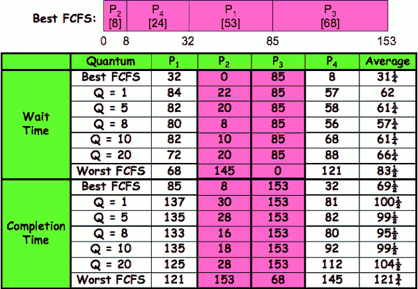

- The short jobs really benefit from round-robin , the long jobs don't. 


<h2 id="906d3fda01d00ac165cea4ea04f36b6a"></h2>

## Summary (Scheduling)

- **Scheduling:** selecting a waiting process from the ready queue and allocating the CPU to it
- **FCFS Scheduling:**
    - Run threads to completion in order of submission
    - Pros: Simple
    - Cons: Short jobs get stuck behind long ones
- **Round-Robin Scheduling:**
    - Give each thread a small amount of CPU time when it executes; cycle between all ready threads
    - Pros: Better for short jobs
    - Cons: Poor when jobs are same length 
- **Shortest Job First (SJF)/Shortest Remaining Time First (SRTF):**
    - Run whatever job has the least amount of computation to do/least remaining amount of computation to do
    - Pros: Optimal (average response time) 
    - Cons: Hard to predict future, Unfair

<h2 id="7da24b9369b762c967f238adee7993bf"></h2>

# Lecture 11 : Scheduling (con't)  / Protection: Kernel and Address Spaces

 
<h2 id="3f92d4014064c6ce70d7bba6c004291d"></h2>

## What if we Knew the Future?

- Could we always mirror best FCFS?
- Shortest Job First (SJF):
    - Run whatever job has the least amount of computation to do
    - Sometimes called “Shortest Time to Completion First” (STCF)
- Shortest Remaining Time First (SRTF):
    - Preemptive version of SJF: if job arrives and has a shorter time to completion than the remaining time on the current job, immediately preempt CPU
    - Sometimes called “Shortest Remaining Time to Completion First” (SRTCF)
- These can be applied either to a whole program or the current CPU burst of each program
    - Idea is to get short jobs out of the system
    - Big effect on short jobs, only small effect on long ones
    - Result is better average response time
    
<h2 id="eed9474fd944d045ff056d20004acaa3"></h2>

## Discussion

- SJF/SRTF are the best you can do at minimizing average response time
    - Provably optimal (SJF among non-preemptive, SRTF among preemptive) 
    - Since SRTF is always at least as good as SJF, focus on SRTF
- Comparison of SRTF with FCFS and RR
    - What if all jobs the same length?
        - SRTF becomes the same as FCFS (i.e. FCFS is best can do if all jobs the same length)
    - What if jobs have varying length?
        - SRTF (and RR): short jobs not stuck behind long ones

<h2 id="fc449a6dd196bacba2d7e0ae4535f0a1"></h2>

### Example to illustrate benefits of SRTF

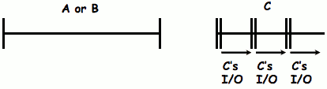

- 单核 ，存在cpu密集型计算的场景
- Three jobs:
    - A,B: both CPU bound, run for week
    - C: I/O bound, loop 1ms CPU, 9ms disk I/O
    - If only one at a time, C uses 90% of the disk, A or B could use 100% of the CPU
- With FIFO:
    - Once A or B get in, keep CPU for two weeks
- What about RR or SRTF?
    - Easier to see with a timeline
 

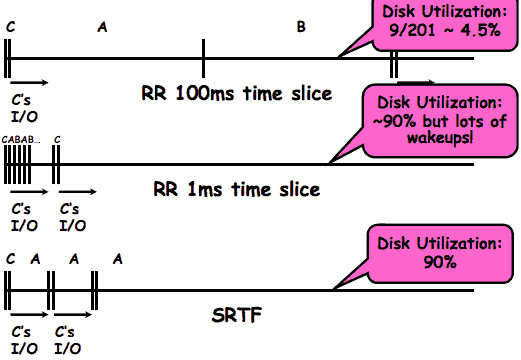

- RR , 100ms 
    - low disk utilization.  If you are copying a file, it will take a long time
- RR,  1ms
    - 90% disk utilization , but too much wakeups
- SRTF 
    - 90% disk utilization , but B need to wait a week to start , is it a bad thing ?
    - It could be a good thing , it could be a bad thing. It depends on what your goals are.  
        - It's a good thing because the average response time between A and B is better than if we swapped all the time.

So clearly we're going to approximate SRTF. The real question is how to approximate it. 

<h2 id="cb6a025806000bb1a4cd415ed9363242"></h2>

## Predicting the Length of the Next CPU Burst

- **Adaptive:** Changing policy based on past behavior
    - CPU scheduling, in virtual memory, in file systems, etc
    - Works because programs have predictable behavior
        - If program was I/O bound in past, likely in future
        - If computer behavior were random, wouldn’t help
    - it isn't really guessing the future well, it itn't really predicting the future. What it is it's gueessing the future based on the past. 
- Example: SRTF with estimated burst length
    - Use an estimator function on previous bursts: 
        - Let t<sub>n-1</sub> , t<sub>n-2</sub> , t<sub>n-3</sub> , etc. be previous CPU burst lengths.
        - Estimate next burst τ<sub>n</sub> = f(t<sub>n-1</sub>, t<sub>n-2</sub>, t<sub>n-3</sub>, … )
    - Function f could be one of many different time series estimation schemes (Kalman filters, etc)
    - For instance
        - exponential averaging τ<sub>n</sub> = αt<sub>n-1</sub> + (1-α)τ<sub>n-1</sub> 

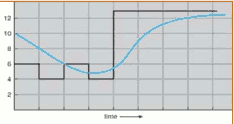

<h2 id="b368ccd38ca1f20e9180849717ae985e"></h2>

## Multi-Level Feedback Scheduling


- Another method for exploiting past behavior
    - First used in CTSS
    - **Multiple queues, each with different priority**
        - Higher priority queues often considered “foreground” tasks
    - **Each queue has its own scheduling algorithm**
        - e.g. foreground – RR, background – FCFS
        - Sometimes multiple RR priorities with quantum increasing exponentially (highest:1ms, next:2ms, next: 4ms, etc)
- Adjust each job’s priority as follows (details vary)
    - Job starts in highest priority queue
    - If timeout expires, drop one level
        - the quantum runs out, means it run for 8 milliseconds , and I take the CPU away, at that point we decide that this job is a longer running thing than we wanted on top level , and we put it down to the next level. 
    - If timeout doesn’t expire, push up one level (or to top)
 
It is like a sorting where we sort of have really fast short things up top and longer things down further. This actually you'd find this in many OS. This is pretty common.


<h2 id="0f566175567203ebe404bbd822b25ce3"></h2>

## Scheduling Details

Now we have many different queues. How do we schedule all the different queues?  We could pick something from the first q always over the second queue always over the 3rd queue. Problem with that is we have a starvation problem because the thing in the bottom never gets to run. 


- Result approximates SRTF:
    - CPU bound jobs drop like a rock
    - Short-running I/O bound jobs stay near top
- Scheduling must be done between the queues
    - **Fixed priority scheduling:**
        - serve all from highest priority, then next priority, etc.
    - **Time slice:**
        - each queue gets a certain amount of CPU time
        - e.g., 70% to highest, 20% next, 10% lowest
- **Countermeasure:** user action that can foil intent of the OS designer
    - For multilevel feedback, put in a bunch of meaningless I/O to keep job’s priority high
    - Of course, if everyone did this, wouldn’t work!
- Example of Othello program:
    - Playing against competitor, so key was to do computing at higher priority the competitors. 
        - Put in printf’s, ran much faster!


Windows and serval UNIX variants all have sort of techniques whereby when they notice that something hasn't been runing enough (eg. in bottom queue) then slowly raise its priority up until it starts running. 

<h2 id="97f1f705024fb4bac7d649b68cb2ac90"></h2>

## Scheduling Fairness

- What about fairness?
    - Strict fixed-priority scheduling between queues is unfair (run highest, then next, etc):
        - long running jobs may never get CPU
        - In Multics, shut down machine, found 10-year-old job
    - Must give long-running jobs a fraction of the CPU even when there are shorter jobs to run
    - **Tradeoff: fairness gained by hurting avg response time!**
- How to implement fairness?
    - Could give each queue some fraction of the CPU 
        - What if one long-running job and 100 short-running ones?
        - Like express lanes in a supermarket -- sometimes express lanes get so long, get better service by going into one of the other lines       
    - Could increase priority of jobs that don’t get service
        - What is done in UNIX
        - This is ad hoc -- what rate should you increase priorities?
        - And, as system gets overloaded, no job gets CPU time, so everyone increases in priority =>  Interactive jobs suffer

<h2 id="45cf7e2476f1de886b762a6e617f5811"></h2>

## Lottery Scheduling

- Yet another alternative: Lottery Scheduling
    - Give each job some number of lottery tickets
    - On each time slice, randomly pick a winning ticket
    - On average, CPU time is proportional to number of tickets given to each job
- How to assign tickets?
    - To approximate SRTF, short running jobs get more, long running jobs get fewer
    - To avoid starvation, every job gets at least one ticket (everyone makes progress)
- Advantage over strict priority scheduling: behaves gracefully as load changes
    - Adding or deleting a job affects all jobs proportionally, independent of how many tickets each job possesses 

<h2 id="cf0f12552ddb45c69e45ed54dc2f5ff1"></h2>

### Lottery Scheduling Example

- Lottery Scheduling Example
    - Assume short jobs get 10 tickets, long jobs get 1 ticket
        - 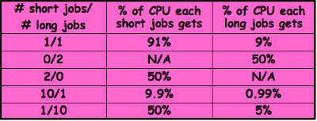
    - What if too many short jobs to give reasonable response time? 
        - In UNIX, if load average is 100, hard to make progress
        - One approach: log some user out

<h2 id="33afb76a6ff1f10de47fadb924c09d27"></h2>

## How to Evaluate a Scheduling algorithm?

- Deterministic modeling
    - takes a predetermined workload and compute the performance of each algorithm for that workload
- Queueing models
    - Mathematical approach for handling stochastic workloads
- Implementation/Simulation:
    - Build system which allows actual algorithms to be run against actual data. Most flexible/general.

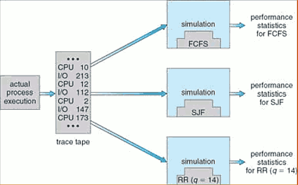


<h2 id="31f0723d929b04251bfc845445af1867"></h2>

## A Final Word On Scheduling

- When do the details of the scheduling policy and fairness really matter?
    - When there aren’t enough resources to go around
- When should you simply buy a faster computer?
    - (Or network link, or expanded highway, or …)
    - One approach: Buy it when it will pay for itself in improved response time
        - Assuming you’re paying for worse response time in reduced productivity, customer angst, etc…
        - Might think that you should buy a faster X when X is utilized 100%, but usually, response time goes to infinity as utilization => 100%
        - 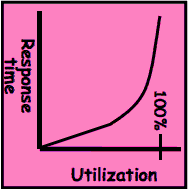
- An interesting implication of this curve:
    - Most scheduling algorithms work fine in the “linear” portion of the load curve, fail otherwise
    - Argues for buying a faster X when hit “knee” of curve

<h2 id="5221e88f6aad30fda4e4c5f05fbfec0c"></h2>

## Virtualizing Resources

So we've talking about virtualizing the CPU with our scheduling algorithms. So lets to virtualize other things.

- Physical Reality: Different Processes/Threads share the same hardware
    - Need to multiplex CPU (Just finished: scheduling)
    - Need to multiplex use of Memory (Today)
    - Need to multiplex disk and devices (later in term)
- Why worry about memory sharing?
    - The complete working state of a process and/or kernel is defined by its data in memory (and registers)
    - Consequently, cannot just let different threads of control use the same memory
        - Physics: two different pieces of data cannot occupy the same locations in memory
    - Probably don’t want different threads to even have access to each other’s memory (protection)

<h2 id="cea69a0c5085e78dbfde9cc73a34bd85"></h2>

## Important Aspects of Memory Multiplexing

- **Controlled overlap:**
    - Separate state of threads should not collide in physical memory. Obviously, unexpected overlap causes chaos!
    - Conversely, would like the ability to overlap when desired (for communication)
- **Translation:**
    - Ability to translate accesses from one address space (virtual) to a different one (physical)
    - When translation exists, processor uses virtual addresses, physical memory uses physical addresses
    - Side effects:
        - Can be used to avoid overlap
        - Can be used to give uniform view of memory to programs
- **Protection:**
    - Prevent access to private memory of other processes
        - Different pages of memory can be given special behavior (Read Only, Invisible to user programs, etc).
        - Kernel data protected from User programs
        - Programs protected from themselves

<h2 id="8b47f1e39f922927e58c299f8a0a9977"></h2>

## Binding of Instructions and Data to Memory

- Binding of instructions and data to addresses:
    - Choose addresses for instructions and data from the standpoint of the processor
    - 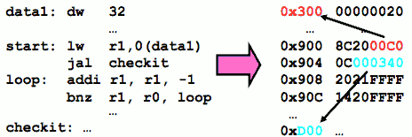
        - notice there are no actual addresses. All there are symbols. 
    - Could we place data1, start, and/or checkit at different addresses?
        - Yes
        - When? Compile time/Load time/Execution time
    - Related: which physical memory locations hold particular instructions or data?


<h2 id="8e342d50a842d8b770ec01d2e1a6f834"></h2>

## Multi-step Processing of a Program for Execution

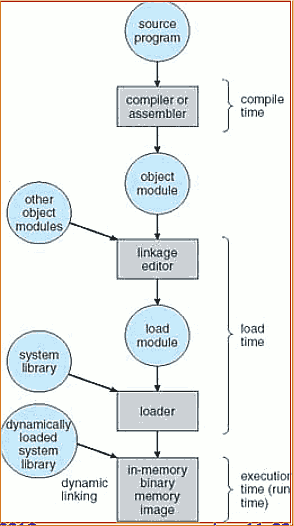

- Preparation of a program for execution involves components at:
    - Compile time (i.e. “gcc”)
    - Link/Load time (unix “ld” does link)
    - Execution time (e.g. dynamic libs)
- Addresses can be bound to final values anywhere in this path
    - Depends on hardware support 
    - Also depends on operating system
- Dynamic Libraries
    - Linking postponed until execution
    - Small piece of code, stub, used to locate the appropriate memory- resident library routine
    - Stub replaces itself with the address of the routine, and executes routine


<h2 id="88606f8ea46da947c105e71fa640cf11"></h2>

## Multiprogramming (First Version)

- Multiprogramming without Translation or Protection
    - Must somehow prevent address overlap between threads
        - 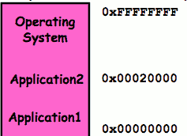
    - Trick: Use Loader/Linker: Adjust addresses while program loaded into memory (loads, stores, jumps)
        - Everything adjusted to memory location of program
        - Translation done by a linker-loader
        - Was pretty common in early days
- With this solution, no protection: bugs in any program can cause other programs to crash or even the OS

<h2 id="3743788a25e4eae2c8ffbd8b73cb741d"></h2>

## Multiprogramming (Version with Protection)

- Can we protect programs from each other without translation?
    - 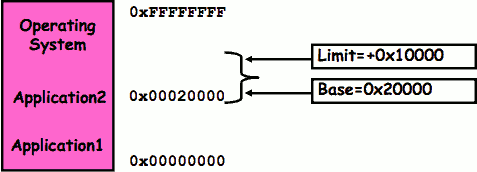
    - Yes: use two special registers Base and Limit to prevent user from straying outside designated area
        - If user tries to access an illegal address, cause an error
    - During switch, kernel loads new base/limit from TCB
        - User not allowed to change base/limit registers

<h2 id="eabe64c3ad5f33e2c57aa521b8e17db8"></h2>

## Segmentation with Base and Limit registers

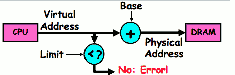


- Could use base/limit for **dynamic address translation** (often called “segmentation”):
    - Alter address of every load/store by adding “base”
    - User allowed to read/write within segment
        - Accesses are relative to segment so don’t have to be relocated when program moved to different segment
    - User may have multiple segments available (e.g x86)
        - Loads and stores include segment ID in opcode:
            - x86 Example: mov [es:bx],ax. 
        - Operating system moves around segment base pointers as necessary

<h2 id="1481bffc1d7d34c5d0dab0491bcdd551"></h2>

## Issues with simple segmentation method

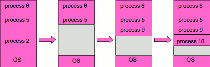

- Fragmentation problem
    - Not every process is the same size
    - Over time, memory space becomes fragmented
- Hard to do inter-process sharing
    - Want to share code segments when possible
    - Want to share memory between processes
    - Helped by by providing multiple segments per process
- Need enough physical memory for every process

<h2 id="e8f5488c454d6ab1f3f774b77bb9e83a"></h2>

## Multiprogramming (Translation and Protection version 2) 

- Problem: Run multiple applications in such a way that they are protected from one another
- Goals: 
    - Isolate processes and kernel from one another
    - Allow flexible translation that:
        - Doesn’t lead to fragmentation
        - Allows easy sharing between processes
        - Allows only part of process to be resident in physical memory
- (Some of the required) Hardware Mechanisms:
    - General Address Translation
        - Flexible: Can fit physical chunks of memory into arbitrary places in users address space
        - Not limited to small number of segments
        - Think of this as providing a large number (thousands) of fixed-sized segments (called “pages”)
    - Dual Mode Operation
        - Protection base involving kernel/user distinction


<h2 id="8cb0ddad9e2227d129016417865b8804"></h2>

## Example of General Address Translation


<h2 id="82f0f63373d278fc12a45e84e20b2e8f"></h2>

## Two Views of Memory

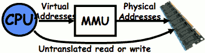

- Recall: Address Space:
    - All the addresses and state a process can touch
    - Each process and kernel has different address space
- Consequently: two views of memory:
    - View from the CPU (what program sees, virtual memory)
    - View fom memory (physical memory)
    - Translation box converts between the two views
- Translation helps to implement protection
    - If task A cannot even gain access to task B’s data, no way for A to adversely affect B
- With translation, every program can be linked/loaded into same region of user address space
    - so you always started address 0
    - Overlap avoided through translation, not relocation

<h2 id="3fcf38fc343c687c120a30b93e5afaa2"></h2>

## Example of Translation Table Format

- Two-level Page Tables 32-bit address:

10 | 10 | 12
--- | --- | ---
p1 index | p2 index | page offset

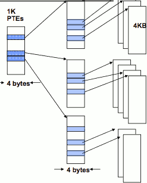

- Page: a unit of memory translatable by memory management unit (MMU)
    - Typically 1K – 8K
- Page table structure in memory
    - **Each user has different page table**
- Address Space switch: change pointer to base of table (hardware register)
    - Hardware traverses page table (for many architectures)
    - MIPS uses software to traverse table
- these blue bubbles actually are page tables like this in memory one for every processes. 


<h2 id="290612199861c31d1036b185b4e69b75"></h2>

## Summary

- Shortest Job First (SJF)/Shortest Remaining Time First (SRTF):
    - Run whatever job has the least amount of computation to do/least remaining amount of computation to do
    - Pros: Optimal (average response time)
    - Cons: Hard to predict future, Unfair
- Multi-Level Feedback Scheduling:
    - Multiple queues of different priorities
    - Automatic promotion/demotion of process priority in order to approximate SJF/SRTF
- Lottery Scheduling:
    - Give each thread a priority-dependent number of tokens (short tasks => more tokens)
    - Reserve a minimum number of tokens for every thread to ensure forward progress/fairness
- Evaluation of mechanisms:
    - Analytical, Queuing Theory, Simulation

<h2 id="17f8807634b643b8281b1e4a680d5ced"></h2>

## Summary (2)

- Memory is a resource that must be shared
    - Controlled Overlap: only shared when appropriate
    - Translation: Change Virtual Addresses into Physical Addresses
    - Protection: Prevent unauthorized Sharing of resources
- Simple Protection through Segmentation
    - Base+limit registers restrict memory accessible to user
    - Can be used to translate as well
- Full translation of addresses through Memory Management Unit (MMU)
    - Every Access translated through page table
    - Changing of page tables only available to user
- Dual-Mode
    - TODO


--- 

