...menustart

- [Lecture 21: Networking](#09032c37d093937622b81cc8296200e6)
    - [Review: File System Caching](#1d1be5d2a7d7a1ea955754c7c1daf6c3)
    - [Goals for Today](#134f950c115f6aa46f3605b42a307174)
    - [Authorization: Who Can Do What?](#1a82c99da54d455606fbf432082c1505)
    - [Authorization: Two Implementation Choices](#f6c5e8d2591d2f0e6108da2a03bd252b)
    - [Authorization: Combination Approach](#6c11ebc3ed96e89c913d7f928a42bde8)
    - [Authorization: How to Revoke?](#01e28eaff534c3eda1e4fa91ed2ff24b)
    - [Revoking Capabilities](#7a87dc1d4ca28896e80c861b75d42812)
    - [Centralized vs Distributed Systems](#98445c49a71bbdeba3cbed4f22fa44e9)
    - [Distributed Systems: Motivation/Issues](#5cee22de108837e478e134d126fceeba)
    - [Distributed Systems: Goals/Requirements](#483d6e9ecc380b0f29253ac000c64ad1)
    - [Networking Definitions](#ef4023ed9b9bfc426ddbb79e5e2a1242)
    - [Broadcast Network](#d03b87cd9c53d43ade8109f5b220515b)
    - [Broadcast Networks Details](#542790f4cc0e06b00a695038d1861a08)
    - [Broadcast Network Arbitration](#6c264d7492ca57e74be76844f6177664)
    - [Carrier Sense, Multiple Access/Collision Detection](#85ff18972c945522692f7e5d601d663c)
    - [Point-to-point networks](#25f3815c65379b8289fa74ec8cb1c580)
    - [Point-to-Point Networks Discussion](#1944dda119b5df5095693250b1d75494)
    - [Point-to-Point Network design](#bebffdbbf02502a7a3eecbacbe1579e1)
    - [Flow control options](#b9aeacb3eaf8b4c14b67730a8594b2e7)
    - [The Internet Protocol: “IP”](#8215d2dfcac9083491da658993ee05e6)
    - [Address Subnets](#d77893f82e59e70b1fdfdd1549fbaa03)
    - [Conclusion](#6f8b794f3246b0c1e1780bb4d4d5dc53)
- [Lecture 22: Network II](#7d8b4355959556da0ee12fe49dd9cf34)
    - [Address Ranges in IP](#25bdb0b85c45cecdeb2f3e83e1ada6f5)
    - [Hierarchical Networking: The Internet](#9b995261f7f935cccfec6e225bb22444)
    - [Simple Network Terminology](#d9f360b8789b18dd3b0b723059e1ad7c)
    - [Routing](#786c4135070aa1910d2f4ac8b2253235)
    - [Setting up Routing Tables](#bb55ba056d36bf2e0c922c2f6ef667ca)
    - [Naming in the Internet](#2a4b85613b98b7ff0539bf80ab1cd2ae)
    - [Domain Name System](#76ada12e2cf128a9bd1e5db3c106f915)
    - [How Important is Correct Resolution?](#150186ba8cbc5a54acd7cb5cf61e8025)
    - [Performance Considerations](#d5e238de3ec209bec453d8aef09d080e)
    - [Sample Computations](#5d6fca3fac25bbea2a7ca6be38053ac6)
    - [Network Protocols](#fe9bf79396cb093675bcd87ba6ffe56d)
    - [Network Layering](#2de5d7f052bdd84866ff79135c2bcc58)
    - [Building a messaging service](#35a60297563ab91f4b231d31ba2ada3b)
    - [IP Packet Format](#b6cc1459c243ac253323b35089dab87b)
    - [Building a messaging service](#35a60297563ab91f4b231d31ba2ada3b)
    - [Sequence Numbers](#9199dae771f316f9a3e90a0046bb0758)
    - [Reliable Message Delivery: the Problem](#83cf3f8245c0357abe77e7154b88ea69)
    - [Using Acknowledgements](#9d3c809afd1b2930170860d0dbebb353)
    - [Conclusion](#6f8b794f3246b0c1e1780bb4d4d5dc53)
- [Lecture 23 : Network Communication Abstractions / Distributed Programming](#097f836a49e3a196c1bdfca778384e04)
    - [How to deal with message duplication](#734c62df7a31ed5cd87d6f1e6a9db145)
    - [Better messaging: Window-based acknowledgements](#048d5b9f156debfd6e9e0df35ef73d94)
    - [Transmission Control Protocol (TCP)](#712c97a373236b579081db769f2e26f0)
    - [TCP Windows and Sequence Numbers](#9ee07f82193171f545c07569c849fc4c)
    - [Window-Based Acknowledgements (TCP)](#752bf5ab4629c71fba6167a3b3252d10)
    - [Selective Acknowledgement Option (SACK)](#19422d661bbc4ae1b85c110603cece66)
    - [Congestion Avoidance](#051092838b6a9dd05b10e688a31060ee)
    - [Sequence-Number Initialization](#5cfa878082764510a7747ec1e56c5d58)
    - [Use of TCP: Sockets](#87cd758891288ebba3176b567e28e316)
    - [Socket Setup (Con’t)](#fc3dbe3e3a94b62da50694eed60c5514)
    - [Distributed Applications](#f08a0c5ed12bbe6830815cd6005da5ce)
    - [Using Messages: Send/Receive behavior](#18c72d71b52916649113b05f56176cec)
    - [Messaging for Request/Response communication](#e327f500a2224a9491f7242769760478)
    - [General’s Paradox](#388f60d4b525c1360c27584291a7106c)
    - [Two-Phase Commit](#76bb77f6a61692c6cdd1b078f2efe26f)
        - [Two phase commit example](#33e90a963f562f1fc7f8323b825b9c74)
    - [Distributed Decision Making Discussion](#66913dbd4594ec5201af10bd1925f0aa)
    - [Conclusion](#6f8b794f3246b0c1e1780bb4d4d5dc53)
- [Lecture 24: Distributed File Systems](#fcdc007ff783dbd9743a00efcbffc113)
    - [Byzantine General’s Problem](#1535a061d2792d321e26bc9bfae487ab)
    - [Remote Procedure Call](#7823b02b00549b08b9e7479a27712bcd)
    - [RPC Information Flow](#619ad21e81fa60f6f6b7ff4224879877)
    - [RPC Details](#9c6093f1125a29b60e00a00805a68826)
    - [Problems with RPC](#587682328c851d08e822e45af127ff21)
    - [Cross-Domain Communication/Location Transparency](#27deff3c4c33317556eb1e3dd687c4a0)
    - [Microkernel operating systems](#a92be5b27fb0bbf79ae97a4fdd6f3295)
    - [Distributed File Systems](#ad416a4ba30fb9f91e5f56d6736c6ebb)
    - [Virtual File System (VFS)](#319d7097a96659bafd943e791369a2ba)
    - [Simple Distributed File System](#42dcaa5f1e270cbc074827204d6cad5b)
    - [Use of caching to reduce network load](#0e4cb9f12d45adbc366ce89051b43dda)
    - [TODO](#b7b1e314614cf326c6e2b6eba1540682)

...menuend

<h2 id="09032c37d093937622b81cc8296200e6"></h2>

# Lecture 21: Networking

<h2 id="1d1be5d2a7d7a1ea955754c7c1daf6c3"></h2>

## Review: File System Caching

- **Delayed Writes:** Writes to files not immediately sent out to disk
    - Instead, write() copies data from user space buffer to kernel buffer (in cache)
        - Enabled by presence of buffer cache: can leave written file blocks in cache for a while
        - If some other application tries to read data before written to disk, file system will read from cache
    - Flushed to disk periodically (e.g. in UNIX, every 30 sec)
    - Advantages: 
        - Disk scheduler can efficiently order lots of requests
        - Disk allocation algorithm can be run with correct size value for a file
        - Some files need never get written to disk! (e..g temporary scratch files written /tmp often don’t exist for 30 sec)
    - Disadvantages
        - What if system crashes before file has been written out?
        - Worse yet, what if system crashes before a directory file has been written out? (lose pointer to inode!)

<h2 id="134f950c115f6aa46f3605b42a307174"></h2>

## Goals for Today

- Authorization
- Networking
    - Broadcast
    - Point-to-Point Networking
    - Routing
    - Internet Protocol (IP)

<h2 id="1a82c99da54d455606fbf432082c1505"></h2>

## Authorization: Who Can Do What?

- How do we decide who is authorized to do actions in the system?
- **Access Control Matrix:** contains all permissions in the system
    - Resources across top
        - Files, Devices, etc…
    - Domains in columns
        - A domain might be a user or a group of users
        - E.g. above: User D3 can read F2 or execute F3
    - In practice, table would be huge and sparse
        - the table maybe a good way to introduce it. But it isn't practical. There is no table like this in any system you're likely to use. 

<h2 id="f6c5e8d2591d2f0e6108da2a03bd252b"></h2>

## Authorization: Two Implementation Choices

- **Access Control Lists:** store permissions with object
    - Still might be lots of users!
    - UNIX limits each file to: r,w,x for owner, group, world
        - More recent systems allow definition of groups of users and permissions for each group
    - ACLs allow easy changing of an object’s permissions
        - Example: add Users C, D, and F with rw permissions
    - Requires mechanisms to prove identity
- **Capability List:** each process tracks which objects it has permission to touch
    - Consider page table: Each process has list of pages it has access to, not each page has list of processes …
        - Capability list easy to change/augment permissions
        - E.g.: you are promoted to system administrator and should be given access to all system files
    - Implementation: Capability like a “Key” for access
        - Example: cryptographically secure (non-forgeable) chunk of data that can be exchanged for access

<h2 id="6c11ebc3ed96e89c913d7f928a42bde8"></h2>

## Authorization: Combination Approach

- Users have capabilities, called “groups” or “roles”
    - Everyone with particular group access is “equivalent” when accessing group resource
    - Like passport (which gives access to country of origin)
- Objects have ACLs
    - ACLs can refer to users or groups
    - Change object permissions object by modifying ACL
    - Change broad user permissions via changes in group membership
    - Possessors of proper credentials get access

<h2 id="01e28eaff534c3eda1e4fa91ed2ff24b"></h2>

## Authorization: How to Revoke?

- How does one revoke someone’s access rights to a particular object?
    - Easy with ACLs: just remove entry from the list
    - Takes effect immediately since the ACL is checked on each object access
- Harder to do with capabilities since they aren’t stored with the object being controlled:
    - Not so bad in a single machine: could keep all capability lists in a well-known place (e.g., the OS capability table).
    - Very hard in distributed system, where remote hosts may have crashed or may not cooperate (more in a future lecture) 

<h2 id="7a87dc1d4ca28896e80c861b75d42812"></h2>

## Revoking Capabilities

- Various approaches to revoking capabilities:
    - Put expiration dates on capabilities and force reacquisition
    - Put epoch numbers on capabilities and revoke all capabilities by bumping the epoch number (which gets checked on each access attempt)
    - Maintain back pointers to all capabilities that have been handed out (Tough if capabilities can be copied)
    - Maintain a revocation list that gets checked on every access attempt

<h2 id="98445c49a71bbdeba3cbed4f22fa44e9"></h2>

## Centralized vs Distributed Systems

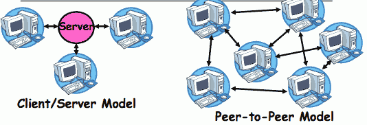

- **Centralized System:** System in which major functions are performed by a single physical computer
    - Originally, everything on single computer
    - Later: client/server model
- **Distributed System:** physically separate computers working together on some task
    - Early model: multiple servers working together
        - Probably in the same room or building
        - Often called a “cluster”
    - Later models: peer-to-peer/wide-spread collaboration

<h2 id="5cee22de108837e478e134d126fceeba"></h2>

## Distributed Systems: Motivation/Issues

- Why do we want distributed systems?
    - Cheaper and easier to build lots of simple computers
    - Easier to add power incrementally
    - Users can have complete control over some components
    - Collaboration: Much easier for users to collaborate through network resources (such as network file systems)
- The **promise** of distributed systems:
    - Higher availability: one machine goes down, use another
    - Better durability: store data in multiple locations
    - More security: each piece easier to make secure 
- Reality has been disappointing
    - Worse availability: depend on every machine being up
        - Lamport: “a distributed system is one where I can’t do work because some machine I’ve never heard of isn’t working!”
    - Worse reliability: can lose data if any machine crashes
    - Worse security: anyone in world can break into system
- Coordination is more difficult
    - Must coordinate multiple copies of shared state information (using only a network)
    - What would be easy in a centralized system becomes a lot more difficult

<h2 id="483d6e9ecc380b0f29253ac000c64ad1"></h2>

## Distributed Systems: Goals/Requirements

- **Transparency:** the ability of the system to mask its complexity behind a simple interface
- Possible transparencies:
    - Location: Can’t tell where resources are located
    - Migration: Resources may move without the user knowing
    - Replication: Can’t tell how many copies of resource exist
    - Concurrency: Can’t tell how many users there are
    - Parallelism: System may speed up large jobs by spliting them into smaller pieces
    - Fault Tolerance 容错: System may hide various things that go wrong in the system
- Transparency and collaboration require some way for different processors to communicate with one another
 
---

<h2 id="ef4023ed9b9bfc426ddbb79e5e2a1242"></h2>

## Networking Definitions

- **Network:** physical connection that allows two computers to communicate
- **Packet:** unit of transfer, sequence of bits carried over the network
    - Network carries packets from one CPU to another
    - Destination gets interrupt when packet arrives 
- **Protocol:** agreement between two parties as to how information is to be transmitted

<h2 id="d03b87cd9c53d43ade8109f5b220515b"></h2>

## Broadcast Network

- **Broadcast Network:** Shared Communication Medium
    - 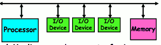
    - Shared Medium can be a set of wires
        - Inside a computer, this is called a bus
        - All devices simultaneously connected to devices
            - 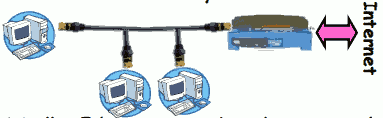
            - everybody can hear everything that's being said. So when the processor talks everyone listens or when I/O device talks maybe everybody listens. 
    - Originally, Ethernet was a broadcast network
        - All computers on local subnet connected to one another
    - More examples (wireless: medium is air): cellular phones,GSM GPRS, EDGE, CDMA 1xRTT, and 1EvDO

<h2 id="542790f4cc0e06b00a695038d1861a08"></h2>

## Broadcast Networks Details

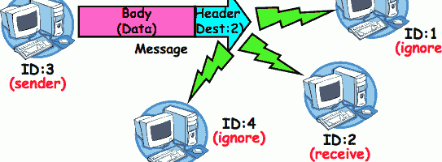

- **Delivery:** When you broadcast a packet, how does a receiver know who it is for? (packet goes to everyone!)
    - Put header on front of packet: [ Destination | Packet ]
    - Everyone gets packet, discards if not the target
    - In Ethernet, this check is done in hardware
        - No OS interrupt if not for particular destination
    - This is layering: we’re going to build complex network protocols by layering on top of the packet

<h2 id="6c264d7492ca57e74be76844f6177664"></h2>

## Broadcast Network Arbitration

- **Arbitration:** Act of negotiating use of shared medium
    - What if two senders try to broadcast at same time?
    - Concurrent activity but can’t use shared memory to coordinate! 
- Aloha network (70’s): packet radio within Hawaii
    - Blind broadcast, with checksum at end of packet. If received correctly (not garbled), send back an acknowledgement. If not received correctly, discard.
        - Need checksum anyway – in case airplane flies overhead
    - Sender waits for a while, and if doesn’t get an acknowledgement, re-transmits.
    - If two senders try to send at same time, both get garbled, both simply re-send later
    - Problem: Stability: what if load increases ?
        - More collisions => less gets through => more resent => more load… => More collisions…
        - Unfortunately: some sender may have started in clear, get scrambled without finishing

<h2 id="85ff18972c945522692f7e5d601d663c"></h2>

## Carrier Sense, Multiple Access/Collision Detection

- Ethernet (early 80’s): first practical local area network
    - It is the most common LAN for UNIX, PC, and Mac
    - Use wire instead of radio, but still broadcast medium
- Key advance was in arbitration called CSMA/CD: Carrier sense, multiple access/collision detection
    - **Carrier Sense:** don’t send unless idle
        - Don’t mess up communications already in process
    - **Collision Detect:** sender checks if packet trampled
        - If so, abort, wait, and retry.
    - **Backoff Scheme:** Choose wait time before trying again
- How long to wait after trying to send and failing?
    - What if everyone waits the same length of time? Then, they all collide again at some time!
    - Must find way to break up shared behavior with nothing more than shared communication channel
- Adaptive randomized waiting strategy:
    - **Adaptive and Random:** : First time, pick random wait time with some initial mean. If collide again, pick random value from bigger mean wait time. Etc.
    - Randomness is important to decouple colliding senders
    - Scheme figures out how many people are trying to send!

<h2 id="25f3815c65379b8289fa74ec8cb1c580"></h2>

## Point-to-point networks

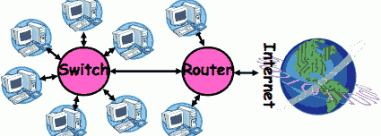

- Why have a shared bus at all? Why not simplify and only have point-to-point links + routers/switches?
    - Originally wasn’t cost-effective
    - Now, easy to make high-speed switches and routers that can forward packets from a sender to a receiver.
- **Point-to-point network:** a network in which every physical wire is connected to only two computers
- **Hub:** a multiport device that acts like a repeater broadcasting from each input to every output
    - 价格便宜, 小型的网络（2 － 5 台电脑）最有效地连接方式. Shared Communication Medium 机制
- **Switch:** a bridge that transforms a shared-bus (broadcast) configuration into a point-to-point network.
    - 交换机内部保存着一张路由表(Routing Table) 
    - 如电脑B，电脑C同时向电脑A传送数据，就会产生数据冲突.
- **Router:** a device that acts as a junction between two networks to transfer data packets among them.

<h2 id="1944dda119b5df5095693250b1d75494"></h2>

## Point-to-Point Networks Discussion

- Advantages:
    - Higher link performance
        - Can drive point-to-point link faster than broadcast link since less capacitance/less echoes (from impedance mismatches)
    - Greater aggregate bandwidth than broadcast link
        - Can have multiple senders at once
    - Can add capacity incrementally
        - Add more links/switches to get more capacity
    - Better fault tolerance (as in the Internet)
    - Lower Latency
        - No arbitration to send, although need buffer in the switch
- Disadvantages:
    - More expensive than having everyone share broadcast link
    - However, technology costs now much cheaper
- Examples
    - ATM (asynchronous transfer mode)
        - The first commercial point-to-point LAN
        - Inspiration taken from telephone network
    - Switched Ethernet
        - Same packet format and signaling as broadcast Ethernet, but only two machines on each ethernet.

<h2 id="bebffdbbf02502a7a3eecbacbe1579e1"></h2>

## Point-to-Point Network design

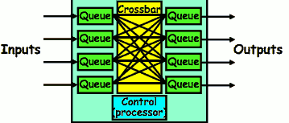

- Switches look like computers: inputs, memory, outputs
    - In fact probably contains a processor
- Function of switch is to forward packet to output that gets it closer to destination
- Can build big crossbar by combining smaller switches
    - 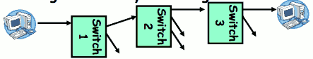
- **Can perform broadcast if necessary** 

<h2 id="b9aeacb3eaf8b4c14b67730a8594b2e7"></h2>

## Flow control options

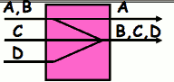

- What if everyone sends to the same output?
    - Congestion -- packets don’t flow at full rate    
- In general, what if buffers fill up? 
    - Need flow control policy
- Option 1: no flow control. Packets get dropped if they arrive and there’s no space
    - If someone sends a lot, they are given buffers and packets from other senders are dropped
    - Internet actually works this way
- Option 2: (Local) Flow control between switches
    - When buffer fills, stop inflow of packets
    - Problem: what if path from source to destination is completely unused, but goes through some switch that has buffers filled up with unrelated traffic?

---

- Problem: fairness
    - Throughput of each stream is entirely dependent on topology, and relationship to bottleneck
- Automobile Analogy
    - At traffic jam, one strategy is merge closest to the bottleneck
        - Why people get off at one exit, drive 50 feet, merge back into flow 
        - Ends up slowing everybody else a huge emount
    - Also why have control lights at on-ramps
        - Try to keep from injecting more cars than capacity of road (and thus avoid congestion)
- Option 3: Per-flow flow control
    - Allocate a separate set of buffers to each end-to- end stream and use separate “don’t send me more” control on each end-to-end stream

<h2 id="8215d2dfcac9083491da658993ee05e6"></h2>

## The Internet Protocol: “IP”

- The Internet is a large network of computers spread across the globe
    - According to the Internet Systems Consortium, there were over 681 million computers as of July 2009
    - In principle, every host can speak with every other one under the right circumstances
- **IP Packet:** a network packet on the internet
- **IP Address:** a 32-bit integer used as the destination of an IP packet
    - Often written as four dot-separated integers, with each integer from 0—255 (thus representing 8x4=32 bits)
    - Example CS file server is: 169.229.60.83 == 0xA9E53C53
- **Internet Host:** a computer connected to the Internet
    - Host has one or more IP addresses used for routing
        - Some of these may be private and unavailable for routing 
    - Not every computer has a unique IP address
        - Groups of machines may share a single IP address
        - In this case, machines have private addresses behind a “Network Address Translation” (NAT) gateway

<h2 id="d77893f82e59e70b1fdfdd1549fbaa03"></h2>

## Address Subnets

- **Subnet:** A network connecting a set of hosts with related destination addresses 
- With IP, all the addresses in subnet are related by a prefix of bits 
    - **Mask:** The number of matching prefix bits
        - Expressed as a single value (e.g., 24) or a set of ones in a 32-bit value (e.g., 255.255.255.0)
- A subnet is identified by 32-bit value, with the bits which differ set to zero, followed by a slash and a mask
    - Example: 128.32.131.0/24 designates a subnet in which all the addresses look like 128.32.131.XX   
    - Same subnet: 128.32.131.0/255.255.255.0
- Difference between subnet and complete network range
    - Subnet is always a subset of address range
    - Once, subnet meant single physical broadcast wire; now, less clear exactly what it means (virtualized by switches)

<h2 id="6f8b794f3246b0c1e1780bb4d4d5dc53"></h2>

## Conclusion

- Network: physical connection that allows two computers to communicate
    - Packet: sequence of bits carried over the network 
- **Broadcast Network:** Shared Communication Medium
    - Transmitted packets sent to all receivers
    - Arbitration: act of negotiating use of shared medium
        - Ethernet: Carrier Sense, Multiple Access, Collision Detect
- **Point-to-point network:** a network in which every physical wire is connected to only two computers
    - Switch: a bridge that transforms a shared-bus (broadcast) configuration into a point-to-point network
- **Protocol:** Agreement between two parties as to how information is to be transmitted
- Internet Protocol (IP)
    - Used to route messages through routes across globe
    - 32-bit addresses, 16-bit ports
- **DNS:** System for mapping from names => IP addresses 
    - Hierarchical mapping from authoritative domains
    - Recent flaws discovered

---

<h2 id="7d8b4355959556da0ee12fe49dd9cf34"></h2>

# Lecture 22: Network II

<h2 id="25bdb0b85c45cecdeb2f3e83e1ada6f5"></h2>

## Address Ranges in IP

- IP address space divided into prefix-delimited ranges:
    - Class A: NN.0.0.0/8
        - is 1–126 (126 of these networks)
        - 16,777,214 IP addresses per network
        - 10.xx.yy.zz is private
        - 127.xx.yy.zz is loopback
    - Class B: NN.MM.0.0/16
        - NN is 128–191, MM is 0-255 (16,384 of these networks)
        - 65,534 IP addresses per network
        - 172.[16-31].xx.yy are private
    - Class C: NN.MM.LL.0/24
        - NN is 192–223, MM and LL 0-255 (2,097,151 of these networks)
        - 254 IP addresses per networks
        - 192.168.xx.yy are private
- Address ranges are often owned by organizations
    - Can be further divided into subnets

<h2 id="9b995261f7f935cccfec6e225bb22444"></h2>

## Hierarchical Networking: The Internet

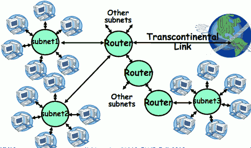

- How can we build a network with millions of hosts?
    - Hierarchy! Not every host connected to every other one
    - Use a network of Routers to connect subnets together
        - Routing is often by prefix: e.g. first router matches first 8 bits of address, next router matches more, etc

<h2 id="d9f360b8789b18dd3b0b723059e1ad7c"></h2>

## Simple Network Terminology

- Local-Area Network (LAN) – designed to cover small geographical area
    - Multi-access bus, ring, or star network
    - Speed  ≈ 10 – 1000 Megabits/second
    - Broadcast is fast and cheap
    - In small organization, a LAN could consist of a single subnet. In large organizations (like UC Berkeley), a LAN contains many subnets 
- Wide-Area Network (WAN) – links geographically separated sites
    - Point-to-point connections over long-haul lines (often leased from a phone company)
    - Speed ≈ 1.544 – 45 Megabits/second
    - Broadcast usually requires multiple messages

<h2 id="786c4135070aa1910d2f4ac8b2253235"></h2>

## Routing

- Routing: the process of forwarding packets hop-by-hop through routers to reach their destination
    - Need more than just a destination address!
        - Need a path
    - Post Office Analogy:
        - Destination address on each letter is not sufficient to get it to the destination
        - To get a letter from here to Florida, must route to local post office, sorted and sent on plane to somewhere in Florida, be routed to post office, sorted and sent with carrier who knows where street and house is… 

- Internet routing mechanism: routing tables
    - Each router does table lookup to decide which link to use to get packet closer to destination
    - Don’t need 4 billion entries in table: routing is by subnet
    - Could packets be sent in a loop? Yes, if tables incorrect
- Routing table contains:
    - Destination address range -> output link closer to destination
    - Default entry (for subnets without explicit entries)

<h2 id="bb55ba056d36bf2e0c922c2f6ef667ca"></h2>

## Setting up Routing Tables

- How do you set up routing tables?
    - Internet has no centralized state!
        - No single machine knows entire topology
        - Topology constantly changing (faults, reconfiguration, etc)
    - Need dynamic algorithm that acquires routing tables
        - Ideally, have one entry per subnet or portion of address
        - Could have “default” routes that send packets for unknown subnets to a different router that has more information
- Possible algorithm for acquiring routing table
    - Routing table has “cost” for each entry
        - Includes number of hops to destination, congestion, etc.
        - Entries for unknown subnets have infinite cost
    - Neighbors periodically exchange routing tables
        - If neighbor knows cheaper route to a subnet, replace your entry with neighbors entry (+1 for hop to neighbor)
- In reality:
    - Internet has networks of many different scales
    - Different algorithms run at different scales

<h2 id="2a4b85613b98b7ff0539bf80ab1cd2ae"></h2>

## Naming in the Internet

NAME -> ADDRESS

- How to map human-readable names to IP addresses?
    - E.g. www.berkeley.edu => 128.32.139.48
    - E.g. www.google.com => different addresses depending on location, and load 
- Why is this necessary?
    - IP addresses are hard to remember
    - IP addresses change:
        - Say, Server 1 crashes gets replaced by Server 2
        - Or – google.com handled by different servers
- Mechanism: Domain Naming System (DNS)
 
<h2 id="76ada12e2cf128a9bd1e5db3c106f915"></h2>

## Domain Name System
 
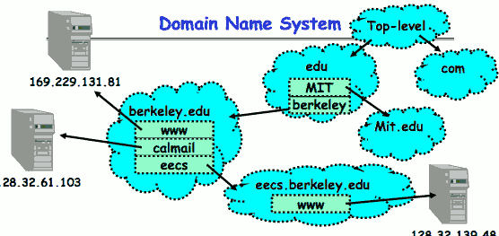

- DNS is a hierarchical mechanism for naming
    - Name divided in domains, right to left: www.eecs.berkeley.edu
- Each domain owned by a particular organization
    - Top level handled by ICANN (Internet Corporation for Assigned Numbers and Names)
    - Subsequent levels owned by organizations
- Resolution: series of queries to successive servers
- Caching: queries take time, so results cached for period of time

<h2 id="150186ba8cbc5a54acd7cb5cf61e8025"></h2>

## How Important is Correct Resolution?

- If attacker manages to give incorrect mapping:
    - Can get someone to route to server, thinking that they are routing to a different server
        - Get them to log into “bank” – give up username and password
- Is DNS Secure?
    - Definitely a weak link
        - What if “response” returned from different server than original query?
        - Get person to use incorrect IP address!
    - Attempt to avoid substitution attacks:
        - Query includes random number which must be returned 
- In July 2008, hole in DNS security located!
    - Dan Kaminsky (security researcher) discovered an attack that broke DNS globally
        - One person in an ISP convinced to load particular web page, then all users of that ISP end up pointing at wrong address
    - High profile, highly advertised need for patching DNS 
        - Big press release, lots of mystery
        - Security researchers told no speculation until patches applied

<h2 id="d5e238de3ec209bec453d8aef09d080e"></h2>

## Performance Considerations

- Before we continue, need some performance metrics
    - **Overhead:** CPU time to put packet on wire
    - **Throughput:** Maximum number of bytes per second
        - Depends on “wire speed”, but also limited by slowest router (routing delay) or by congestion at routers
    - **Latency:** time until first bit of packet arrives at receiver
        - Raw transfer time + overhead at each routing hop
    - 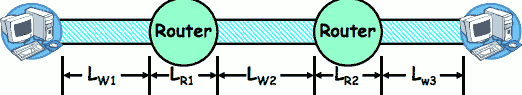
- Contributions to Latency
    - Wire latency: depends on speed of light on wire
        - about 1–1.5 ns/foot
    - Router latency: depends on internals of router
        - Could be < 1 ms (for a good router)
        - Question: can router handle full wire throughput?

<h2 id="5d6fca3fac25bbea2a7ca6be38053ac6"></h2>

## Sample Computations

- E.g.: Ethernet within Soda
    - Latency: speed of light in wire is 1.5ns/foot, which implies latency in building < 1 μs (if no routers in path)
    - Throughput: 10-1000Mb/s
    - Throughput delay: packet doesn’t arrive until all bits 
        - So: 4KB/100Mb/s = 0.3 milliseconds (same order as disk!)
- E.g.: ATM within Soda 
    - Latency (same as above, assuming no routing)
    - Throughput: 155Mb/s
    - Throughput delay: 4KB/155Mb/s = 200 μ
- E.g.: ATM cross-country
    - Latency (assuming no routing):
        - 3000miles * 5000ft/mile => 15 milliseconds
    - How many bits could be in transit at same time?
        - 15ms * 155Mb/s = 290KB
    - In fact, Berkeley -> MIT Latency ~ 45ms
        - 872KB in flight if routers have wire-speed throughput
- **Requirements for good performance:**
    - Local area: minimize overhead/improve bandwidth
    - Wide area: keep pipeline full!

<h2 id="fe9bf79396cb093675bcd87ba6ffe56d"></h2>

## Network Protocols

- **Protocol:** Agreement between two parties as to how information is to be transmitted
    - Example: system calls are the protocol between the operating system and application
    - Networking examples: many levels
        - Physical level: mechanical and electrical network (e.g. how are 0 and 1 represented)
        - Link level: packet formats/error control (for instance, the CSMA/CD protocol) 
        - Network level: network routing, addressing
        - Transport Level: reliable message delivery
- Protocols on today’s Internet:
    - 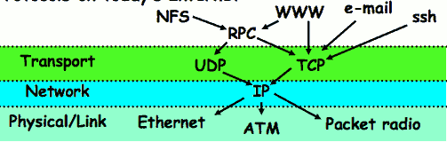

<h2 id="2de5d7f052bdd84866ff79135c2bcc58"></h2>

## Network Layering

- **Layering:**  building complex services from simpler ones
    - Each layer provides services needed by higher layers by utilizing services provided by lower layers
- The physical/link layer is pretty limited
    - Packets are of limited size (called the “Maximum Transfer Unit or MTU: often 200-1500 bytes in size)
    - Routing is limited to within a physical link (wire) or perhaps through a switch
- Our goal in the following is to show how to construct a secure, ordered, message service routed to anywhere
    - 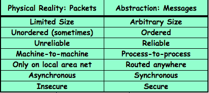

<h2 id="35a60297563ab91f4b231d31ba2ada3b"></h2>

## Building a messaging service

- Handling Arbitrary Sized Messages:
    - Must deal with limited physical packet size 
    - Split big message into smaller ones (called fragments)
        - Must be reassembled at destination
    - Checksum computed on each fragment or whole message
- Internet Protocol (IP): Must find way to send packets to arbitrary destination in network
    - Deliver messages unreliably (“best effort”) from one machine in Internet to another
    - Since intermediate links may have limited size, must be able to fragment/reassemble packets on demand
    - Includes 256 different “sub-protocols” build on top of IP
        - Examples: ICMP(1), TCP(6), UDP (17), IPSEC(50,51)

<h2 id="b6cc1459c243ac253323b35089dab87b"></h2>

## IP Packet Format

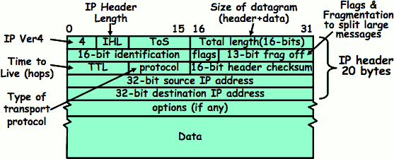

<h2 id="35a60297563ab91f4b231d31ba2ada3b"></h2>

## Building a messaging service

- Process to process communication
    - Basic routing gets packets from machine -> machine
    - What we really want is routing from process -> process
        - Add “ports”, which are 16-bit identifiers
        - A communication channel (connection) defined by 5 items: 
            - [source addr, source port, dest addr, dest port, protocol]
- UDP: The Unreliable Datagram Protocol
    - Layered on top of basic IP (IP Protocol 17)
        - **Datagram:** an unreliable, unordered, packet sent from source user -> dest user (Call it UDP/IP) 
        - 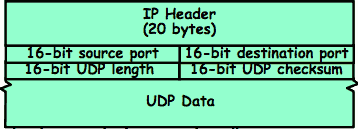
    - Important aspect: low overhead!
        - Often used for high-bandwidth video streams
        - Many uses of UDP considered “anti-social” – none of the “well-behaved” aspects of (say) TCP/IP

<h2 id="9199dae771f316f9a3e90a0046bb0758"></h2>

## Sequence Numbers

- Ordered Messages
    - Several network services are best constructed by ordered messaging
        - Ask remote machine to first do x, then do y, etc.
    - Unfortunately, underlying network is packet based:
        - Packets are routed one at a time through the network
        - Can take different paths or be delayed individually
    - IP can reorder packets! P0,P1 might arrive as P1,P0
- Solution requires queuing at destination 
    - Need to hold onto packets to undo misordering
    - Total degree of reordering impacts queue size
- Ordered messages on top of unordered ones:
    - Assign sequence numbers to packets
        - 0,1,2,3,4…..
        - If packets arrive out of order, reorder before delivering to user application
        - or instance, hold onto #3 until #2 arrives, etc.
    - Sequence numbers are specific to particular connection
        - Reordering among connections normally doesn’t matter
    - If restart connection, need to make sure use different range of sequence numbers than previously…c

<h2 id="83cf3f8245c0357abe77e7154b88ea69"></h2>

## Reliable Message Delivery: the Problem

- All physical networks can garble and/or drop packets
    - Physical media: packet not transmitted/received   
        - If transmit close to maximum rate, get more throughput – even if some packets get lost
        - If transmit at lowest voltage such that error correction just starts correcting errors, get best power/bit
    - Congestion: no place to put incoming packet
        - Point-to-point network: insufficient queue at switch/router
        - Broadcast link: two host try to use same link
        - In any network: insufficient buffer space at destination
        - Rate mismatch: what if sender send faster than receiver can process?
- Reliable Message Delivery on top of Unreliable Packets
    - Need some way to make sure that packets actually make it to receiver
        - Every packet received at least once
        - Every packet received at most once
    - Can combine with ordering: every packet received by process at destination exactly once and in order

<h2 id="9d3c809afd1b2930170860d0dbebb353"></h2>

## Using Acknowledgements

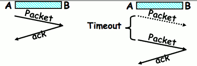

- How to ensure transmission of packets?
    - Detect garbling at receiver via checksum, discard if bad
    - Receiver acknowledges (by sending “ack”) when packet received properly at destination
    - Timeout at sender: if no ack, retransmit
- Some questions:
    - If the sender doesn’t get an ack, does that mean the receiver didn’t get the original message?
        - No
    - What if ack gets dropped? Or if message gets delayed?
        - Sender doesn’t get ack, retransmits. Receiver gets message twice, acks each.

 
<h2 id="6f8b794f3246b0c1e1780bb4d4d5dc53"></h2>

## Conclusion

- **DNS:** System for mapping from names => IP addresses
    - Hierarchical mapping from authoritative domains
    - Recent flaws discovered
- **Datagram:** a self-contained message whose arrival, arrival time, and content are not guaranteed
- Performance metrics
    - **Overhead:** CPU time to put packet on wire
    - **Throughput:** Maximum number of bytes per second
    - **Latency:** time until first bit of packet arrives at receiver 
- Ordered messages:
    - Use sequence numbers and reorder at destination
- Reliable messages:
    - Use Acknowledgements
- **TCP:** Reliable byte stream between two processes on different machines over Internet (read, write, flush)
    - Uses window-based acknowledgement protocol
    - Congestion-avoidance dynamically adapts sender window to account for congestion in network

---

<h2 id="097f836a49e3a196c1bdfca778384e04"></h2>

# Lecture 23 : Network Communication Abstractions / Distributed Programming

<h2 id="734c62df7a31ed5cd87d6f1e6a9db145"></h2>

## How to deal with message duplication

- Solution: put sequence number in message to identify re-transmitted packets
    - Receiver checks for duplicate #’s; Discard if detected
        - if you get a packet with the same sequence number, presumably you've gotten a duplicate.
- Requirements:
    - Sender keeps copy of unack’ed messages
        - Easy: only need to buffer messages
    - Receiver tracks possible duplicate messages
        - Hard: when ok to forget about received message?
- **Alternating-bit protocol:**
    - let's start with a  simple protocol 
    - Send one message at a time; don’t send next message until ack received
    - Sender keeps last message; receiver tracks sequence # of last message received
     
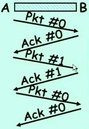

- Pros: simple, small overhead
- Con: Poor performance
    - Wire can hold multiple messages; want to fill up at (wire latency x throughput)
- Con: doesn't work if network can delay or duplicate messages arbitrarily
    - if packet 0 gets delayed for long enough, and then you eventually get back to sending packet 0 again. It's possible that an old package 0 and a new packet 0 could look alike.

<h2 id="048d5b9f156debfd6e9e0df35ef73d94"></h2>

## Better messaging: Window-based acknowledgements

- **Windowing protocol (not quite TCP):** 
    - Send up to N packets without ack
        - Allows pipelining of packets
        - Window size (N) < queue at destination
    - Each packet has sequence number
        - Receiver acknowledges each packet
        - Ack says “received all packets up to sequence number X”/send more

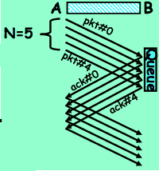

- Acks serve dual purpose: 
    - Reliability: Confirming packet received
    - Ordering: Packets can be reordered at destination
- What if packet gets garbled/dropped?
    - Sender will timeout waiting for ack packet
        - Resend missing packets => Receiver gets packets out of order!
    - Should receiver discard packets that arrive out of order?
        - Simple, but poor performance
    - Alternative: Keep copy until sender fills in missing pieces? 
        - Reduces # of retransmits, but more complex
- What if ack gets garbled/dropped? 
    - Timeout and resend just the un-acknowledged packets

<h2 id="712c97a373236b579081db769f2e26f0"></h2>

## Transmission Control Protocol (TCP)

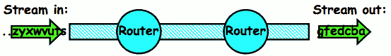

- Transmission Control Protocol (TCP)
    - TCP (IP Protocol 6) layered on top of IP
    - Reliable byte stream between two processes on different machines over Internet (read, write, flush)
- TCP Details
    - Fragments byte stream into packets, hands packets to IP
        - IP may also fragment by itself
    - Uses window-based acknowledgement protocol (to minimize state at sender and receiver)
        - “Window” reflects storage at receiver – sender shouldn’t overrun receiver’s buffer space
        - Also, window should reflect speed/capacity of network – sender shouldn’t overload network
    - Automatically retransmits lost packets
    - Adjusts rate of transmission to avoid congestion
        - A “good citizen”
            - it tries to make sure that nobody is dropping packets being overloaded. 

<h2 id="9ee07f82193171f545c07569c849fc4c"></h2>

## TCP Windows and Sequence Numbers

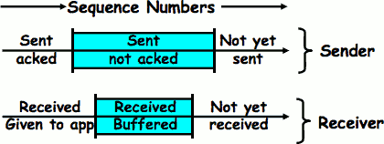

- Sender has three regions: 
    - Sequence regions
        - sent and ack’ed
        - Sent and not ack’ed
        - not yet sent
    - Window (colored region) adjusted by sender
- Receiver has three regions: 
    - Sequence regions
        - received and ack’ed (given to application)
        - received and buffered
        - not yet received (or discarded because out of order)

<h2 id="752bf5ab4629c71fba6167a3b3252d10"></h2>

## Window-Based Acknowledgements (TCP)

- Image where its sequence number is 100 , and we're about to send a packet
- so first thing is from previous transmissions we will have an acknowledgement that says we are at sequence number 100, this is back to the sender. 
- and there are 300 bytes of storage at the queue at the receiver side
- now suppose we try to send a packet
    - what I means is the user puts some bytes into the input socket, TCP divides it up into a packet , and for instance in this case it divided into a packet that if of size 40 and whose sequence number starts at 100.
    - that packet goes to the destination , now our sequence number at the destination is at 140, because we receive 40 bytes.
    - notice the ack that came back is simply says I'm acknowledging sequence number 140 , and there are only 260 bytes left in my queue. 
- so now if I send another packet , here's one where there's 50 bytes to send. 
    - the seq number is 140. 
    - what comes back for an ack ? I received up to 190, and there's 210 left. 
- we can select how big size of a packet to send and usually TCP sort of receives some data into the socket until a certain time is expired and then it choose to send the packet out. 
    - so the size is dynamically did not cause the receiver to wait too long. 
- **now** we send its seq number 230, size 30. 
    - we get back this ack of 190/210.  What happened here ? 
    - presumably I sent the chunk (190,40) but it never actually arrived at the destination.  here is a lost packet of size 40. 
    - seq number 190 didn't show up.  now the sequence number 230 showed up. 
    - notice the acknowledgment , a little different here. it's 190/210. All it's saying is I've only received all of my data up to sequence number 190, and after that sequence number there's 210 left.  Notice it did not acknowledge this packet. 
- ...
- at some point we get a timeout. at that point we know exactly what to rerasmit.  The acknowledgments are telling us what data is got. It got data at seq number 190. So the sender knows that it was this packet that was lost. 
- So we re-sent. Now notice what the acknowledgment did at this point. 
    - it says oh good I've received evertything up to 340 and only 60 bytes left. 
- finally we transmit the last couple of pieces and notice at this point we're acknowledging up to 400, and 0 left in the queue. What happens now ? 
    - now buffer is full at the receiver , the windows has complelely shut down and we will not send any more
    - how do we start opening the windows? 
        - At that point the receiver -- the process that's receiving -- has to start sucking things out and at that point we'll actually get an acknowledgement back that looks more like 400/20 

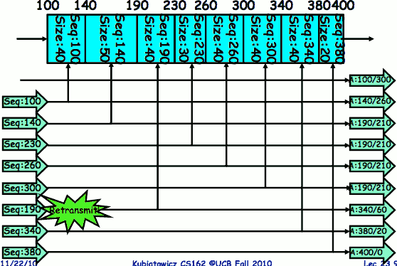

<h2 id="19422d661bbc4ae1b85c110603cece66"></h2>

## Selective Acknowledgement Option (SACK)

- Vanilla TCP Acknowledgement
    - Every message encodes Sequence number and Ack
        - that means anytime you send a packet you can also be acknowledging receiving packets.
        - in fact you don't even have to send an ack for every incoming packet.
    - Can include data for forward stream and/or ack for reverse stream
- Selective Acknowledgement
    - Acknowledgement information includes not just one number, but rather ranges of received packets
        - basically say something about exactly where the holes are , and what's received. 
    - Must be specially negotiated at beginning of TCP setup
        - Not widely in use (although in Windows since Windows 98)

<h2 id="051092838b6a9dd05b10e688a31060ee"></h2>

## Congestion Avoidance

- Congestion
    - How long should timeout be for re-sending messages?
        - Too long -> wastes time if message lost
        - Too short -> retransmit even though ack will arrive shortly 
    - Stability problem: more congestion => ack is delayed => unnecessary timeout => more traffic => more congestion
        - Closely related to window size at sender: too big means putting too much data into network
- How does the sender’s window size get chosen?
    - Must be less than receiver’s advertised buffer size
    - Try to match the rate of sending packets with the rate that the slowest link can accommodate
    - Sender uses an adaptive algorithm to decide size of N
        - Goal: fill network between sender and receiver
        - Basic technique: slowly increase size of window until acknowledgements start being delayed/lost
- TCP solution: “slow start” (start sending slowly)
    - If no timeout, slowly increase window size (throughput) by 1 for each ack received 
    - Timeout =>  congestion, so cut window size in half 
    - “Additive Increase, Multiplicative Decrease”

<h2 id="5cfa878082764510a7747ec1e56c5d58"></h2>

## Sequence-Number Initialization

- How do you choose an initial sequence number?
    - When machine boots, ok to start with sequence #0?
        - No: could send two messages with same sequence #!
            - you don't know whether you have just closed the previous connection , and there might still be packets in flight
        - Receiver might end up discarding valid packets, or duplicate ack from original transmission might hide lost packet
    - Also, if it is possible to predict sequence numbers, might be possible for attacker to hijack TCP connection
- Some ways of choosing an initial sequence number:
    - Time to live: each packet has a deadline
        - If not delivered in X seconds, then is dropped
        - Thus, can re-use sequence numbers if wait for all packets in flight to be delivered or to expire
    - Epoch #: uniquely identifies which set of sequence numbers are currently being used
        - Epoch # stored on disk, Put in every message
        - Epoch # incremented on crash and/or when run out of sequence #
    - Pseudo-random increment to previous sequence number
        - Used by several protocol implementations

<h2 id="87cd758891288ebba3176b567e28e316"></h2>

## Use of TCP: Sockets

- **Socket:** an abstraction of a network I/O queue
    - Embodies one side of a communication channel
        - Same interface regardless of location of other end
        - Could be local machine (called “UNIX socket”) or remote machine (called “network socket”)
     - First introduced in 4.2 BSD UNIX: big innovation at time
        - Now most operating systems provide some notion of socket
- Using Sockets for Client-Server (C/C++ interface):
    - On server: set up “server-socket”
        - Create socket, Bind to protocol (TCP), local address, port
        - Call listen(): tells server socket to accept incoming requests
        - Perform multiple accept() calls on socket to accept incoming connection request
        - Each successful accept() returns **a new socket** for a new connection; can pass this off to handler thread
    - On client: 
        - Create socket, Bind to protocol (TCP), remote address, port
        - Perform connect() on socket to make connection
        - If connect() successful, have socket connected to server

<h2 id="fc3dbe3e3a94b62da50694eed60c5514"></h2>

## Socket Setup (Con’t)

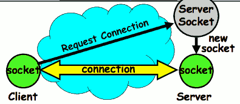

- Things to remember:
    - Connection involves 5 values:
        - [ Client Addr, Client Port, Server Addr, Server Port, Protocol ]
    - Often, Client Port “randomly” assigned
        - Done by OS during client socket setup
    - Server Port often “well known”
        - 80 (web), 443 (secure web), 25 (sendmail), etc
        - Well-known ports from 0--1023 
- Note that the uniqueness of the tuple is really about two Addr/Port pairs and a protocol
 
---

- sockets can be bound to TCP if you want to have as a stream in and stream out 
- or they can be bound to UDP in which case what you write a chunk of stuff to the socket on one side , and it comes as a packet to the other side and comes out as a chunk. 

<h2 id="f08a0c5ed12bbe6830815cd6005da5ce"></h2>

## Distributed Applications

- How do you actually program a distributed application?
    - Need to synchronize multiple threads, running on different machines 
        - No shared memory, so cannot use test&set
        - 
    - One Abstraction: send/receive messages
        - Already atomic: no receiver gets portion of a message and two receivers cannot get same message
- Interface:
    - Mailbox (mbox): temporary holding area for messages
        - Includes both destination location and queue
    - Send(message,mbox)
        - Send message to remote mailbox (queue)  identified by mbox
    - Receive(buffer,mbox)
        - Wait until mbox has message, copy into buffer, and return
        - If threads sleeping on this mbox, wake up one of them

<h2 id="18c72d71b52916649113b05f56176cec"></h2>

## Using Messages: Send/Receive behavior

- When should send(message,mbox) return?
    - When receiver gets message? (i.e. ack received)
    - When message is safely buffered on destination?
    - Right away, if message is buffered on source node?
- Actually two questions here:
    - When can the sender be sure that receiver actually received the message?
    - When can sender reuse the memory containing message?
- Mailbox provides 1-way communication from T1 -> T2
    - T1 -> buffer -> T2
    - Very similar to producer/consumer 
        - Send = V, Receive = P
        - However, can’t tell if sender/receiver is local or not!

<h2 id="e327f500a2224a9491f7242769760478"></h2>

## Messaging for Request/Response communication

- What about two-way communication?
    - Request/Response
        - Read a file stored on a remote machine
        - Request a web page from a remote web server
    - Also called: **client-server**
        - Client = requester, Server = responder
        - Server provides “service” (file storage) to the client

<h2 id="388f60d4b525c1360c27584291a7106c"></h2>

## General’s Paradox

- General’s paradox: 
    - Constraints of problem: 
        - Two generals, on separate mountains
        - Can only communicate via messengers
        - Messengers can be captured
    - Problem: need to coordinate attack
        - If they attack at different times, they all die
        - If they attack at same time, they win
    - Named after Custer, who died at Little Big Horn because he arrived a couple of days too early
- Can messages over an unreliable network be used to guarantee two entities do something simultaneously?
    - Remarkably, “no”, even if all messages get through
    - 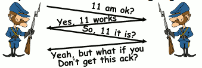
    - No way to be sure last message gets through!

<h2 id="76bb77f6a61692c6cdd1b078f2efe26f"></h2>

## Two-Phase Commit

- Since we can’t solve the General’s Paradox (i.e. simultaneous action), let’s solve a related problem
    - Distributed transaction: Two machines agree to do something, or not do it, atomically
- Two-Phase Commit protocol does this
    - Use a persistent, stable log on each machine to keep track of whether commit has happened
        - If a machine crashes, when it wakes up it first checks its log to recover state of world at time of crash
    - 1. Prepare Phase:
        - The global coordinator requests that all participants will promise to commit or rollback the transaction
        - Participants record promise in log, then acknowledge
        - If anyone votes to abort, coordinator writes “Abort” in its log and tells everyone to abort; each records “Abort” in log
    - 2. Commit Phase:
        - After all participants respond that they are prepared, then the coordinator writes “Commit” to its log
        - Then asks all nodes to commit; they respond with ack
        - After receive acks, coordinator writes “Got Commit” to log
    - Log can be used to complete this process such that all machines either commit or don’t commit

<h2 id="33e90a963f562f1fc7f8323b825b9c74"></h2>

### Two phase commit example

- Simple Example: A=WellsFargo Bank, B=Bank of America
    - Phase 1: **Prepare** Phase
        - A writes “Begin transaction” to log
            - A->B:  OK to transfer funds to me?
        - Not enough funds:
            - B->A:  transaction aborted; A writes “Abort” to log
        - Enough funds:
            - B: Write new account balance & promise to commit to log
            - B->A: OK, I can commit
    - Phase 2: A can decide for both whether they will **commit**
        - A: write new account balance to log
        - Write “Commit” to log
        - Send message to B that commit occurred; wait for ack
        - Write “Got Commit” to log
- What if B crashes at beginning?
    - Wakes up, does nothing; A will timeout, abort and retry
- What if A crashes at beginning of phase 2?
    - Wakes up, sees that there is a transaction in progress; sends “Abort” to B
- What if B crashes at beginning of phase 2?
    - B comes back up, looks at log; sees that it had already promised to commit , when it gets A's commit , it will say, “oh, ok, commit”

<h2 id="66913dbd4594ec5201af10bd1925f0aa"></h2>

## Distributed Decision Making Discussion

- Why is distributed decision making desirable?
    - Fault Tolerance!
    - A group of machines can come to a decision even if one or more of them fail during the process
        - Simple failure mode called “failstop” (different modes later)
    - After decision made, result recorded in multiple places
- Undesirable feature of Two-Phase Commit: Blocking
    - One machine can be stalled until another site recovers:
        - Site B writes “prepared to commit” record to its log, sends a “yes” vote to the coordinator (site A) and crashes
        - Site A crashes
        - Site B wakes up, check its log, and realizes that it has voted “yes” on the update. It sends a message to site A asking what happened. At this point, B cannot decide to abort, because update may have committed
        - B is blocked until A comes back
    - A blocked site holds resources (locks on updated items, pages pinned in memory, etc) until learns fate of update
- Alternative: There are alternatives such as “Three Phase Commit” which don’t have this blocking problem
- What happens if one or more of the nodes is malicious?
    - **Malicious**: attempting to compromise the decision making
    

<h2 id="6f8b794f3246b0c1e1780bb4d4d5dc53"></h2>

## Conclusion

- **TCP:** Reliable byte stream between two processes on different machines over Internet (read, write, flush)
    - Uses window-based acknowledgement protocol
    - Congestion-avoidance dynamically adapts sender window to account for congestion in network
- **Two-phase commit:** distributed decision making
    - First, make sure everyone guarantees that they will commit if asked (prepare)
    - Next, ask everyone to commit

---

<h2 id="fcdc007ff783dbd9743a00efcbffc113"></h2>

# Lecture 24: Distributed File Systems

<h2 id="1535a061d2792d321e26bc9bfae487ab"></h2>

## Byzantine General’s Problem

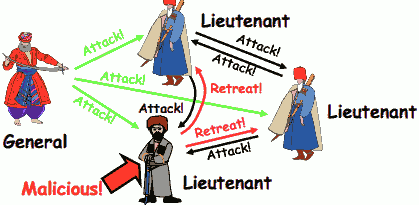

- Byazantine General’s Problem (n players):
    - One General
    - n-1 Lieutenants
    - Some number of these (f) can be insane or malicious
    - so the general says attack 
        - the problem is that none of the lieutenants can follow the order right away because they have to assume the general could be the insane one 
        - so what the lieutenants are going to have to do is talk amongest themselves and make a decision about what they should do. 
- The commanding general must send an order to his n-1 lieutenants such that: ( 2 major constraints  )
    - IC1: All loyal lieutenants obey the same order
    - IC2: If the commanding general is loyal, then all loyal lieutenants obey the order he sends
- the question is: how many insane folks can you deal with and there's some impossibility results 
    - 3 is not enough. If you have a general and 2 lieutenants basically there's no way for the good lieutenant to do anything useful if one of the lieutenants is malicious. 

---

- Impossibility Results:
    - Cannot solve Byzantine General’s Problem with n=3 because one malicious player can mess up things
    - 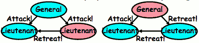
    - With f faults, need n > 3f to solve problem
- Various algorithms exist to solve problem
    - Original algorithm has #messages exponential in n
    - Newer algorithms have message complexity O(n²)
        - One from MIT, for instance (Castro and Liskov, 1999)
- Use of BFT (Byzantine Fault Tolerance) algorithm
    - Allow multiple machines to make a coordinated decision even if some subset of them (< n/3 ) are malicious
    - 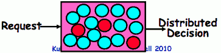
- how did we use this ? for instance in  a distributed file system
    - the request might be something like i'd like to commit this data and the decision would be a yes or or on the commit. 
    - if enough players properly decided to commit then it would be committed in a way that was guaranteed to be reconstructed and a good decision. 
    - so you can actually ask these players the lieutenants to do something like check access control and so on and make a distributed decision , and decide to vote basically to do that , and do the commit. 

<h2 id="7823b02b00549b08b9e7479a27712bcd"></h2>

## Remote Procedure Call

- Raw messaging is a bit too low-level for programming
    - Must wrap up information into message at source
    - Must decide what to do with message at destination
    - May need to sit and wait for multiple messages to arrive
- Better option: Remote Procedure Call (RPC)
    - Calls a procedure on a remote machine
    - Client calls:
        - remoteFileSystem->read(“rutabaga”);
    - Translated automatically into call on server:
        - fileSys->Read(“rutabaga”);
- Implementation:
    - Request-response message passing (under covers!)
    - “Stub” provides glue on client/server
        - Client stub is responsible for “marshalling” arguments and “unmarshalling” the return values
        - Server-side stub is responsible for “unmarshalling” arguments and “marshalling” the return values.
- **Marshalling** involves (depending on system)
    - Converting values to a canonical form, serializing objects, copying arguments passed by reference, etc. 

<h2 id="619ad21e81fa60f6f6b7ff4224879877"></h2>

## RPC Information Flow

<h2 id="9c6093f1125a29b60e00a00805a68826"></h2>

## RPC Details

- Equivalence with regular procedure call
    - Parameters <=> Request Message 
    - Result <=> Reply message
    - Name of Procedure: Passed in request message
    - Return Address: mbox2 (client return mail box) 
- Stub generator: Compiler that generates stubs
    - Input: interface definitions in an “interface definition language (IDL)”
        - Contains, among other things, types of arguments/return
    - Output: stub code in the appropriate source language
        - Code for client to pack message, send it off, wait for result, unpack result and return to caller
        - Code for server to unpack message, call procedure, pack results, send them off
- Cross-platform issues:
    - What if client/server machines are different architectures or in different languages?
        - Convert everything to/from some canonical form
        - Tag every item with an indication of  how it is encoded (avoids unnecessary conversions).

- How does client know which mbox to send to?
    - Need to translate name of remote service into network endpoint (Remote machine, port, possibly other info)
    - **Binding:** the process of converting a user-visible name into a network endpoint
        - This is another word for “naming” at network level
        - Static: fixed at compile time
        - Dynamic: performed at runtime
    - Dynamic Binding
        - Most RPC systems use dynamic binding via name service
            - Name service provides dynamic translation of service -> mbox
        - Why dynamic binding?
            - Access control: check who is permitted to access service
            - Fail-over: If server fails, use a different one
- What if there are multiple servers?
    - Could give flexibility at binding time
        - Choose unloaded server for each new client
    - Could provide same mbox (router level redirect)
        - Choose unloaded server for each new request
        - Only works if no state carried from one call to next
- What if multiple clients?
    - Pass pointer to client-specific return mbox in request

<h2 id="587682328c851d08e822e45af127ff21"></h2>

## Problems with RPC

- Non-Atomic failures
    - Different failure modes in distributed system than on a single machine
    - Consider many different types of failures
        - User-level bug causes address space to crash
        - Machine failure, kernel bug causes all processes on same machine to fail
        - Some machine is compromised by malicious party
    - Before RPC: whole system would crash/die
    - After RPC: One machine crashes/compromised while others keep working
    - Can easily result in inconsistent view of the world
        - Did my cached data get written back or not?
        - Did server do what I requested or not?
    - Answer? Distributed transactions/Byzantine Commit
- Performance
    - Cost of Procedure call << same-machine RPC <<  network RPC
    - Means programmers must be aware that RPC is not free
        - Caching can help, but may make failure handling complex

<h2 id="27deff3c4c33317556eb1e3dd687c4a0"></h2>

## Cross-Domain Communication/Location Transparency

- How do address spaces communicate with one another?
    - Shared Memory with Semaphores, monitors, etc…
    - File System
    - Pipes (1-way communication)
    - “Remote” procedure call (2-way communication)
- RPC’s can be used to communicate between address spaces on different machines or the same machine
    - Services can be run wherever it’s most appropriate
    - Access to local and remote services looks the same
- Examples of modern RPC systems:
    - CORBA (Common Object Request Broker Architecture)
    - DCOM (Distributed COM)
    - RMI (Java Remote Method Invocation)
 
PRC is a crucial part of how micro kernels work. 

<h2 id="a92be5b27fb0bbf79ae97a4fdd6f3295"></h2>

## Microkernel operating systems

- Example: split kernel into application-level servers.
    - File system looks remote, even though on same machine
        - so you're an application, you want to open a file, you're actually going to do RPC to the file system. 
    - 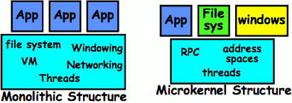
- Why split the OS into separate domains?
    - Fault isolation: bugs are more isolated (build a firewall)
    - Enforces modularity: allows incremental upgrades of pieces of software (client or server)
    - Location transparent: service can be local or remote
        - For example in the X windowing system: Each X client can be on a separate machine from X server; Neither has to run on the machine with the frame buffer.

<h2 id="ad416a4ba30fb9f91e5f56d6736c6ebb"></h2>

## Distributed File Systems

- Distributed File System: 
    - Transparent access to files stored on a remote disk
- Naming choices (always an issue):
    - Hostname:localname: Name files explicitly
        - No location or migration transparency
    - Mounting of remote file systems
        - System manager mounts remote file system by giving name and local mount point
        - Transparent to user: all reads and writes look like local reads and writes to user
            - e.g. **/users/sue/foo -> /sue/foo on server**
    - A single, global name space: every file in the world has unique name
        - Location Transparency: servers can change and files can move without involving user

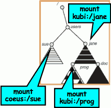

<h2 id="319d7097a96659bafd943e791369a2ba"></h2>

## Virtual File System (VFS)

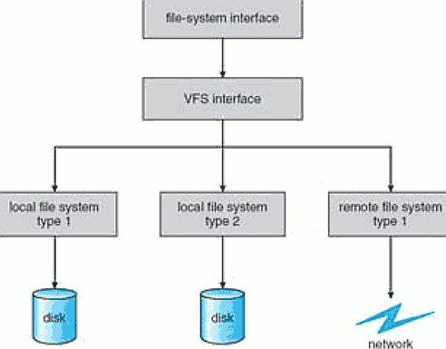

- **VFS:** Virtual abstraction similar to local file system
    - Instead of “inodes” has “vnodes”
    - Compatible with a variety of local and remote file systems
        - provides object-oriented way of implementing file systems
- VFS allows the same system call interface (the API) to be used for different types of file systems
    - The API is to the VFS interface, rather than any specific type of file system

<h2 id="42dcaa5f1e270cbc074827204d6cad5b"></h2>

## Simple Distributed File System

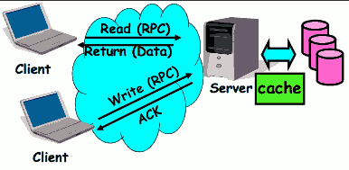

- Remote Disk: Reads and writes forwarded to server
    - Use RPC to translate file system calls
    - No local caching/can be caching at server-side
- Advantage: Server provides completely consistent view of file system to multiple clients
- Problems? Performance!
    - Going over network is slower than going to local memory
    - Lots of network traffic/not well pipelined
    - Server can be a bottleneck

<h2 id="0e4cb9f12d45adbc366ce89051b43dda"></h2>

## Use of caching to reduce network load

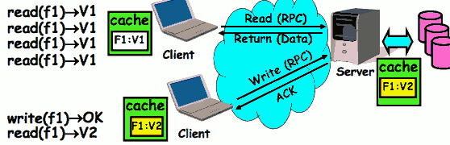

- Idea: Use caching to reduce network load
    - In practice: use buffer cache at source and destination
- Advantage: if open/read/write/close can be done locally, don’t need to do any network traffic…fast!
- Problems: 
    - Failure:
        - Client caches have data not committed at server
    - Cache consistency!
        - Client caches not consistent with server/each other

<h2 id="b7b1e314614cf326c6e2b6eba1540682"></h2>

## TODO 

TODO

