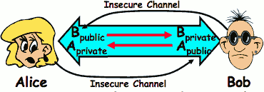

...menustart

- [Lecture 25: Protection and Security in Distributed Systems](#dd4f5d8cb4b41025e901f4ae927502e8)
    - [Protection vs Security](#aa07a73c112f134be3edd0f8e387f81e)
    - [Preventing Misuse](#54fbb3a1b74b50873051b15b8b9da112)
    - [Authentication: Identifying Users](#63e0e1d364470ca21bbc6d4c990f97ae)
    - [Passwords: Secrecy](#e3dc16e3792097354714fe74aa9384f5)
    - [Passwords: How easy to guess?](#0786a4f51927e5e2b11b53fc2768a706)
    - [Passwords: Making harder to crack](#02dc1108d133e67efac42b2d32170ca8)
    - [Passwords: Making harder to crack (con’t)](#d342af78f5bfec7714f01a8dc43c306d)
    - [Authentication in Distributed Systems](#f22527f1baffc1e0fc9181cac23fcaa5)
    - [Private Key Cryptography](#ae44d44e6a5e4084ce76b2ab48301ad7)
    - [Key Distribution](#94d63bc1b630cda150380f68db7a6396)
    - [Public Key Encryption Details](#81e3c1a0648ebc62dff7efb7651ea741)
    - [TODO](#b7b1e314614cf326c6e2b6eba1540682)

...menuend

<h2 id="dd4f5d8cb4b41025e901f4ae927502e8"></h2>

# Lecture 25: Protection and Security in Distributed Systems

<h2 id="aa07a73c112f134be3edd0f8e387f81e"></h2>

## Protection vs Security

- **Protection:** one or more mechanisms for controlling the access of programs, processes, or users to resources
    - Page Table Mechanism
    - File Access Mechanism
- **Security:** use of protection mechanisms to prevent misuse of resources
    - Misuse defined with respect to policy
        - E.g.: prevent exposure of certain sensitive information
        - E.g.: prevent unauthorized modification/deletion of data
    - Requires consideration of the external environment within which the system operates
        - Most well-constructed system cannot protect information if user accidentally reveals password
- What we hope to gain today and next time
    - Conceptual understanding of how to make systems secure
    - Some examples, to illustrate why providing security is really hard in practice

<h2 id="54fbb3a1b74b50873051b15b8b9da112"></h2>

## Preventing Misuse

- Types of Misuse:
    - Accidental:
        - If I delete shell, can’t log in to fix it!
        - Could make it more difficult by asking: “do you really want to delete the shell?”
    - Intentional:
        - Some high school brat who can’t get a date, so instead he transfers $3 billion from B to A.
        - Doesn’t help to ask if they want to do it (of course!)
- Three Pieces to Security
    - **Authentication:** who the user actually is
    - **Authorization:** who is allowed to do what
    - **Enforcement:** make sure people do only what they are supposed to do
- Loopholes in any carefully constructed system:
    - Log in as superuser and you’ve circumvented authentication
    - Log in as self and can do anything with your resources; for instance: run program that erases all of your files
    - Can you trust software to correctly enforce Authentication and Authorization?????

<h2 id="63e0e1d364470ca21bbc6d4c990f97ae"></h2>

## Authentication: Identifying Users

- How to identify users to the system?
    - Passwords
        - Shared secret between two parties
        - Since only user knows password, someone types correct password =>  must be user typing it
        - Very common technique
    - Smart Cards
        - Electronics embedded in card capable of providing long passwords or satisfying challenge  -> response queries
        - May have display to allow reading of password
        - Or can be plugged in directly; several credit cards now in this category
    - Biometrics
        - Use of one or more intrinsic physical or behavioral traits to identify someone
        - Examples: fingerprint reader, palm reader, retinal scan
        - Becoming quite a bit more common

<h2 id="e3dc16e3792097354714fe74aa9384f5"></h2>

## Passwords: Secrecy

- System must keep copy of secret to check against passwords
    - What if malicious user gains access to list of passwords?
        - Need to obscure information somehow 
    - Mechanism: utilize a transformation that is difficult to reverse without the right key (e.g. encryption)
- Example: UNIX /etc/passwd file
    - passwd -> one way transform(hash) -> encrypted passwd
    - System stores only encrypted version, so OK even if someone reads the file!
    - When you type in your password, system compares encrypted version
- Problem: Can you trust encryption algorithm?
    - Example: one algorithm thought safe had back door
        - Governments want back door so they can snoop
    - Also, security through obscurity doesn’t work
        - GSM encryption algorithm was secret; accidentally released; Berkeley grad students cracked in a few hours

<h2 id="0786a4f51927e5e2b11b53fc2768a706"></h2>

## Passwords: How easy to guess?

- Ways of Compromising Passwords
    - Password Guessing: 
        - Often people use obvious information like birthday, favorite color, girlfriend’s name, etc…
    - Dictionary Attack: 
        - Work way through dictionary and compare encrypted version of dictionary words with entries in /etc/passwd
    - Dumpster Diving:
        - Find pieces of paper with passwords written on them
        - (Also used to get social-security numbers, etc)
- Paradox: 
    - Short passwords are easy to crack
    - Long ones, people write down
- Technology means we have to use longer passwords
    - UNIX initially required lowercase, 5-letter passwords: total of 26⁵=10 million passwords
        - In 1975, 10ms to check a password -> 1 day to crack
        - In 2005, .01μs to check a password -> 0.1 seconds to crack
        - Even faster today (use multiple processors)
    - Takes less time to check for all words in the dictionary!

<h2 id="02dc1108d133e67efac42b2d32170ca8"></h2>

## Passwords: Making harder to crack

- How can we make passwords harder to crack?
    - Can’t make it impossible, but can help
- Technique 1: Extend everyone’s password with a unique number (stored in password file)
    - Called “salt”. UNIX uses 12-bit “salt”, making dictionary attacks 4096 times harder
    - Without salt, would be possible to pre-compute all the words in the dictionary hashed with the UNIX algorithm: would make comparing with /etc/passwd easy 
    - Also, way that salt is combined with password designed to frustrate use of off-the-shelf DES hardware
- Technique 2: Require more complex passwords
    - Make people use at least 8-character passwords with upper-case, lower-case, punctuation, and numbers
        - 70⁸ = 6x10¹⁴ = 6 million seconds = 69 days@0.01μs/check
    - Unfortunately, people still pick common patterns
        - e.g. Capitalize first letter of common word, add one digit
    
<h2 id="d342af78f5bfec7714f01a8dc43c306d"></h2>

## Passwords: Making harder to crack (con’t)

- Technique 3: Delay checking of passwords
    - If attacker doesn’t have access to /etc/passwd, delay every remote login attempt by 1 second
    - Makes it infeasible for rapid-fire dictionary attack
- Technique 4: Assign very long passwords
    - Long passwords or pass-phrases can have more entropy (randomness -> harder to crack)
    - Give everyone a smart card (or ATM card) to carry around to remember password
        - Requires physical theft to steal password
        - Can require PIN from user before authenticates self
    - Better: have smartcard generate pseudorandom number
        - Client and server share initial seed
        - Each second/login attempt advances to next random number
- Technique 5: “Zero-Knowledge Proof”
    - Require a series of challenge-response questions
        - Distribute secret algorithm to user
        - Server presents a number, say “5”; user computes something from the number and returns answer to server
        - Server never asks same “question” twice
    - Often performed by smartcard plugged into system

<h2 id="f22527f1baffc1e0fc9181cac23fcaa5"></h2>

## Authentication in Distributed Systems

- What if identity must be established across network?
    - Need way to prevent exposure of information while still proving identity to remote system
    - Many of the original UNIX tools sent passwords over the wire “in clear text”
        - E.g.: telnet, ftp, yp (yellow pages, for distributed login)
        - Result: Snooping programs widespread
- What do we need? Cannot rely on physical security!
    - **Encryption: Privacy, restrict receivers**
    - **Authentication: Remote Authenticity, restrict senders**

<h2 id="ae44d44e6a5e4084ce76b2ab48301ad7"></h2>

##  Private Key Cryptography

- Private Key (Symmetric) Encryption:
    - Single key used for both encryption and decryption
- **Plaintext:** Unencrypted Version of message
- **Ciphertext:** Encrypted Version of message
- Important properties
    - Can’t derive plain text from ciphertext (decode) without access to key
    - Can’t derive key from plain text and ciphertext
    - As long as password stays secret, get both secrecy and authentication
- Symmetric Key Algorithms: DES, Triple-DES, AES 

<h2 id="94d63bc1b630cda150380f68db7a6396"></h2>

## Key Distribution

- How do you get shared secret to both places?
    - For instance: how do you send authenticated, secret mail to someone who you have never met?
    - Must negotiate key over private channel 
        - Exchange code book
        - Key cards/memory stick/others
- Third Party: Authentication Server (like Kerberos)
    - Notation:
        - kₓᵧ is key for talking between x and y
        - (...)ᵏ means encrypt message (…) with the key K
        - Clients: A and B, Authentication server S
    - A asks server for key:
        - A -> S: [Hi! I’d like a key for talking between A and B]
        - Not encrypted. Others can find out if A and B are talking
    - Server returns session key encrypted using B’s key
        - S -> A: **Message** [ Use Kab (This is A! Use Kab )ksb ] ksa 
        - This allows A to know, “S said use this key”
    - Whenever A wants to talk with B
        - A -> B: **Ticket** [This is A! Use Kab ]ksb 
        - Now, B knows that Kab is sanctioned by S

<h2 id="81e3c1a0648ebc62dff7efb7651ea741"></h2>

## Public Key Encryption Details

- Idea: Kpublic can be made public, keep kprivate private
    - 
- Gives message privacy (restricted receiver):
    - Public keys (secure destination points) can be acquired by anyone/used by anyone
    - Only person with private key can decrypt message
- What about authentication?
    - Use combination of private and public key
    - Alice -> Bob: [(I’m Alice)Aprivate Rest of message]Bpublic
    - Provides restricted sender and receiver
- **But: how does Alice know that it was Bob who sent her Bpublic ? and vice versa ?

<h2 id="b7b1e314614cf326c6e2b6eba1540682"></h2>

## TODO

