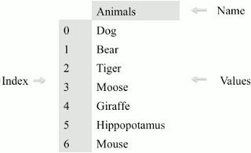
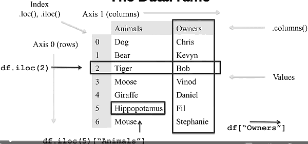
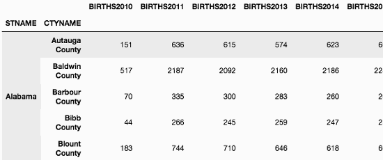

...menustart

- [Pandas](#251d2bbfe9a3b95e5691ceb30dc6784a)
- [Basic Data Processing with Pandas](#2beb23af04774d7f04142fdc60c1e388)
    - [The Series Data Structure](#b2d7146a323c3e1734532ceb0f3b8b85)
    - [Querying a Series](#8397ade4c8ed93da5a52c39691b7879e)
    - [The DataFrame Data Structure](#831bfe24989afb7977d21427c1cfa747)
    - [Dataframe Indexing and Loading](#17bcec63e2ffc6f28d1d43dc3bd736d3)
    - [Querying a DataFrame](#3c5b4efeb3926eb0d2e01d57122c4af8)
        - [Boolean masking](#c381bd7fc934be857f568d5a2990c95d)
    - [Indexing Dataframes](#c26698ba4e53d8440e2c2572357e9c84)
        - [Insert record to Dataframe](#2b134ac285731f9d66fccfb31a8be4e1)
        - [行选择和列选择小结](#ebae125e702774e5fc2e20a8dd47e231)
            - [行选择](#dca178c13c61d3a5ff6723592c7570eb)
        - [列选择](#c6e891c9937fb079fbb759e96c0eb44c)
    - [Missing Values](#4f62be1b7c56d639aec435b0d7e53b81)

...menuend


<h2 id="251d2bbfe9a3b95e5691ceb30dc6784a"></h2>


# Pandas 

<h2 id="2beb23af04774d7f04142fdc60c1e388"></h2>


# Basic Data Processing with Pandas

<h2 id="b2d7146a323c3e1734532ceb0f3b8b85"></h2>


## The Series Data Structure

 - You think of it a cross between a list and a dictionary. 
    - The items are all stored in an order and there's labels with which you can retrieve 
    - 

```python
import pandas as pd
pd.Series?
```

```python
animals = ['Tiger', 'Bear', 'Moose']
pd.Series(animals)
0    Tiger
1     Bear
2    Moose
dtype: object

numbers = [1, 2, 3]
pd.Series(numbers)
0    1
1    2
2    3
dtype: int64
```

 - Underneath panda stores series values in a typed array using the Numpy library. 
    - This offers significant speed-up when processing data versus traditional python lists. 
 - There's some other typing details that exist for performance that are important to know. 
    - The most important is how Numpy and thus pandas handle missing data.
    - In Python, we have the none type to indicate a lack of data. 
    - But what do we do if we want to have a typed list like we do in the series object? 

```python
animals = ['Tiger', 'Bear', None]
pd.Series(animals)
0    Tiger
1     Bear
2     None
dtype: object

numbers = [1, 2, None]
pd.Series(numbers)
0    1.0
1    2.0
2    NaN
dtype: float64
```

 - `NaN` is not `None` , and you can directly compare with `NaN`, use `np.isnan` instead

```python
import numpy as np
np.nan == None
False

np.nan == np.nan
False

np.isnan(np.nan)
True
```

 - Create from Dictionary

```python
sports = {'Archery': 'Bhutan',
          'Golf': 'Scotland',
          'Sumo': 'Japan',
          'Taekwondo': 'South Korea'}
s = pd.Series(sports)
s
Archery           Bhutan
Golf            Scotland
Sumo               Japan
Taekwondo    South Korea
dtype: object

s.index
Index(['Archery', 'Golf', 'Sumo', 'Taekwondo'], dtype='object')
```

 - You could also separate your index creation from the data by passing in the index as a list explicitly to the series

```python
s = pd.Series(['Tiger', 'Bear', 'Moose'], index=['India', 'America', 'Canada'])
s
India      Tiger
America     Bear
Canada     Moose
dtype: object
```

 - So what happens if your list of values in the index object are not aligned with the keys in your dictionary for creating the series? 

```python
sports = {'Archery': 'Bhutan',
          'Golf': 'Scotland',
          'Sumo': 'Japan',
          'Taekwondo': 'South Korea'}
s = pd.Series(sports, index=['Golf', 'Sumo', 'Hockey'])
s
Golf      Scotland
Sumo         Japan
Hockey         NaN   # missing value
dtype: object
```

<h2 id="8397ade4c8ed93da5a52c39691b7879e"></h2>


## Querying a Series

 - A panda.Series can be queried, either by the index position or the index label. 
    - To query by numeric location, starting at zero, use the `iloc` attribute.
    - To query by the index label, you can use the `loc` attribute.

```python
sports = {'Archery': 'Bhutan',
          'Golf': 'Scotland',
          'Sumo': 'Japan',
          'Taekwondo': 'South Korea'}
s = pd.Series(sports)
s
Archery           Bhutan
Golf            Scotland
Sumo               Japan
Taekwondo    South Korea
dtype: object

s.iloc[3]
'South Korea'

s.loc['Golf']
'Scotland'

s[3]  # same as iLoc
'South Korea'

s['Golf']  # same as Loc
'Scotland'
```

 - So what happens if your index is a list of integers? 
    - This is a bit complicated, and Pandas can't determine automatically whether you're intending to query by index position or index label. 
    - So you need to be careful when using the indexing operator on the series itself. 
    - And the safer option is to be more explicit and use the `iloc` `or` loc attributes directly. 

```python
sports = {99: 'Bhutan',
          100: 'Scotland',
          101: 'Japan',
          102: 'South Korea'}
s = pd.Series(sports)
s
99          Bhutan
100       Scotland
101          Japan
102    South Korea
dtype: object

s[0] # This won't call s.iloc[0] but generates an error
```

 - working with series
    - Pandas and the underlying NumPy libraries support a method of computation called vectorization. 

```python
s = pd.Series([100.00, 120.00, 101.00, 3.00])
total = np.sum(s)
total
324.0
```

```python
s = pd.Series(np.random.randint(0,1000,10000))
s.head()
0    350
1    862
2     86
3    604
4    310
dtype: int64

s+=2 #adds two to each item in s using broadcasting
s.head()
0    352
1    864
2     88
3    606
4    312
dtype: int64
```

 - iterate series , slow than broadcasting 

```python
for label, value in s.iteritems():
    s.set_value(label, value+2)
s.head()
```

 - If the value you pass in as the index doesn't exist, then a new entry is added. And keep in mind, indices can have mixed types. While it's important to be aware of the typing going on underneath, Pandas will automatically change the underlying NumPy types as appropriate. 

```python
s = pd.Series([1, 2, 3])
s.loc['Animal'] = 'Bears'
s
0             1
1             2
2             3
Animal    Bears
dtype: object
```

 - Up until now I've shown only examples of a series where the index values were unique. 
    - I want to end this lecture by showing an example where index values are not unique, and this makes data frames different, conceptually, that a relational database might be. 

```python
original_sports = pd.Series({'Archery': 'Bhutan',
                             'Golf': 'Scotland',
                             'Sumo': 'Japan',
                             'Taekwondo': 'South Korea'})
cricket_loving_countries = pd.Series(['Australia',
                                      'Barbados',
                                      'Pakistan',
                                      'England'], 
                                   index=['Cricket',
                                          'Cricket',
                                          'Cricket',
                                          'Cricket'])
all_countries = original_sports.append(cricket_loving_countries)

original_sports
Archery           Bhutan
Golf            Scotland
Sumo               Japan
Taekwondo    South Korea
dtype: object

cricket_loving_countries
Cricket    Australia
Cricket     Barbados
Cricket     Pakistan
Cricket      England
dtype: object

all_countries
Archery           Bhutan
Golf            Scotland
Sumo               Japan
Taekwondo    South Korea
Cricket        Australia
Cricket         Barbados
Cricket         Pakistan
Cricket          England
dtype: object

Cricket    Australia
Cricket     Barbados
Cricket     Pakistan
Cricket      England
dtype: object
```

 - There are a couple of important considerations when using append. 
    - First, Pandas is going to take your series and try to **infer** the best data types to use. 
        - In this example, everything is a string, so there's no problems here. 
    - Second, the append method **doesn't** actually change the underlying series.
        - It instead returns a new series which is made up of the two appended together. 
 - This is actually a significant issue for new Pandas users who are used to objects being changed in place. 
    - So watch out for it, not just with append but with other Pandas functions as well.  

---

<h2 id="831bfe24989afb7977d21427c1cfa747"></h2>


## The DataFrame Data Structure

 - The DataFrame is conceptually a two-dimensional series object
    - where there's an index and multiple columns of content, with each column having a label. 
    - In fact, the distinction between a column and a row is really only a conceptual distinction. 
    - And you can think of the DataFrame itself as simply a two-axes labeled array. 



```python
import pandas as pd
purchase_1 = pd.Series({'Name': 'Chris',
                        'Item Purchased': 'Dog Food',
                        'Cost': 22.50})
purchase_2 = pd.Series({'Name': 'Kevyn',
                        'Item Purchased': 'Kitty Litter',
                        'Cost': 2.50})
purchase_3 = pd.Series({'Name': 'Vinod',
                        'Item Purchased': 'Bird Seed',
                        'Cost': 5.00})
df = pd.DataFrame([purchase_1, purchase_2, purchase_3], index=['Store 1', 'Store 1', 'Store 2'])
df.head()

            Cost    Item Purchased  Name
Store 1     22.5    Dog Food        Chris
Store 1     2.5     Kitty Litter    Kevyn
Store 2     5.0     Bird Seed       Vinod

df.loc['Store 2']
Cost                      5
Item Purchased    Bird Seed
Name                  Vinod
Name: Store 2, dtype: object

type(df.loc['Store 2'])
pandas.core.series.Series

df.loc['Store 1']
            Cost    Item Purchased  Name
Store 1     22.5    Dog Food        Chris
Store 1     2.5     Kitty Litter    Kevyn

df.loc['Store 1', 'Cost']
Store 1    22.5
Store 1     2.5
Name: Cost, dtype: float64
```

 - What if we just wanted to do column selection and just get a list of all of the costs? 
 - There is a couple of options.
 - First, you can get a transpose of the DataFrame, using the capital T attribute, which swaps all of the columns and rows. 
    - This works, but it's pretty ugly. 

```python
df.T
                Store 1     Store 1         Store 2
Cost            22.5        2.5             5
Item Purchased  Dog Food    Kitty Litter    Bird Seed
Name            Chris       Kevyn           Vinod

df.T.loc['Cost']
Store 1         22.5
Store 1         2.5
Store 2         5
Name: Cost, dtype: object
```

 - Since iloc and loc are used for row selection, the Panda's developers reserved indexing operator directly on the DataFrame for column selection.
    - In a Panda's DataFrame, columns always have a name. 
    - So this selection is always label based, not as confusing as it was when using the square bracket operator on the series objects. 
    - For those familiar with relational databases, this operator is analogous to column projection. 
 - Finally, since the result of using the indexing operators, the DataFrame or series, you can chain operations together.
    - But chaining can come with some costs and is best avoided if you can use another approach. 
    - In particular, chaining tends to cause Pandas to return a copy of the DataFrame instead of a view on the DataFrame.

```python
df['Cost']
Store 1    22.5
Store 1     2.5
Store 2     5.0
Name: Cost, dtype: float64

df.loc['Store 1']['Cost']
Store 1    22.5
Store 1     2.5
Name: Cost, dtype: float64

df.loc[:,['Name', 'Cost']]
        Name    Cost
Store 1 Chris   22.5
Store 1 Kevyn   2.5
Store 2 Vinod   5.0
```

 - let's talk about dropping data. 
    - It's easy to delete data in series and DataFrames, and we can use the drop function to do so
    - The drop function doesn't change the DataFrame by default. And instead, returns to you a copy of the DataFrame with the given rows removed. 

```python
df.drop('Store 1') # won't change df
        Cost    Item Purchased  Name
Store   2 5.0   Bird Seed       Vinod

df
        Cost    Item Purchased  Name
Store 1 22.5    Dog Food        Chris
Store 1 2.5     Kitty Litter    Kevyn
Store 2 5.0     Bird Seed       Vinod
```

 - Let's make a copy with the copy method and do a drop on it instead. 
    - This is a very typical pattern in Pandas, where in place changes to a DataFrame are only done if need be, usually on changes involving indices. 
   
```python
copy_df = df.copy()
copy_df = copy_df.drop('Store 1')
copy_df
            Cost    Item Purchased  Name
Store   2   5.0     Bird Seed       Vinod
```

 - Drop has two interesting optional parameters. 
    - The first is called in place, and if it's set to true, the DataFrame will be updated in place, instead of a copy being returned. 
    - The second parameter is the axes, which should be dropped. By default, this value is 0, indicating the row axes. But you could change it to 1 if you want to drop a column. 

 - There is a second way to drop a column, however. And that's directly through the use of the indexing operator, using the del keyword. 

```python
del copy_df['Name']
copy_df
            Cost    Item Purchased
Store 2     5.0     Bird Seed
```

 - Finally, adding a new column to the DataFrame is as easy as assigning it to some value.

```python
df['Location'] = None
df
            Cost    Item Purchased  Name    Location
Store 1     22.5    Dog Food        Chris   None
Store 1     2.5     Kitty Litter    Kevyn   None
Store 2     5.0     Bird Seed       Vinod   None
```

---

<h2 id="17bcec63e2ffc6f28d1d43dc3bd736d3"></h2>


## Dataframe Indexing and Loading

 - The common work flow is to read your data into a DataFrame then reduce this DataFrame to the particular columns or rows that you're interested in working with.
 - Panda's toolkit tries to give you views on a DataFrame.
 - so you have to be aware that any changes to the DataFrame you're working on may have an impact on the base data frame you used originally. 
    - If you want to explicitly use a copy, then you should consider calling the copy method on the DataFrame for it first. 

---

 - like vim, Jupyter notebook can use `!` to run OS shell command.
 - pandas support file format lick csv, excel, html , ... and so on

```python
// read csv
df = pd.read_csv('olympics.csv')
df.head()

    1   2   3   4   5   6   7   8   9   10  11  12  13  14  15
0   NaN № Summer    01 !    02 !    03 !    Total   № Winter    01 !    02 !    03 !    Total   № Games 01 !    02 !    03 !    Combined total
1   Afghanistan (AFG)   13  0   0   2   2   0   0   0   0   0   13  0   0   2   2
2   Algeria (ALG)   12  5   2   8   15  3   0   0   0   0   15  5   2   8   15
3   Argentina (ARG) 23  18  24  28  70  18  0   0   0   0   41  18  24  28  70
4   Armenia (ARM)   5   1   2   9   12  6   0   0   0   0   11  1   2   9   12
```

 - Read csv has a number of parameters that we can use to indicate to Pandas how rows and columns should be labeled. 
    - let column 0 be index 
    - and skip the first one row
 - but change column index may lead to duplicated column name 
    - Panda will add  .1 and .2 to make things more unique. 

```python
df = pd.read_csv('olympics.csv', index_col = 0, skiprows=1)
df.head()

    № Summer    01 !    02 !    03 !    Total   № Winter    01 !.1  02 !.1  03 !.1  Total.1 № Games 01 !.2  02 !.2  03 !.2  Combined total
Afghanistan (AFG)   13  0   0   2   2   0   0   0   0   0   13  0   0   2   2
Algeria (ALG)   12  5   2   8   15  3   0   0   0   0   15  5   2   8   15
Argentina (ARG) 23  18  24  28  70  18  0   0   0   0   41  18  24  28  70
Armenia (ARM)   5   1   2   9   12  6   0   0   0   0   11  1   2   9   12
Australasia (ANZ) [ANZ] 2   3   4   5   12  0   0   0   0   0   2   3   4   5   12
```

 - But this labeling isn't really as clear as it could be, so we should clean up the data file.
    - Panda stores a list of all of the columns in the .columns attribute.
    - columns attribute. We can change the values of the column names by iterating over this list and calling the rename method of the data frame. 


```python
df.columns
Index(['№ Summer', '01 !', '02 !', '03 !', 'Total', '№ Winter', '01 !.1',
       '02 !.1', '03 !.1', 'Total.1', '№ Games', '01 !.2', '02 !.2', '03 !.2',
       'Combined total'],
      dtype='object')

for col in df.columns:
    if col[:2]=='01':
        df.rename(columns={col:'Gold' + col[4:]}, inplace=True)
    if col[:2]=='02':
        df.rename(columns={col:'Silver' + col[4:]}, inplace=True)
    if col[:2]=='03':
        df.rename(columns={col:'Bronze' + col[4:]}, inplace=True)
    if col[:1]=='№':
        df.rename(columns={col:'#' + col[1:]}, inplace=True)

df.head()


# Summer    Gold    Silver  Bronze  Total   # Winter    Gold.1  Silver.1    Bronze.1    Total.1 # Games Gold.2  Silver.2    Bronze.2    Combined total
Afghanistan (AFG)   13  0   0   2   2   0   0   0   0   0   13  0   0   2   2
Algeria (ALG)   12  5   2   8   15  3   0   0   0   0   15  5   2   8   15
Argentina (ARG) 23  18  24  28  70  18  0   0   0   0   41  18  24  28  70
Armenia (ARM)   5   1   2   9   12  6   0   0   0   0   11  1   2   9   12
Australasia (ANZ) [ANZ] 2   3   4   5   12  0   0   0   0   0   2   3   4   5   12
```

 - pandas provide powerful support on excel 
    - skiprows :  
    - skip_footer : 
    - usecols : specify columns to use
    - na_values : specify  which value will be reflected as np.NaN
    - converters : replace some content 

```python
def f(x):
    return x.rstrip( "1234567890" )

df = pd.read_excel("Energy Indicators.xls" , header=None, skiprows=18, skip_footer=283-245 , usecols=[2,3,4,5] ,na_values="..." ,
                  converters = { 2 : f } )
cnames= ['Country', 'Energy Supply', 'Energy Supply per Capita', '% Renewable']
for i,col in enumerate(df.columns): 
    df.rename( columns={col:cnames[i]}, inplace=True )
```

<h2 id="3c5b4efeb3926eb0d2e01d57122c4af8"></h2>


## Querying a DataFrame

<h2 id="c381bd7fc934be857f568d5a2990c95d"></h2>


### Boolean masking

 - Boolean masking is the heart of fast and efficient querying in NumPy. 
 - A Boolean mask is an array which can be of one dimension like a series, or two dimensions like a data frame, where each of the values in the array are either true or false. 
 - This array is essentially overlaid on top of the data structure that we're querying. 
    - And any cell aligned with the true value will be admitted into our final result, 
    - and any sign aligned with a false value will not. 

```python
// first step, create a boolean mask
df['Gold'] > 0
Afghanistan (AFG)                               False
Algeria (ALG)                                    True
Argentina (ARG)                                  True
Armenia (ARM)                                    True
Australasia (ANZ) [ANZ]                          True
Australia (AUS) [AUS] [Z]                        True
Austria (AUT)                                    True
Azerbaijan (AZE)                                 True
...

// then , use `where` function to apply boolean mask to dataframe
only_gold = df.where(df['Gold'] > 0)
only_gold.head()

# Summer    Gold    Silver  Bronze  Total   # Winter    Gold.1  Silver.1    Bronze.1    Total.1 # Games Gold.2  Silver.2    Bronze.2    Combined total
Afghanistan (AFG)   NaN NaN NaN NaN NaN NaN NaN NaN NaN NaN NaN NaN NaN NaN NaN
Algeria (ALG)   12.0    5.0 2.0 8.0 15.0    3.0 0.0 0.0 0.0 0.0 15.0    5.0 2.0 8.0 15.0
Argentina (ARG) 23.0    18.0    24.0    28.0    70.0    18.0    0.0 0.0 0.0 0.0 41.0    18.0    24.0    28.0    70.0
Armenia (ARM)   5.0 1.0 2.0 9.0 12.0    6.0 0.0 0.0 0.0 0.0 11.0    1.0 2.0 9.0 12.0
Australasia (ANZ) [ANZ] 2.0 3.0 4.0 5.0 12.0    0.0 0.0 0.0 0.0 0.0 2.0 3.0 4.0 5.0 12.0

only_gold['Gold'].count()
100
df['Gold'].count()
147

// Often we want to drop those rows which have no data. 
only_gold = only_gold.dropna()
only_gold.head()
    # Summer    Gold    Silver  Bronze  Total   # Winter    Gold.1  Silver.1    Bronze.1    Total.1 # Games Gold.2  Silver.2    Bronze.2    Combined total
Algeria (ALG)   12.0    5.0 2.0 8.0 15.0    3.0 0.0 0.0 0.0 0.0 15.0    5.0 2.0 8.0 15.0
Argentina (ARG) 23.0    18.0    24.0    28.0    70.0    18.0    0.0 0.0 0.0 0.0 41.0    18.0    24.0    28.0    70.0
```

 - we don't actually have to use the *where* function explicitly
 - pandas  allow the indexing operator to take a Boolean mask as a value instead of just a list of column names. 
 - and you can chain together a bunch of and/or statements in order to create more complex queries, and the result is a single Boolean mask. 


```python
only_gold = df[df['Gold'] > 0]
only_gold.head()
    # Summer    Gold    Silver  Bronze  Total   # Winter    Gold.1  Silver.1    Bronze.1    Total.1 # Games Gold.2  Silver.2    Bronze.2    Combined total
Algeria (ALG)   12  5   2   8   15  3   0   0   0   0   15  5   2   8   15
Argentina (ARG) 23  18  24  28  70  18  0   0   0   0   41  18  24  28  70

len(df[(df['Gold'] > 0) | (df['Gold.1'] > 0)])
101
df[(df['Gold.1'] > 0) & (df['Gold'] == 0)]
    # Summer    Gold    Silver  Bronze  Total   # Winter    Gold.1  Silver.1    Bronze.1    Total.1 # Games Gold.2  Silver.2    Bronze.2    Combined total
Liechtenstein (LIE) 16  0   0   0   0   18  2   2   5   9   34  2   2   5   9

df["Combined total"][(df['Gold.1'] > 0) & (df['Gold'] == 0)]
Liechtenstein (LIE)    9
Name: Combined total, dtype: int64

df[(df['Gold.1'] > 0) & (df['Gold'] == 0)]["Combined total"]
Liechtenstein (LIE)    9
Name: Combined total, dtype: int64
```

<h2 id="c26698ba4e53d8440e2c2572357e9c84"></h2>


## Indexing Dataframes

 - The index is essentially a row level label,in which case we get numeric values, or they can be set explicitly
 - Set index is a destructive process, it doesn't keep the current index. 
    - If you want to keep the current index, you need to manually create a new column and copy into it values from the index attribute. 

```python
# change index will lost our country info 
# because it is used as index 
# so we copy it , and add to dataframe as an extra column 
df['country'] = df.index  
# now change our index to "Gold"
df = df.set_index('Gold')
df.head()

# Summer    Silver  Bronze  Total   # Winter    Gold.1  Silver.1    Bronze.1    Total.1 # Games Gold.2  Silver.2    Bronze.2    Combined total  country
Gold
0   13  0   2   2   0   0   0   0   0   13  0   0   2   2   Afghanistan (AFG)
5   12  2   8   15  3   0   0   0   0   15  5   2   8   15  Algeria (ALG)
18  23  24  28  70  18  0   0   0   0   41  18  24  28  70  Argentina (ARG)
1   5   2   9   12  6   0   0   0   0   11  1   2   9   12  Armenia (ARM)
3   2   4   5   12  0   0   0   0   0   2   3   4   5   12  Australasia (ANZ) [ANZ]

```

 - You'll see that when we create a new index from an existing column it appears that a new first row has been added with empty values. 
 - This isn't quite what's happening because an empty value is actually rendered either as a none or an NaN if the data type of the column is numeric. 
 - What's actually happened is that the index has a name. 
    - Whatever the column name was in the Jupiter notebook has just provided this in the output. 
    - 所以这是没问题的？只是显示问题？
 
 - We can get rid of the index completely by calling the function `reset_index`
    - This promotes the index into a column and creates a default numbered index. 

```python
df = df.reset_index()
df.head()
Gold    # Summer    Silver  Bronze  Total   # Winter    Gold.1  Silver.1    Bronze.1    Total.1 # Games Gold.2  Silver.2    Bronze.2    Combined total  country
0   0   13  0   2   2   0   0   0   0   0   13  0   0   2   2   Afghanistan (AFG)
1   5   12  2   8   15  3   0   0   0   0   15  5   2   8   15  Algeria (ALG)
2   18  23  24  28  70  18  0   0   0   0   41  18  24  28  70  Argentina (ARG)
```

- One nice feature of pandas is that it has the option to do **multi-level indexing**
    - This is similar to composite keys in relational database systems. 
 - To create a multi-level index, we simply call set index and give it a list of columns that we're interested in promoting to an index. 

```python
df = pd.read_csv('census.csv')
df.head()
   SUMLEV  REGION  DIVISION    STATE   COUNTY  STNAME  CTYNAME CENSUS2010POP   ESTIMATESBASE2010   POPESTIMATE2010 ... RDOMESTICMIG2011    RDOMESTICMIG2012    RDOMESTICMIG2013    RDOMESTICMIG2014    RDOMESTICMIG2015    RNETMIG2011 RNETMIG2012 RNETMIG2013 RNETMIG2014 RNETMIG2015
0   40  3   6   1   0   Alabama Alabama 4779736 4780127 4785161 ... 0.002295    -0.193196   0.381066    0.582002    -0.467369   1.030015    0.826644    1.383282    1.724718    0.712594
1   50  3   6   1   1   Alabama Autauga County  54571   54571   54660   ... 7.242091    -2.915927   -3.012349   2.265971    -2.530799   7.606016    -2.626146   -2.722002   2.592270    -2.187333
2   50  3   6   1   3   Alabama Baldwin County  182265  182265  183193  ... 14.832960   17.647293   21.845705   19.243287   17.197872   15.844176   18.559627   22.727626   20.317142   18.293499

df['SUMLEV'].unique()
array([40, 50])

columns_to_keep = ['STNAME',
                   'CTYNAME',
                   'BIRTHS2010',
                   'BIRTHS2011',
                   'BIRTHS2012',
                   'BIRTHS2013',
                   'BIRTHS2014',
                   'BIRTHS2015',
                   'POPESTIMATE2010',
                   'POPESTIMATE2011',
                   'POPESTIMATE2012',
                   'POPESTIMATE2013',
                   'POPESTIMATE2014',
                   'POPESTIMATE2015']
df = df[columns_to_keep]
df.head()
    STNAME  CTYNAME BIRTHS2010  BIRTHS2011  BIRTHS2012  BIRTHS2013  BIRTHS2014  BIRTHS2015  POPESTIMATE2010 POPESTIMATE2011 POPESTIMATE2012 POPESTIMATE2013 POPESTIMATE2014 POPESTIMATE2015
1   Alabama Autauga County  151 636 615 574 623 600 54660   55253   55175   55038   55290   55347
2   Alabama Baldwin County  517 2187    2092    2160    2186    2240    183193  186659  190396  195126  199713  203709

df = df.set_index(['STNAME', 'CTYNAME'])
df.head()
```



 - now how to query this dataframe ?

```python
df.loc['Michigan', 'Washtenaw County']
BIRTHS2010            977
BIRTHS2011           3826
BIRTHS2012           3780
BIRTHS2013           3662
BIRTHS2014           3683

df.loc[ [('Michigan', 'Washtenaw County'),
         ('Michigan', 'Wayne County')] ]
                              BIRTHS2010  BIRTHS2011  BIRTHS2012  BIRTHS2013  BIRTHS2014  BIRTHS2015  POPESTIMATE2010 POPESTIMATE2011 POPESTIMATE2012 POPESTIMATE2013 POPESTIMATE2014 POPESTIMATE2015
STNAME       CTYNAME                                             
Michigan    Washtenaw County    977 3826    3780    3662    3683    3709    345563  349048  351213  354289  357029  358880
            Wayne County        5918    23819   23270   23377   23607   23586   1815199 1801273 1792514
```

<h2 id="2b134ac285731f9d66fccfb31a8be4e1"></h2>


### Insert record to Dataframe

```python
df = df.append(pd.Series(data={'Cost': 3.00, 'Item Purchased': 'Kitty Food'}, name=('Store 2', 'Kevyn')))
```

 - name : indicate the combine index
 - data : record data

<h2 id="ebae125e702774e5fc2e20a8dd47e231"></h2>


### 行选择和列选择小结

<h2 id="dca178c13c61d3a5ff6723592c7570eb"></h2>


#### 行选择

 - Pandas进行行选择一般有三种方法：
    - 连续多行的选择用类似于python的列表切片
    - 按照指定的索引选择一行或多行，使用loc[]
    - 按照指定的位置选择一行多多行，使用iloc[]

```python
# fandango 是Dataframe, 拥有数字索引 0,1,2...

n = fandango[1:3]  # include row index 1,2

p = fandango.loc[1:3]  # row 1,2,3 , caution!
u = df.loc[[1,3]]    # row 1,3 , 不连续

# remove row 1,2 
fandango_drop = fandango.drop([1,2], axis=0)
    0   1   2   3   4  
0   xxxx
3   xxxx
4   xxxx
...

# loc[2] will fail
s = fandango_drop.loc[2]

# iloc[2] still work
t = fandango_drop.iloc[2]  # return Series , cuz only 1 record
```

<h2 id="c6e891c9937fb079fbb759e96c0eb44c"></h2>


### 列选择

 - 列选择比较简单，只要直接把列名传递过去即可
 - 如果有多列的数据，要单独指出列名或列的索引号

```python
q = fandango['FILM']   # choose single column
r = fandango[['FILM','Metacritic']] # multi
v = fandango[[0,1,2]]  # by column index ... 
# 列索引并不支持切片
x = fandango[[0:5]]  # error
w = fandango[list(range(5))]  # works
```

---

<h2 id="4f62be1b7c56d639aec435b0d7e53b81"></h2>


## Missing Values

 - One of the handy functions that Pandas has for working with missing values is the filling function
    - This function takes a number or parameters, for instance, you could pass in a single value which is called a scalar value to change all of the missing data to one value. 
    - another important parameters is `method`. The two common fill values are ffill and bfill.
        - ffill is for forward filling and it updates an na value for a particular cell with the value from the previous row. 

```python
df = pd.read_csv('log.csv')
df
time    user    video   playback position   paused  volume
0   1469974424  cheryl  intro.html  5   False   10.0
1   1469974454  cheryl  intro.html  6   NaN NaN
2   1469974544  cheryl  intro.html  9   NaN NaN
3   1469974574  cheryl  intro.html  10  NaN NaN
4   1469977514  bob intro.html  1   NaN NaN
... 

df.fillna?
Signature: df.fillna(value=None, method=None, axis=None, inplace=False, limit=None, downcast=None, **kwargs)
Docstring:
Fill NA/NaN values using the specified method

Parameters
----------
value : scalar, dict, Series, or DataFrame

df = df.set_index('time')
df = df.sort_index()
df
    user    video   playback position   paused  volume
time
1469974424  cheryl  intro.html  5   False   10.0
1469974424  sue advanced.html   23  False   10.0
1469974454  cheryl  intro.html  6   NaN NaN
1469974454  sue advanced.html   24  NaN NaN

df = df.reset_index()
df = df.set_index(['time', 'user'])
df
    video   playback position   paused  volume
time    user
1469974424  cheryl  intro.html  5   False   10.0
sue advanced.html   23  False   10.0
1469974454  cheryl  intro.html  6   NaN NaN
sue advanced.html   24  NaN NaN
1469974484  cheryl  intro.html  7   NaN NaN
1469974514  cheryl  intro.html  8   NaN NaN

df = df.fillna(method='ffill')
df.head()
video   playback position   paused  volume
time    user                
1469974424  cheryl  intro.html  5   False   10.0
sue advanced.html   23  False   10.0
1469974454  cheryl  intro.html  6   False   10.0
sue advanced.html   24  False   10.0
1469974484  cheryl  intro.html  7   False   10.0
```


