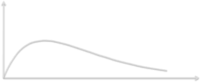
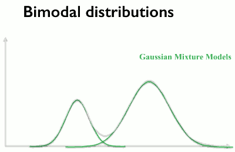

...menustart

 - [Statistical Analysis in Python and Project](#b12fdb9660ff87143953ef6b8062e5de)
     - [Distributions](#8c88565cb04f9c9f8cb8c9cb9309d1f2)
     - [More Distributions](#0e8df8dbf98a41a0f9b074ae6afbb382)
         - [five different characteristics of distributions](#9b3ddce31a3cfefd07476ea6ac4e9049)
     - [Book : Think Stats , free PDF provided](#87ef7fa2fecf7675715d8ca701fab666)
     - [Hypothesis Testing in Python](#a776871f9fd445962837a4dc94b0eb74)

...menuend


<h2 id="b12fdb9660ff87143953ef6b8062e5de"></h2>


# Statistical Analysis in Python and Project

<h2 id="8c88565cb04f9c9f8cb8c9cb9309d1f2"></h2>


## Distributions

 - numpy 提供了大量的方法，可以帮助模拟分布

```python
import pandas as pd
import numpy as np
np.random.binomial(1000, 0.5)/1000
0.484

chance_of_tornado = 0.01/100
np.random.binomial(100000, chance_of_tornado)
9

# 连续两天遇到台风的概率
# this process is called "sampling the distribution"
chance_of_tornado = 0.01

tornado_events = np.random.binomial(1, chance_of_tornado, 1000000)

two_days_in_a_row = 0
for j in range(1,len(tornado_events)-1):
    if tornado_events[j]==1 and tornado_events[j-1]==1:
        two_days_in_a_row+=1

print('{} tornadoes back to back in {} years'.format(two_days_in_a_row, 1000000/365))
104 tornadoes back to back in 2739.72602739726 years
```

<h2 id="0e8df8dbf98a41a0f9b074ae6afbb382"></h2>


## More Distributions

 - expected value
 - variance
    - Variance is a measure of how badly values of  samples are spread out from the mean.

<h2 id="9b3ddce31a3cfefd07476ea6ac4e9049"></h2>


### five different characteristics of distributions

 - 1. distribution central tendency
    - where the bulk of probability is in the distribution
    - the measures we would use for this are mode, median, or mean
 - 2. variability
    - There are a couple of ways we can speak of this. 
    - The standard deviation is one, the interquartile range is another.
        - The standard deviation is simply a measure of how different each item, in our sample, is from the mean. 

```python
distribution = np.random.normal(0.75,size=1000)
np.std(distribution)`
0.99370704889590811
```

 - 3. kurtosis 
    - the shape of the tales of the distribution 
    - A negative value means the curve is slightly more flat than a normal distribution,  and a positive value means the curve is slightly more peaky than a normal distribution. 

```python
import scipy.stats as stats
stats.kurtosis(distribution)
-0.0481732500281975
```

 - 4. Skew
    - We could also move out of the normal distributions and push the peak of the curve one way or the other.And this is called the skew. 



```python
stats.skew(distribution)
-0.02312572376329887

chi_squared_df2 = np.random.chisquare(2, size=10000)
stats.skew(chi_squared_df2)
2.05722695332399

chi_squared_df5 = np.random.chisquare(5, size=10000)
stats.skew(chi_squared_df5)
1.1655454249202595
```

 - 5. modality. 
    - So far, all of the distributions I've shown have a single high point, a peak. But what if we have multiple peaks? 



<h2 id="87ef7fa2fecf7675715d8ca701fab666"></h2>


## Book : Think Stats , free PDF provided

<h2 id="a776871f9fd445962837a4dc94b0eb74"></h2>


## Hypothesis Testing in Python

 - Hypothesis : A statement we can test
    - Alternativ hypothesis: Our idea, e.g. there is a difference between groups
    - Null hypothesis: The alternative of our idea, e,g. there is no difference between groups

```python
df = pd.read_csv('grades.csv')
df.head()
early = df[df['assignment1_submission'] <= '2015-12-31']
late = df[df['assignment1_submission'] > '2015-12-31']

early.mean()
assignment1_grade    74.972741
assignment2_grade    67.252190
assignment3_grade    61.129050
assignment4_grade    54.157620
assignment5_grade    48.634643
assignment6_grade    43.838980
dtype: float64

late.mean()
assignment1_grade    74.017429
assignment2_grade    66.370822
assignment3_grade    60.023244
assignment4_grade    54.058138
assignment5_grade    48.599402
assignment6_grade    43.844384
dtype: float64
```
 
 - the difference seems very small ?
 

 - Critical Value alpha
    - The threshold as to how much chance you are willing to accept
    - Typical values in social sciences are 0.1 , 0.05, or 0.01

```python
from scipy import stats
stats.ttest_ind(early['assignment1_grade'], late['assignment1_grade'])
Ttest_indResult(statistic=1.400549944897566, pvalue=0.16148283016060577)
```

 - The result is a two with a test statistic and a p-value. 
 - The p-value here is much larger than our 0.05. 
    - So we cannot reject the null hypothesis, which is that the two populations are the same. 
    - we would say that there's no statistically significant difference between these two sample means. 

---

 - **p-hacking** , or Dredging
    - Doing many tests until you find one which is of statistical significance
    - At a confidence level of 0.05, we expect to find one positive result I time out of 20 tests
    - Remedies:
        - Bonferroni correction
        - Hold-out sets
        - Investigation pre-registration


