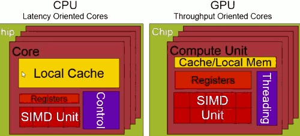
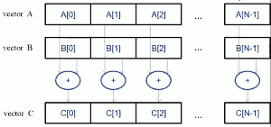
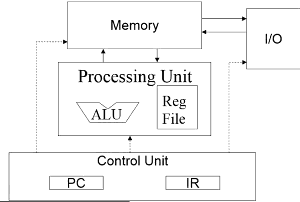
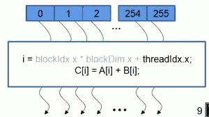
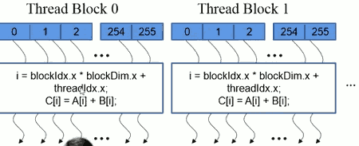
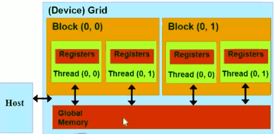

...menustart

- [Week 1](#d6f637a63e7895f9421d593d67341644)
    - [1.1: Course Overview](#2cdeeb8374a080a7972a9b075f99dcff)
    - [1.2: Introduction to Heterogeneous Parallel Computing](#cf9294220a0762a8cececdf70c4ea74d)
        - [CPU vs GPU](#aa7c7d5b4c30ec637fd00228d3ea2c8a)
        - [CPU: Latency Oriented Design](#6c88a57a4b326d3113cd17afa653818c)
        - [GPU : Throughput Oriented Design](#1e9ce0b6e6533573d50acdf2f1218504)
        - [Winning Applications Use Both CPU and GPU](#b9676d64f54e4404bc56bf2aa97ce266)
    - [1.3: Portability and Scalability in Heterogeneous Parallel Computing](#f5a7578445f570db14a004a201c288cc)
    - [1.4: Introduction to CUDA, Data Parallelism and Threads](#58169605407651f9f0bc706aaf8f8935)
        - [Basic concept of CUDA](#f9312ad800b52c07be7869572e85b704)
    - [1.5 Introduction to CUDA, Memory Allocation and Data Movement API Functions](#c345dcdd0f1480d0615c23660e8ead7f)
        - [Partial overview of CUDA memories](#647c4e8c47a9d998a27047d5905c78b8)
        - [CUDA Device Memory Management API](#bee998a5f82c060231c5da13b586e5da)
        - [Host-Device Data Transfer API](#d3c85cba12bf184449321d9fcf98e23d)
        - [Check Error](#249193c955d9a399e5b6d394f125f4ca)
    - [1.6: Introduction to CUDA, Kernel-Based SPMD Parallel Programming](#c7516ab5ae95323c88e6ba2f6c5a9e87)
        - [Vector Addition Kernel *Device Code*:](#cc0101d6edf97bca2b29489bd7690fb8)
        - [Vector Addition Kernel *Host Code*:](#0a3b4fb126a9ddf3c6bad83a6ee3fa2a)
        - [More on kernel launch *Host Code*:](#8703cc93226ad97ddcc6875e0769e4b1)
        - [Kernel execution in a nutshell](#23b200f11b54fdd1900c87c76b1d1728)
        - [More on CUDA Function Declarations](#5fa4b3ab59c14a578c48d78a5822a0e8)
        - [Compile A CUDA Program](#923b0c37c56ea509b884446ce8f3e4b5)
    - [1.7: Kernel-based Parallel Programming, Multidimensional Kernel Configuration](#e1042c6b86d63348a1cf26537f0f9c21)
        - [Precessing a Picture with a 2D Grid](#a5760ea6ff2d89622a671912f7dccbae)
    - [1.8: Kernel-based Parallel Programming, Basic Matrix-Matrix Multiplication](#a12044933b22603657e15aa252c723b1)

...menuend


<h2 id="d6f637a63e7895f9421d593d67341644"></h2>


## Week 1

<h2 id="2cdeeb8374a080a7972a9b075f99dcff"></h2>


### 1.1: Course Overview 

Recommended Textook/Notes

 1. D.Kirk and W.Hwu : Programming Massively Parallel Processors - A Hands-on Approach ,2nd Edition
 2. Lab assignments 
 3. NVDIA :  NVidia CUDA C Programming Guide v5.0

<h2 id="cf9294220a0762a8cececdf70c4ea74d"></h2>


### 1.2: Introduction to Heterogeneous Parallel Computing 

- to learn the major difference between latency devices (CPU cores) and throughput devices (GPU cores)
- to understand why winning applications increasingly use both types of devices

<h2 id="aa7c7d5b4c30ec637fd00228d3ea2c8a"></h2>


#### CPU vs GPU




 1. CPU has more local cache
 2. GPU has a large number of registers , mostly to support a large number of threads.
 3. GPU tends to have large number of SIMD execution units.
    - Single Instruction Multiple Data，单指令多数据流，能够复制多个操作数，并把它们打包在大型寄存器的一组指令集。
 4. CPU tends to have sophisticated control logic and therefore there is a big purple block labelled as control
 5. GPU tends to have very simple control but a large number of threads to manage.

<h2 id="6c88a57a4b326d3113cd17afa653818c"></h2>


#### CPU: Latency Oriented Design

- Powerful ALU (Arithmetic Logic Units 算术逻辑单元)
    - Reduced operation latency
- Large caches
    - Convert long latency memory accesses to short latency cache accesses 
- Sophisticated control
    -  Branch prediction for reduced branch latency
    -  Data forwarding for reduced data latency

<h2 id="1e9ce0b6e6533573d50acdf2f1218504"></h2>


#### GPU : Throughput Oriented Design

- Small caches
    - To boost memory throughput , the cache not used for future data acceses, but designed for as staging units for a large number of threads.
- Simple Control
    - No branch prediction
    - No data forwarding
- Energy efficient ALUs
    - Many , long latency but heavily pipelined for high throughput 
- Require massive number of threads to tolerate latencies.
    - 多个线程可以同时请求一个数据，这些请求会被打包成一个请求, 这样latency 就被分摊了。

<h2 id="b9676d64f54e4404bc56bf2aa97ce266"></h2>


#### Winning Applications Use Both CPU and GPU

- CPUs for sequential parts where latency matters
    - CPUs can be 10+X faster then GPUs for sequential code 
- GPUs for parallel parts where throughput wins
    - GPUs can be 10+X faster than CPUs for paralled code


<h2 id="f5a7578445f570db14a004a201c288cc"></h2>


### 1.3: Portability and Scalability in Heterogeneous Parallel Computing

In future , software development cost growing much faster than hardware cose. So future system must minimize software redevelopment. This leads to the consideration of scalability and portability.

Keys to Software Cost Control:

- Scalability
    - The same application runs efficiently on new generations of cores (coreA 2.0)
    - The same application runs efficiently on more of the same cores ( coreA *4 )
- Portability
    - The same application runs efficiently on different types of cores (coreA, coreB, coreC)
    - The samp application runs efficiently on systems with different organizations and interfaces


<h2 id="58169605407651f9f0bc706aaf8f8935"></h2>


### 1.4: Introduction to CUDA, Data Parallelism and Threads

CUDA C , a heterogeneous parallel programming interface that enables exploitation of data parallelism

- Hierarchical thread organization
- Main interfaces for launching parallel execution
- Thread index to data index mapping

The phenomena of data parallelism is that , different parts of the data can actually be processed independently of each other. 



A very simple example is vector addition. When we add 2 vector together, the elements can be added together independently.
 
<h2 id="f9312ad800b52c07be7869572e85b704"></h2>


#### Basic concept of CUDA

The parallel execution model of CUDA , close to Open CL, are both based on a host plus device kind of arrangement. The basic concept is that when we start executing a piece of code or application , the application will be executing on the host. The host is typically a CPU core. And when we start to execute a parallel part of the application , that's when we start to have an opportunity to use a throughput oriented device. This is done by writing some specialized functions called kernel functions. The kernel functions are very similar to functions in the C programming language. The execution will go between host and device , device in CUDA means parallel execution device , and most of the time, the device are correspond to throughput-oriented GPUs.

CUDA is really a programming language at the C level. It actually designed as an extension to the C language. More recently , more and more of the C++ features are also available in CUDA. 

- An Instruction Set Architecture (ISA) is a contract between the hardware and the software.
- As the name suggests, it is a set of instructions that the architecture (hardware) can execute.
- A programm is a set of instructions stored in memory that can be read, interpreted , and executed by the hardware.
- Program instructions operate on data stored in memory or provide by I/O device.

---

Von-Neumann Processor:



A thread is a "virtualized" and "abstracted" Von-Neumann Processor. 

The kernel function we describe is that program. And the hardware will actually generate a large number of these Von-Neumann processors.

The number of real processors may be much ,much smaller than the threads that a CUDA program will create. Some of them will be actively executing and some of them will not be actively execution, can this is what we called **context switching**.

- A CUDA kernel is executed by a ***grid*** (array) of threads
    - All threads in a grid run the same kernel code (SPMD)
    - Each thread has indexed that it uses to compute memory addresses and make control decisions

---

How A Single Thread Block Work:

threads 0-255:



执行同一份代码的threads 称为 thread block. All the thread will run the same code. But every thread has a different thread index value, that is used to compute memory addressed and make controlled decisions.

In this example, there's 256 thread in the thread block , each of them have an unique thread index from 0 to 255. Thereis a piece of code in the kernel, showing as the middle box. That box first calculates i variable based on the thread index. This i variable is actually private.

How Multiple Thread Blocks Work:



- Divide thread array into mulitple blocks
- Threads within a block cooperate via **shared memory**(exchange data), **atomic operations** (update same variable) , and **barrier synchronization**(屏障同步 to force others to wait)
- Threads in different blocks do not interact

Here every thread not only have a thread index , but also have a block index.  There are predefined CUDA variables that we can use in a kernel , and they actually are initialized by the hardware for each thread.

In this case, block dimension is 256.
 
---


The thread index and block index are not just one-dimensional. In CUDA, block index can be a 1D, 2D, or 3D variable. So each thread index can also be 1D,2D or 3D. ( 9D max ? ) This is why use should use name.x to calclate *i* , *x* means the first dimension, *y* means the 2nd one. 

![Multidimensional][1]

Multidimensional index is very convenient for image processing, or solve three-dimensional partial differential equations, and so on.


<h2 id="c345dcdd0f1480d0615c23660e8ead7f"></h2>


### 1.5 Introduction to CUDA, Memory Allocation and Data Movement API Functions

Vector addition:

Normal C:

```c
void vecAdd(float* h_A,float* h_B,float* h_C,int n){
    int i;
    for (i=0;i<n;i++) {
        h_C[i] = h_A[i] + h_B[i];
    }
}
void mian() {
    vecAdd( h_A, h_B, h_C , N );
}
```

Parallel CUDA code:

```c
#include <cuda.h>
void vecAdd(float* h_A,float* h_B,float* h_C,int n){
    int size = n*sizeof(float);
    float* d_A,d_B,d_C ;
    
    1. Allocate device memory for A,B and C , 
       copy A and B to device memory
    2. Kernel launch code - the device performs the 
       actual vector addition
    3. copy C from the device memory
}
```


Instead of performing the actual computation, this function is actually going to call a kernel function that will be executed on the device , and before calling that function , this functio also needs to do some outsourcing activity. It needs to copy data from the host memory into the device memory , so that the device is ready to precess data. And eventually after the device completes its computation it needs to copy the data's C vector back into the host memory.

<h2 id="647c4e8c47a9d998a27047d5905c78b8"></h2>


#### Partial overview of CUDA memories




- device code can
    - R/W per-thread **register**
    - R/W all-shared **global memory**
- host code can 
    - Transfer data to/from per grid **global memory** 

Each device have many many threads, remember , these threads are actually virtualized Von Neumann processors. So you can think about these threads as processors.  And each of processor will have a set of registers. These registers hold variables that are private to the thread.

All threads will have access to a shared global memory. It's important that the host code can actually allocate memory in the global memory, and also request data copy between *host memory* and *global memory*. 

<h2 id="bee998a5f82c060231c5da13b586e5da"></h2>


#### CUDA Device Memory Management API 

- cudaMalloc()
    - Allocates object in the device global memory
    - 2 parameters
        - **address of a pointer** to the allocated object
            - 和标准c的malloc函数不同,c malloc返回一个指针, cudaMalloc()需要提供一个指针的指针(地址)。
            - 之所以有这个区别，是因为**all the CUDA API functions returen error code**.
        - **size of** allocated object in terms of bytes
- cudaFree()
    - Free object from device global memory
    - takes 1 parameter:
        -  **pointer** to freed object
            - 注意和cudaMalloc()参数的区别。

<h2 id="d3c85cba12bf184449321d9fcf98e23d"></h2>


#### Host-Device Data Transfer API

- cudaMemcpy()
    - memory data transfer
    - Require 4 parameters
        - pointer to destination
        - pointer to source
        - number of bytes to be copy
        - Type/Direction of transfer
    - Transfer to device is asyncronous


```c
#include <cuda.h>
void vecAdd(float* h_A,float* h_B,float* h_C,int n){
    int size =n*sizeof(float);
    float* d_A, d_B, d_C ;
    
    cudaMalloc( (void**) %d_A , size );
    cudaMemcpy(d_A,h_A,size,cudaMemcpyHostToDevice);
    cudaMalloc( (void**) %d_B , size );
    cudaMemcpy(d_B,h_B,size,cudaMemcpyHostToDevice);
    cudaMalloc( (void**) %d_C , size );
    cudaMemcpy(d_C,h_C,size,cudaMemcpyHostToDevice);
    
    //kernel invocation code - to be shown later
    
    cudaMemcpy(h_C,d_C,size,cudaMemcpyDeviceToHost);
    cudaFree(d_A);cudaFree(d_B);cudaFree(d_C);
}
```

In general , when we actually try to get performance from this kind of code, we can not afford to copy data back and forth before and after each kernel invocation. For real applications , we tend to have all data just reside in the device memory and we just keep launching kernels to perform computation on the device memory.  This example is just show you all the pieces of that can be involved.

<h2 id="249193c955d9a399e5b6d394f125f4ca"></h2>


#### Check Error

In practise , I will encourage you to always check for error conditions.

```c
cudaError_t err = cudaMalloc( (void**)&d_A,size );

if (err != cudaSuccess) {
    printf( "%s in %s at line %d\n" ,
      cudaGetErrorString(err) ,
      __FILE__ , __LINE__; )
    exit(EXIT_FAILURE);
}
```
   
<h2 id="c7516ab5ae95323c88e6ba2f6c5a9e87"></h2>


### 1.6: Introduction to CUDA, Kernel-Based SPMD Parallel Programming


<h2 id="cc0101d6edf97bca2b29489bd7690fb8"></h2>


#### Vector Addition Kernel *Device Code*:

Declare a CUDA kernel:

```c
// Compute vector sum C=A+B
// Each thread performs one pair-wise(配对) addition

__global__
void vecAddKernel(float* A, float* B, float* C, int n) {
    int i= threadIdx.x+blockDim.x*blockIdx.x ;
    if (i<n) C[i]=A[i]+B[i];
}
```

This is the vector addition kernel that we will eventually be launching from the host code.

- **__global__** keyword
    - Every CUDA kernel function needs to be preceded by `__global__`
    - `__global__` tells the compile that it's a kernel function


<h2 id="0a3b4fb126a9ddf3c6bad83a6ee3fa2a"></h2>


#### Vector Addition Kernel *Host Code*:


```c
// only 1 demensional grids
int vecAdd(float* h_A, float* h_B, float* h_C , int n) {
    // d_A, d_B, d_C allocations and copies omitted
    ...
    
    // 2nd part , launch a kernel
    // run ceil(n/256.0) blocks of 256 threads each
    vecAddKernel <<< ceil(n/256.0) , 256>>>(d_A,d_B,d_C , n );
}
```
 

- **<<< ceil(n/256.0) , 256>>>**
    - we need supply a configuration parameter set to the kernel
    - here we actually have 2 configuration parameters
        1. number of blocks in the grid
        2. number of threads in a block 
    - in other words, we want to have 256 threads in each thread-block, if n=1000, we actually generates 1024 threads to work ,so in vecAddKernel function above, the index **i** may >=1000, eg.1023 . So it's very necessary to test `if (i<n)`.


<h2 id="8703cc93226ad97ddcc6875e0769e4b1"></h2>


#### More on kernel launch *Host Code*:

```c
int vecAdd(float* h_A, float* h_B, float* h_C , int n) {
    dim3 DimGrid( (n-1)/256+1,1,1 );
    dim3 DimBlock( 256,1,1 ) ;
    vecAddkernel<<<DimGrid,DimBlock>>>(d_A,d_B,d_C,n);
}
```

- dim3 only means that a variable has 3 parts (x,y,z) , each part is a integer value
- DimGrid / DimBlock to initialize the x,y,z value
- in this case, we're using a 1-D grid, we only need to initialize the x-values of both the DimGrid and DimBlock.
 
<h2 id="23b200f11b54fdd1900c87c76b1d1728"></h2>


#### Kernel execution in a nutshell

In the host code, you have a host function, the host function can launch a kernel by calling the kernel function just like any other C function, but with additional configuration parameters.

Once we launched a kernel, we call the kernel function, then the hardware will generate a grid of threads to execute the kernel function. Every thread will execute this kernel function(可能有多余的线程).

All the threads have built-in variables: blockIdx, blockDim and threadIdx , there predefined, preinitialized will allow the threads to generate different data indices, so that each thread will be processing a different part of the data.

<h2 id="5fa4b3ab59c14a578c48d78a5822a0e8"></h2>


#### More on CUDA Function Declarations

 keyword | Example | Execute on | Only callable from
--- | --- | --- | ---
 `__device__` | float DeviceFunc() | Device | Device
 `__global__` | void KernelFunc()  | Device | Host
 `__host__` | float HostFunc()   | Host  | Host
 
 
- kernel function must return **void**
- `__device__` / `__host__` can be used together
    - It will be compiled into a host function,also compiled into a device function, and the function can be used in both the host and device. 
- `__host__` is optional if used alone
- `__device__` keyword tells compile that is a device function.
 

<h2 id="923b0c37c56ea509b884446ce8f3e4b5"></h2>


#### Compile A CUDA Program

In very file, we're going to have both host function and device function, so the NVCC , the Nvidia C Compile, will automatically identify all the host function and kernels functions and separate them out into two complication paths.

The host function will go through the host path ,will be compiled by a host C compile and linker , such as GCC, such as Intel ICC, and so on.

The second one path is for the device function or the kernel functions. And the functions are compiled into a binary file format called PTX , which is very similar to java bytecode.

At run time, there is a JIT compile that will take the PTX binary and generate the real ISA, instruction set architecture, binary for that particular device that you are using.

So then both types of executables will be used for this Heterogeneous Computing Platform, the host path will be used on CPU , while the device binary will be run ont GPU.


<h2 id="e1042c6b86d63348a1cf26537f0f9c21"></h2>


### 1.7: Kernel-based Parallel Programming, Multidimensional Kernel Configuration

![Multidimensional][1]

This picture was shown earlier , and we assume that user has specified that we're going to generate a 2-D grid which is reflected by the 2-D indices of the blocks. And then we also assume that each block has 3-D threads. So each thread in this picture has tree indices.

<h2 id="a5760ea6ff2d89622a671912f7dccbae"></h2>


#### Precessing a Picture with a 2D Grid

a 62\*76 picture.

We assume that we're going to be using a 16\*16 thread block , 16 threads in the y , 16 threads in the x , to process the picture.

So we need launch in total 4 threads blocks in the y to cover all the 62 pixels , so that we have 64 threads.

In the x dimension, we're going to need to launch 5 thread blocks, that will give us 80 threads.

**Source code of a PictureKernel**:

```c
__global__ void PictureKernel( float* d_Pin, float* d_Pout, int n, int m ) {
    int Row = blockIdx.y * blockDim.y + threadIdx.y;
    int Col = blockIdx.x * blockDIm.x + threadIdx.x;
    
    if ( (Row<m) && (Col <n) ) {
        d_Pout( Row*n + Col ) = 2.0 * d_Pin( Row*n + Col );
    }
}
```

**Host Code for Launching PictureKernel**

```c
// assume picture is mxn
// input d_Pin has been allocated on and copied to device
// out d_Pin has been allocated on device
...
dim3 DimGrid( (n-1)/16 +1 ,  (m-1)/16 +1 , 1 ) ;
dim3 DimBlock( 16,16,1 ) ;
PictureKernel <<< DimGrid , DimBlock >>> (d_Pin , d_Pout , m,n) ;
```


<h2 id="a12044933b22603657e15aa252c723b1"></h2>


### 1.8: Kernel-based Parallel Programming, Basic Matrix-Matrix Multiplication

一个矩阵乘法的例子

---

  [1]: ../imgs/multiple_dimension_array_of_parallel_threads.png


