...menustart

 - [Week 2](#65c4ba2387f7eb9eb19a3404f6e9e578)
     - [Lecture 2.1: Kernel-based Parallel Programming - Thread Scheduling](#0002eb0b09283b59a8dfd367e68f2828)
         - [the Von-Neumann model with SIMD units](#585e29d9c9ba7bf2c1b5471e7378a866)
         - [Warps(变形) as Scheduling Units](#a90029d0415e65f69dd99367923c951a)
         - [Warp Example](#789c3a65c368f07af19c9140ed4fcee9)
         - [Block Granularity Considerations](#80b1f47d5a822a86d12e6c89a809528c)
     - [Lecture 2.2: Control Divergence](#4bbd287817b082c0c66c8d3511e8561c)
         - [How thread blocks are partitioned](#839b56bd18fadb576e93f6cad503342c)
         - [Control Flow Instructions](#3a61428f682a64764c8ee10cb08047c9)
         - [Control Divergence Examples](#2b5d215bd8a777456df7e1798de92043)
     - [Lecture 2.3: Memory Model and Locality -- CUDA Memories](#1f0e12d8037b1360b152b3919758c50f)
         - [Shared Memory in CUDA](#1219239487fe58703cbeef6926565678)
         - [Hardware view of CUDA memory](#b219e36479cf5b980f9392c55e0ebf6c)
         - [A Common Programming Strategy](#3183ab10ebc57b727dff3bb7ab220612)
         - [Matrix Multiplication Kernel Shared Memory Variable Declaration](#7d42b61796363f73a5cb34b3454dd847)
     - [Lecture 2.4: Tiled Parallel Algorithms](#fa264df43ed0c870866e5a1189dfca2d)
         - [Outline of Tiling Technique](#c9f42b2d9c227c29799c484b06381309)
     - [Lecture 2.5: Tiled Matrix Multiplication](#df7f258b3c190a7786a73969f40c7876)
         - [Tiled Matrix Multiplication](#e6bb7ec2f47353d90a937519a9bbdcd0)
         - [Loading a Tile](#54c3487cbed905442216bd53f2aa807d)
         - [Phase 0 Load for Block (0,0)](#e7ae5e8476caaef36b7b325efe6ea38f)
         - [Phase 1 Load for Block (0,0)](#4e844bfec02b6eb7144678d613169a5e)
         - [Barrier Synchronization](#05f6e5f0aec3c722b0c365e005707ab6)
     - [Lecture 2.6: Tiled Matrix Multiplication Kernel](#8c20d72295f054dfec39cceaff3d05b6)
         - [First-order Size Considerations](#d341490ecbbce14eba0d2e9cf03b4fcd)
         - [Shared Memory and Threading](#b26dad104ff5019d6d087dec37d62783)
         - [Device Query](#afb88027399d01d622718722195efb3b)
     - [Lecture 2.7: Handling Boundary Conditions in Tiling](#632e348b2be685fb56cf013fe7edea7e)
         - [Handling Matrix of Arbitrary Size](#36163dc0760ea3b315915b599cd4fa2b)
         - [Major Cases in Toy Example](#81697492e4e1b62b3f2352852d2c0fb8)
     - [Lecture 2.8: A Tiled Kernel for Arbitrary Matrix Dimensions](#8d2db0c8d46de05bfb88b8206028adca)
         - [A “Simple” Solution](#980269dfb458cf354a27f8af783f6cc1)
         - [Boundary Condition for Input A Tile](#f19c19580a27edbfffc35f335206a7d3)
         - [Boundary Condition for Input B Tile](#c99cbcd4928e3eed824dec8e069f9af9)
         - [Loading Elements – with boundary check](#bcadae33273a0da5fc70f9ec2e3e311e)

...menuend


<h2 id="65c4ba2387f7eb9eb19a3404f6e9e578"></h2>


## Week 2

<h2 id="0002eb0b09283b59a8dfd367e68f2828"></h2>


### Lecture 2.1: Kernel-based Parallel Programming - Thread Scheduling 

The thread are actually executed by a hardware called **streaming multiprocessor** or SM, and these streaming multiprocessors are very similar to the CPU cores in a CPU design.

 - Threads are assigned to **Streaming Multiprocessors(SM)** in block granularity(粒度)
    - that is , all threads in the same block would be assigned to the same SM.
    - Up to **8** blocks to each SM as resource allows, This is a language level constraint.
    - Fermi generation SM can take up to 1536 threads
        - could be 256 (threads/block) * 6 blocks
        - or 512 (threads/block) * 3 blocks
 - SM maintains thread/block index
 - SM manages / schedules thread execution

<h2 id="585e29d9c9ba7bf2c1b5471e7378a866"></h2>


#### the Von-Neumann model with SIMD units

In a CUDA hardware, it actually implements a **SIMD(Single Instruction Multiple Data)** extention to the Von-Neumann processor model.

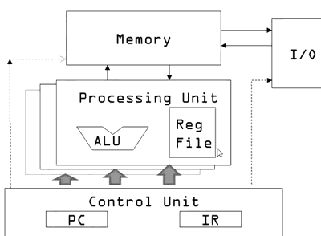

Multiple Processing Units controlled by the same control signals that the control unit sends out.

<h2 id="a90029d0415e65f69dd99367923c951a"></h2>


#### Warps(变形) as Scheduling Units

 - Each block is executed as 32-thread warps
    - execute each warp as a SIMD unit 
    - An implementation decision,not part of the CUDA programming model
    - Warps are scheduling units in SM
    - Threads in a Warp executed in SIMD
        - so 32 of these CUDA threads will actually be executed in the SIMD execution mode.

<h2 id="789c3a65c368f07af19c9140ed4fcee9"></h2>


#### Warp Example

 - If 3 blocks are assigned to an SM and each block has 256 threads, how many Warps are there in an SM ?
    - Each Block is divided into 256/32 = 8 Warps
    - There are 8\*3 = 24 Warps

Every time a warp is executs, all the 32 threads will be executed by the SIMD unit at the same time.

<h2 id="80b1f47d5a822a86d12e6c89a809528c"></h2>


#### Block Granularity Considerations

 - For matrix multiplication using multiple blocks, should I use 8x8,16x16,32x32 blocks for Fermi ?
    - For 8x8, we have 64 threads per Block. Since each SM can take up to 1536 threads, there are 24 Blocks. Howerer, each SM can only take up to 8 Blocks, only 512 threads will go into each SM!
    - for 16x16, we have 256 threads per Block. Since each SM can take up to 1536 threads,it can take up to 6 Blocks and achieve full capacity unless other resource considerations overrule.
    - For 32x32, we would have 1024 threads per Block. Only one block can fit into an SM for Fermi. Using only 2/3 of the thread capacity of an SM. Also, this works for CUDA 3.0 and beyond, but too large for some early CUDA versions.

<h2 id="4bbd287817b082c0c66c8d3511e8561c"></h2>


### Lecture 2.2: Control Divergence 

<h2 id="839b56bd18fadb576e93f6cad503342c"></h2>


#### How thread blocks are partitioned

 - Thread blocks are partitioned into warps
    - Thread IDs within a warp are consecutive(连续的) and increasing
    - Warp 0 starts with Thread ID 0
 - Partitioning is always the same
    - Thus you can use this knowledge in control flow
    - Howere, the exact size of warps may change from generation to generation 
    - Covered nect
 - DO NOT rely on any ordering within or between warps
    - If there are any dependencies  between thread, you must __syncthreads() to get correct result(more later) 

<h2 id="3a61428f682a64764c8ee10cb08047c9"></h2>


#### Control Flow Instructions

 - Main performance concern with branching is  **control divergence**
    - Threads within a single warp take different paths
 - Different execution paths are serialized in current GPUs
    - The control paths taken by the threads in a warp are traversed one at a time until there is no more.
 
 - Example of GPU shader
 - If your shaders must use branches, follow these recommendations:
    - Best performance: Branch on a constant known when the shader is compiled.
    - Acceptable: Branch on a uniform variable.
    - Potentially slow: Branch on a value computed inside the shader.
 - Eliminate Loops for performance

<h2 id="2b5d215bd8a777456df7e1798de92043"></h2>


#### Control Divergence Examples
    
 - Divergence can arise only when **branch condition is a function(or condition) of thread indices**
 - Example with divergence:
    - If (threadIdx.x >2 ) {} 
    - This creates 2 different control paths for threads in a block
    - Branch granularity < warp size;  threads 0,1,2 follow different path than the rest of the threads in the first warp
 - Example without divergence:
    - If (blockIdx.x >2 ) {}
    - Branch granularity is a multiple of blocks size; all threads in any given warp follow the same path.


<h2 id="1f0e12d8037b1360b152b3919758c50f"></h2>


### Lecture 2.3: Memory Model and Locality -- CUDA Memories

Programmer View of CUDA memory:

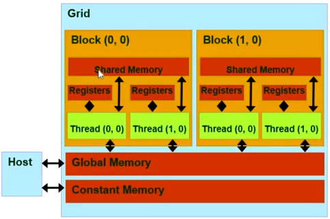

Declaring CUDA Variables:

 declaration | Memory | Scope | Lifetime 
 --- | --- | --- | ---
 int LocalVar ; | register | thread | thread
 ***__device__*** \__shared__ int SharedVar ; | shared | block | block
 \__device__ int GlobalVar ; | global | grid | application
 ***__device__*** \__constant__ int ContantVar; | constant | grid | application
 

 - \__device__ is optional when used with \__shared__ or \__constant__
 - automatic variables reside in a register
    - Except ***pre-thread arrays*** that reside in global memory
    - 所以如果想让数组运行在shared memory ,需要额外申明

如果一个线程修改了global memory，the change may not be immediately visible to other threads and thread blocks. Until the kernel terminates.
    
<h2 id="1219239487fe58703cbeef6926565678"></h2>


#### Shared Memory in CUDA

 - A special type of memory whose contents are explicitly declared and used in the source code
    - One in each SM
    - Accessed at much higher speed( in both latency and throughout ) than global memory
    - Still accessed by memory access instructions
    - A form of scratchpad memory in computer architecture

<h2 id="b219e36479cf5b980f9392c55e0ebf6c"></h2>


#### Hardware view of CUDA memory

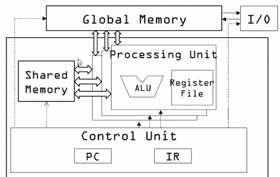

<h2 id="3183ab10ebc57b727dff3bb7ab220612"></h2>


#### A Common Programming Strategy

 - Partition data into ***subsets*** or ***tiles*** that fit into shared memory
 - Use ***one thread block*** to handle each tile by:
    - Loading the tile from global memory to shared memory, ***using multiple threads***
    - Performing the computation on the subset from shared memory reducing traffic to the global memory
    - Upon completion , writing results from shared memory to global memory

<h2 id="7d42b61796363f73a5cb34b3454dd847"></h2>


#### Matrix Multiplication Kernel Shared Memory Variable Declaration

```
__global__ void MatrxMulKernel( int m , int n , int k, ...  )
{
    __shared__ float ds_A[TILE_WIDTH][TILE_WIDTH]
    __shared__ float ds_B[TILE_WIDTH][TILE_WIDTH]
```
    
<h2 id="fa264df43ed0c870866e5a1189dfca2d"></h2>


### Lecture 2.4: Tiled Parallel Algorithms

 - divide global memory content into tiles
 - focus the computation of threads on one or a small number of tiles at each point in time

按交通为例, Tiled Parallel Algorithms 就是把相同行程的客人座同一辆车，从而减少车的总量，缓解交通压力。

所以好的情况是客人都拥有相同的 schedule, 坏的情况是客人的schedule 都不同。

**Same as threads/block:**

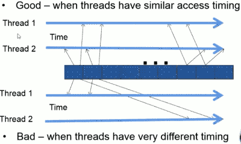

<h2 id="c9f42b2d9c227c29799c484b06381309"></h2>


#### Outline of Tiling Technique

 - Identify a tile of global memory content that are accessed by multiple threads
 - Load the tile from global memory into on-chip memory
 - Have the multiple threads to access their data from the on-chip memory
 - Move the on-chip memory

<h2 id="df7f258b3c190a7786a73969f40c7876"></h2>


### Lecture 2.5: Tiled Matrix Multiplication

<h2 id="e6bb7ec2f47353d90a937519a9bbdcd0"></h2>


#### Tiled Matrix Multiplication

 - Break up the execution of the kernel into phases so that the data accesses in each phase are focused on one tile of A and one tile of B

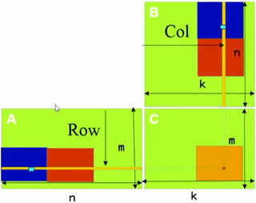

<h2 id="54c3487cbed905442216bd53f2aa807d"></h2>


#### Loading a Tile

 - All threads in a block participate
    - Each thread loads one A element and one B element in tiled code 
 - Assign the loaded element to each thread such that the accesses within each warp is coalesced(合并) into a DRAM burst(more later)

<h2 id="e7ae5e8476caaef36b7b325efe6ea38f"></h2>


#### Phase 0 Load for Block (0,0)

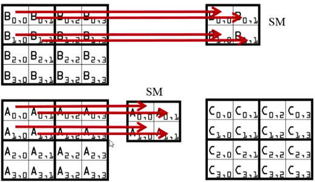

Thread [0,0] is going to be generating C [0,0] , it will load A[0,0],B[0,0] into shared memory , while Thread [1,1] is going to be generating C [1,1] , it will load A[1,1],B[1,1] into shared memory.

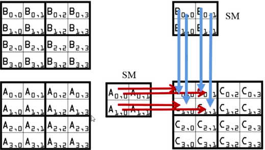

Every thread is going to be generate one step of the dot product out of the entire computation.

Every A element in the shared memory and every B element in the shared memory will be used by two threads.

<h2 id="4e844bfec02b6eb7144678d613169a5e"></h2>


#### Phase 1 Load for Block (0,0)

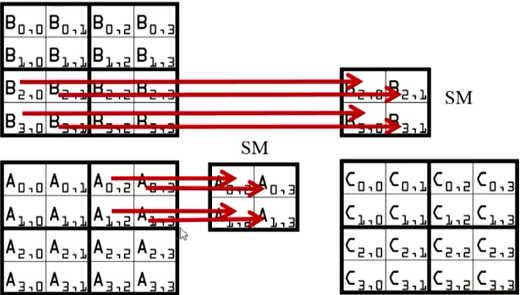

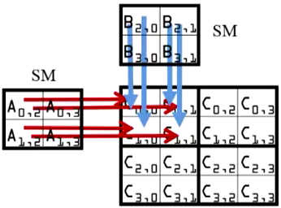

<h2 id="05f6e5f0aec3c722b0c365e005707ab6"></h2>


#### Barrier Synchronization

Once all the threads finish loading a tile, then they can go ahead and consume the elements from the shared memory. Once all threads completed their calculation based on the shared memory, they can go ahread and load next tile from glocal memory into shared memory and overwrite the contents of the shared memory. And this requires coordination, something has to make sure that all the activities have ended in the previous phase and before you can move start the next phase. And this is accomplished in parallel computing with Barrier Synchronization.

Barrier Synchronization is a very important primitive for parallel computing for exactly the reason that I have just discussed before.

 - An API function call in CUDA
    - **__syncthreads**() 
 - All threads in the same block must reach the __syncthreads() before any can move on
 - Best used to coordinate tiled algorithms.
     - To ensure that all elements of a tile are loaded
     - To ensure that all elements of a tile are consumed

Any thread that executes **__syncthreads**()  will begin to wait for everyone else to also reach that point.
    
Caution: __syncthreads() can significantly reduce active threads in a block. This is one of the reasons why we will want to have multiple thread blocks executing in an SN whenever we execute the tile algorithm, becuase some of the thread blocks may be doing barrier synchronization and they may not be able to utilize the hardware resources while waiting for the last thread to finish. 

<h2 id="8c20d72295f054dfec39cceaff3d05b6"></h2>


### Lecture 2.6: Tiled Matrix Multiplication Kernel

```
__global__ void MatrixMulKernel(int m, int n, int k, float* A,float* B, float* C)
{
    __shared__ float ds_A[TILE_WIDTH][TILE_WIDTH];
    __shared__ float ds_B[TILE_WIDTH][TILE_WIDTH];
    int bx = blockIdx.x; int by = blockIdx.y;
    int tx = threadIdx.x; int ty = threadIdx.y;
    int Row = by * blockDim.y + ty;
    int Col = bx * blockDim.x + tx;
    float Cvalue = 0;
    // Loop over the A and B tiles required 
    // to compute the C element
    for (int t = 0; t < n/TILE_WIDTH; ++t) {
        // Collaborative loading of A and B tiles 
        // into shared memory
        ds_A[ty][tx] = A[Row*n + t*TILE_WIDTH+tx];
        ds_B[ty][tx] = B[(t*TILE_WIDTH+ty)*k + Col];
        __syncthreads();
        // calc vector dot
        for (int i = 0; i < TILE_WIDTH; ++i)
            Cvalue += ds_A[ty][i] * ds_B[i][tx];
        __syncthreads();
    }
    C[Row*k+Col] = Cvalue;
}
```
     
<h2 id="d341490ecbbce14eba0d2e9cf03b4fcd"></h2>


#### First-order Size Considerations

 - Each ***thread block*** should have many threads
    - TILE_WIDTH of 16 gives 16 * 16 = 256 threads
    - TILE_WIDTH of 32 gives 32 * 32 = 1024 threads
 - For 16, each block performs 2 * 256 = 512 float loads from global memory for 256 * (2 * 16) = 8,192 mul/add operations. (memor traffic reduced by a factor of 16)
 - For 32, each block performs 2 * 1024 = 2048 float loads from global memory for 1024 * (2 * 32) = 65,536 mul/add operations. (memory traffic reduced by a factor of 32)
    
<h2 id="b26dad104ff5019d6d087dec37d62783"></h2>


#### Shared Memory and Threading
 - Each SM (Streaming Multiprocessor) in Fermi has 16KB or 48KB shared memory (configurable vs. L1 cache)
    - Shared memory size is implementation dependent!
    - For TILE_WIDTH = 16, each thread block uses 2 * 256 * 4B = 2KB of shared memory.
        - 256 elements each tile
        - we need load 2 tiles
        - every element have 4 bytes 
    - For 16K shared memory, one can potentially have up to 8 thread blocks executing
         - This allows up to 8 * 512 = 4,096 pending loads. (2 per thread, 256 threads per block)
    - The next TILE_WIDTH 32 would lead to 2 * 32 * 32 * 4 Byte= 8K Byte shared memory usage per thread block, allowing 2 thread blocks active at the same time (Fermi SM thread count limitation!)

 - Using 16x16 tiling, we reduce the accesses to the global memory by a factor of 16
    - The 150 GB/s bandwidth can now support (150/4)*16 = 600 GFLOPS!
    - Each __syncthread() can reduce the number of active threads for a block
    - More thread blocks can be advantageous

<h2 id="afb88027399d01d622718722195efb3b"></h2>


#### Device Query
 - Number of devices in the system
```
int dev_count;
cudaGetDeviceCount( &dev_count);
```
 - Capability of devices
```
cudaDeviceProp dev_prop;
for (i = 0; i < dev_count; i++) {
    cudaGetDeviceProperties( &dev_prop, i);
    // decide if device has sufficient resources and capabilities
}
```
 - cudaDeviceProp is a built-in C structure type
     - dev_prop.dev_prop.maxThreadsPerBlock
     - Dev_prop.share
 
    
<h2 id="632e348b2be685fb56cf013fe7edea7e"></h2>


### Lecture 2.7: Handling Boundary Conditions in Tiling

<h2 id="36163dc0760ea3b315915b599cd4fa2b"></h2>


#### Handling Matrix of Arbitrary Size

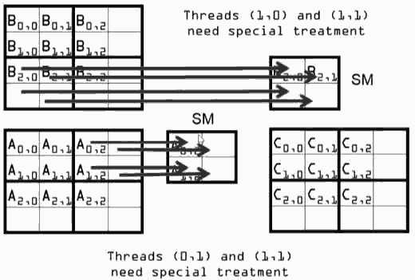

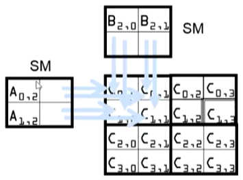

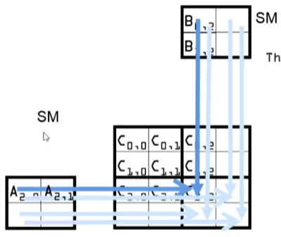


<h2 id="81697492e4e1b62b3f2352852d2c0fb8"></h2>


#### Major Cases in Toy Example

- Threads that calculate valid C elements but can step outside valid input
    - Phase 1 of Block(0,0), 2nd step, all threads
-Threads that do not calculate valid C elements but still need to participate in loading the input tiles
    - Phase 0 of Block(1,1), Thread(1,0), assigned to calculate non-existent C[3,2] but need to participate in loading tile element B[1,2] 
    
<h2 id="8d2db0c8d46de05bfb88b8206028adca"></h2>


### Lecture 2.8: A Tiled Kernel for Arbitrary Matrix Dimensions

<h2 id="980269dfb458cf354a27f8af783f6cc1"></h2>


#### A “Simple” Solution
 - When a thread is to load any input element, test if it is in the valid index range
    - If valid, proceed to load
    - Else, do not load, just write a 0
 - Rationale: a 0 value will ensure that the multiply-add step does not affect the final value of the output element

 - If a thread does not calculate a valid C element
    - Can still perform multiply-add into its register
    - As long as it is not allowed to write to the global memory at the end of the kernel
    - This way, the thread does not need to be turned off by an if-statement like in the basic kernel; it can participate in the tile loading process
    
<h2 id="f19c19580a27edbfffc35f335206a7d3"></h2>


#### Boundary Condition for Input A Tile

 - Each thread loads
```
A[Row][t*TILE_WIDTH+tx]
A[Row*Width + t*TILE_WIDTH+tx]
```
 - Need to test , to prevent triggering memory protection error
```
(Row < m) && (t*TILE_WIDTH+tx < n)
If true, load A element
Else , load 0 
```
 
<h2 id="c99cbcd4928e3eed824dec8e069f9af9"></h2>


#### Boundary Condition for Input B Tile

 - Each thread loads
```
B[t*TILE_WIDTH+ty][Col]
B[(t*TILE_WIDTH+ty)*k+ Col]
```
 - Need to test
```
(t*TILE_WIDTH+ty < n) && (Col< k)
If true, load B element
Else , load 0
```

<h2 id="bcadae33273a0da5fc70f9ec2e3e311e"></h2>


#### Loading Elements – with boundary check

```
    ...

    for (int t = 0; t < (n-1)/TILE_WIDTH + 1; ++t) {
        if(Row < m && t*TILE_WIDTH+tx < n) {
            ds_A[ty][tx] =A[Row*n + t*TILE_WIDTH+ tx];
        } else {
            ds_A[ty][tx] = 0.0;
        }
        if (t*TILE_WIDTH+ty < n && Col < k) {
            ds_B[ty][tx] =B[(t*TILE_WIDTH + ty)*k +Col];
        } else {
            ds_B[ty][tx] = 0.0;
        }
        __syncthreads();
        
        for (int i = 0; i < TILE_WIDTH; ++i) {
            Cvalue += ds_A[ty][i] * ds_B[i][tx];
        }
        __syncthreads();
    } /* end of outer for loop */
        
    if (Row < m && Col < k)
        C[Row*k + Col] = Cvalue;
} /* end of kernel */
```
