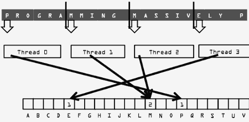
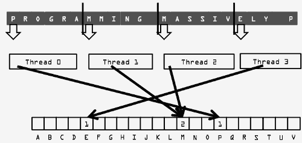
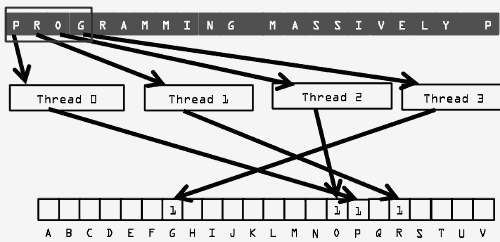
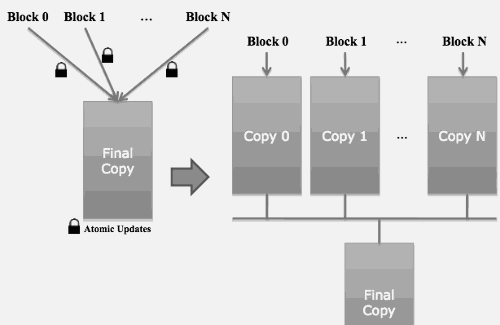

...menustart

 - [Week5](#25920ae7a2a6fa8497cb554670bd4767)
     - [Lecture 5.1: Parallel Computation Patterns - Histogramming](#58997de450d57cd85d02ccf09f2e2abd)
         - [Histogramming](#0f39b900b08ff634a8f210cf9ea18fa2)
         - [A Histogram Example](#e00d95c8bf8108f0383cf23e1ee248e9)
         - [Iteration #1 – 1st letter in each section](#cecb00877fc1ee8d286513d59d676d81)
     - [Lecture 5.2: Parallel Computation Patterns - Atomic Operations](#292fcfab7969a7f0c452cb4828222d78)
         - [A Common Parallel Coordination Pattern](#76dcecf2c662e26592bafa2d3783442a)
         - [Atomic Operations](#eaa1709ae37b41b0f052cd5eae6a14b4)
     - [Lecture 5.3: Parallel Computation Patterns - Atomic Operations in CUDA](#b86c5421464bfb4b3760fb3253ccb8cc)
         - [Atomic Operations in General](#e850c6d1bca94e185e6934bf7014ae80)
         - [Atomic Operations in CUDA](#0b926d25c67b0f91f3602829806ca6d3)
         - [More Atomic Adds in CUDA](#f66f0c25c7798013930725d00f53caf5)
         - [Uncoalesced memory accesses in Sectoned Histogram Algorithm](#056df4bf1bf3d6fbc89379597169cb9b)
         - [A Better Thread to Data Mapping](#248c001700eb0ec840c18dd5d3b7711d)
         - [A Basic Histogram Kernel](#d47212ebdb72e211e492b58dc19235c5)
     - [Lecture 5.4: Parallel Computation Patters - Atomic Operations Performance](#d3796b1cce8dbf0223e0f4fa4fd82f98)
         - [Atomic Operations on DRAM](#4a3720472ae67754378c84d9d0907dde)
         - [Latency determines throughput](#9a94be20a1d3213c0c86924a4febff7d)
         - [Hardware Improvements](#e02a081794adc5f41802f522a901e5eb)
     - [Lecture 5.5: Parallel Computation Patterns - A Privatized Histogram Kernel](#e81801010304a2c41dba8d36139dcca7)
         - [Histogram Privatization](#8b827d905dd0d9428a134f198f6546d7)
         - [Atomics in Shared Memory Requires Privatization](#cd5e53e4691603e32d958875fe5ac4ec)
         - [Build Private Histogram](#5059b97b67f882680b3493ed08fb35db)
         - [Build Final Histogram](#4021b789d0b1fc634fc88867cf649d92)
         - [More on Privatization](#9b8d74978162365fbf93789fae84e077)

...menuend


<h2 id="25920ae7a2a6fa8497cb554670bd4767"></h2>


## Week5

<h2 id="58997de450d57cd85d02ccf09f2e2abd"></h2>


### Lecture 5.1: Parallel Computation Patterns - Histogramming 

To learn the parallel histogram computation pattern:

 - threads will interference when they write into their outputs

<h2 id="0f39b900b08ff634a8f210cf9ea18fa2"></h2>


#### Histogramming

 - A method for extracting notable features and patterns from large data sets
    - Feature extraction for object recognition in images 
    - Fraud detection in credit card transactions
    - ...
 - Basic histograms - for each element in the data set, use the value to identify a “bin” to increment.

<h2 id="e00d95c8bf8108f0383cf23e1ee248e9"></h2>


#### A Histogram Example

 - In sentence “Programming Massively Parallel Processors” build a histogram of frequencies of each letter
 - A(4), C(1), E(1), G(1), …

 - How can we do this in parallel?
    - Have each thread to take a section of the input
    - For each input letter, use atomic operations to build the histogram

<h2 id="cecb00877fc1ee8d286513d59d676d81"></h2>


#### Iteration #1 – 1st letter in each section


     
      
<h2 id="292fcfab7969a7f0c452cb4828222d78"></h2>


### Lecture 5.2: Parallel Computation Patterns - Atomic Operations 

 - To understand atomic operations
    - Read-modify-write in parallel computation
    - Race conditions when performing read-modifywrite

<h2 id="76dcecf2c662e26592bafa2d3783442a"></h2>


#### A Common Parallel Coordination Pattern

 - Multiple bank tellers出纳员 count the total amount of cash in the safe
 - Each grab a pile and count
 - Have a central display of the running total
 - Whenever someone finishes counting a pile, add the subtotal of the pile to the running total
    - read the original total,  add the subtotal, write to the original total 
 - A bad outcome
    - Some of the piles were not accounted for 

<h2 id="eaa1709ae37b41b0f052cd5eae6a14b4"></h2>


#### Atomic Operations

If Mem[x] was initially 0, what would the value of Mem[x] be after threads 1 and 2 have completed?

 - What does each thread get in their Old variable?

The answer may vary due to data races. To avoid data races, you should use atomic operations.


<h2 id="b86c5421464bfb4b3760fb3253ccb8cc"></h2>


### Lecture 5.3: Parallel Computation Patterns - Atomic Operations in CUDA 

<h2 id="e850c6d1bca94e185e6934bf7014ae80"></h2>


#### Atomic Operations in General

 - Performed by a **single instruction** on a memory location address
    - Read the old value, calculate a new value, and write the new value to the location 
 - The hardware ensures that no other threads can access the location until the atomic operation is complete
    - Any other threads that access the location will typically be held in a queue until its turn
    - All threads perform the atomic operation serially if they modify the same location

<h2 id="0b926d25c67b0f91f3602829806ca6d3"></h2>


#### Atomic Operations in CUDA

 - Function calls that are translated into single instructions (a.k.a. intrinsic functions or intrinsics)
    - Atomic add, sub, inc, dec, min, max, exch (exchange), CAS (compare and swap)
    - Read CUDA C programming Guide 4.0 or later for details

 - Atomic Add
    - int atomicAdd(int* address, int val)
    - reads the 32-bit word old pointed to by address in **global** or **shared** memory, 
    - computes (old + val), and stores the result back to memory at the same address. 
    - The function returns old.
    
<h2 id="f66f0c25c7798013930725d00f53caf5"></h2>


#### More Atomic Adds in CUDA

 - Unsigned 32-bit integer atomic add
    - unsigned int atomicAdd(unsigned int* address, unsigned int val); 
 - Unsigned 64-bit integer atomic add
    - unsigned long long int atomicAdd( ... );  
 - Single-precision floating-point atomic add (capability > 2.0)
    - float atomicAdd(float* address, float val);  

<h2 id="056df4bf1bf3d6fbc89379597169cb9b"></h2>


#### Uncoalesced memory accesses in Sectoned Histogram Algorithm 

分区域直方图算法中的 非联合内存访问

 - Reads from the input array are not coalesced
    - Adjacent threads process non-adjacent input letters



<h2 id="248c001700eb0ec840c18dd5d3b7711d"></h2>


#### A Better Thread to Data Mapping

 - Reads from the input array are coalesced
    - Assign inputs to each thread in a strided pattern
    - Adjacent threads process adjacent input letters



<h2 id="d47212ebdb72e211e492b58dc19235c5"></h2>


#### A Basic Histogram Kernel

 - The kernel receives a pointer to the input buffer of byte values
 - Each thread process the input in a strided pattern

```
// buffer: input
// size: number of chars in input buffer
// histo : 
__global__ void histo_kernel(unsigned char *buffer, long size, 
                                unsigned int *histo)
{
    int i = threadIdx.x + blockIdx.x * blockDim.x;
    // stride is total number of threads of all blocks
    int stride = blockDim.x * gridDim.x;
    // All threads handle blockDim.x * gridDim.x consecutive elements
    while (i < size) {
        atomicAdd( &(histo[buffer[i]]), 1);
        i += stride;
    }
}
```

<h2 id="d3796b1cce8dbf0223e0f4fa4fd82f98"></h2>


### Lecture 5.4: Parallel Computation Patters - Atomic Operations Performance 

 - main performance considerations of atomic operations
    - Latency and throughput of atomic operations 
    - Atomic operations on global memory
    - Atomic operations on shared L2 cache
    - Atomic operation on shared memory


<h2 id="4a3720472ae67754378c84d9d0907dde"></h2>


#### Atomic Operations on DRAM

 - An atomic operation starts with a read, with a latency of a few hundred cycles
 - The atomic operation ends with a write, with a latency of a few hundred cycles
 - During this whole time, no one else can access the location
 - Each Load-Modify-Store has two full memory access delays
    - All atomic operations on the same variable (DRAM location) are serialized 

<h2 id="9a94be20a1d3213c0c86924a4febff7d"></h2>


#### Latency determines throughput

 - Throughput of an atomic operation is the rate at which the application can execute an atomic operation.  
 - The rate for atomic operation on a particular location is limited by the total latency of the read-modifywrite sequence, typically more than 1000 cycles for global memory (DRAM) locations.
 - This means that if many threads attempt to do atomic operation on the same location (contention), the memory bandwidth is reduced to <
    - using atomic operation **extremely dangerous** if we're not careful, we can accidentally serialize all the threads. 
 
<h2 id="e02a081794adc5f41802f522a901e5eb"></h2>


#### Hardware Improvements 

 - Atomic operations on Fermi L2 cache
    - Later Fermi
    - Medium latency, but still serialized
    - Shared among all blocks (all the streaming multiprocessors?)
    - “Free improvement” on Global Memory atomics
        - the programmer still think that they are use atomic operation on the global memory 
 - Atomic operations on Shared Memory
    - Very short latency, but still serialized
    - Private to each thread block
    - Need algorithm work by programmers(more later)

<h2 id="e81801010304a2c41dba8d36139dcca7"></h2>


### Lecture 5.5: Parallel Computation Patterns - A Privatized Histogram Kernel

 - write a high performance histogram kernel
    - ***Privatization technique*** for reducing latency, increasing throughput, and reducing serialization
    - Practical use of shared memory and L2 cache atomic operations

<h2 id="8b827d905dd0d9428a134f198f6546d7"></h2>


#### Histogram Privatization



 - right pic
    - private copies of the histogram in the shared memory of each thread block
    - all the threads in the thread block just accumulate their findings into the private histogram
    - at the end of the kernel , all the threads in the thread block will collaborate , and update a final copy of the histogram based on the contents of it's local or private histogram.

<h2 id="cd5e53e4691603e32d958875fe5ac4ec"></h2>


#### Atomics in Shared Memory Requires Privatization

```
__global__ void histo_kernel(unsigned char *buffer, 
                            long size, unsigned int *histo) {
    // Create private copies of the histo[] array
    // for each thread block
    __shared__ unsigned int histo_private[256];     
    if (threadIdx.x < 256) 
        histo_private[threadidx.x]= 0;
    __syncthreads();    

```
    
<h2 id="5059b97b67f882680b3493ed08fb35db"></h2>


#### Build Private Histogram

```
    int i = threadIdx.x + blockIdx.x * blockDim.x;
    // stride is total number of threads
    int stride = blockDim.x * gridDim.x;
    while (i < size) {
        atomicAdd(
            &(histo_private[buffer[i]), 1
        );
        i += stride;
    }
```

<h2 id="4021b789d0b1fc634fc88867cf649d92"></h2>


#### Build Final Histogram

```
    // wait for all other threads in the block to finish
    __syncthreads();
    if (threadIdx.x < 256) {
        atomicAdd( &(histo[threadIdx.x]), histo_private[threadIdx.x] );
    }
}
```

<h2 id="9b8d74978162365fbf93789fae84e077"></h2>


#### More on Privatization

 - Privatization is a powerful and frequently used techniques for parallelizing applications
 - The operation needs to be ***associative and commutative***
    - istogram add operation is associative and commutative 
 - The private histogram size needs to be small
    - Fits into shared memory 
 - What if the histogram is too large to privatize?
