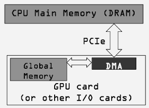
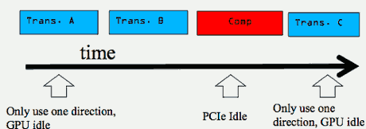
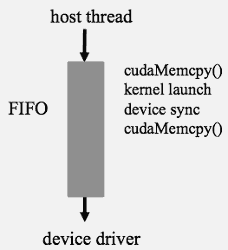
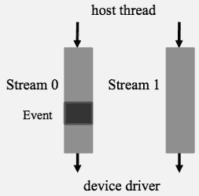
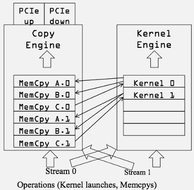
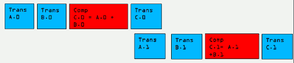
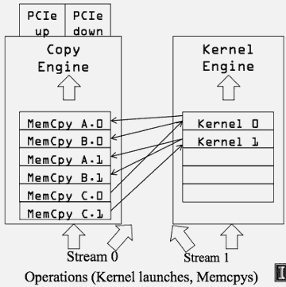
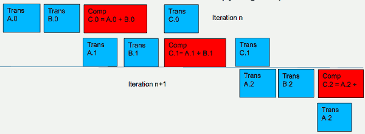

...menustart

 - [Week #6](#9a7f65f62bfbd892678d5cf675c8fee4)
     - [Lecture 6.1: Efficient Host-Device Data Transfer - Pinned Host Memory](#d44b0c6ea12b9430bd3cf48d076ec58d)
         - [CPU-GPU Data Transfer using DMA](#e10c1c3c1ea5392c5f1eea7ca0b3873c)
         - [Virtual Memory Management](#2cd02b906eadba617d7c6ac88d30fe53)
         - [Data Transfer and Virtual Memory](#b2a9d5a12eab1f941738bd5c801aaedd)
         - [Pinned Memory and DMA Data Transfer](#7df7be93264776b9f5c008a7ef802f50)
         - [CUDA data transfer uses pinned memory](#40e346ff128b7af79670d95f3284ab5e)
         - [Allocate/Free Pinned Memory](#bdef598b63a9326341f68bcbb7016c7b)
         - [Using Pinned Memory in CUDA](#c3811783084bd13e3f88d10fc162289d)
         - [Vector Addition Host Code Example](#d3eb5c06fd39e6588b7e91991de747dc)
     - [Lecture 6.2: Efficient Host-Device Data Transfer - Task Parallelism in CUDA](#1b80c064703cd2aaabbcf87adf1180a2)
         - [Serialized Data Transfer and Computation](#1eec9afb0b999eed4e565e0e8d8a0255)
         - [Device Overlap](#676880c1ebb7d48597077ac5c7061bee)
         - [Ideal, Pipelined Timing](#7100c1190c2250c484c7021b91c993bb)
         - [CUDA Streams](#8ba448cc3c6d4d958f09a2867e647e0e)
         - [Streams](#21b3cb64e5310225472b9fa9ad3e1ee3)
         - [Streams cont.](#fe152dac9b832d65ef6285dc9b5cc473)
     - [Lecture 6.3: Efficient Host-Device Data Transfer - Overlapping Data Transfer with Computation](#f8fab47eba7e8b1fb86bb2c911d1b6ef)
         - [A Simple Multi-Stream Host Code](#07016f41ae194ded6bfa2b27f9856ca3)
         - [Not quite the overlap we want in some GPUs](#42dd46ef1f223b467126091b06f1f702)
         - [A Better Multi-Stream Host Code](#f4f91f8843bf7bbd46f7b3ae80dca782)
         - [Better, not quite the best overlap](#a598adc12ac665ba62757284e143180e)
         - [Ideal, Pipelined Timing](#7100c1190c2250c484c7021b91c993bb)
         - [Hyper Queues](#68e72eae3146d9dce16fd5fe0b75e830)
         - [Wait until all tasks have completed](#3c2be719fbfcb512887002eac82b7bdb)

...menuend


<h2 id="9a7f65f62bfbd892678d5cf675c8fee4"></h2>


## Week #6

<h2 id="d44b0c6ea12b9430bd3cf48d076ec58d"></h2>


### Lecture 6.1: Efficient Host-Device Data Transfer - Pinned Host Memory 
 - important concepts involved in copying (transferring) data between host and device
    - System Interconnect
    - Direct Memory Access
    - Pinned memory

<h2 id="e10c1c3c1ea5392c5f1eea7ca0b3873c"></h2>


#### CPU-GPU Data Transfer using DMA

 - DMA (Direct Memory Access) hardware is used for cudaMemcpy() for better efficiency
    - Frees CPU for other tasks
    - Transfers a number of bytes requested by OS
    - Uses system interconnect, typically PCIe in today’s systems
    - not only for GPUs , but also for other I/O devices such as network interface cards


 - CPU sends commands to DMA and get it started. then the CPU can go to do other task

<h2 id="2cd02b906eadba617d7c6ac88d30fe53"></h2>


#### Virtual Memory Management

To understand how DMA works, we'd better know something about Virtual Memory.

 - Modern computers use virtual memory management
    - Many virtual memory spaces mapped into a single physical memory 
    - Virtual addresses (pointer values) are translated into physical addresses
        - the compute has a single DRAM base memory system
        - each process, or application, will have its own address space

 - Not all variables and data structures are always in the physical memory
    - Each virtual address space is divided into pages when mapped into physical memory 
    - Memory pages can be paged out to make room
    - Whether a variable is in the physical memory is checked at address translation time

<h2 id="b2a9d5a12eab1f941738bd5c801aaedd"></h2>


#### Data Transfer and Virtual Memory 

 - DMA uses physical addresses
    - When cudaMemcpy() copies an array, it is implemented as one or more DMA transfers 
    - Address is translated and page presence checked at the beginning of each DMA transfer
    - No address translation for the rest of the same DMA transfer so that high efficiency can be achieved

 - The OS could accidentally page-out the data that is being read or written by a DMA and page-in another virtual page into the same physical location
    - because the CPU is now freed up to be able to do these other tasks

<h2 id="7df7be93264776b9f5c008a7ef802f50"></h2>


#### Pinned Memory and DMA Data Transfer 

固定内存

 - Pinned memory are virtual memory pages that are specially marked so that they cannot be paged out
 - Allocated with a special system API function call
 - a.k.a. Page Locked Memory, Locked Pages, etc.
 - CPU memory that serve as the source , or destination , of a DMA transfer must be allocated as pinned memory

<h2 id="40e346ff128b7af79670d95f3284ab5e"></h2>


#### CUDA data transfer uses pinned memory

 - If a source or destination of a cudaMemcpy() in the host memory is not allocated in pinned memory, it needs to be first copied to a pinned memory – extra overhead
 - cudaMemcpy() is faster if the host memory source or destination is allocated in pinned memory since no extra copy is needed

<h2 id="bdef598b63a9326341f68bcbb7016c7b"></h2>


#### Allocate/Free Pinned Memory

 - cudaHostAlloc(), 3 parameters
    - Address of pointer to the allocated memory 
    - Size of the allocated memory in bytes
    - Option – use cudaHostAllocDefault for now
 - cudaFreeHost(), one parameter
    - Pointer to the memory to be freed

<h2 id="c3811783084bd13e3f88d10fc162289d"></h2>


#### Using Pinned Memory in CUDA

 - Use the allocated pinned memory and its pointer the same way as those returned by malloc();
 - The only difference is that the allocated memory cannot be paged by the OS
 - The cudaMemcpy() function should be about 2X faster with pinned memory
 - ***Pinned memory is a limited resource***
    - over-subscription can have serious consequences  
    - if we take away too much of memory from the paging pool, the virtual memory system will start to function very poorly.

<h2 id="d3eb5c06fd39e6588b7e91991de747dc"></h2>


#### Vector Addition Host Code Example

```
int main()
{
    float *h_A, *h_B, *h_C;
    …
    cudaHostAlloc((void **)&h_A, N* sizeof(float),cudaHostAllocDefault);
    cudaHostAlloc((void **)&h_B, N* sizeof(float),cudaHostAllocDefault);
    cudaHostAlloc((void **)&h_C, N* sizeof(float),cudaHostAllocDefault);
    …
    vecAdd(h_A, h_B, h_C, N);
}
```
    
     

      
    
<h2 id="1b80c064703cd2aaabbcf87adf1180a2"></h2>


### Lecture 6.2: Efficient Host-Device Data Transfer - Task Parallelism in CUDA

 - task parallelism in CUDA 
    - CUDA Streams

<h2 id="1eec9afb0b999eed4e565e0e8d8a0255"></h2>


#### Serialized Data Transfer and Computation

 - So far, the way we use cudaMemcpy serializes data transfer and GPU computation for VecAddKernel()
    - PCIe can actually do simulataneously transfer in both directions 
 - 

<h2 id="676880c1ebb7d48597077ac5c7061bee"></h2>


#### Device Overlap

 - Some CUDA devices support device overlap
    - Simultaneously execute a kernel while copying data between device and host memory

```
int dev_count;
cudaDeviceProp prop;
cudaGetDeviceCount( &dev_count);
for (int i = 0; i < dev_count; i++) {
    cudaGetDeviceProperties(&prop, i);
    if (prop.deviceOverlap) 
        … 
```
    
<h2 id="7100c1190c2250c484c7021b91c993bb"></h2>


#### Ideal, Pipelined Timing

 - Divide large vectors into segments
 - Overlap transfer and compute of adjacent segments

![][1] 

 - Trans C0
 - Comp C2
 - Trans A2,B2
 - Do Simultaneously

<h2 id="8ba448cc3c6d4d958f09a2867e647e0e"></h2>


#### CUDA Streams

 - CUDA supports parallel execution of kernels and Memcpy with “Streams”
    - Stream is a simple hardware mechanism , that supports the exploration of task parallelism. 
 - Each stream is a queue of operations (kernel launches and Memcpy’s)
 - Operations (tasks) in different streams can go in parallel
    - “Task parallelism”

<h2 id="21b3cb64e5310225472b9fa9ad3e1ee3"></h2>


#### Streams

 - Requests made from the host code are put into First-In-First-Out queues
    - Queues are read and processed asynchronously by the driver and device
        - device driver will be a taking operations out of the queue sequentially
    - Driver ensures that commands in a queue are processed in sequence. E.g., Memory copies end before kernel launch, etc.
    - 

<h2 id="fe152dac9b832d65ef6285dc9b5cc473"></h2>


#### Streams cont.

 - To allow concurrent copying and kernel execution, use multiple queues, called “streams”
    - CUDA “events” allow the host thread to query and synchronize with individual queues (i.e. streams).
    - 


<h2 id="f8fab47eba7e8b1fb86bb2c911d1b6ef"></h2>


### Lecture 6.3: Efficient Host-Device Data Transfer - Overlapping Data Transfer with Computation 

 - overlap data transfer with computation
    - Asynchronous Data Transfer in CUDA
    - Practical Limitation of CUDA Streams

<h2 id="07016f41ae194ded6bfa2b27f9856ca3"></h2>


#### A Simple Multi-Stream Host Code

```
cudaStream_t stream0, stream1;
cudaStreamCreate(&stream0);
cudaStreamCreate(&stream1);

float *d_A0, *d_B0, *d_C0;// device memory for stream 0
float *d_A1, *d_B1, *d_C1;// device memory for stream 1

// cudaMalloc for d_A0, d_B0, d_C0, d_A1, d_B1, d_C1 go here
for (int i=0; i<n; i+=SegSize*2) {
    // stream 0
    cudaMemcpyAsync(d_A0, h_A+i, SegSize*sizeof(float),…, stream0);
    cudaMemcpyAsync(d_B0, h_B+i, SegSize*sizeof(float),…, stream0);
    vecAdd<<<SegSize/256, 256, 0, stream0>>>(d_A0, d_B0,…);
    cudaMemcpyAsync(h_C+i, d_C0, SegSize*sizeof(float),…, stream0);
    
    // stream 1
    cudaMemcpyAsync(d_A1, h_A+i+SegSize, 
                    SegSize*sizeof(float),…, stream1);
    cudaMemcpyAsync(d_B1, h_B+i+SegSize, 
                    SegSize*sizeof(float) ,…,stream1);
    vecAdd<<<SegSize/256, 256, 0, stream1>>>(d_A1, d_B1, …);
    cudaMemcpyAsync(d_C1, h_C+i+SegSize, 
                    SegSize*sizeof(float),…,stream1);
}
```



 - the arcs show the dependency
 - bad case because of the implementation choice

<h2 id="42dd46ef1f223b467126091b06f1f702"></h2>


#### Not quite the overlap we want in some GPUs

 - C.0 blocks A.1 and B.1 in the copy engine queue



<h2 id="f4f91f8843bf7bbd46f7b3ae80dca782"></h2>


#### A Better Multi-Stream Host Code 

```
for (int i=0; i<n; i+=SegSize*2) {
    // steam 0
    cudaMemcpyAsync(d_A0, h_A+i, SegSize*sizeof(float),…, stream0);
    cudaMemcpyAsync(d_B0, h_B+i, SegSize*sizeof(float),…, stream0);
    // steam 1
    cudaMemcpyAsync(d_A1, h_A+i+SegSize, 
                    SegSize*sizeof(float),…,stream1);
    cudaMemcpyAsync(d_B1, h_B+i+SegSize, 
                    SegSize*sizeof(float),…,stream1);
    // steam 0
    vecAdd<<<SegSize/256, 256, 0, stream0>>>(d_A0, d_B0, …);
    // steam 1
    vecAdd<<<SegSize/256, 256, 0, stream1>>>(d_A1, d_B1, …);
    // steam 0
    cudaMemcpyAsync(h_C+i, d_C0, SegSize*sizeof(float),…, stream0);
    // steam 1
    cudaMemcpyAsync(h_C+i+SegSize, d_C1, 
                    SegSize*sizeof(float),…, stream1);
}
```



<h2 id="a598adc12ac665ba62757284e143180e"></h2>


#### Better, not quite the best overlap

 - C.1 blocks next iteration A.0 and B.0 in the copy engine queue
 - 一般情况下， kernel占用的时间比例相对 data transfer是很小的，因此即便不是最优的，这种算法也会有较大的性能提升



<h2 id="7100c1190c2250c484c7021b91c993bb"></h2>


#### Ideal, Pipelined Timing

 - Will need at least three buffers for each original A, B,and C, code is more complicated (MP description)

![][1] 

<h2 id="68e72eae3146d9dce16fd5fe0b75e830"></h2>


#### Hyper Queues

 - Provide multiple real queues for each engine
 - Allow much more concurrency by allowing some streams to make progress for an engine while others are blocked 

<h2 id="3c2be719fbfcb512887002eac82b7bdb"></h2>


#### Wait until all tasks have completed

 - cudaStreamSynchronize(stream_id)
    - Used in host code
    - Takes one parameter – stream identifier
    - Wait until all tasks in a stream have completed
 - This is different from cudaDeviceSynchronize()
    - Also used in host code
    - No parameter
    - cudaDeviceSynchronize() waits until all tasks in all streams have completed for the current device

```
cudaStreamSynchronize(stream0);
// In host code ensures that all tasks in
//the queues of stream0 have completed
cudaDeviceSynchronize();
```  

---

[1]: ../imgs/CUDADeviceOverlap.png

