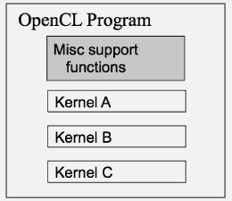
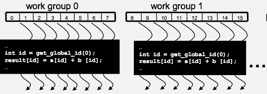
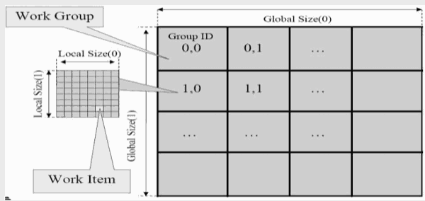
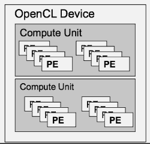
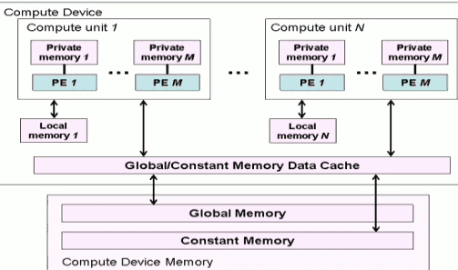
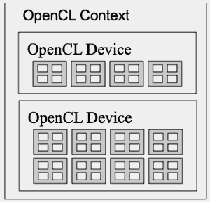
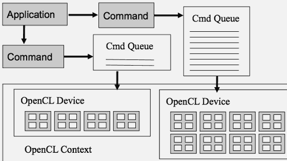

[](...menustart)

- [Week 7](#5f723efe7dc9cef80c50e92f6ff538cb)
    - [Lecture 7.1: Related Programming Models - OpenCL Data Parallelism Model](#c7432b7a0748ce1e4849f27287b2333d)
        - [Background](#a9ded1e5ce5d75814730bb4caaf49419)
        - [OpenCL Programs](#c7ccad9560480aff2b55dfed320a2552)
        - [OpenCL Execution Model](#9c2fa1176ab9635cb70ebdce90fd024d)
        - [Mapping between OpenCL and CUDA data parallelism model concepts.](#48786de47093a4dc47410e6d9a6406b4)
        - [OpenCL Kernels](#458797bd2ad3871d5a600521e053c82c)
        - [Array of Work Items](#c07a54e204d8fdd5fb6f0748617b5f12)
        - [Work Groups: Scalable Cooperation](#dbea784301db812486aeaeec74f99543)
        - [OpenCL Dimensions and Indices](#86b62dec366f72cb574136cfe3f65ffd)
        - [Multidimensional Work Indexing](#1a9d2ea89cc54694eeccb82c720ef43c)
        - [OpenCL Data Parallel Model Summary](#456b94dd241c5e2db2f7d1b37353034f)
    - [Lecture 7.2: Related Programming Models - OpenCL Device Architecture](#b6389fb0bc37cad8e59a895ce8148d89)
        - [OpenCL Hardware Abstraction](#e25bbe40f8fc005857691ead14f6f2f2)
        - [OpenCL Device Memory Types](#217d5909b588812167add57a0b209c8e)
        - [OpenCL Context](#415ebc36fe3195a3b7bc91e9b9b6458a)
    - [Lecture 7.3: Related Programming Models - OpenCL Host Code Part 1](#9fb6db7a7cf024295eced05c3c28caf9)
        - [OpenCL Context](#415ebc36fe3195a3b7bc91e9b9b6458a)
        - [OpenCL Context Setup Code (simple)](#88652bebc36b7fb6cdd9d090fb1d2efe)
        - [OpenCL Kernel Compilation: vadd](#6cde352c0f9b0354bd2c1c1dce55fa27)
        - [OpenCL Device Memory Allocation](#77e8e9cb5211e6b6f0e53fca7015bff4)
        - [OpenCL Device Memory Allocation (cont.)](#5bcd279a1826871953f9e811106ee3c0)
        - [OpenCL Device Command Execution](#8cb6a1858f1a479d95624664b07bad4f)
    - [Lecture 7.4: Related Programming Models - OpenCL Host Code (Cont.)](#b5042a717cbffdf9640808b5b8c2ddd9)
    - [Lecture 7.5: Related Programming Models - OpenACC](#f355a4597adb366f8398f58948887325)
    - [Lecture 7.6: Related Programming Models - OpenACC Details](#f52c7b9c0c1619f30488b93abed9a99c)

[](...menuend)


<h2 id="5f723efe7dc9cef80c50e92f6ff538cb"></h2>

## Week 7


<h2 id="c7432b7a0748ce1e4849f27287b2333d"></h2>

### Lecture 7.1: Related Programming Models - OpenCL Data Parallelism Model 

- OpenCL programming model

<h2 id="a9ded1e5ce5d75814730bb4caaf49419"></h2>

#### Background

- OpenCL was initiated by Apple and maintained by the Khronos Group (also home of OpenGL) as an industry standard API
    - For cross-platform parallel programming in CPUs, GPUs, DSPs, FPGAs,… 
- OpenCL draws heavily on CUDA
    - Easy to learn for CUDA programmers 
- OpenCL host code is much more complex and tedious due to desire to maximize portability and to minimize burden on vendors

<h2 id="c7ccad9560480aff2b55dfed320a2552"></h2>

#### OpenCL Programs

- An OpenCL “program” is a C program that contains one or more “kernels” and any supporting routines that run on a target device
- An OpenCL kernel is the basic unit of parallel code that can be executed on a target device



<h2 id="9c2fa1176ab9635cb70ebdce90fd024d"></h2>

#### OpenCL Execution Model

- Integrated host+device app C program
    - Serial or modestly parallel parts in host C code
    - Highly parallel parts in device SPMD kernel C code
 
<h2 id="48786de47093a4dc47410e6d9a6406b4"></h2>

#### Mapping between OpenCL and CUDA data parallelism model concepts.

OpenCL Parallelism Concept | CUDA Equivalent
--- | --- 
host | host
device | device
kernel | kernel
host program | host program
NDRange (index space) | grid
work item | thread
work group | block

<h2 id="458797bd2ad3871d5a600521e053c82c"></h2>

#### OpenCL Kernels

- Code that executes on target devices
- Kernel body is instantiated once for each work item
    - An OpenCL work item is equivalent to a CUDA thread
- Each OpenCL work item gets a unique index

```
// __kernel:  kernel keyword  
// __global: pointer that into global memory
__kernel void vadd(__global const float *a, __global const float *b,
                    __global float *result)
{
    // get_global_id , equivalent to 
    // blockIndex.x * blockDim.x + threadIndex.x in CUDA
    // 0 means the x dimension
    int id = get_global_id(0);
    result[id] = a[id] + b[id];
}
```

<h2 id="c07a54e204d8fdd5fb6f0748617b5f12"></h2>

#### Array of Work Items



- An OpenCL kernel is executed by an array of work items
    - All work items run the same code (SPMD)
    - Each work item can call get_global_id() to get its index for computing memory addresses and make control decisions

<h2 id="dbea784301db812486aeaeec74f99543"></h2>

#### Work Groups: Scalable Cooperation

- Divide monolithic work item array into work groups
    - Work items within a work group cooperate via ***shared memory and barrier synchronization***
- Work items in different work groups cannot cooperate
    - OpenCL equivalent of CUDA Thread Blocks

<h2 id="86b62dec366f72cb574136cfe3f65ffd"></h2>

#### OpenCL Dimensions and Indices

OpenCL API | Call Explanation | CUDA Equivalent
--- | --- | ---
get_global_id(0); | global index of the work item in the x dimension | blockIdx.x*blockDim.x+ threadIdx.x
get_local_id(0) | local index of the work item within the work group in the x dimension | threadIdx.x
get_global_size(0); | size of NDRange in the x dimension | gridDim.x*blockDim.x
get_local_size(0); | Size of each work group in the x dimension | blockDim.x

<h2 id="1a9d2ea89cc54694eeccb82c720ef43c"></h2>

#### Multidimensional Work Indexing



<h2 id="456b94dd241c5e2db2f7d1b37353034f"></h2>

#### OpenCL Data Parallel Model Summary

- Parallel work is submitted to devices by launching kernels
- Kernels run over global dimension index ranges (NDRange), broken up into “work groups”, and “work items”
- Work items executing within the same work group can synchronize with each other with barriers or memory fences
- Work items in different work groups can’t sync with each other, except by terminating the kernel


     
<h2 id="b6389fb0bc37cad8e59a895ce8148d89"></h2>

### Lecture 7.2: Related Programming Models - OpenCL Device Architecture 

-  OpenCL device architecture
    - Foundation to terminology used in the host code
    - Also needed to understand the memory model for kernels

<h2 id="e25bbe40f8fc005857691ead14f6f2f2"></h2>

#### OpenCL Hardware Abstraction

- OpenCL exposes CPUs, GPUs, and other Accelerators as “devices”
- Each device contains one or more “compute units” 
    - i.e. cores (cpu side), Streaming Multicprocessors (gpu side), etc...
- Each compute unit contains one or more SIMD “processing elements”,      - i.e. SP in CUDA
    - PE in pic, is equivalent to Streaming processors(SP) 





<h2 id="217d5909b588812167add57a0b209c8e"></h2>

#### OpenCL Device Memory Types

Memory Type | Host access | Device access | CUDA Equivalent
--- | --- | --- | --- 
private memory | No allocation;no access | Static allocation;Read/write access by a single work item. | registers and local memory
local memory | Dynamic allocation; no access | Static allocation; shared read-write access by all work items in a work group. | shared memory
constant memory | Dynamic allocation; read/write access | Static allocation; read-only access by all work items.| constant memory
global memory | Dynamic allocation; Read/write access | No allocation; Read/write access by all work items in all work groups, large and slow but may be cached in some devices. | global memory

<h2 id="415ebc36fe3195a3b7bc91e9b9b6458a"></h2>

#### OpenCL Context

- Contains one or more devices
- OpenCL device memory objects are associated with a context, not a specific device




<h2 id="9fb6db7a7cf024295eced05c3c28caf9"></h2>

### Lecture 7.3: Related Programming Models - OpenCL Host Code Part 1 

- to write OpenCL host code
    - Create OpenCL context
    - Create work queues for task parallelism
    - Device memory Allocation
    - Kernel compilation
    - Kernel launch
    - Host-device data copy

<h2 id="415ebc36fe3195a3b7bc91e9b9b6458a"></h2>

#### OpenCL Context

- Contains one or more devices
- OpenCL memory objects are associated with a context,not a specific device
- ***clCreateBuffer()*** is the main data object allocation function
    - error if an allocation is too large for any device in the context
    - clCreateBuffer will reserver the space in all devices, if the space is larger than any devices's capacity, it will throw error
- Each device needs its own work queue(s)
    - similar to CUDA stream queue 
- Memory copy transfers are associated with a command queue 
    - thus every memory copy operation is associated with a specific device


    
<h2 id="88652bebc36b7fb6cdd9d090fb1d2efe"></h2>

#### OpenCL Context Setup Code (simple)

```
cl_int clerr = CL_SUCCESS;
cl_context clctx = clCreateContextFromType(0, 
    CL_DEVICE_TYPE_ALL, NULL, NULL, &clerr);
    
size_t parmsz;
clerr = clGetContextInfo(clctx, CL_CONTEXT_DEVICES, 0, NULL, &parmsz);

cl_device_id* cldevs = (cl_device_id *) malloc(parmsz);
clerr = clGetContextInfo(clctx, CL_CONTEXT_DEVICES, parmsz,cldevs, NULL);

cl_command_queue clcmdq = clCreateCommandQueue(clctx,
cldevs[0], 0, &clerr); 
```

<h2 id="6cde352c0f9b0354bd2c1c1dce55fa27"></h2>

#### OpenCL Kernel Compilation: vadd

```
// OpenCL kernel source code as a big string
const char* vaddsrc =  
"__kernel void vadd(__global float *d_A, __global float *d_B, __global float *d_C, int N) { \n"  […etc and so forth…]

// Gives raw source code string(s) to OpenCL
cl_program clpgm;
clpgm = clCreateProgramWithSource(clctx, 1, &vaddsrc, NULL, &clerr);

// Set compiler flags, compile source, 
// and retrieve a handle to the “vadd” kernel
char clcompileflags[4096];
sprintf(clcompileflags, "-cl-mad-enable");
clerr = clBuildProgram(clpgm, 0, NULL, clcompileflags, NULL, NULL);
cl_kernel clkern = clCreateKernel(clpgm, "vadd", &clerr); 
```

<h2 id="77e8e9cb5211e6b6f0e53fca7015bff4"></h2>

#### OpenCL Device Memory Allocation

- **clCreateBuffer()**
    - Allocates object in the device ***Global Memory***
    - Returns a pointer to the object
    - Requires five parameters
        - OpenCL context pointer
        - Flags for access type by device (read/write, etc.)
        - Size of allocated object
        - Host memory pointer, if used in copy-from-host mode
        - Error code
- **clReleaseMemObject()**
    - Frees object 
        - Pointer to freed object

<h2 id="5bcd279a1826871953f9e811106ee3c0"></h2>

#### OpenCL Device Memory Allocation (cont.)

- Code example: 
    - Allocate a 1024 single precision float array
    - Attach the allocated storage to d_a
    - "d_" is often used to indicate a device data structure

```
VECTOR_SIZE = 1024;
cl_mem d_a;
int size = VECTOR_SIZE* sizeof(float);

// type CL_MEM_READ_ONLY,
d_a = clCreateBuffer(clctx, CL_MEM_READ_ONLY, size, NULL, NULL);
…
clReleaseMemObject(d_a);
```

<h2 id="8cb6a1858f1a479d95624664b07bad4f"></h2>

#### OpenCL Device Command Execution

- This pic shows how we be able to execute memory copies and kernel launches and so on, in order to, perform the equivalent of what we have been doing in CUDA
    - each application is going to be issuing commands into command queues
    - command queue is associated with individual OpenCL devices

    



<h2 id="b5042a717cbffdf9640808b5b8c2ddd9"></h2>

### Lecture 7.4: Related Programming Models - OpenCL Host Code (Cont.) 


<h2 id="f355a4597adb366f8398f58948887325"></h2>

### Lecture 7.5: Related Programming Models - OpenACC 


 
<h2 id="f52c7b9c0c1619f30488b93abed9a99c"></h2>

### Lecture 7.6: Related Programming Models - OpenACC Details 

