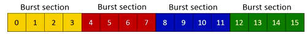
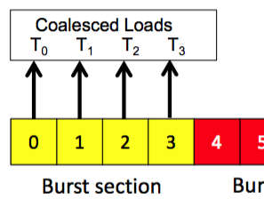
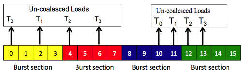
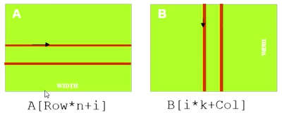
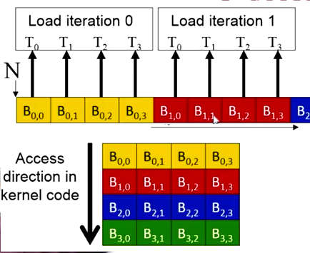
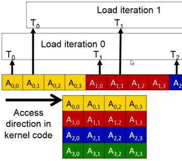
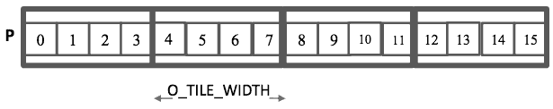
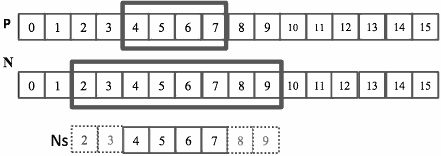
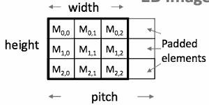
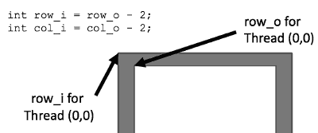

...menustart

- [Week 3](#03ad46b2f78354b2ecdabcc86a0e3038)
    - [Lecture 3.1: Performance Considerations - DRAM Bandwidth](#9e154d049a61276cf1e8879ab43e1bef)
    - [Lecture 3.2: Performance Considerations - Memory Coalescing(合并)](#fa80e8ff237e18cb6bd504978091572b)
        - [Memory Coalescing](#e1d70f519d63cad8f8154c3d41ffbaf3)
        - [How to Judge at Programming Time?](#1ea6b7a9b2e4d84f18bc09b2ecf67841)
        - [2 Access Patterns of Basic Matrix Multiplication](#be64aab7f1eee36b6d41490de0f7560d)
        - [B accesses are coalesced](#f692fb049a95de829ed7815a74639e65)
        - [A accesses are not be coalesced](#e6e37d819882be8162d625bddd2666ab)
        - [Loading an Input Tile](#c840df8e6fb6e2c83304d20c9957df54)
    - [Lecture 3.3: Parallel Computation Patterns - Convolution](#868fdcce5545525909023e0df12f50c1)
        - [Convolution(卷积) Applications](#a4e66cce2455ee33bb2cf54243c46894)
        - [Convolution Computation](#9d5a4b777d7c57890bc7dc904cfb407a)
        - [1D Convolution Example](#560df6510521fe365a4654a1d3bfd888)
        - [1D Convolution Boundary Condition](#3b58f1cfbef85d38d2d05cd13d6092c7)
        - [A 1D Convolution Kernel with Boundary Condition Handling](#68ce3367d77b87605cc4cd9e96215878)
        - [2D Convolution](#d19877528ebd4476f1d6b3f179962923)
    - [Lecture 3.4: Parallel Computation Patterns - Tiled Convolution](#2803b5bcf376991d9eab8da5f135d264)
        - [Thread to Output Data Index Mapping](#bd684c551af0dfa4411d89bcd0ee6f04)
        - [Defining Input Tiles](#32211af9c7e454495481d7c2918c406a)
        - [Setting Block Size](#e850517f5c06f03aec20c2e8904442d5)
        - [Shared Memory Data Reuse](#0f9e8a0e1bbe5b3ece42c7ba60cedd92)
    - [Lecture 3.5: Parallel Computation Patterns - 2D Tiled Convolution Kernel](#9a6d725d88b8414ff6301d247d430ef5)
        - [Image Matrix Type in HPP Course](#2ba482c81ba88ff57fd970dd34b9b5d3)
        - [Setting Block Size](#e850517f5c06f03aec20c2e8904442d5)
        - [Using constant memory and caching for Mask](#3d3221ca72dda480033be629966ee057)
        - [Shifting from output coordinates to input coordinate](#4e896526ade32fa3e3ec1424c10655a8)

...menuend


<h2 id="03ad46b2f78354b2ecdabcc86a0e3038"></h2>


## Week 3

<h2 id="9e154d049a61276cf1e8879ab43e1bef"></h2>


### Lecture 3.1: Performance Considerations - DRAM Bandwidth 

DRAM数据吞吐就像高速公路的收费站, 为了保证进出站效率一般会设置很多的收费口， 同样的，DRAM也被设计为在 Busting Mode下工作.

<h2 id="fa80e8ff237e18cb6bd504978091572b"></h2>


### Lecture 3.2: Performance Considerations - Memory Coalescing(合并) 



 - Each address space is partitioned into burst sections
    – Whenever a location is accessed, all other locations in the same section are also delivered to the processor
 - To example: a 16-byte address space, 4-byte burst sections
    - every time location 5 , of a burst section is accessed, all the location 4,5,6,7 will also be delivered to the processor along with location 5.  
    – In practice, we have at least 4GB address space, 128-byte burst sections

<h2 id="e1d70f519d63cad8f8154c3d41ffbaf3"></h2>


#### Memory Coalescing



 - When all threads of a warp execute a load, if all accessed locations fall into the same burst section, only one DRAM request will be made and the access is fully coalesced.



 - When the accessed locations spread across burst section boundaries, coalescing fails, multiple DRAM requests are made and the access is not fully coalesced.
 - In modern GPUs , we actually have cache memories that alleviate many of the uncoalesced access of the 2nd catagory(right 1). So we will be focusing more on the situation where the threads do not access consecutive memory locations (left 1).

<h2 id="1ea6b7a9b2e4d84f18bc09b2ecf67841"></h2>


#### How to Judge at Programming Time?

 - Accesses in a warp are to consecutive locations if the index in an array access is in the form of
    – A[(terms independent of threadIdx.x)+ threadIdx.x];

<h2 id="be64aab7f1eee36b6d41490de0f7560d"></h2>


#### 2 Access Patterns of Basic Matrix Multiplication



 - i is loop counter in the inner product loop of the kernel code
 - A is mxn, B is nxk
 - Col = blockIdx.x*blockDim.x + threadIdx.x
 
<h2 id="f692fb049a95de829ed7815a74639e65"></h2>


#### B accesses are coalesced



It's not about the access of each thread. It really about the locations accessed by neighboring threads in the same memory. This is another coalesced access.

So whenever we see that adjacent threads are accessing adjacent locations in the memory , and then they all move to the down and access adjacent locations in the memory , then we see a perfectly good coalesced memory access pattern.

<h2 id="e6e37d819882be8162d625bddd2666ab"></h2>


#### A accesses are not be coalesced

 

<h2 id="c840df8e6fb6e2c83304d20c9957df54"></h2>


#### Loading an Input Tile

```
A[Row][tx]
B[ty][Col]
```

<h2 id="868fdcce5545525909023e0df12f50c1"></h2>


### Lecture 3.3: Parallel Computation Patterns - Convolution 

<h2 id="a4e66cce2455ee33bb2cf54243c46894"></h2>


#### Convolution(卷积) Applications

 - Often performed as a filter that transforms signals and pixels into more desirable values.
    - Some filters smooth out the signal values so that one can see the big-picture trend 
    - Others like Gaussian filters can be used to sharpen boundaries and edges of objects in images
    
<h2 id="9d5a4b777d7c57890bc7dc904cfb407a"></h2>


#### Convolution Computation

 - An array operation , where each output data element is weighted sum of a collection of neighboring input elements
    - In general, when we perform convolution, we will transform an input array into an output array of the same size
    - To compute each output array element we will take the corresponding input element and some of the neighboring elements in the input array, to perform a weighted sum calculationg.
 - The weights used in the weighted sum calculation are defined by an input mask array, commonly referred to as the *convolution kernel*
     - we will refer to these mask array as convolution masks to avoid confusion (against kernel function in CUDA)
     - the same convolution mask is typically used for all elements of the array
     

<h2 id="560df6510521fe365a4654a1d3bfd888"></h2>


#### 1D Convolution Example


 - a mask of 5 elements
 - Commonly used for audio processing
    - Mask size is usually an ***odd*** number of elements for symmetry 
 - Calculation of P[2] = 57
 - P[3] = 2\*3 + 3\*4 + 4\*5 + 5\*4 + 6\*3 = 76
 
<h2 id="3b58f1cfbef85d38d2d05cd13d6092c7"></h2>


#### 1D Convolution Boundary Condition

 - Calculation of output elements near the boundaries (beginning and end) of the input array need to deal with “ghost” elements
    – Different policies (0, replicates of boundary values, etc.)
    - 可以有不同的策略，比如处理为0， 或者复制边界值
    
<h2 id="68ce3367d77b87605cc4cd9e96215878"></h2>


#### A 1D Convolution Kernel with Boundary Condition Handling

 - This kernel forces all elements outside the image to 0

```
# N: input array
# M: mask array
# P : output array
# Mask_Width: number of elements in mask array
# Width: number of elements in input array
__global__ void convolution_1D_basic_kernel(float *N, float *M, float *P,
                    int Mask_Width, int Width) 
{
    int i=blockIdx.x * blockDim.x + threadIdx.x ;
    
    float Pvalue = 0 ;
    int N_start_point = i-(Mask_Width/2);
    for (int j=0; j< Mask_Width; j++) {
        if ( N_start_point + j >=0 && N_start_point+j < Width ) {
            Pvalue += N[N_start_point +j]* M[j];
        }
    }
    P[i] = Pvalue ; 
}
```

<h2 id="d19877528ebd4476f1d6b3f179962923"></h2>


#### 2D Convolution

similar to 1D case


<h2 id="2803b5bcf376991d9eab8da5f135d264"></h2>


### Lecture 3.4: Parallel Computation Patterns - Tiled Convolution 

defining input/output tiles diferently, in order to manager the complexity.

<h2 id="bd684c551af0dfa4411d89bcd0ee6f04"></h2>


#### Thread to Output Data Index Mapping



 - Each thread block calculates an output tile
 - Each output tile width is O_TILE_WIDTH
 - For each thread,
    - index_o = blockIdx.x*O_TILE_WIDTH + threadIdx.x
 - O_TILE_WIDTH is 4 in this example
 

<h2 id="32211af9c7e454495481d7c2918c406a"></h2>


#### Defining Input Tiles



 - Each input tile has all values needed to calculate the corresponding output tile.
    - input tile size depends on the mask width
    - in practice , input size is relatively close to output tile
 - Size each thread block to cover input tiles
blockDim.x is 8 in this example

<h2 id="e850517f5c06f03aec20c2e8904442d5"></h2>


#### Setting Block Size

```
#define O_TILE_WIDTH 1020
#define BLOCK_WIDTH  (O_TILE_WIDTH + 4) // POT
```

 - The Mask_Width is 5 in this example
 - In General, block width should be output tile width + (mask width -1)
 
<h2 id="0f9e8a0e1bbe5b3ece42c7ba60cedd92"></h2>


#### Shared Memory Data Reuse

understanding the benefit of tiled algorithms for convolution patterns.

N_ds:  2 3 **4 5 6 7** 8 9

 - Mask_Width is 5
 - Unlike in the matrix multiplication example, convolution calculation do not have the same number of re-use for all the input elements loaded into the shared memory.
 - Element 2 is only used in the calcuation of output element 4 (once)
 - Element 3 is used by threads 4,5 ( twice )
 - Element 4 is used by threads 4,5,6 ( 3X )
 - ...
 
<h2 id="9a6d725d88b8414ff6301d247d430ef5"></h2>


### Lecture 3.5: Parallel Computation Patterns - 2D Tiled Convolution Kernel 



 - It is sometimes desirable to pad each row of a 2D matrix to multiples of DRAM bursts
    - So each row starts at the DRAM burst boundary
    - Effectively adding columns
    - This is usually done automatically by matrix allocation function
    - Pitch can be different for different hardware
    - In this example, assume the DRAM burst is four elements


<h2 id="2ba482c81ba88ff57fd970dd34b9b5d3"></h2>


#### Image Matrix Type in HPP Course

```
// Image Matrix Structure declaration
typedef struct {
    int width;
    int height;
    int pitch;
    int channels;
    float* data;
} * wbImage_t;
```

 - This type will only be used in the host code of the machine problem
 - by the time you invoke your kernel you should have extracted the data and the width and height and pitch , and send them into the kernel

<h2 id="e850517f5c06f03aec20c2e8904442d5"></h2>


#### Setting Block Size

```
#define O_TILE_WIDTH 12
#define BLOCK_WIDTH (O_TILE_WIDTH + 4)

dim3 dimBlock(BLOCK_WIDTH,BLOCK_WIDTH);
dim3 dimGrid((wbImage_getWidth(N)-1)/O_TILE_WIDTH+1,
             (wbImage_getHeight(N)-1)/O_TILE_WIDTH+1, 1)
```

 - In general, BLOCK_WIDTH should be O_TILE_WIDTH + (MASK_WIDTH-1)
 
<h2 id="3d3221ca72dda480033be629966ee057"></h2>


#### Using constant memory and caching for Mask

 - Mask is used by all threads but not modified in the convolution kernel
    - All threads in a warp access the same locations at each point in time
 - CUDA devices provide constant memory whose contents are aggressively cached
    - Cached values are broadcast to all threads in a warp
    - Effectively magnifies memory bandwidth without consuming shared memory
    - Use of ***const __restrict__*** qualifiers for the mask parameter informs the compiler that it is eligible for constant caching

For example:    

```
__global__ void convolution_2D_kernel(float *P, float *N, height, width, channels, const float __restrict__ *M) {
```

<h2 id="4e896526ade32fa3e3ec1424c10655a8"></h2>


#### Shifting from output coordinates to input coordinate



