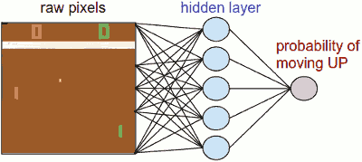
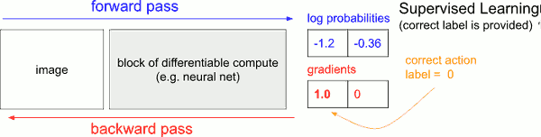
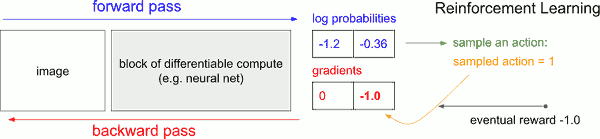

...menustart

 - [Pong From Pixel](#14c8bcab6d8cbd9dd30f671937d1930e)
     - [Policy network](#c8ec2431da786d1805ac35666846a034)
         - [implement this policy network in Python/numpy](#8527e311e4e8e7b217e4eb3df745bacf)
     - [preprocessing](#4da478b2dea92208e1212e4dfc88e520)
     - [It sounds kind of impossible.](#ba0a2315087f7fb29261db63e3183a76)
     - [Supervised Learning.](#43db94d830cd7723a6d7a21a311d9bf4)
     - [Policy Gradients](#6c11e2dd65ad60a6dd6cf3a2be08fa0c)
     - [Training protocol](#abc3a1be8d17524478c2cc2d1399fe32)

...menuend


<h2 id="14c8bcab6d8cbd9dd30f671937d1930e"></h2>


# Pong From Pixel 

[pong from pixel](http://karpathy.github.io/2016/05/31/rl/)

 - the game works as follows:
    - we receive an image frame (a 210x160x3 byte array (integers from 0 to 255 giving pixel values)) 
    - and we get to decide if we want to move the paddle UP or DOWN (i.e. a binary choice). 
    - After every single choice the game simulator executes the action and gives us a reward: 
        - Either a +1 reward if the ball went past the opponent
        - a -1 reward if we missed the ball
        - or 0 otherwise
    - our goal is to move the paddle so that we get lots of reward.

Keep in mind that we’ll try to make very few assumptions about Pong because we  don’t really care about Pong; We care about complex, high-dimensional problems like robot manipulation, assembly and navigation.

Pong is just a fun toy test case, something we play with while we figure out how to write very general AI systems that can one day do arbitrary useful tasks.

---

<h2 id="c8ec2431da786d1805ac35666846a034"></h2>


## Policy network

 - This network will take the state of the game and decide what we should do (move UP or DOWN). 
 - we’ll use a 2-layer neural network that takes the raw image pixels (100,800 numbers total (210\*160\*3)) , and produces a single number indicating the probability of going UP. 
    - As our favorite simple block of compute
 - Note that it is standard to use a *stochastic* policy, meaning that we only produce a *probability* of moving UP.
 - Every iteration we will sample from this distribution (i.e. toss a biased coin) to get the actual move. 




> Our policy network is a 2-layer fully-connected net.

<h2 id="8527e311e4e8e7b217e4eb3df745bacf"></h2>


### implement this policy network in Python/numpy

```python
h = np.dot(W1, x) # compute hidden layer neuron activations
h[h<0] = 0 # ReLU nonlinearity: threshold at zero
logp = np.dot(W2, h) # compute log probability of going up
p = 1.0 / (1.0 + np.exp(-logp)) # sigmoid function (gives probability of going up)>]
```

 - in this snippet W1 and W2 are two matrices that we initialize randomly. 
 - We’re not using biases because meh.
 - Notice that we use the sigmoid non-linearity at the end, which squashes the output probability to the range [0,1]
 - Intuitively, the neurons in the hidden layer (which have their weights arranged along the rows of W1) can detect various game scenarios (e.g. the ball is in the top, and our paddle is in the middle), and the weights in W2 can then decide if in each case we should be going UP or DOWN. 

<h2 id="4da478b2dea92208e1212e4dfc88e520"></h2>


## preprocessing

 - Ideally you’d want to feed at least 2 frames to the policy network so that it can detect motion
 - To make things a bit simpler , I’ll do a tiny bit of preprocessing. 
    - e.g. we’ll actually feed difference frames to the network (i.e. subtraction of current and last frame).

<h2 id="ba0a2315087f7fb29261db63e3183a76"></h2>


## It sounds kind of impossible.

 - We get 100,800 numbers (210\*160\*3) and forward our policy network (which easily involves on order of a million parameters in W1 and W2). 
 - Suppose that we decide to go UP. The game might respond that we get 0 reward this time step and gives us another 100,800 numbers for the next frame. We could repeat this process for hundred timesteps before we get any non-zero reward!
    - E.g. suppose we finally get a +1. That’s great, but how can we tell what made that happen? Was it something we did just now? Or maybe 76 frames ago? Or maybe it had something to do with frame 10 and then frame 90? 
    - And how do we figure out which of the million knobs to change and how, in order to do better in the future? 
 - We call this the *credit assignment problem*
 - In the specific case of Pong we know that we get a +1 if the ball makes it past the opponent. The *true* cause is that we happened to bounce the ball on a good trajectory, but in fact we did so many frames ago 
    - e.g. maybe about 20 in case of Pong, and every single action we did afterwards had zero effect on whether or not we end up getting the reward.
 - In other words we’re faced with a very difficult problem and things are looking quite bleak.

<h2 id="43db94d830cd7723a6d7a21a311d9bf4"></h2>


## Supervised Learning. 

I’d like to remind you briefly about supervised learning because, as we’ll see, RL is very similar. 



 - In ordinary supervised learning we would feed an image to the network and get some probabilities,  e.g. for two classes UP and DOWN.
    - log probabilities (-1.2, -0.36) for UP and DOWN instead of the raw probabilities (30% and 70% in this case) because we always optimize the log probability of the correct label
    - log makes math nicer, and is equivalent to optimizing the raw probability because log is monotonic
 - Now, in supervised learning we would have access to a label. For example, we might be told that the correct thing to do right now is to go UP (label 0). 
    - In an implementation we would enter gradient of 1.0 on the log probability of UP and run backprop to compute the gradient vector 
    - ∇<sub>w</sub> log p(y=UP|x)
    - This gradient would tell us how we should change every one of our million parameters to make the network slightly more likely to predict UP
  

<h2 id="6c11e2dd65ad60a6dd6cf3a2be08fa0c"></h2>


## Policy Gradients

but what do we do if we do not have the correct label in the Reinforcement Learning setting?

Here is the Policy Gradients solution.



 - Our policy network calculated probability of going UP as 30% (logprob -1.2) and DOWN as 70% (logprob -0.36).
 - We will now sample an action from this distribution; E.g. suppose we sample DOWN, and we will execute it in the game. 
 - At this point notice one interesting fact: We could immediately fill in a gradient of 1.0 for DOWN as we did in supervised learning,and find the gradient vector that would encourage the network to be slightly more likely to do the DOWN action in the future.
 - So we can immediately evaluate this gradient and that’s great, but the problem is that at least for now we do not yet know if going DOWN is good.
 - But the critical point is that that’s okay, because we can simply wait a bit and see! 
    - For example in Pong we could wait until the end of the game, then take the reward we get (either +1 if we won or -1 if we lost), and enter that scalar as the gradient for the action we have taken (DOWN in this case). 
 - In the example, going DOWN ended up to us losing the game (-1 reward).
 - So if we fill in -1 for log probability of DOWN and do backprop we will find a gradient that discourages the network to take the DOWN action for that input in the future

<h2 id="abc3a1be8d17524478c2cc2d1399fe32"></h2>


## Training protocol

 - How training will work ?
    - initialize the policy network with W1,W2, play 100 games (rollout)
    - assume
        - each game is made up of 200 frames
        - 


