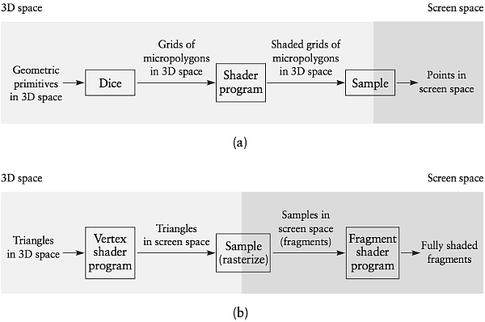

[](...menustart)

- [REAL-TIME PROGRAMMABLE SHADING](#d28a0486786f74d1b8b87e4f0f4ba0d8)
    - [What Makes Real-Time Shading Different?](#ac3b68d5bc77b0af11c49582c731effc)
    - [What You Need to Learn Elsewhere](#bceaf8901c4bf8e690d273b9ca06e873)
    - [Object Space Shading versus Screen Space Shading](#194e16940099edf5d5feb9cf49cd534c)
    - [Parallelism](#374424d359c920b4d388c77660224bd7)
    - [Hardware Data Types](#08dfcbeeca887b168a095c5853221419)
    - [Resource Limits](#febe674abc9aa524c322edbbd8ec668c)
    - [Memory Bandwidth and Performance Tuning](#eb87a55c812665df93a3f47793d84492)
    - [SIMPLE EXAMPLES](#67141f3d173330f740c944f069952a6f)
        - [Vertex and Fragment Code in the Stanford Shading System](#b2f1e90c968407082785bde9f97eec3d)
        - [Two Versions of the Heidrich/Banks Anisotropic Shader](#28e05f431b21ce4215b2a2fa4f7dd5a1)
        - [TODO , stop @ pdf page 143 of 722](#16eaf98c8673903dab1be6ce345c07c9)

[](...menuend)


<h2 id="d28a0486786f74d1b8b87e4f0f4ba0d8"></h2>

# REAL-TIME PROGRAMMABLE SHADING

There are some significant differences between real-time programmable shading and offline programmable shading. 

<h2 id="ac3b68d5bc77b0af11c49582c731effc"></h2>

## What Makes Real-Time Shading Different?

- *Most applications are interactive.*
     - As a result, the shader writer usually does not know which viewpoints will be used to view an object and may not even know which lights will be near an object.
- *Performance is critical.*
- *Shaders execute on graphics hardware.*
     - Graphics hardware provides high performance at low cost, but imposes certain restrictions on shading programs in order to obtain this high performance.


<h2 id="bceaf8901c4bf8e690d273b9ca06e873"></h2>

## What You Need to Learn Elsewhere

If you are writing a complete real-time graphics application, you will need to understand the entire graphics pipeline, not just the programmable shading parts of it. 

There are two major interfaces for controlling the entire graphics pipeline -— Direct3D and OpenGL.

<h2 id="194e16940099edf5d5feb9cf49cd534c"></h2>

## Object Space Shading versus Screen Space Shading

- Hardware graphics pipelines perform some programmable shading in object space (at vertices) 
- and some programmable shading in screen space (in effect, at pixels).

In contrast, the REYES algorithm used by Pixar’s PRMan performs all shading in object space, at the vertices of automatically generated micropolygons. (Note that other RenderMan implementations, such as BMRT, use different approaches.)

Hardware pipelines use the hybrid vertex/pixel shading approach for a variety of reasons, including the need for high performance and the evolutionary path that graphics harware has followed in the past. 

We will explain the two approaches to programmable shading in more detail and discuss their advantages and disadvantages.

RenderMan uses curved surfaces (both tensor-product splines and subdivision surfaces) as its primary geometric primitives. To render these surfaces, PRMan dices them into grids, then uniformly tessellates each grid into “micropolygons” that are smaller than a pixel, as in Figure 3.1(a). 



> FIGURE 3.1 Comparison of (a) the REYES pipeline (used in Pixar’s RenderMan) and (b) the pipeline used in real-time graphics hardware.

The programmable shader executes at each vertex of these micropolygons. The programmable shader may change the position of the vertex, as well as calculate its color and opacity. 

Next, for each pixel in which a micropolygon is visible, its color is evaluated at one or more screen space sample points. 

In contrast, graphics hardware uses triangular polygons as its primary geometric primitive. One set of programmable shading computations is performed at the vertices of these triangles, prior to their transformation into screen space. 

The most important difference between object space shading and screen space shading is that an object space shader may change the position of the surface -— that is, it can displace the surface, using either a displacement map or a procedural computation. 

In contrast, a screen space shader is forbidden to change the three- dimensional position of a fragment because the (u,v) screen space location of the fragment has already been fixed by the rasterizer.  A screen space shader is limited to changing the screen space depth of a fragment.

For rapidly varying shading computations such as specular lighting, it is important that the shading computation be performed approximately once per pixel to produce high-quality images. Screen space shading is automatically performed at this rate, but object space shading is not.  The REYES algorithm solves this problem by automatically generating micropolygons of the necessary size from curved surfaces specified by the user. There are a number of reasons why this approach has not yet been used in real-time hardware:

- Historically, the performance of graphics hardware has not been high enough to allow the use of pixel-sized polygons. Transformation and lighting were performed relatively infrequently at the vertices of large polygons, and these results were interpolated in screen space. 
     - This interpolation is much more efficient than reevaluating the shading equation at each pixel. 
     - The performance of graphics hardware has now increased to the point where this optimization is less important than it once was, but because performance is so crucial in real- time graphics, it is still useful to be able to perform some computations less of- ten than others.
- If all shading computations are performed at object space vertices, it is crucial that polygons be approximately the size of a pixel. Adopting this approach for real-time use would require automatic tessellation of curved surfaces and/or large polygons to form micropolygons. 
     - To avoid performance loss from the CPU-to-GPU bandwidth bottleneck, this tessellation must be performed by the graphics hardware.
     - As of this writing, some hardware does support hardware tessellation of curved surfaces, but this hardware lacks the automatic adjust- ment of tessellation rate needed to guarantee pixel-sized micropolygons and has not been widely used by developers.
- Because graphics hardware has historically performed high-frequency shading computations at fragments rather than vertices, 2002-generation graphics hardware does not support the use of texture maps at vertices.

There are several other differences between the pure object space shading model used by the REYES algorithm and the hybrid model used by graphics hardware:

- If a displacement map contains large, rapidly varying displacements, the object space shading model can create polygons that are large and flat-shaded in screen space. In contrast, the hybrid vertex/fragment shading model performs fragment computations once per pixel even for large polygons generated by the displacement process.
- The object space shading model allows motion blur and depth-of-field effects to be generated inexpensively. Shading computations are performed once in object space, and the shaded surfaces are sampled many times to generate the motion blur and depth-of-field effects. In contrast, the accumulation buffer technique that is typically used to generate these effects in conjunction with screen space shading requires that the shading computations be repeated for each set of samples.
- Antialiasing of procedural shaders often relies on derivative computations, and computing these derivatives is very simple at fragments. If vertices are specified directly (rather than automatically generated by dicing, as in REYES), computing derivatives at vertices is more complex than doing so at fragments because the neighborhood relationships for vertices are less regular.

One minor, but sometimes annoying, implication of the different rendering approaches used by RenderMan and real-time hardware is that real-time hardware does not make the “geometric normal” available to vertex programs. 

- In RenderMan, the geometric normal is available as the variable *Ng* and is directly computed from the local orientation of the curved surface being rendered. 
- In 2002-generation graphics hardware, only the shading normal *N* is available in vertex programs.


<h2 id="374424d359c920b4d388c77660224bd7"></h2>

## Parallelism

Graphics hardware relies heavily on several forms of parallelism to achieve high performance. 

On 2002-generation graphics hardware, the programmable vertex processor allows only access to data for a single vertex. As a result, the hardware can perform operations on different vertices in any order or in parallel. If multiple vertex processors operate in parallel, no communication or synchronization is required between them.  Likewise, the programmable fragment processor allows access to data for just one fragment. High-level real-time shading languages that compile to this hardware must expose the restriction that each vertex is processed independently and each fragment is processed independently.

If both read and write access is provided to a memory, that memory provides another form of communication. The system must define (and support) ordering semantics for the reads and writes. To avoid the costs associated with supporting these ordering semantics, 2002-generation GPUs tightly restrict memory accesses. Fragment processors can read from texture memory, but not write to it. Fragment processors can write to frame buffer memory, but not read from it. The only read access to frame buffer memory is via the nonprogrammable read/modify/write blend unit. These read/modify/write operations are performed in the order that polygons were specified, but the hardware required to implement this ordering is simplified because the fragment processor is not allowed to specify the address of the write. Instead, the write address is determined by the (nonprogrammable) rasterizer. All of these restrictions are exposed in high-level real-time shading languages.  

Fortunately, the restrictions are straightforward and are also present in the RenderMan shading language.

One implication of the restricted memory access model is that a compiler must store all of a shader’s temporary variables in hardware registers. On a CPU, temporary variables can be “spilled” from registers to main memory, but this simple strategy does not work on a GPU because there is no general read/write access to memory. The only way to perform this spilling on 2002-generation graphics hardware is for the compiler to split the shading computation into multiple hardware rendering passes. Then, temporary variables can be saved into the graphics memory in one pass and restored from that memory in a subsequent rendering pass.

At the fragment level, most 2002-generation graphics hardware uses a SIMD (single instruction, multiple data) computation model. Hardware that uses this SIMD computation model cannot execute data-dependent loops using a single hardware rendering pass. Shading languages that compile to this hardware must either forbid these operations or implement them inefficiently by using multiple rendering passes and stencil-buffer tests. 

The situation is different for vertex computations. Some 2002-generation hardware supports looping and branching for vertex computations. Thus, the vertex hardware uses an SPMD (single program, multiple data) computation model -- different vertices execute the same program, but they may take different execution paths through that program.

The SIMD computation model is less expensive to implement in hardware than the SPMD model because the instruction storage, fetch, and decode hardware can be shared among many processing units. Furthermore, SIMD execution can easily guarantee that the computations for different fragments complete in the correct order. However, data-dependent looping is valuable for algorithms such as anisotropic filtering, antialiasing of turbulent noise functions, and traversal of complex data structures. For these reasons, it is likely that graphics hardware will eventually incorporate direct support for conditional branch instructions in fragment programs.  Maybe.

<h2 id="08dfcbeeca887b168a095c5853221419"></h2>

## Hardware Data Types

Graphics hardware has historically used low-precision, fixed-point data types for fragment computations.

But general-purpose shader programs require higher-precision data types, especially for texture coordinate computations (e.g., computing the index into an environment map). Shader programs are also easier to write if the hardware supports floating-point data types instead of fixed-point data types, since the availability of floating-point data types frees the programmer from having to worry about scale factors.

For these reasons, 2002-generation hardware supports 32-bit floating-point fragment arithmetic.


<h2 id="febe674abc9aa524c322edbbd8ec668c"></h2>

## Resource Limits

In general, graphics hardware has limits on resources of various types. 

- Memory for storing instructions
- Registers for storing temporary variables
- Interpolators for vertex-to-fragment interpolants
- Texture units
- Memory for textures and frame buffer


<h2 id="eb87a55c812665df93a3f47793d84492"></h2>

## Memory Bandwidth and Performance Tuning

Z-buffered rendering consumes an enormous amount of memory bandwidth for reading and writing the frame buffer. If surfaces are texture mapped, additional memory bandwidth is required to read the texels from texture memory. As a result, the performance of real-time graphics hardware has historically been limited primarily by memory bandwidth, especially when rendering large polygons.

Graphics hardware designers have taken an approach —- they have placed the increased computational performance at the programmer’s disposal, by adding the programmable hardware units that are the focus of this chapter. 

Besides enabling the generation of much more realistic images, these programmable units indirectly reduce the demand for memory bandwidth by allowing programmers to use a single rendering pass to implement algorithms that used to require multiple rendering passes. 

Unfortunately, the availability of these programmable units makes performance tuning very complex. 

Detailed approaches to performance tuning are hardware dependent, but we will describe two performance-tuning techniques that are broadly applicable.

- First, it is often possible to trade compute performance for memory bandwidth and vice versa. 
     - The simplest example of such a trade-off is the use of a table lookup (i.e., texture read) in place of a complex computation. 
- Second, for programs that are limited by memory bandwidth, it may be possible to improve performance by more effectively utilizing the hardware’s texture cache.
     - In general, reducing the size of a texture will improve performance, as will restructuring programs that use table lookups so that they are more likely to repeatedly access the same table entries.

<h2 id="67141f3d173330f740c944f069952a6f"></h2>

## SIMPLE EXAMPLES

<h2 id="b2f1e90c968407082785bde9f97eec3d"></h2>

### Vertex and Fragment Code in the Stanford Shading System

Most of the commercially available GPU programming languages require that the user write two separate programs -— a vertex program and a fragment program.

One of the unique features of the Stanford shading language is the ability to combine vertex and fragment computations within a single program. 

The user specifies whether computations are per vertex or per fragment by using the *vertex* and *fragment* type modifiers. 

The Stanford language also allows computations to be performed once for each group of primitives, using the *primitive group* type modifier. 

Typically, this capability is used for operations such as inverting and transposing the model-view matrix.

```
//
// A very simple program written in the Stanford shading language. This program 
// includes both vertex computations and fragment computations. The fragment
// type modifier indicates that a variable is instanced once for each fragment.
// Likewise, the vertex and primitive group type modifiers indicate that a variable 
// is instanced once for each vertex or once for each group of primitives,
// respectively.
//
// Scale ‘u’ component of texture coordinate, and apply texture to surface 
//
surface shader float4
applytexture (vertex float4 uv, primitive group texref star) {
    vertex float4 uv_vert = {uv[0]*2, uv[1], 0, 1}; // Scale texcoord 
    fragment float4 uv_frag = uv_vert; // Interpolate 
    fragment float4 surf = texture(star, uv_frag); // Texture lookup 
    return surf;
}
```

The Stanford language uses simple “type promotion” rules to determine whether specific computations within an expression are mapped to the CPU, the vertex processor, or the fragment processor.

When a vertex expression is multiplied by a fragment expression, the vertex expression is interpolated to produce a fragment expression before performing the multiplication on the fragment processor. 

The compiler is responsible for using these rules to split the user’s single program into separate vertex and fragment programs that can be executed on the graphics hardware, and ***a separate primitive group program that is executed on the CPU***.

This unified vertex/fragment programming model is very convenient for straight-line code, but it becomes unwieldly in a language that supports imperative looping constructs, such as “for” and “while” loops. The Stanford language doesn’t support these constructs, but the newer commercially available languages do, and therefore they require the user to write separate vertex and fragment programs. 

<h2 id="28e05f431b21ce4215b2a2fa4f7dd5a1"></h2>

### Two Versions of the Heidrich/Banks Anisotropic Shader

One of the most important advantages of programmable graphics hardware is that it can be used to implement almost any lighting model. 

For anisotropic surfaces, one lighting model that is especially appropriate for real-time use is Heidrich and Seidel’s (1999) formulation of the Banks (1994) anisotropic lighting model.

Heidrich and Seidel’s lighting model was designed to execute efficiently on graphics hardware. The vertex-processing hardware computes a pair of dot products, and these dot products are used as indices for a 2D table lookup at each fragment. The 2D table is precomputed and stored in a 2D texture map. 

<h2 id="16eaf98c8673903dab1be6ce345c07c9"></h2>

### TODO , stop @ pdf page 143 of 722

---

---


