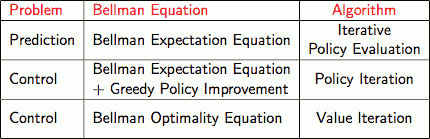
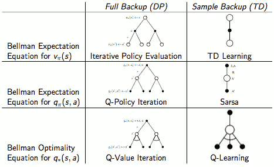
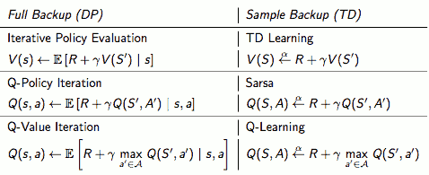
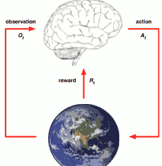
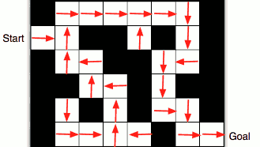
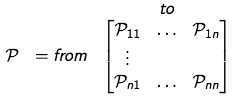
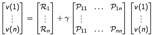

- [RL David Silver](#9524b1c1f1bedffb663a033d3c61945b)
- [Lecture Introduction](#9d93bb2c4dac212799da231d0de41baa)
    - [2 About Reinforcement Learning](#b653b982b2e157521c85448fa1691ee7)
        - [Characteristics of Reinforcement Learning](#020ca729d2be3285264a5a18406cf5dd)
    - [3 The Reinforcement Learning Problem](#68fe7bb3961118eaaa887017e9783062)
        - [Rewards](#0d1c608c1498367815da8105e26b0a9e)
        - [Sequential Decision Making](#aa3defd392f2e41771f6eb18dd4fa83b)
        - [Agent and Environment](#4ac238303a852194c91c7f6049b8bf96)
        - [History and State](#97d4e953a41e7b6286e4b64996685f5f)
        - [Environment State](#e3cfaeeacd3da2524172e159513a16a6)
        - [Agent State](#3b46cd6952a6d7d4f5242eed8d2f16dd)
        - [Information State](#1b3aea5674ac4ad59a561a6d55cfaf4d)
        - [Fully Observable Environments](#dd001f6c9dbf7a80bee787f2a211bc62)
        - [Partially Observable Environments](#e335cf476058a7c19c94c20f9bb4a45a)
    - [4 Inside An RL Agent](#b1a766cbf71cf8079d7378af1763be7b)
        - [Major Components of an RL Agent](#8920cbd38d5a445d3758b6a04e5ac9df)
        - [Policy](#51359e8b51c63b87d50cb1bab73380e2)
        - [Value Function](#52790a9930eefe2ce7b9c9e29dec6dd5)
        - [Model](#a559b87068921eec05086ce5485e9784)
        - [Maze Example](#887dd5c11df64a83f383a29393db9f0c)
        - [Categorizing RL agents 1](#2f14f08fef3dc09988aac5fd9e735876)
        - [Categorizing RL agents 2](#c155b44e0ed60f75e1bcdb19547a1b19)
    - [5 Problems within Reinforcement Learning](#fc1b5d6a77ce0ec6ffbaf2fdd8749fe6)
        - [Learning and Planning](#87bd5df92a07c7da0886cec0ba36524a)
        - [Exploration and Exploitation](#9cb8554f07a9abcb138ed2f10a9218c8)
        - [Prediction and Control](#f887d9035769a495f7c1003560288bf7)
- [Lecture 2 : MDP](#37b66eeb744820b6efbb09622f9cb190)
    - [1 Markov Processes](#c440584a5fa828371c523cfccd255b9e)
        - [Introduction to MDPs](#37e7b8a197c50d52ae8423cb9109686b)
        - [Markov Property](#4ea596ca10da5f1b5af07b3347b23993)
        - [State Transition Matrix](#8e647e1e832a07ce0d2090fc315726c5)
        - [Markov Process ( Markov Chain )](#e2902ed9b6c060e5f1f0e3167f1e1944)
    - [2 Markov Reward Processes](#f91687486a039993c58cfec983acacd3)
        - [Markov Reward Process](#ae22669a0c18be8c9c4e1de1329591f3)
        - [Return](#988fd738de9c6d177440c5dcf69e73ce)
            - [Why discount?](#41458dcd9501edf77aaf22898b653157)
    - [MRP Value Function](#bccc96e13f6db6cbc1bf97ba5a9f3bcf)
        - [Bellman Equation for MRPs](#60c71554b7b04c962c22896abeeb3f06)
    - [Bellman Equation in Matrix Form](#22623095aa6a91da57af0415ea951ad3)
        - [Solving the Bellman Equation](#ca6ff64556e865d3cc3c89adc776f12a)
    - [3 Markov Decision Processes](#ac193cf39fe5c7158da7e14f1994b9c9)
        - [Markov Decision Process](#95ca0b19e36749a112193d611503cf95)
        - [Policies](#9e476387322a5c250893cf9c5c4ce78c)
        - [MDP Value Function](#44b625919ec17030b52b99aa088fdd61)
        - [MDP Bellman Expectation Equation](#167a4b79c8f956139d3b35587ddaa9b1)
    - [Optimal Value Function](#1841bc99dd9e3ee97c4db9280bedd143)
    - [Solving the Bellman Optimality Equation](#5ff924758554c32561fac1c148ff2f77)
- [Lecture 3:  Planning by Dynamic Programming](#584d541d9b907d43acf49966effa7bdd)
    - [Policy Iteration](#93eb2ac210d009dea486d01934ca6116)
    - [Modified Policy Iteration](#50e497bcd60bb8a8db19c9ebf9491087)
    - [TODO](#b7b1e314614cf326c6e2b6eba1540682)
    - [In-Place Dynamic Programming](#b42b555fa80b1183db917a141f970757)
- [Lecture 4: Model-Free Prediction](#f2a4c04b9562782f979f6f6365a693ea)
    - [Monte-Carlo Reinforcement Learning](#cca9ebf243a52673a1532a42bbd2e3f5)
    - [Monte-Carlo Policy Evaluation](#e35ea465ea31939812aef342727fbfe5)
        - [First-Visit Monte-Carlo Policy Evaluation](#ca72e9315ea8f81a61e682131eb8c332)
        - [Every-Visit Monte-Carlo Policy Evaluation](#ffbd1472cb4d7535eda096f7d4995b6a)
        - [Incremental Mean](#33efd086713c355c13f11c79e8304480)
    - [Temporal-Difference Learning](#e4ce07df12b2ef7a0b0f745ea0185fd9)
    - [MC and TD](#db2dcb707660729f9ba68926965d2e58)
    - [Driving Home Example](#906bb81a2a5f3c85ecb0f8fd2d2463e3)
    - [Advantages and Disadvantages of MC vs. TD (3)](#68154201a64057ceb4291f9695de4590)
    - [Dynamic Programming Backup](#4261968fe68698635cb479b713e3873f)
    - [Bootstrapping and Sampling](#b5bad1ef88d485efddae73555382fcb5)
- [Lecture 5: Model-Free Control](#3d2617dd982260ee654a16d8dec7d2a1)
    - [Example of Greedy Action Selection](#4c8ab096508f52654a28c785f6748251)
    - [Monte-Carlo Control](#07a161e40945e4b056c712775b4703ea)
    - [GLIE Monte-Carlo Control](#85d04a96bae9047010fec0f9592110da)
    - [Convergence of Sarsa](#08a9532ec1aa3228c440d83d04997958)
    - [Sarsa on the Windy Gridworld](#aaa26500d020666213140c69406d0d64)
    - [Backward View Sarsa(λ)](#a77c65574fc09544e64c5ab604f73346)
    - [Sarsa(λ) Gridworld Example](#49ba094543faf8342001ad06e950e315)
    - [Off-Policy Learning](#93860339a61c014360f61ae14296ae1c)
    - [Importance Sampling](#08c2fa83f31563f4fa7749548cf87ff4)
    - [Importance Sampling for Off-Policy Monte-Carlo](#c44f5bf2a0106935c78e4b5f365a0940)
    - [Importance Sampling for Off-Policy TD](#2aab383140e413901e497a99f9b40704)
    - [Q-Learning](#e4d17333d58040b1db710abe36cd5aec)

<h2 id="9524b1c1f1bedffb663a033d3c61945b"></h2>

# RL David Silver

https://search.bilibili.com/all?keyword=David%20Silver%E6%B7%B1%E5%BA%A6%E5%BC%BA%E5%8C%96%E5%AD%A6%E4%B9%A0&page=1&order=totalrank&tids_1=36

http://www0.cs.ucl.ac.uk/staff/d.silver/web/Teaching.html

- Solving the Bellman Equation
    1. computation directly by inverse martix
    2. iterative calculation
        - Dynamic programming
        - Monte-Carlo evaluation
        - Temporal-Difference learning
  - DP
    - Policy Evaluation
        - iterative application of Bellman expectation backup
    - Policy Iteration
        - **Evaluate** the policy π
        - **Improve**  the policy   by acting greedily
    - Value Iteration
        - iterative application of Bellman optimality backup
    - 
- MC
    - Prediction
        - idea: value = mean return
        - methods
            - First-Visit Monte-Carlo Policy Evaluation
            - Every-Visit Monte-Carlo Policy Evaluation
        - Incremental Monte-Carlo Updates
            - tricks: Incremental Mean
    - Control
        - Policy evaluation
        - Policy improvement 
            - ε-Greedy Policy Improvement
        - GLIE: Greedy in the Limit with Infinite Exploration (GLIE)
            - eg: ε = 1/k
- TD
    - Prediction
        - TODO
    - Control  
        - Natural idea: use TD instead of MC in our control loop
        - Policy evaluation: **Sarsa**
        - Policy improvement 
            - ε-greedy policy improvement
- Off-Policy Learning : Q-Learning
- Relationship Between DP and TD
    - 
    - 
    

- vπ(s) 
    - = expectation of all qπ(s,a) 
    - π(s) maybe a stochastic policy
    - in state s , there maybe 4 available actions: E,W,N,S, and the policy maybe 30% E, 70% S , so π(a=W|s) = π(a=N|s) = 0 ???
- qπ(s,a) 
    - = immediate reward r(s,a) + γ·expectation of all vπ(s') 
- vπ(s) / qπ(s,a) can represent recursively.
- v\*(s) 
    1. = max vπ(s) over all policy
    2. = max q\*(s,a) over all action 
    3. = max of  immediate reward r(s,a) over all action 
        - + γ·expectation of all v\*(s')
- q\*(s,a) 
    1. = max qπ(s,a) over all policy
    2. = immediate reward r(s,a) +   γ·expectation of all v\*(s')

<h2 id="9d93bb2c4dac212799da231d0de41baa"></h2>

# Lecture Introduction 

<h2 id="b653b982b2e157521c85448fa1691ee7"></h2>

## 2 About Reinforcement Learning

<h2 id="020ca729d2be3285264a5a18406cf5dd"></h2>

### Characteristics of Reinforcement Learning

- There is no supervisor, only a reward signal
- Feedback is delayed, not instantaneous
- Time really matters (sequential, non i.i.d data) 
    - iid : independent and identically distributed
- Agent’s actions affect the subsequent data it receives

<h2 id="68fe7bb3961118eaaa887017e9783062"></h2>

## 3 The Reinforcement Learning Problem

<h2 id="0d1c608c1498367815da8105e26b0a9e"></h2>

### Rewards

- A **reward** Rt is a scalar feedback signal
- Indicates how well agent is doing at step t
- The agent’s job is to maximise cumulative reward

---

- Reinforcement learning is based on the reward **hypothesis**
- Definition (Reward Hypothesis)
    - *All* goals can be described by the maximisation of expected cumulative reward

<h2 id="aa3defd392f2e41771f6eb18dd4fa83b"></h2>

### Sequential Decision Making

- Goal: *select actions to maximise total future reward* 
- Actions may have long term consequences
- Reward may be delayed
- It may be better to sacrifice immediate reward to gain more long-term reward

<h2 id="4ac238303a852194c91c7f6049b8bf96"></h2>

### Agent and Environment

- 
    - Agent 有两个输入： observation and reward. 这些输入共同决定 下一步措施。
- At each step t the agent: 
    - Receives observation Ot 
    - Receives scalar reward Rt
    - Executes action At
- The environment: 
    - Receives action At
    - Emits observation Ot+1 
    - Emits scalar reward Rt+1

<h2 id="97d4e953a41e7b6286e4b64996685f5f"></h2>

### History and State

- The **history** is the sequence of observations, actions, rewards 
    - Ht  = O₁,R₁,A₁,...,At-1,Ot,Rt
    - Histroy is huge. It is normally not useful. 
- What happens next depends on the history:
    - The agent selects actions
    - The environment selects observations/rewards
- **State** is the information used to determine what happens next
    - Formally, **state is a function of the history**:  st = f(Ht)

<h2 id="e3cfaeeacd3da2524172e159513a16a6"></h2>

### Environment State

- The **environment state** Sᵉt is the environment’s private representation
- The environment state is not usually visible to the agent
- Even if Sᵉt is visible, it may contain irrelevant information

--- 

- something about multi-agents
    - for each agent, it can consider all other agents and their interacting with environment to be a part of environment. 

<h2 id="3b46cd6952a6d7d4f5242eed8d2f16dd"></h2>

### Agent State 

- The **agent state** sªt is the agent’s internal representation
- It can be any function of history:
    - sªt = f(Ht) 

<h2 id="1b3aea5674ac4ad59a561a6d55cfaf4d"></h2>

### Information State

- an **information state** , a.k.a **Markov state** , contains all useful information from the history.
- Definition A state St is **Markov** if and only if
    - P[St+1 |St ] = P[St+1 |S₁,...,St ]
    - "The future is independent of the past given the present"
        - H1:t -> St -> Ht+1:∞
    - Once the state is known, the history may be thrown away
        - i.e. The state is a sufficient statistic of the future
    - The environment state Sᵉt is Markov
    - The history Ht is Markov

<h2 id="dd001f6c9dbf7a80bee787f2a211bc62"></h2>

### Fully Observable Environments

- **Full observability**: agent **directly** observes environment state
    - Ot = Sªt = Sᵉt
- Agent state = environment state = information state
- Formally, this is a **Markov decision process** (MDP)

<h2 id="e335cf476058a7c19c94c20f9bb4a45a"></h2>

### Partially Observable Environments

- **Partial observability**: agent **indirectly** observes environment:
    - A robot with camera vision isn’t told its absolute location
    - A trading agent only observes current prices
    - A poker playing agent only observes public cards
- Now agent state != environment state
- Formally this is a **partially observable Markov decision process**  (POMDP)
- Agent must construct its own state representation Sªt , how to do that ? We have many ways :
    - Complete history: Sªt = Ht
    - **Beliefs** of environment state: 
    - Recurrent neural network

<h2 id="b1a766cbf71cf8079d7378af1763be7b"></h2>

## 4 Inside An RL Agent

<h2 id="8920cbd38d5a445d3758b6a04e5ac9df"></h2>

### Major Components of an RL Agent

- Policy: agent’s behaviour function
- Value function: how good is each state and/or action
- Model: agent’s representation of the environment

<h2 id="51359e8b51c63b87d50cb1bab73380e2"></h2>

### Policy

- A **policy** is the agent’s behaviour
- It is a map from state to action, e.g.
    - Deterministic policy: a = π(s)
    - Stochastic policy: π(a|s) = P(At=a | st=s)

<h2 id="52790a9930eefe2ce7b9c9e29dec6dd5"></h2>

### Value Function

- Value function is a prediction of future reward
- Used to evaluate the goodness/badness of states 
- And therefore to select between actions, e.g.
- vπ(s) = Eπ [Rt+1 + γRt+2 + γ²Rt+3 + ... |St=s ]

<h2 id="a559b87068921eec05086ce5485e9784"></h2>

### Model
 
- A **model** predicts what the environment will do next
- Transitions:  T predicts the next state
- Rewards: R predicts the next (immediate) reward, e.g.
    - T = P[ St+1=s' | St=s, At=a ] 
- Model is not necessary.

<h2 id="887dd5c11df64a83f383a29393db9f0c"></h2>

### Maze Example

- Policy
    - 
    - Arrows represent policy π(s) for each state s
- Value Function
    - 
    - Numbers represent value vπ(s) of each state s
- Model
    - 
    - Agent may have an internal model of the environment
    - Dynamics: how actions change the state
    - Rewards: how much reward from each state
    - The model may be imperfect
    - Grid layout represents transition model 
    - Numbers represent immediate reward R from each state s (same for all a)

<h2 id="2f14f08fef3dc09988aac5fd9e735876"></h2>

### Categorizing RL agents 1

- Value Based
    - ~~No Policy (Implicit)~~  (can get the optimal action by do 1-step expectimax search)
    - Value Function
- Policy Based
    - Policy
    - ~~No Value Function~~ 
- Actor Critic
    - Policy
    - Value Function

<h2 id="c155b44e0ed60f75e1bcdb19547a1b19"></h2>

### Categorizing RL agents 2

- Model Free
    - Policy and/or Value Function
    - ~~No Model~~
- Model Base
    - Policy and/or Value Function
    - Model

---

<h2 id="fc1b5d6a77ce0ec6ffbaf2fdd8749fe6"></h2>

## 5 Problems within Reinforcement Learning

<h2 id="87bd5df92a07c7da0886cec0ba36524a"></h2>

### Learning and Planning

Two fundamental problems in sequential decision making

- Reinforcement Learning:
    - The environment is initially unknown
    - The agent interacts with the environment
    - The agent improves its policy
- Planning:
    - A model of the environment is known
    - The agent performs computations with its model (without any external interaction)
    - The agent improves its policy
    - a.k.a. deliberation, reasoning, introspection, pondering, thought, search

<h2 id="9cb8554f07a9abcb138ed2f10a9218c8"></h2>

### Exploration and Exploitation

- Reinforcement learning is like trial-and-error learning 
- The agent should discover a good policy
- From its experiences of the environment
- Without losing too much reward along the way

---

- **Exploration** finds more information about the environment 
- **Exploitation** exploits known information to maximise reward 
- It is usually important to explore as well as exploit

<h2 id="f887d9035769a495f7c1003560288bf7"></h2>

### Prediction and Control

- Prediction: evaluate the future
    - Given a policy
    - calculate vπ
- Control: optimise the future
    - Find the best policy
    - calculate v\*

---

<h2 id="37b66eeb744820b6efbb09622f9cb190"></h2>

# Lecture 2 : MDP

<h2 id="c440584a5fa828371c523cfccd255b9e"></h2>

## 1 Markov Processes

<h2 id="37e7b8a197c50d52ae8423cb9109686b"></h2>

### Introduction to MDPs

- MDP formally describe an environment for reinforcement learning 
    - Where the environment is *fully* observable
    - i.e. The current *state* completely characterises the process
        - state 特征化了 我们所需要知道的一切
- Almost all RL problems can be formalised as MDPs, e.g
    - Optimal control primarily deals with continuous MDPs
    - Partially observable problems can be converted into MDPs
    - Bandits are MDPs with one state

<h2 id="4ea596ca10da5f1b5af07b3347b23993"></h2>

### Markov Property

- "The future is independent of the past given the present"
    - H1:t -> St -> Ht+1:∞
- Definition A state St is **Markov** if and only if
    - P[St+1 |St ] = P[St+1 |S₁,...,St ]
    - The state captures all relevant information from the history
    - Once the state is known, the history may be thrown away
        - i.e. The state is a sufficient statistic of the future

<h2 id="8e647e1e832a07ce0d2090fc315726c5"></h2>

### State Transition Matrix

- For a Markov state s and successor state s′, the state transition probability is defined by
    - *P*ss' = P[St+1=s'|St=s]
- State transition matrix *P* defines transition probabilities from all states s to all successor states s′,
    - 
    - where each row of the matrix sums to 1.

<h2 id="e2902ed9b6c060e5f1f0e3167f1e1944"></h2>

### Markov Process ( Markov Chain )

- A Markov process is a memoryless random process,
- Definition: A Markov Process (or Markov Chain) is a tuple ( S,*P* )
    - S is a (finite) set of states
    - *P* is a state transition probability matrix
        - *P*ss' = P[St+1=s'|St=s]

---

<h2 id="f91687486a039993c58cfec983acacd3"></h2>

## 2 Markov Reward Processes

<h2 id="ae22669a0c18be8c9c4e1de1329591f3"></h2>

### Markov Reward Process

- A Markov Reward Process is a tuple ( S ,P , **R , γ** )
    - R is a reward function , Rs = 𝔼( Rt+1 | St=s )
    - γ is a discount factor, γ ∈ [0, 1]

<h2 id="988fd738de9c6d177440c5dcf69e73ce"></h2>

### Return

- the return Gt t is the total discounted reward from time-step t
    - Gt = Rt+1 + γRt+2 + ... 
        - = ∑k=∞₀ γᵏRt+k+1
    - why here is no expectation ?
        - because here G is just one sample from our MRP , later we will talk about expectation.
    - The value of receiving reward R afte k + 1 time-steps is γᵏR.
    - This values immediate reward above delayed reward.
        - γ close to 0 leads to ”myopic” evaluation
        - γ close to 1 leads to ”far-sighted” evaluation

- Most Markov reward and decision processes are discounted
- It is sometimes possible to use undiscounted Markov reward processes
    - if all sequences terminate

<h2 id="41458dcd9501edf77aaf22898b653157"></h2>

#### Why discount?

Most Markov reward and decision processes are discounted. Why?

- Mathematically convenient to discount rewards
- Avoids infinite returns in cyclic Markov processes
- Uncertainty about the future may not be fully represented
- If the reward is financial, immediate rewards may earn more interest than delayed rewards
- Animal/human behaviour shows preference for immediate reward
- It is sometimes possible to use undiscounted Markov reward processes (i.e. γ = 1), 
    - e.g. if all sequences terminate.
  

<h2 id="bccc96e13f6db6cbc1bf97ba5a9f3bcf"></h2>

## MRP Value Function

- The value function v(s) gives the long-term value of state s
- Definition: The state value function v(s) of an MRP is the expected return starting from state s
    - v(s)=𝔼[Gt |St =s]

value is expectation because the environment is stochastic.

<h2 id="60c71554b7b04c962c22896abeeb3f06"></h2>

### Bellman Equation for MRPs

The value function can be decomposed into two parts:

- immediate reward Rt+1
- discounted value of successor state γ·v(St+1)
- v(s)=𝔼[ Rt+1 + γ·v(St+1)  |St =s]
- v(s) = *R*s + γ·∑s'∈S *P*ss'·v(s')

<h2 id="22623095aa6a91da57af0415ea951ad3"></h2>

## Bellman Equation in Matrix Form

- The Bellman equation can be expressed concisely using matrices,
    - v = *R* + γ*P*v
- where v is a column vector with one entry per state
    - 

<h2 id="ca6ff64556e865d3cc3c89adc776f12a"></h2>

### Solving the Bellman Equation

Bellman Equation for MRPs has no concept of maximum. So t can be expressed concisely using matrices. And here the bellman exuation is a linear equation , as a result it can be solved directly. It is not true when we meet MDP.

- The Bellman equation is a linear equation
- Computational complexity is O(n³) for n states
- Direct solution only possible for small MRPs
- There are many iterative methods for large MRPs, e.g.
    - Dynamic programming
    - Monte-Carlo evaluation
    - Temporal-Difference learning

---

<h2 id="ac193cf39fe5c7158da7e14f1994b9c9"></h2>

## 3 Markov Decision Processes

<h2 id="95ca0b19e36749a112193d611503cf95"></h2>

### Markov Decision Process

- A Markov decision process (MDP) is a Markov reward process with decisions. 
- It is an environment in which all states are Markov
- ( S , **A**,  P , R , γ )

- Given an MDP M= ( S , A,  P , R , γ ) , and a policy π 
    - The state sequence S1, S2, ... is a Markov process (S,Pπ)
    - The state and reward sequence S1,R2,S2, ... is is a Markov reward process ( S,Pπ, Rπ, γ  )

<h2 id="9e476387322a5c250893cf9c5c4ce78c"></h2>

### Policies

- Definition: A policy π is a distribution over actions given states,
    - π(a|s) = ℙ[At =a | St =s ]
- A policy fully defines the behaviour of an agent
- MDP policies depend on the current state (not the history)

---

- Given an MDP M = <S,A,P,R,γ> and a policy π
- The state sequence S1, S2, ... is a Markov process < S, Pπ >
- The state and reward sequence S1, R2, S2, ... is a Markov reward process < S, Pπ, Rπ, γ >

<h2 id="44b625919ec17030b52b99aa088fdd61"></h2>

### MDP Value Function

you can get different rewards. It is not one expectation any more , there are different expectations depending how we act

<h2 id="167a4b79c8f956139d3b35587ddaa9b1"></h2>

### MDP Bellman Expectation Equation

- The state-value function can again be decomposed into immediate reward plus discounted value of successor state,
- The action-value function can similarly be decomposed

With a fixed policy π,  MDP Bellman Expectation Equation can also be expressed concisely using matrices.

<h2 id="1841bc99dd9e3ee97c4db9280bedd143"></h2>

## Optimal Value Function

v\* is the maximum value function over all policies.

v\* is the maximum, q\* is the average (expectation).

<h2 id="5ff924758554c32561fac1c148ff2f77"></h2>

## Solving the Bellman Optimality Equation

- Value Iteration
- Policy Iteration
- Q-learning
- Sarsa

---

<h2 id="584d541d9b907d43acf49966effa7bdd"></h2>

# Lecture 3:  Planning by Dynamic Programming

<h2 id="93eb2ac210d009dea486d01934ca6116"></h2>

## Policy Iteration

given an MDP -> Policy evaluation -> Policy Improvement: improve the policy by acting greedily with respect to vπ

Qestion: how to apply greedy algorithm on vπ 

A:  1-step expertimax for each state.

π'(s) = argmaxa∈A qπ(s,a)

- Policy evaluation 一般迭代数次，就可以得到 optimal vπ，更多的迭代并不能带来任何提升

<h2 id="50e497bcd60bb8a8db19c9ebf9491087"></h2>

## Modified Policy Iteration

- Does policy evaluation need to converge to vπ ?
- Or should we introduce a stopping condition
    - eg. ε-convergence of value function
    - 观察 bellman 方程 更新value函数的大小，假如value 函数更新的很小的话，这就表明你可以停下来了。即使这样，你还是很容易做无用功。
- Or simply stop after k iterations of iterative policy evaluation?
- For example, in the small gridworld k = 3 was sufficient to achieve optimal policy
- Why not update policy every iteration? i.e. stop after k = 1
    - This is equivalent to value iteration (next section)

<h2 id="b7b1e314614cf326c6e2b6eba1540682"></h2>

## TODO

Policy Iteration: follow fixed policy 

Value Iteration:  choose optimal action every step.

<h2 id="b42b555fa80b1183db917a141f970757"></h2>

## In-Place Dynamic Programming

The ordering is very important. 这就产生了 priorities sweeping.

<h2 id="f2a4c04b9562782f979f6f6365a693ea"></h2>

# Lecture 4: Model-Free Prediction

- This lecture:
    - Model-free prediction
    - Estimate the value function of an unknown MDP

<h2 id="cca9ebf243a52673a1532a42bbd2e3f5"></h2>

## Monte-Carlo Reinforcement Learning

它可能不是最有效率的方法，但是它是最有效果，也是最广泛使用在实践中的方法。

- MC methods learn directly from episodes of experience
- MC is model-free: no knowledge of MDP transitions / rewards
- MC learns from complete episodes: no bootstrapping
- MC uses the simplest possible idea: value = mean return
- Caveat: can only apply MC to episodic MDPs
    - All episodes must terminate

<h2 id="e35ea465ea31939812aef342727fbfe5"></h2>

## Monte-Carlo Policy Evaluation

- Monte-Carlo policy evaluation uses empirical mean return instead of expected return

我们还有收集尽量多的样本，从某个特定个点开始发生的状态中收集。 问题是我们要怎样做到这一步，在我们不能反复将状态重设回那个点的情况下 ？

We have 2 different ways to do this.

<h2 id="ca72e9315ea8f81a61e682131eb8c332"></h2>

### First-Visit Monte-Carlo Policy Evaluation

- To evaluate state s
- The **first** time-step t that state s is visited in an episode,
- Increment counter N(s) ← N(s) + 1
- Increment total return S(s) ← S(s) + Gt
    - not whole episode , only from state s to termination
- Value is estimated by mean return V(s) = S(s)/N(s)
- By law of large numbers, V(s) → vπ(s) as N(s) → ∞

<h2 id="ffbd1472cb4d7535eda096f7d4995b6a"></h2>

### Every-Visit Monte-Carlo Policy Evaluation

- To evaluate state s
- **Every** time-step t that state s is visited in an episode,
- Increment counter N(s) ← N(s) + 1
- Increment total return S(s) ← S(s) + Gt
- Value is estimated by mean return V(s) = S(s)/N(s)
    - Again, V(s) → vπ(s) as N(s) → ∞

<h2 id="33efd086713c355c13f11c79e8304480"></h2>

### Incremental Mean

- 求平均值也可以 递增计算, 但是需要记录 counter
    - V(St) ← V(St) + 1/N(St)·(Gt - V(St))
- In non-stationary problems, it can be useful to track a running mean, i.e. forget old episodes.
    - V(St) ← V(St) + α( Gt - V(St) ) 

<h2 id="e4ce07df12b2ef7a0b0f745ea0185fd9"></h2>

## Temporal-Difference Learning

- TD methods learn directly from episodes of experience
- TD is model-free: no knowledge of MDP transitions / rewards
- TD learns from incomplete episodes, by bootstrapping
- TD updates a guess towards a guess

<h2 id="db2dcb707660729f9ba68926965d2e58"></h2>

## MC and TD

你正在开车，对面突然开过来一辆卡车，你感觉马上要撞车了，庆幸的是最后两车错开了。

- MC
    - 并不会记录到这次濒死的体验
- TD
    - 你能预感到危险，你会降速，立刻更新你的 value值，而不用等到你死了。

<h2 id="906bb81a2a5f3c85ecb0f8fd2d2463e3"></h2>

## Driving Home Example

- MC
    - 你最终到家了，看到实际花了43分钟，然后才能更新你的每一个估计值
- TD
    - you update immediately every step

<h2 id="68154201a64057ceb4291f9695de4590"></h2>

## Advantages and Disadvantages of MC vs. TD (3)

- TD exploits Markov property
    - Usually more efficient in Markov environments
- MC does not exploit Markov property
    - Usually more effective in non-Markov environments
    - eg. In a POMDP, TD(0) won't work very well. MC will still do the right thing. 

<h2 id="4261968fe68698635cb479b713e3873f"></h2>

## Dynamic Programming Backup

we also did one step lookahead, but we didn't sample. We have to know the dynamics. 

<h2 id="b5bad1ef88d485efddae73555382fcb5"></h2>

## Bootstrapping and Sampling

- **Bootstrapping**: update involves an estimate
    - MC does not bootstrap
    - DP bootstraps
    - TD bootstraps
- **Sampling**: update samples an expectation
    - MC samples
    - DP does not sample
    - TD samples

---

<h2 id="3d2617dd982260ee654a16d8dec7d2a1"></h2>

# Lecture 5: Model-Free Control

<h2 id="4c8ab096508f52654a28c785f6748251"></h2>

## Example of Greedy Action Selection

You open the right door forever if you improve policy greedily.   The problem is you actually really don't know what is value of left door if you only tried once. 

<h2 id="07a161e40945e4b056c712775b4703ea"></h2>

## Monte-Carlo Control

现在我们想让整个过程更加有效。

首先，我们在动态规划过程中已经看到过，it is not necessary to go all the way to the top of the line "Q=qπ". It is not necessary to fully evaluate your policy. Sometimes you could just take a few steps to evaluate your policy. And you've got enough information to guide you to a better policy without wasting many many interations to collect more information. 

那么在 蒙特卡洛环境之中又是怎么样的呢？我们可以设想一个极端的情况：say why not do this every single episode?  

So we are gonna run 1 episode -- make the robot do 1 episode , collect all the steps along that episode, update the q value just for those steps ,so  basically 1 new return.  so for every state-action we take along that return , we're gonna update that mean value just of those visted states tried actions along that episode. 

So 1 episode , 1 seqence of updates for that return. And then we improved our policy straightway. 

So the idea is always to act greedily with repest to the freshest , most recent estimative value function. If I run 1 episode, you can really  update you value function something slightly better. And why you continue using the old value ?

How to balance exploration and exploitation ? 

<h2 id="85d04a96bae9047010fec0f9592110da"></h2>

## GLIE Monte-Carlo Control

这是我们第一个完整的解决方案.

<h2 id="08a9532ec1aa3228c440d83d04997958"></h2>

## Convergence of Sarsa

In practice , we don't worry about the step-size αt.  Sometimes we even don't worry about GLIE. And Sarsa typically works anyway. 

<h2 id="aaa26500d020666213140c69406d0d64"></h2>

## Sarsa on the Windy Gridworld

The graph basically shows the learning curve of running Sarsa. 

We run 170 episodes in total. This graph shows the  accumulative total finishing time-steps for each episodes. ( time-step 全局累加 )

So the first episode takes about 2000 steps to complete. 因为它一开始的时候，对于该怎么走一无所知，所以一开始就是随机地走来走去。

当他一次实验成功后，在运行下一组实验的时候，就变得快了不少。 The slope of curve  is increaing. 

<h2 id="a77c65574fc09544e64c5ab604f73346"></h2>

## Backward View Sarsa(λ)

- **eligibility traces** 
    - eligibility traces is for all state-action pair.
    - So we got a new table. each cell corresponds to a state-action pair. 
    - eligibility traces 可以告诉你，你采取的每一个 state-action 能够得到多少奖赏 后 被 罚多少分。
    - 当你跑完整组实验之后，你得到了一跟萝卜。那么究竟哪个state-action pair 才能让我得到胡萝卜呢？你的eligibility traces 会给你作出最优评估，告诉你怎样才能得到胡萝卜。 可能是离胡萝卜最近的 state-action， 也可能是 出现最频繁的 state-action。
    - 某个time-step , 所有 没有被执行到 E(s,a)会衰减

<h2 id="49ba094543faf8342001ad06e950e315"></h2>

## Sarsa(λ) Gridworld Example

- 每走一步 对所有 state-action 进行一次更新
- 但只有跑完一个完整实验之后，才会出现最终的奖励。这就意味着你只有最终达到了目标 才能收集到信息。
- 因此这些箭头可以告诉你，当整个实验跑完的时候，你所得到的有效更新是什么样的。

---

<h2 id="93860339a61c014360f61ae14296ae1c"></h2>

## Off-Policy Learning

Everything so far 所有的讨论都是建立在已知策略的基础之上的。同时 我所用的策略就是我在学习的策略。

但是依然有很多情况，我们想考虑是 怎么评估一些其他的策略。

<h2 id="08c2fa83f31563f4fa7749548cf87ff4"></h2>

## Importance Sampling

<h2 id="c44f5bf2a0106935c78e4b5f365a0940"></h2>

## Importance Sampling for Off-Policy Monte-Carlo

So MC is really a bad idea for off-policy.

<h2 id="2aab383140e413901e497a99f9b40704"></h2>

## Importance Sampling for Off-Policy TD

TD is still not so good for off-policy even if it is much much better than MC.

<h2 id="e4d17333d58040b1db710abe36cd5aec"></h2>

## Q-Learning

This is specific to TD(0). 

