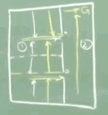

...menustart

- [RL IIT](#bfe5f76aa0ffff1c61f8e731c44d413c)
- [Lec 50 - Hierarchical RL](#b8fa68aac56b07e6b380ea91637e054f)
- [Lec 51 - Types of Optimality](#ffa411e0c712e269348ec97e67938f11)
- [Lec 52: Semi Markov Decision Process](#dea643812f3c38d43b22e936ae4e2e96)
    - [SMDP](#accd95b8e78c80b20ffe9e4eed7096ec)
    - [SMDP Definition](#abafe4a0b9b20f75c81527b5d6126cdf)
    - [SMDP Q-Learning](#ac7cd9d04bff3f5467432de98f587b6f)
- [Lec 53 :  Options](#9dd8cdd14e9fb7409d79f732d6fad4bd)
    - [macro action](#db51e8e30decc185ef0a832692206c9e)
    - [Two kinds of options](#2aa72195d24daa01c8bc25749b6454a9)
- [Lec 54 : Learning with Options](#4b519a7a64bf60c84e3429985f71bf7c)
- [Lec 55: Hierarchy of Abstract Machine (HAM)](#b290df95e9d6534f3fd0f7fadc97fe1f)
- [Lec 56: MAXQ](#67ab3535e778c2e13f79d3d60e849021)

...menuend

<h2 id="bfe5f76aa0ffff1c61f8e731c44d413c"></h2>

# RL IIT

<h2 id="b8fa68aac56b07e6b380ea91637e054f"></h2>

# Lec 50 - Hierarchical RL

Advantages:

 - temporal abstraction 
 - Transfer / Reusability
 - more powerful / Meaningful
 - state abstraction 
    - when I start breaking things down into these kinds of subproblems I can start focusing on things that are only needed for solving the subproblems.
    - solving one subproblem does not depend on other subproblems. 

<h2 id="ffa411e0c712e269348ec97e67938f11"></h2>

# Lec 51 - Types of Optimality

 - 1. hierarchically optimal
    - you have to search through policies that respect this hierarchy. 

The best way I can solve this problem of getting out of room 1 is the white policy. 

If I use the white policy in room1 and yellow policy in room2 , that is a valid solution. 

But overall among all policies that satisfy the hierarchy , that is not the optimal one in terms of overall cost.  The yellow policy in room 1 followed by the yellow policy in room2 gives the **hierarchically optimal**.  ( think about the dotted line has different distance to those 2 exits.  )

Following the white policy in room1 gives me a solution where the individual components in the hierarchy are optimal. But overall put together that is not the best possible solution. 

---

If I come up with a solution where the individual components solved optimally , and then the overal solution is suboptimally. Then I call that 

 - 2.  recursively optimal
    - given that all my sub problems are optimal , and the policies are frozen , what is the best can I do ?
    - I have to put together this optimal sub policies to find something that is best among those polices. So this is a more restricted policy.
 - hierarchically optimal is to say that I have to respect the hierarchy but I need not necessarily solve each component optimally , overall the problem should be optimally solved. 
 - recursively optimal is to say that not only should I respect the hierarchy but for each individual components in the sub hierarchy I should have an optimal solution. 

---

 - 3. Flat optimality 
    - does not respect any of the hierarchical restrictions 
    - it just looks at the most basic actions that are possible in this world , and tries to find what is optimal. 

---

 - so usually fat optimality gives you a more optimal solution than hierarchical optimality , which in turn gives you something better than recursive optimality
 - recursively optimal is great
    - it is more resuable. 
    - it might not be the best for any particular problem. but across different problems maybe this will be the better one on an average. 
    - so it is always a good idea to solve these things independently 
 - when do want to learn recursively optimal policies ?
    - I am solving the same problem multiple times , or my recursive optimal is really bad.  
    - it is possible that recursive optimal is bad. for instance, if I put a laser beam horizontally cross room2, so every time you touch the laser you get burned by the laser. Unfortunately still the white policies is recursively optimal
    
---

<h2 id="dea643812f3c38d43b22e936ae4e2e96"></h2>

# Lec 52: Semi Markov Decision Process

<h2 id="accd95b8e78c80b20ffe9e4eed7096ec"></h2>

## SMDP 

 - Actions have duration
    - MDP: st --- at--> st+1 ( with rt+1 )
    - SMDP: st --- at--> ... st+τ ( with rt+τ )    
        - --- at+τ--> ... st+τ+τ' ( with rt+τ+τ' )  
        - now I am not only interested in what the next state I'm going to land up in but also how long will it take me to get to the next state , because that is how much I will discount 
        - so optimality now would depend not only on where the action takes me but also how long it takes to get there. 
        - τ is the **holding time**. essentially the idea is that at time *t* I decide *a* is the action I'm goint to take, but I do not apply the action *a* xxx 没听清 
            - it could be a variety of reasons. I could actually be sensing the market at some point of time, and by the time I place my order at my xxxx 15 seconds later. 
            - that should be gap between the sensor input coming to you and you taking an action. 
        - you can understand as : I see st , I pick at immediately, but I wait for τ seconds before I apply it. So the decision is made before the waiting time. So the holding time is still a function of the decision. 

So it's SMDP in the sense that for the duration of the action I do not know how the system is evolving. So to determine when the next state is going to occur I really need to know how much time has elapsed since the last state was seen. Some amount of history dependence is there. So that is why it's called semi MDP. 

I know that τ seconds have elapsed before the next state happens, but how much of the τ seconds left ? 

The probability of st+τ depends only on st, but during this transition when st+τ will actually show up it depends on how much time has elapsed. So it is only for this brief periods you have the time dependence. 

Ps. here , holding τ seconds then apply action ,  and taking action immediately how long does it take for the next state , both mean the same thing. 

--- 

<h2 id="abafe4a0b9b20f75c81527b5d6126cdf"></h2>

## SMDP Definition

SMDP is defined as the tuple <S,A,P,R>

 - P: P(s',τ | s, a) 
 - R: E[ v | s,a,s',τ ]
    - reward could depend on the transition time , or the holding time.

---

<h2 id="ac7cd9d04bff3f5467432de98f587b6f"></h2>

## SMDP Q-Learning

 - Q(st,at) = Q(st,at) + α·[ r̄t+τ + γτ·maxa'Q(s't,a') - Q(st,at) ]

The tricky thing here is I have hidden some stuff into this **r̄t+τ** , What is r̄t+τ  ?  It's the expected reward that I am going to get over the τ time steps. It is not the one instancely happened.  It could be variety of things. Normally that in the classical SMDP framework wo do not tell you how this r̄t+τ comes up. So you have some mechanism by which you can generate it. 

But we are more interested in is to actually think of 

 - r̄t+τ = rt+1 + γ·rt+2 + ... + γτ-1 ·rt+τ 

So notice that SMDP Q-Learning does not actually look into the structure Q(st,at) of at  . It just assumes that this reward comes then I take action at.  So it assumes that at has been learnt already. So what is at here in our room example ?  Goto room2 !  It is not a single simple action, this is what you mean by the `temporal abstraction`.

--- 

<h2 id="9dd8cdd14e9fb7409d79f732d6fad4bd"></h2>

# Lec 53 :  Options

In some sense it is the simplest of the hierarchical frameworks.  The basic idea behind options is something very very simple. So I am going to take the solutions to these sub problems that we are defining , I will encapsulate them as a single action.  

<h2 id="db51e8e30decc185ef0a832692206c9e"></h2>

## macro action

So the idea comes from the planning literature actually where people talk about something called **macro actions**. So in the planning community macro actions are essentially sequence of actions put together and then we talk about as a single action. In the RL space macro action is not a sequence of actions but **encapsulated policies**. 

How to specify a useful macro action (option) ?

 1. Initiation , Iₒ ⊆ S' 
    - a subset of the state space
    - I need something that tells me where the **iniitation** can happen 
 2. Policy , πₒ
    - I need a *policy* to use while the macro action is executing 
 3. Termination , βₒ: S'→ [0,1]
    - and then I need a termination. 
    - typically specified by β: S'→ [0,1]
        - β of s will be the probability that option will stop in state s.  
        - so fo many states the probability could be 1. That means on all those states the option will not continue. 
    - the probabilistic definition of options was actually introduced to for more of a mathematical convenience. In practice when you define this options you typically make the probability of termination 0 or 1. So 0 means it does not terminate, 1 means it terminates. 

So Option o=< Iₒ,πₒ,βₒ >

<h2 id="2aa72195d24daa01c8bc25749b6454a9"></h2>

## Two kinds of options 

 - Markov option
    - πₒ depends only on current state
    - the nice thing about Markov options is I do not have to worry about where I started the option . So if I am in a particular state and I am executing that option then I will take the same action. 
 
 - Semi Markov option
    - πₒ depends on histroy since the option started

<h2 id="4b519a7a64bf60c84e3429985f71bf7c"></h2>

# Lec 54 : Learning with Options

 - SMDP Q-Learning 
    - MDP + options gives me SMDP.
 - Inter-option Q-Learning 
    - Q(s,o) 
    - let assume that when I start πₒ , so I do actions a₁,a₂,...an under states s₁,s₂,...sn under states . These are the actions I see. 
    - so what can I do ?
    - I can actually update Q(s₁,a₁) 
        - Q(s₁,a₁) =  Q(s₁,a₁) + α·[ r₁ + γ·maxQ(s',a') - Q(s₁,a₁)  ]
        - Q(s₂,a₂) = ... 
    - what about Q(s₂,o) ?
        - Q(s₁,o) = Q(s₁,o) + α·[ r₁ +  γ·Q( s₂,o ) - Q(s₁,o) ] , if not ending at s₂
        - Q(s₁,o) = Q(s₁,o) + α·[ r₁ +  γ·maxQ( s₂,a ) - Q(s₁,o) ] , if terminated at s₂

<h2 id="b290df95e9d6534f3fd0f7fadc97fe1f"></h2>

# Lec 55: Hierarchy of Abstract Machine (HAM)

<h2 id="67ab3535e778c2e13f79d3d60e849021"></h2>

# Lec 56: MAXQ

