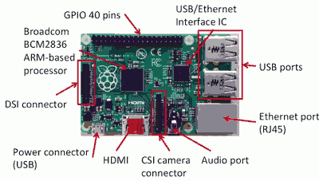
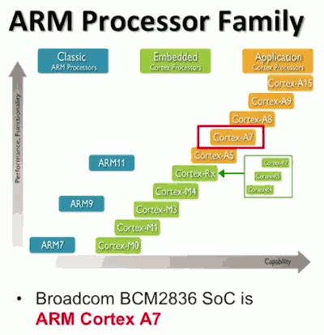
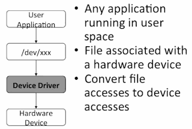
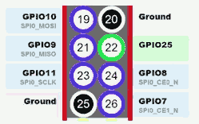

...menustart

- [Raspberry Pi I](#73770efffd056ea55f34a6d0de671dda)
    - [Hardware Specs](#340e59e0dd03810e21611e4e545262b4)
    - [ARM Processors](#7c9fb4b83e7d3ff04537e59f0efd1b4d)
    - [Using Hardware Devices](#bde280fad6339e66144556725e9a6925)
    - [Setup of the Raspberry Pi](#5ffa42db2af721145d87c6f5177f2d11)
        - [Installing an OS](#e148dc9454d176896815b2943a6d3dea)
    - [Raspberry Pi Configuration](#37fa544b8c35fe7e622f6fe9d375ab74)
        - [Raspi-Config](#bf0ab4cbce41882dd4d047cd031b36ee)
    - [Overclocking](#96f8e05d2ec50fb2802a469cfae45b56)
        - [Impact of Overclocking](#ff95fa296ce2fde051c9ff77ec518fb9)
        - [Impact of Increasing Voltage](#60e76035d1d55222cee3e465d15a17e2)
    - [Linux Basics](#560f0ad6e27df1074f9399d3fc8c5967)
        - [File Permissions](#96fd0f31db825baa802614c9f0f49add)
        - [Process](#b6ec7abeb6ae29cc35a4b47475e12afe)
        - [GUI](#1e3042b2e2a5550b412b37edd1c36b34)
    - [Python](#a7f5f35426b927411fc9231b56382173)
    - [General Purpose IO Pins 通用IO引脚](#5130ecea52dfa86cf8c70e7515c1aa48)
    - [Protocal Pins](#0b62603acfc59cc53ed92f689037d1e6)
    - [SPI Communication Pins](#392687a2d5cc2a49bd0d84d8a773d985)
    - [GPIO Access](#1a7f823397c500781d755ddd598a1422)
    - [General Purpose IO Pins 2](#f1de82e95e1ab7eafe3700df87c6b177)
        - [Pin Direction and assignment](#119276386b6010fa9ea006ad235e7732)
            - [Example : Blink an LED](#9d938a8190f35d6b752adf0bc4de5c61)
        - [Reading Input Pins](#28e52f680c5ecc8d5a8306cb86f740ca)
    - [Pulse Width Modulation](#b4d3379cc73eeb7f1e1248ed92af6a9d)
        - [PVM Initilization and PVM control](#3899d0ca616dbcbb93a6c151e8e134e7)
        - [Frequency Control](#c727b8a2292403497d3a210c7dfe6bd2)
    - [GUI](#1e3042b2e2a5550b412b37edd1c36b34)

...menuend


<h2 id="73770efffd056ea55f34a6d0de671dda"></h2>


# Raspberry Pi I

<h2 id="340e59e0dd03810e21611e4e545262b4"></h2>


## Hardware Specs

Model B+ :

- Broadcom BCM2836 Soc  , 900MHz, 1Gb Ram , arm based
- Dual Core VideoCore IV , Multimedia Co-Precessor, GPU
- 40 GPIO pins (General-purpose Input/Output)
- 4 USB ports
- Micro SD card slot
- 3.3V I/O voltage levels



<h2 id="7c9fb4b83e7d3ff04537e59f0efd1b4d"></h2>


## ARM Processors



<h2 id="bde280fad6339e66144556725e9a6925"></h2>


## Using Hardware Devices



In Linux folder /def/xxx , you got a file in there for every device that's connected to you machine. So that file is associated with the hardware that you plugged in, eg a webcamera. Say you wanna read data from the webcamera, you read the file.  

Underneath those files, or behind those, inside the operating system , there's a *device drive*. And what the device driver does is it translates these file accesses into actual hardware device accesses.

<h2 id="5ffa42db2af721145d87c6f5177f2d11"></h2>


## Setup of the Raspberry Pi


 1. Plug in a monitor (via HDMI or DSI) and a keyboard and mouse (via USB)
 2. Get and operating system
  So you're gonna get a micro SD card and put the OS onto that micro card, that's your goal.

<h2 id="e148dc9454d176896815b2943a6d3dea"></h2>


### Installing an OS

The easiest way is to use New Out-Of-Box software (NOOBS).

- Comes preinstalled on microSD bundled with Raspberry Pi boards
- Otherwise , download it from https://www.raspberrypi.org/downloads/
- If NOOBS is not preinstalled on micro SD, you'll need to 
  1. Format the micro SD (need an SD reader)
  2. Extract the NOOBS downlaod
  3. Put it on the micro SD


One you have NOOBS on micro SD card , plug that into you Raspberry Pi , then you power up the Raspberry Pi .  NOOBS will install an operating system on your micro SD card.

[NOOBS install](https://www.raspberrypi.org/learning/noobs-install/)

[Setting up Raspbian](https://learn.sparkfun.com/tutorials/setting-up-raspbian-and-doom)

<h2 id="37fa544b8c35fe7e622f6fe9d375ab74"></h2>


## Raspberry Pi Configuration

<h2 id="bf0ab4cbce41882dd4d047cd031b36ee"></h2>


### Raspi-Config

- **raspi-config** is a tool which lets you setup various setup/boot options for the Raspberry Pi.
- raspi-config will run automatically when you boot the Raspberry Pi with a new micro SD card for first time. You also can run it later to change configuration.

What's the config option:

- Expand Filesystem - Reformats your micro SD card filesystem to use the rest of their memory.
- Change User Password - starts with one user acc/pwd:  `pi/raspberry`
- Enable Boot to Desktop/Scratch  
  1.console is the default boot option  2.Desktop is the graphic interface 3. scratch is a programming environment for kids. 
 
- Internationalisation(国际化) and Rastrack  - change Locale , Timezone , keyboard Layout. *Rastrack* is the service that allows Raspberry Pi users to find one another , totally optional , approximate location base on IP.

<h2 id="96f8e05d2ec50fb2802a469cfae45b56"></h2>


## Overclocking

- refers to **increasing the clock frequency**
- refers to **increasing the internal voltage levels**
- there are serveral different clocks inside a typical device

<h2 id="ff95fa296ce2fde051c9ff77ec518fb9"></h2>


### Impact of Overclocking

- instructions are executed more quickly, roughly one instruction per clock period
- signals have shorter time in which to travel
  Signals must travel between storage elements (eg. register ) in a single clock period. So the risk of over-clocking is , the signal data may not reach destination in time if the clock period was decreased too much.

<h2 id="60e76035d1d55222cee3e465d15a17e2"></h2>


### Impact of Increasing Voltage

- Increased voltage swing may increase transistor(晶体管) speed - you have to increase the voltage in order to make signal reach the destination in time if over clocked.
- power consumpton in proportional to V²
- Thermals effects may alter timing - The heating can change the timing on certain paths in the circuit.

---


<h2 id="560f0ad6e27df1074f9399d3fc8c5967"></h2>


## Linux Basics

bash (bourne again shell) is the default shell for Raspian.

LXTerminal is the terminal used in Raspian.

Default Account is  pi/raspberry .

Text editors available on Linux for free: Emacs, vi, vim, nano, etc.

View a file:

- cat : print the file
- head : print the first 10 lines
- tail : print the last 10 lines (not on MacOS)

<h2 id="96fd0f31db825baa802614c9f0f49add"></h2>


### File Permissions

- Files have **owners**
    - an owner is the user who created the file 
- File have **access permissions**
    - Read(r) , Write(w) , Execute(x) 
- Different permissions can be assigned according to type
    1. User: user permissions are the permissions for the file owner
    2. Group: a permission group
    3. Other: all users
- `ls -l`  : to view file permissions  
    - eg. drwxr-xr-x :  dir(1)user(3)group(3)other(3) 
    
<h2 id="b6ec7abeb6ae29cc35a4b47475e12afe"></h2>


### Process

view process :  `ps [a]` , if not provide 'a' , it will show only shell itself , "ps a" will list all processes.  Each process has a unique PID.

Shutdown :

- Should not just unplug a Linux machine.
- Proper shutdown procedure is needed to place data structures in a good state
    - Flush all buffers, close files, etc.

<h2 id="1e3042b2e2a5550b412b37edd1c36b34"></h2>


### GUI

After initial login, type "startx". Linux can have it look however you want based on the window manager that you choose , because Linux is separate from the graphics. The manager determines the look.


<h2 id="a7f5f35426b927411fc9231b56382173"></h2>


## Python

Python is the best supported language for Raspberry Pi.

- Good programming environment built-in
- Gool APIs available to access Raspberry Pi hardware
- This course will use python 3


<h2 id="5130ecea52dfa86cf8c70e7515c1aa48"></h2>


## General Purpose IO Pins 通用IO引脚

- Dedicated power and ground pins
    - which you can use to interface with other devices 
- 3.3v (1,17) , 5V ( 2,4 ) , Gnd( 6,9,14,20,30,39)

---

- General Purpose / Multi-Function pins
    - you can write code that sits in the high or low, and you can write code that reads the values that are driven on to them from external sources. 
- GPIO2 (3 , SDA1 I2C) , GPIO3(5 , SCL1 I2C) , GPIO4(7)
- Pins labeled "GPIOxx" can be used as general purpose I/O
- Some GPIO pins have 2 names， eg. GPIO2(SDA1 I2C), so we'll call those multi-function pins.
    - SDA / SCL is the communication pins for the I2C protocal
- UART Pins
    - GPIO14(8, UART0_TXD) , GPIO15(10, UART0_RXD)
    - UART is **serial** protocal , single bit, one bit at a time is being transferred. *TX stands for transmit, and RX stands for receive*. If you wanna send serial bit, serial data, UART data from Raspberry Pi to another device, you send it ont the TX , and on the receiving end, you receive it on the RX.
    - TX and RX can be used to communicated to another Raspberry.


---

<h2 id="0b62603acfc59cc53ed92f689037d1e6"></h2>


## Protocal Pins

I2C Pins

- GPIO2 (3 , SDA1 I2C) 
- GPIO3 (5 , SCL1 I2C)

I2C is a serial communication protocal between two chips or two devices that are relatively close, that can share a clock.  So this is a clocked , a synchronous protocal , so the two devices have to be close enough that they can share the same clock. Typically , on the same board or something like that. They've gotta be physically close.

So , I2C protocal , it's got two wires, SDA and SCL.  SDA sends the data as with data gets sent and received, and SCL is where the clock that gets sent. Now this is as oppose to the UART, UART is not clocked. I2C does have a clock pin, which makes it a lot faster protocal , but it is restricted in distance because you have to be close enough that you can send a clock with MSQ.

The idea is that if you had several different , say Raspberry Pis, or other devices that had I2C, you connect all their SDA lines together, and connect all their SCL lines together, and the can communicate usng I2C protocal. Of course you have to write the appropriate code.


<h2 id="392687a2d5cc2a49bd0d84d8a773d985"></h2>


## SPI Communication Pins

SPI: Serial parallel interface



This protocal basically involves four wires, at least four.


- Pin 19 ,SPI0_MOSI , is master out , slave in
- Pin 21 ,SPI0_MISO , is master in , slave out
    - Pin 19,21, each on of those wires is directional. 
- Pin 23 ,SPI0_SCLK 
    - that's the clock that all the devices would share 
- Pin 24 , SPI0_CE0_N ; Pin 26 , SPI0_CE1_N , 
    - there's also a chip enable. Chip enable is because with SPI, there can be a master, the single master , talking to many slavers. But it can only talk to one slave at a time. So it needs to assert the chip enable for the particular slave that it's taling to, to let that slave know it is communicating , that slave should wake up and listen. So each slave has to have a chip enable associated with it that the master can assert , can pull down, in order to wake them up and have them listen.
    - SPI0_CE0_N , last N means negative, so it's negatively assertive, meaning you have to pull that wire down so the Raspberry Pi will send that from one to zero to let the client knonw. Only 2 chip enable wire on board, you might need more , depending on how many SPI components are on your bus, how many slave you have on your bus. cuz you need a chip enabled for every single slave.
    
<h2 id="1a7f823397c500781d755ddd598a1422"></h2>


## GPIO Access
 
GPIO Access in Python:

- Use the GPIO library
- import Rpi.GPIO as GPIO
- Execute your python program as root
- Tow ways to refer to the pins
    1. The number of the pins in their order on the board ( the number in circles)
    2. The Broadcom SoC number ( shown in rectangles, after "GPIO" )
- Selecting Pin Numbering Mode
     1. GPIO.setmode(GPIO.BOARD) , use board numbering
     2. GPIO.setmode(GPIO.BCM) , use Broadcom SoC numbering, changes with different versions of Raspberry Pi


<h2 id="f1de82e95e1ab7eafe3700df87c6b177"></h2>


## General Purpose IO Pins 2

<h2 id="119276386b6010fa9ea006ad235e7732"></h2>


### Pin Direction and assignment

Before you write code to access pins, you need set the pin direction.

```
# Set the pin direction ( GPIO.IN / GPIO.OUT  )
GPIO.setup( 13, GPIO.OUT )
```

```
# Assign value to output pin, True is a high voltage, 3.3v
GPIO.output( 13, True )
```

<h2 id="9d938a8190f35d6b752adf0bc4de5c61"></h2>


#### Example : Blink an LED

We connected LED's anode to  pin 13 , and the other cathode goes to ground. 

```
import Rpi.GPIO as GPIO
import time
GPIO.setmode(GPIO.BOARD)
GPIO.setup(13, GPIO.OUT)
while True:
    GPIO.output(13, True)
    time.sleep(1)
    GPIO.output(13, False)
    time.sleep(1)
```

<h2 id="28e52f680c5ecc8d5a8306cb86f740ca"></h2>


### Reading Input Pins

```
#Set the pin direction to an input
GPIO.setup(13, GPIO.IN )

# Read value on input in
value = GPIO.input(13)
```

- only reads digital inputs
    - No analogRead equivalent
    - No analog-to-digital converter


<h2 id="b4d3379cc73eeb7f1e1248ed92af6a9d"></h2>


## Pulse Width Modulation
    
how to generate a pulse width modulated signal （脉冲宽度调制信号） on a GPIO pin.
 
The pulse width modulated signal is just square wave.


You can see in the pic we get 3 square waves. They have the same frequency , and the difference between them is what's called pulse width , what percentage of the time their signal is high.

The whole idea of this , is to control an analog device from a digital circuit.

PVM functions in GPIO library:

<h2 id="3899d0ca616dbcbb93a6c151e8e134e7"></h2>


### PVM Initilization and PVM control

```python
# mark pin for PVM
# second argument is frequency
pvm_obj = GPIO.PVM(18,400)
# after PVM invode, now pin 18 is prepared to generate the pulse width nodulated signal, not it don't actually start generating yet.

# start generating PVM signal
# Arguments is duty cycle , 0 to 100 (0%-100%)
pvm_obj.start(100)

# assign new duty cycle
pvm_obj.ChangeDutyCycle(50)
```

You should note that the frequency is not accurate on Pi. And it could be off by a lot up to 50% when you get to higher frequencies. What that means is that , if you really need tight pulse width modulated control , you're gonna have to do something else.  There are other ways to go about it. You can't use a standard library function if you want accuracy on a Pi.  Part of the reason why you get this inaccurate behavior is because you're using an operating system.


<h2 id="c727b8a2292403497d3a210c7dfe6bd2"></h2>


### Frequency Control

You can't change that frequency once you've created it, not easily.  But it is nice to be able to change frequencies because maybe you wanna make tones. Maybe you wanna make beautiful music and you wanna make different sounds.

You need to do it manually:


```python
while True:
    GPIO.output(18,True)
    time.sleep(0.5)
    GPIO.output(18,False)
    time.sleep(0.5)
```

This will give you a square wave, with a 1 Hz frequency. By changing those time value you can change the frequency manually.

<h2 id="1e3042b2e2a5550b412b37edd1c36b34"></h2>


## GUI

Event loop

Tkinter
