...menustart

- [1.4 Vanishing Points](#416e617e8164f09d5f2cb88d97aaa29d)
    - [Vanishing lines](#aab45f4c2a6599bed4bf590cc4504d2b)
- [1.5 Projective projection](#e3bcbb1142a1f84990f0757c530827ac)
    - [The projective plane](#3fd090afb1fba45f2981b3bf6c6bc4e1)
    - [Point](#2a3cd5946cfd317eb99c3d32e35e2d4c)
    - [齐次坐标](#c24cc7a6f92f81c3fb65ed02c79e7952)
    - [Projective lines](#6e434d9a61c1a39c10721d8f2a37050c)
    - [Line Representation](#b42a0384896207b92556bfbc2e2b774c)
    - [Example of Line](#b2c2388e6dd9d4b529bf55ddd2561a5f)
- [1.6 Projective projection2](#d640fdd2a21b3264b78056e46cdc00d9)
    - [Projective lines from two points](#8f1680bff46ddc0057c0316e0d4aac52)
    - [Line passing through two points](#347bec6c0a5fdfe9e8359f08a72678bb)
    - [Example of Line](#b2c2388e6dd9d4b529bf55ddd2561a5f)
    - [Quiz](#ab458f4b361834dd802e4f40d31b5ebc)
    - [Points from two lines](#9880beb72dfffaf502ca96adb21fa1e3)
- [1.7 Point and line duality](#f40a24c3d9296c58fbdc7c14fca3c20b)
    - [Points from two lines](#9880beb72dfffaf502ca96adb21fa1e3)
    - [Point at infinity, Ideal points](#9300f2d4660e6103bfcfc34c9c11d163)
    - [Points at infinity](#8ab86ba3e1c0e429c210a28fa2550900)
    - [Line at infinity](#b3d6d793f09b2d9db36b3ab1d43d4f3c)
    - [Ideal points and lines](#167afd45203324fc5b1fb35aee95f2c0)

...menuend


<h2 id="416e617e8164f09d5f2cb88d97aaa29d"></h2>


# 1.4 Vanishing Points

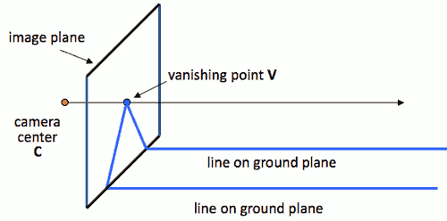

- Properties
    - Any two parallel lines have the same vanishing point
    - The ray from C through v point is parallel to the lines
    - An image may have more than one vanishing point


<h2 id="aab45f4c2a6599bed4bf590cc4504d2b"></h2>


## Vanishing lines

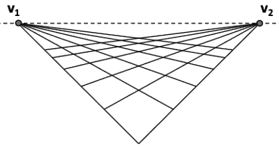

- Multiple Vanishing Points
    - Any set of parallel lines on the plane define a vanishing point
    - The union of all of these vanishing points is the horizon line
        - also called vanishing line
    - Note that different planes define different vanishing lines
 

- Applicaiton
    - Comparing heights
    - Measuring height

---

<h2 id="e3bcbb1142a1f84990f0757c530827ac"></h2>


# 1.5 Projective projection

<h2 id="3fd090afb1fba45f2981b3bf6c6bc4e1"></h2>


## The projective plane

- What is the geometric intuition?
    - a point in the image is a *ray* in projective space
    - 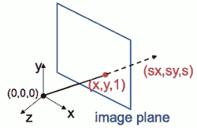
    - Each point (x,y) on the plane is represented by a ray (sx,sy,s)
    - all points on the ray are equivalent:  (x, y, 1) ≅ (sx, sy, s)
        - 一个点的齐次坐标乘上一个非零标量，则所得之坐标会表示同一个点。

<h2 id="2a3cd5946cfd317eb99c3d32e35e2d4c"></h2>


## Point

- Homogeneous coordinates 齐次坐标
    - represent coordinates in 2 dimensions with a 3-vector

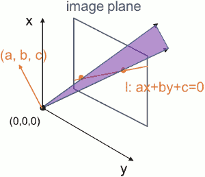

image plane上的line  ，是投影空间中，rays 组成的一个平面

---

<h2 id="c24cc7a6f92f81c3fb65ed02c79e7952"></h2>


## 齐次坐标 


- 1.1.齐次坐标的引入
    - 在欧式空间里，两条共面的平行线无法相交，然而在投影空间(Projective Space)内却不是这样
    - 欧式空间采用(x,y,z)来表示一个三维点，但是无穷远点(∞,∞,∞)在欧式空间里是没有意义的, 但是在投影空间中进行图形和几何运算并不是一个简单的问题
    - 齐次坐标系，采用N+1个量来表示N维坐标。 例如，在二维齐次坐标系中，我们引入一个量w,将一个二维点(x,y)表示为(X,Y,w)的形式，其转换关系是
        - x = X/w , y = Y/w
    - 例如，在欧式坐标中的一个二维点(1,2)可以在齐次坐标中表示为(1,2,1)
        - 如果点逐渐移动向无穷远处， 其欧式坐标变为(∞,∞)，而齐次坐标变为(1,2,0)
        - 齐次坐标下不需要∞就可以表示无限远处的点。
- 1.2.”齐次”之名由何而来？
    - 一个二维点(1,2)转换为齐次坐标，根据规则，我们可以选择刚才用到的(1,2,1)，也可以 选择(2,4,2)，还可以选择(4,8,4),(8,16,8)...，即(k,2k,k),k∈ℝ 都是“合法”的齐次坐标表示
    - 这些 点都映射到欧式空间中的一点，即这些点具有尺度不变性(Scale Invariant)，是“齐性的”(同族的)，所以称之为齐次坐标。
- 1.3.平行线相交:不太严格的证明
    - 考虑两条平行线：
        - Ax + By + C = 0
        - Ax + By + D = 0
    - 在欧式空间中，C=D时两条线重合，否则不相交(平行?)。尝试用 x/w, y/w 替换 x,y, (如前面提到的，用N+1个量表示N维坐标，这里增加了一个量w) ,可以得到
        - Ax + By + Cw = 0
        - Ax + By + Dw = 0
    - 可以得到解(x,y,0)，即两条平行线在(x,y,0)处相遇，称之为无穷点
- 1.4.重要性
    - 齐次坐标表示是计算机图形学的重要手段之一，它既能够用来明确区分向量和点，同时也更易用于进行仿射（线性）几何变换
    
- 2.1 平面点
    - 欧式坐标表示：  X = (x,y) ∈ ℝ²
    - 齐次坐标表示：  x̃ = (x̂,ŷ,w) ∈ ℙ²
    - w=0 时称为无穷点(points at infinity)， 其中 ℙ² = ℝ³-(0,0,0)  为2D投影空间. 齐次矢量  x̃  可转换为欧式表示：
        -  x̃ = (x̂,ŷ,w) = w(x,y,1) = wX̄ , X̄ 称为增广矢量(augmented vector)。
- 2.2 平面线 
    - 齐次表示： l̃ =(a,b,c)
    - 对应欧式空间直线方程： X̄·l̃ = ax+by+c = 0 
    - 例外是在 l̃ = (0,0,1) 时为无穷线，包含了所有的2维无穷点。
    - 见 后面的 Line Representation
    - 采用齐次坐标系时，可求得两条直线的交点的齐次表达：
        - x̃ = l̃₁ x l̃₂
    - 同时，两个点确定的直线方程的齐次表达为：
        - l = x̃₁ x x̃₂
- 2.3.为什么更易用于仿射变换？
    - 对于一个2维点p=(x,y)仿射变换(T)是线性变换(Ap)和平移变换(+t)的叠加:
        - T(p) = Ap + t
    - 线性变换在欧式空间中可以表示为矩阵乘积形式，如旋转变换和缩放变换,而平移变换却不能用矩阵相乘的形式表达。
        - 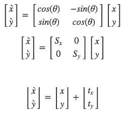
    - 现在引入齐次坐标系表达 p̃ =(x,y,1) (尺度不变性，实际上在高一维的空间映射到w=1w=1平面, 这样计算后结果直接可导出到欧式空间)。可以将rotate,scale,transfer变换表示为：
        - 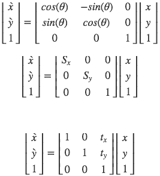
    - 然后我们可以导出仿射变换的矩阵形式，
        - 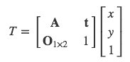
    - 其中O₁ₓ₂=[0,0], 仿射变换保留了点的共线/面性质及比例, 这在图形处理中非常重要，比如对于 平面上的一个几何形状进行变换，只需要对其顶点进行变换就可实现.而齐次坐标系的 引入使仿射变换能以紧凑统一的矩阵形式表达和计算，这体现了其对仿射变换的重要性。
- 2.4.为什么能够明确区分向量和点？
    - [a,b,1] 点
    - [a,b,0] 向量


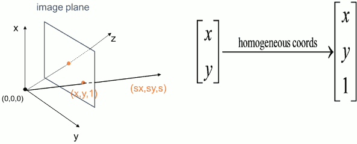

<h2 id="6e434d9a61c1a39c10721d8f2a37050c"></h2>


## Projective lines

- What does a line in the image correspond to in projective space?
    - 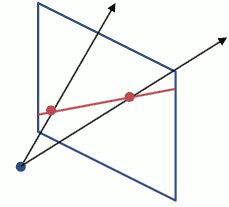
    - A line is a plane of rays through origin
        - all rays (x,y,z) satisfying: ax + by + cz = 0
        - (a,b,c)·(x,y,z) = l·p = 0
    - A line is also represented as a homogeneous 3-vector l
        - l is just the surface normal ob the set of planes


<h2 id="b42a0384896207b92556bfbc2e2b774c"></h2>


## Line Representation

- 极坐标系下的直线方程
    - 在直角坐标系中有一条直线l，原点到该直线的垂直距离为ρ，垂线与x轴的夹角为θ，这这一条直线式唯一的，且其直线方程为：
    - `ρ = xcosθ + ysinθ`    
    - 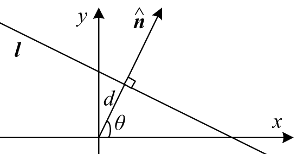
- a line is `ρ = xcosθ + ysinθ`
    - ρ is the distance from the origin to the line
    - θ is the norm direction of the line
- It can also be written as
    - cosθ = a/√(a²+b²)
    - sinθ = b/√(a²+b²)
    - ρ = -c/√(a²+b²)
    - => -c/√(a²+b²) = a/√(a²+b²)·x + b/√(a²+b²)·y => -c = ax + by  => ax + by + c = 0  

<h2 id="b2c2388e6dd9d4b529bf55ddd2561a5f"></h2>


## Example of Line

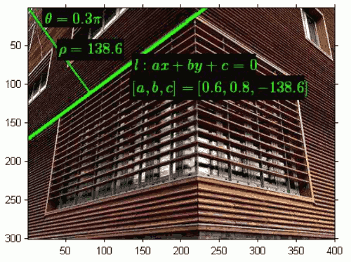

---

<h2 id="d640fdd2a21b3264b78056e46cdc00d9"></h2>


# 1.6 Projective projection2

<h2 id="8f1680bff46ddc0057c0316e0d4aac52"></h2>


##  Projective lines from two points 

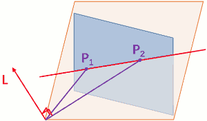

<h2 id="347bec6c0a5fdfe9e8359f08a72678bb"></h2>


## Line passing through two points

l = *x* x *x'*

<h2 id="b2c2388e6dd9d4b529bf55ddd2561a5f"></h2>


## Example of Line

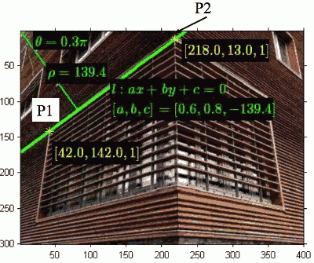

- Verify p2 lies on the line

```
(px,py,w)·(a,b,c) = 218 * 0.6+13 * 0.8 + 1 * -139.4 = 1.80 

非常接近0，不等于0是因为作图误差
```

- Test line: 

```
p1 = [42,142,1];
p2 = [218,13,1];
l = cross(p1,p2) = [129 176 -30410]
norm( [129 176] ) = 218.21
l/218.21 = [0.59116     0.80655  -139.35912] ≈ [a b c ]
```

<h2 id="ab458f4b361834dd802e4f40d31b5ebc"></h2>


## Quiz

- When does the line has the form (a, b, 0)? 
    
- When does the line has the form (0, 0, 1)?

<h2 id="9880beb72dfffaf502ca96adb21fa1e3"></h2>


## Points from two lines

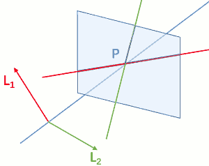

x = l x l'

---

<h2 id="f40a24c3d9296c58fbdc7c14fca3c20b"></h2>


# 1.7 Point and line duality

点和线的对偶性： 齐次坐标下，点表现为一个三维坐标，平面（线）也是，因为可以相同的看待 点和面

- Points and lines are dual in projective space
- given any formula, can switch the meanings of points and lines to get another formula

<h2 id="9880beb72dfffaf502ca96adb21fa1e3"></h2>


## Points from two lines

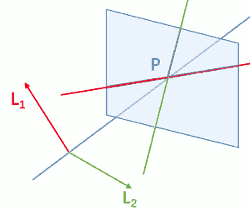

- When P has the form (x,y,0)?
- Point at infinity
    - Consider two parallel lines:  x=1, x=2  ( Image plane 上的两条平行竖线 )
    - 齐次坐标下的 可表示为:  (-1, 0  ,1),  ( -1, 0, -2 )
    - Intersection = [0 1 0]
    - Point at infinity in the direction of y
- w==0, 说明它是一个  vanishing point, 在竖直方向上无限远的一个点
    - 图像中的 vanishing point 就是由平行线相交得到的
    - 图像中的平行线在实际中并不相交，但我们依然可以做 cross product


```
octave:2> cross( [-1 0 1] , [-1 0 2] )
ans =   0   1   0
``` 

<h2 id="9300f2d4660e6103bfcfc34c9c11d163"></h2>


## Point at infinity, Ideal points

- l = (a,b,c)  , l' = (a,b,c')
- l x l' = (c'-c)(b,-a,0)ᵀ
- Any point (x₁,x₂,0) is intersection of lines at infinity

<h2 id="8ab86ba3e1c0e429c210a28fa2550900"></h2>


## Points at infinity

- Under projective transformation, 
    - All parallel lines intersects at the point at infinity 
    - line l = (a,b,c)ᵀ , intersects at (b,-a, 0)ᵀ

---

<h2 id="b3d6d793f09b2d9db36b3ab1d43d4f3c"></h2>


## Line at infinity

- A line passing all points at infinity:
    - l<sub>∞</sub> = (0,0,1)ᵀ
- because:

```
        ⎡x₁⎤
[0,0,1]·⎢x₂⎥ = 0 . 
        ⎣0 ⎦
```


<h2 id="167afd45203324fc5b1fb35aee95f2c0"></h2>


## Ideal points and lines

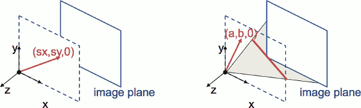

- Ideal point (“point at infinity”)
    - p ≅ (x, y, 0) – parallel to image plane
    - It has infinite image coordinates
- Ideal line
    - l ≅ (a, b, 0) – parallel to image plane
    - Corresponds to a line in the image (finite coordinates)


