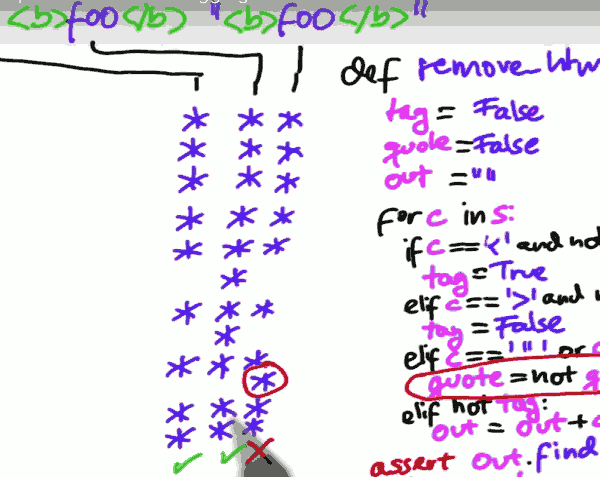
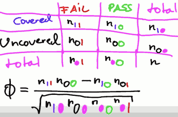

[](...menustart)

- [Software Debugging](#ece0fc770d07d5a68dc21131156896bc)
    - [1. How Debuggers work](#0d9a5476fe1d3bd3a9ba37901451a743)
        - [Explicit Debugging](#8c5145da8493b61a8c61b75d880a7105)
        - [Problem set 1](#afcb23d0346a83889d30f8d1b5ad0b01)
        - [repr](#65af82fefd89e8a9d90aad57ff445944)
    - [2. Assertion](#0d5972255c21d041e4fbcefeaedbe775)
        - [assertion 在测试中的作用:](#4dffe53b317ae122963c89d67bd2a3f9)
        - [Built-in assert](#1c05b0bcdb71600a6520ab32f3033d76)
        - [assertion 在代码中的作用:](#6fe12c93f80b1a26f8fe0ce2c9aed837)
        - [assertion can be turned off](#41b80f1b88d5c5a8ff8e5fe096a75edf)
        - [assertion should NOT check public preconditions](#c17628d4aae4339b8959de6bf94ec6f2)
        - [Should assertion remain enable in product code?](#d0f420861299f8c96c3e806d43bce575)
        - [System Invariants](#5b7ede48bf46b290a97e0fbb33f3363a)
        - [Buffer Overflow](#0771d549eea70747a838a4047855c126)
        - [Inferring Invariants 推断不变](#956cee8a3cbd0ad331c3e29d02109fec)
        - [Problem set 2](#4b8d64969eb231121e734ff31dd8e11b)
    - [3. Simplifying Failures](#cebf102aaaa7ceb2805319ea88007853)
        - [Automated Simplification](#f41e7d48f1a99681d46657713d41765b)
        - [Delta Debugging](#c093d57f7de50dfd6a62bf459fa158db)
    - [4. Tracking Origins](#33a22e54d5c7173518807520b929c0d3)
        - [Automate Deduction](#6c91de1a62c43befed262a973722d52f)
    - [5. Reproducing Failures](#46d4674f8627cc04bf5cd2dc8dbed528)
        - [Other Facets](#324a63ec43919e2c6adfb817e993f619)
        - [Capturing Coverage](#98a9bb34a8514029e83cc346e5c6051c)
        - [Phi Coefficient](#bb626955a0168353efae524d8e583a26)
    - [6. Learning from Mistakes](#4de6781c25940cc87dd6d03c04d8f1fb)
    - [7. Overview](#d42ee5e31a0299c71f908a22b4c7a2c5)

[](...menuend)


<h2 id="ece0fc770d07d5a68dc21131156896bc"></h2>

# Software Debugging

<h2 id="0d9a5476fe1d3bd3a9ba37901451a743"></h2>

## 1. How Debuggers work

assert

**assert 可以被 try-catc 捕捉**

<h2 id="8c5145da8493b61a8c61b75d880a7105"></h2>

### Explicit Debugging

笔记调试法，把你做的记下来，

<h2 id="afcb23d0346a83889d30f8d1b5ad0b01"></h2>

### Problem set 1

```python
sys.settrace(traceit) 

def traceit(frame, event, trace_arg):
    ...
```

traceit函数框架参数:

 1. frame
    - python有frameobject，保存有代码信息。常用成员变量:
        - frame.f_lineno 行号, 从1开始
        - frame.f_code.co_name 执行到的函数名. 
        - f_code是code object
        - frame.f_locals 局部变量 dict
 2. event 事件
    - 调试中主要使用line
 3. arg 其他参数


traceit 会在程序每一行之行后，被调用。traceit 函数返回自身，才能继续下一行的执行。


<h2 id="65af82fefd89e8a9d90aad57ff445944"></h2>

### repr 

```
repr(obj) 
obj.__repr__()
```

<h2 id="0d5972255c21d041e4fbcefeaedbe775"></h2>

## 2. Assertion

assertion 是自动化测试的关键。

```python
assert condition
```

<h2 id="4dffe53b317ae122963c89d67bd2a3f9"></h2>

### assertion 在测试中的作用:

```python
def test_square_root():
    assert square_root(4)==2
    assert square_root(9)==3
    # and so on
```

对于没有assert 方法的语言，你完全可以自己定义一个assert 方法。

<h2 id="1c05b0bcdb71600a6520ab32f3033d76"></h2>

### Built-in assert

- indentification 告诉你是哪个断言失败
- location 代码位置
- optional 打开/关闭
- standardize 
 

<h2 id="6fe12c93f80b1a26f8fe0ce2c9aed837"></h2>

### assertion 在代码中的作用:

```python
def square_root( x ):
    assert x > =  # precondition
    ...
    assert y*y==x  # postcondition
    return y
```

precondition 的设置,可以迅速的判断出出错的上游。


<h2 id="41b80f1b88d5c5a8ff8e5fe096a75edf"></h2>

### assertion can be turned off

- python -O turn assertion **off**
- c/c++ -DNDEBUG turn assertion **off**
- jave -ea turn assertion **on**

**因为assertion是可以关闭的**, 所以一定要确保 完全去掉assertion语句不会影响到逻辑。

- 错误写法: 
    - assert map.remove(location)==True
- 正确写法：
    - localRemoved = map.remove(location)
    - assert localRemoved

<h2 id="c17628d4aae4339b8959de6bf94ec6f2"></h2>

### assertion should NOT check public preconditions

deposit = int(input)

~~assert deposit>=0~~

if deposit <0:
    raise IllegalDataException


一些会引发严重的后果的情形，比如宇宙飞船的控制程序，红绿灯控制系统，不应该使用assertion ，而应该 raise Exception, 因为 assertion 有可能会被关闭。


<h2 id="d0f420861299f8c96c3e806d43bce575"></h2>

### Should assertion remain enable in product code? 

支持观点:

- failing is better than bad data
- Eases debugging
- defect in the field are hard to debug
 
反对观点:

- Performance
- Not User Friendly


<h2 id="5b7ede48bf46b290a97e0fbb33f3363a"></h2>

### System Invariants

对于全局变量, 可以在 traceit 方法中监听变量值。

eg. 很多模块都会修改全局变量 flag

```python
def traceit( ... ):
    global flag
    assert not flag
    return traceit
```

<h2 id="0771d549eea70747a838a4047855c126"></h2>

### Buffer Overflow

c/c++ 程序中，如何防止 访问未分配内存的区域?

- electric fense , x86
- Valgrind , x86


<h2 id="956cee8a3cbd0ad331c3e29d02109fec"></h2>

### Inferring Invariants 推断不变
  
加断言可以从数据不变量开始。 

不变量可以理解为 数据的某些不变的特征，比如 x 只可能是奇数，等等。

Define variants , precondition, postcondition 不是一件简单的事情，好在很多工具可以帮我们做这些。

工具 Daikon can dynamically detect invariants. 想法就是, 你要很多次地运行程序。


<h2 id="4b8d64969eb231121e734ff31dd8e11b"></h2>

### Problem set 2

跟踪square_root 的执行，自动输出 precondition 和 postcondition语句。

依然是使用 sys.settrace(trace_it) 方法。

```python
def trace_it( frame, event, arg )
```

- event
    - "call" 
    - "return" 
- frame
    - frame.f_code.co_name 就是正在运行的函数名
    - frame.f_locals  所有的局部变量
- arg
    - 如果 event是 "return", 传到arg里的就是返回值

跟踪 call square_root 和 return square_root , 以分析获得 precondition 和 postcondition.

eg.

```python
square_root(2)
square_root(4)
square_root(16)
```

==>

```python
call square_root():
    assert 2<=x<=16
    assert eps==10e-7
    
return sqaure_root():
    assert 1.42<=y<=4.0
    assert 1.42<=ret<=4.0
```

<h2 id="cebf102aaaa7ceb2805319ea88007853"></h2>

## 3. Simplifying Failures

找出与失败相关的因素，排出不相关因素。

<h2 id="f41e7d48f1a99681d46657713d41765b"></h2>

###  Automated Simplification

手工简化乏味枯燥。

To Automated Simplification , we need:

- a strategy that does the simplification for us
    - basically it tell us how to simplify 
- an automated test
    - check whether our simplification succeeded of not 

<h2 id="c093d57f7de50dfd6a62bf459fa158db"></h2>

### Delta Debugging

Delta debuggin returns a failure case.

[2分自动查错 ddmin](https://raw.githubusercontent.com/mebusy/codeLib/master/SofewareDebugging/unit3_ddmin.py)

<h2 id="33a22e54d5c7173518807520b929c0d3"></h2>

## 4. Tracking Origins

<h2 id="6c91de1a62c43befed262a973722d52f"></h2>

### Automate Deduction

trace_it 跟踪 successful run 和 fail run, 比较各个变量值的不同，以此来自动检测出错变量的最小集合。

<h2 id="46d4674f8627cc04bf5cd2dc8dbed528"></h2>

## 5. Reproducing Failures

Record the funcion call rather than recording the GUI operations.

使用 trace_it 方法 记录下 "call" event 的函数名和参数，使用 eval 方法来 reproduce.

```
"remove_html_markup(s = '<b>foo</b>')"
"square_root(x = 2)"
```

[evaluate_calls ](https://raw.githubusercontent.com/mebusy/codeLib/master/SofewareDebugging/unit5_eval_calls.py)

<h2 id="324a63ec43919e2c6adfb817e993f619"></h2>

### Other Facets

 1. Time
    - if your program depends on real dates and times,  be sure to provide a means to set these, for diagnostic purposes
 2. Randomness
    - save random seed for pseudorandom generator
    - save sequence of random numbers for true random generator
 3. Schedule
    - Multithread program , find means to make these thread switches deterministic
 4. Physical influence
    -  
 5. Debugging Tools
    - Debugger instruments the code and alter its execution.  The least they do is to influence the real timing.

<h2 id="98a9bb34a8514029e83cc346e5c6051c"></h2>

### Capturing Coverage

使用 trace_it 方法记录下行数, 保存到一个 set 中, 统计测试覆盖率。

**Application**:



We can find that "quote=not quote" only executed in the failing runs. So all we need in **this situation** is to look at this condition.

Unfortunately , things are not always that easy.

If the input is `<"">` , "quote=not quote" is also executed , and the run is successfully.

So we can say the execution of this line,  "quote=not quote" , directly is related to passing or failing.

What we want to look for are lines that statistically correlate with failure. That is , they may occasionly pass , but more frequently fail than pass.

<h2 id="bb626955a0168353efae524d8e583a26"></h2>

### Phi Coefficient



In this table you count how frequently a line was covered in failling runs, as well as in passing runs.

And of course you also count how frequently it was not covered in failing / passing runs.

This is the **Phi Coefficient**.

∅ 越大, correlation 越强.

 1. compute ∅ for each line
 2. rank lines from high ∅ to low ∅
 
<h2 id="4de6781c25940cc87dd6d03c04d8f1fb"></h2>

## 6. Learning from Mistakes


<h2 id="d42ee5e31a0299c71f908a22b4c7a2c5"></h2>

## 7. Overview

- Track the problem
- Reproduce it
- Automate + Simplify
- Find possible infection origins
- Foucs on most likely origins
- Isolate the infection chains
- Correct the defect
 
