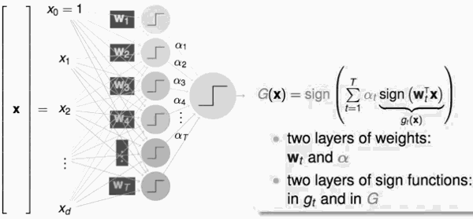
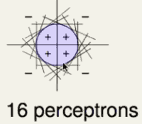
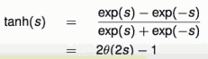
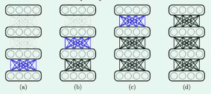

...menustart

- [Neural Network : Notivation](#5974f31b4017afa6df21ffb9b31e2666)
    - [Linear Aggregation of Perceptrons : Pictorial View](#38ccc56b9a6fc2fd501fcc0bd27a0b45)
    - [Multi-layer Perceptrons : Basic Neural Network](#57bc3e3d04ba0a7c8184820673a233ed)
- [Neural Network Hypothesis: Output](#6e543476b9761e3e5988cfc245333417)
    - [Transformation function](#ad0de27f8c1618cd8eb6d8738e12ab57)
    - [结构](#8a95a6d10dea403031ff71630d469a27)
- [Deep Learning](#6a68b6412b3d8a605c374d3c59e02694)
    - [Challenges and Key Techniques for Deep Learning](#4e961821374743cc679d4351f5717263)
- [Autodecoder](#9703d584c6cdcaf305edeb3f0567cd9e)
- [资料](#447564e4e2b0171973515a26650e66a2)
- [Network Structure:](#43751e4eda3557fca7ab0f1b99c3e6c7)
- [Techniques to Train Neural Network](#20c649642589dd245bfa69669261e277)

...menuend

<h2 id="5974f31b4017afa6df21ffb9b31e2666"></h2>

# Neural Network : Notivation

<h2 id="38ccc56b9a6fc2fd501fcc0bd27a0b45"></h2>

## Linear Aggregation of Perceptrons : Pictorial View 

 - Perceptrons 模型
    - 把你的输入 x 乘上 1堆权重，算出一个分数 
 - 一堆 perceptron 放在一起
    - x·W₁ -> g₁ , x·W₂ -> g₂ , ...
    - 

 - What boundary can G implement ?
    - 
 - Limitation: XOR not "linear separable"  
    - XOR 不是 线性可分
 - How to implement XOR(g₁,g₂) ?

<h2 id="57bc3e3d04ba0a7c8184820673a233ed"></h2>

## Multi-layer Perceptrons : Basic Neural Network

 - one more layer of AND transform ?
 - XOR(g₁,g₂) = OR( AND( -g₁,g₂ ) , AND(g₁,-g₂) )
 - 

---

<h2 id="6e543476b9761e3e5988cfc245333417"></h2>

# Neural Network Hypothesis: Output

 - OUTPUT: simply a ***linear model*** with s = wᵀ· ϕ⁽²⁾(ϕ⁽¹⁾(x)) 

<h2 id="ad0de27f8c1618cd8eb6d8738e12ab57"></h2>

## Transformation function

 - s function
 - 中间层的转换函数 可以全部使用 linear transform 吗？
    - linear : whole network linear , thus less useful
        - 如果全部都是 linear transform function ， 那个整个网络也是一个 linear transform 转换，就蜕变成 单个perceptron 模型了. So :
 - 神经网络中，一般使用如下 转换函数， 和 逻辑回归总的 s 函数很有渊源
    - 

<h2 id="8a95a6d10dea403031ff71630d469a27"></h2>

## 结构

 - input date , layer 0
 - hidden layer , 1 ≤ l ≤ L 
 - output layer , h(x)
 - apply *x* as ***input layer*** x⁽⁰⁾ , go through ***hidden layers*** to get x⁽ˡ⁾ , predict at output layer x₁⁽ᴸ⁾.
    - output x₁⁽ᴸ⁾ 的下表 1， 表示是第一个输出
 - each layer: transformation to be ***learned*** from data.
    - w向量和x向量 越平行，点积越大
    - whether *x* 'matches' weight vectors in pattern
 - NNet 是这样的一个模型，每一次都在做所谓的  ***pattern extraction***
    - pattern extraction with layers of ***connection weights***

---

<h2 id="6a68b6412b3d8a605c374d3c59e02694"></h2>

# Deep Learning

<h2 id="4e961821374743cc679d4351f5717263"></h2>

## Challenges and Key Techniques for Deep Learning

 - difficult ***structural decisions***:
    - 怎么选择一个好的模型
    - subjective with ***domain knowledge***: like ***convolutional NNet*** for images
 - high model complexity:
    - no big worries if big enough data
    - regularization towards noise-tolerant: like
        - dropout ( tolerant when network corrupted ) 丢弃坏掉的神经元
        - denoising ( tolerant when input corrupted ) 丢弃坏掉的输入
 - hard optimization problem:
    - careful initialization to avoid bad local minimum: called **pre-training**. 而不是采用 random initialization.
 - huge computational complexity ( worsen with big data )
    - novel hardware / architecture: like mini-batch with GPU

---

 - Simple Deep Learning
    - for l=1,...,L , pre-train { w⁽ˡ⁾ } assuming w⁽¹⁾, ... ,w⁽ˡ⁻¹⁾ fixed
        - 一层一层 一次决定  初始 权重值
    - 
 
<h2 id="9703d584c6cdcaf305edeb3f0567cd9e"></h2>

# Autodecoder

Autodecoder 是 实现好的 pre-training 的一个方式。

 - basic autoencoder :
    - d-d'-d NNet with error function: 平方差

---

<h2 id="447564e4e2b0171973515a26650e66a2"></h2>

# 资料

 - 一天搞懂深度学习
    - https://www.youtube.com/watch?v=ZrEsLwCjdxY
 - 深度学习 TensorFlow Deep Learning 第一堂课
    - https://www.youtube.com/watch?v=Li5sVEXTIJw
 - CS231n课程笔记翻译：卷积神经网络笔记
    - https://zhuanlan.zhihu.com/p/22038289
---

<h2 id="43751e4eda3557fca7ab0f1b99c3e6c7"></h2>

# Network Structure: 
 
 - hidden layer width:
    - Usually less than 1000
 - hidden layer height:
    - Sample/parameter ration usually between 5~30
    - 样本数／所有hidden layer的总权重数
 - thin-tall is better than fat-short
 - active function is always "non-linear"
 - 常用 active function
    - Sigmoid: 
        - 优点：好微分，计算快 ， 缺点：网路层数很深的时候，反向传播过程中 gradient会越来越小，到 input layer的时候接近0
    - ReLu: 
        - 没有 Sigmoid  vanishing gradient 的问题
        - most commonly used
    - Tanh: 
        - ranging from -1 to 1
        - commonly used when the features range from negatives , eg. NLP
 - Loss Function
    - Cross entropy:
        - More suitable for predicting categorical labels
        - 收敛更快
    - Squared Error:
        - More suitalbe for predicting continuous values ( eg. tomorrow's temperature )
 
<h2 id="20c649642589dd245bfa69669261e277"></h2>

# Techniques to Train Neural Network 

 - Conquer overfitting
    - Dropout
    - Regularization
 - Mini-batch
 - Stochastic gradient descent
 - Learning Rate
 - Advanced skills ( such as Ada Grad )

 

---

