...menustart

 - [Week1  The Learning Problem](#ecde0ae599ab9118d10cbcd51ecbaab0)
 - [Week2 Learning to Answer Yes/No](#5868daf5782375dc2181821611a1a15c)
     - [Perceptron Hypothesis Set](#85afcca55926ce0a29f0f6cb05850a9d)
         - [Perceptron](#d8d47e427c95153bb9f8bec1d2d1df94)
         - [Vector Form of Perceptron Hypothesis](#7f75552635f2c71b44d8ec37aefb9df7)
         - [Perceptrons in ℝ²](#b07c3735cd2797ec2b778d92a0adf769)
     - [Perceptron Learning Algorithm (PLA)](#0e7ff491a0fb09097115fb8590ecddb5)
         - [Practical Implementation of PLA](#03ed0e617baca54a8f30c4314b8395c6)
         - [Why PLA may work](#2c4c57a7143770c331971f4ce207c2e2)
     - [Guarantee of PLA](#e3f4c08eab2f66995b163ecf47f53898)
         - [Linear Separability](#fafcae75a7ed33e57480616db662b7ce)
         - [PLA Fact : W<sub>t</sub> Gets More Aligned with W<sub>f</sub>](#1e0adff1d0ebad51a3e3366ffd90c42a)
         - [PLA Fact : W<sub>t</sub> Does Not Grow Too Fast](#4881687a06277027c5043e17bc1b09df)
     - [Non-Separable Data](#3baec9e63797786ab9197c8328006b4c)
         - [Pocket Algorithm](#b84fec7e58d78ac3562f365b9a0ba808)
 - [Week 3 Types of Learning](#802179691269a6cfc6518c10b66d4776)
     - [Learning with Different Output Space](#e4561cdae64f2ab23476660e7fcd3596)
         - [Multiclass Classification: Coin Recognition Problem](#8aea726ae5a16d695949a7fdb31468f9)
         - [Structured Learning : Sequence Tagging Problem](#a5756f5557e96b4c381b0eff885d54ce)
     - [Learning with Different Data Label](#684c38a5e13528daec2ab3efa2097be3)
     - [Learning with Different Protocol](#6def4688e7d3b9cfc2f058ed2729c813)
     - [Learning with Different Input Space](#6ebd75d7ad445321e62d64acb494084a)
 - [Week 4 Feasibility of Learning](#cfd8a0e711b39b612b7fd7279a78d83e)
     - [Probability to the Rescue](#e2757331874147511e796bb57cd0130f)
         - [Hoeffding's Inequality](#2738a5bd77944b4f0a65a05dcf269384)
     - [Connection to Learning](#4d3ee8b9af56c703975b205e29f34cfa)
         - [The Formal Guarantee](#bc490f18155779c237c38b6532ca7b7f)
         - [Verification of One h](#911f375f353e71713d92e0e8d439e40e)
     - [Connection to Real Learning](#d9ee0f5ea86476845fea40190ab1462e)
         - [Coin Game](#9ba5efcb15754a3919e1c165c9746157)
         - [BAD Sample and BAD Data](#0f6ca2986821d310f080364af49eed46)
         - [BAD Data for Many h](#16553486c255ce8a5d8e557b67c3c9a6)
         - [Bound of BAD Data](#c82862b9ceccd7efd1ca9d2bab635903)
         - [The 'Statistical Learning Flow'](#d8634320f9db8392b907e680f3fbdeef)
 - [Week5 Traning versus Testing](#e25bb439455099bb6fd2a7b680e73f15)
     - [Trade-off on M](#8d5764cc1a7dce832f420e7096b07f1b)
     - [Effective Number of Lines](#83bee210aad456619c22ae2c5e2dc963)
         - [How many Kinds of Lines for 1~4 Inputs in 2D  ?](#624848f04dceb9194a26b7aa039879f2)
         - [Effective Number Of Lines](#8c31579792d76e74531e953be4313740)
     - [Effective Number of Hypotheses](#8fc2f515778b49e4ad6450b9cf3d6c49)
         - [Dichotomies: Mini-hypothesis](#8d22448394722fd85b23c2eb8246dcb2)
         - [Growth Function](#dfa7e0a4bb23bbcf4e814b850274fd66)
         - [TODO](#b7b1e314614cf326c6e2b6eba1540682)
     - [Break Point](#5a0ecfb80c0bc36fc6c7b593079594cb)
         - [The 4 Growth Functions](#b5ce0fb28ce372d75a041bef143918ef)
         - [Break Point of H](#d5be8e86759a610959b92abd0aa75199)
 - [Week 6 Theory of Generalization  举一反三](#a191a7c2b6e0987654f6d92503bf1078)
     - [Restriction of Break Point](#7cd79213ae5758377b9aed8accc60591)
     - [Bounding Function: Basic Cases](#3bf7d47fb91c77c8c30afce81e8a67e1)
         - [Table of Bounding Function](#e51ebc67414533b0af139f8439d3408e)
     - [Bounding Function: Inductive Cases](#2c65d0169d44316f221fe6051944e78e)
         - [Bounding Function : The Theorem](#20885a853d6349f8a2c1b4a13f9fd078)
     - [A Pictorial Proof](#ac41223f5ec900a59b7a7c730d2db790)
         - [That's All !](#942c21d4344c1e2c04cd9cb2b0635e7f)
 - [Week7 The VC Dimension](#15173fa6f984d4d655f1b15b08355016)
     - [Definition of VC Dimension](#03b215c6ba1906c71c6856766d5a91dc)
         - [The 4 VC Dimensions](#ef6ecf6a562931f940c6f8fa8f315ec9)
         - [VC Dimemsion and Learning](#2ab6a2e714fe88daa38d0ebadbd820b7)
     - [VC Dimension of Perceptrons](#010c451c23e144261c78eed3918be60c)
         - [d<sub>VC</sub> ≥ d+1](#0bcebb5418877c668b7f8078fd53e2a6)
         - [d<sub>VC</sub>  ≤ d+1](#b23a9ffbf5d00fecd76ee661c5bae97c)
     - [Physical Intuition of VC Dimension](#a7ab380b76ef972f810d737e226f4fe6)
         - [Degrees of Freedom](#364130468e37b396a03b78270e87774b)
         - [Two Old Friends](#c30d7a9f1110a7115386a1a1449444ff)
         - [M and d<sub>vc</sub>](#668bae56a418c6c053a975bbc41bef59)
     - [Interpreting VC Dimension](#4fa217a4f25efe58ca38efc2921a9ece)
         - [VC Bound Rephrase:  Penalty for Model Complexity](#cf1207c2cd37bca9c19baefe3be5f449)
         - [THE VC Message](#fd5261ae2542df593b9ab1967d1212b7)
         - [VC Bound Rephrase : Sample Complexity](#2103d3a1527ad166beedae934932a08e)
         - [Summary](#290612199861c31d1036b185b4e69b75)
 - [Week 8  Noise and Error](#6d87d0270ecffd6ed877bf64cf997573)
     - [Noise and Probabilistic Target](#a3f810ce646f0936df658a4d30a15b6d)
     - [Error Measure](#d2d99ba3e6ff66dfef2164352b2c98a1)
         - [Pointwise Error Measure](#9a0ea46a375f6caa83eb7371460f252e)
         - [Two Important Pointwise Error Measures](#6c2d0a3129771ec5553a0a7b40c04800)
         - [Ideal Mini-Target](#4800505041049669fa7b042ae638b020)
     - [Algorithmic Error Measure](#2187b661cffc7f0490d1f364850ab22a)
         - [Choice of Error Measure](#46b76063f10f6397dfd67504c091971d)
         - [Take-home Message for Now](#df794cf0b049355a25a3dc69dacf670b)
     - [Weighted Classification](#77f01330c84d591c46ceb54c844f4fbe)
         - [Minimizing E<sub>in</sub> for Weighted Classification](#aae4803feb7519588dfdfd0080792d30)
         - [Systematic Route](#62efbe469e781542f448dfebe1e436d8)
         - [Weighted Pocket Algorithm](#55d55c54777e3438c85343abfae313ac)

...menuend


<h2 id="ecde0ae599ab9118d10cbcd51ecbaab0"></h2>


# Week1  The Learning Problem

 - *Algorithm* takes *Data* and *Hypothesis set*  to get final hypothesis *g*.
    - H: set of candidate formula , with different weights W

<h2 id="5868daf5782375dc2181821611a1a15c"></h2>


# Week2 Learning to Answer Yes/No

<h2 id="85afcca55926ce0a29f0f6cb05850a9d"></h2>


## Perceptron Hypothesis Set

<h2 id="d8d47e427c95153bb9f8bec1d2d1df94"></h2>


### Perceptron

 - x = { x₁,x₂,...,x<sub>d</sub> }
 - y = { +1 | -1  }
 - h(x) = sign( ∑ᵈᵢ₌₁ wᵢxᵢ - threshold  )

<h2 id="7f75552635f2c71b44d8ec37aefb9df7"></h2>


### Vector Form of Perceptron Hypothesis
    
 - 把 *threshold* 也当成是一个特殊的 w₀

```
h(x) = sign( ∑ᵈᵢ₌₁ wᵢxᵢ - threshold  )
h(x) = sign( ∑ᵈᵢ₌₁ wᵢxᵢ + (-threshold)*(+1)  )
h(x) = sign( ∑ᵈᵢ₌₀ wᵢxᵢ )
h(x) = sigh ( WᵀX )
```

<h2 id="b07c3735cd2797ec2b778d92a0adf769"></h2>


### Perceptrons in ℝ²

 - h(x) = sign( w₀ +w₁x₁ +w₂x₂ )
    - h(x) = 0 is a **lines** ( ir hyperplanes in ℝᵈ )

 - perceptrons <=> **linear (binary) clasifiers**
    - PS. (2D空间下) 二元分类也并不仅限与 直线划分的情况，h(x)=0 也可以是一条曲线。只是这个perceptron 是直线情况


<h2 id="0e7ff491a0fb09097115fb8590ecddb5"></h2>


## Perceptron Learning Algorithm (PLA)

 - will represent *g₀* by its weight verctor W₀ 
 - 如果 直线 *g*=0 还不完美，我们一定可以找得出 资料中的某一个点 ( x<sub>n(t)</sub> , y<sub>n(t)</sub>  ) , 在这个点上  *g* 犯了错 
 - 犯了错，我们就要想办法来修正它 ， 如何修正？
    - 如果 y 应该是正的，g 得到的是负的，说明 W,X 的角度太大， 那我们就把 向量W 转回来;反之，我们把向量W  转开
    - 这两种情况，可以统一的由 `W=W+yx` 处理
    - 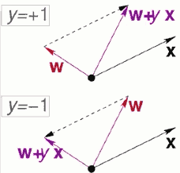
 - 算法伪代码如下:


 - A fault confessed is half redressed.
 - Weight Space
    - A point in the space represents a particular setting of  W
    - each training case X can be represented as a hyperplane through the origin.
        - The plane goes through the origin and is perpendicular to the input vector X .
    - The weights must lie on one side of this hyper-plane to get the answer correct.
    - 更具体的 weight space 说明，见 [Neural Networks](https://github.com/mebusy/notes/blob/master/dev_notes/NeuralNetworks.md)
        - 实践中，也能把 W，X角色互换也可以？

<h2 id="03ed0e617baca54a8f30c4314b8395c6"></h2>


### Practical Implementation of PLA 

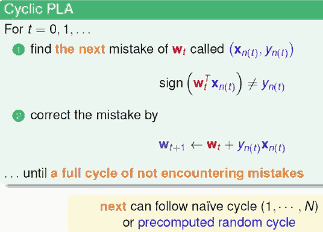

 - 按某个顺序便利 样本，如果发现错误就纠错， 知道某个完整的循环没有错误。
 - 注意 PLA 样本输入 X 需要插入 bias


<h2 id="2c4c57a7143770c331971f4ce207c2e2"></h2>


### Why PLA may work 

 - sign(WᵀX) != y<sub>n</sub> ,  W<sub>t+1</sub> <-  W<sub>t</sub> + y<sub>n</sub>X<sub>n</sub>
 - y<sub>n</sub>W<sub>t+1</sub>X<sub>n</sub> >=  y<sub>n</sub>W<sub>t</sub>X<sub>n</sub>
    - 如果y<sub>n</sub> 是负的，算法的作用是 努力使WᵀX往正的方向努力，使得更接近正确的 y

<h2 id="e3f4c08eab2f66995b163ecf47f53898"></h2>


## Guarantee of PLA

<h2 id="fafcae75a7ed33e57480616db662b7ce"></h2>


### Linear Separability

 - if PLA halts (i.e. no more mistakes) , ( **necessary condition** ) D allows some *W* to make no mistake 
 - call such D **linear separable**

<h2 id="1e0adff1d0ebad51a3e3366ffd90c42a"></h2>


### PLA Fact : W<sub>t</sub> Gets More Aligned with W<sub>f</sub>

 - linear separable D <=> exists perfect  W<sub>f</sub> such that y<sub>n</sub> = sign(  W<sub>f</sub>ᵀx<sub>n</sub> )

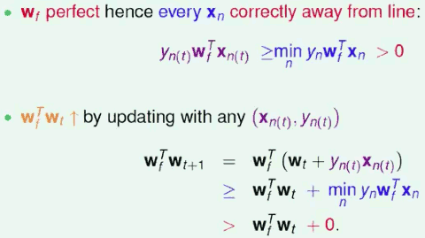

 - 由上可以，如果 W<sub>t</sub> 的长度没有变长的话，那么可以看到 PLA 使得  W<sub>t</sub> 更加接近W<sub>f</sub> 

<h2 id="4881687a06277027c5043e17bc1b09df"></h2>


### PLA Fact : W<sub>t</sub> Does Not Grow Too Fast 

 - W<sub>t</sub> changed only when mistake 
    - <=> sign( W<sub>t</sub>ᵀx<sub>n(t)</sub> ) ≠ y<sub>n(t)</sub> 
    - <=> y<sub>n(t)</sub> W<sub>t</sub>ᵀx<sub>n(t)</sub> ≤ 0  (WX和y 异号)

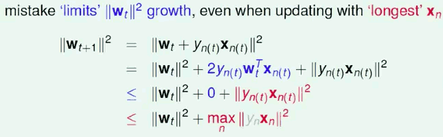

 - 综合这两条，我们可以得到

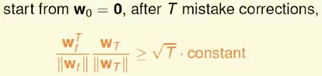

 - Guarantee
    - as long as *linear separable* and *correct by mistake*
    - inner product of W<sub>f</sub> and W<sub>t</sub> grows fast; length of W<sub>t</sub> grows slowly
    - PLA 'lines' are more and more aligned with W<sub>f</sub> => halts

<h2 id="3baec9e63797786ab9197c8328006b4c"></h2>


## Non-Separable Data

<h2 id="b84fec7e58d78ac3562f365b9a0ba808"></h2>


### Pocket Algorithm

 - modify PLA (black lines) by keeping best weights in pocket

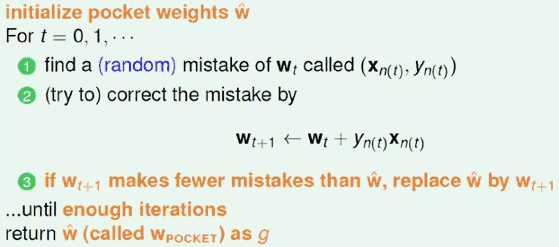

 - 遍历样本，如有有错，就纠错 -- update w
 - 把更新后的w  放到整个样本中测试错误率， 记录错误率最小的那个 wg
 - 一般设置 w 更新满 n次后，结束整个算法


<h2 id="802179691269a6cfc6518c10b66d4776"></h2>


# Week 3 Types of Learning

<h2 id="e4561cdae64f2ab23476660e7fcd3596"></h2>


## Learning with Different Output Space

<h2 id="8aea726ae5a16d695949a7fdb31468f9"></h2>


### Multiclass Classification: Coin Recognition Problem 

 - classify US coins (1c,5c,10c,25c)
    - y = {1,2,...,K}
 - written digits => 0,1,...,9
 - picture => apple, orange , strawberry

<h2 id="a5756f5557e96b4c381b0eff885d54ce"></h2>


### Structured Learning : Sequence Tagging Problem

 - multiclass classification : word => word class
 - structured learning :
    - sentence => structure (class of each word)
 - y = { PVN,PVP,NVN,PV,... } , not including VVVVV
 - huge multiclass classification problem 
    - (structure ≡ hyperclass) without 'explicit' class definition

<h2 id="684c38a5e13528daec2ab3efa2097be3"></h2>


## Learning with Different Data Label

 - Supervised : all y<sub>n</sub>
 - Unsupervised : no y<sub>n</sub>
    - clustering :  {X<sub>n</sub>} => cluser(X)
    - density estimation : {X<sub>n</sub>} => density(X)
        - ≈ 'unsupervised bounded regression' 
        - i.e. traffic reports with location => dangerous areas
    - outlier detection {X<sub>n</sub>} => unusual(X) 
        - ≈ 'unsupervised binary regression' 
        - i.e. Internet logs => intrusion alert
    - ... and a lot more !
 - Semi-supervised : some y<sub>n</sub>
    - leverage unlabeled data to avoid 'expensive' labeling
    - eg.
        - face images with a few labeled => face identifier (Facebook)
        - medicine data with a few labeled => medicine effect predictor
 - Reinforcement Learning : implicit y<sub>n</sub>


<h2 id="6def4688e7d3b9cfc2f058ed2729c813"></h2>


## Learning with Different Protocol

 - Batch Learning
 - Online: hypothesis improves through receiving data instances sequeentially
    - PLA can be easily adapted to online protocol 
    - reinforment learning is often done online
 - Active Learning:  Learning by 'Asking'   
    - active: improve hypothesiis with fewer lables (hopefully) by asking questions **strategically**
    - 跟上面两个被动学习不同, label成本很高的情况 适合尝试

<h2 id="6ebd75d7ad445321e62d64acb494084a"></h2>


## Learning with Different Input Space

 - concrete features
    - 比如硬币分类，选择 大小，重量等等 作为feature
    - 通常带有人类的智慧对这个问题的描述
 - Raw Features: digit recognition problem
    - often need human or machines to convert to concrete ones
 - Abstract Features : Rating Prediction problem
    - given previous (userid, itemid, rating) tuples , predict the rating that some userid would give to itemid ?
    - 'no physical meaning' ; thus even more difficult for ML

<h2 id="cfd8a0e711b39b612b7fd7279a78d83e"></h2>


# Week 4 Feasibility of Learning

<h2 id="e2757331874147511e796bb57cd0130f"></h2>


## Probability to the Rescue

 - consider a bin of many many *orange* and *green* marbles
 - we don't know the *orange* portion (probability) 
 - can you **infer** the *orange* probability ?

 - Solution 1:  random sampling  ?

---

 - bin: assume
    - orange probability = μ
    - green probability = 1-μ
    - with μ **unknonw** 
 - sample 
    - N marbles sampled independently , with 
        - *orange* fraction = ν 
        - *green* fraction = 1-ν
    - now ν **known**
 - does **in-sample ν**  say anything about out-of-sample μ ?
    - **NO!**   possibly not: sample can be mostly *green* while bin is mostly *orange*
    - **YES!**  probably yes: in-sample ν likely close to unknown μ.
    - 没有办法有个确定的答案。
        - 没有办法说，我抽10颗起来，这10颗的比例就一定是罐子里面的比例。不过呢，大致上有很大的几率是这个样子。

<h2 id="2738a5bd77944b4f0a65a05dcf269384"></h2>


### Hoeffding's Inequality

 - sample of size N 
 - μ = *orange* probability in bin
 - ν = *orange* fraction in sample
 - in big sample (N large) , ν is probably close to μ ( within ε ) 
    - 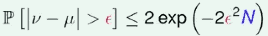
    - 当N很大是，μ和ν 相差很大的几率 很小
 - called **Hoeffding Inequality** , for marbles, coin, polling
 - The statement 'μ-ν' is **probably approximately correct** (PAC)

---

 - valid for all N and ε
    - 不管你选择的N 和 ε 是多少，这个式子都是对的
 - does not depend on μ , **no need to 'know' μ**
    - 等式右边不需要μ
 - large sample size N for looser gap ε => higher probability for `μ≈ν`
 - if large N , can probably infer unknown μ  by known ν.

---

 - Q: Let μ = 0.4. Use Hoeffding's Inequality to bound the probability that a sample of 10 marbles will have ν ≤ 0.1. What bound do you get?
    - (1) 0.67 , (2) 0.40 , (3) 0.33 , (4) 0.05
 - A: set N=10, and ε = 0.3, you will get the anwser (3)
    - `2* (math.e **(  -2*e*e*N  ) ) = 0.3305977764431732`
    - BTW, (4) is the actual probability and Hoeffding gives only an upper bound to that.

<h2 id="4d3ee8b9af56c703975b205e29f34cfa"></h2>


## Connection to Learning

bin | learning
--- | ---
unknown *orange* prob. μ | fixed hypothesis h(x) ?  target f(x)
marble ∈ bin | X ∈ 𝕏
orange marble | h is wrong <=> h(x) ≠ f(x)
green marble | h is right <=> h(x) = f(x)
size-N sample from bin | check h on ⅅ = { (X<sub>n</sub>, y<sub>n</sub>) } , if no noise , y<sub>n</sub>=f(X<sub>n</sub>)

 - if **large N** & **i.i.d X<sub>n</sub>** infer unknown [ h(x) ≠ f(x) ]  probability by known [ h(x<sub>n</sub>) ≠ y<sub>n</sub>  ]
 - for any fixed *h* ,  can probably infer
    - **unknown E<sub>out</sub>(h)** = ε<sub>X~P</sub> [ h(x) ≠ f(x) ]  , (μ)
    - by **known E<sub>in</sub>(h)** = 1/N·∑ᴺ<sub>n=1</sub> [ h(x<sub>n</sub>) ≠ y<sub>n</sub>  ] , (ν)

<h2 id="bc490f18155779c237c38b6532ca7b7f"></h2>


### The Formal Guarantee

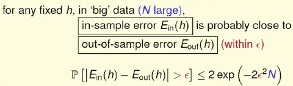

same as the 'bin' analogy...

 - valid for all N and ε
 - does not depend on E<sub>out</sub>(h) , **no need to know E<sub>out</sub>(h)**
    - f and P can stay unknown
 - 'E<sub>in</sub>(h) = E<sub>out</sub>(h)' is **probably approximately correct (PAC)**.
 - if **E<sub>in</sub>(h) ≈ E<sub>out</sub>(h)** and **E<sub>in</sub>(h) small** 
    - => E<sub>out</sub>(h) small.
    - => h ≈ f with respect to P 

<h2 id="911f375f353e71713d92e0e8d439e40e"></h2>


### Verification of One h

 - for any fixed *h*, when data large enough,  E<sub>in</sub>(h)  ≈ E<sub>out</sub>(h) 
    - can we claim 'good learning' ( g ≈ f  ) ?
 - Yes: if E<sub>in</sub>(h)  small for the fixed h , and **A pick the h as g** => 'g = f' PAC
 - No: if **A forced to pick THE h as g** which has not small E<sub>in</sub>(h)

<h2 id="d9ee0f5ea86476845fea40190ab1462e"></h2>


## Connection to Real Learning

<h2 id="9ba5efcb15754a3919e1c165c9746157"></h2>


### Coin Game

 - if everyone in size-150 , flip a  coin 5 times , one will get 5 heads with large probability
    - 1 - (31/32)¹⁵⁰ > 99%
 - BAD sample:  E<sub>in</sub> and E<sub>out</sub> **far away**

<h2 id="0f6ca2986821d310f080364af49eed46"></h2>


### BAD Sample and BAD Data

 - BAD Sample
    - e.g. E<sub>out</sub> = 1/2, but getting all heads ( E<sub>in</sub> = 0 )
 - BAD Data for One h
    - E<sub>in</sub> and E<sub>out</sub> **far away** 
    - e.g. E<sub>out</sub> big (far from f) , but E<sub>in</sub>  small ( correct on most examples )
 - Hoeffding 保证的是，BAD Data for h 的总体概率比较小

<h2 id="16553486c255ce8a5d8e557b67c3c9a6"></h2>


### BAD Data for Many h

 - BAD data for many h
    - <=> **no 'freedom of choice'** by A
    - <=> there exists some h such that E<sub>in</sub> and E<sub>out</sub> **far away** 

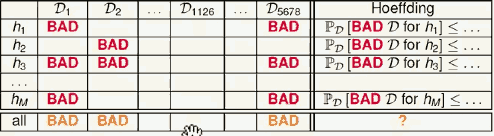

 - for M hypotheses , bound of ℙ<sub>D</sub>[BAD D] ?

<h2 id="c82862b9ceccd7efd1ca9d2bab635903"></h2>


### Bound of BAD Data

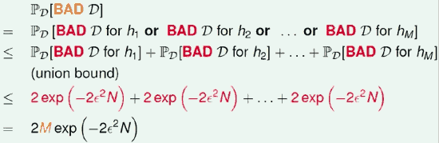

 - 比原来的 Hoeffding 大了100倍

 - finite-bin version of Hoeffding , valid for all **M**, N , and ε
 - does not depend on E<sub>out</sub>(h<sub>m</sub>) , **no need to know E<sub>out</sub>(h<sub>m</sub>)**
    - f and P can stay unknown
 - 'E<sub>in</sub>(g) = E<sub>out</sub>(g)' is PAC , regardless of A 
    - 如果资料量D 够多，可以说 每一个h都是安全的： 也就是说
        - 如果 hypothesis set只有有限多種選擇 我的資料量夠多，那麼不管我的演算法A怎麼选 Ein跟Eout都會接近
 - most reasonable A (like PLA/pocket) : pick the h<sub>m</sub> with **lowest E<sub>in</sub>(h<sub>m</sub>)** as g

<h2 id="d8634320f9db8392b907e680f3fbdeef"></h2>


### The 'Statistical Learning Flow'

 - if |H| = M finite , N large enough
    - for whatever *g* picked by A , E<sub>out</sub>(g) ≈ E<sub>in</sub>(g)
 - if A finds one *g* with E<sub>in</sub>(g) ≈ 0,
    - PAC guarantee for  E<sub>out</sub>(g) ≈ 0
 - M = ∞ ? (like perceptrons) 
    - see next lecture

<h2 id="e25bb439455099bb6fd2a7b680e73f15"></h2>


# Week5 Traning versus Testing

<h2 id="8d5764cc1a7dce832f420e7096b07f1b"></h2>


## Trade-off on M

 1. can we make sure that E<sub>out</sub>(g) is close enoughto E<sub>in</sub>(g)?
 2. can we make E<sub>in</sub>(g) small enough 

 - M is the size of hyperthesis set

Question | small M | large M
--- | --- | ---
Q1  | Yes!  ℙ[BAD] = 2·M·exp(...) | No!, ℙ[BAD] = 2·M·exp(...)   
Q2  | No! too few choices  | Yes!, many choices


 - using the right M (or H) is important
 - M = ∞ doomed ?

---

 - One way to use the inequality , is to pick a tolerable difference ε as well as a tolerable BAD probability δ , and the gather data with size(N) large enough to achieve those tolerance criteria.
    - Let δ = 0.1 , δ = 0.05 , and M=100. What is the data size need ?
    - `N =   math.log( delta / ( 2*M) ) / (  -2*eps**2  ) = 414.7024820051013  `   

<h2 id="83bee210aad456619c22ae2c5e2dc963"></h2>


## Effective Number of Lines

 - Where did uniform Bound Fail ?
    - union bound :  ℙ[B1 or B2 or ... or B<sub>M</sub>] ≤ ℙ[B1]+ℙ[B2]+ ... + P[B<sub>M</sub>]
    - consider for M = ∞ , the sum of right side  may > 1 , 那这个bound 就没有意义了
 - 这个bound 到底出了什么问题？
    - 为什么我们可以用union bound ？ 因为坏事情不太会重叠
    - 事实上， 两个相近的h1,h2， 发生坏事情的Data set 通常非常接近
    - 重叠部分就造成了上限的 over-estimating , 从而导致无法处理M无限大的情况
 - 所以需要想办法找出这些坏事情重叠的部分。 
    - 第一步，也许是我们能不能把我们的无限多个hypothesis , 分成有限多类

<h2 id="624848f04dceb9194a26b7aa039879f2"></h2>


### How many Kinds of Lines for 1~4 Inputs in 2D  ?

 - 1 input
    - 2 kinds line
 - 2 inputs
    - 4 kinds line
 - 3 inputs 
    - 8 kinds line
    - 如果 三点共线，只有 6种线
 - 4 inputs
    - 14 kinds line ( 注意不是16 )
    - 共线的情况，更少

<h2 id="8c31579792d76e74531e953be4313740"></h2>


### Effective Number Of Lines

 - maximum kinds of lines with respect to N inputs X₁,X₂,...X<sub>N</sub>
 - must be ≤ 2ᴺ
 - wish
    - ℙ[ |E<sub>in</sub>-E<sub>out</sub>| > ε ] ≤ 2·effective(N)·exp( -2ε²N )
 - if 
    - 1. effective(N) can replace M , and 
    - 2. effective(N) ⋘ 2ᴺ 
    - 那么当你的N足够大的时候， 右边的这项会趋近于0
 - 所以就算有無限多條線 如果我們能夠把這個無限多條線，換成這個effective這個有限的數字 而且這個effective這個數字，實際上比2的N次方 來的小很多的話，我們就可以保證，可能可以學得到東西。 好，暫時來說這是我們的猜想.

<h2 id="8fc2f515778b49e4ad6450b9cf3d6c49"></h2>


## Effective Number of Hypotheses

 - what about 线以外的 hypothesis set ?  e.g. 高维度的hyperplane.

<h2 id="8d22448394722fd85b23c2eb8246dcb2"></h2>


### Dichotomies: Mini-hypothesis

 - H = { hypothesis  h: X → { x, o} } 
 - call h(x₁,x₂, ... , X<sub>N</sub> ) = ( h(x₁),h(x₂), ... , h(X<sub>N</sub>)  ) ∈ {x,o}ᴺ 
    - a **dichotomy**: hypothesis 'limited' to the eyes of x₁,x₂, ... , X<sub>N</sub> 
    - dichotomy : 二分的
 - H( x₁,x₂, ... , X<sub>N</sub>  ) :
    - **all dichotomies 'implemented' by H on x₁,x₂, ... , X<sub>N</sub>**

 · | hypothesis H | dichotomies H( x₁,x₂, ... , X<sub>N</sub>  ) 
--- | --- | ---
e.g. | all lines in ℝ² | {oooo, ooox , ooxx, ...}
size | possibly infinite | upper bounded by 2ᴺ

 - 如果一个hypothesis set， 每一種dichotomy都可以做 出來，每一種dichotomy都可以做出來代表 它的這個成長函數是2ᴺ 。
    - OK我給你N個點，你可以吧2ᴺ 那麼多種dichotomy 統統做出來，那我們說這N個點我們把它取一個特別的名字叫
    - shattered


<h2 id="dfa7e0a4bb23bbcf4e814b850274fd66"></h2>


### Growth Function 

 - 我们能不能用这个dichotomy set 的大小，来取代原来 Hoeffding 里面那个让我们觉得很困扰的，可能是无限大的M呢？
 - 小麻烦：
    - |  H( x₁,x₂, ... , X<sub>N</sub>  ) |: depend on inputs ( x₁,x₂, ... , X<sub>N</sub>   )
    - dichotomy set 取决于我们选好的 x₁,x₂, ... , X<sub>N</sub>  ， 我们希望移除这个依赖
 - growth function:  remove dependence by **taking max of  all possible ( x₁,x₂, ... , X<sub>N</sub>  )**
    - 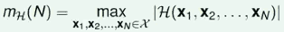
 - finite , upper-bounded by 2ᴺ

<h2 id="b7b1e314614cf326c6e2b6eba1540682"></h2>


### TODO

<h2 id="5a0ecfb80c0bc36fc6c7b593079594cb"></h2>


## Break Point 

<h2 id="b5ce0fb28ce372d75a041bef143918ef"></h2>


### The 4 Growth Functions 

case | growth Function
--- | --- 
positive rays | N+1
positive intervals | 1/2·N²+1/2·N+1
convex sets |  2ᴺ
2D perceptrons | < 2ᴺ in some cases

 - What if m<sub>H</sub>(N) replaces M ?
    - polynomial: good 
    - exponential : bad 
        - convex set 的情况，就算N够大，也不见得 能够确保 E<sub>in</sub> 和 E<sub>out</sub> 非常接近 
 - 那么，2D perceptron 到底是好的还是不好的呢？


<h2 id="d5be8e86759a610959b92abd0aa75199"></h2>


### Break Point of H 

 - what do we know about 2D perceptrons now ?
    - three inputs: exists shatter 
    - four inputs: 'for all' no shatter
 - if no *k* inputs can be shattered by H , call *k* a **break point** of H 
    - m<sub>H</sub>(k) < 2ᵏ
    - k+1, K+2, k+3, ... also break points !!
    - will study minimum break point *k*
    - 也就是说，任意取 k个输入，都无法被 H shattered


case | break point
--- | --- 
positive rays | 2
positive intervals | 3
convex sets |  no break point 
2D perceptrons | 4 
  

 - conjecture 推测 
    - no break point: m<sub>H</sub>(N) = 2ᴺ (sure!)
    - break point k: m<sub>H</sub>(N) = O( N<sup>k-1</sup>  )
        - growth function的增长速度 搞不好会和 和break point 有关


case | break point | growth Function | O
--- | --- | --- | --- 
positive rays | 2 | N+1 | O(N)
positive intervals | 3 | 1/2·N²+1/2·N+1 | O(N²)
convex sets | no bp | 2ᴺ | O(2ᴺ)
2D perceptrons | 4 | < 2ᴺ in some cases |  O(N³) ?

---

<h2 id="a191a7c2b6e0987654f6d92503bf1078"></h2>


# Week 6 Theory of Generalization  举一反三

<h2 id="7cd79213ae5758377b9aed8accc60591"></h2>


## Restriction of Break Point

 - what 'must be true' when **minimum break point k==2** ?
    - N=1, every m<sub>H</sub>(N) == 2 by definition
    - N=2, every m<sub>H</sub>(N) < 4 by definition
        - maximum possible = 3
    - N=3, every m<sub>H</sub>(N) == 4 < 2³ 
        - eg. 最多产生4中，再尝试加入任意一种 dichotomy都会破坏 break point k=2
        - o o o 
        - o o x
        - o x o
        - x o o
 - break point *k*  restricts maximum possible m<sub>H</sub>(N) a lot for N > k
 - IDEA:   m<sub>H</sub>(N) 
    - ≤ maximum possible m<sub>H</sub>(N) given *k*
    - ≤ poly(N)

<h2 id="3bf7d47fb91c77c8c30afce81e8a67e1"></h2>


## Bounding Function: Basic Cases

 - bounding function B(N,k):
    - maximum **possible** m<sub>H</sub>(N) when break point = k
 - combinatorial quantity:
    - maximum number of length-N vectors with (o,x) while 'no shatter' any length-k subvectors
    - 可以很抽象地想象 我有一堆的向量，這些向量其實就是我的dichotomy， 我的dichotomy這些向量是圈圈叉叉組成的，這些圈圈叉叉的長度是n， 然後呢，但是我做一個限制，我說這些長度是n的向量 如果我把它的某些維度遮起來，我只看它的其中 k個維度的話， 我都不希望看到圈圈叉叉所有的 情形，也就是說我不希望看到2ᵏ 种組合。用我們的術語來說，就是 不能出現shatter，不能把這個k個點，通通都ko掉。 
 - irrelevant of the details of H , e.g. B(N,3) bounds both 
    - positive intervals (k=3)
    - 1D perceptrons (k=3)

 - new goal:  B(N,k) ≤ poly(N) ?


<h2 id="e51ebc67414533b0af139f8439d3408e"></h2>


### Table of Bounding Function 

 - B(N,1) = 1
 - B(N,k) = 2ᴺ for N < k
    - including all dichotomies not violating 'breaking condition'
 - N(N,k) = 2ᴺ-1 for N = k


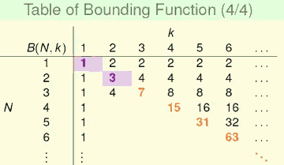

 - quiz: for the 2D perceptrons , which of the following claim is true ?
    - minimum break point k = 2.   ( False, k = 4  )
    - m<sub>H</sub>(4) = 15.  (False,   m<sub>H</sub>(4) = 14 )
    - m<sub>H</sub>(N) < B(N,k) when N=k=minimum break point  ( True )
    - m<sub>H</sub>(N) > B(N,k) when N=k=minimum break point  ( False, B(4,4)=15 )
 - so bounding function B(N,k) can be 'loose' in bounding m<sub>H</sub>(N) 


<h2 id="2c65d0169d44316f221fe6051944e78e"></h2>


## Bounding Function: Inductive Cases

 - B(N,k) ≤ B(N-1,k) + B(N-1, k-1)

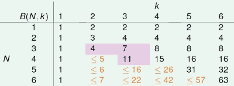

 - **acutally , '≤' can be '='**. 

<h2 id="20885a853d6349f8a2c1b4a13f9fd078"></h2>


### Bounding Function : The Theorem

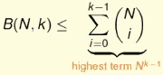

 - for fixed *k*, B(N,k) upper bounded by poly(N) 
    - ⇒ m<sub>H</sub>(N) is poly(N) **if break point exists**

<h2 id="ac41223f5ec900a59b7a7c730d2db790"></h2>


## A Pictorial Proof

 - 現在有了這個成長函數、 上限函數的這些觀念 我們回過頭來做什麼？
 - 我們的成長函數可能是跟多項式一樣要長大，那我們能不能 就把這個成長函數丟進去原來的這個finite-bin的Hoeffding裡面, 然後- 事情就解決了?
 - 當然事情實際上沒有那麼簡單 我們最後最後能夠做到的事情並不是長這樣，並不是說，把 原來那個大M用小mH of N，然後取代掉就算了 我們能夠做到事情是什麼？我們能夠做到的事情是 一個長得差不多的版本，這差不多的版本裡面有幾件事情：
    - 第一件事情是，我要N夠大 
    - 然后又多出了一些常数

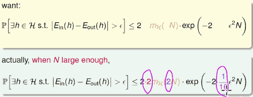

 - 这个公式的证明需要一些数学上的推导等等.

---

<h2 id="942c21d4344c1e2c04cd9cb2b0635e7f"></h2>


### That's All !

 - Vapnik-Chervonenkis (VC) bound:

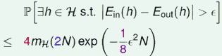


 - Q: For positive rays , m<sub>H</sub>(N) = N+1. Plug it into the VC bound for ε=0.1, and N=10000. What is VC bound of BAD events?
 - A: 0.298...
 - 這並不是 一個很小的數字
    - 我們在算這個bound的過程中，花了很多的近似在裡面 那所以造成了這個bound其實不見得真的是那麼準 
    - 這個bound既然不那麼準 我們為什麼要花這麼大的力氣去推導、 去講它? 


---

<h2 id="15173fa6f984d4d655f1b15b08355016"></h2>


# Week7 The VC Dimension

 - 上周讲到了舉一反三
 - 舉什么，舉例子? 像我們訓練的時候在舉例子 
 - 然後反三也就是說我們測試的時候會跟我們訓練的時候的表現是類似 
 - 我們上個禮拜跨出了很重要的一步，我們說我們可以 確保我們的Ein，也就是我們訓練時候的表現，跟我們的Eout 我們測試時候的表現是類似的。
 - 什麼時候可以這樣確保呢？
    - 我們只要 我們的成長函數在某個地方露出了一線曙光，并且 如果我們的資料量夠多的時候，我們就可以確保Ein跟Eout是接近的 
 - 那從這裡出發呢，我們就要開始看看這個一線曙光的意義 是什麼？實際上這就會引到我們待會兒對這個VC dimension.

<h2 id="03b215c6ba1906c71c6856766d5a91dc"></h2>


## Definition of VC Dimension

 - the formal name of **maximum non-**break point
 - Definition:
    - VC dimemsion of H , denoted d<sub>VC</sub>(H) is 
        - **largest** N for which m<sub>H</sub>(N) = 2ᴺ
    - the **most** inputs H that can shatter
    - d<sub>VC</sub> = 'minimum k' -1
    - 注意要考虑到所有可能的输入
 - N ≤ d<sub>VC</sub>  ⇒  H can shatter some N inputs 
 - N > d<sub>VC</sub>  ⇒  N is a break point for H
    - k > d<sub>VC</sub>  ⇒  k is a break point for H
    
<h2 id="ef6ecf6a562931f940c6f8fa8f315ec9"></h2>


### The 4 VC Dimensions

 · | VC Dimension
--- | --- 
positive rays |  1
positive intervals | 2 
convex sets | ∞ 
2D perceptrons | 3 

 - VC dimension 是 finite 的 hypothesis set 就是好的 hypothesis set

<h2 id="2ab6a2e714fe88daa38d0ebadbd820b7"></h2>


### VC Dimemsion and Learning

 - finite d<sub>VC</sub> ⇒ g 'will' generialize ( E<sub>out</sub>(g) ≈ E<sub>in</sub>(g)   )
    - regardless of learning algorithm A
        - 即便是很糟糕的算法， E<sub>in</sub> 和 E<sub>out</sub> 也是很接近的，只是这样的情况对我们没什么好处
    - regardless of input distribution P 
    - regardless of target function f 

 - Q: If there is a set of N inputs that cannot be shattered by H. Based only on this information , what can we conclude about d<sub>VC</sub>(H) ?
    1. d<sub>VC</sub>(H) > N
    2. d<sub>VC</sub>(H) = N
    3. d<sub>VC</sub>(H) < N 
    4. no conclusion can be made.
 - A:4  
    - It is possible that there is another set of N inputs that can be shatterred, which means d<sub>VC</sub>(H) ≥ N.
    - It is also possible that no set of N input can be shattered , which means d<sub>VC</sub>(H) < N.
    - Neither cases can be ruled out by one non-shattering set.

<h2 id="010c451c23e144261c78eed3918be60c"></h2>


## VC Dimension of Perceptrons

 - 1D perceptron (pos/neg rays): d<sub>VC</sub> = 2
 - 2D perceptrons : d<sub>VC</sub> = 3
 - d-D preceptrons : d<sub>VC</sub> = ? 
    - guess d + 1 ?  

 - how to proof ? 2 steps 
    1. prove  d<sub>VC</sub>  ≥ d+1
    2. prove  d<sub>VC</sub>  ≤ d+1

<h2 id="0bcebb5418877c668b7f8078fd53e2a6"></h2>


### d<sub>VC</sub> ≥ d+1

 - how ?
    - There are **some** of d+1 **inputs** we can shatter.
 - some 'trivial' inputs
    - 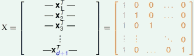
    - 最左灰色的1 是插入的 bias
 - 在二维上，只有3个点 (0,0) , (1,0) , (0,1) ,   这三个点是可以被shatter的
 - 我们需要证明的是， 在d 维度的时候，这些d+1个点也是可以被shatter的
 - note: X is **invertible!**
    - 逆矩阵存在对我们有什么意义呢？
 - 回想一下什么是 shatter？ 给定xo排列组合中任意一例( xxooxoxo ... ) -- 称为y = ( y₁,...y<sub>d+1</sub> ) , 我都要能够做到 X 乘上某个w，取符号后，要等于Y 
    - sign(Xw) = y 
 - 怎么做到这点？  如果 我的 X·w 的结果直接等于y， 那么取符号后，还是等于y
    - sign(Xw) = y ⇐  Xw = y
 - 这样w一定能找到吗？ 能！  w = X⁻¹y
    - sign(Xw) = y ⇐  Xw = y    ⇔  w = X⁻¹y 
 - proven !!

 
<h2 id="b23a9ffbf5d00fecd76ee661c5bae97c"></h2>


### d<sub>VC</sub>  ≤ d+1

 - how ?
    - We can not shatter **any** set of d+2 inputs
 - A 2D Special Case
    - 我们在2D上加入一个点 (1,1)
    - 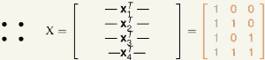
    - x4 = x2 + x3 - x1 , linear dependency , 会限制我们产生dichotomy 的组合
 - d-D General Case 
    - 对 D+1 方阵加入任意一笔 资料 x<sub>d+2</sub> , 产生的 D+1 x  D+2 矩阵， 行比列多，行 必然 linear dependency. 

---

<h2 id="a7ab380b76ef972f810d737e226f4fe6"></h2>


## Physical Intuition of VC Dimension

<h2 id="364130468e37b396a03b78270e87774b"></h2>


### Degrees of Freedom
 
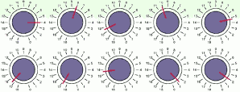


 - hypothesis parameters w = ( w₀,w₁,...,w<sub>d</sub> ) :
    - **creates degrees of freedom**
 - hypothesis quantity M = |H| :
    - 'analog' degrees of freedom
    - 旋钮可以指向任意可能的方向
 - hypothesis 'power' d<sub>vc</sub> = d+1:
    - **effective 'binary' degrees of freedom**
 - VC Dimension的物理意義，大致上就是我的hypothesis set ,在我要做二元分類的狀況下，到底有多少的自由度？
    - 衡量 這個自由度，也就告訴我們這個hypothesis set到底能夠做到多少事情？做到什麼事情？ 產生多少的的dichotomy. 這個hypothesis set 强不强,有多强?
    - w 的长度，就是我们拥有的旋钮个数

<h2 id="c30d7a9f1110a7115386a1a1449444ff"></h2>


### Two Old Friends

 - Positive Rays ( d<sub>vc</sub>=1 ) 
    - 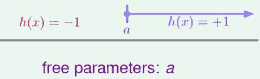
    - 只有一个可调节的 按钮
 - Positive Intervals ( d<sub>vc</sub>=2 )
    - 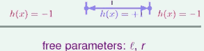
    - 有 2个可调节 按钮

<h2 id="668bae56a418c6c053a975bbc41bef59"></h2>


### M and d<sub>vc</sub>

 - copied from Lecture 5
    1. can we make sure that E<sub>out</sub>(g) is close enoughto E<sub>in</sub>(g)?
    2. can we make E<sub>in</sub>(g) small enough 

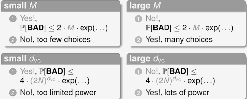

 - using the right d<sub>vc</sub> ( or H ) is important


<h2 id="4fa217a4f25efe58ca38efc2921a9ece"></h2>


## Interpreting VC Dimension 

<h2 id="cf1207c2cd37bca9c19baefe3be5f449"></h2>


### VC Bound Rephrase:  Penalty for Model Complexity

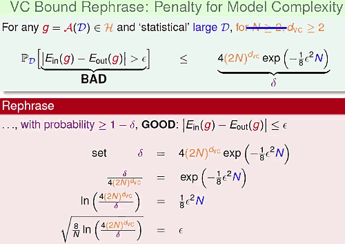

 - 这个式子的意义是什么？
    - 有很高的機會 Ein跟Eout的差別會被限制在 這個根號表达式里面, 也就是說我們現在描述的是好事情發
 - Eout 会被限制在 两个部分中间，在统计上，很像  confidence interval -- 信赖区间
    - 通常，我们会比较在意， 右边这部分
    - 
    - √... :  penalty for **model complexity**
        - 我们 hypothesis set 今天到底有多 powerful , 但是 我在 generalization的时候要付付出的代价就是这么多
        - 表示: Ω( N, H, δ ) 
            - N: 有多少个点
            - H: 你的VC dimension
            - δ: 你觉得你有多幸运

<h2 id="fd5261ae2542df593b9ab1967d1212b7"></h2>


### THE VC Message

 - with **a high probability** ,
    - 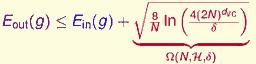

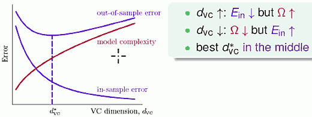

 - 把 Ein 做得更低，就需要一个强大的 hypothesis set, 但是这要付出 很大的 model complexity 的代价，不见得是最好的选择。

<h2 id="2103d3a1527ad166beedae934932a08e"></h2>


### VC Bound Rephrase : Sample Complexity

 - 樣本的複雜度或實際上就是資料量的複雜度。 
    - 像你老板開出了一些規格，我希望你的Ein跟Eout差最多0.1， 然後呢我希望壞事情發生的機會最多最多就10%，也就是說我們 90%的時候相信好事情會發生。 然後再來我給你一個learning model， 假設它VC Dimension是3，例如說2D的perceptron，
    - 麼你老板就問了，你到底要多少的資料才夠？ 
 - ε = 0.1 , δ = 0.1 (90% good thing)  , d<sub>vc</sub> = 3 , want 4(2N)<sup>d<sub>vc</sub></sup>· exp( -1/8·ε²·N ) ≤ δ 
 - Sample complexity:
    - **need N ≈ 10000 · d<sub>vc</sub> in theory**.
    - practical rule of thumb:   **N ≈ 10 · d<sub>vc</sub>  often enough !**
 - 所以 VC bound 其实 非常宽松的. why ?
    - Hoeffding for unknown E<sub>out</sub> :   **any distribution, any target**
    - m<sub>H</sub>(N)  instead of |H(X₁,...,X<sub>N</sub>)|   :  **'any' data** 
        - 成长函数
    - N<sup>d<sub>vc</sub></sup> instead of m<sub>H</sub>(N)  :   **'any' H of same d<sub>vc</sub>** 
        - 上限的上限
    - union bound on worst cases:   **any choice made by A**

<h2 id="290612199861c31d1036b185b4e69b75"></h2>


### Summary

 - VC Bound 是機器學習裡面最重要的一個理論工具。 
 - VC Dimension 是最大的 non-break point。  在Perceptrons 上，它恰好就是 d + 1，就是我的 Perceptrons 裡面到底有多少個維度。 
 - 物理意義上，VC Dimension 告訴我們說，哎我們的 這個 Hypothesis Set 到底有多少的自由度，大概就是啊 有多少的自由的這個旋鈕
 - VC Dimension 以用來看看我們的 Model， 我們的 Hypothesis Set 到底有多複雜，然後我們能夠用它來決定，我們大概需要多少的 資料才夠。 

---

<h2 id="6d87d0270ecffd6ed877bf64cf997573"></h2>


# Week 8  Noise and Error

<h2 id="a3f810ce646f0936df658a4d30a15b6d"></h2>


## Noise and Probabilistic Target

 - 如果我們的hypothesis set的VC Dimension是有限的，然後我們有足夠多的資料， 我們的演算法又能夠找到一個hypothesis它的Ein很低的話，那麽我們就大概 學到了東西
 - 不过，我們原來的VC Bound，在推導的過程中， 我們有一些假設，我們怎麽樣放寬這些假設，讓我們對這個VC Bound的VC Dimension的了解， 可以放寬到更多不同的問題上面。
 - 如果我们的资料中 加上Noise， 對我們之前整個理論的推導會不會有影響呢？

---

 - Target Distribution P(y|x)
    - characterizes behavior of "**mini-target**" on one **x** 

 - can be viewed as 'ideal mini-target' + noise , e.g.
    - P('o'|x)=0.7 , P('×'|x) = 0.3
    - ideal mini-target f(x) = 'o'
    - 'flipping noise level' = 0.3
 - deterministic target *f* : **special case of target distribution**
    - P(y|x) = 1 ,  if y = f(x)
    - P(y|x) = 0 ,  if y ≠ f(x)
 - goal of learning
    - predict **ideal mini-target (w.r.t P(y|x))** on *often-seen inputes(w.r.t P(x))*.
    - 在常常sample到的资料里面，要预测的好，这就是 ML要做到的事情。


<h2 id="d2d99ba3e6ff66dfef2164352b2c98a1"></h2>


## Error Measure

- naturally considered
    - out-of-sample: averaged over unknown x
    - pointwise: evaluated on one x
    - classification: [ prediction ≠ target ]
        - often also called ‘0/1 error’

<h2 id="9a0ea46a375f6caa83eb7371460f252e"></h2>


### Pointwise Error Measure

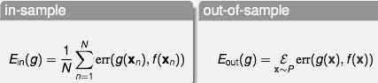

<h2 id="6c2d0a3129771ec5553a0a7b40c04800"></h2>


### Two Important Pointwise Error Measures

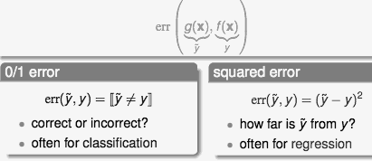

<h2 id="4800505041049669fa7b042ae638b020"></h2>


### Ideal Mini-Target

- interplay between noise and error:
    - P(y|x) and err define ideal mini-target f(x)

- `P(y = 1|x) = 0.2, P(y = 2|x) = 0.7, P(y = 3|x) = 0.1`

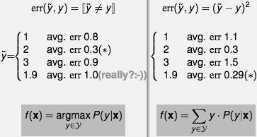


<h2 id="2187b661cffc7f0490d1f364850ab22a"></h2>


## Algorithmic Error Measure


<h2 id="46b76063f10f6397dfd67504c091971d"></h2>


### Choice of Error Measure

- Fingerprint Verification : f = 
    - +1, you
    - -1, intruder
- two types of error: *false accept* and **false reject**

 · | g +1  | g -1 
--- | --- | ---
f +1 | no error | **false reject**
f -1 | *false accept* | no error

- 0/1 error penalizes both types equally


- supermarket: fingerprint for discount
    - **false reject: very unhappy customer, lose future business**
    - *false accept: give away a minor discount, intruder left fingerprint :-)*


 cost matrix | g +1  | g -1 
--- | --- | ---
f +1 | 0 |  **10**
f -1 | *1*| 0

- CIA: fingerprint for entrance
    - *false accept: very serious consequences!*
    - **false reject: unhappy employee, but so what? :-)**

 cost matrix  | g +1  | g -1 
--- | --- | ---
f +1 | 0 |  **1**
f -1 | *1000*| 0

<h2 id="df794cf0b049355a25a3dc69dacf670b"></h2>


### Take-home Message for Now

- **err is application/user-dependent**
- Algorithmic Error Measures err'
    - 如果用户能说出他们想要什么，最好， 如果不能的话:
- 1. plausible:  我们自己设计一个可以说服我们自己的算法
    - 0/1: minimum ‘flipping noise’ --NP-hard to optimize, remember? :-)
    - squared: minimum Gaussian noise
-2. 或 设计一个容易一点的算法     easy to optimize for A
    - closed-form solution
    - convex objective function


<h2 id="77f01330c84d591c46ceb54c844f4fbe"></h2>


## Weighted Classification

- CIA Cost (Error, Loss, . . .) Matrix

 · | g +1  | g -1 
--- | --- | ---
f +1 | 0 |  **1**
f -1 | *1000*| 0

- weighted classification:
    - different ‘weight’ for different (x, y)

<h2 id="aae4803feb7519588dfdfd0080792d30"></h2>


### Minimizing E<sub>in</sub> for Weighted Classification

- Naïve Thoughts
    - PLA: doesn’t matter if linear separable. :-)
    - pocket: modify pocket-replacement rule
        - pocket: some guarantee on E<sub>in</sub><sup>0/1</sup>
        - modified pocket: similar guarantee on E<sub>in</sub><sup>W</sup> ?

<h2 id="62efbe469e781542f448dfebe1e436d8"></h2>


### Systematic Route

- 通过复制相关资料，转化W 成等价的 0/1问题

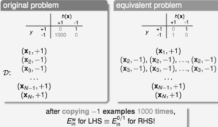

<h2 id="55d55c54777e3438c85343abfae313ac"></h2>


### Weighted Pocket Algorithm

- using ‘virtual copying’, weighted pocket algorithm include:
    - weighted PLA:
        - randomly check −1 example mistakes with **1000** times more probability (for CIA cost)
    - weighted pocket replacement:

- systematic route (called ‘reduction’): **can be applied to many other algorithms!**


