...menustart

 - [概率](#e491d9114c529232c5c723a920c27e7b)
     - [1.1 概率概论](#a752ece6fc7833551a512a6cdd45e5fe)
     - [1.2 集合论](#7b06f2a4a010bb35b04644cb90506e85)
     - [1.3 概率名词](#6f98970907730b499f70f93b88187ae8)
     - [2.1 机率公理性质](#1791981fbd6d2be1bbcedd1672f71d12)
         - [公理 (Axioms)](#0eb851bd8eef542176b8a7477d596643)
         - [公理衍生之机率性质](#08a117cd633d08d7d1633f3d7d2a3ad8)
     - [2.2 条件概率](#345aa7b734d65d2c64420863415c5b6d)
         - [条件概率性质:](#df9e3a8f1d61837f46c9cf320edad23a)
         - [Total Probability 定理](#77936c85f4082eb33cb0e791170d4509)
         - [Bayes’ Rule](#3852a2c669ee8053cd353f64abaca420)
     - [Quiz](#ab458f4b361834dd802e4f40d31b5ebc)
         - [多变量 条件概率](#ce3f5ddfc87213b6c0a68ec61213cc7d)
     - [3.1 机率的独立性 (Independence)](#49557f0872191469bd45991c842215b7)
         - [如何判断事件之间是否机率上相互独立](#065ef7efc4147a4194834ac4b5e90497)
         - [多事件之独立](#368759f08c60ed160f1c26fc4aadeccf)
     - [3.2 图解繁复机率](#8c0c921a01d760ad8fd52d596de7ad36)
     - [3-3: 数数算机率](#b8a639c4111775b66f390f44a870c2a0)
         - [数数基本原则 (Fundamental Principle of Counting)](#f562467cbc235ff2b25f9a075f9cb841)
         - [多项组合 (Multinomial)](#27bdeab0ba289a4ad6cd7a5d3eb4e204)
         - [数数如何应用在算机率上](#587045c58639efa8ee1a5a3b582c6112)
         - [N球放M盒问题](#0760fa0f6cf4fe4a2eb599fb87be9867)
         - [Quiz:](#db021f4670ba22ce77ef0acb0aba7ba0)
     - [4.1 随机变数 (RANDOM VARIABLE)](#a4c3bd594c5ea4f3fc9fcce3586fbf18)
         - [探究它的本质!](#a33ac1d92bc31a31da5665a97aadb111)
         - [随机变数的种类](#e644c0d51064d3032fe3d27919ffe3da)
         - [神马叫可数?神马叫不可数?](#5bf91f651f94a7d5ba4a11ac547d51d6)
         - [随机变量的函数?](#1665de2424d65db6d533386753911167)
     - [4.2 累积分布函数 CDF (CUMULATIVE DISTRIBUTION FUNCTION)](#d6fd0c71fd9be392edd5a91921b0eaf3)
         - [CDF 有什么用?](#c3d3b89aedf13c4a6de6f558a6a0cfa9)
         - [离散随机变数的 CDF 长怎样?](#917493f1d72a878df54e59714b677430)
         - [连续随机变数的 CDF 长怎样?](#7f7cd8bcf7af60bb124933e0f7db3150)
         - [CDF 的性质](#d3f28a5c19885b5e4ef1cb86d56b356b)
     - [4.3 机率质量函数 PMF (PROBABILITY MASS FUNCTION)](#df629b43f1e17bdd8b59ff70feb570a8)
         - [PMF 跟 CDF 的关系?](#a8699842209b391b17b7623a4c1b85d8)
         - [机率分布 (Probability Distribution)](#5a70965e6e318af45220c5484c2b8dc4)
     - [4.4 离散机率分布 I (DISCRETE PROBABILITY DISTRIBUTIONS)](#68e8045f19a785d2e1b77ac7870d2076)
         - [Bernoulli 机率分布](#ed43ca1c9bb0671f81bb3bdeaf8c6095)
         - [Binomial 机率分布](#e0dc24e9ac7e53085bd7bc2a2775917e)
         - [Uniform 机率分布](#f7bf1cb803a0ab0539a6dc3ed526dd4f)
         - [Geometric 机率分布](#7903bb94dad83aeea3bf8559e6cdd143)
         - [Pascal 机率分布](#f7b44a579af87c25b4b1cf0b98602a56)
         - [Poisson 机率分布](#66e278878307932e688a55d600961fdf)

...menuend


<h2 id="e491d9114c529232c5c723a920c27e7b"></h2>


# 概率

<h2 id="a752ece6fc7833551a512a6cdd45e5fe"></h2>


## 1.1 概率概论

概率和统计的差异

 - 概率
    - *概率模型已知*，要学会怎么算某些事件的概率
    - Ex: 已知一颗骰子为 ***公平骰***， 看到偶数的概率是多少?  1/2
 - 统计
    - *概率模型未知*， 要学会 怎么从大量的实验结果中去建立概率模型
    - Ex: 不知一骰是否灌铅，欲知各点出现的 概率模型?


<h2 id="7b06f2a4a010bb35b04644cb90506e85"></h2>


## 1.2 集合论 

 - 学生上课不规矩」的机率 = 0. 1
 - P(学生上课不规矩) = 0. 1
 - P是概率函数, 概率函数的自变量是：事件，而事件，是一种集合

annotation:

 - 补集: A<sup>c</sup>

 - 互斥(Mutually Exclusive): 若一群集合 X₁,X₂,...,X<sub>n</sub>中任选两个集合 Xᵢ,Xⱼ都不想交，则我们称这群集合 X₁,X₂,...,X<sub>n</sub> 互斥.

De Morgan’s Law：

 - (AUB)<sup>c</sup> = A<sup>c</sup> ∩  B<sup>c</sup> 

 - 证明：在数学上，要证明两个集合是同一个集合的独门心法是：  你中有我，我中有你.

 - 重要应用:
    -    (AUB)<sup>c</sup> = A<sup>c</sup> ∩  B<sup>c</sup>    
    - => P( (AUB)<sup>c</sup>  ) = P( A<sup>c</sup> ∩  B<sup>c</sup>  )
    - => 1 - P(AUB) = P( A<sup>c</sup> ∩  B<sup>c</sup>  )
    - 集合变补，符号变反，概率 求补

<h2 id="6f98970907730b499f70f93b88187ae8"></h2>


## 1.3 概率名词

 - 实验 (Experiment)
    - 一个机率「实验」包含了： 步骤 (procedures)、模型 (model)、观察(observations)
    - Ex: 丢两公平骰
        - 步骤: 「伸手取起桌上二骰，紧握后，手微微开口后向内吹口气。 之后默祷，再将骰丢入碗中，直至停止为止。」
        - 模型：(1, 1)、(1, 2), … ,(6, 6) 等发生机会均等
        - 观察：每个骰子的点数 (6, 6)
 - 结果(Outcome)
    - 是实验中可能的结果
 - 样本空间(Sample Space)
    - 机率实验所有 可能的结果的集合，通常用 S 来表示
    - Ex: 连丢三次铜板，记录正反面结果
        - S = { HHH, HHT, HTH, HTT, THH, THT, TTH, TTT }
    - Ex: 幸运之轮转一次
        - S = [0,1)
    - Ex:幸运之轮转两次
        - S = [0,1) x [0,1) (2维)
 - 事件 (Event)
    - 「事件」指的是对于实验结果的某种叙述
        - Ex: 骰子出来的结果是偶数
    - 机率就是在讲实验结果符合某事件叙述的机会多大
    - 在数学上，「事件」可以看成是「结果」的集合，亦即是 「样本空间」 的子集。
        - Ex:台大生的上课出席状况
            -「结果」有哪几种：准时、迟到、旷课
            - 事件1：有出席；E₁={准时、迟到} 
            - 事件2：没规矩；E₂={迟到、旷课}
            - 究竟可能会有多少种事件呢? 2ⁿ
            - { {}, {准时} , {迟到} , {旷课} , {准时, 迟到} , {迟到, 旷课} , {准时, 旷课} , {准时, 迟到, 旷课} }
 - 事件空间 (Event Space)
    - 「事件空间」是包含所有事件的集合
    - set of sets
    - 若「样本空间」s = { O₁,O₂,...,O<sub>n</sub>} 有 n 个「结果」, 「事件空间」大小为  2ⁿ 
    - 机率是一个函数，其自变量是：事件
    - 所以机率可以看成是一个mapping 
        -  机率函数是从「事件空间」映射到 [0,1]区间, P:「事件空间」→ [0,1]
        - 它是事件的函数 (你给一个事件，它吐回一个数字给你)


<h2 id="1791981fbd6d2be1bbcedd1672f71d12"></h2>


## 2.1 机率公理性质

<h2 id="0eb851bd8eef542176b8a7477d596643"></h2>


### 公理 (Axioms)

 1. `P(A) ≥ 0`
 2. `P(S) = 1`
 3. 事件 A₁,A₂, ... 互斥 => `P(A₁ ∪ A₂ ∪ ...) = P(A₁) + P(A₂) + ...`
    - 公理 3 搭起了集合运算与机率运算的桥梁!
    - 看到 集合，互斥 就应该想到公理3

<h2 id="08a117cd633d08d7d1633f3d7d2a3ad8"></h2>


### 公理衍生之机率性质

Ex: 从一副 52 张扑克牌抽中一张，结果 为 Ace 之机率为何?

Ace = {黑桃A,草花A,红心A,方块A}

抽中各色A的事件 {黑桃A}, {草花A}, {红心A},{方块A}  互斥，根据公理3，得

P(Ace) = P({黑桃A}) + P({草花A}) + P({红心A}) + P({方块A}) = 1/52 + 1/52 + 1/52 + 1/52 = 1/13

---

 - 若 E = {o₁,o₂,...,o<sub>n</sub>} , oᵢ 为单个结果， 则
    - P(E) = P({o₁}) + P({o₂}) + ... + P({o<sub>n</sub>)}
 - 证明: 
    - E = {o₁} ∪ {o₂} ∪ ... ∪ {o<sub>n</sub>)}  
        - 一个事件 可以拆为 它的各个单独结果的事件的合集
    - 因 {o₁} , {o₂} , ... , {o<sub>n</sub>)} 互斥
    - 套用公理3 得证

---

 - P(∅) = 0 
 - P(A) = 1 - P(A<sup>c</sub>)

---

 - P(A) = P(A-B) + P(A∩B)
    - 一个事件的概率，可以表示为 它 与另一个事件的差集 和 交集的 概率之和
 - 证明：
    - 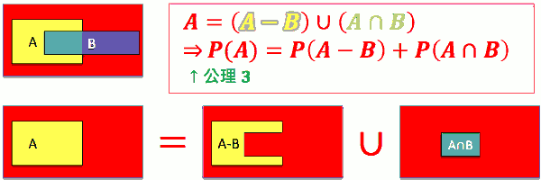

---

 - P(A ∪ B) = P(A) + P(B) - P(A∩B) 
    - 两个事件并集的概率，可以用 集合各自的概率 和 它们交集的 概率来表示
 - 证明
    - 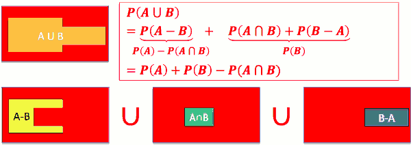
 - Ex: 在大陆随便碰上一个人，此人爱甜豆花或爱咸豆花 机率为何? 
    - P(爱甜 ∪ 爱咸) = P(爱甜) + P(爱咸) − P(爱甜 ∩ 爱咸) = ⋯
     
---

 - 切面包定理: 
    - 若C₁,C₂,...,C<sub>n</sub> 互斥，且 C₁ ∪ C₂ ∪ ... ∪ C<sub>n</sub> = S , 则
    - 对任何事件 A: P(A) = P(A∩C₁) + P(A∩C₂) + ... + P(A ∩ C<sub>n</sub>)
 - 证明
    - ![][1]
 - Ex: 阿宅心仪某可爱女店员。她的笑容打开了他封 闭的心。阿宅注意到她笑容会受生意的影响，于是 每天忠实记录该店生意与她有无对他笑。店生意有 满、普、惨三态，而她有笑、怒二态。根据记录:
    - 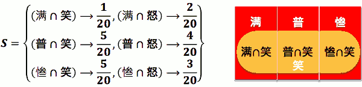
    - P(笑) = 1/20 + 5/20 + 5/20 = 11/20

---

 - 若 A ⊂ B , 则 P(A) ≤ P(B)

---

 - Boole's 不等式
    - 对任意 n 个事件 A₁ , A₂ , ... , A<sub>n</sub> 而言, 没有互斥要求
        - P(∪ⁿ<sub>i=1</sub> Aᵢ ) ≤ Σⁿ<sub>i=1</sub>P(Aᵢ ) 

---

 - Bonferroni's 不等式
    - 对任意n个事件A₁ , A₂ , ... , A<sub>n</sub> 而言, 没有互斥要求
        - P(∩ⁿ<sub>i=1</sub> Aᵢ ) ≥  1-Σⁿ<sub>i=1</sub>P(Aᵢ<sup>c</sup> )

---

<h2 id="345aa7b734d65d2c64420863415c5b6d"></h2>


## 2.2 条件概率

 - 条件机率的表示法 P(X|Y)
    - X：所关心之事件
    - Y ：条件 观察到的,已发生的事件

 - P( B 为正解｜卷矫漏曲) = ?
    - 未偷看时，正确答案未知。样本空间为：S = {A, B, C, D}
    - 卷矫漏曲后，新的样本空间变为：S′ = {B, D}
    - 条件概率的样本空间 会发生变化 
 - 卷矫漏之条件发生后, 这世界 变了，有了新的天地。不符合卷矫漏条件 的 outcome 都不可能发生了。
    - P( A 为正解｜卷矫漏曲) = P( C 为正解｜卷矫漏曲) = 0
    - 延伸：若某实验结果 oᵢ 与某条件 Y 不相交，则 P(oᵢ|Y) = 0 
 - 至于卷矫漏曲之条件事件发生后， 符合卷矫漏条件事件的实验结果的机率呢？
    - 不管卷矫漏发生否，「B为正解」与「D为正解」的机率比例应该一样，故：
        - P( B 为正解｜卷矫漏曲)：P( D 为正解｜卷矫漏曲) = P( B 为正解)：P( D 为正解)
    - 卷矫漏后只有可能出现「B 为正解」或「D 为正解」，故：
        - S′ ={ B, D }, P( B 为正解｜卷矫漏曲) + P( D 为正解｜卷矫漏曲 ) = 1
    - 根据上述二式我们得到
        - P( B 为正解｜卷矫漏曲 ) = `P( B 为正解)` / `( P( B 为正解 ) + P( D 为正解) )` = `P( B 为正解) / P(卷矫漏曲)`
 - 延伸：若某条件事件 Y 包含数个实验结果：Y = { {o₁,o₂,...,o<sub>n</sub>} }
    - **P(oᵢ|Y) = P(oᵢ)/( P(o₁)+P(o₂)+ ... + P(o<sub>n</sub>) ) = P(oᵢ)/P(Y)**
    - Ex: 考虑某事件 X = {o₁,o₂,q₁,q₂} , 已知条件事件 Y = {o₁,o₂,o₃} 发生了，则
        - `P(X|Y) = P(o₁|Y) + P(o₂|Y) = P(o₁)/P(Y) + P(o₂)/P(Y) = P({o₁,o₂})/P(Y)`
 - 终极延伸: 若已知某条件事件 Y 发生了，则对于任何事件 X ，条件机率如下
    - `P(X|Y) = P(X∩Y)/P(Y)` 

---

 - Ex: 小美同时与小明、小华、小园暗通款曲
    - Q: 小华赢得小美芳心机率为？  1/3
    - Q: 美生日，华夜携礼至美宅。美不在，华遂于门外候之。 子时忽闻美、明于里外争吵，遂匿而窥之。未料，突见美巴 明，甩门。明，泣不成声，而华窃喜。 请问在美巴明发生后小华赢得小美芳心机率为？
        - P( 华赢美心 | 美巴明 ) = 1/2 

---

<h2 id="df9e3a8f1d61837f46c9cf320edad23a"></h2>


### 条件概率性质:

 - 对任何事件 X 及任何条件事件 Y ，我们有：
    - 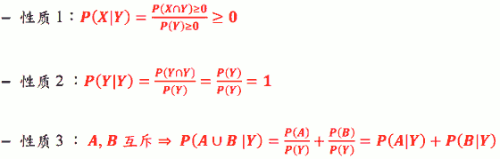

---

<h2 id="77936c85f4082eb33cb0e791170d4509"></h2>


### Total Probability 定理

 - 若C₁,C₂,...,C<sub>n</sub> 互斥,且 C₁ ∪ C₂ ∪ ... ∪ C<sub>n</sub> = S , 则对任意事件 A ，我们有：
    - **P(A) = P(A|C₁)|P(C₁) + P(A|C₂)|P(C₂) + ... + P(A|C<sub>n</sub>)|P(C<sub>n</sub>)**
 - 其实就是切面包定理的 条件概率版本
    - ![][1]
    - Proof: 切面包定理 => P(A) = Σⁿ<sub>i=1</sub> P(A∩Cᵢ) = Σⁿ<sub>i=1</sub> P(A|Cᵢ)·P(Cᵢ) 
 - Ex: 阿宅 vs. 可爱店员：店员对阿宅笑否， 受店的生意影响很大。已知 
    - P(满)=1/4, P(普)=1/4, P(惨)=1/2 ; P(笑｜满)=1/6, P(笑｜普)=2/6, P(笑｜惨)=3/6; 问 P(笑) = ？
    - P(笑) = Σ³<sub>i=1</sub>P(A|Cᵢ)·P(Cᵢ) = 1/6·1/4 + 2/6·1/4 + 3/6·1/2 = 9/24
    

<h2 id="3852a2c669ee8053cd353f64abaca420"></h2>


### Bayes’ Rule

 - 若C₁,C₂,...,C<sub>n</sub> 互斥,且 C₁ ∪ C₂ ∪ ... ∪ C<sub>n</sub> = S , 则对任意事件 A ，我们有：
    - **P(Cⱼ|A) = P(A|Cⱼ)P(Cⱼ) / Σⁿ<sub>i=1</sub> P(A|Cⱼ)·P(Cⱼ)**
 - Proof:
    - P(Cⱼ|A) = 
 - Bayes' Rule 用在很多时候，我们关心的事件(A) 根条件事件C 互换位置。
    - 其实就是全概率定理 和  条件概率的 联合使用
 - Ex: 一日，老板见可爱店员笑， 请问在此情况下，当日生意满座之机率为何？
    - P(满|笑) = P(满∩笑)/P(笑) = P(笑|满)·P(满) / (9/24) = 1/6·1/4 / (9/24) = 1/9


<h2 id="ab458f4b361834dd802e4f40d31b5ebc"></h2>


## Quiz

小速家裡到學校途中會經過5個有紅綠燈，小速小學五年的經驗來統計，小速每個紅綠燈會碰到紅燈而得停下等待的機率是0.4，碰到綠燈的可以直接通過馬路的機率是0.6。有一天小速賴床，要出門上學的時候已經只剩5分鐘就要遲到了，按照小速的經驗，如果他可以遇到少於2個紅燈(不包含)，他就可以趕上，否則就會遲到。假設每個紅綠燈為獨立的，請評估小速將會趕上學校上課的機率是多少?

0.34


```
作为一个物理学家，抱持著实验精神是很重要的，著名的量子物理学家薛丁格 
似乎可以做为这句话的实证。在一本据说是他实验日记的笔记本中，记载了他 
的猫咪与他一起做实验的时光 : 
8月 1日 : 
…我准备了九个箱子，里面放置了放射性元素的毒气机 
关……………………… …总而言之， 每次实验在九个箱子中各放 
一只猫，他们死亡的机率分别为10%,20%...到90% ，现在我把他 
们排成九宫格，接下来几天，我要来用这些猫箱开始进行我的实 
验 ，首先先用编号1~9的猫开始做实验 … 
8月 7日 : 
…我打开了其中五个猫箱，发现 301,304,305 死了，302,307 
活著，接下来来计算下一个打开的猫箱是活猫的机率 p… 
8月 12日 : …我打开了其中四个猫箱，这次724,725 死了，721,723活 
著 ，让我来推算一下再打开三个猫箱，里面死两只活一只的机率 
q是多少… 
…… 
今天是我生日，全家度过了愉快的一天，明天也要抱持著愉 
快的心情做实验。 
```

简而言之，现在有 9个猫箱，其中猫死亡的机率 分别是 0.1~0. 9

p为在确认猫 3 死2活的情况下，打开下个猫箱看到活猫的机率 q为在确认猫 2 死2活的情况下，再打开 3个猫箱，看到猫 2 死1活的机率 
试问， q除以 p的值是多少 ?


0.75.  思路：每个箱子猫死亡事件独立， 死亡期望值为0.5.

---

條件機率的一大應用就是在醫學疾病檢驗的判斷，假設有一疾病只要病患確診，這病患三個月內的死亡率將會是90%，但是人群中只有1%的人確定患有此疾病(Disease)。而如今開發出一套檢驗方式可以針對此疾病作檢驗，根據檢驗結果是陽性(Positive)或是陰性(Negative)以判斷是否染上此疾病，陽性就是出現罹患此疾病會有的現象，陰性則反之。但是這套檢驗方法卻不是百分之百完全準確的，因為有些環境或是其他疾病會讓健康的人(Health)檢驗也可能呈現陽性，假設這種狀況的機率是0.2%；而實際上有患此疾病(Disease)但是卻因為一些環境或是體質差異也有可能檢驗出陰性，假設這樣的機率是0.1%。某天小鄭擔心自己患上此疾病，於是前往醫院進行這種檢驗，結果檢驗結果為陽性，請幫忙小鄭分析，小鄭沒有染上此疾病(Health)的機率為何?

0.17

<h2 id="ce3f5ddfc87213b6c0a68ec61213cc7d"></h2>


### 多变量 条件概率

 - P(Y|X) = P(Y,X)/P(X)
 - P(Y|X₁,X₂) = P(Y,X₁,X₂) / P(X₁,X₂) = P(Y,X₁|X₂)·P(X₂) / P(X₁|X₂)·P(X₂) 
    - = P(Y,X₁|X₂) / P(X₁|X₂)
 - P(Y|X₁,X₂,...,X<sub>n</sub>) 
    - = 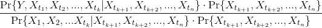


---

<h2 id="49557f0872191469bd45991c842215b7"></h2>


## 3.1 机率的独立性 (Independence)

 - 常见定义:若两事件A,B 之机率 满足 
    - `P(A∩B) = P(A)·P(B)`
    - 则 两事件称为机率上的独立事件
 - 常见定义:若两事件A,B 之机率 满足
    - P(A|B) = P(A)    # <=> P(A∩B)/P(B) = P(A) <=> P(A∩B) = P(A)·P(B)
    - 则 两事件称为机率上的独立事件
 - Ex: 已知某生秦始皇作业表现与机率 作业表现相互独立。若秦始皇作业未作机率 为 0.2，机率作业未作机率为 0.3。 问两科作业同时未作之机率为?
    - 0.2 \* 0.3 = 0.06


<h2 id="065ef7efc4147a4194834ac4b5e90497"></h2>


### 如何判断事件之间是否机率上相互独立

 - Ex: 已知某校生爱乱停车。水源阿伯拖车 时常有车主赶回求情。出现愤宅求情之机率为0.3。 一般而言被人求情阿伯会放行的机率为 0.2 。 水源阿伯，大公无私，天下皆知。 问某日阿伯拖某车时出现愤宅求情且车未放行的机率?
    - 出现愤宅求情 P = 0.3 , 车未放行 P = 1-0.2 = 0.8
    - 出现愤宅求情且车未放行 P = 0.3 * 0.8 = 0.24
 - Ex: 某古锥姊有时会在活大停车不当。被拖时若及时赶回求情，古锥姊常一手 摀嘴，一手指着车曰:「啊，那是我的车!」巧笑倩兮。
    - 若以 A 代表古锥姊实时赶回求情之事件，B 代表阿辈放回古锥姊车的事件。根据某愤宅多日观察古 锥姊行为:
    - P(古锥姊未能求情 且 车未放行) = 0.85, P(古锥姊未能求情 且 车放行) = 0.05
    - P(古锥姊及时求情 且 车未放行) = 0.01, P(古锥姊及时求情 且 车放行) = 0.09
    - 愤宅泪眼悲愤控诉阿伯:「你不公平!!!」。 问:水源阿伯清誉，岂容愤宅任意污蔑!愤宅悲愤有理否?吾人该否为其一掬同情之泪?
    - 解：
        - P(古锥姊求情) x P(车放行) =? P(古锥姊及时求情 且 车放行) ?
        - {古锥姊求情} = {古锥姊求情 且 车未放行} ⋃ {古锥姊求情 且 车放行} 
        - P(古锥姊求情) = 0.01 + 0.09 = 0.1 ; 前页曾述 P(车放行) = 0.2
        - P(古锥姊求情) \* P(车放行) = 0.1 \* 0.2 = 0.02 ≠ 0.09 不独立 ！！！
        - 实际上， P(车放行|古锥姊求情) = 0.09/0.1 = 0.9 !!!  
         
<h2 id="368759f08c60ed160f1c26fc4aadeccf"></h2>


### 多事件之独立

 - 若事件 A₁,A₂,...,A<sub>n</sub> 满足下列条件，则称此 n 事件独立(n>2):
    - 从中任选 m 事件 Aᵢ₁,Aᵢ₂,...,Aᵢ<sub>m</sub> 均满足
    - P(Aᵢ₁∩Aᵢ₂∩...∩Aᵢ<sub>m</sub>) = P(Aᵢ₁)P(Aᵢ₂)···P(Aᵢ<sub>m</sub>), m = 2,3,..., n.
    - 需要检查所有可能组合之间的独立.
    


<h2 id="8c0c921a01d760ad8fd52d596de7ad36"></h2>


## 3.2 图解繁复机率

 - 当碰到很复杂的机率问题时
    - 先观察这个问题的实验结构
    - 这实验是否能分解成数个子实验？
    - 若可以，则可以利用图解法！

 - 范例：兄弟情
    - 明、华兄弟情笃。故决定一人放弃追求小美以免伤情 谊。于罐中放入两白球、一黑球。游戏规则如下： 「猜拳决定谁先，之后轮流罐中取球；每次可取一至二球，直至有人抽 中黑球为止。抽中黑者退出追求。」
    - 已知猜拳输赢机率为 0. 5，每次明取球取一颗之机率为 0. 4，取两颗机 率为 0. 6 。每次华取球取一颗之机率为 0. 7，取两颗机率为 0. 3。
    - 问最后小明退出追求之机率为？


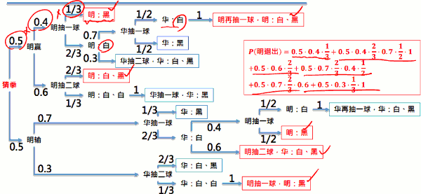


<h2 id="b8a639c4111775b66f390f44a870c2a0"></h2>


## 3-3: 数数算机率

 - 古典机率常假设每个实验结果 (outcome) 发生机率相同
 - 故计算某事件机率之问题，等同于计算此事件包含多 少实验结果 (outcome)。故计算器率等价于数数问题！

<h2 id="f562467cbc235ff2b25f9a075f9cb841"></h2>


### 数数基本原则 (Fundamental Principle of Counting)

 - 若某种实验有 n 种不同结果，而另一种 实验有 m 种不同结果。若操作此两实验将有n·m 种 不同结果。
 - Ex: 下午茶有 5 种甜点的选择， 10 种饮料的选择。
    - 共有多少种下午茶组合？ 5x10 = 50

---

 - 排列 (Permutation)
 - Ex: 小美周末两日惯购物。小美常自明华园 三兄弟找人接送。若两日司机不可重复，问有多少种结果？
    - 3x2 = 6
 - 若有 n 异物，从中依序取出 k 物 共有多少种结果？
    - n! / (n-k)!

--- 

 - 重复选取 (Choose with Replacements)
 - Ex: 小美周末两日惯购物。小美常自明华园 三兄弟找人接送。无耻小美竟敢不排除连续凹人两天， 问有多少种结果？
    - 3x3 = 9
 - 若有 n 异物，从中选取一物，每 次取完放回。依序选取 k 次，共有多少种 结果？ 
    - nᵏ

--- 
 
 - 组合 (Combination)
 - Ex: 小美爱玩跳棋。小美常自明华园三兄弟 找两人下棋。问有多少种对战组合？
    - 3x2 / 2 = 3 
 - 若有 n 异物，从中取出 k 物 共有多少种结果？
    - n! / ( (n-k)! · k! )


<h2 id="27bdeab0ba289a4ad6cd7a5d3eb4e204"></h2>


### 多项组合 (Multinomial)

 - Ex: 费雯兄惯于网络八卦版上发废文。第一楼推文常有四类
    - 你妈知道你在发废文吗
    - 见此唉滴必嘘
    - 在五楼…
    - 妈！我在这！

 - 问：费雯兄发文 10 次，一楼推文共有多少种组合？
    - 4¹⁰
 - 有多少组合会看到 4 次「你…」，3 次「见…」，2 次「在五楼…」，1 次「妈…」？
    - C₄¹⁰·C₃⁶·C₂³·C₁¹ = 10! / ( 4!·3!·2!·1! )

 - 若有 m 种异物，每次选物从中选一后放回，依序选 n 次。如此共有 mⁿ 种实验结果。其中在这 mⁿ 种 实验结果中，第 1 种异物出现 n₁次且第 2 种异物出现 n₂ 次且… 且第
 m 种异物出现 n<sub>m</sub> 次，这样的实验结果共有多少种？
    - n! / ( n₁!·n₂!···n<sub>m</sub>!)  <- multinomial coefficient


<h2 id="587045c58639efa8ee1a5a3b582c6112"></h2>


### 数数如何应用在算机率上

 - 若一事件包含数个实验结果 (outcome)，且每个实验结果发生的机率都一样
    - 先计算任一个实验结果 的机率
    - 再计算该事件共包含多少个实验结果
    - 两者相乘便得到该事件的机率！

 - 范例：费雯兄: 继前述费雯兄好发废文之例。若根据统计，费雯兄一楼推文不同 型态之出现机率为：
    - P(「你妈知道你在发废文吗」 ) = 0.4
    - P( 「见此唉滴必嘘」 ) = 0.2
    - P( 「在五楼…」 ) = 0.1
    - P( 「妈！我在这！」 ) = 0.5 
 - 问：若费雯兄发文 6 次，会在一楼推文看到 2 次「你…」， 2 次「见…」， 1 次「在五楼…」，1次「妈…」。这样的机率为？
    - P(你你见见五妈) = 0.4\*0.4\*02\*0.2\*0.1\*0.3 = 0.000192
    - P(2你,2见,1五,1妈) = 0.000192 \* 6!/ (2!2!1!1!) = 0.0346
    
 
<h2 id="0760fa0f6cf4fe4a2eb599fb87be9867"></h2>


### N球放M盒问题

 1. 球同，盒同，盒不可以为空
 2. 球同，盒同，盒可以为空
 3. 球同，盒不同，盒不可以为空
 4. 球同，盒不同，盒可以为空
 5. 球不同，盒同，盒不可以为空
 6. 球不同，盒同，盒可以为空
 7. 球不同，盒不同，盒不可以为空
 8. 球不同，盒不同，盒可以为空

--- 

 - 1 2 类情况，穷举法。
    - 例如7个相同球放入4个相同盒子，每盒至少一个（1类情况），则先4个盒子每个放1个，多余3个。只需要考虑这3个球的去处就OK，由于盒子相同，所以只需要凑数就OK，不必考虑位置，因此只有300，211，111三种。
    - 例如7个相同球放入4个相同盒子，可以空盒，则还是凑数，大的化小的，小的化更小的。 0007 0016 0025 0034 0115 0124 0133 0223 1114 1123 1222 = 11种。
 - 3 4 类情况，用插板法（隔板法）解决。
    - 3 的公式是把 N 个球排成一排（一种方法），它们中间有 N-1 个空。取 M-1 个板，放到空上，就把它们分成 M 部分，由于板不相邻，所以没有空盒。它的方法数有C(N-1, M-1)
    - 4 的公式在3的基础上升华出来的，为了避免空盒，先在每一个盒里假装放一个球，这样就有 N+M 个球，C(N+M-1, M-1)
 - 球不同的情况里，先来分析最特殊的8号：N球不同，M盒不同，允许空。每个球都有M种选择，N个球就有 Mᴺ 种分法。
 - 关于5 6 7 的情况 , 需要借助一个特殊的三角形
    - http://azaleasays.com/2011/12/16/combinatorics-n-balls-in-m-boxes
 
<h2 id="db021f4670ba22ce77ef0acb0aba7ba0"></h2>


### Quiz:

Q: 苏格拉底叫他到花园中走一趟，并在途中摘一朵最美丽的玫瑰花回来，只准摘一次，且不能回头走。但这座花园的道路是一条直线，也就是说每朵花一旦错过了就没有机会再看到。苏格拉底觉得柏拉图应该会因为害怕下一朵花可能更加漂亮而迟迟不敢摘取，最后两手空空而归。他便可以乘机对柏拉图讲述他对爱情的哲学理念。

但聪明的柏拉图自有他的打算，他其实偷偷知道这座花园总共只有八朵是玫瑰花而已，所以他用了一个策略来提高他拿到最美丽玫瑰花的几率：

“ 首先将沿路上最先看到的三朵玫瑰花都当成参考样品，无论如何不要摘它们。之后走下去再看到玫瑰，只要是比这最前面三朵漂亮的，就选择它，不再继续犹豫下去了。”

假如依照柏拉图的策略，你觉得他“拿到最美丽的玫瑰花”的几率是多少呢?

A: 花编号 1-8， 考虑 8在不同位置下， 采到最美玫瑰的概率： 1st:0 , 2nd:0, 3rd:0, 4th:1,  5th:3/4, 6th: 3/5 , 7th: 3/6 , 8th: 3/7

1 + 3.0/4 + 3.0/5 + 3.0/6 + 3.0/7 = 0.41

---

小智颱風天無聊自己玩紙牌遊戲，有四張牌，分別為1,2,3,4，每次洗牌後抽一張牌並且累加數字後丟棄此牌再繼續洗牌抽牌，直到累計的數字大於或等於5停止抽牌，這時候如果累加點數剛好是5就勝利(Win)，如果是超過五點就是失敗(Lose)。請問，小智勝利的機率是多少?

0.33.   注： 用图解法的时候，要把所有情况展开，不要展开到 acc >=5 就结束

--- 
小閔的棒球隊裡有23位選手，其中有5位專職投手，17位野手，假設這17位野手都很全能，除了投手這位置之外，其他8個守備位置都可以擔任，接著還有一位工具型的選手，可以當投手也可以當野手。一場棒球比賽的先發陣容必須是8位野手搭配一名投手，請問，小閔的球隊可以有幾種先發陣容組合?

243100。

 - 19448 * 5 + 24310 * 1 + 24310 * 5 = 243100
    - 24310 = C(17,8)
    - 19448 = C(18,8) -  C(17,8)

---

小可的媽媽買了5支一模一樣的筆回家，準備讓小可以及她的兩個姊姊自己領取，但是小可她們不一定要拿，也可以拿很多支，最後5支筆也不一定會分完，沒被拿走的筆會被媽媽放在客廳桌上。請問這5支筆會有幾種分法?

56

---

有一個非常糊塗的郵差，他手頭上有4封信要送給分別住在不同地方的A, B, C, D 四人，但是糊塗的郵差每到一個地址後，就會隨機選一封信放進信箱。請問，A, B, C, D 四個人都沒有收到自己的信的組合有多少種情況?

9   图解穷举？


---

<h2 id="a4c3bd594c5ea4f3fc9fcce3586fbf18"></h2>


## 4.1 随机变数 (RANDOM VARIABLE)

 - 考虑前面费雯兄的例子, 若根据统计，费雯兄一楼推文 不同型态只有4种, 若
    - P(「你妈知道你在发废文吗」 ) = 0. 4
    - P( 「见此唉滴必嘘」) = 0. 2
    - P( 「在五楼...」) = 0. 1
    - 推测 P( 「妈!我在这!」) 的概率
    - P(「妈!我在这!」 ) = 1 − P( 「你妈知道你在发废文吗」) − P( 「见此 唉滴必嘘」) − P( 「在五楼...」) = 0. 3 
 - 光写字就累翻了!!!
 - 若改为:
    - 「你妈知道你在发废文吗」:X = 0
    - 「见此唉滴必嘘」:X = 1
    - 「在五楼...」:X = 2
    - 「妈!我在这!」:X = 3
    - 根据统计:  P(X=0)=0.4;P(X=1)=0.2;P(X=2)=0.1;P(X=3)=0.3
        - P(X=3) = 1 - P(X=0) - P(X=1) - P(X=2)
    - 跟前面比起来，你觉得如何呢? 这...这...真是太清爽、太给力了

---

 - 随机变数 (Random Variable, R.V.) 这是一个用来把实验结果 (outcome) ***数字化*** 的表示方式
 - 目的是可以让机率的推导更数学、更简明
 - 前面例子中的 X 就是所谓的 ***随机变数***
 - 随机变数通常都是用 ***大写的英文字母*** 表示!

<h2 id="a33ac1d92bc31a31da5665a97aadb111"></h2>


### 探究它的本质!

 - 随机变量的本质是什么?
    - 本质是一个 ***函数***
    - 「你妈知道你在发废文吗」:X = 0  =>  X(「你妈知道你在发废文吗」 ) = 0
 - 随机变数 X 其实是一种函数，喂 X 吃一个 outcome ，就吐出一个对应的数字。数学上的表示法:
    - X: S → ℝ

<h2 id="e644c0d51064d3032fe3d27919ffe3da"></h2>


### 随机变数的种类

 - 离散随机变数 (Discrete R. V.)
    - Ex:宅vs.店员:X(微笑)=0,X(不笑)=1  => X = 0, X = 1
    - Ex:小明告白多少次才成功:X(0次)=0,X(1次)=1,X(2次)=2,...  => X = 0, X = 1, X = 2, ...
    - 离散 R.V. 的值是有限个，或是「可数的」无穷多个
 - 连续随机变数 (Continuous R. V.)
    - 幸运之轮: X 可以是 0 到 1 间内的任意数字
    - 连续 R.V. 的值是有无穷多个，而且是「不可数」的无穷多个


<h2 id="5bf91f651f94a7d5ba4a11ac547d51d6"></h2>


### 神马叫可数?神马叫不可数?

 - 重要性质:0 到 1 之间的所有数字的集合是不可数的!
 - 「正整数的集合」 跟 「正偶整数」的集合 相比，哪个集合里面东西比较多?  一样多
 - 「长度为一的线段上的点」跟「边长为一的正方形上的点」， 这两个集合，哪一个点的数量比较多?  一样多
 - 因为都可以找到一对一对应的方法。

<h2 id="1665de2424d65db6d533386753911167"></h2>


### 随机变量的函数?

 - 阿宅若看到店员微笑，就会点$200 的套餐。如果店员不笑，他就买 $15 的饮料。 请问阿宅的消费金额 W是随机变数吗?
    - 店员表情可以由随机变量 X 代表: X(微笑) = 0, X(不笑) = 1
    - W是 X 的函数:W(X(微笑)) = 200, W (X(不笑)) = 15
    - 所以 W也是喂 outcome 吐数字!因此 W也是一个随机变数!
    - 记住:随机变量的函数，也是一个随机变量喔!

---

<h2 id="d6fd0c71fd9be392edd5a91921b0eaf3"></h2>


## 4.2 累积分布函数 CDF (CUMULATIVE DISTRIBUTION FUNCTION)

 - 对任一个随机变数 X ，我们定义 其 CDF 为函数:
    - F<sub>X</sub>(x) = P(X ≤ x) 
    - 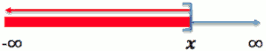
    - 其中 X 是随机变数
 - Ex 幸运之轮  F<sub>X</sub>(0.5) = P(X≤0.5) = 1/2
 
 
<h2 id="c3d3b89aedf13c4a6de6f558a6a0cfa9"></h2>


### CDF 有什么用?
 
 - 最有用的用途: 计算 X 落在某范围内的机率
    - P(3< X≤ 5 ) = P(X≤ 5) - P( X<= 3)
    - **= F<sub>X</sub>(5) - F<sub>X</sub>(3)**
    - 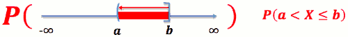
 - P( a < X ≤ b ) = F<sub>X</sub>(b) - F<sub>X</sub>(a)
 - P( a ≤ X ≤ b ) = F<sub>X</sub>(b) - F<sub>X</sub>(a) + P(X=a)

<h2 id="917493f1d72a878df54e59714b677430"></h2>


### 离散随机变数的 CDF 长怎样?

 - Ex:X为骰子的点数，故P(X=1) =P(X=2) =P(X=3) =P(X=4) =P(X=5) =P(X=6) =1/6
 - CDF: F<sub>X</sub>(x) = P(X ≤ x)
    - 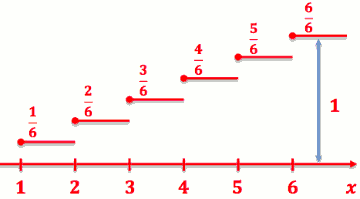
 - P( 3< X≤ 5 ) = F<sub>X</sub>(5) - F<sub>X</sub>(3) = 5/6 - 3/6 = 2/6
 - P( 3< X< 5 ) = P( 3< X≤ 5⁻ ) = F<sub>X</sub>(5⁻) - F<sub>X</sub>(3)  = F<sub>X</sub>(5) - P(X=5) - F<sub>X</sub>(3) = 1/6

<h2 id="7f7cd8bcf7af60bb124933e0f7db3150"></h2>


### 连续随机变数的 CDF 长怎样?

 - Ex: X 为幸运之轮所停下的数字，X ∈ [ 0,1 )    
    - CDF: F<sub>X</sub>(x) = P( X ≤ x )
    - 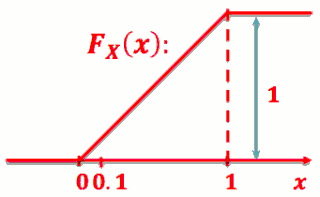
 - P( 0.3< X≤ 0.5 ) = F<sub>X</sub>(0.5) - F<sub>X</sub>(0.3) = 0.5 - 0.3 = 0.2
 - P( 0.3< X< 0.5 ) = F<sub>X</sub>(0.5⁻) - F<sub>X</sub>(0.3) = 0.5 - 0.3 = 0.2


<h2 id="d3f28a5c19885b5e4ef1cb86d56b356b"></h2>


### CDF 的性质

 - 离散随机变数之CDF:
    - F<sub>X</sub>(x⁺) = F<sub>X</sub>(x)
    - F<sub>X</sub>(x⁻) = F<sub>X</sub>(x) - P(X=x)
 - 连续随机变数之CDF:
    - F<sub>X</sub>(x⁺) = F<sub>X</sub>(x⁻)  = F<sub>X</sub>(x) 
 - 共同性质
    - F<sub>X</sub>(-∞) = P(X≤-∞) = 0
    - F<sub>X</sub>( ∞) = P(X≤ ∞) = 1  
    - 0 ≤ F<sub>X</sub>(x) ≤1
 
---

<h2 id="df629b43f1e17bdd8b59ff70feb570a8"></h2>


## 4.3 机率质量函数 PMF (PROBABILITY MASS FUNCTION)

 - 只有 离散随机变数 有 PMF
 - 对任一个整数值的 ***离散随机变数*** X , 我们定义其 PMF 为函数:
    - p<sub>X</sub>(x) = P(X=x)
    - p 大小写无所谓？
 - Ex: X 为公平骰子之点数
    - p<sub>X</sub>(3) = P(X=3) = 1/6

<h2 id="a8699842209b391b17b7623a4c1b85d8"></h2>


### PMF 跟 CDF 的关系?

 - PMF -> CDF
    - 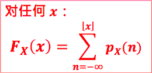
 - CDF -> PMF
    - P<sub>X</sub>(x) = F<sub>X</sub>(x⁺) - F<sub>X</sub>(x⁻)


<h2 id="5a70965e6e318af45220c5484c2b8dc4"></h2>


### 机率分布 (Probability Distribution)

 - 任何一个 PMF(或是之后介绍的 PDF)都称作是一种 ***机率分布*** (将总和为 1 的机率分布在点上之故)
    - 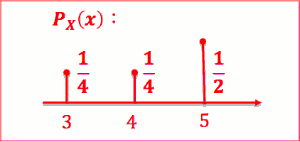

---

<h2 id="68e8045f19a785d2e1b77ac7870d2076"></h2>


## 4.4 离散机率分布 I (DISCRETE PROBABILITY DISTRIBUTIONS)
 
 - 观察一下
    - 丢掷铜板:非正面，即反面，正面机率为 0.5
    - 出门天气:非晴天，即雨天，晴天机率为 0.6
 - 1 次实验，2 种结果。 在意某结果发生否  Bernoulli 机率分布
    

<h2 id="ed43ca1c9bb0671f81bb3bdeaf8c6095"></h2>


### Bernoulli 机率分布

 - PMF: 若实验成功机率为 p , 作 1 次实验， X 表成功次数
 - CDF 见右图

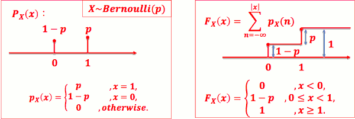

---

<h2 id="e0dc24e9ac7e53085bd7bc2a2775917e"></h2>


### Binomial 机率分布

 - 观察一下
     - 阿宅鼓起勇气搭讪 10 人，若每次搭讪成 功机率为 0.6，10 次成功 8 次的机率为?
     - 一周 5 天午餐在晓福买魔石汉堡，若每次制作超时机率为 0.9 5 天中有 3 天制作超时的机率为?
     - 一周有 3 系夜，在活大乱停车 3 次，若每次遭阿伯拖之机率 为 0.8，那这 3 次被拖 2 次之机率为?
 - 作 n 次实验，1 个机率，在意 n 次实验出 现某结果 k 次之机率 --> Binomial 机率分布
    
 - 若实验成功几率为 0.6， 做10次实验， X表示成功次数
    - 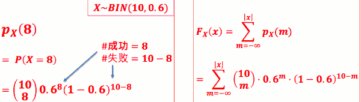
    - left is PMF, right is CDF
 - PMF: 若实验成功机率为 p, 作 n 次实验， X 表成功次数
    - 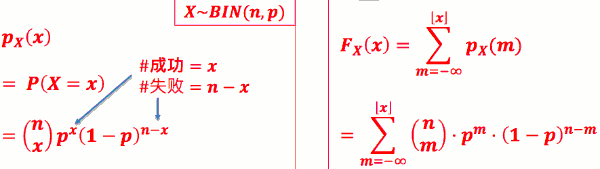

```python
import numpy as np
import matplotlib.pyplot as plt
x1 = np.random.binomial( 10, 0.6 , 100000 )
# If you want the sum of all bars to be equal 1, weight each bin by the total number of values:
weights = np.ones_like(x1)/float(len(x1))
plt.hist(x1, normed=False, weights=weights, facecolor='green', alpha=0.5,bins=100)
plt.show()
```

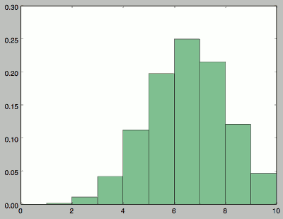


 - another method, use scipy

```python
import scipy, scipy.stats
x = scipy.linspace(0,10,11)
pmf = scipy.stats.binom.pmf(x,10,0.6)
import pylab
pylab.plot(x,pmf)
pylab.show()
```

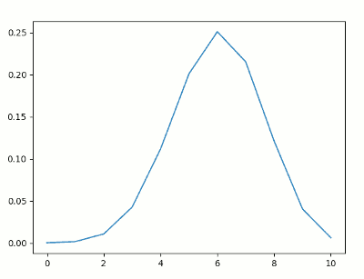


<h2 id="f7bf1cb803a0ab0539a6dc3ed526dd4f"></h2>


### Uniform 机率分布

 - 观察一下        
    - 丢公平骰:1 到 6 各点数出现机会均等
    - 混哥考试:作答 A, B, C, D 机会均等
    - 狡兔三窟:出现在窟 1、窟 2、窟 3 机会均等
 - 1 次实验，n 种结果，各结果机率均等。在意某结果发生否 -->  Uniform 机率分布
 - 如果 X 等于 3,4,...,7 的机率均等
    - 
 - 如果X等于a,a+1...,b 的机率均等
    - 


<h2 id="7903bb94dad83aeea3bf8559e6cdd143"></h2>


### Geometric 机率分布

 - 观察一下
    - 阿宅告白:成功机率为 0.3，不成功誓不休。 问到第 5 次才告白成功之机率?
    - 孙文革命:成功机率为 0.1，不成功誓不休。问到第 11 次才 成功之机率?
    - 六脉神剑:那纠缠狂妈宝废物段誉每次要打出六脉神剑，打 的出来的机率为 0. 1。他在 10 次才打出六脉神剑的机率?
 - 实验中出现某结果机率已知，重复操作实验至该结果出现为止。 在意某结果是在第几次实验才首次出现 --> Geometric 机率分布
 - 六脉神剑:那妈宝废物段誉每次要打 六脉神剑，打的出来的机率为 0.1。他在第 10 次 才打出六脉神剑的机率?
    - 败败败败败败败败败成 => 机率 = 0.9⁹ x 0.1
 - 六脉神剑:那妈宝废物段誉每次要打 六脉神剑，打的出来的机率为 p 。他在第 X 次 尝试才成功打出六脉神剑。 X = x 的机率?
    - 机率 = (1-p)<sup>x-1</sup> · p
 - 若实验成功机率为 p，尝 试到成功为止，作了 X 次尝试
    - 
 - 有失忆性！ 离散分布中唯一的失忆性分布

```python
import numpy as np
import matplotlib.pyplot as plt
x1 = np.random.geometric( 0.3 , 100000  )
weights = np.ones_like(x1)/float(len(x1))
plt.hist(x1, normed=False,weights=weights, facecolor='green', alpha=0.5,bins=100)
plt.title('p = 0.3')
plt.show()
```

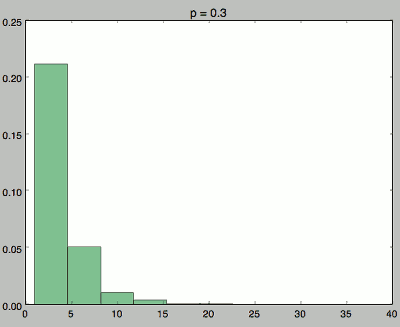


```python
import scipy, scipy.stats
x = scipy.linspace(0,10,11)
pmf = scipy.stats.geom.pmf(x, 0.3 )
import pylab
pylab.plot(x,pmf)
pylab.show()
```

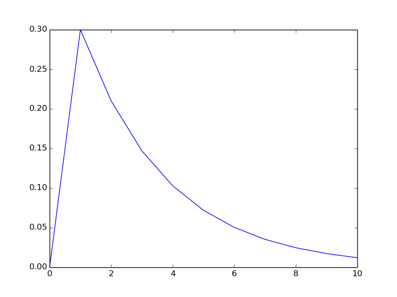


<h2 id="f7b44a579af87c25b4b1cf0b98602a56"></h2>


### Pascal 机率分布

 - 观察一下   
    - 自尊阿宅:阿宅邀约店员失败机率为 0.9， 若邀约失败达 4 次，阿宅便会自尊有损而放弃追求。问在阿 宅第 7 次邀约时决定放弃追求之机率?
    - 六脉神剑:妈宝废物段誉每次打成功 5 次六脉神剑便功力耗 尽。若每次打的出来的机率为 0. 1。请问他在第 9 次时刚好 功力耗尽的机率?
 - 实验中出现某结果机率已知，重复操作实验至该结果出现第 k 次 为止。在意到底在第几次实验才结束 --> Pascal 机率分布
 - 六脉神剑:那妈宝废物段誉每次要打 六脉神剑，打的出来的机率为 0.1。成功 5 次便功 力耗尽。请问他在第 9 次时刚好功力耗尽的机率?
    - 可能情况之一:败 成 败 成 败 成 成 败 成
    - 此情况机率 = 0.9⁴ x 0.1⁵
    - 刚好第9次才成功第5次的情况有几种?  C(8,4)·C(1,1) = C(8,4)
    - 所求机率 =  C(8,4) x 0.9⁴ x 0.1⁵ 
 - 六脉神剑:那妈宝废物段誉每次要打六脉神 剑，打的出来的机率为 p 。成功 k 次便功力耗尽。 他在第 X 次尝试才成功打出 k 次六脉神剑。 X = x 的机率?
    - C(x-1, k-1) x (1-p)<sup>x-k</sup> x pᵏ
 - 若实验成功机率为 p , 到第 k 次成功为止共作了 X 次
    - 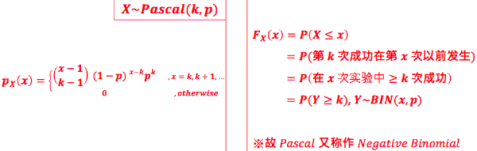

```python
import numpy as np
import matplotlib.pyplot as plt
x1 = np.random.negative_binomial( 5, 0.1 , 100000  )
weights = np.ones_like(x1)/float(len(x1))
plt.hist(x1, normed=False, weights=weights, facecolor='green', alpha=0.5,bins=500)
plt.title('k=5, p=0.1')
plt.show()
```

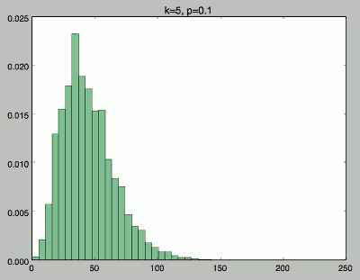


```python
import scipy, scipy.stats
x = scipy.linspace(0,100,101)
pmf = scipy.stats.nbinom.pmf(x,5,0.1)
import pylab
pylab.plot(x,pmf)
pylab.show()
```

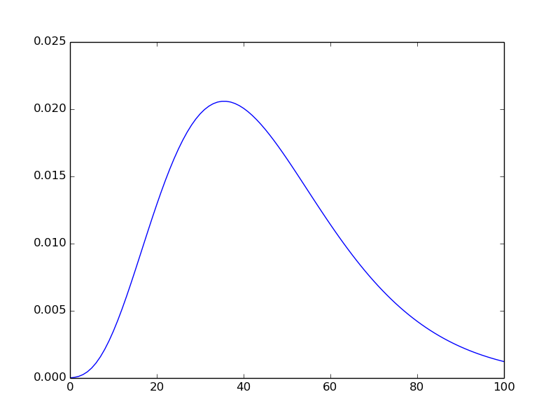

<h2 id="66e278878307932e688a55d600961fdf"></h2>


### Poisson 机率分布
 
 - 观察一下  
    - 转角夜宵:在晚上 平均每小时会有 10 人 来 跟转角哥买夜宵。 问摆摊 5 小时 有 60 人光顾之机率?
    - 费雯被嘘:费雯兄 po 文后， 平均每分钟会有 5 人嘘之 。 问发文后 二十分钟 变成 XX (100 嘘) 之机率?
 - 某结果出现之平均速率(rate: 次数/时间)已知。问持续观察某 时间长度后，看到该结果出现 k 次之机率? --> Poisson 机率分布
 - 已知某事发生速率为每单位时间 λ 次，观察时间为 T 时间单位。 X 为该观察时间 内发生该事的总次数。则:
    - PMF: 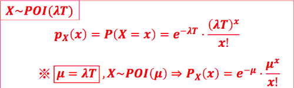
    - CDF: 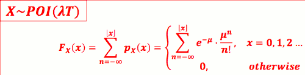
 - 费雯被嘘:费雯兄 po 文后，平均 每分钟会有 5 人嘘之。问发文后 20 分钟变 成 XX (80 嘘) 之机率?
    - λ = 5 嘘/分，若定义随机变量 X 为 20 分钟内的嘘数
    - => X ~ POI(λT) = POI(100) = e⁻¹⁰⁰·100⁸⁰ / 80! 
    - 若条件是 每小时 300人嘘之，答案一样
        ```python
        >>> scipy.stats.poisson.pmf( 80, 100 )
        0.005197854125980
        >>> (math.e**-100)*(100**80)/math.factorial(80)
        0.005197854125980
        ```
 - 理解泊松分布的特性:
    - 它常用来描述大量随机试验中稀有事件出现的次数
    - 比如 抽卡抽到 詹姆斯卡次数 ?  


```python
# 被嘘
# u = 5 * 20 == 100
import numpy as np
import matplotlib.pyplot as plt
x1 = np.random.poisson( 100 , 100000  )
weights = np.ones_like(x1)/float(len(x1))
plt.hist(x1, normed=False, weights=weights, facecolor='green', alpha=0.5,bins=100)
plt.show()
```


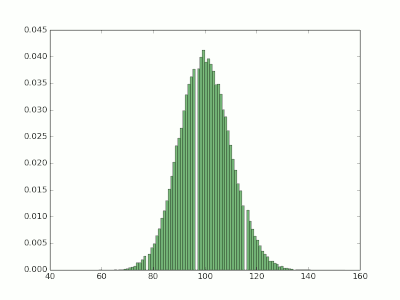

```python
import scipy, scipy.stats
x = scipy.linspace(50,150,101)
pmf = scipy.stats.poisson.pmf(x, 100 )
import pylab
pylab.plot(x,pmf)
pylab.show()
```

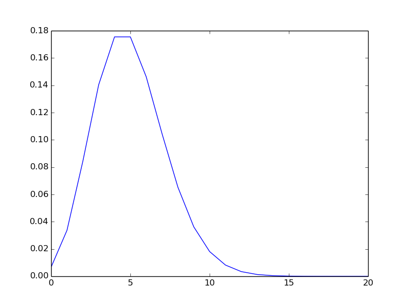


#### 和Binomial 的关系

- 将T 划分成 长度为ΔT的小段 , 共有 n= T/ΔT 个小段
- 若发生速率为λ次/分, 每个小段会发生的机率 p= λΔT = λT/n
- 故 T时间内发生的次数 X~BIN(n,p) = BIN(n,λT/n)


- 泊松分布通常也用于二项分布的近似计算。
    - 当n很大，而p很小时，在没有计算机时，二项分布的计算是非常麻烦的，而用泊松分布来近似计算可以降低大量的计算量。
    - 一般来讲，n≥100，np≤10近似效果较好。


-----

 [1]: ../imgs/TU_probability_deduction_02.png


