...menustart

- [5-1: 机率密度函数 PDF (PROBABILITY DENSITY FUNCTION)](#fc548c0411701f3a57c7799ad18245e3)
    - [PDF](#bcd1b68617759b1dfcff0403a6b5a8d1)
    - [PDF 跟机率的关系](#0b821c7256491cd7494160a47d4a1023)
    - [PDF 有哪些性质呢?](#5bc2e5b291e2fbe5196f9a425ad6a0c9)
- [5-2: 连续机率分布 I (CONTINUOUS PROBABILITY DISTRIBUTION)](#423296d40fd5d59d1f076d73508c42e6)
    - [Uniform 机率分布](#f7bf1cb803a0ab0539a6dc3ed526dd4f)
    - [Exponential 机率分布](#894ad572b4888ac89196f741cd003480)
        - [指数分布和 柏松分布之间的关系](#a781eb710c59f5f1dffeb4d79e0bf04d)
        - [指数分布和 几何分布之间的关系](#ee8d241828945ff9c5d39465a5c65f25)
        - [指数分布和 uniform 分布的关系](#dc45153d24cf787ea2b2917ec03ca044)
        - [指数分布和 正态分布的关系](#6d91070e066c0b53115e187e5f194191)
    - [Erlang 机率分布](#7d09f590df9dfcbd10d1b8cbffce9514)
        - [Erlang 和 Exponential  关系](#a37b5c85c6d082e170925dbe09051a82)
- [Week6](#63995e860d87301917bfed4525e36993)
    - [6-1: 连续微积分分布 II ( CONTINUOUS PROBABILITY DISTRIBUTIONS )](#292420e2932b158fe9de18af72e0f2ff)
        - [Normal 机率分布(常态分布)](#a638878f993f94c84c6c050963d0f635)
            - [Standard Normal Distribution 标准常态分布](#b672e9679aa32ead876e8b9c6c43d78c)
    - [6-2: 期望值 I (EXPECTATION)](#699f5bed3f92e270bce0a95ed5bf89d3)
        - [随机变量的函数之期望值](#7a410c29ec1783458c2d5c679f790eee)
        - [期望值运算性质](#09a5fcc38b3f4c96f745b665bfb42cea)
        - [常见的随机变量函数期望值](#487e3e26c9963764a55fe4f8b597d389)
        - [变异数 (variance)](#d43aa7d625393a9c328a86c60568b12e)
        - [Variance 便利算法](#d57572a47dea71843856503c0ef5c154)
        - [常见离散分布之期望值/变异数](#33805636b57d3a4f61be9c79a1d93947)
        - [几率推导奥义： 「凑」字诀](#367685545196820c0c173d14fe4c9421)
        - [Quiz](#ab458f4b361834dd802e4f40d31b5ebc)
- [Week7](#b9d0e738b55594e8d3824de9b91b0914)
    - [7-1 期望值II](#041a19cd2e4bebb61913e1566b7cfb67)
        - [随机变数函数 期望值](#45c2600156e6a1f700dfe4260c9694c4)
        - [常见连续分布的期望值/变异数](#29e116aede7ee7f00af95ca5edd4c6d0)
        - [期望值推导](#4fdbd553cf6f3c5cfd46baa1993c8dc2)
    - [7.2 隨機變數之函數](#27fdd10ac05020268c5d6bb6954f4099)
        - [如何求 g(X)几率分布?](#317aa5bd89ce045575f8cb8491b70c62)
    - [7.3a 条件概率分布](#33f8148fbbdcedb32e214651afcff8d9)
    - [7.3a 失忆性 (Memoryless)](#f16b66e705a9a610a0da37b5dae105eb)
    - [QUIZ](#e1f7ff5183a361cd3b41e3ab5e647cb5)
- [Week 8](#1223874fb29922e4e7bb1474bbc33147)
    - [8.1 联合概率分布](#7a6e0b2a0774b9a999a5e891f7cc3d2c)
        - [联合 PMF (Joint PMF)](#ecfdf56b8825bb6021bc398b2687da18)
        - [联合 PMF 的性质](#12c3181de32d16311d0a1a1c713d480c)
        - [联合 CDF (Joint CDF)](#ae2555933cfea0bde5a2585b0d731631)
        - [联合 CDF 的性质](#2ddfa5d23aecf6d8e642c4f5063fa615)
        - [联合 PDF 例子](#82a4552a73f360a69c244464918476f9)
        - [若𝑿, 𝒀 皆为连续随机变数怎办?](#62cff33c593fc9c62714039fbd68d2f3)
        - [连续联合 PDF 的性质](#81b351c0506c1a71878441a0a81088d1)
    - [8.2 边际机率分布](#2ddbe1ee6b0b9481c8a52627056fedd5)
        - [已知联合 PMF，欲得个别 PMF](#41d4f6592d31a4b16ba8e2d84689f26b)
        - [边际 PMF (Marginal PMF)](#88467bd1b22479904c4cda0b92cbed46)
        - [边际 PDF (Marginal PDF)](#dcfc73f8fb33ef1e323fa7af282e7f12)
    - [8.3 双变数期望值](#b7c12c38cf6f0bd638bb87f785c54a6b)
- [Week 9 多个随机变数之和的概率分布](#1762299309d6cb253f2fdb43d353f294)
    - [9.1 随机变数之和](#193f6cd419c84d21dae97441a455bb44)
    - [9.2 MGF(MOMENT GENERATING FUNCTION)](#09fcfdc987674ca8b8ddac2800de6f82)
        - [MGF](#cdd64cb797821d59ddd73236bda46533)
        - [MFG重要性质](#f8dbbf3c577f493b3b6ff0bffd301e3f)

...menuend


<h2 id="fc548c0411701f3a57c7799ad18245e3"></h2>


# 5-1: 机率密度函数 PDF (PROBABILITY DENSITY FUNCTION)

<h2 id="bcd1b68617759b1dfcff0403a6b5a8d1"></h2>


## PDF 

- 离散的随机变数有 PMF 告诉我们 某个数字发生的机率
- 连续变数的机率分布常有不均等的情况发生， Ex: 睡觉的时间长度
- 对连续的随机变量，我们也想知道某个数字 发生的机会多大，可以用 PMF 吗?

---

- 连续Random Variable  的先天问题
- 每个数字发生的机率都是 0!
- 还是很想知道在某个数字发生的机会多大， 怎么办?
- 先看个乱七八糟的例子
    - 因为拍戏，特别订做合金宝剑
    - 铜、金打造，如何得知有无偷工减料?
    - 整根有质量，但是每点质量都是零?好熟悉!
    - 不看质量看什么?看密度!
    - 密度 at x ≈ (质量 in [x,x+Δx])/Δx  (Δx→0)

---

- 连续的东西，关键是密度!
- 宝剑有密度，机率也可有密度!
- 对随机变数 𝑿 而言，其机率密度:


- PS:
    - the value of PMF can not be greater than 1
    - but the value of PDF can be greater than 1

<h2 id="0b821c7256491cd7494160a47d4a1023"></h2>


## PDF 跟机率的关系

- 因为我们习惯处理机率，看到 PDF 如何把它跟机率连结呢?


 
- PDF 是 CDF 的微分, CDF 是 PDF 的积分
- fₓ(x) = lim<sub>Δx→0</sub> P(x≤ X ≤x+Δx)/Δx 
- 当 Δx 很小时：P(x≤ X ≤x+Δx) = fₓ(x)·Δx
- 

<h2 id="5bc2e5b291e2fbe5196f9a425ad6a0c9"></h2>


## PDF 有哪些性质呢?


---

<h2 id="423296d40fd5d59d1f076d73508c42e6"></h2>


# 5-2: 连续机率分布 I (CONTINUOUS PROBABILITY DISTRIBUTION)

<h2 id="f7bf1cb803a0ab0539a6dc3ed526dd4f"></h2>


## Uniform 机率分布


- Ex: 已知1路公交车每十分钟一班。 小美随意出发到公车站，小美须等候公交 车之时间为 X

<h2 id="894ad572b4888ac89196f741cd003480"></h2>


## Exponential 机率分布


```python
import scipy, scipy.stats
x = scipy.linspace(0,10,101)
lamda = 1
pmf = scipy.stats.expon.pdf(x, 0, 1.0/lamda)
cdf = scipy.stats.expon.cdf(x, 0, 1.0/lamda)
import pylab
pylab.plot(x,pmf)
pylab.plot(x,cdf,color="red")
pylab.show()
```


- 连续的"几何分布" ?
- 非常漂亮的CDF积分
- Exponential 分布有失忆的性质 (memoryless)，常被用来 model 有这种性质 的事情
    - Ex: 小美出门化妆所需之时间
    - Ex: 某宅打LOL所花的时间
    - 指数函数的无记忆性来自于泊松过程k=0时的 时间指数性，而泊松过程k=0时的 时间指数性 来自于泊松分布时 lambda的恒定性，也就是离散情况下，二项分布的n*p的恒定性。
- The only memoryless continuous probability distributions are the exponential distributions,
    - `P( X>t+s | X>t ) = P( X>s )`.

```bash
   P( X>t+s | X>t ) = P( X>s )
=> P( X>t+s , X>t ) / P(X>t) = P( X>s )
=> P( X>t+s  ) / P(X>t) = P( X>s )
   let G(t) = P(X>t) 
=> G(t+s) = G(t)G(s)
=> G(a) = G(1)ª  
```

G(a) = G(1)ª = e<sup>log(G(1))·a</sup>

--- 

- Q: 柯仔在學校的中午都會去跑操場，但是他用意並不是訓練強健的體魄，而是要撿拾別人遺落在跑道邊的金錢。假設柯仔經過長期的經驗與訓練，不管在任何天氣或是體力的影響下，都可以保持一定的速度 1 m/s(公尺每秒)，而在這個速度之下，柯仔平均跑 300 m(公尺) 可以發現一次遺落的錢。隨機變數X代表柯仔開始跑步到撿到錢為止所跑的距離，已知X是個 Exponential Distribution。
    - 請問柯仔跑超過5分鐘才撿到錢的機率是多少?
- A: 柏松分布 单位时间(300s) λ = 1 ，
    - 5分钟内 捡到钱的概率 P(x≤1) = F( 1 ) = 1 - e⁻¹
    - 5分钟后 捡到钱的概率 P(x>1 ) = 1 - F(1) = e⁻¹ = 0.37
        ```python
        >>> 1.0 - scipy.stats.expon.cdf(1,0,1)
        0.36787944117144233
        ```

---

<h2 id="a781eb710c59f5f1dffeb4d79e0bf04d"></h2>


### 指数分布和 柏松分布之间的关系

- 定理一：设随机变量 X 服从参数为 λT的柏松分布，则 两次发生之间的“等待时间”Y 服从参数为 λ的指数分布。
- 泊松分布
    - 泊松分布的参数λ是单位时间(或单位面积)内随机事件的平均发生率
    - 泊松分布适合于描述单位时间(或空间)内随机事件发生的次数
    - 参数λ 由二项分布的期望np决定，λ=np，表示该时间(空间)段内的事件发生的频率。
    - eg. 一本书里，印刷错误的字的个数
        - 泊松分布 表示一般情况下，书内(空间)的出错的频率(期望)，n代表所有的字数，p代表印刷错误的概率，k表示印刷错的字数。
        - 当n很大，p很小的时候，二项分布的极限是泊松分布。
            - 这个例子同样可以用二项分布的角度来解释：每印刷一个字，表示一次伯努利实验（n代表所有的字数，p代表印刷错误的概率，k表示印刷错的字数
        - 当n继续变大，为连续变量的时候，二项分布的极限又成了正态分布（正态分布是所有分布趋于极限大样本的分布）。
- 指数分布
    - 指数分布是泊松过程的事件间隔的分布
    - 泊松分布表示的是事件发生的次数，“次数”这个是离散变量，所以泊松分布是离散随机变量的分布；
    - 指数分布是两件事情发生的平均间隔时间，“时间”是连续变量，所以指数分布是一种连续随机变量的分布。
    - 指数分布λ 的含义就是泊松分布中的λ

<h2 id="ee8d241828945ff9c5d39465a5c65f25"></h2>


### 指数分布和 几何分布之间的关系

- 都是失忆性分布
- 期望值都是 倒数 形式
- 服从指数分布的随机变量，可以表示 某些易碎品的 寿命， 如电子元件，玻璃制品。 虽然它们的寿命与多种因素有关，但是有一种因素是决定性的。它正好与 “服从正态分布是与 多种相互独立的因素有关，但是没有一种因素是起决定作用” 相反。
- 几何分布 是一种 “直到 。。。为止” 型概率分布，也是一种 “寿命”。
- 相互独立的设计，直到击中为止，射击次数服从几何分布。被枪手离散地射击，直到击中，它的寿命 就 "为止"了

<h2 id="dc45153d24cf787ea2b2917ec03ca044"></h2>


### 指数分布和 uniform 分布的关系

- 定理2: 随机变量Y 服从参数为 λ 的指数分布的充要条件是 随机变量 Y = 1-e<sup>-λx</sup> 服从(0,1) 上的均匀分布。

<h2 id="6d91070e066c0b53115e187e5f194191"></h2>


### 指数分布和 正态分布的关系

- 定理3: 随机变量 X,Y 相互独立，都服从正态分布N(0,λ²) , 则 Z=X²+Y² 服从指数分布。


---

<h2 id="7d09f590df9dfcbd10d1b8cbffce9514"></h2>


## Erlang 机率分布


- CDF:


```python
import scipy, scipy.stats
x = scipy.linspace(0,10,101)
lamda = 1
pmf = scipy.stats.erlang.pdf(x, 3, 0, 1.0/lamda)
cdf = scipy.stats.erlang.cdf(x, 3, 0, 1.0/lamda)
import pylab
pylab.plot(x,pmf)
pylab.plot(x,cdf,color="red")
pylab.show()
```


--- 

<h2 id="a37b5c85c6d082e170925dbe09051a82"></h2>


### Erlang 和 Exponential  关系

- Erlang(n,λ) 常被用来model 一件有多个关卡事情的总时间，而每个关卡所 需时间都是随机的 
    - 关卡数: n
    - 每关卡所需时间之机率分布: Exponential( λ )
    - Ex: 打电动过三关所需时间: Erlang(3, λ)
    - Ex: 写完五科作业所需时间

---

<h2 id="63995e860d87301917bfed4525e36993"></h2>


# Week6 

<h2 id="292420e2932b158fe9de18af72e0f2ff"></h2>


## 6-1: 连续微积分分布 II ( CONTINUOUS PROBABILITY DISTRIBUTIONS )

<h2 id="a638878f993f94c84c6c050963d0f635"></h2>


### Normal 机率分布(常态分布)

- 常态分布在自然界很常出现
    - Ex: 人口身高分布、体重分布
- 亦常被用作「很多随机量的总合」的机率模型
    - Ex: 100 人吃饭时间的总合
    - 原因:来自最后会讲到的「中央极限定理」
- 常态分布，亦常被称作Gaussian (高斯) 机率分布 
- X ~ Gaussian ( μ,σ )
    - 也常有人用 X ~ N( μ,σ² ) 表示
    - 
    - 
- CDF是多少?
    - 很难算，积分根本算不出来!
    - 用数值积分法去建表?
        - 很难啊，因为不同的 μ,σ 就会造就 出不同的 常态分布 PDF，每个都要建一个表会要命啊!
    -  怎么办?
        - 有没有办法找到一组特别 μ,σ  ，先针对这组的 CDF 建表， 然后想办法把别的常态分布的 CDF 跟这组 CDF 牵上关系?
        - 若能牵扯上，再利用这表去算出别的常态分布的 CDF 值?

<h2 id="b672e9679aa32ead876e8b9c6c43d78c"></h2>


#### Standard Normal Distribution 标准常态分布

- Z ~ N( 0,1 )
    - 
    - 
- CDF 表示为Φ(z) :
    - 
    - 积不出来，只能以数值方法近似出来后建表 给人家查
    - 网络上或是工程计算器上常能找到
- Φ(z) 的性质：
    - Φ(-z)= 1 - Φ(z) 
    -  

--- 

- 任意 μ,σ 下的 CDF ？
    - 任意 μ,σ 下的 CDF , 我们要把它跟 N(0,1) 牵上关系
    - 「关系!」: 对任何  X ~ N( μ,σ² ) 而言， (X-μ)/σ ~ N(0,1) 
        - 证明：略
    - 对任何 X ~ N( μ,σ² )  而言 , F<sub>X</sub>(x) = Φ( (x-μ)/σ ) .
        - 证明：

```
Fₓ(x) = P( X≤x )
      = P( X-μ ≤ x-μ )
      = P( (X-μ)/σ ≤ (x-μ)/σ )
      = Φ( (x-μ)/σ )
```

- Ex. 已知 10 名水源阿伯每日拖车总重量总和 X ~ N(500, 100²) (kg) , 问本日总重量少于700 之机率为 ？
    - F<sub>X</sub>(700) = P( X≤700 ) = P( (X-μ)/σ ≤ (700-500)/100 ) = Φ(2) = 0.977
        ```python
        >>> scipy.stats.norm.cdf( 700, 500,100 )
        0.97724986805182079
        ```

- Draw PDF 

```python
import matplotlib.pyplot as plt
import numpy as np
import scipy.stats as stats

mu = 20
sigma = 2

x = np.linspace( mu - 5*sigma, mu + 5*sigma, 200 )
plt.plot( x, stats.norm.pdf( x, mu, sigma  ) )
plt.show()
```

---


<h2 id="699f5bed3f92e270bce0a95ed5bf89d3"></h2>


## 6-2: 期望值 I (EXPECTATION)

- 大数法则
    - 想知道某事件发生的机率?
    - 作很多次实验，记录实验中出现那个事件多少次。当实验次数接近无穷 多次时，这个比例就会越来越接近实际的机率!
    - P(A) = lim<sub>N→∞</sub> (N<sub>A</sub>/N)
- 期望值 (Expectation)
    - 做随机实验时，我们很希望能有某种估算
    - 平均值是我们平常最常普遍的估算值
    - 作两次实验的平均值是? (X₁+X₂)/2 = ?
    - 不管我们做多少次实验，平均值都是一个随机变数，那不就 不能拿来估算?
    - 所幸!当做的实验次数趋近于无穷多时，这么多次的实验的平均值 会收敛到一个常数!我们就用它来当作这机率分布的估算值吧!
- 若考虑某机率分布，作实验很多次若随机实验之样本空间为 {1,2, ... ,n}, 作实验N次，记录各结果出现 次数，分别为N₁,N₂,...N<sub>n</sub>
    - 平均值 (Mean): ∑<sub>x=</sub>ⁿ₁ (x·Nₓ)/N
    - 根据大数法则 : ∑<sub>x=</sub>ⁿ₁ x·P<sub>X</sub>(x)
- Mean 值又称作期望值
    - μ<sub>Y</sub> = E[Y]
    - 对离散随机变数 𝑿 而言，我们定义其期望值 
        - E[X] = μ<sub>X</sub> = ∑<sub>x=</sub><sup>∞</sup><sub>-∞</sub> x·P<sub>X</sub>(x) 
    - **期望值不等于随机会发生的值**!
        - eg. P<sub>X</sub>(1) = P<sub>X</sub>(-1) = 1/2 => μ<sub>X</sub> = 0 !!! 

 
<h2 id="7a410c29ec1783458c2d5c679f790eee"></h2>


### 随机变量的函数之期望值

- 对于任一离散随机变量 X 而言，其 任意函数 g(X) 亦是一随机变量，亦有期望值
- g(X) 期望值定义为
    - E[ g(X) ] = ∑<sub>x=</sub><sup>∞</sup><sub>-∞</sub> g(x)·P<sub>X</sub>(x) 
    - 根随即变量的期望值公式相比，只是 x 变成了 g(x)

<h2 id="09a5fcc38b3f4c96f745b665bfb42cea"></h2>


### 期望值运算性质

- E[ 3X² ] = ∑<sub>x=</sub><sup>∞</sup><sub>-∞</sub> 3x²·P<sub>X</sub>(x) 
    - = 3·∑<sub>x=</sub><sup>∞</sup><sub>-∞</sub> x²·P<sub>X</sub>(x)  = 3·E[X²]
    - 常数项可以提出来
- E[α·g(X)] = α·E[g(X)] 
- E[α·g(X) + β·h(X) ] = α·E[g(X)] + β·E[h(X)]
- E[α] = α
 
<h2 id="487e3e26c9963764a55fe4f8b597d389"></h2>


### 常见的随机变量函数期望值
 
- X 的 n<sup>th</sup> moment:
    - E[Xⁿ] = ∑<sub>x=</sub><sup>∞</sup><sub>-∞</sub> xⁿ·P<sub>X</sub>(x)  
    - Ex: E[X²] 是 X的 2<sup>nd</sup> moment
- X 的变异数 (variance):
    - E[ (X-μ<sub>X</sub>)² ] 
    - 减去 期望值的 平方

<h2 id="d43aa7d625393a9c328a86c60568b12e"></h2>


### 变异数 (variance)

- Variance通常符号表示为 σ<sub>X</sub>² = E[ (X-μ<sub>X</sub>)² ] 
- 变异数隐含关于随机变数 X 多「乱」的信息
- 变异数的开根号便是标准差 (standard deviation)
    - σ<sub>X</sub> = √Variance

<h2 id="d57572a47dea71843856503c0ef5c154"></h2>


### Variance 便利算法

- σ<sub>X</sub>² = E[ (X-μ<sub>X</sub>)² ]
    - = E[ X²-2μ<sub>X</sub>·X+μ<sub>X</sub>² ]
    - = E[X²] + E[-2μ<sub>X</sub>·X] + E[ μ<sub>X</sub>² ]
    - = E[X²] - 2μ<sub>X</sub>·E[X] + μ<sub>X</sub>²
    - = E[X²] - μ<sub>X</sub>² 

- => E[X²] = σ<sub>X</sub>² + μ<sub>X</sub>²  


<h2 id="33805636b57d3a4f61be9c79a1d93947"></h2>


### 常见离散分布之期望值/变异数

- X~Bernouli(p) :
    - μ<sub>X</sub> = 1·p + 0·(1-p) = p
    - σ<sub>X</sub>² = E[X²] - μ<sub>X</sub>² = ∑<sub>x=</sub>¹₀ x²·p<sub>X</sub>(x) - μ<sub>X</sub>²
        - = 1²·p + 0²·(1-p) - p² = p(1-p)
- X~BIN(n,p) :
    - μ<sub>X</sub> = np
    - σ<sub>X</sub>² = np(1-p)
- X~GEO(p) :
    - μ<sub>X</sub> = ∑<sub>x=</sub><sup>∞</sup><sub>0</sub> x· (1-p)<sup>x-1</sup>·p = 1/p 
    - σ<sub>X</sub>² = E[X²] - μ<sub>X</sub>² = (1-p)/p²
- X~PASKAL(k,p) :
    - μ<sub>X</sub> = k/p
    - σ<sub>X</sub>² = k(1-p)/p²  
- X~POI(α) :
    - μ<sub>X</sub> = α
    - σ<sub>X</sub>² = α 
- X~UNIF(a,b) :
    - μ<sub>X</sub> = (a+b)/2
    - σ<sub>X</sub>² = 1/12·(b-a)(b-a+2)

<h2 id="367685545196820c0c173d14fe4c9421"></h2>


### 几率推导奥义： 「凑」字诀

- 以 X~POI(a) 为例
- X~POI(a) 概率公式是什么？
    - P<sub>X</sub>(x) = (aˣ/x!)·e⁻ª , x=0,1,2,... 
- 我们手上能利用的公式有哪些？
    - ∑<sub>x=</sub><sup>∞</sup><sub>0</sub> (aˣ/x!)·e⁻ª = 1
- 开始推导:  

---

E[X] = ∑<sub>x=</sub><sup>∞</sup><sub>0</sub> x·(aˣ/x!)·e⁻ª 

x 和 x！约分，变成 (x-1)! , 这样 ∑ 运算就不能包括 x=0了， 因为 阶乘对负数没有定义

 E[X] = ∑<sub>x=</sub><sup>∞</sup><sub>1</sub> (aˣ/(x-1)!)·e⁻ª 

使 a 的指数形式 和 阶乘 保持一致

 E[X] = a·∑<sub>x=</sub><sup>∞</sup><sub>1</sub> (aˣ⁻¹/(x-1)!)·e⁻ª 

令 x' = x-1 

 E[X] = a· ∑<sub>x'=</sub><sup>∞</sup><sub>0</sub>  (aˣ<sup>'</sup>/x'!)·e⁻ª = a·1 = a 
 
--- 


σ<sub>X</sub>² = E[X²] - μ<sub>X</sub>² = E[X²] - a² 

和 E[X] 类似， 可以推导处 E[X²] =  a² + a , 所以

σ<sub>X</sub>² =  a 

---


<h2 id="ab458f4b361834dd802e4f40d31b5ebc"></h2>


### Quiz

阿壘投籃平均進球率是 60% ，某日他好友阿拓在旁提議 ，如果阿壘可以連續進 10球，就停止射球並且阿拓會請阿壘一瓶運動飲料。隨機變數B是指阿壘這場賭注裡總共的進籃球數 (ex: B=6 就是指阿壘只投進六球，第七球沒投進)，則請問 E[B]=?

- note: 这题条件不是严格的几何分布，因为最多到10球就结束了
- 解法：枚举

```python
>>> p = 0.4
>>> r = 0
>>> for nBallScore in xrange(11):
...     x = nBallScore +1 
...     r += (1-p)**(x-1)*( p if nBallScore <10 else 1 ) * nBallScore
... 
>>> r
1.4909300736
```

某國的籃球 聯盟季後賽，由東隊對上 西隊 ，要在 5場比賽內決定 誰是這國家今 年最強的籃球 隊伍，當某一隊伍 取得 3場勝利的時候 ，這季後 賽馬上就結束確 定由三勝的球隊取得最後的冠軍寶座 。假設按照 幾年來的對戰統計 ，一場東隊 碰上西隊 的比賽，東隊獲勝的機率 是 60 %，而西隊獲勝的機率 則是 40 %。隨機變 數 N代表這次季後賽在總冠軍確定時，總共比賽的場數。請問N的期望值是?

- 同样，这也不是 PASKAL 分布，因为到第5场就结束了
- 4.07

```
>>> p = 0.6
>>> 
>>> 3*p**3 + 3*(1-p)**3
0.84

>>> 4*p**3*(1-p)*3 + 4*(1-p)**3*p *3
1.4976

>>> 5*p**2*(1-p)**2 * 6 
1.7280000000000002

>>> 1.7280000000000002 + 1.4976 + 0.84
4.0656
```


<h2 id="b9d0e738b55594e8d3824de9b91b0914"></h2>


# Week7 

<h2 id="041a19cd2e4bebb61913e1566b7cfb67"></h2>


## 7-1 期望值II

- 对连续的随机变数X而言，想求期望值，我们用类似 离散随机变数的方式出发
- 将X的值 以Δ为单位 无条件舍去来近似结果 离散随机变数 Y 
    - 当 Δ → 0时， X≈Y , 当Δ趋近0的时候，Y接近Y
    - X∈[0,1Δ) -> Y=0Δ
    - X∈[1Δ,2Δ) -> Y=1Δ
    - X∈[nΔ,(n+1Δ) -> Y=nΔ
- 根据第五周
    - p<sub>Y</sub>(nΔ) = P(nΔ ≤ X < nΔ+Δ) ≈ f<sub>X</sub>(nΔ)·Δ
- E[X] = lim<sub>Δ→0</sub>E[Y] = lim<sub>Δ→0</sub> ∑<sub>n=-∞</sub><sup>∞</sup> nΔ·P<sub>Y</sub>(nΔ)
    - = ∫<sub>-∞</sub><sup>∞</sup> xf<sub>X</sub>(x)dx
    - 即， x乘上pdf,然后积分

<h2 id="45c2600156e6a1f700dfe4260c9694c4"></h2>


### 随机变数函数 期望值

- 对于任一连续随机变数X，其任意函数g(X)亦是一随机变数
    - E[g(X)] = ∫<sub>-∞</sub><sup>∞</sup> g(x)f<sub>X</sub>(x)dx

<h2 id="29e116aede7ee7f00af95ca5edd4c6d0"></h2>


### 常见连续分布的期望值/变异数

- X ~ Exponential(λ)
    - μ = 1/λ
    - σ² = 1/λ²
- X ~ Erlang(n,λ)
    - μ = n/λ
    - σ² = n/λ²
- X ~ Gaussian(μ,σ)
    - μ = μ
    - σ² = σ²
- X ~ UNIF(a,b)
    - μ = (a+b)/2
    - σ² = 1/12 · (b-a)²

<h2 id="4fdbd553cf6f3c5cfd46baa1993c8dc2"></h2>


### 期望值推导

- 一些有用的微积分性质
    - e<sup>`*`</sup>𝑑`*` = 𝑑e<sup>`*`</sup>
    - ∫U𝑑V = UV - ∫VdU
    - ∫c𝑑x = ∫𝑑cx  , c 是常数
    - ∫pdf = 1

<h2 id="27fdd10ac05020268c5d6bb6954f4099"></h2>


## 7.2 隨機變數之函數

- 随机变数X的任意函数g(X)也是一个随机变数
- 通常被称为 Derived Random Variable
    - 从 random variable X 衍生出来的一个新的random variable


<h2 id="317aa5bd89ce045575f8cb8491b70c62"></h2>


### 如何求 g(X)几率分布?

- 若X为离散
    - 直接推 g(X) 的 PMF
- 若X为连续
    - 先推 g(X)的CDF， 再微分得到PDF

- Ex:某宅宅超爱战LOL。每次一战就连续战 𝑿 场不可收拾，已知 𝑿~GEO(0.2)。某宅宅内心仍有 一点清明，其良心亦会因战过度而内疚，依战的次数 多寡，内疚程度 𝒀分别为1, 2, 3 不同等级:
    ```
               ⎧ 1, if 1≤X≤3
    Y = g(X) = ⎨ 2, if 4≤X≤6
               ⎩ 3, if X≥7
    ```
    - 问Y=g(X)的几率分布?
    - 解: X~GEO(0.2) => p<sub>X</sub>(x) = (1-0.2)<sup>x-1</sup>·0.2
        - p<sub>Y</sub>(1) = p<sub>X</sub>(1)+p<sub>X</sub>(2)+p<sub>X</sub>(3) 
            - = 0.2 + 0.8·0.2 + 0.8²·0.2
        - p<sub>Y</sub>(2) = p<sub>X</sub>(4)+p<sub>X</sub>(5)+p<sub>X</sub>(6) 
            - = (0.8)³·0.2 + (0.8)⁴·0.2 + (0.8)⁵·0.2
        - p<sub>Y</sub>(3) = P(Y=3) = 1-p<sub>Y</sub>(2)-p<sub>Y</sub>(3)
- 离散g(X)
    - Y = g(X) 的 PMF为 
    - 
- 连续g(X) 
    - 先计算g(X)的CDF: 
        - F<sub>g(X)</sub>(y) = P[g(X)≤y]
    - 若 g(X)可微分, 再对y微分得到PDF:
        - 
- 连续g(x) = aX + b
    - Ex1: 若Y=3X+2, 请问Y的PDF 跟f<sub>X</sub>(x)之关系为何?
    - F<sub>Y</sub>(y) = P(Y≤y)
        - = P(3X+2≤y)
        - = P(X≤(y-2)/3 )
        - = F<sub>X</sub>( (y-2)/3 )
    - f<sub>Y</sub>(y) = f<sub>X</sub>( (y-2)/3 )·(1/3)
    - generic solution:
        - f<sub>Y</sub>(y) = (1/|a|)·f<sub>X</sub>( (y-b)/a )

    - Ex2: X~Exponential(λ) , Y = 2X
    - f<sub>X</sub>(x) = λe<sup>-λx</sup>u(x), Y=2x (a=2,b=0)
        - 这里 u(x)是工程上常见的一个函数，表示只有x>0时有值，即x>0时u(x)=1, 其他情况u(x)=0
    - f<sub>Y</sub>(y) = (1/|a|)·f<sub>X</sub>( (y-b)/a )
        - = 1/2·λe<sup>-λ·y/2</sup>·u(y/2)   (a,b代入)
        - = λ/2·e<sup>-λ/2·y</sup>·u(y) 
        - => Y~Exponential(λ/2)
- 连续g(x) = aX² + b
    - Ex: Y = 2X²+1, X~UNIF(-1,7), 求 Y的PDF
    - 不要好高骛远，先算CDF
    - F<sub>Y</sup>(y) = P(Y=2X²+1≤y)
        - = P(X²≤(y-1)/2)
        - = P( -√((y-1)/2) ≤ X ≤ √((y-1)/2) )
        - = ∫<sub>-z</sub><sup>z</sup>f<sub>X</sub>(x)dx  , 令 z = √((y-1)/2)
    - 需要注意积分的范围, 这里注意 Y > 3的情况
        - y≤3: F<sub>Y</sub>(y) = ∫<sub>-z</sub><sup>z</sup>1/8dx = 
        - y>3: F<sub>Y</sub>(y) = ∫<sub>-1</sub><sup>z</sup>1/8dx =
        - 微分得到 f<sub>Y</sub>(y)


<h2 id="33f8148fbbdcedb32e214651afcff8d9"></h2>


## 7.3a 条件概率分布 

- Ex:为了更了解宅宅的心，店员妹亦开始战 LOL。 已知店员妹战LOL场数 𝑿~UNIF (1, 5)。若已知 店员妹战了两场仍战意甚浓、继续战。请问在此情况下，店员妹 今日战LOL场数 𝑿 之机率分布为何?
    - 条件 B: 已战两场 仍想战
    - p<sub>X|B</sub>(x) = P(X=x|B) = P(X=x,B)/P(B)
        - = (1/5) / (3/5)  = 1/3,  x∈B:x=3,4,5
        - = 0,   x∉B:x=otherwise
- 若𝑿是一离散随机变数，其PMF为 𝒑𝑿(𝒙)。若已知某事件 𝑩 已发生，则在此情况下 之条件机率分布为:
    - 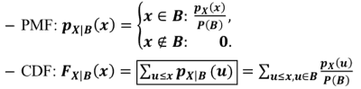
- Ex:店员妹等公交车上班。通常等公交车的时间 𝑿， 从零到十分钟间可能性均等。若店员妹已等了 五分钟车还没来。请问在此情况下，等车时间 𝑿 之机率分布为何?
    - B: X>5 => P(B)=0.5
    - f<sub>X|B</sub> = x∈B: f<sub>X</sub>(x) / P(B)
        - = x∉B: 0
- 若𝑿是一连续随机变量，其PDF为 𝒇𝑿(𝒙)。若已知某事件 𝑩 已发生，则在此情况下 之条件机率分布为:
    - 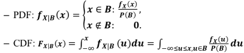
- 条件期望值 Conditional Expectation 
    - 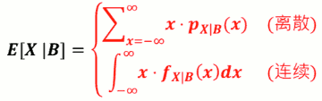
    - 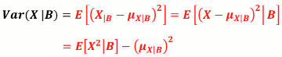


<h2 id="f16b66e705a9a610a0da37b5dae105eb"></h2>


## 7.3a 失忆性 (Memoryless)

- 宅宅与店员妹相约出门。宅宅出门前在战LOL，场数 𝑿~GEO (𝟎.2) 。店员妹等了两场后，宅宅还在玩。 店员妹甚怒，怒催宅宅。宅宅曰「快好了、快好了」。问宅宅剩余场 数 𝑿’ 之机率分布为何?

- 店员妹与宅宅相约出门。店员妹出门前化妆时间为 𝑿(小时)， 𝑿~Exponential(𝟏)。经过一小时后， 仍未完成。宅宅甚怒，怒催店员妹。店员妹曰「快好了、快好了」。 问店员妹剩余化妆时间𝑿′机率分布为何? 

- Geometric 跟 Exponential 机率分布 皆有失忆性的性质
    - 不管事情已经进行多久，对于事情之后的进行 一点影响都没有!


<h2 id="e1f7ff5183a361cd3b41e3ab5e647cb5"></h2>


## QUIZ

1. X~Exponential( 0.5 ) , 请问下列哪个错误？
    1. Y=2x+1, Var[Y] = 9   (错)
    2. E[X] = 2 
    3. Var[X] = 4 
    4. Y=2x+1, E[Y] = 5 

    - A: 
        - 可以很容易知道 E = 1/0.5 = 2, Var = 1/0.5² = 4
        - E[Y] = E[2X+1] = 2E[X] + E[1] = 4+1 = 5
        - Var[Y] = E[(Y-5)²] = E[Y²] - 25 = E[4X²+4X+1] - 25 = 4E[X²]+4E[X]+1-25
            - = 4·( Var[X] + E[X]² ) + 8+1-25 = 16
        - using scipy
            ```python
            >>> scipy.stats.expon.expect( scale=1/0.5 )
            1.9999999999999998
            >>> scipy.stats.expon.var( scale=1/0.5 )
            4.0
            >>> scipy.stats.expon.expect( func=lambda x:2*x+1,  scale=1/0.5 )
            5.0
            >>> scipy.stats.expon.expect( func=lambda x:x**2,  scale=1/0.5 )
            8.0    # E[X²]
            >>> Y = scipy.stats.expon.rvs(scale=1/0.5 , size=1000000) *2 + 1
            >>> Y.var()
            15.989224062316483
            ```
2. 假設等一班特定的公車所花費的的時間 TT 是Uniform Distribution，小速在公車站打滾多年的經驗，已經知道168路公車的平均要花5分鐘等一班公車，請問168號公車是幾分鐘會有一班車經過?
    - A:
        - T~UNIF
        - E[T] = 5
        - 10分钟

3. 星仔跟阿達兩人準備要出席今晚在學校的晚會，為了在晚會上引起眾人目光，星仔決定大手筆打扮自己，但是阿達其實只是為了去吃美食而已。下午3點兩人相約在阿達家集合，因為阿達有車可以載星仔一起去會場，但是星仔帶著所有行頭打算三點才開始在阿達家開始打扮。假設連續隨機變數TT 是星仔打扮所需要的時間(單位 hr)，且T∼Exponential(λ=1/3)。但是晚會六點就開始了，加上從阿達家過去的路程要半小時以上，如果阿達下午五點20以前沒即時出門前往會場，阿達或許就會吃不到今日開場限量的好吃麵包，於是阿達決定就等到下午五點20分，如果星仔依然還沒打扮好，就直接拋下星仔自行前往會場。也就是離散型隨機變數RR代表阿達有沒有成功到達會場:
    - R = 1 if 阿達載星仔到會場 ; R = 0 if 阿達沒有載星仔到會場. 請問，Var[R]=?
    - A: using scipy
        ```python
        >>> P_R1 = scipy.stats.expon.cdf( 2+1/3.0 ,   scale=3)
        >>> P_R1
        0.5405741759640734
        >>> Var = P_R1 * (1-P_R1)  #  Bernoulli
        0.2483537362448364
        ```
4. 同上題情境，如果5點的時候阿達確認星仔還沒打扮完，在此情況下，隨機變數R2==(R∣T>2) 代表最後阿達是否會載星仔到會場，請問E[R2] ?
    - A: using scipy , 由指数分布的失忆性
        ```python
        >>> P_R1 = scipy.stats.expon.cdf( 1/3.0 ,   scale=3)
        >>> P_R1
        0.10516068318563022
        >>> E = P  # Bernoulli
        ```
5. 某便利超商今天早上09:00開始推出兩款限量的商品，一個是可愛的馬克杯，另外一個是熱門卡通玩偶，假設限量商品全部賣完所需的時間都是Exponential Distribution的隨機變數，而且互相獨立，馬克杯和玩偶賣完所需的時間分別是T_1,T_2 (單位是hr)，而兩者的λ 分别为 1/12, 1/6. 請幫店長估計，平均需要幾個小時才能把兩項商品都賣完。
    - A:
        - U = max(X,Y)
        - F<sub>U</sub>(u) = P(U≤u) = P(max(X,Y)≤u) = P(X≤u, Y≤u) 
            - = P(X≤u)P(Y≤u) = F<sub>X</sub>(u)F<sub>Y</sub>(u)
        - 两边求导，得
            - f<sub>U</sub>(u) = f<sub>X</sub>(u)F<sub>Y</sub>(u) + F<sub>X</sub>(u)f<sub>Y</sub>(u)
        - scipy
            ```python
            >>> x = scipy.linspace(0,1000,100000)
            >>> pdf = scipy.stats.expon.pdf( x , scale=12 )*scipy.stats.expon.cdf( x , scale=6 ) + 
                scipy.stats.expon.pdf( x , scale=6 )*scipy.stats.expon.cdf( x , scale=12 )
            >>> delta = 1000./100000
            >>> delta
            0.01
            >>> (pdf * delta * x ).sum()  # 应该求积分计算期望值 (这里偷懒了: pdf*delta 近似pmf)
            14.001260126012166
            ```
        - for min(X,Y)
            - 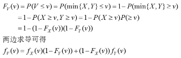

<h2 id="1223874fb29922e4e7bb1474bbc33147"></h2>


# Week 8

<h2 id="7a6e0b2a0774b9a999a5e891f7cc3d2c"></h2>


## 8.1 联合概率分布 

JOINT PROBABILITY DISTRIBUTION

- 当小明出国去交换时
    - 𝑿: 小美脸书/QQ 脱机时间，𝑿~𝑼𝑵𝑰𝑭(𝟖, 𝟏𝟐)
    - 𝒀: 小华脸书/QQ 脱机时间，𝒀~𝑼𝑵𝑰𝑭(𝟖, 𝟏𝟐)
    - 𝒁: 小园脸书/QQ 离线时间，𝒁~𝑼𝑵𝑰𝑭(𝟖, 𝟏𝟐)
    - 假设 𝑿, 𝒀, 𝒁 都是离散随机变数
- 若将小美脱机时间 𝑿 与小园脱机时间 𝒁一起看呢?
    - 画出𝑷𝑿=𝒙,𝒁=𝒛:
    - 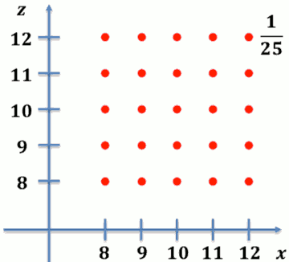
- 若将小美脱机时间 𝑿 与小园脱机时间 𝒀一起看呢?
    - 画出𝑷 𝑿=𝒙,𝒀=𝒚 ，赫然发现!
    - 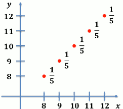


- 同时将多个随机变量的行为一起拿来看， 我们可以看出更多以往看不到的信息!
- 同时考虑多个随机变量的机率分布称之为联合机率分布 (joint probability distribution)

<h2 id="ecfdf56b8825bb6021bc398b2687da18"></h2>


### 联合 PMF (Joint PMF)

- 若𝑿,𝒀皆为离散随机变量，我们 可以定义他们的联合PMF
    - p<sub>X,Y</sub>(x,y) = P( X=x 且 Y=y )
    - 联合PMF决定了𝑿,𝒀的联合机率分布
- Ex: 小美脱机时间 𝑿 与小华脱机时间 𝒀 的联合 PMF:
    - p<sub>X,Y</sub>(x,y) = P( X=x, Y=y )
    - 


<h2 id="12c3181de32d16311d0a1a1c713d480c"></h2>


### 联合 PMF 的性质

- 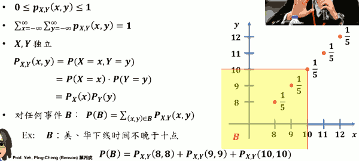

<h2 id="ae2555933cfea0bde5a2585b0d731631"></h2>


### 联合 CDF (Joint CDF)

- 若考虑两个随机变数 𝑿, 𝒀 的联合机率分布， 我们也可定义出所谓的联合 CDF:

- 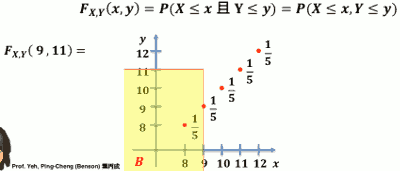

- 即, (X,Y) 会落在黄色区域的几率


<h2 id="2ddfa5d23aecf6d8e642c4f5063fa615"></h2>


### 联合 CDF 的性质

- 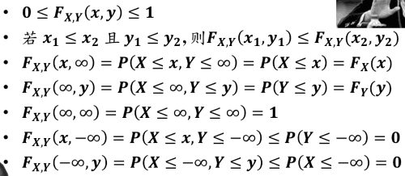


- 四方格性质
    - 
    - 你只需要知道4个顶点的 cdf 值


<h2 id="82a4552a73f360a69c244464918476f9"></h2>


### 联合 PDF 例子

- Ex:小美等公交车时间为 𝑿, 小园等公交车时间为 𝒀 𝑿, 𝒀 两者独立且皆为连续之机率分布 𝑼𝑵𝑰𝑭 𝟎, 𝟏𝟎 。则 𝑿, 𝒀之联合 PDF 为
    - 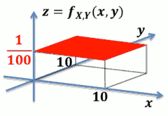
- 其他的联合pdf例子
    - 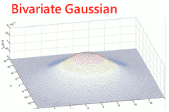


<h2 id="62cff33c593fc9c62714039fbd68d2f3"></h2>


### 若𝑿, 𝒀 皆为连续随机变数怎办?

- 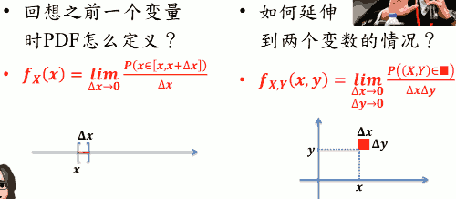

- 若 𝑿, 𝒀 皆为连续随机变量，我们可以定义联合 PDF:
    - 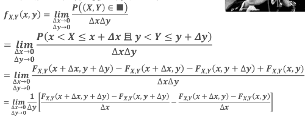
    - 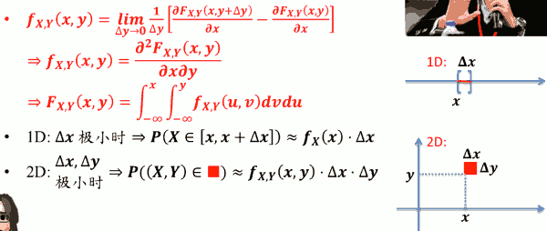


<h2 id="81b351c0506c1a71878441a0a81088d1"></h2>


### 连续联合 PDF 的性质 

- 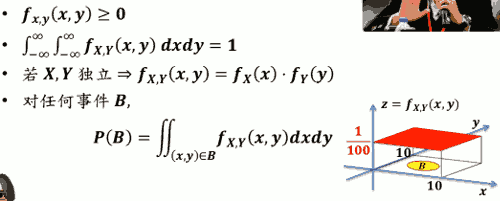
    - P(B) 是圆锥体体积


<h2 id="2ddbe1ee6b0b9481c8a52627056fedd5"></h2>


## 8.2 边际机率分布

MARGINAL PROBABILITY DISTRIBUTION

<h2 id="41d4f6592d31a4b16ba8e2d84689f26b"></h2>


### 已知联合 PMF，欲得个别 PMF

- Ex: 𝑿,𝒀分别为小美、小丽脸书/QQ 脱机时间。联合 PMF 如下:

p<sub>X,Y</sub>(x,y) | X = 8 | X = 9 | X = 10
--- | --- | --- | --- 
Y = 8 | 0.2 | 0.1 | 0.05
Y = 9 | 0.05 | 0.2 | 0.1
Y = 10 | 0.05 | 0.1 | 0.15

- p<sub>X</sub>(x) = ?   p<sub>Y</sub>(y) = ?
    - p<sub>X</sub>(8) = 0.2 + 0.05 + 0.05 = 0.3
    - p<sub>X</sub>(9) = 0.1 + 0.2 + 0.1 = 0.4
    - p<sub>X</sub>(10) = 0.05 + 0.1 + 0.15 = 0.3
- 整列加起来，然后(在它的边缘)写上数字，这就是 "边际"的由来


<h2 id="88467bd1b22479904c4cda0b92cbed46"></h2>


### 边际 PMF (Marginal PMF)

- 已知联合PMF p<sub>X,Y</sub>(𝒙,𝒚)，则可求得 p<sub>X</sub>(x), p<sub>Y</sub>(y) ，称之为边际 PMF
- 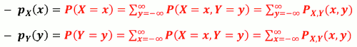


<h2 id="dcfc73f8fb33ef1e323fa7af282e7f12"></h2>


### 边际 PDF (Marginal PDF)

- 已知联合PDF f<sub>X,Y</sub>(𝒙,𝒚)，则可求得 f<sub>X</sub>(x), f<sub>Y</sub>(y) ，称之为边际 PDF
- 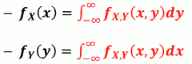

- Ex:
    - 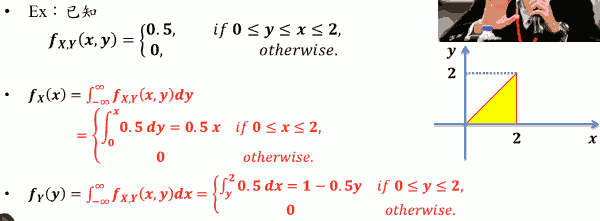


<h2 id="b7c12c38cf6f0bd638bb87f785c54a6b"></h2>


## 8.3 双变数期望值

- 离散
    - 回想只考虑一个离散随机变数𝑿时 其任意函数 g(x)的期望值是:
        - 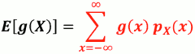
    - 若同时考虑两个离散随机变量𝑿,𝒀时，他们的任 意函数 h(X,Y) 的期望值是
        - 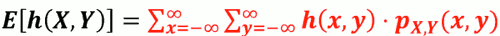
    - Ex. 参考上面 小美、小丽脸书/QQ 脱机 时间的例子, 求 E[ |X-Y| ]
        - 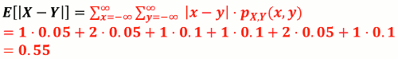

- 连续
    - 回想只考虑一个连续随机变量𝑿时 其任意函数 g(X) 的期望值是:
        - 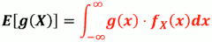
    - 若同时考虑两个连续随机变数𝑿,𝒀时，他们的任 意函数 h(X,Y) 的期望值是
        - 

- 性质
    - E[ αh₁(X,Y) + βh₂(X,Y) ] =  αE[h₁(X,Y)] + βE[h₂(X,Y)]
    - 若 X,Y 独立， 则
        - E[g(X)h(Y)] = E[g(X)]·E[h(Y)]
    - 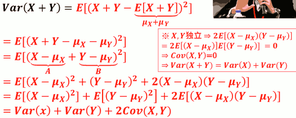


<h2 id="1762299309d6cb253f2fdb43d353f294"></h2>


# Week 9 多个随机变数之和的概率分布

<h2 id="193f6cd419c84d21dae97441a455bb44"></h2>


## 9.1 随机变数之和

- Z = X + Y 的几率分布？
- Ex: 老张面店只卖牛肉面跟豆腐脑已知每天的面销量 𝑿碗与豆腐脑销量𝒀碗的联合机率分布 p<sub>X,Y</sub>(x,y). 兄弟们约老张收摊后喝酒小聚。老婆规定老张洗完碗后才能赴约。 请问老张洗碗数量的机率分布是?
    - 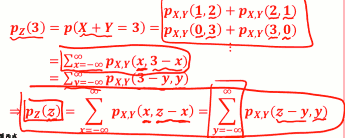
    - 第二行公式: 如果是处理 一般的问题， 比如X 可能为负数...
    - 第三行公式：若是以Y为主...
- Ex: 小明写国文作业的时间 𝑿 与算术作业 𝒀 的联合 机率分布 f<sub>X,Y</sub>(x,y) 。兄弟们约小明喝酒小聚 老妈规定小明写完作业后才能赴约。请问小明兄弟要等多久时间 的机率分布是? 
    - 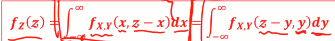
    - 连续随机变量的情况，求和变积分
- 若 X,Y独立？
    - 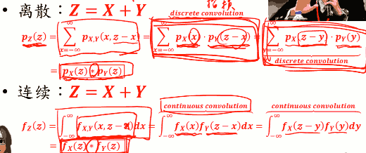
    - 如果你知道X，Y的PMF，而且X，Y独立，那么X+Y的新的PMF就是等于 X的PMF，Y的PMF两个在做 
        - discrete convolution: p<sub>X</sub>(z)*p<sub>Y</sub>(z)
- 如果有不止 两个随机变量？
    - X = X₁+X₂+...+X<sub>n</sub>
    - 若 X₁+X₂+...+X<sub>n</sub> 独立:
        - 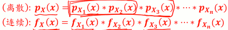

- Convolution 很难算，怎么办?
    - MGF !!!
    - 如果你会用 MGF的话，哇，convolution 太简单了，甚至有时候算都不用算.


<details>
<summary>
Example: Jack’s Car Rental
</summary>

```python
#!/usr/local/bin/python3
import numpy as np
from scipy import stats

"""
Jack经营着一个租车公司。
每天借出的车数量 服从 POISSON( 4 ), 归还的车数量 服从 POISSON(2)。
如果某一天 Jack公司里共20辆车， 问第二天变成19辆车的概率。
"""

def solution_sample():
    nSample = 10000000
    requests = np.random.poisson(4, nSample)
    returns = np.random.poisson( 2, nSample)
    
    # 借出的车，比归还的车多一辆
    s = requests[requests - returns == 1]
    prob = len(s)/nSample

    return prob

def solution_sum():
    s = [ stats.poisson.pmf( i,4 )* stats.poisson.pmf( i-1,2 )  for i in range(20) ] 
    return sum(s)


if __name__ == '__main__':
    print( "solution sample: {}".format( solution_sample() ) )
    print( "solution sum: {}".format( solution_sum() ) )

# solution sample: 0.1563523
# solution sum: 0.15640119832636357
```

</details>

<h2 id="09fcfdc987674ca8b8ddac2800de6f82"></h2>


## 9.2 MGF(MOMENT GENERATING FUNCTION)

- 先看个例子吧!辛苦的红娘业
    - 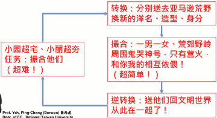
- 回到卷积
    - 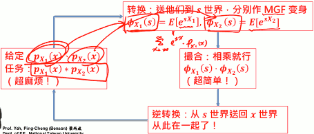
    - 原来这个函数都是在x这个世界，因为他们都是x的函数，我们现在要把它转换到一个新世界S, MGF 就是在S世界改造出来的结果。
        - 把 x 这个函数，转换过去变成s这个函数
        - 我有 X₁的PMF了，我就可以算 X₁的任何函数的期望值了
            - Φ<sub>X₁</sub> = E[ e<sup>sX₁</sup> ] = ∑<sub>x=</sub><sup>∞</sup><sub>-∞</sub>e<sup>sx</sup>·p<sub>X₁</sub>(x)
        - 然后把 Φ<sub>X₁</sub>, Φ<sub>X₂</sub> 相乘，再逆转换 就得到我们要的结果了。
    - 为什么MGF可以做到这个？ 数据学推导出来的...
- MGF 也可以应用到多个随机变数和
    - 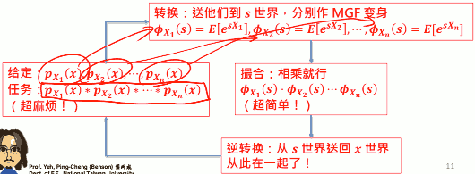
    - 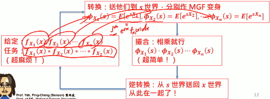


<h2 id="cdd64cb797821d59ddd73236bda46533"></h2>


### MGF 

- MGF ɸ<sub>X</sub>(s) 定义:
    - 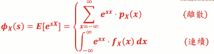
- 逆转换怎么做 ?
    - 通常靠查表法 
    - [Table of Common Distributions](https://www.stat.tamu.edu/~twehrly/611/distab.pdf)
    - [Table of Common Distributions course note](https://github.com/mebusy/course_note/blob/master/course_TaiwanU_probability%20part2%20done/distab.pdf)
- 我说 MGF 为什么叫 MGF 呢 
    - 还记得什么叫 moment吗？ E[Xⁿ] 叫做 nth moment
    - ɸ<sub>X</sub>(s) 跟 moment 有关系吗 ?
    - 离散case
        - 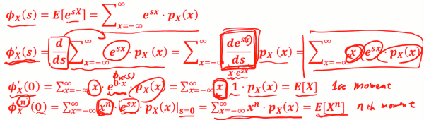
    - 连续case
        - 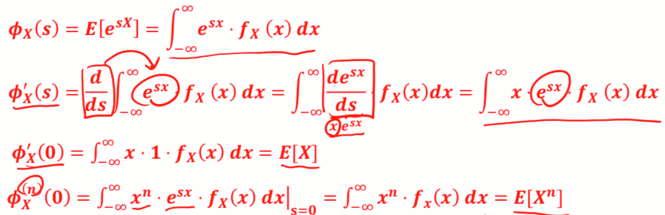
    - 所以這是為什麼就叫 ɸ<sub>X</sub>(s) 叫moment generating function, 因為只要有了它，你就可以生成任何一個moment，


<h2 id="f8dbbf3c577f493b3b6ff0bffd301e3f"></h2>


### MFG重要性质

- MGF 怎么做运算
- Y = aX + b
    - = ɸ<sub>Y</sub>(s) = E[e<sup>sY</sup>] = E[e<sup>s(aX+b)</sup>] 
    - = E[e<sup>saX</sup>·e<sup>sb</sup>]
    - = e<sup>sb</sup>·E[e<sup>saX</sup>]
    - = e<sup>sb</sup> · ɸ<sub>X</sub>(as)

- 上面的期望值里，s不是随机变量，s只是一个变量,可以用期望值运算中拿出来


### 常见离散概率分布 之 MGF

- X~Bernoulli(p):  p<sub>X</sub>(0) = 1-p, p(1)=p
    - ɸ<sub>X</sub>(s) = E[e<sup>sX</sup>] = E[e<sup>s·0</sup>]·p(0) + E[e<sup>s·1</sup>]·p(1)
    - = 1·(1-p) + e<sup>s</sup>·p 
    - = 1-p + pe<sup>s</sup>
- X~BIN(n,p): 做n次实验，成功的次数
    - ⇒ X = X₁+X₂+ ... +X<sub>n</sub>, Xᵢ独立，Xᵢ~Bernoulli(p)
        - 原来 BIN的随机变数，可以表示成n个Bernoulli 随机变数之和
    - ⇒ ɸ<sub>X</sub>(s) = (1-p + pe<sup>s</sup>)ⁿ
- X~Geometric(p):
    - TODO
- X~Pascal(k,p): 看到第k次成功，花的总实验次数
    - ⇒ X = X₁+X₂+ ... +X<sub>n</sub>, Xᵢ独立，Xᵢ~Geometric(p)
        - 第一次成功花了多少次 + 第2次成功花了多少次 + ... 第k次成功花了多少次
    - TODO , ( ɸ<sub>Xᵢ</sub>(s) )ᵏ
- X~Poisson(a):
    - TODO
- X~UNIF(a,b):
    - TODO


### 常见连续概率分布之 MGF


- X~Exponential(λ):
    - TODO
- X~Erlang(n,λ):
    - ⇒ X = X₁+X₂+ ... +X<sub>n</sub>, Xᵢ独立，Xᵢ~Exponential(p)

- X~UNIF(a,b):
    - TODO
- X~Gaussian(μ,σ):  (  N( μ,σ² ) )
    - e<sup>μs+σ/2·s²</sup>


## 9.3 多个随机变数之和

### 独立随机变数之和

- X₁,X₂, ...独立， 且各自都有一摸一样的概率分布，表示为
    - {Xᵢ}, I.I.D
    - Independently and Identically Distributed
- X = X₁+X₂+ ... +X<sub>n</sub>, **n为常数**, 请问X的几率分布?
    - 离散: p<sub>X</sub>(x) = p<sub>X₁</sub>(x)*p<sub>X₁</sub>(x)*...*p<sub>X₁</sub>(x)  (做卷积)
    - 连续: f<sub>X</sub>(x) = f<sub>X₁</sub>(x)*f<sub>X₁</sub>(x)*...*f<sub>X₁</sub>(x)  (做卷积)
    - ɸ<sub>X</sub>(s) = ( ɸ<sub>X₁</sub>(s) )ⁿ

- Ex: 将太的寿司
    - 寿司饭团的理想重量是13g， 将太出当学徒，每次抓饭量为 正态分布，μ=14,σ=3。师傅要将太每天练习做 100个寿司才能休息，做完的寿司都得自己吃掉。请问将太每天吃的饭量的几率分布？
    - Xᵢ: 第i个寿司的饭量，{Xᵢ} I.I.D.
    - Xᵢ~N(14,9) ⇒ ɸ<sub>X₁</sub>(s) = e<sup>μs+σ/2·s²</sup> = e<sup>14s+9/2·s²</sup>
    - X = X₁+X₂+ ... +X₁₀₀
        - ⇒ ɸ<sub>X</sub>(s) = ( ɸ<sub>X₁</sub>(s) )¹⁰⁰ = ( e<sup>14s+9/2·s²</sup> )¹⁰⁰ = e<sup>1400s+900/2·s²</sup> -> N(1400,900)
        - ⇒ X~N(1400,900)

### 随机个数个 独立随机变数之和

- X₁,X₂,... I.I.D.
    - X = X₁+X₂+ ... +X<sub>N</sub>
    - 若N本身也是**随机变数，其几率分布已知**， 那X的几率分布找的到吗？
- N: p<sub>N</sub>(n) 已知
    - 我们可以得到它的 MGF, 这里我们用 s֮ 来代替s ( 因为ɸ<sub>X</sub> 会用到s )
    - ⇒ ɸ<sub>N</sub>(s֮) = ∑<sub>n=0</sub><sup>∞</sup> e<sup>s֮n</sup>·p<sub>N</sub>(n)
- ɸ<sub>X</sub> = E[ e<sup>sX</sup> ] = E[ e<sup>sX₁</sup> + e<sup>sX₂</sup> + ... + e<sup>sX<sub>N</sub></sup> ]
    - = E[ e<sup>sX₁</sup> · e<sup>sX₂</sup> · ... · e<sup>sX<sub>N</sub></sup> ]
        - N 虽然是个随机变量，但是你可以先把它留着，先把N当成一个常数
        - 这N个东西相乘再取期望值， 可以变成 各自的期望值 相乘, 只要它们独立，就有这样的特性
        - 但是因因为N是随机变量,  所以最好还要对 N 做一次取期望值
    - = E<sub>N</sub>[ E[e<sup>sX₁</sup>] · E[e<sup>sX₂</sup>] · ... · E[e<sup>sX<sub>N</sub></sup>] ]
    - = E<sub>N</sub> [ (ɸ<sub>X₁</sub>(s))ᴺ ] = ∑<sub>n=0</sub><sup>∞</sup> (ɸ<sub>X₁</sub>(s))ⁿ·p<sub>N</sub>(n)
    - = ∑<sub>n=0</sub><sup>∞</sup> e<sup>ln(ɸ<sub>X₁</sub>(s))n</sup> ·p<sub>N</sub>(n)
        - 当 s֮ = (ln ɸ<sub>X₁</sub>(s) ),  则  ɸ<sub>N</sub>(s֮)  = ɸ<sub>X</sub> 
    - = ɸ<sub>N</sub>( ln ɸ<sub>X₁</sub>(s) )
        - 即，通过 N 和 X₁ 的MGF 可以合成 X 的MGF

- EX: 如果不景气呢
    - 因为不景气，师傅的生意有一搭没一搭，没那么多钱让将太挥霍。每天可以联系的寿司数量是有当天生意决定的。每天可以联系寿司数量是一个 Poisson分布，期望值为75； 将太功夫依然没有长进，每次抓的饭量为常态分布，μ=14,σ=4(退步了)。 请问将太每天吃的饭量的概率分布。
    - N~POI(75) =>  ɸ<sub>N</sub>(s֮) = e<sup>75(e<sup>s֮</sup> -1)</sup>
    - X = X₁+X₂+ ... +X<sub>N</sub> ~ N(14,16) => ɸ<sub>X₁</sub>(s) = e<sup>14s+8s²</sup>
    - ɸ<sub>X</sub>(s) = ɸ<sub>N</sub>( ln ɸ<sub>X₁</sub>(s) ) 
        - = e<sup>75(e<sup>ln ɸ<sub>X₁</sub>(s)</sup> -1)</sup> 
        - = e<sup>75( ɸ<sub>X₁</sub>(s) -1)</sup>
        - = e<sup>75( e<sup>14s+8s²</sup> -1)</sup>


## 9.4 中央極限定理-萬佛朝宗


- 数个独立 UNIF 随机变量之和 的 PDF
    - 
- 数个独立 EXP 随机变量之和 的 PDF
    - 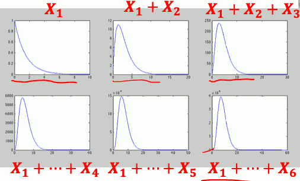
- 数个独立 Laplace 随机变量之和 的 PDF
    - 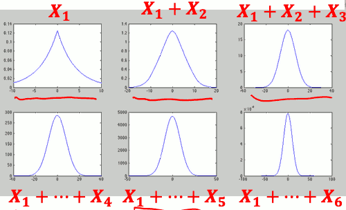

- 我们，如果是连续的随机变数， 你n个I.I.D 加起来以后，你新的PDF 看起来 会越来越像 常态分布。

- 数个独立 Uniform **离散**随机变数之和
    - 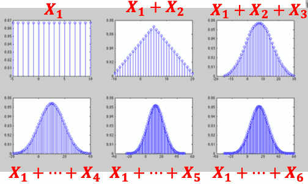
- 数个独立 Geometric **离散**随机变数之和
    - 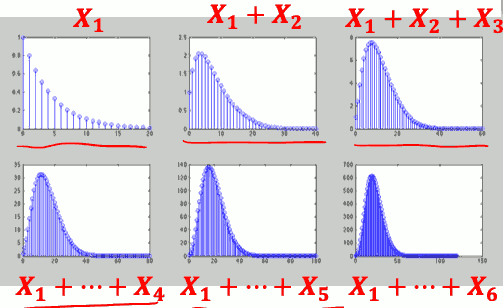


- 中央极限定律 ( Central Limit Theorem )
    - 若 X₁+X₂+ ... +X<sub>n</sub> 为 I.I.D,
    - 则当 n 越接近 ∞ 时:
    - 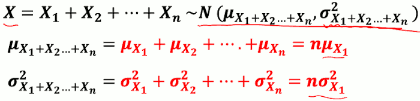


### 中央极限定律(CLT)的应用

- 当要处理多个独立的随机变量I.I.D的 和时，我们可以 CLT 将其机率分布近似为 常态分布后计算机率
    - 因为很多随机变数如果加在一起，你一定要去计算出exact概率分布，那它可能不好算
    - 虽然可以使用 MGF，但有时候你转换做不出的话， 你就没有办法算出它的 PMF/PDF
    - ex: 电路杂讯 ~N
- 另若某机率分布等同于多个独立随机变量 的和，此机率分布便可以用常态分布近似 之，再计算概率
    - ex: X~BIN(100,0.3)
        - X = X₁+X₂+ ... +X₁₀₀, {Xᵢ} I.I.D. , Xᵢ~Berinoulli(0.3)
        - 会非常接近常态分布, 所以也可以使用 常态分布来 近似计算概率分布

- Ex: 天团五五六六有百万粉丝。每位粉丝各自独立， 但有 0.2 的机率会买天团发片的 CD。若是天团 发精选辑，请问天团精选辑发售超过 200800 张之机率为何?
    - X~BIN( 1000000, 0.2 ) => P( X>200800 )  计算量非常大
    - X = X₁+X₂+ ... +X₁₀₀, {Xᵢ} I.I.D. , Xᵢ~Berinoulli(0.2) 
        - => μ<sub>X</sub> = 0.2 * 1000000 = 200000
        - => σ²<sub>X</sub> = 0.16 * 1000000 = 160000
        - By CLT =>  X~N( 200000, 160000 )
        - P(X>200800) = P( (X-200000)/400 > (200800-200000)/400  ) = P( Z > 2 ) ( Z ~N(0,1) )
    - scipy 
        ```python
        1 - stats.norm.cdf( 200800 , 200000, 400 )
        >>> 0.02275013194817921
        1 - stats.norm.cdf( 2 )  # N(0,1)
        >>> 0.02275013194817921
        1 - stats.binom.cdf( 200800, 1000000 , 0.2 )
        >>> 0.022723129753990712
        ```

- 若X是**离散**的随机变数和...
    - 我们可以算得更精确!
    - De Moivre - Laplace Formula:
    - 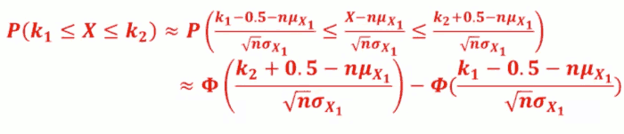
    - 要计算 X 落在 k₁,k₂之间的几率，加一个修正项0.5， 不要直接算。 即 计算  k₁-0.5, k₂+0.5 之间的几率
    - 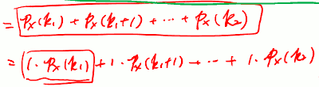
        - 这里ɸ是指norm cdf?
    - 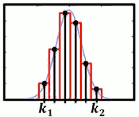  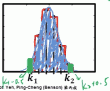
        - 加上 ±0.5, 把两个小绿块计算进去
- Ex: 萱萱为 5566 忠实粉丝，帮粉友去 20 家店 买 CD。每家店限购一张，缺货机率 0.5。 请问萱萱买到 7 张之机率为 ?
    - X~BIN( 20, 0.5) => Xᵢ~Berinoulli(0.5)
    - => X~N( 20*0.5, 20*0.25 ) = N(10,5)
    - => P(7) = P(7≤X≤7) = 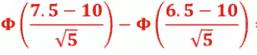
    - scipy
        ```python
        >>> stats.binom.pmf( 7, 20, 0.5 )
        0.07392883300781268
        >>> stats.norm.cdf( (7.5-10)/(5**0.5) ) - stats.norm.cdf( (6.5-10)/(5**0.5) )
        0.07301380459316678
        ```
---


