...menustart

 - [5-1: 机率密度函数 PDF (PROBABILITY DENSITY FUNCTION)](#fc548c0411701f3a57c7799ad18245e3)
     - [PDF](#bcd1b68617759b1dfcff0403a6b5a8d1)
     - [PDF 跟机率的关系](#0b821c7256491cd7494160a47d4a1023)
     - [PDF 有哪些性质呢?](#5bc2e5b291e2fbe5196f9a425ad6a0c9)
 - [5-2: 连续机率分布 I (CONTINUOUS PROBABILITY DISTRIBUTION)](#423296d40fd5d59d1f076d73508c42e6)
     - [Uniform 机率分布](#f7bf1cb803a0ab0539a6dc3ed526dd4f)
     - [Exponential 机率分布](#894ad572b4888ac89196f741cd003480)
         - [指数分布和 柏松分布之间的关系](#a781eb710c59f5f1dffeb4d79e0bf04d)
         - [指数分布和 几何分布之间的关系](#ee8d241828945ff9c5d39465a5c65f25)
         - [指数分布和 uniform 分布的关系](#dc45153d24cf787ea2b2917ec03ca044)
         - [指数分布和 正态分布的关系](#6d91070e066c0b53115e187e5f194191)
     - [Erlang 机率分布](#7d09f590df9dfcbd10d1b8cbffce9514)
         - [Erlang 和 Exponential  关系](#a37b5c85c6d082e170925dbe09051a82)
 - [Week6](#63995e860d87301917bfed4525e36993)
     - [6-1: 连续微积分分布 II ( CONTINUOUS PROBABILITY DISTRIBUTIONS )](#292420e2932b158fe9de18af72e0f2ff)
         - [Normal 机率分布(常态分布)](#a638878f993f94c84c6c050963d0f635)
             - [Standard Normal Distribution 标准常态分布](#b672e9679aa32ead876e8b9c6c43d78c)
     - [6-2: 期望值 I (EXPECTATION)](#699f5bed3f92e270bce0a95ed5bf89d3)
         - [随机变量的函数之期望值](#7a410c29ec1783458c2d5c679f790eee)
         - [期望值运算性质](#09a5fcc38b3f4c96f745b665bfb42cea)
         - [常见的随机变量函数期望值](#487e3e26c9963764a55fe4f8b597d389)
         - [变异数 (variance)](#d43aa7d625393a9c328a86c60568b12e)
         - [Variance 便利算法](#d57572a47dea71843856503c0ef5c154)
         - [常见离散分布之期望值/变异数](#33805636b57d3a4f61be9c79a1d93947)
         - [几率推导奥义： 「凑」字诀](#367685545196820c0c173d14fe4c9421)
         - [Quiz](#ab458f4b361834dd802e4f40d31b5ebc)

...menuend


<h2 id="fc548c0411701f3a57c7799ad18245e3"></h2>


# 5-1: 机率密度函数 PDF (PROBABILITY DENSITY FUNCTION)

<h2 id="bcd1b68617759b1dfcff0403a6b5a8d1"></h2>


## PDF 

 - 离散的随机变数有 PMF 告诉我们 某个数字发生的机率
 - 连续变数的机率分布常有不均等的情况发生， Ex: 睡觉的时间长度
 - 对连续的随机变量，我们也想知道某个数字 发生的机会多大，可以用 PMF 吗?

---

 - 连续Random Variable  的先天问题
 - 每个数字发生的机率都是 0!
 - 还是很想知道在某个数字发生的机会多大， 怎么办?
 - 先看个乱七八糟的例子
    - 因为拍戏，特别订做合金宝剑
    - 铜、金打造，如何得知有无偷工减料?
    - 整根有质量，但是每点质量都是零?好熟悉!
    - 不看质量看什么?看密度!
    - 密度 at x ≈ (质量 in [x,x+Δx])/Δx  (Δx→0)

---

 - 连续的东西，关键是密度!
 - 宝剑有密度，机率也可有密度!
 - 对随机变数 𝑿 而言，其机率密度:

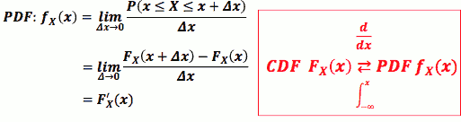

<h2 id="0b821c7256491cd7494160a47d4a1023"></h2>


## PDF 跟机率的关系

 - 因为我们习惯处理机率，看到 PDF 如何把它跟机率连结呢?

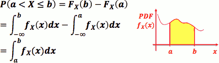
 
 - PDF 是 CDF 的微分, CDF 是 PDF 的积分
 - fₓ(x) = lim<sub>Δx→0</sub> P(x≤ X ≤x+Δx)/Δx 
 - 当 Δx 很小时：P(x≤ X ≤x+Δx) = fₓ(x)·Δx
 - 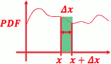

<h2 id="5bc2e5b291e2fbe5196f9a425ad6a0c9"></h2>


## PDF 有哪些性质呢?

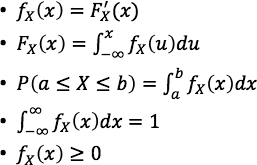

---

<h2 id="423296d40fd5d59d1f076d73508c42e6"></h2>


# 5-2: 连续机率分布 I (CONTINUOUS PROBABILITY DISTRIBUTION)

<h2 id="f7bf1cb803a0ab0539a6dc3ed526dd4f"></h2>


## Uniform 机率分布

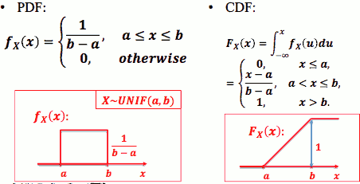

 - Ex: 已知1路公交车每十分钟一班。 小美随意出发到公车站，小美须等候公交 车之时间为 X

<h2 id="894ad572b4888ac89196f741cd003480"></h2>


## Exponential 机率分布

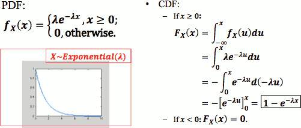

```python
import scipy, scipy.stats
x = scipy.linspace(0,10,11)
lamda = 1
pmf = scipy.stats.expon.pdf(x, 0, 1.0/lamda)
cdf = scipy.stats.expon.cdf(x, 0, 1.0/lamda)
import pylab
pylab.plot(x,pmf)
pylab.plot(x,cdf,color="red")
pylab.show()
```

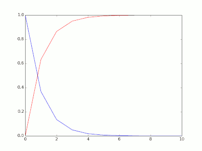

 - 连续的"几何分布" ?
 - 非常漂亮的CDF积分
 - Exponential 分布有失忆的性质 (memoryless)，常被用来 model 有这种性质 的事情
    - Ex: 小美出门化妆所需之时间
    - Ex: 某宅打LOL所花的时间
    - 指数函数的无记忆性来自于泊松过程k=0时的 时间指数性，而泊松过程k=0时的 时间指数性 来自于泊松分布时 lambda的恒定性，也就是离散情况下，二项分布的n*p的恒定性。
 - The only memoryless continuous probability distributions are the exponential distributions,
    - `P( X>t+s | X>t ) = P( X>s )`.

```bash
   P( X>t+s | X>t ) = P( X>s )
=> P( X>t+s , X>t ) / P(X>t) = P( X>s )
=> P( X>t+s  ) / P(X>t) = P( X>s )
   let G(t) = P(X>t) 
=> G(t+s) = G(t)G(s)
=> G(a) = G(1)ª  
```

G(a) = G(1)ª = e<sup>log(G(1))·a</sup>

--- 

 - Q: 柯仔在學校的中午都會去跑操場，但是他用意並不是訓練強健的體魄，而是要撿拾別人遺落在跑道邊的金錢。假設柯仔經過長期的經驗與訓練，不管在任何天氣或是體力的影響下，都可以保持一定的速度 1 m/s(公尺每秒)，而在這個速度之下，柯仔平均跑 300 m(公尺) 可以發現一次遺落的錢。隨機變數X代表柯仔開始跑步到撿到錢為止所跑的距離，已知X是個 Exponential Distribution。
    - 請問柯仔跑超過5分鐘才撿到錢的機率是多少?
 - A: 柏松分布 单位时间(300s) λ = 1 ，
    - 5分钟内 捡到钱的概率 P(x≤1) = F( 1 ) = 1 - e⁻¹
    - 5分钟后 捡到钱的概率 P(x>1 ) = 1 - F(1) = e⁻¹ = 0.37
        ```python
        >>> 1.0 - scipy.stats.expon.cdf(1,0,1)
        0.36787944117144233
        ```

---

<h2 id="a781eb710c59f5f1dffeb4d79e0bf04d"></h2>


### 指数分布和 柏松分布之间的关系

 - 定理一：设随机变量 X 服从参数为 λT的柏松分布，则 两次发生之间的“等待时间”Y 服从参数为 λ的指数分布。
 - 泊松分布
    - 泊松分布的参数λ是单位时间(或单位面积)内随机事件的平均发生率
    - 泊松分布适合于描述单位时间(或空间)内随机事件发生的次数
    - 参数λ 由二项分布的期望np决定，λ=np，表示该时间(空间)段内的事件发生的频率。
    - eg. 一本书里，印刷错误的字的个数
        - 泊松分布 表示一般情况下，书内(空间)的出错的频率(期望)，n代表所有的字数，p代表印刷错误的概率，k表示印刷错的字数。
        - 当n很大，p很小的时候，二项分布的极限是泊松分布。
            - 这个例子同样可以用二项分布的角度来解释：每印刷一个字，表示一次伯努利实验（n代表所有的字数，p代表印刷错误的概率，k表示印刷错的字数
        - 当n继续变大，为连续变量的时候，二项分布的极限又成了正态分布（正态分布是所有分布趋于极限大样本的分布）。
 - 指数分布
    - 指数分布是泊松过程的事件间隔的分布
    - 泊松分布表示的是事件发生的次数，“次数”这个是离散变量，所以泊松分布是离散随机变量的分布；
    - 指数分布是两件事情发生的平均间隔时间，“时间”是连续变量，所以指数分布是一种连续随机变量的分布。
    - 指数分布λ 的含义就是泊松分布中的λ

<h2 id="ee8d241828945ff9c5d39465a5c65f25"></h2>


### 指数分布和 几何分布之间的关系

 - 都是失忆性分布
 - 期望值都是 倒数 形式
 - 服从指数分布的随机变量，可以表示 某些易碎品的 寿命， 如电子元件，玻璃制品。 虽然它们的寿命与多种因素有关，但是有一种因素是决定性的。它正好与 “服从正态分布是与 多种相互独立的因素有关，但是没有一种因素是起决定作用” 相反。
 - 几何分布 是一种 “直到 。。。为止” 型概率分布，也是一种 “寿命”。
 - 相互独立的设计，直到击中为止，射击次数服从几何分布。被枪手离散地射击，直到击中，它的寿命 就 "为止"了

<h2 id="dc45153d24cf787ea2b2917ec03ca044"></h2>


### 指数分布和 uniform 分布的关系

 - 定理2: 随机变量Y 服从参数为 λ 的指数分布的充要条件是 随机变量 Y = 1-e<sup>-λx</sup> 服从(0,1) 上的均匀分布。

<h2 id="6d91070e066c0b53115e187e5f194191"></h2>


### 指数分布和 正态分布的关系

 - 定理3: 随机变量 X,Y 相互独立，都服从正态分布N(0,λ²) , 则 Z=X²+Y² 服从指数分布。


---

<h2 id="7d09f590df9dfcbd10d1b8cbffce9514"></h2>


## Erlang 机率分布

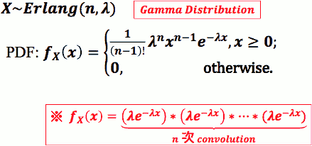

 - CDF:

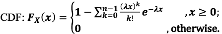

```python
import scipy, scipy.stats
x = scipy.linspace(0,10,11)
lamda = 1
pmf = scipy.stats.erlang.pdf(x, 3, 0, 1.0/lamda)
cdf = scipy.stats.erlang.cdf(x, 3, 0, 1.0/lamda)
import pylab
pylab.plot(x,pmf)
pylab.plot(x,cdf,color="red")
pylab.show()
```

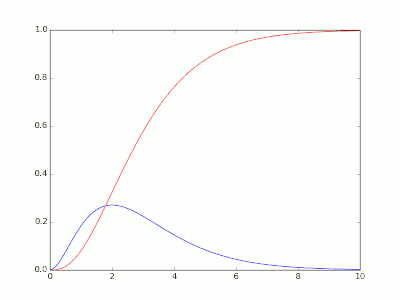

--- 

<h2 id="a37b5c85c6d082e170925dbe09051a82"></h2>


### Erlang 和 Exponential  关系

 - Erlang(n,λ) 常被用来model 一件有多个关卡事情的总时间，而每个关卡所 需时间都是随机的 
    - 关卡数: n
    - 每关卡所需时间之机率分布: Exponential( λ )
    - Ex: 打电动过三关所需时间: Erlang(3, λ)
    - Ex: 写完五科作业所需时间

---

<h2 id="63995e860d87301917bfed4525e36993"></h2>


# Week6 

<h2 id="292420e2932b158fe9de18af72e0f2ff"></h2>


## 6-1: 连续微积分分布 II ( CONTINUOUS PROBABILITY DISTRIBUTIONS )

<h2 id="a638878f993f94c84c6c050963d0f635"></h2>


### Normal 机率分布(常态分布)

 - 常态分布在自然界很常出现
    - Ex: 人口身高分布、体重分布
 - 亦常被用作「很多随机量的总合」的机率模型
    - Ex: 100 人吃饭时间的总合
    - 原因:来自最后会讲到的「中央极限定理」
 - 常态分布，亦常被称作Gaussian (高斯) 机率分布 
 - X ~ Gaussian ( μ,σ )
    - 也常有人用 X ~ N( μ,σ² ) 表示
    - 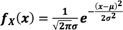
    - 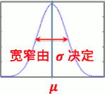
 - CDF是多少?
    - 很难算，积分根本算不出来!
    - 用数值积分法去建表?
        - 很难啊，因为不同的 μ,σ 就会造就 出不同的 常态分布 PDF，每个都要建一个表会要命啊!
    -  怎么办?
        - 有没有办法找到一组特别 μ,σ  ，先针对这组的 CDF 建表， 然后想办法把别的常态分布的 CDF 跟这组 CDF 牵上关系?
        - 若能牵扯上，再利用这表去算出别的常态分布的 CDF 值?

<h2 id="b672e9679aa32ead876e8b9c6c43d78c"></h2>


#### Standard Normal Distribution 标准常态分布

 - Z ~ N( 0,1 )
    - 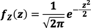
    - 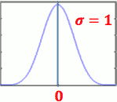
 - CDF 表示为:
    - 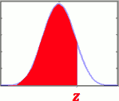
    - 积不出来，只能以数值方法近似出来后建表 给人家查
    - 网络上或是工程计算器上常能找到
 - Φ(z) 的性质：
    - Φ(-z)= 1 - Φ(z) 
    - 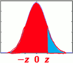 

--- 

 - 任意 μ,σ 下的 CDF ？
    - 任意 μ,σ 下的 CDF , 我们要把它跟 N(0,1) 牵上关系
    - 「关系!」: 对任何  X ~ N( μ,σ² ) 而言， (X-μ)/σ ~ N(0,1) 
        - 证明：略
    - 对任何 X ~ N( μ,σ² )  而言 , F<sub>X</sub>(x) = Φ( (x-μ)/σ ) .
        - 证明：

```
Fₓ(x) = P( X≤x )
      = P( X-μ ≤ x-μ )
      = P( (X-μ)/σ ≤ (x-μ)/σ )
      = Φ( (x-μ)/σ )
```

 - Ex. 已知 10 名水源阿伯每日拖车总重量总和 X ~ N(500, 100²) (kg) , 问本日总重量少于700 之机率为 ？
    - F<sub>X</sub>(700) = P( X≤700 ) = P( (X-μ)/σ ≤ (700-500)/100 ) = Φ(2) = 0.977
        ```python
        >>> scipy.stats.norm.cdf( 700, 500,100 )
        0.97724986805182079
        ```

---


<h2 id="699f5bed3f92e270bce0a95ed5bf89d3"></h2>


## 6-2: 期望值 I (EXPECTATION)

 - 大数法则
    - 想知道某事件发生的机率?
    - 作很多次实验，记录实验中出现那个事件多少次。当实验次数接近无穷 多次时，这个比例就会越来越接近实际的机率!
    - P(A) = lim<sub>N→∞</sub> (N<sub>A</sub>/N)
 - 期望值 (Expectation)
    - 做随机实验时，我们很希望能有某种估算
    - 平均值是我们平常最常普遍的估算值
    - 作两次实验的平均值是? (X₁+X₂)/2 = ?
    - 不管我们做多少次实验，平均值都是一个随机变数，那不就 不能拿来估算?
    - 所幸!当做的实验次数趋近于无穷多时，这么多次的实验的平均值 会收敛到一个常数!我们就用它来当作这机率分布的估算值吧!
 - 若考虑某机率分布，作实验很多次若随机实验之样本空间为 {1,2, ... ,n}, 作实验N次，记录各结果出现 次数，分别为N₁,N₂,...N<sub>n</sub>
    - 平均值 (Mean): ∑<sub>x=</sub>ⁿ₁ (x·Nₓ)/N
    - 根据大数法则 : ∑<sub>x=</sub>ⁿ₁ x·P<sub>X</sub>(x)
 - Mean 值又称作期望值
    - μ<sub>Y</sub> = E[Y]
    - 对离散随机变数 𝑿 而言，我们定义其期望值 
        - E[X] = μ<sub>X</sub> = ∑<sub>x=</sub><sup>∞</sup><sub>-∞</sub> x·P<sub>X</sub>(x) 
    - **期望值不等于随机会发生的值**!
        - eg. P<sub>X</sub>(1) = P<sub>X</sub>(-1) = 1/2 => μ<sub>X</sub> = 0 !!! 

 
<h2 id="7a410c29ec1783458c2d5c679f790eee"></h2>


### 随机变量的函数之期望值

 - 对于任一离散随机变量 X 而言，其 任意函数 g(X) 亦是一随机变量，亦有期望值
 - g(X) 期望值定义为
    - E[ g(X) ] = ∑<sub>x=</sub><sup>∞</sup><sub>-∞</sub> g(x)·P<sub>X</sub>(x) 
    - 根随即变量的期望值公式相比，只是 x 变成了 g(x)

<h2 id="09a5fcc38b3f4c96f745b665bfb42cea"></h2>


### 期望值运算性质

 - E[ 3X² ] = ∑<sub>x=</sub><sup>∞</sup><sub>-∞</sub> 3x²·P<sub>X</sub>(x) 
    - = 3·∑<sub>x=</sub><sup>∞</sup><sub>-∞</sub> x²·P<sub>X</sub>(x)  = 3·E( X² )
    - 常数项可以提出来
 - E[α·g(X)] = α·E[g(X)] 
 - E[α·g(X) + β·h(X) ] = α·E[g(X)] + β·E[h(X)]
 - E[α] = α
 
<h2 id="487e3e26c9963764a55fe4f8b597d389"></h2>


### 常见的随机变量函数期望值
 
 - X 的 n<sup>th</sup> moment:
    - E[Xⁿ] = ∑<sub>x=</sub><sup>∞</sup><sub>-∞</sub> xⁿ·P<sub>X</sub>(x)  
    - Ex: E[X²] 是 X的 2<sup>nd</sup> moment
 - X 的变异数 (variance):
    - E[ (X-μ<sub>X</sub>)² ] 
    - 减去 期望值的 平方

<h2 id="d43aa7d625393a9c328a86c60568b12e"></h2>


### 变异数 (variance)

 - Variance通常符号表示为 σ<sub>X</sub>² = E[ (X-μ<sub>X</sub>)² ] 
 - 变异数隐含关于随机变数 X 多「乱」的信息
 - 变异数的开根号便是标准差 (standard deviation)
    - σ<sub>X</sub> = √Variance

<h2 id="d57572a47dea71843856503c0ef5c154"></h2>


### Variance 便利算法

 - σ<sub>X</sub>² = E[ (X-μ<sub>X</sub>)² ]
    - = E[ X²-2μ<sub>X</sub>·X+μ<sub>X</sub>² ]
    - = E[X²] + E[-2μ<sub>X</sub>·X] + E[ μ<sub>X</sub>² ]
    - = E[X²] - 2μ<sub>X</sub>·E[X] + μ<sub>X</sub>²
    - = E[X²] - μ<sub>X</sub>² 

 - => E[X²] = σ<sub>X</sub>² + μ<sub>X</sub>²  


<h2 id="33805636b57d3a4f61be9c79a1d93947"></h2>


### 常见离散分布之期望值/变异数

 - X~Bernouli(p) :
    - μ<sub>X</sub> = 1·p + 0·(1-p) = p
    - σ<sub>X</sub>² = E[X²] - μ<sub>X</sub>² = ∑<sub>x=</sub>¹₀ x²·p<sub>X</sub>(x) - μ<sub>X</sub>²
        - = 1²·p + 0²·(1-p) - p² = p(1-p)
 - X~BIN(n,p) :
    - μ<sub>X</sub> = np
    - σ<sub>X</sub>² = np(1-p)
 - X~GEO(p) :
    - μ<sub>X</sub> = ∑<sub>x=</sub><sup>∞</sup><sub>0</sub> x· (1-p)<sup>x-1</sup>·p = 1/p 
    - σ<sub>X</sub>² = E[X²] - μ<sub>X</sub>² = (1-p)/p²
 - X~PASKAL(k,p) :
    - μ<sub>X</sub> = k/p
    - σ<sub>X</sub>² = k(1-p)/p²  
 - X~POI(α) :
    - μ<sub>X</sub> = α
    - σ<sub>X</sub>² = α 
 - X~UNIF(a,b) :
    - μ<sub>X</sub> = (a+b)/2
    - σ<sub>X</sub>² = 1/12·(b-a)(b-a+2)

<h2 id="367685545196820c0c173d14fe4c9421"></h2>


### 几率推导奥义： 「凑」字诀

 - 以 X~POI(a) 为例
 - X~POI(a) 概率公式是什么？
    - P<sub>X</sub>(x) = (aˣ/x!)·e⁻ª , x=0,1,2,... 
 - 我们手上能利用的公式有哪些？
    - ∑<sub>x=</sub><sup>∞</sup><sub>0</sub> (aˣ/x!)·e⁻ª = 1
 - 开始推导:  

---

E[X] = ∑<sub>x=</sub><sup>∞</sup><sub>0</sub> x·(aˣ/x!)·e⁻ª 

x 和 x！约分，变成 (x-1)! , 这样 ∑ 运算就不能包括 x=0了， 因为 阶乘对负数没有定义

 E[X] = ∑<sub>x=</sub><sup>∞</sup><sub>1</sub> (aˣ/(x-1)!)·e⁻ª 

使 a 的指数形式 和 阶乘 保持一致

 E[X] = a·∑<sub>x=</sub><sup>∞</sup><sub>1</sub> (aˣ⁻¹/(x-1)!)·e⁻ª 

令 x' = x-1 

 E[X] = a· ∑<sub>x'=</sub><sup>∞</sup><sub>0</sub>  (aˣ<sup>'</sup>/x'!)·e⁻ª = a·1 = a 
 
--- 


σ<sub>X</sub>² = E[X²] - μ<sub>X</sub>² = E[X²] - a² 

和 E[X] 类似， 可以推导处 E[X²] =  a² + a , 所以

σ<sub>X</sub>² =  a 

---


<h2 id="ab458f4b361834dd802e4f40d31b5ebc"></h2>


### Quiz

阿壘投籃平均進球率是 60% ，某日他好友阿拓在旁提議 ，如果阿壘可以連續進 10球，就停止射球並且阿拓會請阿壘一瓶運動飲料。隨機變數B是指阿壘這場賭注裡總共的進籃球數 (ex: B=6 就是指阿壘只投進六球，第七球沒投進)，則請問 E[B]=?

 - note: 这题条件不是严格的几何分布，因为最多到10球就结束了
 - 解法：枚举

```python
>>> p = 0.4
>>> r = 0
>>> for nBallScore in xrange(11):
...     x = nBallScore +1 
...     r += (1-p)**(x-1)*( p if nBallScore <10 else 1 ) * nBallScore
... 
>>> r
1.4909300736
```

某國的籃球 聯盟季後賽，由東隊對上 西隊 ，要在 5場比賽內決定 誰是這國家今 年最強的籃球 隊伍，當某一隊伍 取得 3場勝利的時候 ，這季後 賽馬上就結束確 定由三勝的球隊取得最後的冠軍寶座 。假設按照 幾年來的對戰統計 ，一場東隊 碰上西隊 的比賽，東隊獲勝的機率 是 60 %，而西隊獲勝的機率 則是 40 %。隨機變 數 N代表這次季後賽在總冠軍確定時，總共比賽的場數。請問N的期望值是?

 - 同样，这也不是 PASKAL 分布，因为到第5场就结束了
 - 4.07

```
>>> p = 0.6
>>> 
>>> 3*p**3 + 3*(1-p)**3
0.84

>>> 4*p**3*(1-p)*3 + 4*(1-p)**3*p *3
1.4976

>>> 5*p**2*(1-p)**2 * 6 
1.7280000000000002

>>> 1.7280000000000002 + 1.4976 + 0.84
4.0656
```


# Week7 

## 7-1 期望值II

- 对连续的随机变数X而言，想求期望值，我们用类似 离散随机变数的方式出发
- 将X的值 以Δ为单位 无条件舍去来近似结果 离散随机变数 Y 
    - 当 Δ → 0时， X≈Y , 当Δ趋近0的时候，Y接近Y
    - X∈[0,1Δ) -> Y=0Δ
    - X∈[1Δ,2Δ) -> Y=1Δ
    - X∈[nΔ,(n+1Δ) -> Y=nΔ
- 根据第五周
    - p<sub>Y</sub>(nΔ) = P(nΔ ≤ X < nΔ+Δ) ≈ f<sub>X</sub>(nΔ)·Δ
- E[X] = lim<sub>Δ→0</sub>E[Y] = lim<sub>Δ→0</sub> ∑<sub>n=-∞</sub><sup>∞</sup> nΔ·P<sub>Y</sub>(nΔ)
    - = ∫<sub>-∞</sub><sup>∞</sup> xf<sub>X</sub>(x)dx
    - 即， x乘上pdf,然后积分

### 随机变数函数 期望值

- 对于任一连续随机变数X，其任意函数g(X)亦是一随机变数
    - E[g(X)] = ∫<sub>-∞</sub><sup>∞</sup> g(x)f<sub>X</sub>(x)dx

### 常见连续分布的期望值/变异数

- X ~ Exponential(λ)
    - μ = 1/λ
    - σ² = 1/λ²
- X ~ Erlang(n,λ)
    - μ = n/λ
    - σ² = n/λ²
- X ~ Gaussian(μ,σ)
    - μ = μ
    - σ² = σ²
- X ~ UNIF(a,b)
    - μ = (a+b)/2
    - σ² = 1/12 · (b-a)²

### 期望值推导

- 一些有用的微积分性质
    - e<sup>`*`</sup>𝑑`*` = 𝑑e<sup>`*`</sup>
    - ∫U𝑑V = UV - ∫VdU
    - ∫c𝑑x = ∫𝑑cx  , c 是常数
    - ∫pdf = 1

## 7.2 隨機變數之函數

- 随机变数X的任意函数g(X)也是一个随机变数
- 通常被称为 Derived Random Variable
    - 从 random variable X 衍生出来的一个新的random variable


### 如何求 g(X)几率分布?

- 若X为离散
    - 直接推 g(X) 的 PMF
- 若X为连续
    - 先推 g(X)的CDF， 再微分得到PDF

- Ex:某宅宅超爱战LOL。每次一战就连续战 𝑿 场不可收拾，已知 𝑿~GEO(0.2)。某宅宅内心仍有 一点清明，其良心亦会因战过度而内疚，依战的次数 多寡，内疚程度 𝒀分别为1, 2, 3 不同等级:
    ```
               ⎧ 1, if 1≤X≤3
    Y = g(X) = ⎨ 2, if 4≤X≤6
               ⎩ 3, if X≥7
    ```
    - 问Y=g(X)的几率分布?
    - 解: X~GEO(0.2) => p<sub>X</sub>(x) = (1-0.2)<sup>x-1</sup>·0.2
        - p<sub>Y</sub>(1) = p<sub>X</sub>(1)+p<sub>X</sub>(2)+p<sub>X</sub>(3) 
            - = 0.2 + 0.8·0.2 + 0.8²·0.2
        - p<sub>Y</sub>(2) = p<sub>X</sub>(4)+p<sub>X</sub>(5)+p<sub>X</sub>(6) 
            - = (0.8)³·0.2 + (0.8)⁴·0.2 + (0.8)⁵·0.2
        - p<sub>Y</sub>(3) = P(Y=3) = 1-p<sub>Y</sub>(2)-p<sub>Y</sub>(3)
- 离散g(X)
    - Y = g(X) 的 PMF为 
    - 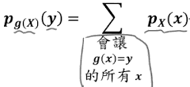
- 连续g(X) 
    - 先计算g(X)的CDF: 
        - F<sub>g(X)</sub>(y) = P[g(X)≤y]
    - 若 g(X)可微分, 再对y微分得到PDF:
        - 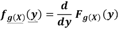
- 连续g(x) = aX + b
    - Ex: 若Y=3X+2, 请问Y的PDF 跟f<sub>X</sub>(x)之关系为何?
    - F<sub>Y</sub>(y) = P(Y≤y)
        - = P(3X+2≤y)
        - = P(X≤(y-2)/3 )
        - = F<sub>X</sub>( (y-2)/3 )
    - f<sub>Y</sub>(y) = f<sub>X</sub>( (y-2)/3 )·(1/3)
    - generic solution:
        - f<sub>Y</sub>(y) = (1/|a|)·f<sub>X</sub>( (y-b)/a )


