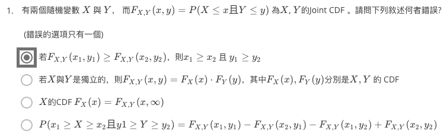

...menustart

- [Week 8  联合概率，边际概率，双变数期望值](#e843c56c869db7fe719b4a98d2dceadd)
    - [8.1 联合概率分布](#7a6e0b2a0774b9a999a5e891f7cc3d2c)
        - [联合 PMF (Joint PMF)](#ecfdf56b8825bb6021bc398b2687da18)
        - [联合 PMF 的性质](#12c3181de32d16311d0a1a1c713d480c)
        - [联合 CDF (Joint CDF)](#ae2555933cfea0bde5a2585b0d731631)
        - [联合 CDF 的性质](#2ddfa5d23aecf6d8e642c4f5063fa615)
        - [联合 PDF 例子](#82a4552a73f360a69c244464918476f9)
        - [若𝑿, 𝒀 皆为连续随机变数怎办?](#62cff33c593fc9c62714039fbd68d2f3)
        - [连续联合 PDF 的性质](#81b351c0506c1a71878441a0a81088d1)
    - [8.2 边际机率分布](#2ddbe1ee6b0b9481c8a52627056fedd5)
        - [已知联合 PMF，欲得个别 PMF](#41d4f6592d31a4b16ba8e2d84689f26b)
        - [边际 PMF (Marginal PMF)](#88467bd1b22479904c4cda0b92cbed46)
        - [边际 PDF (Marginal PDF)](#dcfc73f8fb33ef1e323fa7af282e7f12)
    - [8.3 双变数期望值](#b7c12c38cf6f0bd638bb87f785c54a6b)
    - [QUIZ](#e1f7ff5183a361cd3b41e3ab5e647cb5)

...menuend


<h2 id="e843c56c869db7fe719b4a98d2dceadd"></h2>


# Week 8  联合概率，边际概率，双变数期望值

<h2 id="7a6e0b2a0774b9a999a5e891f7cc3d2c"></h2>


## 8.1 联合概率分布 

JOINT PROBABILITY DISTRIBUTION

- 当小明出国去交换时
    - 𝑿: 小美脸书/QQ 脱机时间，𝑿~𝑼𝑵𝑰𝑭(𝟖, 𝟏𝟐)
    - 𝒀: 小华脸书/QQ 脱机时间，𝒀~𝑼𝑵𝑰𝑭(𝟖, 𝟏𝟐)
    - 𝒁: 小园脸书/QQ 离线时间，𝒁~𝑼𝑵𝑰𝑭(𝟖, 𝟏𝟐)
    - 假设 𝑿, 𝒀, 𝒁 都是离散随机变数
- 若将小美脱机时间 𝑿 与小园脱机时间 𝒁一起看呢?
    - 画出𝑷𝑿=𝒙,𝒁=𝒛:
    - 
- 若将小美脱机时间 𝑿 与小园脱机时间 𝒀一起看呢?
    - 画出𝑷 𝑿=𝒙,𝒀=𝒚 ，赫然发现!
    - 


- 同时将多个随机变量的行为一起拿来看， 我们可以看出更多以往看不到的信息!
- 同时考虑多个随机变量的机率分布称之为联合机率分布 (joint probability distribution)

<h2 id="ecfdf56b8825bb6021bc398b2687da18"></h2>


### 联合 PMF (Joint PMF)

- 若𝑿,𝒀皆为离散随机变量，我们 可以定义他们的联合PMF
    - p<sub>X,Y</sub>(x,y) = P( X=x 且 Y=y )
    - 联合PMF决定了𝑿,𝒀的联合机率分布
- Ex: 小美脱机时间 𝑿 与小华脱机时间 𝒀 的联合 PMF:
    - p<sub>X,Y</sub>(x,y) = P( X=x, Y=y )
    - 


<h2 id="12c3181de32d16311d0a1a1c713d480c"></h2>


### 联合 PMF 的性质

- 

<h2 id="ae2555933cfea0bde5a2585b0d731631"></h2>


### 联合 CDF (Joint CDF)

- 若考虑两个随机变数 𝑿, 𝒀 的联合机率分布， 我们也可定义出所谓的联合 CDF:

- 

- 即, (X,Y) 会落在黄色区域的几率


<h2 id="2ddfa5d23aecf6d8e642c4f5063fa615"></h2>


### 联合 CDF 的性质

- 
- if X and Y are independent, then F<sub>X,Y</sub>(x,y) = F<sub>X</sub>(x)·F<sub>X</sub>(y)
    - 反之亦然 !!!

- 四方格性质
    - 
    - 你只需要知道4个顶点的 cdf 值


<h2 id="82a4552a73f360a69c244464918476f9"></h2>


### 联合 PDF 例子

- Ex:小美等公交车时间为 𝑿, 小园等公交车时间为 𝒀 𝑿, 𝒀 两者独立且皆为连续之机率分布 𝑼𝑵𝑰𝑭 𝟎, 𝟏𝟎 。则 𝑿, 𝒀之联合 PDF 为
    - 
- 其他的联合pdf例子
    - 


<h2 id="62cff33c593fc9c62714039fbd68d2f3"></h2>


### 若𝑿, 𝒀 皆为连续随机变数怎办?

- 

- 若 𝑿, 𝒀 皆为连续随机变量，我们可以定义联合 PDF:
    - 
    - 


<h2 id="81b351c0506c1a71878441a0a81088d1"></h2>


### 连续联合 PDF 的性质 

- 
    - P(B) 是圆锥体体积


<h2 id="2ddbe1ee6b0b9481c8a52627056fedd5"></h2>


## 8.2 边际机率分布

MARGINAL PROBABILITY DISTRIBUTION

<h2 id="41d4f6592d31a4b16ba8e2d84689f26b"></h2>


### 已知联合 PMF，欲得个别 PMF

- Ex: 𝑿,𝒀分别为小美、小丽脸书/QQ 脱机时间。联合 PMF 如下:

p<sub>X,Y</sub>(x,y) | X = 8 | X = 9 | X = 10
--- | --- | --- | --- 
Y = 8 | 0.2 | 0.1 | 0.05
Y = 9 | 0.05 | 0.2 | 0.1
Y = 10 | 0.05 | 0.1 | 0.15

- p<sub>X</sub>(x) = ?   p<sub>Y</sub>(y) = ?
    - p<sub>X</sub>(8) = 0.2 + 0.05 + 0.05 = 0.3
    - p<sub>X</sub>(9) = 0.1 + 0.2 + 0.1 = 0.4
    - p<sub>X</sub>(10) = 0.05 + 0.1 + 0.15 = 0.3
- 整列加起来，然后(在它的边缘)写上数字，这就是 "边际"的由来


<h2 id="88467bd1b22479904c4cda0b92cbed46"></h2>


### 边际 PMF (Marginal PMF)

- 已知联合PMF p<sub>X,Y</sub>(𝒙,𝒚)，则可求得 p<sub>X</sub>(x), p<sub>Y</sub>(y) ，称之为边际 PMF
- 


<h2 id="dcfc73f8fb33ef1e323fa7af282e7f12"></h2>


### 边际 PDF (Marginal PDF)

- 已知联合PDF f<sub>X,Y</sub>(𝒙,𝒚)，则可求得 f<sub>X</sub>(x), f<sub>Y</sub>(y) ，称之为边际 PDF
- 

- Ex:
    - 


<h2 id="b7c12c38cf6f0bd638bb87f785c54a6b"></h2>


## 8.3 双变数期望值

- 离散
    - 回想只考虑一个离散随机变数𝑿时 其任意函数 g(x)的期望值是:
        - 
    - 若同时考虑两个离散随机变量𝑿,𝒀时，他们的任 意函数 h(X,Y) 的期望值是
        - 
    - Ex. 参考上面 小美、小丽脸书/QQ 脱机 时间的例子, 求 E[ |X-Y| ]
        - 

- 连续
    - 回想只考虑一个连续随机变量𝑿时 其任意函数 g(X) 的期望值是:
        - 
    - 若同时考虑两个连续随机变数𝑿,𝒀时，他们的任 意函数 h(X,Y) 的期望值是
        - 

- 性质
    - E[ αh₁(X,Y) + βh₂(X,Y) ] =  αE[h₁(X,Y)] + βE[h₂(X,Y)]
    - 若 X,Y 独立， 则
        - E[g(X)h(Y)] = E[g(X)]·E[h(Y)]
    - 

    - Var[aX+bY] = a²Var[X] + b²Var[Y] + 2Cov[X,Y]
    - 
    - 如果X，Y独立
        - Var[aX+bY] = a²Var[X] + b²Var[Y]


<h2 id="e1f7ff5183a361cd3b41e3ab5e647cb5"></h2>


## QUIZ

<details>
<summary>
quiz
</summary>

1. 
2. 某便利超商今天早上09:00開始推出兩款限量的商品，一個是可愛的馬克杯，另外一個是熱門卡通玩偶，假設限量商品全部賣完所需的時間都是Exponential Distribution的隨機變數，而且互相獨立，馬克杯和玩偶賣完所需的時間分別是T_1,T_2 (單位是hr)，而兩者的λ 分别为 1/12, 1/6. 請幫店長估計，平均需要幾個小時才能把兩項商品都賣完。
    - A:
        - U = max(X,Y)
        - F<sub>U</sub>(u) = P(U≤u) = P(max(X,Y)≤u) = P(X≤u, Y≤u) 
            - = P(X≤u)P(Y≤u) = F<sub>X</sub>(u)F<sub>Y</sub>(u)
        - 两边求导，得
            - f<sub>U</sub>(u) = f<sub>X</sub>(u)F<sub>Y</sub>(u) + F<sub>X</sub>(u)f<sub>Y</sub>(u)
        - scipy
            ```python
            >>> x = scipy.linspace(0,1000,100000)
            >>> pdf = scipy.stats.expon.pdf( x , scale=12 )*scipy.stats.expon.cdf( x , scale=6 ) + 
                scipy.stats.expon.pdf( x , scale=6 )*scipy.stats.expon.cdf( x , scale=12 )
            >>> delta = 1000./100000
            >>> delta
            0.01
            >>> (pdf * delta * x ).sum() # E[U]
            14.001260126012166
            ```
        - for min(X,Y)
            - 
3. 圈圈擲公正六面骰子兩次，隨機變數X代表兩次的點數和，隨機變數Y代表兩次點數的相差值 (不會是負數)，X,Y的join PDF 为P<sub>X,Y</sub>(x,y), 请问下列何者敘述正確?  (敘述正確的選項只有一個)
    - F<sub>X,Y</sub>(4,1) = 1/9
    - E[X] = 6   ❌  E[X] = 3.5 + 3.5 = 7
    - P<sub>Y</sub>(2)  = 1/9  ❌   1-3,2-4,3-5,4-6, 3-1,4-2,5-3,6-4  = 2/9
    - P<sub>Y|X=4</sub>(0) = 1/9  ❌  1/3
    - P<sub>X</sub>(4) = 1/9  ❌ 应为 1/12 , 只有1+3,2+2,3+1 3中组合的可能


</details>


