...menustart

- [Textuer and Modeling](#ca9e235d09110401a16af79048fda2c4)
- [Renderman Shading Language](#1788370b6ffe3e0fccf62aa9f5c4146d)
- [CHAPTER 2  BUILDING PROCEDURAL TEXTURES](#d033f70e239df7ab34718d5d84cb09a8)
    - [INTRODUCTION](#5933ba40c36942af6d85eae2b87d1ac5)
    - [PROCEDURAL PATTERN GENERATION](#1a38b8dc7a6f3cc864aeb4087f7eaefa)
    - [Shading Models](#c1c57c5f10d610630830380ed9b332fe)
    - [Pattern Generation](#e4cd46bef3dc3447197083c7ac518e60)
    - [Texture Spaces](#9a9839c8b7e66591077ec5e354ef3952)
    - [Layering and Composition](#b4a79de0915ebf290a02cc4dec4ed3cb)
    - [Steps, Clamps, and Conditionals](#2d8bf93ca75aca5774f21a431ba5e3de)
    - [Periodic Functions](#12c2ac8397180317852f7ac6343465e7)
    - [Splines and Mappings](#36921c934698e556132ccd41df579bf0)
    - [Example: Brick Texture](#95e100e8006b35e4017b4ac5e98f590e)
        - [Bump-Mapped Brick](#4b8a4928c80dbb90832685f625d39bb4)
    - [Example: Procedural Star Texture](#3f9e2847ee4cdb15d32b99840caec017)
    - [Spectral Synthesis  光谱合成](#5783f81ef8917c860636ac9d7d695102)
    - [ALIASING AND HOW TO PREVENT IT](#57e6091478ea0070020ae98a10147920)
        - [Signal Processing](#fb93336ab960d4ccca06e3a9ff73596b)
    - [Methods of Antialiasing Procedural Textures](#5daadabdd389ed925f78dd58dc8a4d68)
    - [Determining the Sampling Rate](#1d1c18f28e90a17dd98ca3a3805cf950)
    - [Clamping](#296d6837655d97560e6ec0d135dee4db)
    - [Analytic Prefiltering](#53ec4b61ddd25eb11d220ad40fcfb118)
    - [Better Filters](#e0c69d35a15d0876291ee3c294639c89)
    - [Integrals and Summed-Area Tables](#ee6bda864552024462560f79bf0e5d54)
        - [Example: Antialiased Brick Texture](#c7143f12bd99e3604f7d8adf4e8e0804)
    - [MAKING NOISES](#5fff91936d2b35e5829804e2f21bd376)
        - [Lattice Noises](#96cdfd02d5849846686f2eecc6bc24bf)
        - [Value Noise](#dc84a69bdc96850f89b6c4a9b9de5adb)
        - [Gradient Noise (TODO)](#7d2055bc181beddaa2492eac27f6391b)
        - [Value-Gradient Noise (TODO)](#c4c1767627f4d536aaa1f5d36e06766e)
        - [Lattice Convolution Noise (TODO)](#90a621169450e7dda33fc8525a104e57)
        - [Sparse Convolution Noise (TODO)](#52b2eb22dca333a7d0e00fcb3fd94634)
    - [GENERATING IRREGULAR PATTERNS](#8d18618ccbae1c5db4a02e261d5013ef)
    - [Spectral Synthesis](#b5b337d45c62d6e1c218bb5b93d105cb)
    - [Perturbed 扰乱的 Regular Patterns](#fcbfd4afc8873594d0a5a5b78dd16fda)
    - [Perturbed Image Textures](#d441872eec16d305851e98aa1b90393c)
    - [Random Placement Patterns](#33a888b2462b6062c56320b035b02c89)

...menuend


<h2 id="ca9e235d09110401a16af79048fda2c4"></h2>


# Textuer and Modeling

<h2 id="1788370b6ffe3e0fccf62aa9f5c4146d"></h2>


# Renderman Shading Language

```
$ renderdl -v

```

Hello world shader: 

```
surface helloWorld() {
    Oi = Os ; 
    Ci = Oi * Cs ;
}
```

- Oi : output opacity ?
- Os : input opacity 
- Ci : output color
- Cs : intput color

Compile the shader :

```
$ shaderdl -h
$ shaderdl -d bin src/helloWorld.sl
```

RIB file:  a file that will define the scene.

create rib file :  rib/sphere.rib    (TODO)

render :

```
$ renderdl rib/sphere.rib
```

enhance 

```
surface helloWorld( 
        uniform float Kd = 1;
    ) {

    // Local Variables
    normal Nn = normalize(N) ;

    Oi = Os ; 
    Ci = Oi * Cs * ( Kd * diffuse(Nn) );
}
```

- N is the normal vector

recompile & render !


Use a Makefile: 

```makefile
all: render

compile:
    shaderdl -d bin src/helloWorld.sl

render: compile
    renderdl rib/sphere.rib
```

enhance  again

```
surface helloWorld( 
        uniform float Kd = 1;
        uniform float Ks = 1;
        uniform float roughness = 0.15 ;
        color specularColor = color(1) ;
    ) {

    // Local Variables
    normal Nn = normalize(N) ;
    vector V = -normalize(I) ;

    Oi = Os ; 
    Ci = Oi * Cs * (( Kd * diffuse(Nn) ) + (Ks * specular( Nn, V, roughness ) * specularColor ) )  ;
}
```

- I : the vector that is coming from the camera all the way to the surface


<h2 id="d033f70e239df7ab34718d5d84cb09a8"></h2>


# CHAPTER 2  BUILDING PROCEDURAL TEXTURES

<h2 id="5933ba40c36942af6d85eae2b87d1ac5"></h2>


## INTRODUCTION

Throughout the short history of computer graphics, researchers have sought to improve the realism of their synthetic images by finding better ways to render the appearance of surfaces. This work can be divided into *shading* and *texturing*.

- Shading is the process of calculating the color of a pixel or shading sample from user-specified surface properties and the shading model. 
- Texturing is a method of varying the surface properties from point to point in order to give the appearance of surface detail that is not actually present in the geometry of the surface.

Shading models (sometimes called illumination models, lighting models, or reflection models) simulate the interaction of light with surface materials. Shading models are usually based on physics, but they always make a great number of simplifying assumptions. Fully detailed physical models would be overkill for most computer graphics purposes and would involve intractable calculations.

The simplest realistic shading model, and the one that was used first in computer graphics, is the diffuse model, sometimes called the Lambertian model. A diffuse surface has a dull or matte appearance. 

All of the shading models described above are so-called local models, which deal only with light arriving at the surface directly from light sources. In the early 1980s, most research on shading models turned to the problem of simulating global illumination effects, which result from indirect lighting due to reflection, refraction, and scattering of light from other surfaces or participating media in the scene. Raytracing and radiosity techniques typically are used to simulate global illumination effects.

<h2 id="1a38b8dc7a6f3cc864aeb4087f7eaefa"></h2>


## PROCEDURAL PATTERN GENERATION

Most surface shaders can be split into two components called *pattern generation* and the *shading model*.

- Pattern generation defines the texture pattern and sets the values of surface properties that are used by the shading model. 
- Shading model simulates the behavior of the surface material with respect to diffuse and specular re- flection.

<h2 id="c1c57c5f10d610630830380ed9b332fe"></h2>


## Shading Models

Most surface shaders use one of a small number of shading models. The most common model includes diffuse and specular reflection and is called the "plastic" shading model. It is expressed in the RenderMan shading language as follows:

```
surface
plastic(float Ka = 1, Kd = 0.5, Ks = 0.5;
float roughness = 0.1;
color specularcolor = color (1,1,1))
{
    point Nf = faceforward(normalize(N), I); 
    point V = normalize(-I);
    Oi = Os;
    Ci = Os * (Cs * (Ka * ambient()
        + Kd * diffuse(Nf)) 
        + specularcolor * Ks
            * specular(Nf, V, roughness));
}
```

- Colors are represented by RGB triples ， 0 ~ 1
- Any RenderMan surface shader can reference a large collection of built-in quan- tities , such as
     - P , the 3D coordinates of the point on the surface being shaded
     - N , the surface normal at P
         - Because surfaces can be two-sided, it is possible to see the inside of a surface; 
         - in that case we want the normal vector to point toward the camera, not away from it.
     - I , the vector from the camera position to the point P    
     - built-in function *faceforward* ,  simply compares I with N 
         - Flip N so that it faces in the direction opposite to I,
         - If the two vectors I and N point in the same direction (i.e., if their dot product is positive), faceforward returns -N instead of N.
- The first statement declares and initializes a surface normal vector Nf
     - which is normalized and faces toward the camera
- The second statement declares and initializes a vector V that is normalized and gives the direction to the camera.
- The third statement sets the output opacity `Oi` to be equal to the input surface opacity `Os`
- Actually, `Os` is color type,  For an opaque surface, `Os` is color(1,1,1).
- The final statement in the shader does the interesting work
     - The output color `Ci` is set to the product of the opacity and a color. 
     - The color is the sum of an ambient term and a diffuse term multiplied by the input surface color `Cs` , added to a specular term whose color is determined by the parameter *specularcolor*
- The built-in functions *ambient*, *diffuse*, and *specular* gather up all of the light from multiple light sources according to a particular reflection model. 
     - diffuse computes the sum of the intensity of each light source multiplied by the dot product of the direction to the light source and the surface normal Nf (which is passed as a parameter to diffuse).


The plastic shading model is flexible enough to include the other two most com- mon RenderMan shading models, the "matte" model and the "metal" model, as special cases. 

- The matte model is a perfectly diffuse reflector, which is equivalent to plastic with a Kd of 1 and a Ks of 0. ( 没有高光反射 )
- The metal model is a perfectly specular reflector ， which is equivalent to plastic with a Kd of 0, a Ks of 1, and a specularcolor the same as Cs.
     - specularcolor parameter is important ， For example, gold has a gold-colored highlight.

The plastic shader is a good starting point for many procedural texture shaders. We will simply replace the Cs in the last statement of the shader with a new color variable Ct, the texture color that is computed by the pattern generation part of the shader.

<h2 id="e4cd46bef3dc3447197083c7ac518e60"></h2>


## Pattern Generation

- usually the hard part

If the texture pattern is simply an image texture, the shader can call the built-in function *texture*:

```
Ct = texture("name.tx",s,t);
```

- texture function looks up pixel values from the specified image texture "name.tx" and performs filtering calculations as needed to prevent aliasing artifacts.
- texture function has the usual 2D texture space with the texture image in the unit square.
- built-in variables *s* and *t* are the standard RenderMan texture coordinates range over the interval [0, 1] , 

The shading language also provides an *environment* function whose 2D texture space is accessed using a 3D direction vector that is converted internally into 2D form to access a latitude-longitude or cube-face environment map.


<h2 id="9a9839c8b7e66591077ec5e354ef3952"></h2>


## Texture Spaces

The RenderMan shading language provides many different built-in coordinate systems (also called *spaces*). 

A coordinate system is defined by the concatenated stack of transformation matrices that is in effect at a given point in the hierarchical structure of the RenderMan geometric model.

- current space
     - the one in which shading calculations are normally done.
     - In most renderers, current space will turn out to be either *camera* space or *world* space, but you shouldn’t depend on this.
- world space 
     - the coordinate system in which the overall layout of your scene is defined. 
     - It is the starting point for all other spaces.
- object space 
     - the one in which the surface being shaded was defined
     - For instance, if the shader is shading a sphere, the object space of the sphere is the coordinate system that was in effect when the *RiSphere* call was made to create the sphere. 
     - Note that an object made up of several surfaces all using the same shader might have different object spaces for each of the surfaces if there are geometric transformations between the surfaces.
- shader space
     - the coordinate system that existed when the shader was invoked (e.g., by an *RiSurface* call). 
     - This is a very useful space because it can be attached to a user-defined collection of surfaces at an appropriate point in the hierarchy of the geometric model so that all of the related surfaces share the same shader space.

In addition, user-defined coordinate systems can be created and given names using the *RiCoordinateSystem* call. These coordinate systems can be referenced by name in the shading language.

It is very important to choose the right texture space when defining your texture.

Using the 2D surface texture coordinates (s, t) or the surface parameters (u, v) is fairly safe, but might cause problems due to nonuniformities in the scale of the parameter space (e.g., compression of the parameter space at the poles of a sphere). Solid textures avoid that problem because they are defined in terms of the 3D coordinates of the sample point.  If a solid texture is based on the *camera* space coordinates of the point , the texture on a surface will change whenever either the camera or the object is moved. If the texture is based on world space coordinates, it will change whenever the object is moved.  In most cases, solid textures should be based on the shader space coordinates of the shading samples, so that the texture will move properly with the object.  The shader space is defined when the shader is invoked, and that can be done at a suitable place in the transformation hierarchy of the model so that everything works out.

It is a simplification to say that a texture is defined in terms of a single texture space. In general a texture is a combination of a number of separate "features," each of which might be defined in terms of its own *feature* space. If the various feature spaces that are used in creating the texture are not based on one underlying texture space, great care must be exercised to be sure that texture features don’t shift with respect to one another. The feature spaces should have a fixed relationship that doesn’t change when the camera or the object moves.

<h2 id="b4a79de0915ebf290a02cc4dec4ed3cb"></h2>


## Layering and Composition

The best approach to writing a complex texture pattern generator is to build it up from simple parts. There are a number of ways to combine simple patterns to make complex patterns.

One technique is *layering*, in which simple patterns are placed on top of one another. 

For example, the colors of two texture layers could be added together. Usually, it is better to have some texture function control how the layers are combined. The *mix* function is a convenient way of doing this.

```
C = mix(C0, C1, f);
```

- The number f, between 0 and 1, is used to select one of the colors C0 and C1
- If f is 0, the result of themixisC0
- If f is 1, the result isC1
- If f is between 0 and 1, the re- sult is a linearly interpolated mixture of C0 and C1


```
color
mix(color C0, color Cl, float f) {
    return (1-f) * C0 + f * Cl;
}
```

When two colors are multiplied together in the shading language, the result is a color , whose RGB components are the product of the corresponding components from the input colors. Color multiplication can simulate the ***filtering*** of one color by the other. If color C0 represents the transparency of a filter to red, green, and blue light, then C0*C1 represents the color C1 as viewed through the filter.

Be careful when using a four-channel image texture that was created from an RGBA image (an image with an opacity or "alpha" channel) because the colors in such an image are normally premultiplied by the value of the alpha channel. In this case, it is not correct simply to combine the RGB channels with another color under control of the alpha channel. The correct way to merge an RGBA texture over another texture color Ct is

```
color C; float A;
C = color texture("mytexture",s,t); 
A = texture("mytexture"[3],s,t); 
result = C + (1-A) * Ct;
```

- C is the image texture color, and A is the alpha channel of the image texture (channel number 3)
- Since C has already been multiplied by A, the expression C + (1—A)*Ct is the right way to *lerp* between C and Ct.

Another way to combine simple functions to make complex functions is *functional composition*, using the outputs of one or more simple functions as the inputs of another function. Composition is very powerful and is so fundamental to programming that you really can’t avoid using it.


<h2 id="2d8bf93ca75aca5774f21a431ba5e3de"></h2>


## Steps, Clamps, and Conditionals

function *step(a,x)* returns the value 0 when x is less than a and returns 1 otherwise.

```cpp
float
step(float a, float x) {
    return (float) (x >= a);
}
```

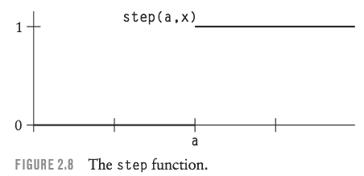

The main use of the step function is to replace an if statement or to produce a sharp transition between one type of texture and another type of texture. For example, an if statement such as 

```
if (u < 0.5)
    Ci = color (1, 1, .5);
else
    Ci = color ( .5 , .3, 1);
```

can be rewritten to use the step function as follows:

```
Ci = mix(color (1,1,.5), color (.5,.3,1), step(0.5, u));
```

Later in this chapter when we examine antialiasing, you’ll learn how to create an antialiased version of the step function. Writing a procedural texture with a lot of if statements instead of step functions can make antialiasing much harder.

Two step functions can be used to make a rectangular pulse as follows:

```
#define PULSE(a,b,x) (step((a),(x)) - step((b),(x)))
```

This preprocessor macro generates a pulse that begins at x = a and ends at x = b.

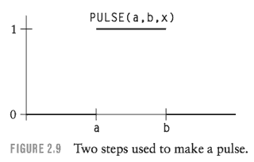

function *clamp(x,a,b)* returns the value a when x is less than a, the value of x when x is between a and b, and the value b when x is greater than b. The clamp function can be written in C as follows:

```
float
clamp(float x, float a, float b) {
    return (x < a ? a: (x > b ? b : x));
}
```

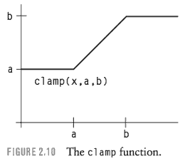

The well-known min and max functions are closely related to clamp. In fact, min and max can be written as clamp calls, as follows:

```
min(x, b) ≡ clamp(x, x, b)
max(x, a) ≡ clamp(x, a, x)
```

Alternatively, clamp can be expressed in terms of min and max:

```
clamp(x, a, b) ≡ min(max(x, a), b)
```

Another special conditional function is the *abs* function.

In addition to the "pure" or "sharp" conditionals step, clamp, min, max, and abs, RenderMan shading language provides a "smooth" conditional function called *smoothstep*. This function is similar to step, but instead of a sharp transition from 0 to 1 at a specified threshold, smoothstep(a,b,x) makes a gradual transition from 0 to 1 beginning at threshold a and ending at threshold b.  In order to do this, smoothstep contains a cubic function whose slope is 0 at a and b and whose value is 0 at a and 1 at b.  There is only one cubic function that has these properties for a = 0 and b = 1, namely, the function 3x² − 2x³. 

```
float
smoothstep(float a, float b, float x) {
    if (x < a) return 0;
    if (x >= b) return 1;
    x = (x - a)/(b - a); 
    return (x*x * (3 - 2*x));
}
```

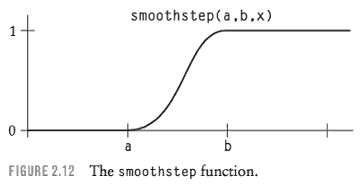


<h2 id="12c2ac8397180317852f7ac6343465e7"></h2>


## Periodic Functions

The best-known periodic functions are sin and cos.  It can be shown that other functions can be built up from a sum of sinusoidal terms of different frequencies and phases.

Another important periodic function is the *mod* function. *mod(a,b)* gives the positive remainder obtained when dividing a by b.  C users beware! Although C has a built-in integer remainder operator "%" and math library functions fmod and fmodf for double and float numbers, all of these are really remainder functions, not modulus functions, in that they will return a negative result if the first operand, a, is negative.  Instead, you might use the following C implementation of mod:

```

float
mod(float a, float b) {
    int n = (int)(a/b); 
    a -= n*b;
    if (a < 0)
        a += b; 
    return a;
}
```

A graph of the periodic sawtooth function mod(x,a)/a is shown in Figure 2.14. This function has an amplitude of one and a period of a.

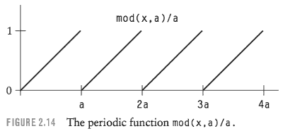

By applying mod to the inputs of some other function, we can make the other function periodic too. Take any function, say, f (x), defined on the interval from 0 to 1 (technically, on the half-open interval [0, 1]). Then f (mod(x,a)/a) is a periodic function.  To make this work out nicely, it is best if f(0) = f(1) and even better if the derivatives of f are also equal at 0 and 1. 

For example, the pulse function PULSE(0.4,0.6,x) can be combined with the mod function to get the periodic square wave function PULSE(0.4,0.6,mod(x,a)/a) with its period equal to a (see Figure 2.15).

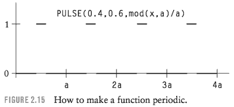

It’s often preferable to use another mod-like idiom instead of mod in your shaders. We can think of xf = mod(a,b)/b as the fractional part of the ratio a/b.  In many cases it is useful to have the integer part of the ratio, xi, as well.

```
float xf, xi; 
xf = a/b;
xi = floor(xf); 
xf -= xi;
```

In C, the following macro is an alternative to the built-in floor function:

```
#define FLOOR(x) ((int)(x) - ((x) < 0 && (x) != (int)(x)))
```

FLOOR isn’t precisely the same as floor, because FLOOR returns a value of int type rather than double type.  Be sure that the argument passed to FLOOR is the name of a variable, since the macro may evaluate its argument up to four times.

A closely related function is the ceiling function ceil(x).  The following macro is an alternative to the C library function:

```
#define CEIL(x) ((int)(x) + ((x) > 0 && (x) != (int)(x)))
```

<h2 id="36921c934698e556132ccd41df579bf0"></h2>


## Splines and Mappings

Built-in *spline* function is a one-dimensional Catmull-Rom interpolating spline through a set of so-called *knot* values. The parameter of the spline is a floating-point number.

```
result = spline(parameter,
        knotl, knot2, . . . , knotN-1, knotN);
```

In the shading language, the knots can be numbers, colors, or points (but all knots must be of the same type). The result has the same data type as the knots.   If parameter is 0, the result is knot2. If parameter is 1, the result is knotN-1.  For values of parameter between 0 and 1, the value of result interpolates smoothly between the values of the knots from **knot2** to **knotN-1**.  The knotl and knotN values determine the derivatives of the spline at its end points.  Because the spline is a cubic polynomial, there must be at least four knots.

Here is a C language implementation of spline in which the knots must be floating-point numbers:

```
/* Coefficients of basis matrix. */
#define CROO  -0.5
#define CR01   1.5
#define CR02  -1.5
#define CR03   0.5
#define CR10   1.0
#define CR11  -2.5
#define CR12   2.0
#define CR13  -0.5
#define CR20  -0.5
#define CR21   0.0
#define CR22   0.5
#define CR23   0.0
#define CR30   0.0
#define CR31   1.0
#define CR32   0.0
#define CR33   0.0

float
spline(float x, int nknots, float *knot) 
{
    int span;
    int nspans = nknots - 3;
    float cO, cl, c2, c3; /* coefficients of the cubic.*/ 
    if (nspans < 1){/* illegal */
        fprintf(stderr, "Spline has too few knots.\n"); 
        return 0;
    }
    /* Find the appropriate 4-point span of the spline. */ 
    x = clamp(x, 0, 1) * nspans;
    span = (int) x;
    if (span >= nknots - 3)
        span = nknots - 3; 
    x -= span;
    knot += span;
    
    /* Evaluate the span cubic at x using Horner’s rule. */
    c3 = CROO*knot[0] + CR01*knot[l] + CR02*knot[2] + CR03*knot[3]; 
    c2 = CR10*knot[0] + CRll*knot[l] + CR12*knot[2] + CR13*knot[3]; 
    cl = CR20*knot[0] + CR21*knot[l] + CR22*knot[2] + CR23*knot[3]; 
    cO = CR30*knot[0] + CR31*knot[l] + CR32*knot[2] + CR33*knot[3];

    return ((c3*x + c2)*x + cl)*x + cO;
}
```

A graph of a particular example of the spline function is shown in Figure 2.16.

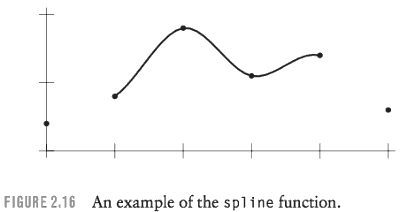

This code can easily be adapted to work with knots that are colors or points. Just do the same thing three times, once for each of the components of the knots. In
other words,

```
spline(parameter, (xl,yl,zl), . . . , (xN,yN,zN))
```

is exactly equivalent to

```
( spline(parameter, xl, . . . , xN), 
  spline(parameter, yl, . . . , yN), 
  spline(parameter, zl, . . . , zN) )
```

The spline function is used to map a number into another number or into a color.  A spline can approximate any function on the [0, 1] interval by giving values of the function at equally spaced sample points as the knots of the spline. In other words, the spline can interpolate function values from a table of known values at equally spaced values of the input parameter. A spline with colors as knots can be used as a *color map* or *color table*.

An example of this technique is a shader that simulates a shiny metallic surface by a procedural reflection map texture. The shader computes the reflection direction R of the viewer vector V. The vertical component of R in world space is used to look up a color value in a spline that goes from brown earth color below to pale bluish-white at the horizon and then to deeper shades of blue in the sky. Note that the shading language’s built-in *vtransform* function properly converts a direction vector from the current rendering space to another coordinate system specified by name.

```
#define BROWN color (0.1307,0.0609,0.0355) 
#define BLUEO color (0.4274,0.5880,0.9347) 
#define BLUE1 color (0.1221,0.3794,0.9347) 
#define BLUE2 color (0.1090,0.3386,0.8342) 
#define BLUE3 color (0.0643,0.2571,0.6734) 
#define BLUE4 color (0.0513,0.2053,0.5377) 
#define BLUE5 color (0.0326,0.1591,0.4322) 
#define BLACK color (0,0,0)

surface 
metallic( ) {
    point Nf = normalize(faceforward(N, I)); 
    point V = normalize(-I);
    point R; /* reflection direction */
    point Rworld; /* R in world space */
    color Ct;
    float altitude;

    R = 2 * Nf * (Nf . V ) - V ; 
    Rworld = normalize(vtransform("world", R)); 
    altitude = 0.5 * zcomp(Rworld) + 0.5;
    Ct = spline(altitude,
            BROWN, BROWN, BROWN, BROWN, BROWN, 
            BROWN, BLUEO, BLUE1, BLUE2, BLUE3, 
            BLUE4, BLUE5, BLACK);
    Oi = Os;
    Ci = Os * Cs * Ct;
}
```


Figure 2.17 is an image shaded with the metallic reflection map shader.

Since *mix* functions and so many other selection functions are controlled by values that range over the [0, 1] interval, mappings from the unit interval to itself can be especially useful. Monotonically increasing functions on the unit interval can be used to change the distribution of values in the interval. The best-known example of such a function is the "gamma correction" function used to compensate for the nonlinearity of CRT display systems:

```cpp
float
gammacorrect(float gamma, float x) {
    return pow(x, 1/gamma);
}
```

Figure 2.18 shows the shape of the gamma correction function for gamma values of 0.4 and 2.3. If x varies over the [0, 1] interval, then the result is also in that interval.

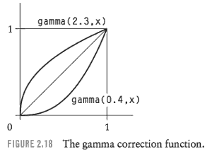

The zero and one end points of the interval are mapped to themselves. Other values are shifted upward toward one if gamma is greater than one, and shifted downward toward zero if gamma is between zero and one.

Perlin and Hoffert (1989) use a version of the gamma correction function that they call the *bias* function. The bias function replaces the gamma parameter with a parameter b, defined such that bias(b,0.5) = b.

```
float
bias(float b, float x) {
    return pow(x, log(b)/log(0.5)); 
}
```

Figure 2.19 shows the shape of the bias function for different choices of b.

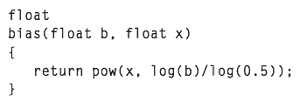


Perlin and Hoffert (1989) present another function to remap the unit interval. This function is called *gain* and can be implemented as follows:

```cpp
float
gain(float g, float x) {
    if (x < 0.5)
        return bias(1-g, 2*x)/2;
    else
        return 1 - bias(1-g, 2 - 2*x)/2;
}
```


Regardless of the value of g, all gain functions return 0.5 when x is 0.5.  Above and below 0.5, the gain function consists of two scaled-down bias curves forming an S-shaped curve.

Schlick (1994) presents approximations to bias and gain that can be evaluated more quickly than the power functions given here.

<h2 id="95e100e8006b35e4017b4ac5e98f590e"></h2>


## Example: Brick Texture

One of the standard texture pattern clichés in computer graphics is the checkerboard pattern. This pattern was especially popular in a variety of early papers on anti-aliasing. 

Generating a checkerboard procedurally is quite easy. It is simply a matter of determining which square of the checkerboard contains the sample point and then testing the parity of the sum of the row and column to determine the color of that square.

This section presents a procedural texture generator for a simple brick pattern that is related to the checkerboard but is a bit more interesting. The pattern consists of rows of bricks in which alternate rows are offset by one-half the width of a brick.

The bricks are separated by a mortar that has a different color than the bricks. Figure 2.21 is a diagram of the brick pattern.

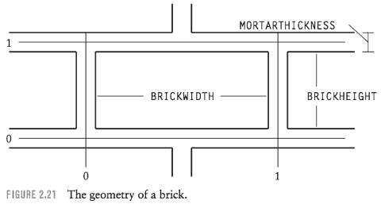

The following is a listing of the shading language code for the brick shader, with explanatory remarks inserted here and there.

```
#define BRICKWIDTH 0.25 
#define BRICKHEIGHT 0.08 
#define MORTARTHICKNESS 0.01

#define BMWIDTH (BRICKWIDTH + MORTARTHICKNESS) 
#define BMHEIGHT (BRICKHEIGHT + MORTARTHICKNESS)

#define MWF (MORTARTHICKNESS *0.5 /BMWIDTH) 
#define MHF (MORTARTHICKNESS *0.5 /BMHEIGHT)

surface brick(
    uniform float Ka = 1;
    uniform float Kd = 1;
    uniform color Cbrick = color (0.5, 0.15, 0.14); 
    uniform color Cmortar = color (0.5, 0.5, 0.5); )
{
    color Ct;
    point Nf;
    float ss, tt, sbrick, tbrick, w, h; 
    float scoord = s;
    float tcoord = t;

    Nf = normalize(faceforward(N, I));
    
    ss = scoord / BMWIDTH; 
    tt = tcoord / BMHEIGHT;
    if (mod(tt*0.5,1) > 0.5)
        ss += 0.5; /* shift alternate rows */

    sbrick = floor(ss); /* which brick? */ 
    tbrick = floor(tt); /* which brick? */ 
    ss -= sbrick;
    tt -= tbrick;

    w = step(MWF,ss) - step(1-MWF,ss);  // PULSE  MWF , 1-MWF
    h = step(MHF,tt) - step(1-MHF,tt);

    Ct = mix(Cmortar, Cbrick, w*h);

    /* diffuse reflection model */
    Oi = Os;
    Ci = Os * Ct * (Ka * ambient() + Kd * diffuse(Nf));
}
```

- The texture coordinates *scoord* and *tcoord* begin with the values of the standard texture coordinates s and t
- and then are divided by the dimensions of a brick (including one-half of the mortar around the brick) to obtain new coordinates ss and tt that vary from 0 to 1 within a single brick
- *scoord* and *tcoord* become the coordinates of the upper-left corner of the brick containing the point being shaded
- Alternate rows of bricks are offset by one-half brick width to simulate the usual way in which bricks are laid.
- Having identified which brick contains the point being shaded, as well as the texture coordinates of the point within the brick, it remains to determine whether the point is in the brick proper or in the mortar between the bricks.
- The rectangular brick shape results from two pulses , a horizontal pulse w and a vertical pulse h . w * h is nonzero only when the point is within the brick region both horizontally and vertically

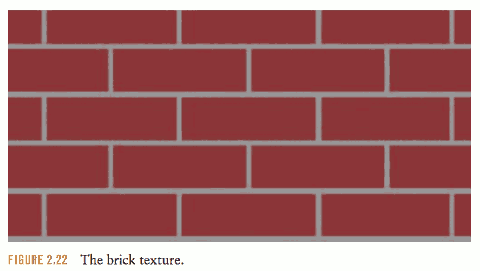


<h2 id="4b8a4928c80dbb90832685f625d39bb4"></h2>


### Bump-Mapped Brick

Now let’s try our hand at some procedural bump mapping.

Recall that bump mapping involves modifying the surface normal vectors to give the appearance that the surface has bumps or indentations. 

Blinn (1978), the paper that introduced bump mapping, describes how a bump of height F(u, v) along the normal vector N can be simulated. The modified or "perturbed" normal vector is N′ = N + D.  The perturbation vector D lies in the tangent plane of the surface and is therefore perpendicular to N. D is based on the sum of two separate perturbation vectors U and V (Figure 2.23).

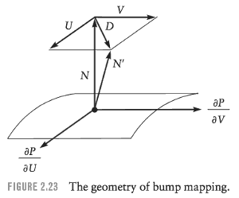

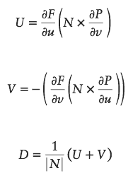

Let’s analyze the expression for U. Note that the cross product `N x (∂P/∂v)` is perpendicular to N and therefore lies in the tangent plane of the surface. It is also perpendicular to the partial derivative of P, the surface position, with respect to v. This derivative lies in the tangent plane and indicates the direction in which P changes as the surface parameter v is increased.  If the parametric directions are perpendicular (usually they are only approximately perpendicular), adding a perturbation to N along the direction of this cross product would tilt N as if there were an upward slope in the surface along the u direction. The partial derivative `∂F/∂u` gives the slope of the bump function in the u direction.

This technique looks somewhat frightening, but is fairly easy to implement if you already have the normal vector and the parametric derivatives of P. In the RenderMan shading language, N, dPdu, and dPdv contain these values. The differencing operators Du and Dv allow you to approximate the parametric derivatives of any expression. So Blinn’s method of bump mapping could be implemented using the following shading language code:

```
float F; point U, V, D;
F = /* fill in some bump function here */ 
U = Du(F) * (N ^ dPdv);
V = -(Dv(F) * (N ^ dPdu));
D = 1/length(N) * (U + V);
Nf = N + D;
Nf = normalize(faceforward(Nf, I));
```

Then use Nf in the shading model just as you normally would. The resulting surface shading should give the appearance of a pattern of bumps determined by F.

Fortunately, the shading language provides a more easily remembered way to implement bump mapping and even displacement mapping.

```
float F; point PP;
F = /* fill in some bump function here */
PP = P + F * normalize(N);
Nf = calculatenormal(PP);
Nf = normalize(faceforward(Nf, I));
```

In this code fragment, a new position PP is computed by moving along the direction of the normal a distance determined by the bump height F. Then the built-in function *calculatenormal* is used to compute the normal vector of the modified surface PP. *calculatenormal(PP)* does nothing more than return the cross product of the parametric derivatives of the modified surface:

```
point 
calculatenormal(point PP) {
    return Du(PP) ^ Dv(PP);
}
```

To create actual geometric bumps by displacement mapping, you use very similar shading language code:

```
float F;
F = /* fill in some bump function here */
p = p + F * normalize(N); 
N = calculatenormal(P);
```

Instead of creating a new variable PP that represents the bumped surface, this code assigns a new value to the original surface position P.  In the shading language this means that the positions of points on the surface are actually moved by the shader to create bumps in the geometry. Similarly, the true normal vector N is recomputed so that it matches the displaced surface properly.  We’ve omitted the last line that computes Nf because displacement mapping should be done in a separate displacement shader, not in the surface shader.

To get a better understanding of bump mapping, let’s add bump-mapped mortar grooves to our brick texture. The first step is to design the shape of the groove profile, that is, the vertical cross section of the bump function.  Figure 2.24 is a diagram of the profile of the bricks and mortar grooves.

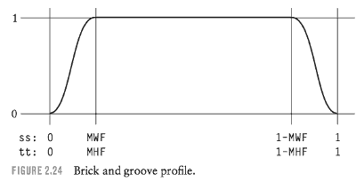

In order to realistically render the mortar groove between the bricks, we want the brick shader to compute a ***procedural bump-mapping function*** that will be used to ***adjust the normal vector before shading***.  To this end, we add the following code to the brick shader, immediately before the last statement (the one that computes Ci from the shading model).

```
/* compute bump-mapping function for mortar grooves */ 
/* function F above */
sbump = smoothstep(0,MWF,ss) - smoothstep(1-MWF,1,ss); 
tbump = smoothstep(0,MHF,tt) - smoothstep(1-MHF,1,tt); 
stbump = sbump * tbump;
```

The first two statements define the bump profile along the s and t directions independently. The first smoothstep call in each statement provides the positive slope of the bump function at the start of the brick, and the last smoothstep call in each statement provides the negative slope at the end of the brick.   The last statement com- bines the sbump vertical groove and tbump horizontal groove to make an overall bump value stbump.

```
/* compute shading normal */
Nf = calculatenormal(P + normalize(N) * stbump); 
Nf = normalize(faceforward(Nf, I));
Oi = Os;
Ci = Os * Ct * (Ka * ambient() + Kd * diffuse(Nf));
```

Finally, the shading normal Nf is computed based on the bump height as described earlier in this section. The shader ends as before by using the texture color Ct and bump-mapped normal Nf in a diffuse shading model to shade the surface. Figure 2.25 is an image of the bump-mapped brick texture.


> FIGURE 2.25 The bump-mapped brick texture.

增加的 bump shader 代码如下：

```cpp
Ct = mix(Cmortar, Cbrick, w*h);

// code added ...
float sbump, tbump, stbump ;
/* compute bump-mapping function for mortar grooves */ 
/* function F above */
sbump = smoothstep(0,MWF,ss) - smoothstep(1-MWF,1,ss); 
tbump = smoothstep(0,MHF,tt) - smoothstep(1-MHF,1,tt); 
stbump = sbump * tbump;

/* compute shading normal */
Nf = calculatenormal(P + normalize(N) * stbump); 
Nf = normalize(faceforward(Nf, I));
// code add end ...

/* diffuse reflection model */
Oi = Os;
```

---


There is a subtle issue hidden in this example.

Recall that the shader displaces the surface position by a bump height stbump along the normal vector.  Since the built-in normal vector N was used without modification, the displacement is defined in the shader’s current space, not in shader space. Even though the bump function itself is locked to the surface because it is defined in terms of the s and t surface texture coordinates, the height of the bumps could change if the object is scaled relative to the world space. 

To avoid this problem, we could have transformed the surface point and normal vector into shader space, done the displacement there, and transformed the new normal back to current space, as follows:

```cpp
point Nsh, Psh;
Psh = transform("shader", P);
Nsh = normalize(ntransform("shader", N)); 
Nsh = calculatenormal(Psh + Nsh * stbump); 
Nf = ntransform("shader", "current", Nsh); 
Nf = normalize(faceforward(Nf, I));
```

***Note the use of *ntransform* rather than *transform* to transform normal vectors from one space to another***.  Normal vectors are transformed differently than points or direction vectors. The second *ntransform* uses two space names to request a transformation from shader space to current space.


<h2 id="3f9e2847ee4cdb15d32b99840caec017"></h2>


## Example: Procedural Star Texture

Now let’s try to generate a texture pattern that consists of a yellow five-pointed star on a background color Cs.

The star pattern seems quite difficult until you think about it in polar coordinates. This is an example of how choosing the appropriate feature space makes it much easier to generate a tricky feature.

Figure 2.26 shows that each point of a five-pointed star is 72 degrees wide. Each half-point (36 degrees) is described by a single edge.


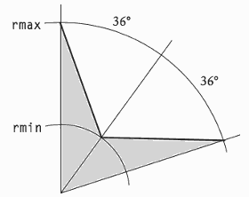

> FIGURE 2.26 The geometry of a star.

The end points of the edge are a point at radius rmin from the center of the star and another point at radius rmax from the center of the star.

```cpp
surface
star(
    uniform float Ka = 1;
    uniform float Kd = 1;
    uniform color starcolor = color (1.0000,0.5161,0.0000); 
    uniform float npoints = 5;
    uniform float sctr = 0.5;
    uniform float tctr = 0.5;
) {
    point Nf = normalize(faceforward(N, I)); 
    color Ct;
    float ss, tt, angle, r, a, in_out;
    uniform float rmin = 0.07, rmax = 0.2; 
    uniform float starangle = 2*PI/npoints;  // 1.257 , 72 degree

    // (r,0) @ ( 0.2, 0, 0 )  
    uniform point p0 = rmax*(cos(0),sin(0), 0);  
    // ( rmin ,  starangle/2 ) @ (0.057, 0.041, 0) , clockwise , cuz (s,t) , t is downward
    uniform point pi = rmin*(cos(starangle/2),sin(starangle/2),0);  
    uniform point d0 = pi - p0; # thick line (left in picture)
    point d1;
    ss = s - sctr; tt = t - tctr;
    angle = atan(ss, tt) + PI;  // mark: 1
    r = sqrt(ss*ss + tt*tt);   // mark: 2

    a = mod(angle, starangle)/starangle; 
    if (a >= 0.5)
        a = 1 - a;    // mark: 3

    d1 = r*(cos(a), sin(a),0) - p0;  // mark:4
    in_out = step(0, zcomp(d0^d1) ); // outward z is negtive
    Ct = mix(Cs, starcolor, in_out);
    /* diffuse (“matte”) shading model */ 
    Oi = Os;
    Ci = Os * Ct * (Ka * ambient() + Kd * diffuse(Nf));        
}
```

 1. 这里使用了一个小技巧: 极坐标 0弧度 是 水平向右
     - 通过 交换 atan的两个参数, 使 图像顺时针旋转90度
     - 最后加上 + PI , 使 star 正方向向上
 2. 计算以 star 中心为 原点的 极坐标
 3. Now the shader has computed the coordinates of the sample point (r,a) in a new feature space: the space of one point of the star. 
     - a is first set to range from 0 to 1 over each star point. 
     - To avoid checking both of the edges that define the “V” shape of the star point, sample points in the upper half of the star point are reflected through the center line of the star point. 
     - The new sample point (r,a) is inside the star if and only if the original sample point was inside the star, due to the symmetry of the star point around its center line.
 4. To test whether (r,a) is inside the star, 我们使用叉积来判断， 注意 z轴正向是朝里的
     - `zcomp(d0^d1)` 判断只 适用于 36度区域, 为了使 另外的36度也 使用 d0来判断，我们对 `a` 做镜像处理
     - 代码中的 [0,1] normalization 并不是必须的, `a = mod(angle, starangle);  if (a >= starangle／2) a = starangle - a;` 同样可以


<h2 id="5783f81ef8917c860636ac9d7d695102"></h2>


## Spectral Synthesis  光谱合成

Procedural methods could generate remarkably complex and natural-looking textures simply by using a combination of sinusoidal 正弦波 component functions of differing frequencies , amplitudes, and phases.

The theory of Fourier analysis tells us that functions can be represented as a sum of sinusoidal terms.  The Fourier transform takes a function from the temporal or spatial domain, where it is usually defined, into the *frequency domain*, where it is represented by the amplitude and phase of a series of sinusoidal waves.  When the series of sinusoidal waves is summed together, it reproduces the original function; this is called the *inverse Fourier transform*.

- Spectral synthesis is a rather inefficient implementation of the inverse discrete Fourier transform, 
     - which takes a function from the frequency domain back to the spatial domain.  Given the amplitude and phase for each sinusoidal component, we can sum up the waves to get the desired function. 
- The efficient way to do this is the inverse fast Fourier transform (FFT) algorithm, but that method generates the inverse Fourier transform for a large set of points all at once.
      - In an implicit procedural texture we have to generate the inverse Fourier transform for a single sample point, and the best way to do that seems to be a direct summation of the sine wave components.

In procedural texture generation, we usually don’t have all of the frequency domain information needed to reconstruct some function exactly. Instead, we want a function with some known characteristics, usually its power spectrum, and we don’t care too much about the details of its behavior. 

It is possible to take a scanned image of a texture, compute its frequency domain representation using a fast Fourier trans- form, and use the results to determine coefficients for a spectral synthesis procedural texture, but in our experience that approach is rarely taken.

One of Gardner’s simplest examples is a 2D texture that can be applied to a flat sky plane to simulate clouds. Here is a RenderMan shader that generates such a texture:


```
TODO
```


This texture is a sum of five components, each of which is a cosine function with a different frequency, amplitude, and phase. The frequencies, amplitudes, and phases are chosen according to rules discovered by Gardner in his experiments. 

Gardner’s technique is somewhat unusual for spectral synthesis in that the phase of each component is coupled to the value of the previous component in the other coordinate (for example, the x phase depends on the value of the preceding y component).

Making an acceptable cloud texture in this way is a battle to avoid regular patterns in the texture.   Natural textures usually don’t have periodic patterns that repeat exactly.

Spectral synthesis relies on complexity to hide its underlying regularity and periodicity. There are several “magic numbers” strewn throughout this shader in an attempt to prevent regular patterns from appearing in the texture. 

Fourier spectral synthesis using a finite number of sine waves will always generate a periodic function, but the period can be made quite long so that the periodicity is not obvious to the observer. 

---

You could go a long way using just the methods described so far. 

Some of these techniques can produce rich textures with a lot of varied detail, but even more variety is possible. In particular, we haven’t yet discussed the noise function, the most popular of all procedural texture primitives. 

But first, let’s digress a bit and examine one of the most important issues that affect procedural textures, namely, the difficulties of aliasing and antialiasing.

<h2 id="57e6091478ea0070020ae98a10147920"></h2>


## ALIASING AND HOW TO PREVENT IT

The next section presents an informal discussion of basic signal processing concepts, including aliasing. 

<h2 id="fb93336ab960d4ccca06e3a9ff73596b"></h2>


### Signal Processing

As shown in Figure 2.29, a continuous signal can be converted into a discrete form by measuring its value at equally spaced sample points. 

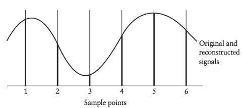

> FIGURE 2.29 Sampling and reconstruction.

This is called *sampling*. The original signal can be reconstructed later from the sample values by interpolation.

**Sampling and reconstruction are fundamental to computer graphics.** 

Raster images are discrete digital representations of the continuous optical signals that nature delivers to our eyes and to our cameras. Synthetic images are made by sampling of geometric models that are mathematically continuous. 

Signal processing originally was developed to deal with the one-dimensional time-varying signals encountered in communications. The field of image processing is in essence the two-dimensional extension of signal processing techniques to deal with images.

Fortunately for computer graphics, the process of sampling and reconstruction is guaranteed to work under certain conditions, namely, when the amount of information in the original signal does not exceed the amount of information that can be captured by the samples. This is known as the ***sampling theorem***. 

The amount of information in the original signal is called its ***bandwidth***. The amount of information that can be captured by the samples is dependent upon the ***sampling rate***, the number of sample points per unit distance.  

Unfortunately for computer graphics, the conditions for correct sampling and reconstruction are not always easy to meet, and when they are not met, aliasing occurs.

In Fourier “frequency domain.” , a signal with limited bandwidth will have a maximum frequency in its frequency domain representation.  

*If that frequency is less than or equal to one-half of the sampling rate, the signal can be correctly sampled and reconstructed without aliasing*. Aliasing will occur if the maximum frequency exceeds one-half of the sampling rate (this is called the ***Nyquist frequency***). 

The maximum frequency in the reconstructed signal cannot exceed the Nyquist frequency, but the energy contributed to the original signal by the excessively high frequency components does not simply disappear.  Instead, it appears in the reconstructed signal as erroneous lower-frequency energy, which is called an ***alias*** of the high-frequency energy in the original signal.  

The problem of aliasing can be addressed by changing the sample points to be closer together, or by modifying the original signal to eliminate the high frequencies.  

If it is possible to increase the sampling rate, that is always beneficial. With more samples, the original signal can be reconstructed more accurately. 

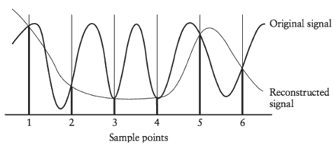

> FIGURE 2.30 Aliasing.

---

Unfortunately, there is always some practical limit on the resolution of an image due to memory space or display limitations, and the sampling rate of an image is proportional to its resolution. It is impossible for an image to show details that are too small to be visible at the resolution of the image.

Therefore, it is vital to **take** excessively high frequencies **out of** the original signal so that they don’t show up as aliases and detract from the part of the signal that *can* be seen given the available resolution.

There is another reason why increasing the sampling rate is never a complete solution to the problem of aliasing. Some signals have unlimited bandwidth, so there is no maximum frequency.  No matter how great the image resolution, increasing the sampling rate to any finite value cannot eliminate aliasing when sampling such signals. This is why sloped lines are jaggy on even the highest resolution displays (unless they have been antialiased properly).

Since aliasing can’t always be solved by increasing the sampling rate, we are forced to figure out how to remove high frequencies from the signal before sampling.

The technique is called ***low-pass filtering*** because it passes low-frequency information while eliminating higher-frequency information. The visual effect of low-pass filtering is to blur the image. The challenge is to blur the image as little as possible while adequately attenuating the unwanted high frequencies.

It is often difficult to low-pass-filter the signal before sampling.

A common strategy in computer graphics is to *supersample* or *oversample* the signal, that is, to sample it at a higher rate than the desired output sampling rate. 。。。 Unfortunately, frequencies higher than the Nyquist frequency of the supersamples will still appear as aliases in the reconstructed signal.

An alternative approach to antialiasing is to supersample the signal at irregularly spaced points. This is called ***stochastic sampling***。 The energy from frequencies above the Nyquist frequency of the supersamples appears in the reconstructed signal as random noise rather than as a structured low-frequency alias. People are far less likely to notice this noise in the rendered image than they are to notice a low-frequency alias pattern. But it is preferable to low-pass-filter the signal before sampling because in that case no noise will be added to the reconstructed signal.

In summary, to produce an antialiased image with a specified resolution, the most effective strategy is to remove excessively high frequencies from the signal by low-pass filtering before sampling. If it isn’t possible to filter the signal, the best strategy is to stochastically supersample it at as high a rate as is practical, and apply a discrete low-pass filter to the supersamples.

- 先应用 低通滤波 过滤
- 如果没有解决问题, 采用 随机超采样， 再对超采样部分 使用低通滤波 过滤

The next section discusses ways to build low-pass filtering into procedural textures to eliminate aliasing artifacts.

In fact, most renderers have some antialiasing scheme to prevent aliasing artifacts that result from sharp edges in the geometric model. Renderers that support image textures usually include some texture antialiasing in the texture mapping software. 

But these forms of antialiasing do not solve the aliasing problem for procedural textures.

If we can build a better form of antialiasing into the procedural texture, the result will look cleaner and the renderer can be freed of the need to compute expensive supersamples of the procedural texture.

The brick texture from earlier in the chapter provides a concrete example of the aliasing problem. Figure 2.31 shows how the brick texture looks when the sampling rate is low. 

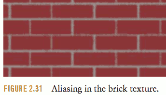

Notice that the width of the mortar grooves appears to vary in different parts of the image due to aliasing. This is the original version of the texture, without bump-mapped grooves. Later in the chapter we’ll see how to add antialiasing techniques to the brick texture to alleviate the aliases.

---

<h2 id="5daadabdd389ed925f78dd58dc8a4d68"></h2>


## Methods of Antialiasing Procedural Textures

Various ways to build low-pass filtering into procedural textures: 

- clamping, 
- analytic prefiltering, 
- integrals, 
- and alternative antialiasing methods.

Clamping is a special-purpose filtering method that applies only to textures created by spectral synthesis

Analytic prefiltering techniques are ways to compute low-pass-filtered values for some of the primitive functions that are used to build procedural textures.

One class of analytic prefiltering methods is based on the ability to compute the integral of the texture function over a rectangular region. 

Finally, we’ll consider alternatives to low-pass filtering that can be used when proper filtering is not practical.

Some procedural texture primitives are inherently band-limited; that is, they contain only a limited, bounded set of frequencies. *sin* is an obvious example of such a function. 
The *texture* function and its relatives have built-in filtering, so they are also band-limited. Unfortunately, some common language constructs such as *if* and *step* create sharp changes in value that generate arbitrarily high frequencies. Sharp changes in the shading function must be avoided. *smoothstep* is a smoothed replacement for step that can reduce the tendency to alias.  Can we simply replace *step* functions with *smoothstep* functions? Not an adequate solution. If the shader is tuned for a particular view, the smoothstep will alias when the texture is viewed from further away because the fixed-width smoothstep will be too sharp.On the other hand, when the texture is viewed from close up, the smoothstep edge is too blurry. A properly antialiased edge should look equally sharp at all scales. To achieve this effect, the *smoothstep* width must be varied based on the sampling rate.

<h2 id="1d1c18f28e90a17dd98ca3a3805cf950"></h2>


## Determining the Sampling Rate

To do low-pass filtering properly, the procedural texture function must know the sampling rate at which the renderer is sampling the texture.

The sampling rate is just the reciprocal of the spacing between adjacent samples in the relevant texture space or feature space. This is called the ***sampling interval***. For simple box filtering, the sampling interval is also the usual choice for the width of the box filter.

Obviously, the sampling interval cannot be determined from a single sample in isolation.  The procedural texture is invoked many times by the renderer to evaluate the texture at different sample points, but each invocation is independent of all of the others.

To determine the sampling rate or sampling interval without changing this model of procedural texture, the renderer must provide some extra information to each invocation of the procedural texture. In the RenderMan shading language, this information is in the form of built-in variables called ***du*** and ***dv*** and functions called ***Du*** and ***Dv***. 

The *du* and *dv* variables give the sampling intervals for the surface parameters (u, v). If the texture is written in terms of (u, v), the filter widths can be taken directly from *du* and *dv*. 

In most cases, procedural textures are written in terms of the standard texture coordinates (s, t), which are scaled and translated versions of (u, v), or in terms of texture coordinates computed from the 3D coordinates of the surface point P in some space.  In these cases, it is harder to determine the sampling interval, and the functions ***Du*** and ***Dv*** must be used. 

Du(a) gives an approximation to the derivative of some computed quantity *a* with respect to the surface parameter *u*.

Similarly, Dv(a) gives an approximation to the derivative of some computed quantity *a* with respect to the surface parameter *v*.

By multiplying the derivatives by the (u, v) sampling intervals, the procedural texture can estimate the sampling interval for a particular computed texture coordinate *a*.

In general, it is not safe to assume that the texture coordinate changes only when u changes or only when v changes. Changes along both parametric directions have to be considered and combined to get a good estimate, *awidth*, of the sampling interval for *a*:

```
awidth = abs(Du(a)*du) + abs(Dv(a)*dv);
```

The sum of the absolute values gives an upper bound on the sampling interval; if this estimate is in error, it tends to make the filter too wide so that the result is blurred too much. This is safer than making the filter too narrow, which would allow aliasing to occur.

It is desirable for the sampling interval estimate to remain constant or change smoothly. Sudden changes in the sampling interval result in sudden changes in the texture filtering, and that can be a noticeable and annoying flaw in itself.  Even if the derivatives Du and Dv are accurate and change smoothly, there is no guarantee that the renderer’s sampling intervals in (u, v) will also behave themselves. A surface seen in perspective could have sudden changes in sampling intervals between the nearer and more dis- tant parts of the surface. A renderer that uses adaptive sampling based on some estimate of apparent detail might end up using the values returned by the procedural texture itself to determine the appropriate sampling rates. That would be an interesting situation indeed —- one that might make proper low-pass filtering in the texture a very difficult task.

The remedy for cases in which the renderer’s sampling interval is varying in an undesirable way is to use some other estimate of the sampling interval, an estimate that is both less accurate and smoother than the one described above. One such trick is to use the distance between the camera and the surface position to control the low-pass filtering:

```
awidth = length(I) * k;
```

The filter width (sampling interval estimate) is proportional to the distance from the camera (length(I)), but some experimentation is needed to get the right scaling factor k.

It is especially tricky to find the right filter width to antialias a bump height func- tion for a bump-mapping texture. Since the bump height affects the normal vector used in shading, specular highlights can appear on the edges of bumps.

<h2 id="296d6837655d97560e6ec0d135dee4db"></h2>


## Clamping

Clamping is a very direct method of eliminating high frequencies from texture patterns that are generated by spectral synthesis. Since each frequency component is explicitly added to a spectral synthesis texture, it is fairly easy to omit every component whose frequency is greater than the Nyquist frequency.

Let’s begin with the following simple spectral synthesis loop, with a texture coordinate s:

```cpp
value = 0;
for (f = MINFREQ; f < MAXFREQ; f *= 2)
    value += sin(2*PI*f*s)/f;
```

- The loop begins at a frequency of MINFREQ and ends at a frequency less than MAXFREQ
- doubling the frequency on each successive iteration of the loop
- The amplitude of each sinusoidal component is the reciprocal of its frequency.

The following version is antialiased using the simplest form of clamping. The sampling interval in *s* is *swidth*.

```cpp
value = 0;
cutoff = clamp(0.5/swidth, 0, MAXFREQ); 

for (f = MINFREQ; f < cutoff; f *= 2)
    value += sin(2*PI*f*s)/f;
```

- In this version the loop stops at a frequency less than *cutoff* , which is the Nyquist frequency for the sampling rate *1/swidth* 
     - 要确保 <= Nyquist frequency/2 , 所以这里是  0.5/swidth

In order to avoid “pops,” sudden changes in the texture as the sampling rate changes (e.g., as we zoom in toward the textured surface), it is important to fade out each component gradually as the Nyquist frequency approaches the component frequency. The following texture function incorporates this gradual fade-out strategy:

```cpp
value = 0;
cutoff = clamp(0.5/swidth, 0, MAXFREQ); 

for (f = MINFREQ; f < 0.5*cutoff; f *= 2)
    value += sin(2*PI*f*s)/f;

fade = clamp(2*(cutoff-f)/cutoff, 0, 1); 
value += fade * sin(2*PI*f*s)/f;
```

- The loop ends one component earlier than before
- and that last component (whose frequency is between 0.5*cutoff and cutoff) is added in after the loop and is scaled by fade.
- The fade value gradually drops from 1 to 0 as the frequency of the component increases from 0.5*cutoff toward cutoff

This is really a result of changes in *swidth* and therefore in *cutoff*, rather than changes in the set of frequency components in the texture pattern.

Clamping works very well for spectral synthesis textures created with sine waves. But when the spectral synthesis uses some primitive that has a richer frequency spectrum of its own, clamping doesn’t work as well.

Even if the primitive is perfectly band-limited to frequencies lower than its nominal frequency, clamping is imperfect as a means of antialiasing.  In this case, clamping will eliminate aliasing, but the character of the texture may change as high frequencies are removed because each component contains low frequencies that are removed along with the high frequencies.

<h2 id="53ec4b61ddd25eb11d220ad40fcfb118"></h2>


## Analytic Prefiltering

A procedural texture can be filtered explicitly by computing the convolution of the texture function with a filter function. This is difficult in general, but if we choose a simple filter, the technique can be implemented successfully. The simplest filter of all is the box filter; the value of a box filter is simply the average of the input function value over the area of the box filter.

To compute the convolution of a function with a box filter the function must be integrated over the area under the filter.

This sounds tough, but it’s easy if the function is simple enough. 

Consider the *step* function shown in Figure 2.8. The step function is rather ill-behaved because it is discontinuous at its threshold value.  Let’s apply a box filter extending from x to x + w to the function step(b,x).  The result is the box-filtered step function, boxstep(a,b,x), where a = b - w (Figure 2.32). 

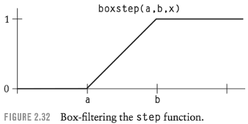

Boxstep is a linear ramp from 0 to 1 starting at a and ending at b. The slope of the ramp is 1/w.

The boxstep function can be written as a preprocessor macro in C or the shading language as follows:

```
#define boxstep(a,b,x) clamp(((x)-(a))/((b)-(a)),0,1)
```

Now the step(b,x) can be replaced with boxstep(b-w,b,x). If the filter width w is chosen correctly, the boxstep function should reduce aliasing compared to the step function.

<h2 id="e0c69d35a15d0876291ee3c294639c89"></h2>


## Better Filters

The box filter is far from ideal for antialiasing. A better filter usually results in fewer artifacts or less unnecessary blurring.  A better alternative to *boxstep* is the *smoothstep* function that was discussed earlier in this chapter. 

Filtering of the step with a first- order filter (box) gives a second-order function, namely, the linear ramp. 

Filtering of the step with a third-order filter (quadratic) gives a fourth-order function, namely, the cubic smoothstep.

Using smoothstep to replace step is like filtering with a quadratic filter, which is a better approximation to the ideal sinc filter than the box filter is.

The boxstep macro is designed to be plug-compatible with smoothstep. The call boxstep(WHERE-swidth, WHERE, s) can be replaced with the call smoothstep(WHERE-swidth, WHERE, s). This is the filtered version of step(WHERE, s), given a filter extending from s to s+swidth.

```
step -> boxstep -> smoothstep
```

Using the smoothstep cubic function as a filtered step is convenient and efficient because it is a standard part of the shading language. 

However, there are other filters and other filtered steps that are preferable in many applications. In particular, some filters such as the sinc and Catmull-Rom filters have ***negative lobes*** -- the filter values dip below zero at some points. Such filters generally produce sharper texture patterns, although ringing artifacts are sometimes visible. 

A Catmull-Rom filter can be convolved with a step function (which is equivalent to integrating the filter function) to produce a *catstep* filtered step function that has been used with good results.

<h2 id="ee6bda864552024462560f79bf0e5d54"></h2>


## Integrals and Summed-Area Tables

Crow (1984) introduced the ***summed-area table*** method of antialiasing image textures. 

A summed-area table is an image made from the texture image. 

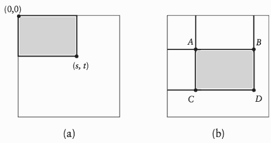

> FIGURE 2.33 The summed-area table: 
>    (a) table entry (s, t) stores area of shaded region; 
>    (b) four entries A, B, C, D are used to compute shaded area.

As illustrated in Figure 2.33(a), the pixel value at coordinates (s, t) in the summed-area table is the sum of all of the pixels in the rectangular area (0:s, 0:t) in the texture image.

The summed-area table makes it easy to compute the sum of all of the texture image pixels in any axis-aligned rectangular region. Figure 2.33(b) shows how this is done. The pixel values at the corners of the region A, B, C, D are obtained from the summed-area table (four pixel accesses). The sum over the desired region is then simply D + A − B − C. This sum divided by the area of the region is the average value of the texture image over the region.

If the region corresponds to the size and position of a ***box*** filter in the (s, t) space, the average value from the summed-area table calculation can be used as an antialiased texture value. The cost of the antialiasing is constant **regardless** of the size of the region covered by the filter, which is very desirable.

<h2 id="c7143f12bd99e3604f7d8adf4e8e0804"></h2>


### Example: Antialiased Brick Texture

The first step is to add the code needed to determine the filter width. 

```
float swidth, twidth;
```

To compute the filter widths, we can add two lines of code just before the **two** lines that compute the brick numbers sbrick and tbrick:

```
swidth = abs(Du(ss)*du) + abs(Dv(ss)*dv); 
twidth = abs(Du(tt)*du) + abs(Dv(tt)*dv); 
sbrick = floor(ss); /* which brick? */ 
tbrick = floor(tt); /* which brick? */
```

The actual antialiasing is done by replacing the following two lines of the origi- nal shader that determine where to change from mortar color to brick color:

```
w = step(MWF,ss) - step(1-MWF,ss);  // old code
h = step(MHF,tt) - step(1-MHF,tt);
```

with an antialiased version of the code:

```
w = boxstep(MWF-swidth,MWF,ss)
     - boxstep(1-MWF-swidth,1-MWF,ss);
h = boxstep(MHF-twidth,MHF,tt)
     - boxstep(l-MHF-twidth,l-MHF,tt);
```

This is just the same code using boxstep instead of step.

If the texture pattern consisted of a single brick in an infinite field of mortar, this would be sufficient. Unfortunately, more is required in order to handle a periodic pattern like the brick texture.

The brick texture depends on a mod-like folding of the texture coordinates to convert a single pulse into a periodic sequence of pulses. But a wide filter positioned inside one brick can overlap another brick, a situation that is not properly accounted for in this periodic pulse scheme.

To solve the aliasing problem in a more general way, we can apply the integration technique described in the previous section. The integral of a sequence of square wave pulses is a function that consists of upward-sloping ramps and plateaus. The ramps correspond to the intervals where the pulses have a value of 1, and the plateaus correspond to the intervals where the pulses have a value of 0.  In other words the slope of the integral is either 0 or 1, depending on the pulse value. The slope is the derivative of the integral, which is obviously the same as the original function.

The integrals of the periodic pulse functions in the *ss* and *tt* directions are given by the following preprocessor macros:

```
#define frac(x)  mod((x),1) // 1 ?
#define sintegral(ss)  (floor(ss)*(1-2*MWF) + max(0,frac(ss)-MWF))
#define tintegral(tt)  (floor(tt)*(1-2*MHF) + max(0,frac(tt)-MHF))
```

These are definite integrals from 0 to ss and 0 to tt.  The ss integral consists of the integral of all of the preceding complete pulses (the term involving the floor func- tion) plus the contribution of the current partial pulse (the term involving the frac- tional part of the coordinate).

To compute the antialiased value of the periodic pulse function, the shader must determine the value of the definite integral over the area of the filter. The value of the integral is divided by the area of the filter to get the average value of the periodic pulse function in the filtered region.


```
w = (sintegral(ss+swidth) - sintegral(ss))/swidth; 
h = (tintegral(tt+twidth) - tintegral(tt))/twidth;
```

When using this method of antialiasing, you should remove the following lines of code from the shader:

```
ss -= sbrick; 
tt -= tbrick;
```

because the *floor* and *mod* operations in the integrals provide the necessary periodicity for the pulse sequence. Forcing ss and tt to lie in the unit interval interferes with the calculation of the correct integral values.

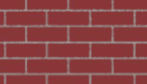

> FIGURE 2.34 Box-filtered version of the brick texture.


<h2 id="5fff91936d2b35e5829804e2f21bd376"></h2>


## MAKING NOISES

To generate irregular procedural textures, we need an irregular primitive function, usually called **noise**.

We discussed the importance of aliasing and antialiasing before covering irregular patterns because issues related to antialiasing are of key importance in the design of stochastic texture primitives.

The obvious stochastic texture primitive is ***white noise***, a source of random numbers, uniformly distributed with no correlation whatsoever between successive numbers. 

A pseudorandom number generator produces a fair approximation to white noise. But is white noise really what we need?  

It is not. 

White noise is never the same twice. We need a function that is apparently random but is a repeatable function of some inputs. 

But even this repeatable sort of white noise isn’t quite what is needed in a stochastic texture primitive. If we view an object from a new camera angle, the positions of the sample points at which the texture function is evaluated will change. A good PRN function will change its value markedly if the inputs change even slightly. Consequently, the texture will change when the camera is moved, and we don’t want that to happen.

To keep our procedural textures stable and to keep them from aliasing, we need a stochastic function that is smoother than white noise. ***The solution is to use a low- pass-filtered version of white noise.***   In the remainder of this chapter, we refer to these filtered noise functions simply as **noise** functions.

The properties of an ideal ***noise*** function are as follows:

- noise is a repeatable pseudorandom function of its inputs.
- noise has a known range, namely, from −1 to 1.
- noise is band-limited, with a maximum frequency of about 1.
- noise doesn’t exhibit obvious periodicities or regular patterns. Such pseudorandom functions are always periodic, but the period can be made very long and therefore the periodicity is not conspicuous.
     - 不明显的表现出周期性
- noise is *stationary* 静止的 -— that is, its statistical character 统计特性 should be translationally invariant 平移不变 .
- noise is *isotropic* 各向同性 -— that is, its statistical character should be rotationally invariant 旋转不变.


<h2 id="96cdfd02d5849846686f2eecc6bc24bf"></h2>


### Lattice Noises

Lattice noises are the most popular implementations of noise for procedural texture applications. 

The generation of a lattice noise begins with one or more uniformly distributed PRNs at every point in the texture space whose coordinates are integers. These points form the ***integer lattice***.  The necessary low-pass filtering of the noise is accomplished by a smooth interpolation between the PRNs. 

All lattice noises need some way to generate one or more pseudorandom numbers at every lattice point. The *noise* functions in this chapter use a table of PRNs that is generated the first time *noise* is called.  To find the PRNs in the table that are to be used for a particular integer lattice point (ix,iy,iz), we’ll use the following code:

```cpp
#define TABSIZE        256
#define TABMASK        (TABSIZE-1)
#define PERM(x)        perm[(x)&TABMASK]
#define INDEX(ix,iy,iz) PERM((ix)+PERM((iy)+PERM(iz)))
```

The macro *INDEX* returns an index into an array with *TABSIZE* entries. The selected entry provides the PRNs needed for the lattice point.  Note that TABSIZE must be a power of two so that performing `i&TABMASK` is equivalent to `i%TABSIZE`.  As noted on page 31, using `i%TABSIZE` isn’t safe, because it will yield a negative result if i is negative. Using the bitwise AND operation “&” avoids this problem.

The array *perm* contains a previously generated random permutation of the integers from zero to TABMASK onto themselves.

```cpp
static unsigned char perm[TABSIZE] = {
        225,155,210,108,175,199,221,144,203,116, 70,213, 69,158, 33,252,
          5, 82,173,133,222,139,174, 27,  9, 71, 90,246, 75,130, 91,191,
        169,138,  2,151,194,235, 81,  7, 25,113,228,159,205,253,134,142,
        248, 65,224,217, 22,121,229, 63, 89,103, 96,104,156, 17,201,129,
         36,  8,165,110,237,117,231, 56,132,211,152, 20,181,111,239,218,
        170,163, 51,172,157, 47, 80,212,176,250, 87, 49, 99,242,136,189,
        162,115, 44, 43,124, 94,150, 16,141,247, 32, 10,198,223,255, 72,
         53,131, 84, 57,220,197, 58, 50,208, 11,241, 28,  3,192, 62,202,
         18,215,153, 24, 76, 41, 15,179, 39, 46, 55,  6,128,167, 23,188,
        106, 34,187,140,164, 73,112,182,244,195,227, 13, 35, 77,196,185,
         26,200,226,119, 31,123,168,125,249, 68,183,230,177,135,160,180,
         12,  1,243,148,102,166, 38,238,251, 37,240,126, 64, 74,161, 40,
        184,149,171,178,101, 66, 29, 59,146, 61,254,107, 42, 86,154,  4,
        236,232,120, 21,233,209, 45, 98,193,114, 78, 19,206, 14,118,127,
         48, 79,147, 85, 30,207,219, 54, 88,234,190,122, 95, 67,143,109,
        137,214,145, 93, 92,100,245,  0,216,186, 60, 83,105, 97,204, 52
};
```

<h2 id="dc84a69bdc96850f89b6c4a9b9de5adb"></h2>


### Value Noise

Given a PRN between −1 and 1 at each lattice point, a noise function can be computed by interpolating among these random values. This is called value noise. The following routine will initialize a table of PRNs for value noise:

```cpp
#define RANDMASK Ox0fffffff
#define RANDNBR ((random() & RANDMASK)/(double) RANDMASK)

float valueTab[TABSIZE];

void
valueTabInit(int seed) {
    float *table = valueTab;
    int i;
    srandom(seed);
    for(i = 0; i < TABSIZE; i++) 
        *table++ = 1. - 2.* RANDNBR;
}

float
vlattice(int ix, int iy, int iz) {        // mark 1
    return valueTab[INDEX(ix,iy,iz)]; 
}

float
vnoise(float x, float y, float z) {  // mark2
    int ix, iy, iz;
    int i, j, k;
    float fx, fy, fz;
    float xknots[4], yknots[4], zknots[4]; 
    static int initialized = 0;

    if (!initialized) { 
        valueTabInit(665); 
        initialized = 1;
    }
    ix = FLOOR(x); 
    fx = x - ix;
    iy = FLOOR(y); 
    fy = y - iy;
    iz = FLOOR(z); 
    fz = z - iz;

    for (k = -1; k <= 2; k++) { 
        for (j = -1; j <= 2; j++) { 
            for (i = -1; i <= 2; i++)
                xknots[i+1] = vlattice(ix+i,iy+j,iz+k); 
            yknots[j+1] = spline(fx, 4, xknots);
        }
        zknots[k+1] = spline(fy, 4, yknots); 
    }
    return spline(fz, 4, zknots);
```


- mark 1: Given this table, it is straightforward to generate the PRN for an integer lattice point with coordinates ix, iy, and iz
- mark 2: The key decision to be made in implementing value noise is how to interpolate among the lattice PRNs.

A graph of a 1D sample of vnoise is shown in Figure 2.35(a), and an image of a 2D slice of the function is shown in Figure 2.36(a). Figure 2.37(a) shows its power spectrum. The noise obviously meets the criterion of being band-limited; it has no significant energy at frequencies above 1.

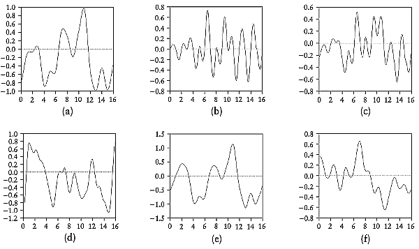

> FIGURE 2.35 Graphs of various noises: (a) vnoise; (b) gnoise (Perlin’s noise); (c) vnoise + gnoise; (d) Ward’s Hermite noise; (e) vcnoise; (f) scnoise.

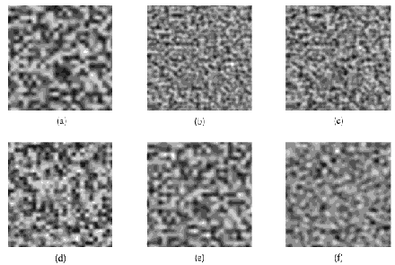

> FIGURE 2.36 2D slices of various noises: (a) vnoise; (b) gnoise (Perlin’s noise); (c) vnoise + gnoise; (d) Ward’s Hermite noise; (e) vcnoise; (f) scnoise.

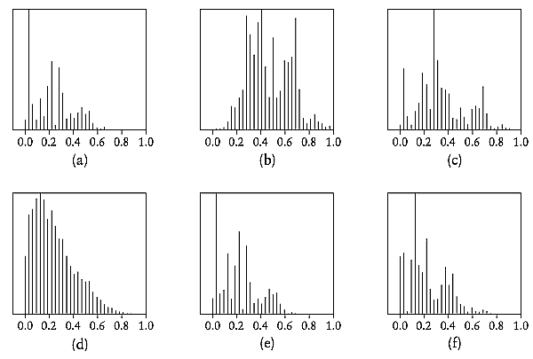

> FIGURE 2.37 The power spectra of various noises: (a) vnoise; (b) gnoise (Perlin’s noise); (c) vnoise + gnoise; (d) Ward’s Hermite noise; (e) vcnoise; (f) scnoise.

<h2 id="7d2055bc181beddaa2492eac27f6391b"></h2>


### Gradient Noise (TODO)

<h2 id="c4c1767627f4d536aaa1f5d36e06766e"></h2>


### Value-Gradient Noise (TODO)

<h2 id="90a621169450e7dda33fc8525a104e57"></h2>


### Lattice Convolution Noise (TODO)

<h2 id="52b2eb22dca333a7d0e00fcb3fd94634"></h2>


### Sparse Convolution Noise (TODO)

---

<h2 id="8d18618ccbae1c5db4a02e261d5013ef"></h2>


## GENERATING IRREGULAR PATTERNS

Armed with the stochastic primitive functions from the preceding section, we can now begin to generate irregular texture patterns.

The ***noise*** function in the RenderMan shading language is an implementation of the lattice gradient noise described in the preceding section. 

The RenderMan function is unusual in that it has been ***scaled and offset to range from 0 to 1***, instead of the more usual range of −1 to 1.  This means that the RenderMan noise function has a value of 0.5 at the integer lattice points. The −1 to 1 range is sometimes more convenient, and we can use the following signed noise macro in RenderMan shaders to get a noise in this range:

```cpp
#define snoise(x) (2 * noise(x) - 1)
```

The RenderMan noise function can be called with a 1D, 2D, or 3D input point, and will return a 1D or 3D result (a number, a point, or a color).

Most textures need several calls to noise to independently determine a variety of stochastic properties of the material. Remember that repeated calls to noise with the same inputs will give the same results. Different results can be obtained by shifting to another position in the noise space. It is common to call

```cpp
noise(Q * frequency + offset)
```

where *offset* is of the same type as the coordinate *Q* and has the effect of establishing a new noise space with a different origin point.

There are two approaches to generating time-dependent textures. Textures that move or flow can be produced by moving through the 3D noise space over time:

```
f = noise(P - time*D);
```

can be used to make the texture appear to move in the direction and rate given by the vector *D* as time advances. 

Periodic noise ***pnoise*** , 

For example, if a period of 30 is specified, pnoise will give the same value for input x + 30 as for input x.  Here are some typical pnoise calls:

```
pnoise(f, 30 );
pnoise(s, t, 30, 30) 
pnoise(P, point (10, 15, 30))
```

It is easy to implement pnoise by making the choice of lattice PRNs periodic with the desired period. This technique is limited to integer periods.

<h2 id="b5b337d45c62d6e1c218bb5b93d105cb"></h2>


## Spectral Synthesis

The discussion on page 48 , Several calls to noise can be combined to build up a stochastic spectral function with a particular frequency/power spectrum. A noise loop of the form

```
value = 0;
for (f = MINFREQ; f < MAXFREQ; f *= 2)
    value += amplitude * snoise(Q * f);
```

with amplitude varying as a function of frequency f will build up a value with a desired spectrum. Q is the sample point in some texture space.

Perlin’s well-known *turbulence* function is essentially a stochastic function of this type with a “fractal” power spectrum, that is, a power spectrum in which amplitude is proportional to 1/f.

```
float fractalsum(point Q) {
    float value = 0;
    for (f = MINFREQ; f < MAXFREQ; f *= 2)
        value += snoise(Q * f)/f; 
    return value;
}
```


This isn’t quite the same as turbulence, however. Derivative discontinuities are added to the turbulence function by using the absolute value of the snoise function. 

```
float turbulence(point Q) {
    float value = 0;
    for (f = MINFREQ; f < MAXFREQ; f *= 2)
        value += abs(snoise(Q * f))/f; 
    return value;
}
```

Figure 2.38 shows a slice of the fractalsum function on the left and a slice of the turbulence function on the right. 

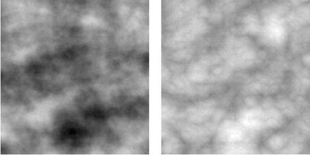

> FIGURE 2.38 Slices of fractalsum and turbulence functions.

The fractalsum is very cloudlike in appearance, while turbulence is apparently lumpier, with sharper changes in value.

Spectral synthesis loops should use clamping to prevent aliasing. Here is a version of turbulence with clamping included:


```
float turbulence(point Q) {
    float value = 0;
    float cutoff = clamp(0.5/Qwidth, 0, MAXFREQ); 
    float fade;
    for (f = MINFREQ; f < 0.5*cutoff; f *= 2) 
        value += abs(snoise(Q * f))/f;
    fade = clamp(2*(cutoff-f)/cutoff, 0, 1); 
    value += fade * abs(snoise(Q * f))/f; 
    return value;
}
```

Marble is a material that is typically simulated using an irregular texture based on spectral synthesis. The following marble shader uses a four-octave spectral synthesis based on *noise* to build up a stochastic value called *marble* that is similar to *fractalsum*.

```
#define PALE_BLUE         color (0.25, 0.25, 0.35) 
#define MEDIUM_BLUE     color (0.10, 0.10, 0.30) 
#define DARK_BLUE         color (0.05, 0.05, 0.26)
#define DARKER_BLUE     color (0.03, 0.03, 0.20) 
#define NNOISE            4

#define snoise(x) (2 * noise(x) - 1)

color
marble_color(float m)
{
    return color spline(
        clamp(2*m + .75, 0, 1),
        PALE_BLUE, PALE_BLUE,
        MEDIUM_BLUE, MEDIUM_BLUE, MEDIUM_BLUE,
        PALE_BLUE, PALE_BLUE,
        DARK_BLUE, DARK_BLUE,
        DARKER_BLUE, DARKER_BLUE,
        PALE_BLUE, DARKER_BLUE);
}

surface
blue_marble(
    uniform float Ka = 1;
    uniform float Kd = 0.8;
    uniform float Ks = 0.2;
    uniform float texturescale = 2.5;
    uniform float roughness = 0.1;
     )
{
    color Ct;
    point NN;
    point PP;
    float i, f, marble;

    NN = normalize(faceforward(N, I));
    PP = transform("shader", P) * texturescale;

    marble = 0; f = 1;
    for (i = 0; i < NNOISE; i += 1) {
        marble += snoise(PP * f)/f;
        f *= 2.17;
    }
    Ct = marble_color(marble);

    Ci = Os * (Ct * (Ka * ambient() + Kd * diffuse(NN))
        + Ks * specular(NN, normalize(-I), roughness));
}
```

The function marble_color maps the floating-point number marble into a color using a color spline. Figure 2.40 shows an example of the marble texture.

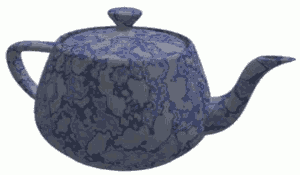

> FIGURE 2.40 Blue marble texture.


<h2 id="fcbfd4afc8873594d0a5a5b78dd16fda"></h2>


## Perturbed 扰乱的 Regular Patterns 

Purely stochastic patterns tend to have an amorphous character. Often the goal is a more structured pattern with some appearance of regularity.

The usual approach is to start with a regular pattern and add noise to it in order to make it look more interesting and more natural.

For example, the brick texture described on page 39 is unrealistically regular, as if the bricklayer were inhumanly precise.  To add some variety to the texture, *noise* can be used to modify the relative positions of the bricks in the different rows.

The following is the code from the original shader that calculates which brick contains the sample point.

```
sbrick = floor(ss); /* which brick? */ 
tbrick = floor(tt); /* which brick? */ 
ss -= sbrick;
tt -= tbrick;
```

To perturb the ss location of the bricks, we can rewrite this code as follows:

```
tbrick = floor(tt); /* which brick? */ 
ss += 0.1 * snoise(tbrick+0.5);
sbrick = floor(ss); /* which brick? */ 

ss -= sbrick;
tt -= tbrick;
```

- The call to *snoise* uses *tbrick* rather than *tt* so that the noise value is constant over the entire brick. 
     - Otherwise, the stochastic offset would vary over the height of the brick and make the vertical edges of the brick wavy. 
- Of course, we had to reorder the calculation of *sbrick* and *tbrick* so that *sbrick* can depend on *tbrick*.
- Since *snoise* is a gradient noise that is zero at all integer points, the perturbation always would be zero if the shader used `snoise(tbrick)`. 
     - Instead, it uses `snoise(tbrick + 0.5)` to sample the value of the noise halfway between the integer points, where it should have an interesting value. 
- The 0.1 multiplier on the *snoise* simply controls the size of the irregularity added to the texture. It can be adjusted as desired.


<h2 id="d441872eec16d305851e98aa1b90393c"></h2>


## Perturbed Image Textures

Another valuable trick is to use a stochastic function to modify the texture coordinates used to access an image texture. This is very easy to do. For example, the sim- ple texture access

```
Ct = texture(“example.tx”, s, t);
```

using the built-in texture coordinates s and t can be replaced with the following:

```
point Psh;
float ss, tt;
Psh = transform(“shader”, P);
ss = s + 0.2 * snoise(Psh);
tt = t + 0.2 * snoise(Psh+(1.5,6.7,3.4)); 
Ct = texture(“example.tx”, ss, tt);
```

In this example, snoise based on the 3D surface position in “shader” space is used to modify the texture coordinates slightly. Figure 2.41(a) shows the original im- age texture, and Figure 2.41(b) is a texture produced by perturbing the image texture with the code above.

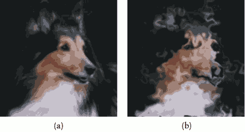

> FIGURE 2.41 Perturbing an image texture: (a) original image; (b) perturbed image.


<h2 id="33a888b2462b6062c56320b035b02c89"></h2>


## Random Placement Patterns

A random placement pattern is a texture pattern that consists of a number of regular or irregular subpatterns or “bombs” that are dropped in random positions and orientations to form the texture. 

The most obvious implementation is to store the positions of bombs in a table and to search the table for each sample point. This is rather inefficient and is especially hard to implement in the RenderMan shading language since **the language has no tables or arrays**.

With a little ingenuity, we can devise a method of bombing that uses only *noise* to determine the bomb positions relevant to a sample point. 

The texture space is divided into a grid of square cells, with a bomb located at a random position within each cell.

In the following example shader, the bomb is the star pattern created by the procedural texture on page 46.


```

#define NCELLS 10
#define CELLSIZE (1/NCELLS)
#define snoise(s,t)    (2*noise((s),(t))-1)

surface
wallpaper(
    uniform float Ka = 1;
    uniform float Kd = 1;
    uniform color starcolor = color (1.0000,0.5161,0.0000);
    uniform float npoints = 5;
     )
{
    color Ct;
    point Nf;
    float ss, tt, angle, r, a, in_out;
    float sctr, tctr, scell, tcell;
    float scellctr, tcellctr;
    float i, j;
    uniform float rmin = 0.01, rmax = 0.03;
    uniform float starangle = 2*PI/npoints;
    uniform point p0 = rmax*(cos(0),sin(0),0);
    uniform point p1 = rmin*
        (cos(starangle/2),sin(starangle/2),0);
    uniform point d0 = p1 - p0;
    point d1;

    scellctr = floor(s*NCELLS);
    tcellctr = floor(t*NCELLS);
    in_out = 0;

    for (i = -1; i <= 1; i += 1) {
        for (j = -1; j <= 1; j += 1) {
        scell = scellctr + i;
        tcell = tcellctr + j;
        if ( noise(3*scell-9.5,7*tcell+7.5) < 0.55) {
                sctr = CELLSIZE * (scell + 0.5
                     + 0.6 * snoise(scell+0.5, tcell+0.5));
                tctr = CELLSIZE * (tcell + 0.5
                     + 0.6 * snoise(scell+3.5, tcell+8.5));
                ss = s - sctr;
                tt = t - tctr;
            
                angle = atan(ss, tt) + PI;
                r = sqrt(ss*ss + tt*tt);
                a = mod(angle, starangle)/starangle;
            
                if (a >= 0.5)
                    a = 1 - a;
                d1 = r*(cos(a), sin(a),0) - p0;
                in_out += step(0, zcomp(d0^d1));
            }
        }
    }
    Ct = mix(Cs, starcolor, step(0.5,in_out));

    /* "matte" reflection model */
    Nf = normalize(faceforward(N, I));
    Oi = Os;
    Ci = Os * Ct * (Ka * ambient() + Kd * diffuse(Nf));
}
```

- A separate noise value for each cell could be tested to see whether the cell should contain a star.
     - If a star is so far from the center of a cell that it protrudes outside the cell, this shader will clip off the part of the star that is outside the cell.
- The tests can be done by a pair of nested for loops that iterate over −1, 0, and 1. The nested loops generate nine different values for the cell coordinate pair (scell, tcell). 
     - The star in each cell is tested against the sample point.
- The first *noise* call is used to decide whether or not to put a star in the cell. 
     - Note that the value of *in_out* can now be as high as 9.
     - The additional *step* call in the last line converts it back to a 0 to 1 range so that the mix will work properly. 


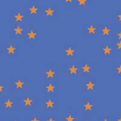

> FIGURE 2.42 Random placement wallpaper texture.


