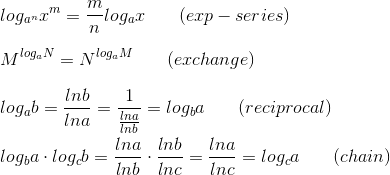
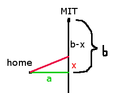
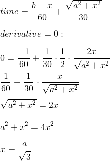
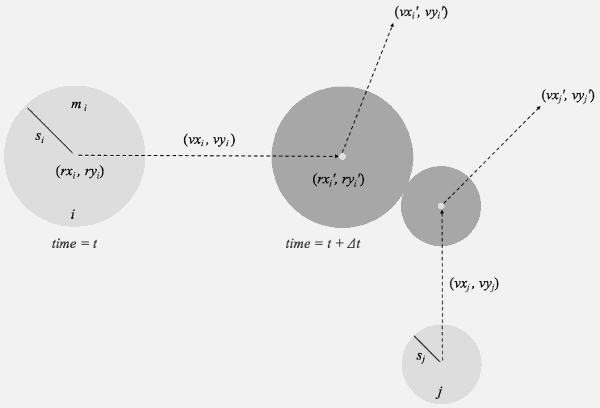
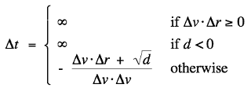

[](...menustart)

- [Trick](#59c9428d4e21d63aefeb230c919dcfe3)
    - [Match](#6da89265a9a8b0b28eb4946bb2ec0c6d)
        - [e](#e1671797c52e15f763380b45e841ec32)
        - [弧度θ 对应的单位扇形面积](#c7112c6a637487ace192a1747cc4e5a9)
        - [geometric series](#b287a415393520b5c5e9a45cf7f0ba02)
        - [对数函数](#13dab3aef82bac1ad3d1eba135dab6cd)
        - [选择时间最短路径](#a6cf0efcef5764df8b0aa13f2bc2a8cf)
        - [求√9.06](#ede6fd698e87ea72dbb43980639c76f6)
    - [Algorithm](#4afa80e77a07f7488ce4d1bdd8c4977a)
        - [二分法](#0608141511400ff7717263f89537faaf)
        - [求数组中的逆序数](#bb0a8ee4ec6c3520a9cf5fd4604aac07)
        - [已知顶点，求三角形面积](#c6456da5a90171a0792d3687af299d73)
        - [3维向量a,b,c 是否共面](#bcb9bc222a8bdf672334e86daa37bb8f)
        - [判断两个运动物体 何时碰撞](#664289c474abb7133d2e064e03c82e62)

[](...menuend)


<h2 id="59c9428d4e21d63aefeb230c919dcfe3"></h2>

# Trick

<h2 id="6da89265a9a8b0b28eb4946bb2ec0c6d"></h2>

## Match

<h2 id="e1671797c52e15f763380b45e841ec32"></h2>

### e

```octave
    (1 + 1/n)ⁿ → e  , while n → ∞
```

相似的:

```octave
    (1 + 1/n²)ⁿ → 1 ,  while n → ∞
```

```octave
    eˣ ≈ 1 + x  , while x → 0
```

<h2 id="c7112c6a637487ace192a1747cc4e5a9"></h2>

### 弧度θ 对应的单位扇形面积

```octave
S = πr²/(2π) * θ = θ/2
```

<h2 id="b287a415393520b5c5e9a45cf7f0ba02"></h2>

### geometric series

```octave
1 + x + x² + x³ + ...
```

```octave
for |x| < 1 , 1 + x + x² + ... = 1/(1-x)
for  x  ≠ 1 , 1 + x + x² + ... = (1- xᵏ⁺¹)/(1-x)
```

<h2 id="13dab3aef82bac1ad3d1eba135dab6cd"></h2>

### 对数函数

换底公式:

> logₐx = logᵦx / logᵦa

指系, 互换, 倒数, 链式公式:

> 

和差公式:

> logₐMN = logₐM + logₐN 
logₐ(M/N) = logₐM - logₐN 


<h2 id="a6cf0efcef5764df8b0aa13f2bc2a8cf"></h2>

### 选择时间最短路径



开车到MIT， 从家开车到麻省高速的车速是30,的垂直距离是a, 麻省高速的车速为60， 求最省时间的开车路线（红色)



<h2 id="ede6fd698e87ea72dbb43980639c76f6"></h2>

### 求√9.06

线性近似:

```
f(x) = √x = x⁰ᐧ⁵
f'(x) = 1/2 · x⁻⁰ᐧ⁵
choose a=9
f(a)=3
f'(a) = 1/6
√9.06 ≈ 3 + (9.06-9)*1/6 = 3.01
```


<h2 id="4afa80e77a07f7488ce4d1bdd8c4977a"></h2>

## Algorithm

<h2 id="0608141511400ff7717263f89537faaf"></h2>

### 二分法

<h2 id="bb0a8ee4ec6c3520a9cf5fd4604aac07"></h2>

### 求数组中的逆序数

 1. 把输入array 拆成两部分
 2. 对两个子数组 计算逆序数 X,Y  (*)
 3. 计算 子数组 之间统计关系 Z , 返回 X+Y+Z

- 第3步 牵涉到两个子数组的遍历，复杂度上很难做到线性，这里我们需要参考merge sort的做法，最后处理两个有序数组会简单的多。
- 所以 第2部需要同时对 子数组排序，并返回  (*) 


<h2 id="c6456da5a90171a0792d3687af299d73"></h2>

### 已知顶点，求三角形面积

- 已经三角形的三个顶点：(x1,y1),(x2,y2),(x3,y3),
    - 求面积:
    -  解： 

```           
                 |x1 y1 1|
     S= 1/2 det  |x2 y2 1|
                 |x3 y3 1|
```                     
                     
- PS。必须补1,不能补0,否则行列式就等于0了
- 补3个1，其实就是把 三角形平移到原点
- 如果有个顶点是原点,比如(x1,y1)=(0,0)
   
```                  
     S =  1/2 det|x2,y2|
                 |x3,y3|
```

<h2 id="bcb9bc222a8bdf672334e86daa37bb8f"></h2>

### 3维向量a,b,c 是否共面

- (a×b)·c称为abc的混合积，几何意义为abc所形成的平行六面体的体积。
- a,b,c 如果共面，则 (a×b)·c =0 , 即 a,b,c组成的行列式 为0


<h2 id="664289c474abb7133d2e064e03c82e62"></h2>

### 判断两个运动物体 何时碰撞

- Collision prediction.
    - Particle i: radius sᵢ, position (rxᵢ, ryᵢ), velocity (vxᵢ, vyᵢ).
    - Particle j: radius sⱼ, position (rxⱼ, ryⱼ), velocity (vxⱼ, vyⱼ).
    - Will particles i and j collide? If so, when?




- Δv=(Δvx, Δvy) = (vxᵢ −vxⱼ, vyᵢ −vyⱼ)
- Δr=(Δrx, Δry) = (rxᵢ −rxⱼ, ryᵢ −ryⱼ)

- collision time :
    - 
    - `d =(Δv⋅Δr)² − (Δv·Δv) (Δr·Δr - σ²)    ,  σ = σᵢ + σⱼ, σ is radius`

eg. let particle radius = 0.5 , σ =0.5+0.5 =1 ,  p1=( 1,0 ) , v1 = (2,0) ; p2=(3,0) , v2 = (1,0)

得:  dr = p1-p2 =  ( -2 , 0 ) , dv = ( 1,0 )  , dvdr = -2 

d = (-2)² - ( 1+0 )( 4+0 - 1 ) = 4-3 = 1

t = - (-2 + 1) / 1 = 1.


 


