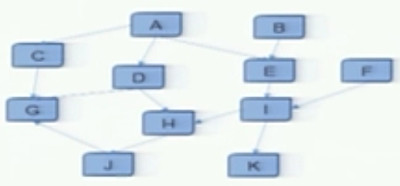
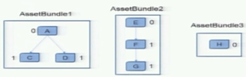
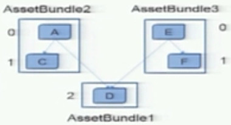
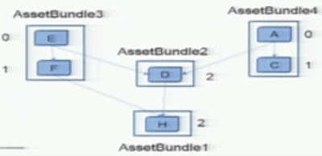
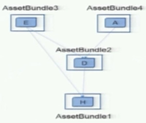
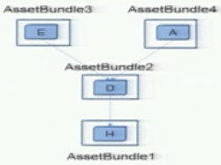
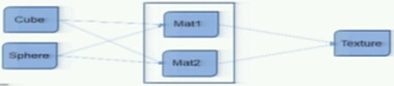

...menustart

 - [U3D官方视频笔记](#f1ee7f4951cb909fe3363d9e18ede423)
     - [Project Management](#9c1330f0dda3f188a3813b9840d1143f)
         - [Mid-size project must have](#3f285537c0fcae175e311accfb41198a)
         - [LevelManager](#3d9687e9851018a33e09bce2e1d5f2ec)
             - [Why level manager ?](#a2ceed21aa61d341a5508d5f14214d7e)
             - [LevelManager Design](#e40882d99c80772070faa494568ff842)
         - [PoolManager](#850bbb4af7a4e88699989bdeb4a7527f)
             - [Design Rules for PoolManager](#a93b8f8cd4cc57be6fba670068bc24a5)
         - [MVCS: STRANGEIOC](#91dc8cacaf7624ef35829f785af0a1f6)
             - [The structure of a binding -1](#e8807470ddfaad2fce09c2d505972349)
             - [Types Of Binding](#21457396df568ec61eb723910e9908c9)
             - [Dispatcher](#dbfcc2e96980bb87c34df3809193c62a)
             - [Binding Interface & Implementation](#8e1a806151a9cee8e8b4c10fe349cb5d)
         - [MVVM: UFRAME](#7ca55e8342451a007833f065b4c75e4c)
         - [Other Tips](#8d9a98cf25a028aee1f1a20316551d3f)
             - [.gitignore file](#fb8a64b340a59fe23488ca7885db7490)
             - [Coding Standards](#9814ec3c302083c9d2e91b076effbe18)
             - [Art Resource Standards](#8bbfd5d3cfd6334adf50a22c3d701bdf)
             - [Unity Test Tools](#b9991783ef30c7d06ad857557bb20049)
     - [AssetBundle](#e8cbe8f681e78018c49cfb82158030d8)
         - [资源管理方式](#fb2ba8cc3afe39366e3ddb768ad54a10)
         - [AssetBundle](#e8cbe8f681e78018c49cfb82158030d8)
         - [AssetBundel 打包](#5cfc2d7c7c797a4e568807fe9df63ed3)
         - [依赖关系打包](#691d7e829bd0714d1dc6e0d6311f5cff)
         - [打包策略](#3fd245fa883dfc9a0ce44e3c1abbcd57)
         - [如何处理复杂依赖关系](#df63e981899751ec1fe89935f7d158d1)
         - [获取依赖关系](#9a2b6f799c5f9ba8616ef0a9b23f3b3e)
         - [正确的打包方式](#447a142de1ac9e4a8864ffecf18c3e8e)
         - [图的深度优先遍历](#95c48c445d1eebb7ade830519c1b2d7a)
         - [保存依赖关系数据](#020a2caba65d15009d9808acbb39eff0)
         - [AssetBundle 加载](#ffd65b77175ac4d61c7c08af9bc00517)
         - [依赖关系加载](#625e28fa6d71960fc514d89869bcb1e9)
         - [依赖关系卸载](#fc60be9b3158701ab1abf8aa0f386d21)
         - [5.0 AB 打包](#5b8ad63fe23067fbdcbf84f04ddb3826)
             - [最小粒度打包](#040da83682535184fbf5d3ff726ab5b3)
             - [更优的依赖关系打包](#2b3e21f101378a300e0456315d37588c)
             - [5.0的简化过程](#10c9f5aa564a4bdc1d7cbe4b7be38881)
             - [AssetBundlemanifest](#d4ea68cba6ddcd63f2befa525816a682)
             - [依赖关系加载](#625e28fa6d71960fc514d89869bcb1e9)
             - [AssetBundle 的拆分](#11d9aa7f4767d5219dd71153c02752b8)
             - [AssetBundle 的合并](#8f69034f08bb0f53ea162d4639e8e34d)

...menuend


<h2 id="f1ee7f4951cb909fe3363d9e18ede423"></h2>


# U3D官方视频笔记

<h2 id="9c1330f0dda3f188a3813b9840d1143f"></h2>


## Project Management

Manager of managers

 - MainManager costomizes and manages all the submanagers
 - Submanagers operate as singletons and can easily address each other or colaborate.

**Submanagers**:

EventManager | Streamline messaging between classes
--- | ---
AudioManager | COntrol audio playback from one place
GUIManager  | centralize the controls to handle clicks , etc.
PoolManager | Persist perfab instances in RAM and display them as needed
LevelManager | Queue up levels and perfrom transitions between them.
GameManager | Manage the core game mechanics , usually project specific.
SaveManager | Save and load user preference and achievements
MenuManager | Controls all menus' animations,contents, and behaviors.

<h2 id="3f285537c0fcae175e311accfb41198a"></h2>


### Mid-size project must have

 - LevelManager
 - PoolManager
 - SaveManager

<h2 id="3d9687e9851018a33e09bce2e1d5f2ec"></h2>


### LevelManager

<h2 id="a2ceed21aa61d341a5508d5f14214d7e"></h2>


#### Why level manager ?

**Issus 1**: You need to know the scene name or the index of the scene which you want to load, but most probably the name or order will be changed later.

```
Application.LoadLevel("FirstLevel");
Application.LoadLevel(1);
```

**Issus 2**: There's no simple method of passing arguments to a scene, eg, assuming you're resuing one scene for many different levels.

> Application.LoadLevel("FirstLevel" , ~~LevelArgs~~ );

<h2 id="e40882d99c80772070faa494568ff842"></h2>


#### LevelManager Design

 - Compose a configuration table
 - Create a new API:  `LevelManager.LoadNext();`
 - manager the transitions between two levels easily

---

<h2 id="850bbb4af7a4e88699989bdeb4a7527f"></h2>


### PoolManager

*A simple pool design*:

 - Maintain a list of dormant(暂时不用的) objects 
```
private List<GameObject> dormantObjects = new List<GameObject>();
```

 - The list contains all different types of game objects/perfabs
 - Spawn(), Despawn(), Trim() 

```
pubic GameObject Spawn( GameObject go ) {
    GameObject temp = nil;
    if (dormantObjects.Count > 0) {
        foreach ( GameObject dob in dormantObjects ) {
            if (dob.name == go.name) {
                // find an available GameObject
                temp = dob ;
                dormantObjects.Remove(temp);
                return temp ;
            } // end if dob.name
        } //end for
    } // end if
    
    //Now instantiate a new GameObject
    temp = GameObject.Instantiate(go) as GameObject ;
    temp.name = go.name ;
    return temp ;
} // end func
```

```
public void Despawn( GameObject go ) {
    go.transform.parent = PoolManager.transform ; // why shoud have this ?
    go.SetActive( false );
    dormantObjects.Add(go) ;
    Trim();
}
```

```
public void Trim() {
    while ( dormantObjects.Count > Capacity ) {
        GameObject dob = dormantObjects[0];
        dormantObjects.RemoveAt(0);
        Destroy( dob ) ;
    } // end while
} // end func
```


**A better design:

 - PoolManger   // top pool manager
    - SpawnPool  // for a type of prefabs
        - PrefaPool // for a prefab
            - Active instances
            - Inactive instances


<h2 id="a93b8f8cd4cc57be6fba670068bc24a5"></h2>


#### Design Rules for PoolManager

 - As a singleston.
 - Manage multiple SpawnPools.

For prefab pool:

 - Create a PrefabPool for each prefab.
 - Maintain a list of activated objects and another list of deactive objects.
 - Centrally manager the Load/Unload process here.
 - Avoid setting an instance limitation number
 - if really necessary, follow the following rules:
    - Waits for 'cullDelay' in seconds and culls the 'despawned' list if above amount
    - cull less 5 instances each time
    - start a separate coroutine to do the culling work.


<h2 id="91dc8cacaf7624ef35829f785af0a1f6"></h2>


### MVCS: STRANGEIOC

<h2 id="e8807470ddfaad2fce09c2d505972349"></h2>


#### The structure of a binding -1

 - Basic Structure 
    - `IBinder.Bind<Key>().To<Value>();`
 - The key triggers the value

<h2 id="21457396df568ec61eb723910e9908c9"></h2>


#### Types Of Binding

 Key  | Value  | Notes   
--- | --- | --- 
event | callback | an event triggers a callback
interface | implementation | binds an interface to its implementation
class | dependent class | the instantiation of one class trigger the instantiation of its dependent class

<h2 id="dbfcc2e96980bb87c34df3809193c62a"></h2>


#### Dispatcher

 - Simple format
    - dispatcher.Dispatch( AttackEvent.FIRE_MISSILE ); 
 - Event + Data
    - dispatcher.Dispatch( AttackEvent.FIRE_MISSILE, orientation )

<h2 id="8e1a806151a9cee8e8b4c10fe349cb5d"></h2>


#### Binding Interface & Implementation

```
interface IMonster {
    IWeapon weapon{get;set;}
}
class Monster:IMonster {
    [Inject]  // the magic word
    public IWeapon weapon{get;set;}
}

context.injectionBinder.Bind<IWeapon>().To<Gun>();
context.injectionBinder.Bind<IWeapon>().To<Cannon>();
```

 - If you inject something, you have to map it, otherwise , it will result in null pointer errors
 - Injection employs reflection, which is slow.

<h2 id="7ca55e8342451a007833f065b4c75e4c"></h2>


### MVVM: UFRAME

---

<h2 id="8d9a98cf25a028aee1f1a20316551d3f"></h2>


### Other Tips

<h2 id="fb8a64b340a59fe23488ca7885db7490"></h2>


#### .gitignore file  

where to get ?

<h2 id="9814ec3c302083c9d2e91b076effbe18"></h2>


#### Coding Standards

 - Use C#
 - Naming conventions
    - Use descriptive name 
 - Logical folder structure
    - Use named empty game objects as scene folders
 - Use cache
    - Cache component references , `GetComponent<ComponentName>()` is slow 
    - Cache objects references , GameObject.Find() is very slow
    - Memory allocation with object pools
    - Use sharing materials

<h2 id="8bbfd5d3cfd6334adf50a22c3d701bdf"></h2>


#### Art Resource Standards

 - Reasonable & strict
 - Automatic tools

<h2 id="b9991783ef30c7d06ad857557bb20049"></h2>


#### Unity Test Tools

 - Published by Unity
 - Asset Store
 - Free

---

<h2 id="e8cbe8f681e78018c49cfb82158030d8"></h2>


## AssetBundle
 
Asset: Mesh,Material,Texture, Audio,etc...

<h2 id="fb2ba8cc3afe39366e3ddb768ad54a10"></h2>


### 资源管理方式

 - Assets
    - 只有被引用的资源会被打包
    - 适合存放静态资源
    - 不能动态加载
 - Resources
    - 支持动态加载
    - Resources.assets文件 (2G限制)
    - 随安装包完全下载，无法动态更新
 - StreamingAssets
    - 保持文件原始格式
        - 比如可以存放原始的jpg文件，而不导入成内部格式
    - 随安装包完全下载，无法动态更新
    - Application.streamingAssetsPath
 - AssetBundle

  \ | 动态加载 | 动态更新 | 本地缓存
 --- | --- | --- | ---
Assets |  No | No | N/A
Resources | Yes | No | N/A
AssetBundle | Yes | Yes | Yes
StreamingAssets | Yes | No | N/A

<h2 id="e8cbe8f681e78018c49cfb82158030d8"></h2>


### AssetBundle

 - Asset 的集合
 - 压缩(缺省)
 - 动态加载
 - 动态更新

<h2 id="5cfc2d7c7c797a4e568807fe9df63ed3"></h2>


### AssetBundel 打包

依赖关系导致资源重复

 - Cube-> Mat <- Cylinder
 - Asset Bundle 1
    - Cube + Mat 
 - Asset Bundle 2
    - Cylinder + Mat

<h2 id="691d7e829bd0714d1dc6e0d6311f5cff"></h2>


### 依赖关系打包

 - Asset Bundle 1 : Cube
 - Asset Bundle 2 : Cylinder
 - Asset Bundle 3 : Mat

<h2 id="3fd245fa883dfc9a0ce44e3c1abbcd57"></h2>


### 打包策略

 - 尽可能的减少冗余资源
    - 减少 AppSize , 减少网络下载流量
 - 分类打包
    - 按类型, 或者用途打包 
 - AssetBundle 大小尽量不超过1M
    - 较少 IO 压力 

<h2 id="df63e981899751ec1fe89935f7d158d1"></h2>


### 如何处理复杂依赖关系




<h2 id="9a2b6f799c5f9ba8616ef0a9b23f3b3e"></h2>


### 获取依赖关系

```
public static string[] AssetDatabase.GetDependencies(string)
```

首先以每个资源为一个节点，以最低粒度构造有向图。

只考虑入度，直接打包 入度为0的资源，可以包含入度为1的资源。
 


但是入度 >= 2的资源有可能被重复打包:


<h2 id="447a142de1ac9e4a8864ffecf18c3e8e"></h2>


### 正确的打包方式

入度为1的资源可以被自动打包到上一级的AB包中, 为避免入度为2的资源重复打包，需要将它单独放到一个AB包.



大多数情况，有向图会变得很复杂:



我们可以对有向图进行简化，入度为1的可以简化，入度为2或以上的为共享资源：



当前节点和父节点，共同拥有的依赖关系，可将2父节点的依赖关系删除, 比如 2 和 其父节点3 都依赖于 节点1，可以将 3-1的依赖关系删除: 

 

<h2 id="95c48c445d1eebb7ade830519c1b2d7a"></h2>


### 图的深度优先遍历

入度为0的节点开始，遍历打包

<h2 id="020a2caba65d15009d9808acbb39eff0"></h2>


### 保存依赖关系数据

依赖关系，加载的时候需要用到


<h2 id="ffd65b77175ac4d61c7c08af9bc00517"></h2>


### AssetBundle 加载

 - new WWW
 - WWW.LoadFromCacheOrDownload
 - AssetBundle.CreateFromMemory
 - AssetBundle.CreateFromFile

<h2 id="625e28fa6d71960fc514d89869bcb1e9"></h2>


### 依赖关系加载

需要先加载所依赖的AB包, 然后再加载自身。

<h2 id="fc60be9b3158701ab1abf8aa0f386d21"></h2>


### 依赖关系卸载

通过 Reference Count 来判断是否需要卸载一个AB包

<h2 id="5b8ad63fe23067fbdcbf84f04ddb3826"></h2>


### 5.0 AB 打包

BuildAssetBundle() 方法内部有处理依赖关系，但是不能完全避免资源重复.

<h2 id="040da83682535184fbf5d3ff726ab5b3"></h2>


#### 最小粒度打包

可以直接使用该API，内置依赖关系处理

AssetBundleManifest.BuildAssetBundles

<h2 id="2b3e21f101378a300e0456315d37588c"></h2>


#### 更优的依赖关系打包

 - 仍需通过依赖关系图去分析
 - 生成Asset 到AssetBundle的关系映射
 - 分析结果生成AssetBundleBuild

<h2 id="10c9f5aa564a4bdc1d7cbe4b7be38881"></h2>


#### 5.0的简化过程

 - 不再需要push / pop 依赖关系
 - 不需要通过图的遍历逐个生成AB包
 - 只需要找到入度为0和 入度>=2 的资源节点，一次性发送到BuildAssetBundles 处理

<h2 id="d4ea68cba6ddcd63f2befa525816a682"></h2>


#### AssetBundlemanifest

<h2 id="625e28fa6d71960fc514d89869bcb1e9"></h2>


#### 依赖关系加载

```
AssetBundlemanifest.GetAllDependencies()
AssetBundlemanifest.GetDirectDependencies()
```

<h2 id="11d9aa7f4767d5219dd71153c02752b8"></h2>


#### AssetBundle 的拆分

避免 AssetBundle 过大

<h2 id="8f69034f08bb0f53ea162d4639e8e34d"></h2>


#### AssetBundle 的合并

如果两个资源拥有相同的 入度和出度(资源)依赖，则可以合并:

 

