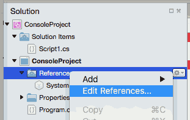

...menustart

 - [CSharp](#83925001a044cdfe0c64e9a44345b66d)
     - [Basic Type](#c15a09266c6dbf2bcb4bcabd6fb14f39)
     - [Namespacing](#c2eafc39088c6121225cd7b36a014621)
     - [Add Library Project](#7de94d9ed336931705ec2921af14270a)
     - [Enum-ination](#74ef71a5f19a745d9aa9326cdb6d5801)
     - [Struct](#886ef5dbd655a6c97726d7091c6b173e)
     - [get / set](#ba02bcf94a86de2bff29fbe88fcdbbcc)
     - [Delegate](#26545d7107c7489959a37bd671181fca)
     - [Delegate 和 Event](#575210159edf066ae8277de1c0671442)
     - [Delegate / Event 小结](#e9a8a0ce14bcd50d20531f380758b55f)

...menuend


<h2 id="83925001a044cdfe0c64e9a44345b66d"></h2>


# CSharp

Mono for Mac OS X: http://www.mono-project.com/download/

 - 使用 Xamarin Studio 运行 U3D 脚本？
    - 
    - .Net Assembly
    - 添加 UnityEngine.dll in
    - /Applications/Unity/Unity.app/Contents/Frameworks/Managed/

<h2 id="c15a09266c6dbf2bcb4bcabd6fb14f39"></h2>


### Basic Type

    bool , string , int , float


```
string[] weapons = new string[5];  
int[] codes = { 3, 8, 2 };
```

<h2 id="c2eafc39088c6121225cd7b36a014621"></h2>


## Namespacing

```
namespace Tutorial1
{
    public class Point
    {
        //... all the point methods and variables...
    }
}
```
```
// Import the System namespace into our application, this is for Console.Writeline
using System;
 
// Declare the namespace Tutorial1
namespace Tutorial1
{
    class MainClass
    {
        public static void Main(string[] args)
        {
            Point home = new Point();
            home.x = 3;
            home.y = 1;
            home.Translate(5, -2);
            Console.WriteLine(home.ToString());
        }
    }
}
```

<h2 id="7de94d9ed336931705ec2921af14270a"></h2>


## Add Library Project

 - Edit Reference
 - Projects
 - add lib project


Point class in lib project:

```
using System;

namespace Tutorial2
{
    public class Point
    {
        public float x;
        public float y;

        public void Translate(float dx, float dy)
        {
            x += dx;
            y += dy;
        }       
    }

}
```
 
main project:

```
using System;
using Tutorial2;

namespace Tutorial1
{


    class MainClass
    {
        public static void Main(string[] args)
        {
            Point home = new Point();
            home.x = 3;
            home.y = 1;
            home.Translate(5, -2);
            Console.WriteLine(home.ToString());
        }
    }
}
```

<h2 id="74ef71a5f19a745d9aa9326cdb6d5801"></h2>


## Enum-ination

```
using UnityEngine;
using System.Collections;
 
public class Weather : MonoBehaviour
{
    public enum Temperatures
    {
        Unknown,
        Freezing,
        Cold,
        Mild,
        Warm,
        Hot
    }
 
    public Temperatures temperature = Temperatures.Unknown;
 
    protected void Update()
    {
    }
 
    protected void OnGUI()
    {
    }
}
```

<h2 id="886ef5dbd655a6c97726d7091c6b173e"></h2>


## Struct

A structure is a lightweight object.

```
    public struct PlayerName
    {
        public string First; 
        public string Last;
    }
    public PlayerName playername
```

<h2 id="ba02bcf94a86de2bff29fbe88fcdbbcc"></h2>


## get / set

```
public string FullName
{
    get
    {
        return playerName.First + " * " + playerName.Last;
    }
    set
    {
        string[] names = value.Split(new char[] { ' ' });
 
        if(names.Length > 0)
        {
            playerName.First = names[0];
        }
 
        if(names.Length > 1)
        {
            playerName.Last = names[1];
        }
    }
}
```


<h2 id="26545d7107c7489959a37bd671181fca"></h2>


## Delegate

delegate是C#中的一种类型，它实际上是一个能够**持有对某个方法的引用**的类。

与其它的类不同，delegate类能够拥有一个**signature**签名,并且它只能持有与它的签名相匹配的方法的引用。

C#中的 delegate 类似于C或C++中的函数指针。

与函数指针相比,delegate既可以引用静态函数，又可以引用非静态成员函数。在引用非静态成员函数时，delegate不但保存了对此函数入口指针的引用，而且还保存了调用此函数的类实例的引用。( 闭包？) 
其次，与函数指针相比，delegate是面向对象、类型安全、可靠的受控（managed）对象。也就是说，runtime能够保证delegate指向一个有效的方法，你无须担心delegate会指向无效地址或者越界地址。

```C#
class TestDelegate
{
    //声明了一个Delegate Type
    public delegate void DelegateMethod();  
    
    //使用类型,声明一个Delegate对象引用
    public DelegateMethod delegateMethod;   

    public static void StaticMethod()   
    {
        Console.WriteLine("Delegate a static method");
    }

    public void NonStaticMethod()   
    {
        Console.WriteLine("Delegate a non-static method");
    }

    public void RunDelegateMethods()
    {
        if(delegateMethod != null){
            Console.WriteLine("---------");
            delegateMethod.Invoke();    
            Console.WriteLine("---------");
        }
    }
}

class Test
{
    static void OtherClassMethod(){
        Console.WriteLine("Delegate an other class's method");
    }

    static void Main(string[] args)
    {
        var test = new TestDelegate();
        test.delegateMethod = new TestDelegate.DelegateMethod(test.NonStaticMethod);
        test.delegateMethod += new TestDelegate.DelegateMethod(TestDelegate.StaticMethod);
        test.delegateMethod += Program.OtherClassMethod;
        test.RunDelegateMethods();
    }
}
```

代码解读：

 1. public delegate void DelegateMethod(); 
    - 声明一个 delegate 类型 `DelegateMethod`， 这个delegate 类型可以搭载： 返回值 void, 无参数的函数。 
 2. public DelegateMethod delegateMethod ;
    - 声明一个 DelegateMethod类型的对象 `delegateMethod`
 3. 为什么上面说Delegate可以看做是函数指针呢？看下面代码：
    
    ```
    test.delegateMethod = new TestDelegate.DelegateMethod(test.NonStaticMethod); 
test.delegateMethod += new TestDelegate.DelegateMethod(TestDelegate.StaticMethod); 
test.delegateMethod += Program.OtherClassMethod; 
    ```
    
    - 这里delegateMethod搭载了3个函数, 可以通过调用`delegateMethod.Invoke();`运行被搭载的函数。
 4. Delegate在搭载多个方法时，可以通过+=增加搭载的函数，也可以通过-=来去掉Delegate中的某个函数。
 5. 一个 delegate对象一次可以搭载多个方法（methods）
    - 当我们invoke一个搭载了多个方法（methods）的delegate，所有的方法会以“被搭载到delegate对象的顺序”被依次调用。
 6. 使用Delegate，我们可以非常方便地实现观察者模式。而其实，在需要使用回调函数时，我们都可以考虑使用Delegate。


<h2 id="575210159edf066ae8277de1c0671442"></h2>


## Delegate 和 Event

 1. Delegate和Event的关系
     - 事件的实现依赖于delegate   
     - C#中的事件处理实际上是一种具有特殊签名的delegate，象下面这个样子：
        - `public delegate void MyEventHandler(object sender, MyEventArgs e)`;
        - sender代表事件发送者，e是事件参数类
        - MyEventArgs类用来包含与事件相关的数据，所有的事件参数类都必须从System.EventArgs类派生。当然，如果你的事件不含参数，那么可以直接用System.EventArgs类作为参数
     - 声明事件：若要在类内声明事件，首先必须声明该事件的委托类型。

 2. Event 的实现
    1. 定义delegate对象类型，它有两个参数，第一个参数是事件发送者对象，第二个参数是事件参数类对象。
    2. 定义事件参数类，此类应当从System.EventArgs类派生。如果事件不带参数，这一步可以省略。
    3. 定义事件处理方法，它应当与delegate对象具有相同的参数和返回值类型。
    4. 用event关键字定义事件对象，它同时也是一个delegate对象。
    5. 用+=操作符添加事件到事件队列中（-=操作符能够将事件从队列中删除）。
    6. 在需要触发事件的地方用调用delegate的方式写事件触发方法。一般来说，此方法应为protected访问限制，既不能以public方式调用，但可以被子类继承。名字是OnEventName。
    7.  在适当的地方调用事件触发方法触发事件。
         
 3. “public Notify notifier”和“public event Notify notifier”的区别
    - “public Notify notifier”相当于Class里面的Field，访问级别是public，而“public event Notify notifier”则相当于Property，访问级别是private！ 

<h2 id="e9a8a0ce14bcd50d20531f380758b55f"></h2>


## Delegate / Event 小结

什么时候我们可能会用到Delegate：

 1. 当我们在C#中需要类似函数指针这样东西时
 2. 当我们需要使用回调函数的时候
 3. 需要异步调用的时候。
 4. 实现观察者模式的时候。
 5. 处理事件响应的时候。

