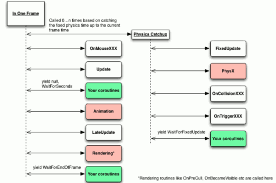

...menustart

- [协程](#ebe9865478157ea2f0762aa24f6a85f5)
    - [IEnumerator & Coroutine](#b627ed692ee4c2a9610c0d05b6da8f93)
    - [StartCoroutine](#f8d9e507d81d42f946e1661c42e22743)

...menuend


<h2 id="ebe9865478157ea2f0762aa24f6a85f5"></h2>


## 协程

协程是一个executed partially，遇到条件（ **yield return 语句**）会挂起，直到条件满足才会被唤醒继续执行后面代码的函数。

协程的作用: **控制代码在特定的时机执行** .

 1. 延时（等待）一段时间执行代码
 2. 等某个操作完成之后再执行后面的代码

协程不是线程，也不是异步执行的。协程和 MonoBehaviour的Update函数一样,也是在MainThread中执行的。使用协程你不用考虑同步和锁的问题。

Unity在每一帧（Frame）都会去处理对象上的协程, 主要是在Update后去处理协程（检查协程的条件是否满足），但也有写特例：



协程跟Update()其实一样的，都是Unity每帧对会去处理的函数（如果有的话）。如果MonoBehaviour 是处于激活（active）状态的而且yield的条件满足，就会协程方法的后面代码。

```
注: 图是从UnityGems.com上得来的，
上面显示如果yield return null, 协程会在同一帧被唤醒, 
D.S.Qiu用的是Unity 4.3.4f1 进行测试的。
经过测试验证，协程至少是每帧的LateUpdate()后去运行。
```

MonoBehaviour.enabled = false 协程会照常运行,但 gameObject.SetActive(false) 后协程却全部停止，即使在Inspector把  gameObject 激活还是没有继续执行.

也就说协程虽然是在MonoBehvaviour启动的（StartCoroutine）但是**协程函数的地位完全是跟MonoBehaviour是一个层次的**，不受MonoBehaviour的状态影响，但跟MonoBehaviour脚本一样受gameObject 控制，也应该是和MonoBehaviour脚本一样每帧“轮询” yield 的条件是否满足。

yield 后面可以有的表达式：

表达式 | 说明
--- | ---
null | the coroutine executes the next time that it is eligible
WaitForEndOfFrame | the coroutine executes on the frame, after all of the rendering and GUI is complete
WaitForFixedUpdate | causes this coroutine to execute at the next physics step, after all physics is calculated
WaitForSeconds | causes the coroutine not to execute for a given game time period
WWW | waits for a web request to complete (resumes as if WaitForSeconds or null)
Another coroutine | in which case the new coroutine will run to completion before the yielder is resumed
number | the total frames to wait

值得注意的是 WaitForSeconds()受Time.timeScale影响，当Time.timeScale = 0f 时，yield return new WaitForSecond(x) 将不会满足。

<h2 id="b627ed692ee4c2a9610c0d05b6da8f93"></h2>


### IEnumerator & Coroutine

协程其实就是一个IEnumerator（迭代器），IEnumerator 接口有两个方法 Current 和 MoveNext().

我们可以不使用 StartCoroutine 而是手动调用，或切换协程的执行。

下面是一个例子，DoHijack 是一个自动执行的协程, 它负责切换两个协程的执行

```C#
...
StartCoroutine(DoHijack());
...

IEnumerator DoHijack()
{
    while(true)
    {
        //Check if we have a current coroutine and MoveNext on it if we do
        if(_current != null && _current.MoveNext())
        {
            //Return whatever the coroutine yielded, so we will yield the
            //same thing
            yield return _current.Current;
        }
        else
            //Otherwise wait for the next frame
            yield return null;
    }
}
```

    
<h2 id="f8d9e507d81d42f946e1661c42e22743"></h2>


### StartCoroutine

1) public Coroutine StartCoroutine(IEnumerator routine);

The yield return value specifies when the coroutine is resumed.

StartCoroutine function always returns immediately:

```C#
    print("Starting " + Time.time);   // 0
    StartCoroutine(WaitAndPrint(2.0F));
    print("Before WaitAndPrint Finishes " + Time.time // 0 );
```

however you can yield the result. This will wait until the coroutine has finished execution (完全执行完，而不是 yield return ) .

```C#
    IEnumerator Start() {
        print("Starting " + Time.time);  // 0
        yield return StartCoroutine(WaitAndPrint(2.0F));
        print("Done " + Time.time);  // 2
    }
    IEnumerator WaitAndPrint(float waitTime) {
        yield return new WaitForSeconds(waitTime);
        print("WaitAndPrint " + Time.time);
    }
```

2) public Coroutine StartCoroutine(string methodName, object value = null);

StartCoroutine using a string method name allows you to use StopCoroutine with a specific method name.

The downside is that the string version has a higher runtime overhead to start the coroutine and you can pass only one parameter.

