...menustart

- [3 大型网站 核心架构要素](#f494e8a823be062f5bf0b68ec3b316d6)
    - [3.3 伸缩性](#4478f5669600cfdaaa55612117ceefc6)
    - [3.4 扩展性](#9ea883efad03e816d000684b8eb12201)
- [4 网站的高性能架构](#5946c5f9abd5d76fa8d99962980e3d87)
    - [4.3 应用服务器性能优化](#a8de1b745a9683e8c3ad03f95ffaee33)
        - [4.3.1 分布式缓存](#0ed22c6fdd0abb9cb18dfc365e989f96)
        - [4.3.2 异步操作](#d1925a0ee2b64b77937d2ac52484e835)
        - [4.3.3 使用集群](#d85431a3284d7b1c6a65e74666a19a51)
        - [4.3.4 代码优化](#4562a82da4b3b6f77f5ef2276fa04579)
- [5 网站的高可用架构](#14f5f664c41d9fc2605e919d9abc4b0d)
    - [5.2 高可用的网站架构](#b6f63ac10c5f481a87c3b93332a6dd2b)
    - [5.3 高可用的应用](#efbb46fbbffa4d040900d5647f38d8e7)
        - [5.3.1  通过负载均衡进行 无状态服务的 失效转移](#966a1b87120c21e2df1cfc11af758623)
        - [5.3.2  应用服务器集群的 Session 管理](#33ad76eb565b3445ba051acf75076c5b)
    - [5.4 高可用的服务](#48c042d0403b139b513bb576725c63f1)
    - [5.5 高可用数据](#0873ccdf7306ae966deb8470df7017d0)
        - [5.5.1 CAP 原理](#a9760eed1d22446b4f37a030eec74309)
        - [5.5.2 数据备份](#910e25d8a3307e5bf8cf799e9f9f8d9a)
        - [5.5.3 失效转移](#01cae33e06a06add92e4fe2df52ad18c)
- [6 网站的伸缩性架构](#722671548a0a019ba6b8bd80c066cbd7)
    - [6.1 网站架构的伸缩性设计](#b197036b5d48829eaf69683e1762b815)
        - [6.1.1 不同功能进行物理分离实现伸缩](#cce0f0c3a0372e5811085f6f52e8d682)
        - [6.1.2 单一功能通过集群规模实现伸缩](#1b9769aaf9c7d9a4a8a6246eee233a9a)
    - [6.2 应用服务器集群的伸缩性设计](#c2223e3b05047c44c57f94b5d3f45699)
        - [6.2.1  HTTP 重定向负载均衡](#b0ba36fb4d565d0519eb280c556b538b)
        - [6.2.2 DNS 域名解析负载均衡](#425d87ba6e4ed7658cc3a14de5f2d0db)
        - [6.2.3 反向代理负载均衡](#168143d2e5a4b6e45edae975d49029bd)
        - [6.2.4 IP 负载均衡](#42003fc8489714763a3613c247ddbd9e)
        - [6.2.5 数据链路层负载均衡](#eae6063bd2c631b2d7ddaac35d2c058b)
        - [6.2.6 负载均衡算法](#64e1b8bbb399f073f5a72348bae715ca)
    - [6.3 分布式缓存集群的伸缩性设计](#5e96d4a2f417bbbd3cc286c5670fdcb9)
        - [6.3.1 Memcached 分布式缓存集群的访问模型](#a0e1d0325d0fbef83f17bfc10263cbe0)
        - [6.3.2 Memcached 分布式缓存集群的伸缩性挑战](#0c1e64d4ac0309cef508ba272f0a2b90)
        - [6.3.3 分布式缓存的一致性Hash算法](#a7530c8dff622418e463c1130aa37213)
    - [6.4 数据存储服务器集群的伸缩性设计](#bfffa0ba55b0e760931be760641cd4ac)
        - [6.4.1 关系数据库集群的伸缩性设计](#fc8477fc7eff30918226ab8e725f4bf7)
        - [6.4.2 NoSQL 数据库的伸缩性设计](#0b78cb7d34b7373e4167caef3654488c)
- [7 网站的可扩展架构](#b7b410e0570d86c76f5f2fcff59af393)
    - [7.2 利用分布式消息队列降低系统耦合性](#4f09172c863e4fc1d5fe1a927cfee02a)
        - [7.2.1 事件驱动架构](#17d71544a7745497357e6cef0bfd28ed)
        - [7.2.2 分布式消息队列](#a8a79c8a3deefd0a1fa413caee26be43)
- [12 秒杀系统架构设计](#a9c799b4210d3f435f84ba13e53c8839)
    - [12.1 秒杀活动的技术挑战](#6bbf56ae98f215c4465394484ea93108)
    - [12.2 秒杀系统的应对策略](#76d812776f293699966bcb7bd209cb1f)
    - [12.3 秒杀系统架构设计](#6c60de46f6b769e9e0c3bb7ee63698bb)
        - [如何控制 秒杀商品页面购买按钮的点亮](#cf971d021b5741e656f8a6aa11f97f40)
        - [如何只允许第一个提交的订单被发送到订单子系统](#9380d2377b51d78792393b07ecdc71cd)

...menuend

<h2 id="f494e8a823be062f5bf0b68ec3b316d6"></h2>

# 3 大型网站 核心架构要素  

<h2 id="4478f5669600cfdaaa55612117ceefc6"></h2>

## 3.3 伸缩性

 - 对于 应用服务器集群，只要服务器上不保存数据，所有服务器都是对等的。通过使用合适的负载均衡设备就可以向集群中 不断加入服务器。
 - 对于 缓存服务器集群，加入 新的服务器可能会导致 缓存路由失败，进而导致 集群中大部分缓存数据都无法访问。
    - 需要改进缓存路由算法 保证缓存数据的可访问性.
 - 关系数据库 虽然支持 数据复制，主从热备等机制， 但是很难做到 大规模集群的可伸缩性，因此关系数据库的集群伸缩性方案必须在数据库之外实现。
    - 通过路由分区 等手段将部署有多个数据库的服务器 组成一个集群。
 - 对于大部分 NoSQL 数据库产品， 由于其先天就是为海量数据而生，因此其对伸缩性的支持通常都非常好，可以做到在较少运维参与的情况下 实现集群规模的线性伸缩。

<h2 id="9ea883efad03e816d000684b8eb12201"></h2>

## 3.4 扩展性

 - 增加新业务产品时，是否可以实现 对现有产品透明无影响。
    - 不需要任何改动，或者很少改动 既有业务功能 就可以上线新产品
    - 不同产品之间是否很少耦合， 一个产品改动 对其他产品无影响。
 - 可伸缩架构的主要手段  是 事件驱动架构 和 分布式服务。
    - 事件驱动架构  通常利用 消息队列实现， 将用户请求 和 其他业务事件 构成消息发不到 消息队列
        - 消息的处理者作为 消费者从消息队列中 获取消息进行处理。
        - 通过这种方式 将消息产生 和 消息吹分离开来。
        - 可以透明的增加 新的消息生产者任务 或者新的 消息消费者任务。
    - 分布式服务 则是将 业务和 可服用服务 分离开来， 通过分布式服务框架调用。
        - 新增产品可以 通过调用 可复用的服务 实现自身的业务逻辑，而对现有产品没有任何影响。
        - 可复用服务升级变更的时候， 也可以通过 提供多版本服务 对应用实现透明升级。
        

<h2 id="5946c5f9abd5d76fa8d99962980e3d87"></h2>

# 4 网站的高性能架构

<h2 id="a8de1b745a9683e8c3ad03f95ffaee33"></h2>

## 4.3 应用服务器性能优化

<h2 id="0ed22c6fdd0abb9cb18dfc365e989f96"></h2>

### 4.3.1 分布式缓存

 - 分布式缓存架构
    - 分布式缓存 指 缓存部署在 多个服务器 组成的 集群中， 以集群的方式提供缓存服务， 其架构方式有两种:
        - 1 以 JBoss cache 为代表的 需要更新同步的 分布式缓存
        - 2 以 memcached 为代表的 不互相通信的分布式缓存
 - JBoss Cache的分布式缓存在 集群中所有的服务器中 保存相同的缓存数据， 宕某台服务器有缓存数据更新时，会通知其他机器更新换。
    - JBoss Cache 通常将 应用程序和 缓存部署在同一台服务器上， 应用程序可从本地快速 获取缓存数据。
    - 但这种方式带来的问题是是 缓存数据的数量  受限于 单一服务器的内存空间， 而且当集群规模较大的时候，缓存更新信息需要同步到 集群所有机器，其代价惊人。 
    - 因而这种方案 更多见于 企业应用系统中， 很少在 大型网站使用
    - 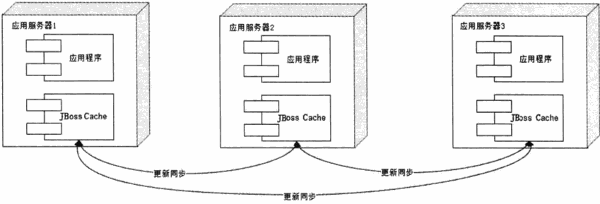

 - Memcached 曾一度是 网站分布式缓存的代名词，被大量网站使用
    - 简单的设计
    - 优异的性能
    - 互补通信的服务器集群
    - 海量数据可伸缩 
    - 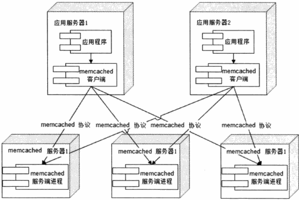
    - 简单的通信协议
        - Memcached 使用 TCP 协议(UDP也支持) 
    - 高性能网络通信
        - Memcached 服务器端通信模块 基于 Libevent, 一个支持事件触发的网络通信程序库
        - Libevnt 的设计和实践有许多值得改善的地方， 但它在稳定的长连接方面的表现 却正是 Memcached 需要的。
    - 高效的内存管理
        - Memcached 使用了一个非常简单的方法 避免内存碎片管理 --  固定空间分配
            - 会带来一定的内存浪费，因为 数据只能写入比他大的chunk
        - 采用 LRU 算法释放最近最久未被访问的数据占用的空间, 释放的chunk 被标记为 未用，等待下一个合适大小的数据写入

<h2 id="d1925a0ee2b64b77937d2ac52484e835"></h2>

### 4.3.2 异步操作

 - 使用消息队列 将调用异步化， 可改善网站的 **扩展性**.
    - 事实上，使用消息队列还可以改善网站系统的性能
 - 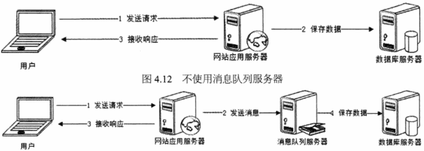
 - 不使用消息队列的情况下， 用户的请求数据直接写入数据库， 在高并发的情况下，会对数据库造成 巨大的压力， 同时也使得响应延迟加剧。
 - 使用消息队列后，用户请求的数据发送给 消息队列后 立即返回，再由消息队列的消费者进程(通常情况下，该进程独立部署在专门的服务器集群上) 从消息队列中获取数据，异步写入数据库。
    - 消息队列具有很好的 消峰作用， 通过异步处理，将短时间高并发产生的事务消息存储在 消息队列中，从而消平 高峰期的并发事务。
    - 需要注意的是， 由于数据写入 消息队列后 立即返回给用户， 数据在后续的业务校验，写数据库等操作 可能失败，因此 在使用消息队列进行业务异步处理后，需要适当修改业务流程进行配合，
        - 如订单提交后，订单数据写入消息队列， 不能立即返回用户订单提交成功，需要在消息队列的 订单消费者 进程真正完成该订单，甚至商品出库后，再通过电子邮件或SMS 消息通知用户订单成功，以免交易纠纷。

<h2 id="d85431a3284d7b1c6a65e74666a19a51"></h2>

### 4.3.3 使用集群

 - 在网站高并发的场景下，使用负载均衡技术，为一个应用构建一个 由多台服务器组成的服务器集群，将并发访问请求分发到 多台服务器上处理，避免单一服务器因负载压力过大而 相应缓慢

<h2 id="4562a82da4b3b6f77f5ef2276fa04579"></h2>

### 4.3.4 代码优化

 - 将对象设计为 无状态对象
 - 对象池
    - 对于 数据库连接对象，每次创建链接， 数据库服务器端都需要 创建专门的资源以应对， 因此频繁创建关闭数据库链接，对数据库服务而言是灾难性的。
    - 应用程序的数据库连接 基本都是使用 连接池 的方式。

<h2 id="14f5f664c41d9fc2605e919d9abc4b0d"></h2>

# 5 网站的高可用架构

<h2 id="b6f63ac10c5f481a87c3b93332a6dd2b"></h2>

## 5.2 高可用的网站架构

 - 典型的分层模型：  应用层，服务层，数据层
    - 应用层 主要负责具体业务逻辑处理
    - 服务层 负责提供 可复用的服务
    - 数据层 负责 数据存储与访问
 - 位于应用层的服务器 通常为了应对高并发的访问请求， 会通过负载均衡 设备将一组服务器组成一个集群 共同对外提供服务。
    - 当负载均衡设备通过 心跳检测等手段 监控到某台应用服务器不可用时，就将其从 集群列表中剔除，并将请求分发到 集群中其他可用的服务器上，使整个集群保持可用，从而实现应用高可用。
 - 位于 服务器层的 服务器情况 和 应用层的 类似， 也是 通过集群方式实现高可用。
    - 只是这些服务器 被应用层通过分布式服务调用框架 访问， 分布式服务调用框架会在 应用层客户端程序中实现 软件负载均衡， 并通过服务注册中心对提供服务的服务器进行心跳检测，发现有服务不可用， 立即通知客户端程序修改服务访问列表，剔除不可用服务器。
 - 位于 数据层的服务器 情况比较特殊， 数据服务器上存储着数据，为了保证服务器宕机是数据不丢失，数据访问服务不中断，需要在数据写入时 进行数据同步复制，将数据写入多台服务器，实现数据冗余备份。
    - 当数据服务器 宕机时， 应用程序将访问切换到 有备份的服务器上。

<h2 id="efbb46fbbffa4d040900d5647f38d8e7"></h2>

## 5.3 高可用的应用

 - 应用层 主要处理网站应用的业务逻辑， 因此有时也称作 业务逻辑层。 应用的一个显著特点就是 应用的无状态性。
    - 所谓 无状态性，就是指 应用服务器 不保存业务的上下文信息，而仅根据 每次请求提交的数据， 进行相应的业务逻辑处理。
    - 多个服务器之间完全对等， 请求提交到 任意服务器， 处理结果都完全一样。

<h2 id="966a1b87120c21e2df1cfc11af758623"></h2>

### 5.3.1  通过负载均衡进行 无状态服务的 失效转移

<h2 id="33ad76eb565b3445ba051acf75076c5b"></h2>

### 5.3.2  应用服务器集群的 Session 管理

 - 应用服务器的 高可用架构设计 主要基于服务无状态 这一特性。
 - 但事实上， 业务总是有状态的。
    - 在交易类的电子商务网站，需要有 购物车记录用户的购买信息， 用户每次请求都是向购物车中增加商品；
    - 在社交类网站中， 需要记录用户的当前登陆状态，最新发布的消息及 好友状态等， 用户每次刷新页面 都需要更新这些信息。
 - Web 应用中，将这些多次请求修改使用的上下文对象 称为 会话 (Session)
    - 单机情况下，Session 可由部署在服务器上的Web容器(如 JBoss)管理。
    - 在使用负载均衡的集群环境下，由于负载均衡服务器可能会将请求 分发到 集群任何一台应用服务器上，所以保证每次请求依然能够获得正确的 Session比单机时要复杂很多
 - 集群环境下， Session 管理主要有以下几种手段

---

 1. Session 复制
    - 早期企业应用系统 使用较多的 一种服务器集群Session管理机制。
    - 应用服务器开启Web容器的Session复制功能， 在集群的几台服务器之间同步Session对象。使得每台服务器上都保存所有用户的Session信息。
        - 而服务器使用Session时， 也只需要 在本机获取即可。
    - 只能使用在集群规模较小的情况下。
 2. Session 绑定
    - Session 绑定可以利用 负载均衡的源地址 Hash算法实现，负载均衡服务器总是将 源于同一IP的请求分发到同一台服务器(也可以根据Cookie信息，这需要负载均衡服务器必须工作在 HTTP 协议层上) 
    - 但是 Session绑定的方案显然不符合 我们对系统高可用的需求， 因为一旦某台服务器宕机， 那么该机器上的 Session 也就不复存在了.
 3. 利用 Cookie 记录Session
    - Session 记录在客户端 ， 网站没有客户端，但是可以利用浏览器支持的Cookie 记录Session.
    - Cookie 也有一些缺点：  比如受Cookie大小限制， 能记录的信息有限； 每次请求响应都需要传输Cookie，影响性能； 如果用户关闭Cookie, 访问就会不正常。
    - 事实上， 许多网站或多或少的使用 Cookie 记录 Session.
 4. Session 服务器
    - 部署独立的 Session 服务器 同一管理 Session 
    - 应用服务器 每次读写Session时，都访问 Session服务器
    - 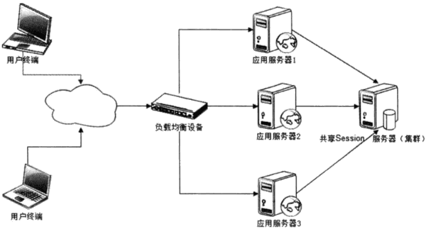
    - 这种解决方案事实上是将应用服务器的状态分离， 分为无状态的应用服务器，和有状态的Session服务器， 然后针对这两种服务器的不同特性分别设计其架构。
    - 对于有状态的Session服务器， 一种比较简单的方法是 利用 分布式缓存，数据库等，在这些产品上进行包装，使其符合 Session的存储和访问要求。

<h2 id="48c042d0403b139b513bb576725c63f1"></h2>

## 5.4 高可用的服务

 - 可复用的服务 和应用一样，都是无状态的服务， 因此可以使用 类似负载均衡的失效转移策略实现高可用的服务。 
 - 除此之外， 具体实践中， 还有以下几点高可用的服务策略。

---

 1. 异步调用
    - 应用 对 服务的调用 通过消息队列等异步方式完成，避免一个服务失败 导致整个应用请求失败的情况。
    - 如提交一个新用户注册请求， 应用需要 调用三个服务： 将用户信息写入数据库，发送账户注册成功邮件，开通对应权限。 
        - 如果采用 同步服务调用， 当邮件队列阻塞不能发送邮件时，会导致其他两个服务 也无法执行，最终导致 用户注册失败。
        - 如果采用 异步调用的方式， 应用程序将 用户注册信息发送给消息队列服务器后 立即返回用户注册成功响应。 而记录用户注册信息到数据库，发送用户注册成功邮件，调用用户服务开通权限这三个服务 作为消息的消费者任务， 分别从消息队列获取用户注册信息 异步执行。
    - 当然不是所有服务调用都可以异步调用， 对于获取 用户信息这类调用，采用异步会延长响应时间，得不偿失； 对于那些必须确认服务调用成功才能继续下一步操作的应用 也不适合使用异步调用。
 
 2. 服务降级
    - 降级有两种手段： 拒绝服务 及 关闭服务。
    - 拒绝服务： 
        - 拒绝低优先级 应用的调用，减少服务调用并发数，确保核心应用正常使用； 或者随机拒绝部分请求调用，节约资源，让另一部分请求得以成功。
    - 关闭功能：
        - 关闭部分不重要的服务， 或者服务内部 关闭部分不重要的功能，以节约系统开销， 为重要的服务和功能让出资源。
        - 双11 促销就使用这种方法 ， 在系统最繁忙的时段，关闭 评价，确认收获等 非核心服务，以保证核心交易服务的顺利完成。
 3. 幂等性设计
    - 应用调用服务失败后， 会讲调用请求 重新发送到 其他服务器，但这个失败可能是虚假的失败。 比如服务已经处理成功，但因为网络故障 应用没收到响应，这时应用重新提交请求，就导致服务重复调用，如果这个服务是一个转账操作，就会产生严重后果。
    - 服务重复调用是 无法避免的， 应用层也不需要关心服务是否真的失败， 只要没收到调用成功的响应， 就可以认为失败， 并重试调用服务。 因为必须在 服务层保证服务重复调用和调用一次的 结果相同， 即服务具有幂等性。

<h2 id="0873ccdf7306ae966deb8470df7017d0"></h2>

## 5.5 高可用数据

 - 不同于 高可用的应用和服务， 由于数据存储服务器上保存的数据不同， 当某台服务器宕机的时候，数据访问请求不能任意切换到集群中的其他的机器上。
 - 保证数据存储高可用的手段 主要是 数据备份 和 失效转移机制。
    - 数据备份是保证数据有多个副本， 任意副本的失效都不会导致数据的永久丢失，从而实现数据完全的持久化。
    - 失效转移机制 则保证当一个数据副本不可访问时 ，可以快速切换 访问数据的其他副本，保证系统可用。

<h2 id="a9760eed1d22446b4f37a030eec74309"></h2>

### 5.5.1 CAP 原理

 - 在讨论高可用数据服务框架之前，必须先讨论的一个话题是， 为了保证数据的高可用，网站通常会牺牲另一个也很重要的指标: 数据一致性。
 - 高可用的数据 有如下几个层面的含义
    - 数据持久性
        - 保证数据可持久存储，在各种情况下都不会出现数据丢失的问题。
        - 为了实现数据的持久性，不但在写入数据时 需要写入持久性存储，还需要将数据备份一个或多个副本
    - 数据可访问性
        - 在多数据副本备份分别放在不同存储设备的情况下，如果一个数据存储设备损坏，就需要将数据访问 切换到另一个数据存储设备上，如果这个过程不能很快完成（终端用户几乎没有感知） ， 或者在完成过程中 需要停止终端用户访问数据， 那么这段时间 数据是不可访问的。
    - 数据一致性
        - 在数据有多份副本的情况下，如果网络，服务器，或者软件出现故障， 会导致部分副本写入成功，部分副本写入失败。
        - 这就会造成 各个副本之间的数据不一致，数据内容冲突。
        - 实践中，导致数据不一致的情形有很多种， 表现形式也多种多样， 比如 数据更新返回操作失败，事实上数据在存储服务器上已经更新成功。
        - CAP 原理认为， 一个提供数据服务的存储系统，无法同时满足 数据一致性Consistency, 数据可用性Availibility, 分区耐受性 (Patition Tolerance 系统具有网络分区的伸缩性) 这三个条件.
        - 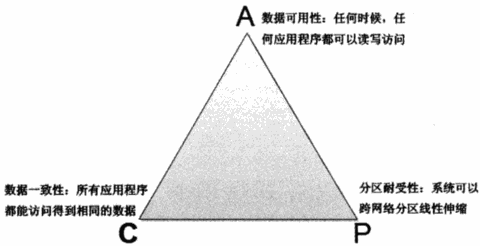
        - 大型网站应用中， 数据规模总是扩张的， 因此可伸缩性 即 分区耐受性 必不可少， 规模变大后，机器数量也会变得庞大，这时网络和服务器故障会频繁出现，想要保证应用可用， 就必须保证 分布式处理系统的高可用性。
        - 所以在大型网站中， 通常会选择 强化 A和P， 而在某种程度上 放弃一致性 C
        - 一般来说，数据不一致 通常出现在 系统高并发写操作 或 集群状态不稳(故障恢复，集群扩容)的情况下， 应用系统需要对分布式数据数据处理系统的数据不一致性 有所了解 并进行某种意义上的补偿和纠错， 比避免出现应用系统数据不正确。

<h2 id="910e25d8a3307e5bf8cf799e9f9f8d9a"></h2>

### 5.5.2 数据备份

 - 数据备份 是一种古老而有效的数据保护手段， 早期的数据备份手段主要是 数据冷备， 即 定期将数据复制到 某种存贮介质。 
 - 冷备的优点是 简单和廉价， 成本和技术难度都较低。 缺点是 不能保证 **数据最终一致性**. 
 - 数据热备 份为两种: 异步热备方式 和 同步热备方式
    - 异步方式 是指多份数据副本的写入操作异步完成， 应用程序收到数据服务系统的写操作成功响应时，只写成功了一份，存储系统会异步地写其他副本(这个过程可能会失败)
        - 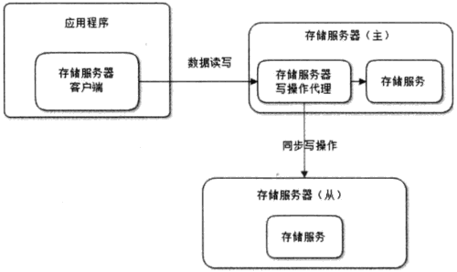
        - 在异步写入方式下， 存储服务器分为 主存储服务器Master 和 从存储服务器 Slave, 应用程序正常情况下 只连接主存储服务器，数据写入时，由主存储服务器的写操作代理模块 将数据写入本机存储系统后 立即返回写操作成功响应， 然后通过异步线程将写操作数据 同步到从存储服务器。
    - 同步方式 是指多份数据副本的写入操作同步完成， 即 应用程序收到数据服务系统的写成功响应时， 多份数据都已经写操作成功。但是当应用程序收到数据写操作失败的响应时，可能有部分副本或者全部副本都应写成功。
        - 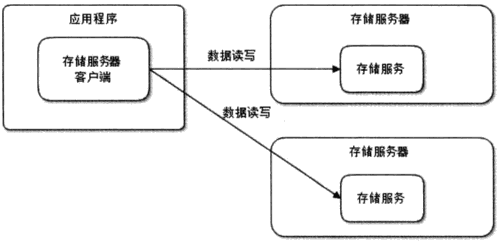
        - 传统的企业级关系数据库系统 几乎都提供了数据实时同步备份的机制。 而各种NoSQL数据库更是将数据备份机制作为产品最主要的功能点之一。
 - 关系数据库热备机制 就是通常所说的 Master-Slave同步机制。 实践中，通常使用读写分离的方法访问 Slave和Master 数据库，写操作只访问Master数据库，读操作只访问Slave数据库。

<h2 id="01cae33e06a06add92e4fe2df52ad18c"></h2>

### 5.5.3 失效转移

 - 若数据服务器集群中任何一台服务器宕机， 那么应用程序针对这台服务器的所有读写操作 都需要重新路由到其他服务器，保证数据访问不会失败，这个过程叫失效转移。
 - 失效转移操作 由三部分组成： 失效确认，访问转移，数据恢复

---

<h2 id="722671548a0a019ba6b8bd80c066cbd7"></h2>

# 6 网站的伸缩性架构

<h2 id="b197036b5d48829eaf69683e1762b815"></h2>

## 6.1 网站架构的伸缩性设计

 - 网站架构发展史就是一部不断向网站添加服务器的历史。
 - 一般来说，网站的伸缩性设计可分成两类，一类是根据功能进行物理分离实现伸缩， 一类是单一功能通过集群实现伸缩。
    - 前者是 不同的服务器部署不同的服务， 提供不同的功能。
    - 后者是 集群内的多台服务器部署相同的服务， 提供相同的功能。

<h2 id="cce0f0c3a0372e5811085f6f52e8d682"></h2>

### 6.1.1 不同功能进行物理分离实现伸缩

 - 网站发展早期-- 通过增加服务器提高网站处理能力时， 新增服务器总是从现有服务器中分离出部分功能和服务
    - 单一服务器处理所有服务 ->  数据库从应用服务器分离 -> 缓存从应用服务器分离 -> 静态资源从应用服务器分离

<h2 id="1b9769aaf9c7d9a4a8a6246eee233a9a"></h2>

### 6.1.2 单一功能通过集群规模实现伸缩

 - 集群伸缩性 又可分为 应用服务器集群伸缩性 和 数据服务器集群伸缩性， 这两种集群对于数据状态管理的不同，技术实现也有非常大区别。
 - 而数据服务器集群 也可分为 缓存数据服务器和存储数据服务器集群， 这两种集群的伸缩性设计 也不大相同

<h2 id="c2223e3b05047c44c57f94b5d3f45699"></h2>

## 6.2 应用服务器集群的伸缩性设计

 - 前面提过， 应用服务器应该设计成无状态的， 这样就可以 构成一个应用服务器集群。
 - 如果 HTTP 请求分发装置 可以感知或者可以配置集群的服务器数量， 可以及时发现集群中 新上线或下线的服务器， 并能向新上线的服务器分发请求， 停止向已下线的服务器分发请求， 那么就实现了 应用服务器集群的伸缩性。
    - 这里，这个 HTTP 请求分发装置被称作 负载均衡服务器。
 - 负载均衡是网站必不可少的基础技术手段，不但可以实现网站的伸缩性，同时还改善网站的可用性，可谓网站的杀手锏之一。
    - 具体的实现也多种多样，从硬件实现到软件实现，应有尽有，但是实现负载均衡技术不外以下几种。

<h2 id="b0ba36fb4d565d0519eb280c556b538b"></h2>

### 6.2.1  HTTP 重定向负载均衡

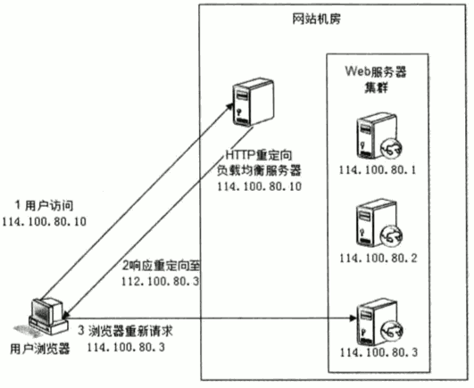

 - HTTP 重定向服务器是一台普通的应用服务器， 其唯一的功能就是 将web服务器地址 写入HTTP重定向响应中(302) 返回给用户浏览器。
 - 这种负载均衡方案的优点是比较简单。 缺点是浏览器 需要两次请求服务器才能完成一次访问，性能较差。 
    - 重定向服务器自身的处理能力可能称为瓶颈， 这个集群的伸缩性规模有限
    - 使用HTTP 302 响应码重定向， 有可能使 索索引擎判断为 SEO 作弊，降低搜索排名。
    - 因此实践中 使用这种方案进行负载均衡的案例并不多见。

<h2 id="425d87ba6e4ed7658cc3a14de5f2d0db"></h2>

### 6.2.2 DNS 域名解析负载均衡

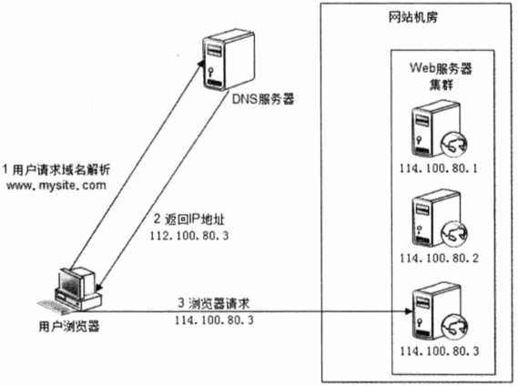

 - 在 DNS服务器中配置多个 A记录， 如 
    - www.mysite.com IN A 114.100.80.1
    - www.mysite.com IN A 114.100.80.2
    - www.mysite.com IN A 114.100.80.3
 - 每次域名解析请求都会根据负载均衡算法计算一个不同的IP地址返回， 这样A记录中配置的多个服务器就构成了一个集群，并可以实现负载均衡。
 - DNS域名解析负载均衡的优点是将 负载均衡工作 转交给DNS, 省掉了 网站管理维护负载均衡服务器的麻烦，同时许多DNS 还支持基于地理位置的域名解析，即会将域名解析成 距离用户地理最近的一个服务器，加快用户访问速度。
 - 缺点是 目前的DNS是多级解析， 每一级DNS都可能缓存A记录， 当下线某台服务器后，即使修改了 DNS的A记录，要使其生效也需要较长时间。这段时间会导致用户访问失败。 而且DNS负载均衡的控制权在 域名服务商那里，网站无法对其做更多改善和更强大的管理。
 - 事实上，大型网站总是部分使用 DNS域名解析， 利用域名解析作为 第一级负载均衡手段， 即域名解析得到的一组服务器，并不是实际提供 Web服务的物理服务器，而是同样提供 负载均衡的内部服务器， 这组内部负载均衡服务器 再进行负载均衡， 将请求分发到真实的Web服务器上。

<h2 id="168143d2e5a4b6e45edae975d49029bd"></h2>

### 6.2.3 反向代理负载均衡

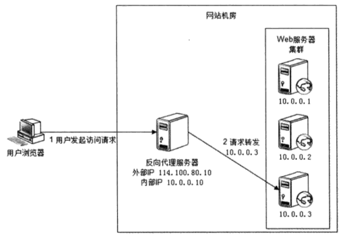

 - 前面提过 利用反向代理 缓存资源以改善网站性能。 实际上，大多数反向代理服务器 同时提供负载均衡的功能。
 - Web 服务器处理完成的响应 也需要通过反向代理服务器 返回给用户。 
    - Web 服务器不需要使用外部IP地址
    - 而 反向代理服务器 需要配置双网卡 和 内部外部两套 IP地址。
 - 由于反向代理服务器转发请求在 HTTP 协议层面， 因此也叫 应用层负载均衡。
 - 优点是 和反向代理服务器功能集成在一起， 部署简单。 缺点是 反向代理服务器是 所有请求和响应的中转站， 其性能可能会成为瓶颈。

<h2 id="42003fc8489714763a3613c247ddbd9e"></h2>

### 6.2.4 IP 负载均衡

 - 在网络层通过修改请求目标地址 进行负载均衡。

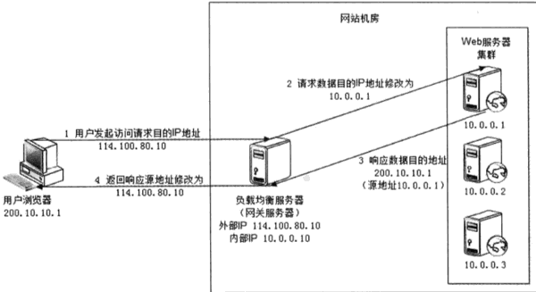

 - 负载均衡服务器 在操作系统内核进程获取 网络数据包， 修改 目标IP地址， 不需要通过用户进程处理。
 - 这里的关键在于 真实物理Web服务器 响应数据包 如何返回给负载均衡服务器。 
    - 一种方案是 负载均衡服务器在 修改 目的IP地址的同时 修改源地址， 将数据包源地址 设为自身IP, 即 源地址转换 SNAT, 这样Web服务器的响应会再回到 负载均衡服务器
    - 另一种方案是 将负载均衡服务器 同时作为 真实物理服务器集群的网关服务器， 这样所有的响应数据都会到达负载均衡服务器。 
 - IP 负载均衡在内核进程完成数据分发， 较反向负载均衡有更好的处理性能。 
    - 但是由于 所有请求响应都需要经过负载均衡服务器， 集群的最大响应数据吞吐量不得不受制于 负载均衡服务器 网卡带宽。对于提供下载服务，或者视频服务等需要传输大量数据的网站而言，难以满足需求。
    - 能不能 让负载均衡服务器 只分发请求， 而是 响应数据从真实物理服务器 直接返回给用户呢？

<h2 id="eae6063bd2c631b2d7ddaac35d2c058b"></h2>

### 6.2.5 数据链路层负载均衡

 - 在通讯协议的数据链路层 修改 mac地址进行负载均衡

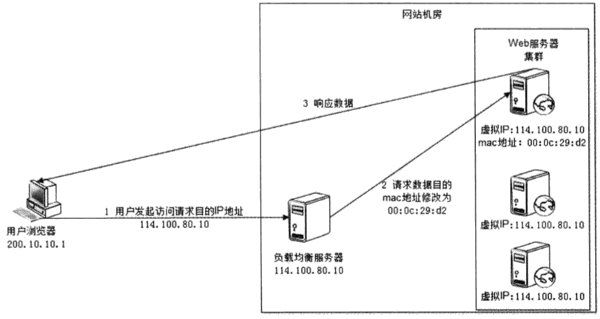

 - 这种数据传输 又称为 三角传输模式， 负载均衡服务器 分发过程中 不修改IP地址，只修改 目的mac地址， 通过配置真实物理服务器集群所有机器虚拟IP 和 负载均衡服务器IP地址一致， 从而达到不修改数据包的源地址和目的地址 就可以进行数据分发的目的， 由于实际处理请求的真实物理服务器IP 和数据请求目的IP一致，可将响应数据包直接返给用户浏览器， 避免负载均衡服务器网卡带宽称为瓶颈。  这种负载均衡方法又称作 直接路由方式 (DR).
 - 使用三角传输模式的链路层负载均衡是目前大型网站 使用最广的一种负载均衡手段。
 - 在 Linux平台上，最好的链路层负载均衡开源产品是 LVS(Linux Virtual Server)

<h2 id="64e1b8bbb399f073f5a72348bae715ca"></h2>

### 6.2.6 负载均衡算法

 - 轮询 Round Robin, RR
 - 加权轮询 Weighted Round Robin, RR
 - 随机 Random
 - 最少连接 Least Connections
 - 源地址散列  Source Hashing

---

<h2 id="5e96d4a2f417bbbd3cc286c5670fdcb9"></h2>

## 6.3 分布式缓存集群的伸缩性设计

 - 分布式缓存集群 不能使用简单的负载均衡手段来实现。
 - 分布式缓存集群中不同的服务器中缓存的数据各不相同， 缓存访问请求 必须先找到 缓存有需要数据的服务器，然后才能访问。
 - 这个特点严重制约 分布式缓存集群的伸缩性设计。 因为新上线的缓存服务器没有缓存任何数据， 而已下线的缓存服务器 还缓存着许多热点数据。
 - 必须让新上线的缓存服务器 对整个分布式缓存集群影响最小， 也就是说 新加入缓存服务器后 应使得 整个缓存服务器集群中已经缓存的数据尽可能还被访问到，这是分布式缓存集群伸缩性设计的最主要目标。

<h2 id="a0e1d0325d0fbef83f17bfc10263cbe0"></h2>

### 6.3.1 Memcached 分布式缓存集群的访问模型

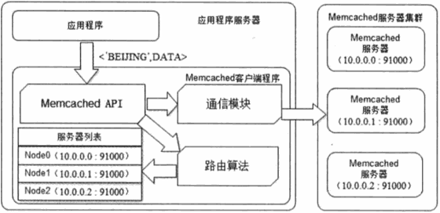

 - 应用程序通过 Memcached 客户端访问 Memcached 集群， Memcached 客户端 主要由一组API, Memcached 集群路由算法， Memcached 集群列表 及 通讯模块构成
 - 其中 路由算法 负责根据应用程序输入的缓存数据KEY 计算得到 应该将数据写入/读取 到哪台服务器。
 - 如上图， 应用程序 输入 `<BEIJING, DATA>` , API 将KEY `BEIJING` 输入路由算法模块， 路由算法根据KEY 和 Memcached 集群列表 计算得到一台服务编号(NODE1) ,  进而得到 该机器IP地址(10.0.0.1:9100).  API 调用通讯模块和编号为 NODE1 的服务器通讯， 将数据 写入该服务器。

<h2 id="0c1e64d4ac0309cef508ba272f0a2b90"></h2>

### 6.3.2 Memcached 分布式缓存集群的伸缩性挑战

 - Memcached 分布式缓存系统中， 对于服务器集群的管理， 路由算法至关重要，和负载均衡算法一样，决定者究竟该访问集群中的哪台服务器。
 - 一般的像 余数hash 算法， 当分布式缓存集群需要扩容的时候，事情就变得棘手。
    - 当100台服务器的集群中加入一台新的服务器， 不能命中的概率是 99%( N/(N+1) )
 - 一种解决办法是 在网站访问量最小的时候 扩容缓存服务器集群， 这时候对数据库的负载冲击最小。
    - 然后通过 模拟请求的方法逐渐预热缓存， 是的缓存服务器的数据重新分布。
    - 能不能通过 改进路由算法， 是的新加入的服务器 不影响大部分缓存的正确命令呢？  目前比较的流行的算法是 一致性Hash算法。

<h2 id="a7530c8dff622418e463c1130aa37213"></h2>

### 6.3.3 分布式缓存的一致性Hash算法

 - 一致性 Hash算法通过一个 叫做 一致性 Hash环的数据结构实现 KEY 到缓存服务器的Hash 映射 

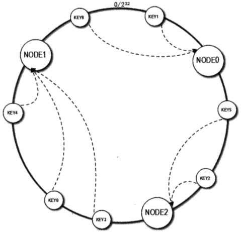

 - 具体算法过程为： 先构造一个长度为 0~2³² 的整数环， 这个环被称为 一致性Hash环， 根据节点名称的Hash值( 分布范围同样为 0~2³² ) 将缓存服务器节点放置在这个Hash 环上。
    - 然后根据 数据的KEY 值计算得到Hash值( 分布范围同样为 0~2³²) , 在 Hash 环上顺时针查找距离这个KEY的Hash值最近的缓存服务器节点，完成 KEY到服务器的Hash映射查找。
 - 上图中， NODE1 的Hash值为 3594963423, NODE2 的hash值为 1845328979 , 而KEY0的Hash值为 2534256785 , 那么KEY0 在 环上顺时针查找，找到的最近节点就是 NODE1.
 - 当缓存服务器集群 需要扩容时， 只需要将新加入的节点名称 NODE3 的 Hash值 放入一致性Hash环中， 由于 KEY 是顺时针查找距离最新的节点， 因此新加入的节点值影响整个环中的一小段。
 
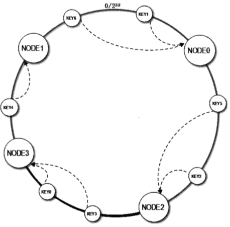

 - 新加入NODE3后， KEY3， KEY0 从原来的NODE1 重新计算到NODE3， 这样就能保证大部分被缓存的数据还能继续命中。
 - 具体应用中， 这个长度为 2³² 的一致性 Hash环通常使用 二叉查找树实现。
 
 - 但是，上面的算法还存在一个小小的问题。
    - 新加入的NODE3 只影响了原来的 NODE1，  NODE0 和 NODE2 缓存数据量和负载压力并没有减少。如果这4台机器性能是一样的， 这种结果显然不是我们需要的
 - 计算机领域有句话: **计算机的任何问题都可以通过增加一个虚拟层来解决**.  解决上述一致性Hash算法带来的负载不均衡问题，也可以通过使用 虚拟层的手段:
    - 将每台物理缓存服务器 虚拟为一组 虚拟缓存服务器， 将虚拟服务器的Hash值放在Hash环上， KEY在环上先找到 虚拟服务器节点，再得到物理服务器的信息
 - 这样 新加入物理服务器节点时， 是将一组虚拟节点 加入环中，如果虚拟节点的数据足够多，这组虚拟节点将会影响同样多数目的 已经在换上存在的虚拟节点，它们又对应不同的物理节点。 新加入一台缓存服务器，将会较为均匀的影响原来集群中已经存在的所有服务器。
 - 实践中，一台物理服务器 一般虚拟为 150个虚拟节点。

---

<h2 id="bfffa0ba55b0e760931be760641cd4ac"></h2>

## 6.4 数据存储服务器集群的伸缩性设计

 - 和缓存集群的伸缩性设计不同， 数据存储集群的伸缩性对 数据的持久性和可用性 提出了更高的要求
 - 数据存储服务器必须保证数据的可靠性， 任何情况下都必须保证数据的可用性和正确性。 
 - 数据存储集群的伸缩性设计 又可分为 关系数据库集群的伸缩性设计 和 NoSQL 数据库的伸缩性设计

<h2 id="fc8477fc7eff30918226ab8e725f4bf7"></h2>

### 6.4.1 关系数据库集群的伸缩性设计

 - 下图为 使用数据复制的 MySQL 集群伸缩行方案

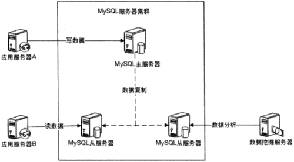

 - 在这种架构中，虽然多台服务器 部署 MySQL实例， 但是它们的角色有主从之分，数据写操作都在主服务器上，由主服务器数据同步到集群中其他服务器，数据读操作及数据分析 等离线操作 在 从服务器上进行。
 - 除了数据库读写分离， 里面提到的业务分割模式 也可以用在数据库，不同业务数据表 部署在不同的数据库集群上， 即俗称的数据分库。这种方式的制约条件是跨库的表不能进行 join操作
 - 在大型网站的实际应用中， 即使进行了 分库和主从复制， 对一些 数据仍然很大的表，比如 Facebook的用户数据库，淘宝的商品数据库，还需要进行分片，将一张表拆分开 分别存储在多个数据库中。
 - 目前网站在线业务应用中 比较成熟的支持数据分片的分布式数据库产品 主要有 Amoeba 和 Cobar.  
 - 以 Cobar 为例， 部署模型如下:

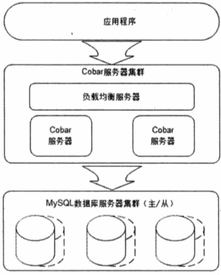

 - Cobar 是一个分布式关系数据库访问代理， 介于应用服务器 和 数据库服务器之间( Cobar 也支持非独立部署， 以lib的方式和应用程序部署在一起 )。
 - 应用程序通过 JDBC 驱动访问 Cobar集群， Cobar 服务器根据SQL和分库规则分解SQL, 分发到MySQL 集群不同的数据库实例上执行(每个MySQL实例都部署为主/从结构, 保证数据高可用)
 - Cobar 系统组件模型如下:

 - 前端通信模块 负责和应用程序通信， 接收到 SQL请求 `select * from users where userid in (12,22,23)` 后转交给 SQL解析模块，
    - SQL解析模块获得SQL中的路由规则查询条件 `userid in (12,22,23)`  再转交给 SQL路由模块
    - SQL路由模块根据路由规则配置(userid 偶数至数据库A，奇数至数据库B)， 将应用程序提交的SQL 分解为两条：
        - `select * from users where userid in (12,22);`
        - `select * from users where userid in (23);`
    - 数据库A 和 数据库B的执行结果返回至 SQL执行模块， 通过结果合并模块 将两个返回结果 合并成一个结果集，最终返回给应用程序。
 - 那么， Cobar 如果做集群的伸缩呢？
    - Cobar的伸缩有两种: Cobar 服务器集群的伸缩 和 MySQL服务器集群的伸缩
 - Cobar 服务器可以看作是无状态的应用服务器， 因此其集群伸缩 可以简单的使用负载均衡的手段实现。
 - 而MySQL中存储着数据， 要想保证集群扩容后 数据一致负载均衡，必须要做数据迁移， 将集群中原来机器中的数据 迁移到新添加的机器中。

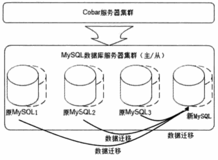

 - 具体迁移哪些数据可以利用 一致性Hash算法 (即路由模块使用一致性Hash算法进行路由), 尽量是需要迁移的数据最少。
    - 但是迁移数据需要遍历 数据库中的每条记录（的索引）, 重新进行路由计算确定其是否需要迁移，这会对数据库访问造成一定压力。 并且需要迁移过程中数据的一致性，可访问性，迁移过程中服务器宕机时的可用性 等诸多问题。

<h2 id="0b78cb7d34b7373e4167caef3654488c"></h2>

### 6.4.2 NoSQL 数据库的伸缩性设计

 - 一般而言，NoSQL放弃了关系数据库的量大重要基础: 以关系代数为基础的结构化查询语言(SQL) 和 事务一致性保证(ACID)， 而强化其他一些大型网站更关注的特性：高可用性 和 可伸缩性。

<h2 id="b7b410e0570d86c76f5f2fcff59af393"></h2>

# 7 网站的可扩展架构

<h2 id="4f09172c863e4fc1d5fe1a927cfee02a"></h2>

## 7.2 利用分布式消息队列降低系统耦合性

<h2 id="17d71544a7745497357e6cef0bfd28ed"></h2>

### 7.2.1 事件驱动架构

 - Event Driven Architecture: 通过在 低耦合的模块之间传输事件消息， 以保持模块的松散耦合， 并借助事件消息的通信完成模块间的合作。
    - 典型的 EDA架构就是操作系统中 常见的 生产者消费者模式。 
    - 在大型网站中，具体实现手段很多， 最常用的是 分布式消息队列。

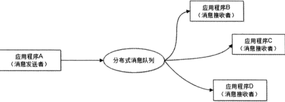

 - 消息队列利用 发布-订阅模式工作， 消息发送者发布消息， 一个或者多个消息接受者 订阅消息。
 - 对新增业务， 只要对该类消息感兴趣，即可订阅该消息，对原有系统和业务没有任何影响，从而实现网站业务的可扩展性。
 - 消息接受者 在对消息进行过滤，处理，包装后， 构造成一个新的消息类型， 将消息继续发送出去， 等待其他消息接受者 订阅处理该消息。

<h2 id="a8a79c8a3deefd0a1fa413caee26be43"></h2>

### 7.2.2 分布式消息队列

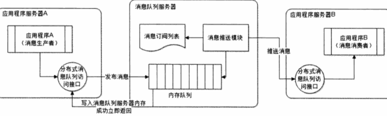

 - 在 伸缩性方面， 由于消息队列服务器上的数据可以看作是被即时处理的， 因此类似于 无状态的服务器， 伸缩性设计比较简单。
    - 将新服务器加入分布式消息队列中， 通知生产者服务器 更改消息队列服务器列表即可。
 - 在 可用性方面， 为了避免消费者进程处理缓慢， 分布式消息队列服务器内存空间不足造成的问题， 如果内存队列已满，会将消息写入磁盘，消息推送模块 在将内存队列消息 处理完以后，将磁盘内容加载到内存队列继续处理。
 - 为了避免消息队列服务器宕机造成消息丢失， 会将 成功发送到消息队列的消息 存储在消息生产者服务器， 等消息真正被消息消费者服务器处理后才删除消息。
    - 在消息队列服务器宕机后， 生产者服务器会选择分布式消息队列服务器集群中 其他的服务器发布消息。

<h2 id="a9c799b4210d3f435f84ba13e53c8839"></h2>

# 12 秒杀系统架构设计

<h2 id="6bbf56ae98f215c4465394484ea93108"></h2>

## 12.1 秒杀活动的技术挑战

 1. 对现有网站业务造成冲击
 2. 高并发下的 应用，数据库负载
 3. 突然增加的网络及服务器带宽
 4. 直接下单
    - 秒杀的游戏规则是到了秒杀时间才能开始对商品下单购买，在此时间点之间，只能浏览商品信息，不能下单。
    - 而下单页面 也是一个普通的url，只要得到这个url， 不用等到 秒杀开始就可以下单了

<h2 id="76d812776f293699966bcb7bd209cb1f"></h2>

## 12.2 秒杀系统的应对策略

 1. 秒杀系统 独立部署
 2. 秒杀商品页面静态化
    - 用户请求不需要经过应用服务器的业务逻辑处理，也不需要访问数据库。
    - 所以秒杀商品服务 不需要部署动态的Web服务器和数据库服务器。
 3. 租借秒杀活动网络带宽
    - 秒杀商品页面缓存在CDN, 同样需要和CDN服务商临时租借新增的出口带宽
 4. 动态生成随机下单页面URL
    - 办法是 在下单页面的URL 加入由服务器端生成的随机数作为参数， 在秒杀开始的时候才能得到？

<h2 id="6c60de46f6b769e9e0c3bb7ee63698bb"></h2>

## 12.3 秒杀系统架构设计

<h2 id="cf971d021b5741e656f8a6aa11f97f40"></h2>

### 如何控制 秒杀商品页面购买按钮的点亮

 - 使用JS脚本控制, 该JS 文件中 加入秒杀是否开始的标志， 和下单页面URL 的随机参数，当秒杀开始的时候， 生成一个新的JS文件。
    - 这个JS文件使用 随机版本号， 并且不被浏览器，CDN 和反向代理服务器缓存。

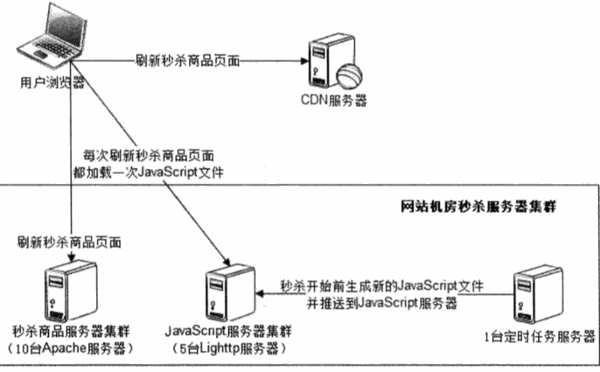

<h2 id="9380d2377b51d78792393b07ecdc71cd"></h2>

### 如何只允许第一个提交的订单被发送到订单子系统

 - 为了减轻下单页面服务器的负载压力， 可以控制进入下单页面的入口，只有少数用户能进入下单页面，其他用户直接进入秒杀结束页面。
 - 假设下单服务器集群 有10台服务器， 每台服务器只接受做多 10个下单请求， 超过的下单请求，直接显示 秒杀结束。

    
