

- [AlphaGo Zero - How and Why it Works](#5d17082ba3158d9e17b986347bd1dce0)
    - [Monte Carlo Tree Search](#d0a68bbde4a8ba76f8761cef0126247c)
    - [Efficiency Through Expert Policies](#f83582d3cb7300b10a355aa52addac33)
    - [Efficiency Through Value Approximation](#7416d7a47adba4e952a08ac91c59590d)
    - [The Alpha Zero Neural Net](#0589a0b135b9ba95a92505e046e6b9c6)
    - [Closing Comments](#f02a63d42734acc8484d26e8a55cb40c)
    - [Summary](#290612199861c31d1036b185b4e69b75)

<h2 id="5d17082ba3158d9e17b986347bd1dce0"></h2>

# AlphaGo Zero - How and Why it Works

http://tim.hibal.org/blog/alpha-zero-how-and-why-it-works/

<h2 id="d0a68bbde4a8ba76f8761cef0126247c"></h2>

## Monte Carlo Tree Search

- The go-to algorithm for writing bots to play **discrete**, **deterministic** games with **perfect information** is **Monte Carlo tree search (MCTS)**.
    - discrete: individually separate and distinct moves and positions
    - deterministic: every move has a set outcome
    - games: players competing against one another
    - perfect information: both players see everything
        - 所以目前无法处理麻将这类游戏，因为这类游戏信息是不完整的 imperfect information
- The algorithm works as follows. 
    - The game-in-progress is in an initial state s₀ , and it's the bot's turn.
        - The bot can choose from a set of actions A.
        - Monte Carlo tree search begins with a tree consisting of a single node for s₀.
            - This node is **expanded** by trying every actiona∈A and constructing a corresponding child node for each action.
        - 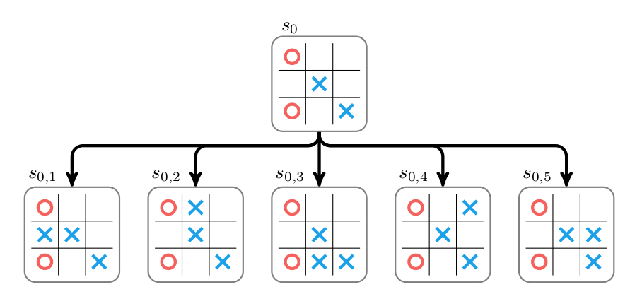
    - The value of each new child node must then be determined (现在就必须确定每个child node的值？).
        - The game in the child node is *rolled out* by **randomly** taking moves from the child state until a win, loss, or tie is reached.
        - Wins are scored at +1, losses at −1, and ties at 0. 
        - for example
        - 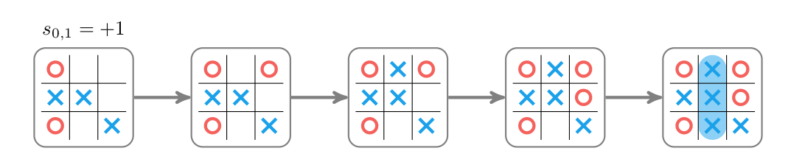
        - The random rollout for the first child s0,1 given above estimates a value of +1.
        - This value may not represent optimal play.
        - One can often do better by following a better strategy, or by estimating the value of the state directly. ( though still typically random )
        - 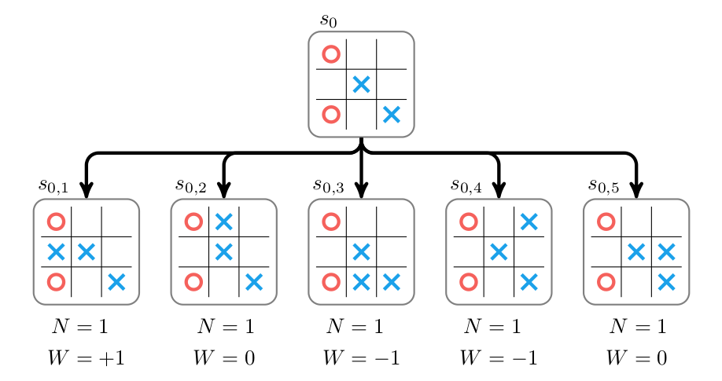
    - Above we show the expanded tree with approximate values for each child node.
        - Note that we store two properties:
            - the accumulated value W 
            - and the number of times rollouts have been run at or below that node,  N
        - The information from the child nodes is then **propagated back** up the tree by increasing the parent's value and visit count. 
            - 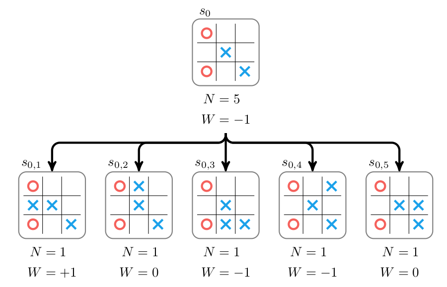     
        - Monte Carlo tree search continues for multiple iterations , consisting of 
            - selecting a node, expanding it, and propagating back up the new information.
    - PS. expanding的过程，有点类似 general search problem 中的处理: 从 fringe( a list of leaves to explore ) 取出一个node,展开,children 加入到 fringe
        - general search problem 也有 selecting的步骤, like LIFO (depth-first), FIFO(breadth-first), least cost(UCS)
    - Monte Carlo tree search does not expand all leaf nodes, as that would be very expensive.
        - Instead, the selection process chooses nodes that strike a balance between 
            - being lucrative 有利的
            - having high estimated values 高评估值
            - being relatively unexplored 没访问过的 
            - and having low visit counts 较低的访问次数
        - A leaf node is selected by traversing down the tree from the root node (从根节点向下遍历树来选择子节点),
            - always choosing the child i with the highest upper confidence tree (UCT) score:
            - 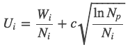
            - where Wi is the accumulated value of the ith child, 
                - Ni is the visit count for ith child, 
                - and Np is the number of visit counts for the parent node.
            - The parameter c≥0 controls the tradeoff between 
                - choosing lucrative nodes (low c) 
                - and exploring nodes with low visit counts (high c).
            - c is often set empirically.
        - The UCT scores (U's) for the tic-tac-toe tree with c=1 are:
            - 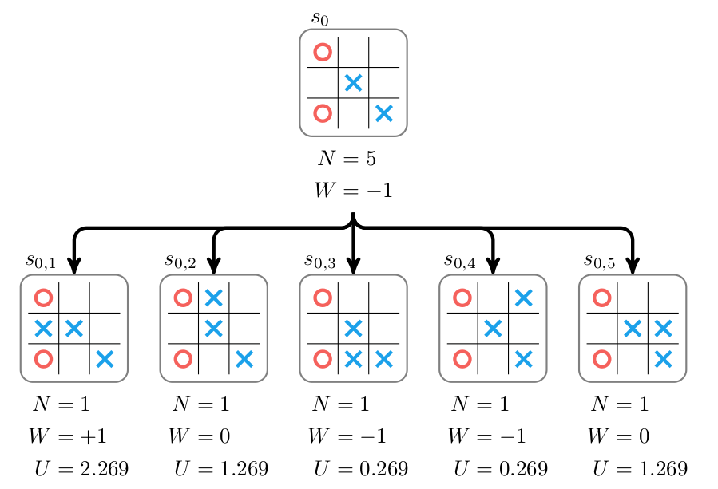
            - In this case we pick the first node, s0,1. (如果出现多个第一，可以随机选取，或选择第一个child)
        - That node is expanded and the values are propagated back up:
            - 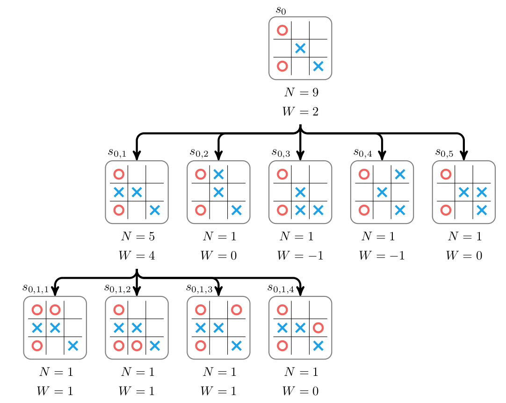  
            - s₀,s0,1 的 N,W 分别都增加了 4,3
        - Note that each accumulated value W reflects whether **X**'s won or lost.
            - During selection, we keep track of whether it is X's or O's turn to move, and flip the sign of W whenever it is **O**'s turn.
    - We continue to run iterations of Monte Carlo tree search until we run out of time. 
        - The tree is gradually expanded and we (hopefully) explore the possible moves, identifying the best move to take. 
        - The bot then actually , in real game ,  makes a move by picking the first child with the highest number of visits(访问次数最多的). 
        - For example, if the top of our tree looks like:
            - 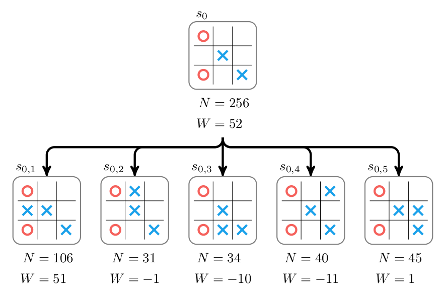  
            - then the bot would choose the first action and proceed to s0,1

<h2 id="f83582d3cb7300b10a355aa52addac33"></h2>

## Efficiency Through Expert Policies

- Games like chess and Go have very large branching factors. 
    - In a given game state there are many possible actions to take, 
    - making it very difficult to adequately explore the future game states. 
- As a result, there are an estimated 
    - 10⁴⁶  board states in chess,
    - and Go played on a traditional 19×19 board has around 10¹⁷⁰ 
    - Tic-tac-toe only has 5478 states
- Move evaluation with vanilla Monte Carlo tree search just isn't efficient enough.
    - We need a way to further focus our attention to worthwhile moves.  将注意力集中在有价值的动作上 。
- Suppose we have an *expert policy π* that, for a given state *s*, tells us how likely an expert-level player is to make each possible action.
    - For the tic-tac-toe example, this might look like:
    - 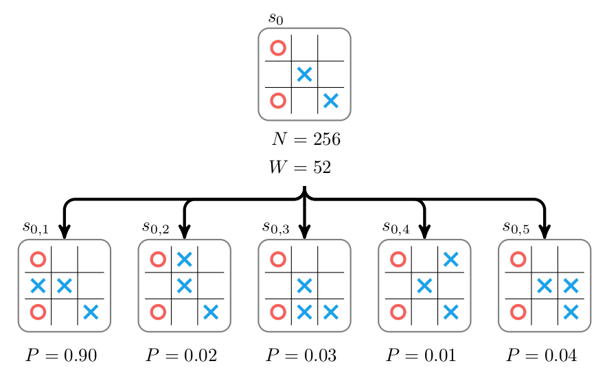 
    - where each Pᵢ = π(aᵢ|s₀) is the probability of choosing the ith action aᵢ given the root state s₀.
    - If the expert policy is really good then we can produce a strong bot by directly drawing our next action according to the probabilities produces by π, by taking the move with the highest probability. 
- Unfortunately, getting an expert policy is difficult, and verifying that one's policy is optimal is difficult as well.
    - :(
- Fortunately, one can improve on a policy by using a modified form of Monte Carlo tree search.  可以通过一个修改版来改进策略
    - This version will also store the probability of each node according to the policy, and this probability is used to adjust the node's score during selection.
    - The probabilistic upper confidence tree score used by DeepMind is:
        - 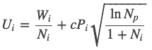
    - As before, the score trades off between nodes that consistently produce high scores and nodes that are unexplored. 
        - Now, node exploration is guided by the expert policy, biasing exploration towards moves the expert policy considers likely (偏向探索 专家政策可能考虑的行动).
    - If the expert policy truly is good, then Monte Carlo tree search efficiently focuses on good evolutions of the game state.
        - If the expert policy is poor, then Monte Carlo tree search may focus on bad evolutions of the game state.  更可能 探索其他得分较低的演变
    - Either way, in the limit as the number of samples gets large, the value of a node is dominated by the win/loss ratio Wᵢ/Nᵢ, as before. 

<h2 id="7416d7a47adba4e952a08ac91c59590d"></h2>

## Efficiency Through Value Approximation

- A second form of efficiency can be achieved by  avoiding expensive and potentially inaccurate random rollouts. 
    - One option is to use the expert policy from the previous section to guide the random rollout.
        - If the policy is good, then the rollout should reflect more realistic, expert-level game progressions and thus more reliably estimate a state's value.
    - A second option is to avoid rollouts altogether, and directly approximate the value of a state with a value approximator function Ŵ(x).    
        - This function takes a state and directly computes a value in [−1,1], without conducting rollouts. 
        - Clearly, if Ŵ is a good approximation of the true value, but can be executed faster than a rollout, then execution time can be saved without sacrificing performance.
- Value approximation can be used together with an expert policy to speed up Monte Carlo tree search. 
- A serious concern remains: how does one obtain an expert policy and a value function? 
    - Does an algorithm exist for training the expert policy and value function?

<h2 id="0589a0b135b9ba95a92505e046e6b9c6"></h2>

## The Alpha Zero Neural Net

- The Alpha Zero algorithm produces better and better expert policies and value functions over time by playing games against itself with accelerated Monte Carlo tree search. 
    - Alpha Zero算法通过 加速的蒙特卡罗树搜索 与自身玩游戏，从而产生更好，更好的专家政策和价值功能。
- The expert policy π and the approximate value function Ŵ  are both represented by deep neural networks. 
- In fact, to increase efficiency, Alpha Zero uses one neural network f that 
    - takes in the game state and produces 
    - both the probabilities over the next move and the approximate state value. 
    - (Technically, it takes in the previous 8  game states and an indicator telling it whose turn it is.)
- **f(s) → [p,W]**
- Leaves in the search tree are **expanded** by *evaluating them with the neural network*. 
    - Each child is initialized with N=0, W=0, and with P corresponding to the prediction from the network. 
    - The value of the expanded node itself is set to the predicted value and this value is then backed up the tree.
    - 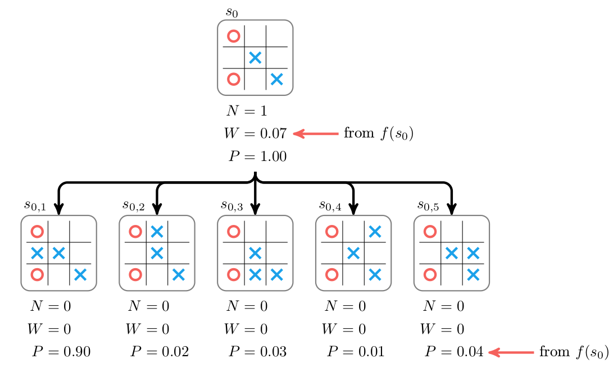
    - 评估一个leaf节点，N=1,W=f(s) -> 扩展节点 -> 初始化 child的值 W=N=0,P=f(s) -> 被 expand的 节点的W,N 向上反向传播
- Selection and backup are unchanged.
    - during backup a parent's visit counts are incremented and its value is increased according to W.
- The search tree following another selection, expansion, and backup step is:
    - 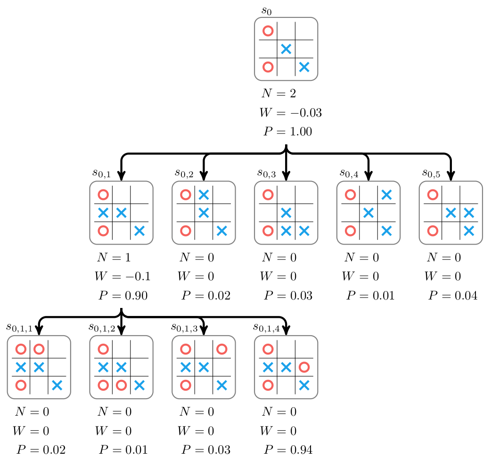    
- The core idea of the Alpha Zero algorithm is that the predictions of the neural network can be improved, and the play generated by Monte Carlo tree search can be used to provide the training data. 
    - Alpha Zero算法的核心思想是可以改进神经网络的预测，并且可以使用蒙特卡罗树搜索生成的游戏来提供训练数据。
    - The **policy portion** of the neural network is improved by 
        - training the predicted probabilities p for s₀ 
        - to match the improved probability π obtained from running Monte Carlo tree on s₀.
        - 这是不是很明白，predicted probabilities p for s₀ ， 是指 p distribution in children ? 
    - After running Monte Carlo tree search, the improved policy prediction is:
        - πᵢ = Nᵢ1/τ
        - for constant τ , 
            - Values of τ close to zero produce policies that choose the best move according to the Monte Carlo tree search evaluation. 
            - 不是很明白。 τ接近零的值 产生 根据蒙特卡罗树搜索的评估 来选择最佳移动的策略?
    - The value portion of the neural network is improved by 
        - training the predicted value to match the eventual win/loss/tie result of the game, Z. 
        - Their loss function is:
            - 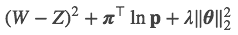
            - where, 
                - (W-Z)² is the value loss 
                - πΤln**p** is the policy loss  
                - and   λ‖θ‖₂² is an on term with parameter λ≥0 and θ represents the parameters in the neural network.
    - Training is done entirely in self-play.
        - One starts with a randomly initialized set of neural network parameters θ. 
        - This neural network is then used in multiple games in which it plays itself.
        - In each of these games, for each move, Monte Carlo tree search is used to calculate π.
        - The final outcome of each game determines that game's value for Z. 
        - The parameters θ are then improved by using gradient descent  on the loss function for a random selection of states played. 
            - Or any of the more sophisticated accelerated descent methods
            - Alpha Zero used stochastic gradient descent with momentum and learning rate annealing

<h2 id="f02a63d42734acc8484d26e8a55cb40c"></h2>

## Closing Comments

- The folks at DeepMind contributed a clean and stable learning algorithm that 
    - trains game-playing agents efficiently using only data from self-play.
- While the current Zero algorithm only works for discrete games, it will be interesting 
    - whether it will be extended to MDPs or  partially observable counterparts in the future. 

<h2 id="290612199861c31d1036b185b4e69b75"></h2>

## Summary

- MCTS 
    - for a given status 
        - 1 expanded by all actions  , randomly rollout child node's value W=[-1,0,1], N=1 , 
        - 2 propagate W,N to parents 
        - 3 selecting a leaf node via UCT scores ,  continue iteration.
- MCTS accelerate
    - Expert Policies  , by a modified UCT scores
    - Value Approximation 

        

 

