# Bayes' theorem

P(*H* |**E**) = P(*H* )·P(**E** |*H* ) / P(**E**)

1. What is it saying ?
    - P(*H* ) = Probability a *hypothesis* is true (before any **evidence**)
    - P(**E** |*H* ) = Probability of seeing the **evidence** if the *hypothesis* is true.
    - P(**E**) = Probability of seeing the **evidence** 
    - P(*H* |**E**) = Probability a *hypothesis* is true given some **evidence**. 
2. Why is it true ?
    - 
    

    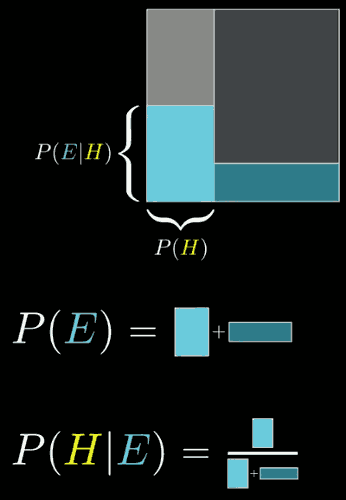
    

3. When is it useful ?

With the goal of gainning a deeper understanding, let's tackle these in reverse order.

## Steve's story 

Steve is very **shy and withdrawn**, invariably helpful but with very little interest in people or in the world of reality. A *meek and tidy soul*, he has a need for order and structure, and a passion for detail.

Which of the following do you find more likely:  "Steve is a librarian" , or "Steve is a farmer". ( this is an famous example )

The example with Steve, the maybe-librarian-maybe-farmer, illustrates one specific type of "alleged" irrationality. 

After people are given this description "meek and tidy soul", most say he is more likely to be librarian. And according to Kahneman and Tversky, this is irrational. 

The point is not whether people hold correct or biased views about the personalities of librarians or farmers, it's that almost nobody thinks to incorporate information about ratio of farmers to librarians ( say 1:20 )   into their judgments. 

To be clear, anyone who is asked this question doesn't have perfect information about the actual statistics. But the question is whether people even think to consider this ratio. Rationality is not about knowing facts, it's about recognizing which facts are relevant. 

---

You might start by picturing a representative sample of farmers and librarians, say , 200 farmers and 10 librarians.

Then when you hear the *meek and tidy* description, let's say you got instinct is that 40% of librarians would fit that description and that 10% of farmers would. 

- 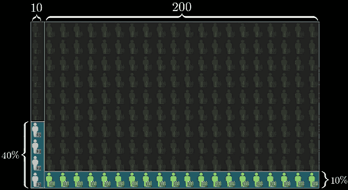

That would mean that about 4 librarians to fit this description and about 20 farmers do. 

So the probability that a random person who fits this description is a librarian is 

P( *Librarian*  given **description**) = 4/24 ≈ 16.7%

So even if you think a librarian is 4 times as likely as a farmer to fit this description, that's not enough to overcome the fact that there are way more farmers. 

This is the key mantra underlying Bayes' theorem, is that new evidence should not completely determine your beliefs in a vacuum, 

- 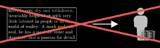

it should update prior beliefs.

- 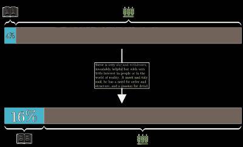

## Heart of Bayes' theorem

- 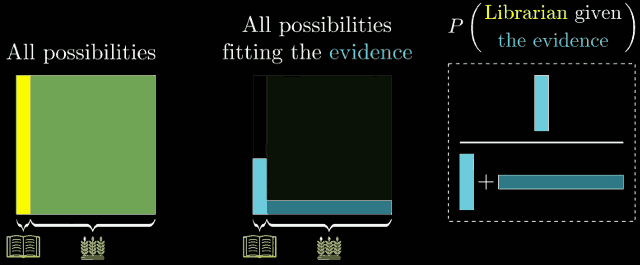

If this line of reasoning makes sense to you, the way seeing evidence restricts the space of possibilities, then congratulations, you understand the heart of Bayes' theorem. 

## When to use Bayes's rule 

- You have a *hypothesis* , say that Steve is a librarian
- and you've see some **evidence**,  say description of Steve a "meek and tidy soul"
- and you want to know the probability of hypothesis holds given that the evidence is true.  P( *Hypothesis* given **the evidence** )
    - P(*H* |**E**) 

---

Now remember the first relevant number is the probability that the hypothesis holds before considering any of the new evidence.

P(*H* ) = 1/21.

This is known as the **prior**.

After that , we need to consider the proportion of librarians that fit this description. The probability we would *see the evidence* given that the hypothesis is true. 

P(**E** |*H* ) = 0.4.   This number called **Likelihood**.

Similarly , we need to know how much of the other side of our space includes the evidence: the probability of seeing the evidence given that our hypothesis isn't true.

P(**E** |¬*H* ) = 0.1. 

- 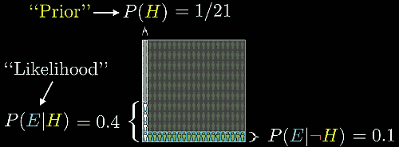

Now remember what our final answer was. The probability that our librarian hypothesis given the evidence , is the total number of librarians fitting the evidence ,4 , devided by the total number of people fitting the evidence ,24. 

But where does that 4 come from ?  It's the total number of people (210) , times the prior probability of being a librarian , giving us 10 total librarians, times the probability that ones of those fits the evidence, giving us 4. 

That same number shows up again in the denominator, but we need to add the rest, the total number of peaple times the proportion who are not librarians,  times the proportion of those who fit the evidence, which in our example gave 20. 

- 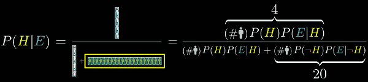

Now notice the total number of people in our example 210, gets canceled out, leaving us finally a more abstract representation purely in terms of probabilites. And this , is Bayes' theorem.

- 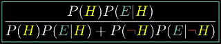

More often you see this big denominator written more simply as P(**E**) , the total probability of seeing the evidence , which in our example, would be 24/210. 

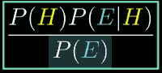

But in practice, to calculate it , you almost always have to break it down into the case where the hypothesis is true and the one where it isn't.

The final answer P(*H* |**E**) , is called **posterior**. It's your belief about the hypothesis after seeing the evidence. 

Keep in mind, though, the value of a formular like this is that it lets you quantify and systematize the idea of chaning beliefs.

However you end up writing it, I'd actually encourage you not to memorize the formula, but to draw out this diagram as needed. 

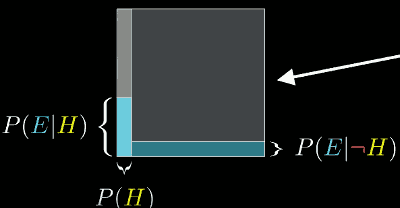

----

Rather than bringing to mind some specific number of examples, think of the space of all possibilities as a 1x1 square. Then any event occupies some subset of this space, and the probability of that event can be thought about as the area of that subst. For an example, I like to think of the hypothesis as filling the left part of this square, with a width of P(H).

When you see evidence, the space of possibilites gets restricted. Crucially, that restriction may note happen evenly between the left and right. So the new probability for the hypothesis the proportion it occupies in this restricted subspace.

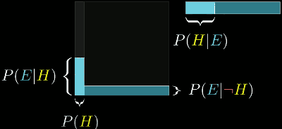

If you want to read the Bayes formula geometrically , then P(*H* )·P(**E** |*H* )  is just the area of this little left-bottom rectangle. 

