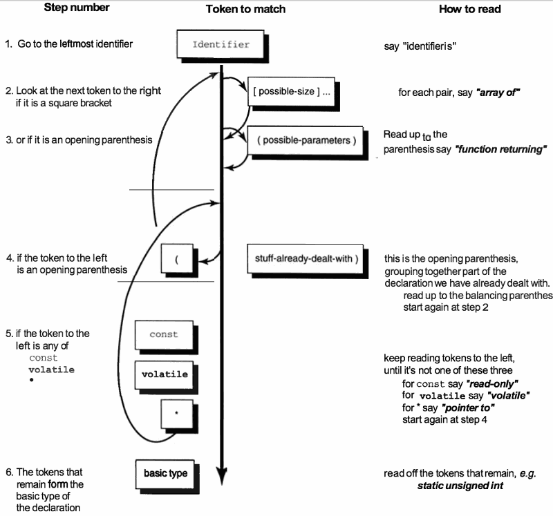

...menustart

 - [C Declaration](#4d4d41296119a89b97e6c8d1d2b12d61)
     - [How a Declaration Is Formed](#0e8496ac4e183c0a93f348bea3eb755a)
     - [how to combine variables in structs and unions](#b6883b80c1162c486c5fc1f7cd01ef57)
         - [A Word About structs](#f630d4bf06506c3ab082d636b29f7243)
         - [struct 内存对齐](#80a514cf94d858b0e7609f0f08d34686)
         - [A Word About unions](#d4e244f54df03fa025bc569ccfabc85a)
         - [A Word About enums](#e42747e8ccfb6720aed43d4f3052931e)
     - [The Precedence Rule](#9ecf79b05d37fa25da955c7e0c4461ee)
     - [typedef Can Be Your Friend](#180084aeda94c4da5d99c51a5c576d1c)
         - [Difference Between typedef int x\[10\] and #define x int\[10\]](#b2964049a26ea843935c34c897b5d716)
         - [What typedef struct foo { ... foo; } foo; Means](#3d484886fd516f41ecd9c20e76065a47)

...menuend


<h2 id="4d4d41296119a89b97e6c8d1d2b12d61"></h2>


# C Declaration 

<h2 id="0e8496ac4e183c0a93f348bea3eb755a"></h2>


## How a Declaration Is Formed

 - declaration vs declarator
    - A declarator is the part of a declaration that gives an object, type, or function its **name** and indicates whether an object is a **pointer, or array**. 

 - roughly, a declarator is 
    - the identifier 
    - and any pointers, 
    - function brackets, 
    - or array indica-tions that go along with it
 - Here we also group any initializer here for convenience.


Name in C  |  Looks in C | How Many
--- | --- | ---
pointer |  `* const  volatile`  |  0 or many
·  |  const,volatile 可选,位置可交换  |  ·
direct_declarator | `identifier`    | exactly one
· | `identifier[optional_size]...`    | ·
· | `identifier(args...)`    | ·
· | `(declarator)`    | ·
initializer | `= initial_value` | 0 or 1


 - A declaration is made up of the parts shown below
    - not all combinations are valid
 - A declaration gives the basic underlying type of the variable and any initial value.


Name in C  |  Looks in C | How Many
--- | --- | ---
type-specifier |  `void char short int long` |  at least one type-specifier 
· | `signed unsigned`    | (not all combinations are valid)
· | `float double`  | ·
· | `struct_specifier` | ·
· | `enum_specifier` | ·
· | `union_specifier` | ·
storage-class |  `extern static register` |  ·
· | `auto typedef` | ·
type-qualifier |  `const volitile` |  ·
 ---- | ------------------ | ----
declarator |  *definition above* | exactly one
more declarators | `, declarator`  |  0 , or more
semi-colon | `;` | 1 


 - remember there are restrictions on legal declarations. You can't have any of these:
    - a function can't return a function, so you'll never see `foo()()`
    - a function can't return an array, so you'll never see `foo()[]`
    - an array can't hold a function, so you'll never see `foo[]()`
 - You can have any of these:
    - a function returning a pointer to a function is allowed:  `int (* fun())()`
    - a function returning a pointer to an array is allowed:  `int (* foo())[]`
    - an array holding pointers to functions is allowed: `int (*foo[])()`
    - an array can hold other arrays, so you'll frequently see `int foo[][]`

<h2 id="b6883b80c1162c486c5fc1f7cd01ef57"></h2>


## how to combine variables in structs and unions

and also look at enums.

<h2 id="f630d4bf06506c3ab082d636b29f7243"></h2>


### A Word About structs

 - The syntax for structs is easy to remember: 
    - the usual way to group stuff together in C is to put it in braces: `{ stuff... }` 
    - The keyword struct goes at the front so the compiler can distinguish it from a block:
    - `struct {stuff... }`
 - The stuff in a struct can be any other data declarations: 
    - individual data items, arrays, other structs, pointers, and so on.  
 - We can follow a struct definition by some variable names, declaring variables of this struct type, for example:
    - `struct {stuff... } plum, pomegranate, pear;`
 - **"structure tag"**: 
    - The only other point to watch is that we can write an optional "structure tag" after the keyword
    - `struct fruit_tag {stuff... } plum, pomegranate, pear;` 
 - tag 的好处是，以后的声明可以 不再带 `{stuff...}`
    - `struct fruit_tag` can now be used as a shorthand for `struct {stuff... }` , in future declarations.
 - A struct thus has the general form:

```c
struct optional_tag {
type_1 identifier_1;
type_2 identifier_2;
...
type_N identifier_N;
} optional_variable_definitions;
```

```c
struct date_tag { short dd,mm,yy; } my_birthday, xmas;
struct date_tag easter, groundhog_day;
```

 - variables `my_birthday, xmas, easter, and groundhog_day` all have the identical type. 

 - Structs can also have bit fields, unnamed fields, and word-aligned fields.
    - This is commonly used for "programming right down to the silicon," and you'll see it in systems programs. 
    - A bit field must have a type of int, unsigned int, or signed int (or a qualified version of one of these)

```c
/* process ID info */
struct pid_tag {
unsigned int inactive :1;
unsigned int          :1; /* 1 bit of padding */
unsigned int refcount :6;
unsigned int          :0; /* pad to next word boundary
*/
short pid_id;
struct pid_tag *link;
};
```

 - Finally there are two parameter passing issues associated with structs.
 - when paramters are passed to a called function , parameters are passed in registers (for speed) where possible (并不是只会压进栈). 
    - Be aware that an int "i" may well be passed in a completely different manner to a struct "s" whose only member is an int.
    - Assuming an int parameter is typically passed in a register, you may find that structs are instead passed on the stack.
 - The second point to note is that by putting an array inside a struct like this:

```c
/* array inside a struct */
struct s_tag { int a[100]; };
```

 - you can now treat the array as a **first-class type**.
    - You can copy the entire array with an assignment statement, 
    - pass it to a function by value,
    - and make it the return type of a function.
        - 数组终于可以做这些事情了。。。

```c
struct s_tag { int a[100]; };
struct s_tag orange, lime, lemon;
struct s_tag twofold (struct s_tag s) {
    int j;
    for (j=0;j<100;j++) s.a[j] *= 2;
    return s;
}
main() {
    int i;
    for (i=0;i<100;i++) lime.a[i] = 1;
    lemon = twofold(lime);
    orange = lemon; /* assigns entire struct */
}
```

 - Let's finish up by showing one way to make a struct contain a pointer to its own type, as needed for lists, trees, and many dynamic data structures.

```c
/* struct that points to the next struct */
struct node_tag { int datum;
                  struct node_tag *next;
                };
struct node_tag a,b;
a.next = &b;       /* example link-up */
a.next->next=NULL;
```

<h2 id="80a514cf94d858b0e7609f0f08d34686"></h2>


### struct 内存对齐

 - 关键字：
    - 成员起始地址， 最大成员字节长度
 - 公式1:成员在结构体的起始地址，必须是 自身字节长度的整数倍,不是就补齐
 - 公式2:整个Struct的长度 必须是最大成员字节长度 的整数倍

```c
struct E1 { 
    int a;char b; char c
} e1;
```
 
 - Example above
    - 第一地址肯定存放a是4Byte地址
    - 第二地址,b要1Byte的地址 -- 公式一登场:    4 == 1\*N (N等于正整数)  答"是"!
        - 地址现在为5Byte
    - 下一个c要1Byte的地址同上 , 
        - 地址现在为6Byte  
    - 公式二登场，在这个E1中最大的字节是4，而我们的地址字节是6，4的整数倍不是6，所以，要加2Byte（总地址），So，整个字节为8!
 - CAUTION:
    - 每个特定平台上的编译器都有自己的默认“对齐系数”。可以通过预编译命令#pragma pack(n) 

```c
struct E2 {
    char b; int a ; char c
}
```
    
 - E2 12字节长

---

 - 背书式：
    - 各成员变量存放的起始地址 相对于结构的起始地址 的偏移量必须为该变量的类型所占用的字节数的倍数
    - 各成员变量在存放的时候根据在结构中出现的顺序依次申请空间
        - 同时按照上面的对齐方式调整位置 空缺的字节自动填充
    - 同时为了确保结构的大小 为结构的字节边界数(即该结构中占用最大的空间的类型的字节数) 的倍数

<h2 id="d4e244f54df03fa025bc569ccfabc85a"></h2>


### A Word About unions

 - **union** have a similar appearance to structs, but the memory layout has one crucial difference
    - Instead of each member being stored after the end of the previous one, **all the members have an offset of zero**.
    - The storage for the individual members is thus overlaid: only one member at a time can be stored there.
 - The good news is that unions have exactly the same general appearance as structs, but with the keyword `struct` replaced by `union`.
 - A union has the general form:

```c
union optional_tag {
    type_1 identifier_1;
    type_2 identifier_2;
      ...
    type_N identifier_N;
} optional_variable_definitions;
```

 - Unions can also be used
    1. for one interpretation of two different pieces of data 
    2. two different interpretations of the same data

```c
// case 1
union secondary_characteristics {
    char has_fur;
    short num_of_legs_in_excess_of_4;
};
struct creature {
    char has_backbone;
    union secondary_characteristics form;
};
```

```c
// case 2
union bits32_tag {
    int whole;                       /* one 32-bit value */
    struct {char c0,c1,c2,c3;} byte; /* four 8-bit bytes */
} value;
```

 - This union allows a programmer to extract the full 32-bit value, or the individual byte fields `value.byte.c0`, and so on.
 - There are other ways to accomplish this, but the union does it without the need for extra assignments or type casting.

<h2 id="e42747e8ccfb6720aed43d4f3052931e"></h2>


### A Word About enums

 - Enums (enumerated types) are simply a way of associating a series of names with a series of integer values. 
 - In a weakly typed language like C, they provide very little that can't be done with a `#define`

```c
enum optional_tag {stuff... } optional_variable_definitions;
```

 - `The stuff...` in this case is a list of identifiers, possibly with integer values assigned to them. 

```c
enum sizes { small=7, medium, large=10, humungous };
```

 - The integer values start at zero by default. 
    - If you assign a value in the list, the next value is +1 greater, and so on. 
 - There is one advantage to enums:
    - unlike `#defined` names which are typically discarded during compilation, 
    - enum names usually persist through to the debugger, and can be used while debugging your code.
 
---

<h2 id="9ecf79b05d37fa25da955c7e0c4461ee"></h2>


## The Precedence Rule

 - We have now reviewed the building blocks of declarations. 
 - The precedence rule for understanding C declarations is the one that the language lawyers like best.
 - It's high on brevity, but very low on intuition.


```c
// example
char* const *(*next)();
```

 - A 
    - 首先，变量名 `next` , 注意到 它在括号里 `()`
 - B.1
    - 所以我们把它与括号中的其他内容 组合起来看，`next` 是一个指针，还不清楚 指向哪里
 - B
    - 从括号里出来， 现在我们有两个选择， 前缀 `*` , 和 后缀 `()`
 - B.2
    - B.2 告诉我们 后缀 `()` 优先级更高, 所以， "next is a pointer to a function returning... 
 - B.3 
    - 前缀 `*`  ，一个指针
 - C 
    - 最后 , `"char * const"` ,  a constant pointer to a character 
 - 整合起来
    - next 是一个 指向函数的指针， 这个函数的返回值是 a pointer to a const pointer-to-char.


 - if you prefer something a little more intuitive, use
    - 

```c
char *(*c[10])(int **p);  //  how 2 read ?
```

 - c is an array[0..9] of pointer to a function returning a pointer-to-char
 - Tool:
    - `brew install cdecl`
    - `explain char *(*c[10])(int **);`


<h2 id="180084aeda94c4da5d99c51a5c576d1c"></h2>


## typedef Can Be Your Friend

 - Typedefs are a funny kind of declaration: 
    - they introduce a new name for a type rather than reserving space for a variable.
    - it doesn't introduce a new type, just a new name for a type , an alias 
 - If you refer back to the section on how a declaration is formed, you'll see that the `typedef` keyword can be part of a regular declaration, occurring somewhere **near the beginning**.
 - In fact, a typedef has exactly the same format as a variable declaration, only with this extra keyword to tip you off.
 - the `typedef` keyword doesn't create a variable, but causes the declaration to say "this name is a synonym for the stated type."
 - 通常，typedef 用于涉及 指针的棘手 的情况。
 - Example:
    - The ANSI Standard shows that signal is declared as:

```c
void (*signal(int sig, void (*func)(int)) ) (int);
```

 - so signal is a function (with some funky arguments) returning a pointer to a function 
    - which function taking an int argument and returning void
 - One of the funky arguments is itself:
    - `void (*func)(int) ;` 
    - is a pointer to a function , which taking an int argument and returning void. 
 - Here's how it can be simplified by a typedef :

```c
typedef void (*ptr_to_func) (int);
/* this says that ptr_to_func is a pointer to a function
 * that takes an int argument, and returns void
 */
ptr_to_func signal(int, ptr_to_func); 
/* this says that signal is a function that takes
 * two arguments, an int and a ptr_to_func, and
 * returns a ptr_to_func
 */
```

 - **注意区别**:

```c
cdecl> explain void (*signal ) (int);
declare signal as POINTER to function (int) returning void

cdecl> explain void (*signal() ) (int);
declare signal as FUNCTION returning pointer to function (int) returning void
```

 - Typedef provides essentially nothing for structs, except the unhelpful ability to omit the struct keyword.

<h2 id="b2964049a26ea843935c34c897b5d716"></h2>


### Difference Between typedef int x[10] and #define x int[10]

 - 你不能再次修饰 typedef 'd typename
    - You can extend a macro typename with other type specifiers ,
    - but not a typedef 'd typename

```c
#define peach int
unsigned peach i; /* works fine */
typedef int banana;
unsigned banana i; /* Bzzzt! illegal */
```

<h2 id="3d484886fd516f41ecd9c20e76065a47"></h2>


### What typedef struct foo { ... foo; } foo; Means

```c
typedef struct my_tag {int i;} my_type;
        struct my_tag variable_1;
my_type variable_2;
```

 - typedef introduces the name `my_type` as a shorthand for "`struct my_tag {int i}`"
 - it also introduces the structure tag `my_tag` that can equally be used with the keyword `struct`
 - If you use the same identifier for the type and the tag in a typedef, it has the effect of making the keyword "struct" optional
    - which provides completely the wrong mental model for what is going on.
 - So although these two declarations have a similar form, ery different things are happening

```c
typedef struct fruit {int weight, price_per_lb } fruit; /* statement 1 */
        struct veg   {int weight, price_per_lb } veg;   /* statement 2 */
```

 - Statement 1 declares a structure tag "fruit" and a structure typedef "fruit" which can be used like this:

```c
struct fruit mandarin; /* uses structure tag "fruit" */ 
       fruit tangerine; /* uses structure type "fruit" */
```

 - Statement 2 declares a structure tag "veg" and a variable veg. Only the structure tag can be used in further declarations, like this:

```c
struct veg potato;
```

 - Tips for Working with Typedefs
    - Don't bother with `typedefs` for `structs`.
 - Use typedefs for:
    - types that combine arrays, structs, pointers, or functions.
    - portable types.
        - When you need a type that's at least (say) 20-bits, make it a typedef
        - Then when you port the code to different platforms, select the right type, short, int, long, making the change in just the typedef, rather than in every declaration.
    - casts.
        - A typedef can provide a simple name for a complicated type cast. E.g.

```c
typedef int (*ptr_to_int_fun)(void);
char * p =  (ptr_to_int_fun) p;
```


