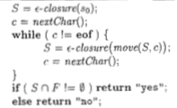

...menustart

 - [2](#c81e728d9d4c2f636f067f89cc14862c)
     - [2.2.3 语法分析树 parse tree](#1c1103b7cf6ef2d7187e2af20e737f18)
     - [2.2.4 二义性](#4fc16bc8643d7d323084092c6edcb13e)
     - [2.2.5 运算符的结合性](#206dbde1846f8503c61c705fda9367b3)
     - [2.2.6 运算符的优先级](#b9bd154f2f24f4de761a2c5c979d6a0d)
     - [2.3 语法制导翻译](#16499a85259e66bcce718661e4fb5392)
     - [2.4 语法分析](#afd7adba5235839e613145e93779d816)
         - [2.4.1 自顶向下分析方法](#e86b1d223b805c6988c05790b9070a24)
         - [2.4.2 预测分析法](#64d873364c0ef1d8d66b0c034574ccf1)
         - [2.4.5 左递归](#45a2fcd97ccc94e5d941d6ff0061a3bf)
     - [2.5 简单表达式的翻译器](#4421301821ced2f90bd6a14e54d12a53)
         - [2.5.4 翻译器的简化](#1167fe353876aeb46eac89f506ef1c5f)
     - [2.6 词法分析](#4ab47bf003d890258aee2debca03502f)
         - [2.6.1 踢出空白和注释](#f89a7ff3f83279d87379fbe1a647a2ec)
         - [2.6.2 预读](#8db14144f5b84c3bb05b7055e6672b21)
     - [2.7 符号表](#8ae83720f79e0764eef0ce79c87d3462)
 - [3 Lexical Analysis](#1a7dca2b1698b918edda658b65076d76)
     - [3.1.2 词法单元tokens  模式patterns 词素lexemes](#cf1effdeec844f6b4712bc7ba0969cb6)
     - [3.4.1 状态转换图](#96b2680d20ac47c6ba642d68e43ee952)
     - [3.4.2 保留字 和 标识符的 识别](#76ee5f936ccf5b3960fb370357772f16)
     - [3.4.4 基于状态转换图的 词法分析器的  体系结构](#11e3839155afe5d33a55b59459334dcf)
     - [3.6 有穷自动机](#b93159a6d54bff0f228053fd4fce6789)
 - [4](#a87ff679a2f3e71d9181a67b7542122c)
     - [4.2.5](#5441717396398d064ef2ea407b8b8223)
     - [4.2.7 上下文无关文法](#403f83a386bcef9e510b65dac4162c32)
     - [4.3 设计文法](#560528d0b73d6b4a61e1a6a71d7f569c)
         - [4.3.1 词法分析 和 语法分析](#1216b8c7bea3aa1328863494bb45c004)
         - [4.3.2 消除二义性](#7de67b397b21fd33cbc2ad8eafadf695)
         - [4.3.3 左递归的消除](#2181b71677679669d44656861c7312b6)
         - [4.3.4 提取左公因子](#62961a2a67269df0bba078841c3d3c60)
         - [4.3.5 非上下文无法语言的构造](#c023cb268f92b92f996c83105478c4cd)
     - [4.4 自顶向下的语法分析](#5d03a38287eda286563354f3e44aaec9)
         - [4.4.1 递归下降的语法分析](#d80f9da510bd9d19b21483ed8cd19347)
         - [4.4.2 FIRST 和  FOLLOW](#6868771f6ced090e89b2ea3ae10203cb)
         - [4.4.3 LL(1) 文法](#91d66d1fc546e923bbe8976e14b67ec0)
         - [4.4.4 非递归的预测分析](#ded5f00380dedea2559a05a2dc98a150)
 - [5 语法制导的翻译](#720a1a8233b0dc28ed88f05257dee365)
     - [5.1 语法制导定义SDD](#d00069b547812226dc40733918fa2dcc)
         - [5.1.1 继承属性 和综合属性](#4b626ee10d1fbb69b8123574d5ea37c9)
     - [5.2 SDD 求值顺序](#06bf842214b8b7d055c6c05446e80571)
         - [5.2.3 S属性的定义](#83ec695547b462ed49bdef5d3cacb0bc)
         - [5.2.4 L属性的定义](#367a79439e2a8d1a1801a78acd017e12)
     - [5.3 语法制导翻译的应用](#9ced8e1ec19ed5017bd63812c21e9dcf)
         - [5.3.1 抽象语法树的构造](#7a4f6d88b4f32982d365400f0ad73e20)

...menuend

<h2 id="c81e728d9d4c2f636f067f89cc14862c"></h2>

# 2

<h2 id="1c1103b7cf6ef2d7187e2af20e737f18"></h2>

### 2.2.3 语法分析树 parse tree

<h2 id="4fc16bc8643d7d323084092c6edcb13e"></h2>

### 2.2.4 二义性

<h2 id="206dbde1846f8503c61c705fda9367b3"></h2>

### 2.2.5 运算符的结合性

<h2 id="b9bd154f2f24f4de761a2c5c979d6a0d"></h2>

### 2.2.6 运算符的优先级

 - 创建额外的非终结符，用于对应 优先级层次

<h2 id="16499a85259e66bcce718661e4fb5392"></h2>

## 2.3 语法制导翻译
 
 - 生产式中嵌入 语义动作 semantic action

<h2 id="afd7adba5235839e613145e93779d816"></h2>

## 2.4 语法分析

 1. 自顶向下
    - 容易手工构造
 2. 自底向上
    - 可以处理更多种文法和翻译方案

<h2 id="e86b1d223b805c6988c05790b9070a24"></h2>

### 2.4.1 自顶向下分析方法

 - 一般来说，为一个非终结符 选择产生式是一个 “尝试并犯错” 的过程。
 - 但是 在称为 预测语法分析的特殊情形下 不需要进行回溯。

<h2 id="64d873364c0ef1d8d66b0c034574ccf1"></h2>

### 2.4.2 预测分析法

 - 递归下降分析方法 是一种 自顶向下的语法分析方法，它使用一组递归过程来处理输入
    - 每个非终结符 都有一个 相关联的过程
 - 预测分析法 predictive parsing 是 递归下降分析法的一种 简单形式
    - 每个非终结符 对应的过程中的控制流 可以由 lookahead 符号 无二义地确定
    - 如果有两个产生式 A→α, A→β , 如果不考虑ε产生式, 预测分析法要求 FIRST(α) ， FIRST(β) 不相交.
        - FIRST 可以选择产生式

<h2 id="45a2fcd97ccc94e5d941d6ff0061a3bf"></h2>

### 2.4.5 左递归

 - 左递归会导致 递归下降语法分析器 进入无限循环
 - 可以改写成 右递归
    - 对包含 左结合运算符(i.e.+ -) 的表达式 的翻译 会变得较为困难。

<h2 id="4421301821ced2f90bd6a14e54d12a53"></h2>

## 2.5 简单表达式的翻译器

 - AST 是设计 翻译器的 一个很好的起点
    - AST 简称 语法树 syntax tree， 某种程度上和 语法分析树相似
    - 树中没有 对应于 expr → term 这样的单产生式 的“辅助”节点
    - 也没有对应于 ε产生式 ( rest→ε ) 的节点

<h2 id="1167fe353876aeb46eac89f506ef1c5f"></h2>

### 2.5.4 翻译器的简化

 - expr → term 把 term 这样的 展开到 expr
 - 某些递归调用， 替换为 迭代
    - 如 尾递归

<h2 id="4ab47bf003d890258aee2debca03502f"></h2>

## 2.6 词法分析

<h2 id="f89a7ff3f83279d87379fbe1a647a2ec"></h2>

### 2.6.1 踢出空白和注释

<h2 id="8db14144f5b84c3bb05b7055e6672b21"></h2>

### 2.6.2 预读

<h2 id="8ae83720f79e0764eef0ce79c87d3462"></h2>

## 2.7 符号表

 - symbol table list

<h2 id="1a7dca2b1698b918edda658b65076d76"></h2>

# 3 Lexical Analysis

 - 词法分析器，可以分为 两个步骤
    1. 扫描阶段
        - 一些不需要生成词法单元的 简单处理， 比如 删除注释，将多个连续空白字符 压缩成一个字符
    2. 词法分析阶段
        - 处理 扫描阶段的输出，并生成词法单元
    
<h2 id="cf1effdeec844f6b4712bc7ba0969cb6"></h2>

### 3.1.2 词法单元tokens  模式patterns 词素lexemes

 - examle 

词法单元 |  非正式 模式描述 | 词素示例
--- | --- | ---
if | 字符 i,f  | if
else | 字符 e,l,s,e | else 
comparison | < , > , <= , >=  , == , != | <=, !=
id | 字母开头 的字母/数字串  | pi, score, D2
number | 任何数字常量 | 3.14159 , 0.6
literal | 两个 “ 之间除“ 以外的 任何字符 | "core dumped"

- 很多程序设计语言中， 下面的类别 覆盖了大部分 或 所有的词法单元
    1. 每个关键字有一个词法单元
        - 一个关键字的 pattern 就是该关键字本身
    2. 表示运算符的词法单元
        - 可以是 单个运算符，
        - 也可以是 像上面的comparison 那样 表示一类运算符
    3. 一个表示所有 标识符的词法单元 id
    4. 一个或多个表示常量的词法单元
        - 比如数字， 和 字面值 字符串
    5. 每一个标点 有一个词法单元， 
        - 比如 左右括号，逗号， 分号

<h2 id="96b2680d20ac47c6ba642d68e43ee952"></h2>

### 3.4.1 状态转换图

 - 构造词法分析器的 一个中间步骤
 - 将pattern 转换成 具有特定风格的流图， 称为 “状态转换图”。
 - 可以使用 自动化的方法，根据一组正则表达式集合  构造出 状态转换图。
 - 接受状态（最终状态） 可能需要回退。

<h2 id="76ee5f936ccf5b3960fb370357772f16"></h2>

### 3.4.2 保留字 和 标识符的 识别

 - 有两种方法
    1. 初始化时 ， 将各个保留字 填入 symbol table中
    2. 为每个关键字 建立单独的 状态转换图
        - 需要一步回退，最 结束检测

<h2 id="11e3839155afe5d33a55b59459334dcf"></h2>

### 3.4.4 基于状态转换图的 词法分析器的  体系结构
 
 - 如何将各个 状态转换图的处理代码 集成到 词法分析器？
    1. 顺序地尝试各个 词法单元的状态转换图
        - 调用 fail() 会启动下一个状态转换图
    2. 并行地 运行各个状态转换图，将下一个输入字符，提供给 所有的状态转换图。
        - 最长匹配策略
    3. 更好的办法： 合并所有状态转换图为 一个图
        - 依然使用 最长匹配策略

<h2 id="b93159a6d54bff0f228053fd4fce6789"></h2>

## 3.6 有穷自动机

 - 表示
    1. 转换图
    2. 转换表

 - NFA/DFA
    - NFA 抽象地表示了 ，用来识别**某个语言中的串**的 算法
    - DFA 是一个 简单具体的识别**串**的算法
 - 每个正则表达式 或 NFA 都可以被转变成为 一个接受相同语言的 DFA.

 - 模拟DFA
    - 
 - 模拟NFA
    - 

 - NFA 合并
    - 引入 新的状态0， epsilon 跳转到 各个 nfa 的 初始状态

<h2 id="a87ff679a2f3e71d9181a67b7542122c"></h2>

# 4

<h2 id="5441717396398d064ef2ea407b8b8223"></h2>

### 4.2.5

 - 最左推导/最右推导 
    - 最左推导/最右推导 都应该对应同一颗 语法分析树
    - 如果不是同一颗语法分析树，那么这个文法就是二义的。

<h2 id="403f83a386bcef9e510b65dac4162c32"></h2>

### 4.2.7 上下文无关文法

 - 上下文无关文法是比 正则表达式 表达能力更强的表示方法。
 - 每个可以 使用正则表达式的构造 都可以使用 文法来描述， 但是反之不成立。
    - 换句话说，每个正则表达式都是一个上下文无关语言， 但是反之不成立。
 - NFA 可以识别和 正则表达式等价的 文法。
 - **有穷自动机不能计数**。

<h2 id="560528d0b73d6b4a61e1a6a71d7f569c"></h2>

## 4.3 设计文法
 
<h2 id="1216b8c7bea3aa1328863494bb45c004"></h2>

### 4.3.1 词法分析 和 语法分析

 - 正则表达式 最适合描述 诸如 标识符，常量，空白 这样的语言构造的结构
 - 文法 最适合描述 嵌套结构，
    - 比如 括号对，匹配的 begin-end， 相对应的 if-then-else 等
    - 这些 嵌套结构 不能使用正则表达式 描述

<h2 id="7de67b397b21fd33cbc2ad8eafadf695"></h2>

### 4.3.2 消除二义性

<h2 id="2181b71677679669d44656861c7312b6"></h2>

### 4.3.3 左递归的消除

<h2 id="62961a2a67269df0bba078841c3d3c60"></h2>

### 4.3.4 提取左公因子
 
 - 一种文法转换方法， 它可以产生适用于 预测分析技术 ， 或 自顶向下分析技术的文法

<h2 id="c023cb268f92b92f996c83105478c4cd"></h2>

### 4.3.5 非上下文无法语言的构造

 - 在常见的程序设计语言中，有少量不能仅用文法描述的语法构造，如
    - 检查标识符的 先声明 ，后使用
    - 参数个数检查问题

<h2 id="5d03a38287eda286563354f3e44aaec9"></h2>

## 4.4 自顶向下的语法分析

 - 先根次序，深度优先
 - 自顶向下语法 也可以被看作 寻找 输入串的 最左推导的过程。

<h2 id="d80f9da510bd9d19b21483ed8cd19347"></h2>

### 4.4.1 递归下降的语法分析

 - 每个非终结符 有一个对应的 过程
 - 程序的执行，从开始符号 对应的过程开始
    - 如果这个过程的过程体  扫描了整个 输入串， 它就停止执行，并宣布语法分析成功完成

 - 通过递归下降分析技术 可能需要回溯

-----------

<h2 id="6868771f6ced090e89b2ea3ae10203cb"></h2>

###  4.4.2 FIRST 和  FOLLOW

 - 自顶向下和 自底向上 语法分析器 的构造 可以使用和 文法G相关的两个函数 FIRST/FOLLOW 来实现
 - 在 自顶向下 语法分析过程中， FIRST 和 FOLLOW 使得我们可以根据下一个输入符号 来选择应用哪个产生式
 - 计算 FIRST/FOLLOW ， pdf page 156

<h2 id="91d66d1fc546e923bbe8976e14b67ec0"></h2>

###  4.4.3 LL(1) 文法

 - 1st L : 从左向右扫描输入
 - 2nd L : left most 推导
 - `1` : 每一步中，只需要 向前看一个输入符号， 来决定语法分析动作
 - 一个文法G是LL(1)的， iff G的任意两个不同的产生式 A→α|β 满足下面的条件 ：
    1. 不存在 终结符号a , 使得 α,β 都能够推导出 以a开头的串
    2. α 和 β 中 最多只有一个可以推导出空串
    3. 如果 β ⇒\* ε , 那么 α 不能推导出 任何以 FOLLOW(A) 中某个终结符号开头的串。
        - α 的 情况类似 
 - 前两个条件 等价于 说 FIRST(α) 和 FIRST(β) 是不相交的集合。第三个条件 等价于说 如果 ε 再 FIRST(β) 中， 那么FIRST(α) 和 FOLLOW(A) 是 不想交的集合。

 - 对于 LL(1) 文法， 我们可以构造出 预测分析器， 即 不需要回溯的递归下降语法分析器。
 - 预测分析表 M[A,a]
    - 算法 cn pdf p157
    - A 是一个非终结符
    - a 是一个终结符 ，或 结束符号 $

<h2 id="ded5f00380dedea2559a05a2dc98a150"></h2>

### 4.4.4 非递归的预测分析

<h2 id="720a1a8233b0dc28ed88f05257dee365"></h2>

# 5 语法制导的翻译

<h2 id="d00069b547812226dc40733918fa2dcc"></h2>

## 5.1 语法制导定义SDD

 - S属性 SDD
 - L属性 SDD

<h2 id="4b626ee10d1fbb69b8123574d5ea37c9"></h2>

### 5.1.1 继承属性 和综合属性

 - 当一颗 语法分析树的结构和 源代码的抽象语法 不匹配时， 继承属性是很有用的
    - 常见于 表达式文法的无左递归版本。
    - 思想： 运算符 的 左运算分量，通过继承得到

<h2 id="06bf842214b8b7d055c6c05446e80571"></h2>

## 5.2 SDD 求值顺序

 - 依赖图 dependency graph 拓扑排序

<h2 id="83ec695547b462ed49bdef5d3cacb0bc"></h2>

### 5.2.3 S属性的定义

 - 如果一个SDD的每个属性都是 综合属性，它就是 S属性的
 - 如果一个SDD是S属性的，我们可以按照语法分析树 结点的任何 自底向上顺序 来计算它的各个属性。
    - 对 语法分析树 进行后续遍历 并对属性求值常常会非常简单

<h2 id="367a79439e2a8d1a1801a78acd017e12"></h2>

### 5.2.4 L属性的定义

 - 在一个产生式 所关联的各个属性之间， 依赖图的边总是 从左到右， 而不能从右到左。
 - 更准确的讲，每个属性要么是
    - 一个综合属性，要么是
    - 一个继承属性，但是它的规则具有限制 page 216

<h2 id="9ced8e1ec19ed5017bd63812c21e9dcf"></h2>

## 5.3 语法制导翻译的应用

 - 应用：抽象语法树的构造
    - Since some compilers use syntax trees as an intermediate representation, a common form of SDD turns its input string into a tree. 
    - To complete the translation to intermediate code, the compiler may then walk the syntax tree, 
        - using another set of rules that are in effect an SDD on the syntax tree rather than the parse tree. 
 - We consider two SDD's for constructing syntax trees for expressions
    - S-attributed definition
        - is suitable for use during bottom-up parsing.
    - L-attributed
        - is suitable for use during top-down parsing.

<h2 id="7a4f6d88b4f32982d365400f0ad73e20"></h2>

### 5.3.1 抽象语法树的构造

 - Leaf(op, val)
 - Node(op, c1, [ c2,...,ck ] )

