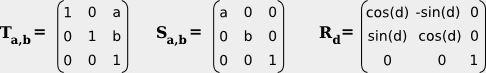
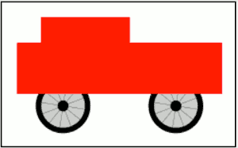
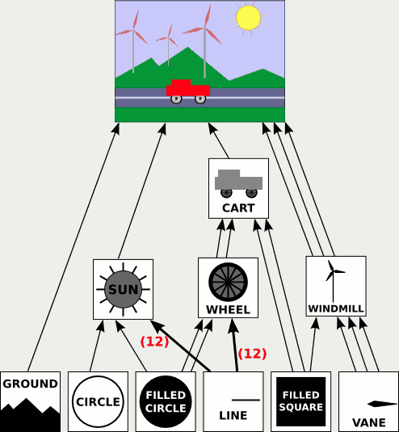

...menustart

 - [Introduction to Compute Graphics](#ed2522f9ccf6f8396413305da6adff58)
     - [Chapter 1 Introduction](#ae6212de98066cfe7c4f284fb7bb0795)
     - [1.2 Elements of 3D Graphics](#f10dad289ae05f4d583970509a372cc1)
     - [1.3 Hardware and Software](#901578a22162231933351bb435643a38)
 - [Chapter 2 Two-Dimensional Graphics](#1fbe7cb2eda7e6cc90bab73b26af826f)
     - [2.1 Pixels, Coordinates, and Colors](#09f5cc118d9152e36afb92ed40ad49b0)
     - [Section 2.2 Shapes](#6b56406a73de78eb734c95320762cbe9)
     - [Section 2.3 Transforms](#4527049748338e479408a27beac21279)
         - [2.3.8  Matrices and Vectors](#f1c711e7f3eb682d422fd2ae934c2453)
     - [2.4 Hierarchical Modeling](#20f7a1734dcfbfc8b8171646bc9d424a)
         - [2.4.1  Building Complex Objects](#c0e7574b56dd30a9c9c926536be484a2)
         - [2.4.2  Scene Graphs](#67137954a0f48d179144a1519998eb59)
         - [2.4.3  The Transform Stack](#39e5754cf5035d8cbca9e34fd7c163e7)
     - [2.6 HTML Canvas Graphics](#1876f21f1147124d0889f999bd06d002)
         - [2.6.1  The 2D Graphics Context](#3cf9519b6e48c28034d7d66e00c70f25)
         - [2.6.2  TODO](#1a8a7607dedb19f8be29300d42880137)

...menuend


<h2 id="ed2522f9ccf6f8396413305da6adff58"></h2>


# Introduction to Compute Graphics


In this book , will use a subset of OpenGL 1.1 to introduce the fundamental concepts of three-dimensional graphics. 

- Notes
    - The transformation from 3D to 2D involves viewing and projection.
    - Improving OpenGL performance : VBO , texture objects.
    - Affine transform: T(x,y) = ( a*x + b*y + e, c*x + d*y + f ).
        - An affine transform has the property that, when it is applied to two parallel lines, the transformed lines will also be parallel.
    - Translation is not a linear transformation. To bring translation into same framework, using (x,y,1) instead.


<h2 id="ae6212de98066cfe7c4f284fb7bb0795"></h2>


## Chapter 1 Introduction

<h2 id="f10dad289ae05f4d583970509a372cc1"></h2>


## 1.2 Elements of 3D Graphics

- geometric primitives
    - such as line, segments and triangles 
- material
    - the properties that determine the intrinsic visual appearance of a surface.
    - Essentially, this means how the surface interacts with light that hits the surface.
    - can include a basic color as well as other properties such as shininess, roughness, and transparency.
- texture
    - One of the most useful kinds of material property
    - Textures allow us to add detail to a scene without using a huge number of geometric primitives;
- 3D->2D
    - The transformation from 3D to 2D involves **viewing** and **projection**.
    - viewing
        - To set up a point of view, specify the position of the viewer and the direction that the viewer is looking.
        - It is also necessary to specify an "up" direction, a direction that will be pointing upwards in the final image.
        - can be thought of as placing a "virtual camera" into the scene
    - Projection
        - taking a picture with the camera.
    - rasterization
        - assign colors to individual pixels in the 2D image


<h2 id="901578a22162231933351bb435643a38"></h2>


## 1.3 Hardware and Software
 
- OpenGl
    - designed as a "client/server" system , CPU send commands to GPU, along with any necessary data
    - communicating from the client (the CPU) to the server (the GPU)  are very slow
        - One approach is to store information in the GPU's memory. 
            - If some data is going to be used several times, it can be transmitted to the GPU once and stored in memory there.
        - Another approach is to try to decrease the number of OpenGL commands that must be transmitted to the GPU to draw a given image.
            - in OpenGL 1.1, all the data for the object would be loaded into arrays , which could then be sent in a single step to the GPU. 
                - Unfortunately, if the object was going to be drawn more than once, the data would have to be retransmitted each time the object was drawn.
            - This was fixed in OpenGL 1.5 with *Vertex Buffer Objects* .  A VBO is a block of memory in the GPU that can store the coordinates or attribute values for a set of vertices.
        - Similarly, OpenGL 1.1 introduced *texture objects to* make it possible to store several images on the GPU for use as textures. 
            - so tha the GPU can easily switch between images without having to reload them
- Shader
    - OpenGL was a giant machine, but still not pleasing everyone. The real solution was to make the machine **programmable**.
    - With OpenGL 2.0, it became possible to write programs to be executed as part of the graphical computation in the GPU. 
    - The programs are called *shaders*.
        - vertex shaders
            - "per-vertex" computations
            - such as applying a *geometric transform* to the vertex coodinates, or using the *attributes* and global *lighting* environment to compute the color of that vertex
        - fragment shader
            - "per-pixel" computations
    - In OpenGL 3.0, the usual per-vertex and per-fragment processing was deprecated. And in OpenGL 3.1, it was removed from the OpenGL standard, although it is still present as an optional extension.
    - In practice, all the original features of OpenGL are still supported in desktop versions of OpenGL and will probably continue to be available in the future. 
        - On the embedded system side, however, with OpenGL ES 2.0 and later, the use of shaders is mandatory, and a large part of the OpenGL 1.1 API has been completely removed. 
        - WebGL, the version of OpenGL for use in web browsers, is based on OpenGL ES 2.0, and it also requires shaders to get anything at all done.
    - Nevertheless, we will begin our study of OpenGL with version 1.1. Most of the concepts and many of the details from that version are still relevant, and it offers an easier entry point for someone new to 3D graphics programming.

    - OpenGL shaders are written in GLSL (OpenGL Shading Language).
        - We will spend some time later in the course studying GLSL ES 1.0, the version used with WebGL 1.0 and OpenGL ES 2.0. 
        - GLSL uses a syntax similar to the C programming language.

---

<h2 id="1fbe7cb2eda7e6cc90bab73b26af826f"></h2>


# Chapter 2 Two-Dimensional Graphics

<h2 id="09f5cc118d9152e36afb92ed40ad49b0"></h2>


## 2.1 Pixels, Coordinates, and Colors

- *Antialiasing* is a term for techniques that are designed to mitigate the effects of aliasing. 
    - The idea is that when a pixel is only partially covered by a shape, the color of the pixel should be a mixture of the color of the shape and the color of the background. 
    - In practice, calculating this area exactly for each pixel would be too difficult, so some approximate method is used.
    - 
- There are other issues involved in mapping real-number coordinates to pixels.
    - here are two lines drawn using HTML canvas graphics, the lines were specified to be colored black with a one-pixel line width. 
    - 
    - The top line was drawn from the point (100,100) to the point (120,100). The canvas graphics system, which uses antialiasing, rendered the line by coloring both rows of pixels gray.
    - The bottom line was drawn from the point (100.5,100.5) to (120.5,120.5). The gray pixels at the ends of the bottom line have to do with the fact that the line only extends halfway into the pixels at its endpoints. 
    - Other graphics systems might render the same lines differently.


<h2 id="4527049748338e479408a27beac21279"></h2>


## Section 2.3 Transforms

**affine transform**:  A transformation of this form `T(x,y) = ( a*x + b*y + e, c*x + d*y + f )`.

An affine transform has the property that, when it is applied to two parallel lines, the transformed lines will also be parallel.


<h2 id="f1c711e7f3eb682d422fd2ae934c2453"></h2>


### 2.3.8  Matrices and Vectors

 - If we want to apply a scaling followed by a rotation to the point v = (x,y), we can compute either R(Sv) or (RS)v. 
 - Translation is not a linear transformation. 
    - To bring translation into this framework (rotate and scale) , we do something that looks a little strange at first: Instead of representing a point in 2D as a pair of numbers (x,y), we represent it as the triple of numbers (x,y,1). 
    - It then turns out that we can then represent rotation, scaling, and translation—and hence any affine transformation—on 2D space as multiplication by a 3-by-3 matrix.
    - The matrices that we need have a bottom row containing (0,0,1). Multiplying (x,y,1) by such a matrix gives a new vector (x1,y1,1).




<h2 id="20f7a1734dcfbfc8b8171646bc9d424a"></h2>


## 2.4 Hierarchical Modeling 

In this section, we look at how complex scenes can be built from very simple shapes. The key is hierarchical structure.

<h2 id="c0e7574b56dd30a9c9c926536be484a2"></h2>


### 2.4.1  Building Complex Objects
 
 - When drawing an object, use the coordinate system that is most natural for the object.
 - Usually, we want an object in its natural coordinates to be centered at the origin, (0,0), or at least to use the origin as a convenient reference point. 
    - Then, to place it in the scene, we can use a scaling transform, followed by a rotation, followed by a translation to set its size, orientation, and position in the scene. 
    - Recall that transformations used in this way are called  *modeling transformations*.
    - The transforms are often applied in the order scale, then rotate, then translate, because scaling and rotation leave the reference point, (0,0), fixed.
        - in the code, the translation would come first, followed by the rotation and then the scaling:  TRS
        - Modeling transforms are not always composed in this order, but it is the most common usage.
 - The modeling transformations that are used to place an object in the scene should not affect other objects in the scene. 
    - we can save the current transformation before starting work on the object and restore it afterwards. 
    - but let's suppose here that there are subroutines saveTransform() and restoreTransform() for performing those tasks.

```
saveTransform()
translate(dx,dy) // move object into position
rotate(r)        // set the orientation of the object
scale(sx,sy)     // set the size of the object
     .
     .  // draw the object, using its natural coordinates
     .
restoreTransform()
```

 - Note that we don't know and don't need to know what the saved transform does. 
    - The modeling transform moves the object from its natural coordinates into its proper place in the scene. 
    - Then on top of that, a coordinate transform that is applied to the scene as a whole would carry the object along with it.
 - Let's look at a little example. Suppose that we want to draw a simple 2D image of a cart with two wheels.
    - 
    - The wheel has radius 1.
    - The rectangular body of the cart has width 6 and height 2.
        - it is convenient use the midpoint of the base of the large rectangle as the reference point.
        - assume that the positive direction of the y-axis points upward, which is the common convention in mathematics.
        - so the coordinates of the lower left corner of the rectangle are (-3,0)
    - In wheel's coordinate system, the wheel is centered at (0,0) and has radius 1.
 - Here is pseudocode for a subroutine that draws the cart in its own coordinate system:

```
subroutine drawCart() :
    saveTransform()       // save the current transform
    translate(-1.65,-0.1) // center of first wheel will be at (-1.65,-0.1)
    scale(0.8,0.8)        // scale to reduce radius from 1 to 0.8
    drawWheel()           // draw the first wheel
    restoreTransform()    // restore the saved transform
    saveTransform()       // save it again
    translate(1.5,-0.1)   // center of second wheel will be at (1.5,-0.1)
    scale(0.8,0.8)        // scale to reduce radius from 1 to 0.8
    drawWheel(g2)         // draw the second wheel
    restoreTransform()    // restore the transform
    setDrawingColor(RED)  // use red color to draw the rectangles
    fillRectangle(-3, 0, 6, 2)      // draw the body of the cart
    fillRectangle(-2.3, 1, 2.6, 1)  // draw the top of the cart
```
     
 - Once we have this cart-drawing subroutine, we can use it to add a cart to a scene. When we do this, we apply another modeling transformation to the cart as a whole. Indeed, we could add several carts to the scene, if we wanted, by calling the drawCart subroutine several times with different modeling transformations.
 - Building up a complex scene out of objects is similar to building up a complex program out of subroutines.
 
<h2 id="67137954a0f48d179144a1519998eb59"></h2>


### 2.4.2  Scene Graphs
 
 - Logically, the components of a complex scene form a structure. 
    - In this structure, each object is associated with the sub-objects that it contains. 
    - If the scene is hierarchical, then the structure is hierarchical.
    - This structure is known as a **scene graph**.   
    - A scene graph is a tree-like structure, with the root representing the entire scene, the children of the root representing the top-level objects in the scene, and so on.



 - In this drawing, a single object can have several connections to one or more parent objects. 
    - Each connection represents one occurrence of the object in its parent object.
    - Each arrow in the picture can be associated with a modeling transformation that places the sub-object into its parent object. 
    - When an object contains several copies of a sub-object, each arrow connecting the sub-object to the object will have a different associated modeling transformation. 
        - The object is the same for each copy; only the transformation differs.
 - When implementing a scene graph as a data structure made up of objects, a decision has to be made about how to handle transforms.
    - One option is to allow transformations to be associated with any node in the scene graph. 
 - A scene graph is actually an example of a "directed acyclic graph" or "dag."


<h2 id="39e5754cf5035d8cbca9e34fd7c163e7"></h2>


### 2.4.3  The Transform Stack


<h2 id="1876f21f1147124d0889f999bd06d002"></h2>


## 2.6 HTML Canvas Graphics

<h2 id="3cf9519b6e48c28034d7d66e00c70f25"></h2>


### 2.6.1  The 2D Graphics Context

```js
<canvas width="800" height="600" id="theCanvas"></canvas>
```

 - The *id* is an identifier that can be used to refer to the canvas in JavaScript.
 - To draw on a canvas, you need a graphics context. 
    - A graphics context is an object that contains functions for drawing shapes. 

```js
canvas = document.getElementById("theCanvas");
graphics = canvas.getContext("2d");
```

 - Typically, you will store the canvas graphics context in a global variable and use the same graphics context throughout your program. 

```js
<!DOCTYPE html>
<html>
<head>
<title>Canvas Graphics</title>
<script>
    var canvas;    // DOM object corresponding to the canvas
    var graphics;  // 2D graphics context for drawing on the canvas

    function draw() {
           // draw on the canvas, using the graphics context
        graphics.fillText("Hello World", 10, 20);
    }

    function init() {
        canvas = document.getElementById("theCanvas");
        graphics = canvas.getContext("2d");
        draw();  // draw something on the canvas
    }
</script>
</head>
<body onload="init()">
    <canvas id="theCanvas" width="640" height="480"></canvas>
</body>
</html>
```

 - Find more canvans2d example  in http://math.hws.edu/graphicsbook/c2/s6.html


<h2 id="1a8a7607dedb19f8be29300d42880137"></h2>


### 2.6.2  TODO


