...menustart

 - [Chapter 3 OpenGL 1.1: Geometry](#c2eb6e6c261aa6eae6ebeb4c2ac6cb4a)
     - [3.1 Shapes and Colors in OpenGL 1.1](#bf21e7d6d891525c8b28031c8fd4ce4d)
         - [3.1.1  OpenGL Primitives](#68b7c5a4807b68dc2ecfc6e64c331a44)
         - [3.1.2  OpenGL Color](#8fa8cf348cbe10894e95cdbd18d67569)
         - [3.1.3  glColor and glVertex with Arrays](#42956e9556040933ca9b1c558d1cc95f)
         - [3.1.4  The Depth Test](#c3964789c01c1a0f9f0ea7da77d5ceae)
     - [3.2 3D Coordinates and Transforms](#5975c2bc961ef61cf4840b9dbc325f46)
         - [3.2.1  3D Coordinates](#8af4638ee01c1e09f9c685365c276bfc)
         - [3.2.2  Basic 3D Transforms](#0890c9c579e155c44153869f09be0222)
         - [3.2.3  Hierarchical Modeling](#4420bf2fbaf2c8d3729a0c749d26fa16)
     - [3.3 Projection and Viewing](#46c52ffa486761351207cd8f88831f9a)
         - [3.3.1  Many Coordinate Systems](#a8042d52694c52f0c6bff88f6f019219)
         - [3.3.2  The Viewport Transformation](#bb1dfff0fea73b750d9e7fd08a6cfcc2)
         - [3.3.3  The Projection Transformation](#df5b10466accf17ff29913799be96672)
         - [3.3.4  The Modelview Transformation](#ba8673c03c50d25dca9dc436e3bfe4d6)
         - [3.3.5  A Camera Abstraction](#1fc3e9e3dd17e17d60dc489e75b8606b)
         - [3.3.6 笔记](#7815beca17bdc6ba3d2cb928032b8719)
     - [3.4 Polygonal Meshes and glDrawArrays](#468ebc8b8f7030d296eb83b3a5afe3e9)
         - [3.4.1  Indexed Face Sets](#f43fcc7f1d64d133c6e5594e21c9757f)
         - [3.4.2  glDrawArrays and glDrawElements](#5869e262d8529c4c438e54c49a5043c2)
         - [3.4.3  Data Buffers in Java](#df7256da675c160c19a7725685d90320)
         - [3.4.4  Display Lists and VBOs](#5c4ae378eebbbd5ee7a2881615bd486a)
     - [3.5 Some Linear Algebra](#bce3f3035dda5f8e228be992180b0763)
         - [3.5.2  Matrices and Transformations](#bddd30ae2afa887d75b9ee8272bc0fda)
         - [3.5.3  Homogeneous Coordinates](#d1a87f1305aec980ce641a28e82a93b5)
     - [3.6 Using GLUT and JOGL](#3918af2a03c631f9ffdc3cfcb307c657)
         - [3.6.1  Using GLUT](#1fbcde3b7f6c98a4fb0a7592100836b5)
         - [3.6.3  About glsim.js](#5ce1e0a88afa1e1ebaf17f7946d196cc)

...menuend


<h2 id="c2eb6e6c261aa6eae6ebeb4c2ac6cb4a"></h2>


# Chapter 3 OpenGL 1.1: Geometry

<h2 id="bf21e7d6d891525c8b28031c8fd4ce4d"></h2>


## 3.1 Shapes and Colors in OpenGL 1.1

<h2 id="68b7c5a4807b68dc2ecfc6e64c331a44"></h2>


### 3.1.1  OpenGL Primitives

 - OpenGL can draw only a few basic shapes, including points, lines, and triangles. 
    - There is no built-in support for curves or curved surfaces; they must be approximated by simpler shapes. 
 - A primitive in OpenGL is defined by its vertices.
 - Let's jump right in and see how to draw a triangle. It takes a few steps:

```c
glBegin(GL_TRIANGLES);
glVertex2f( -0.7, -0.5 );
glVertex2f( 0.7, -0.5 );
glVertex2f( 0, 0.7 );
glEnd();
```

 - Vertices must be specified between calls to glBegin and glEnd.
 - I should note that these functions actually just send commands to the GPU.
    - OpenGL can save up batches of commands to transmit together, and the drawing won't actually be done until the commands are transmitted.
    - To ensure that that happens, the function glFlush() must be called.
    - In some cases, this function might be called automatically by an OpenGL API, but you might well run into times when you have to call it yourself.
 - For OpenGL, vertices have three coordinates. The function glVertex2f specifies the x and y coordinates of the vertex, and the z coordinate is set to zero. 
 - There is also a function glVertex3f that specifies all three coordinates.
    - The "2" or "3" in the name tells how many parameters are passed to the function. 
    - The "f" at the end of the name indicates that the parameters are of type float.
 - OpenGL 1.1 has ten kinds of primitive.
    - Seven of them still exist in modern OpenGL; the other three have been dropped.
 - The simplest primitive is **GL_POINTS**,  which simply renders a point at each vertex of the primitive. 
    - By default, a point is rendered as a single pixel. The size of point primitives can be changed by calling
        - `glPointSize(size);`
    - where the parameter, size, is of type float and specifies the diameter of the rendered point, in pixels. 
    - By default, points are squares. You can get circular points by calling
        - `glEnable(GL_POINT_SMOOTH);`
 - The functions glPointSize and glEnable change the OpenGL "state." 
    - The state includes all the settings that affect rendering. 
    - The functions glEnable and glDisable can be used to turn many features on and off. 
    - In general, the rule is that any rendering feature that requires extra computation is turned off by default.
 - There are three primitives for drawing line segments: **GL_LINES**, **GL_LINE_STRIP**, and **GL_LINE_LOOP**. 
    - 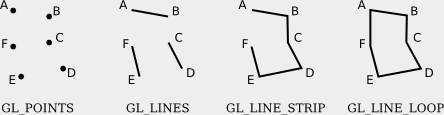
    - The width for line primitives can be set by calling glLineWidth(width). 
        - The line width is always specified in pixels. It is **not** subject to scaling by transformations.
 - There are three of triangle primitives: **GL_TRIANGLES**, **GL_TRIANGLE_STRIP**, and **GL_TRIANGLE_FAN**.
    - 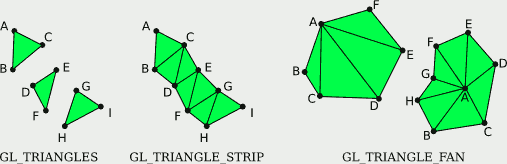
 - The three remaining primitives, which have been removed from modern OpenGL, are **GL_QUADS**, **GL_QUAD_STRIP**, and **GL_POLYGON**. 
 

<h2 id="8fa8cf348cbe10894e95cdbd18d67569"></h2>


### 3.1.2  OpenGL Color

 - `glColor*`
 - You can add a fourth component to the color by using *glColor4f()*. 
    - The fourth component, known as alpha, is not used in the default drawing mode, 
    - You need two commands to turn on transparency:

```
glEnable(GL_BLEND);   // enables use of the alpha component. 
glBlendFunc(GL_SRC_ALPHA, GL_ONE_MINUS_SRC_ALPHA);
```

 - Here are some examples of commands for setting drawing colors in OpenGL:

```
glColor3f(0,0,0);         // Draw in black.

glColor3f(1,1,1);         // Draw in white.

glColor3f(1,0,0);         // Draw in full-intensity red.

glColor3ub(1,0,0);        // Draw in a color just a tiny bit different from
                          // black.  (The suffix, "ub" or "f", is important!)

glColor3ub(255,0,0);      // Draw in full-intensity red.

glColor4f(1, 0, 0, 0.5);  // Draw in transparent red, but only if OpenGL
                          // has been configured to do transparency.  By
                          // default this is the same as drawing in plain red.
```

 - Using any of these functions sets the value of a "current color," which is part of the OpenGL state. 
    - When you generate a vertex with one of the `glVertex*` functions, the current color is saved along with the vertex coordinates, as an *attribute* of the vertex. 
    - Colors are associated with individual vertices, not with complete shapes. 
    - By changing the current color between calls to glBegin() and glEnd(), you can get a shape in which different vertices have different color attributes. 

```c
glBegin(GL_TRIANGLES);
glColor3f( 1, 0, 0 ); // red
glVertex2f( -0.8, -0.8 );
glColor3f( 0, 1, 0 ); // green
glVertex2f( 0.8, -0.8 );
glColor3f( 0, 0, 1 ); // blue
glVertex2f( 0, 0.9 );
glEnd();
```

 - Note that when drawing a primitive, you do not need to explicitly set a color for each vertex, as was done here. If you want a shape that is all one color, you just have to set the current color once, before drawing the shape (or just after the call to glBegin(). 

```c
glColor3ub(255,255,0);  // yellow
glBegin(GL_TRIANGLES);
glVertex2f( -0.5, -0.5 );
glVertex2f( 0.5, -0.5 );
glVertex2f( 0, 0.5 );
glEnd();
```

---

 - A common operation is to clear the drawing area by filling it with some background color. 
    - It is be possible to do that by drawing a big colored rectangle, but OpenGL has a potentially more efficient way to do it. 
    - The function `glClearColor(r,g,b,a);`  sets up a color to be used for clearing the drawing area. 
        - This only sets the color; the color isn't used until you actually give the command to clear the drawing area.
        - The default clear color is all zeros, that is, black with an alpha component also equal to zero. 
    - The command to do the actual clearing is: `glClear( GL_COLOR_BUFFER_BIT );`
        - The correct term for the *drawing area* is  **color buffer**.
        - OpenGL uses several buffers in addition to the color buffer. 
        - The glClear command can be used to clear several different buffers at the same time, which can be more efficient than clearing them separately since the clearing can be done in parallel. For example: 
        - `glClear( GL_COLOR_BUFFER_BIT | GL_DEPTH_BUFFER_BIT );`
        - This is the form of glClear that is generally used in 3D graphics, where the depth buffer plays an essential role.
        - For 2D graphics ,  the appropriate parameter for glClear is just GL_COLOR_BUFFER_BIT.

<h2 id="42956e9556040933ca9b1c558d1cc95f"></h2>


### 3.1.3  glColor and glVertex with Arrays

 - There are also versions that let you place all the data for the command in a single array parameter. 
    - The names for such versions end with "v". 
    - For example: `glColor3fv, glVertex2iv, glColor4ubv, and glVertex3dv`. 
    - The "v" actually stands for "vector," meaning essentially a one-dimensional array of numbers. 
    - For example, in the function call `glVertex3fv(coords)`, coords would be an array containing at least three floating point numbers.
 - The existence of array parameters in OpenGL forces some differences between OpenGL implementations in different programming languages. 

```c
// c , draw a rectangle
float coords[] = { -0.5, -0.5,  0.5, -0.5,  0.5, 0.5,  -0.5, 0.5 };

glBegin(GL_TRIANGLE_FAN);
glVertex2fv(coords);      // Uses coords[0] and coords[1].
glVertex2fv(coords + 2);  // Uses coords[2] and coords[3].
glVertex2fv(coords + 4);  // Uses coords[4] and coords[5].
glVertex2fv(coords + 6);  // Uses coords[6] and coords[7].
glEnd();
```

```java
// java, draw a rectangle
float[] coords = { -0.5F, -0.5F,  0.5F, -0.5F,  0.5F, 0.5F,  -0.5F, 0.5F };

gl2.glBegin(GL2.GL_TRIANGLES);
gl2.glVertex2fv(coords, 0);  // Uses coords[0] and coords[1].
gl2.glVertex2fv(coords, 2);  // Uses coords[2] and coords[3].
gl2.glVertex2fv(coords, 4);  // Uses coords[4] and coords[5].
gl2.glVertex2fv(coords, 6);  // Uses coords[6] and coords[7].
gl2.glEnd();
```

<h2 id="c3964789c01c1a0f9f0ea7da77d5ceae"></h2>


### 3.1.4  The Depth Test

 - The depth test solves the hidden surface problem no matter what order the objects are drawn in, so you can draw them in any order you want!
    - The term "depth" here has to do with the distance from the viewer to the object. 
    - Objects at greater depth are farther from the viewer. An object with smaller depth will hide an object with greater depth. 
    - To implement the depth test algorithm, OpenGL stores a depth value for each pixel in the image. The extra memory that is used to store these depth values makes up the **depth buffer** .
    - During the drawing process, the depth buffer is used to keep track of what is currently visible at each pixel. 
    - By default, the depth test is not turned on, which can lead to very bad results when drawing in 3D. 
        - You can enable the depth test by calling `glEnable( GL_DEPTH_TEST );`
    - If you forget to enable the depth test when drawing in 3D, the image that you get will likely be confusing and will make no sense physically. You can also get quite a mess if you forget to clear the depth buffer.
 - Question: what happens when part of your geometry extends outside the visible range of z-values ?

 - Here are are a few details about the implementation of the depth test: 
    - For each pixel, the depth buffer stores a representation of the distance from the viewer to the point that is currently visible at that pixel.
    - This value is essentially the z-coordinate of the point, after any transformations have been applied.
        - (In fact, the depth buffer is often called the "z-buffer".) 
    - The range of possible z-coordinates is scaled to the range 0 to 1. 
    - *The fact that there is only a limited range of depth buffer values* means that OpenGL can only display objects in a limited range of distances from the viewer. 
    - A depth value of 0 corresponds to the minimal distance; a depth value of 1 corresponds to the maximal distance.
    - When you clear the depth buffer, every depth value is set to 1, which can be thought of as representing the background of the image.
 - You get to choose the range of z-values that is visible in the image, by the transformations that you apply. 
    - The default range, in the absence of any transformations, is -1 to 1.  
    - Points with z-values outside the range are not visible in the image. 
    - It is a common problem to use too small a range of z-values, so that objects are missing from the scene, or have their fronts or backs cut off, because they lie outside of the visible range. 
    -  You might be tempted to use a huge range, to make sure that the objects that you want to include in the image are included within the range. However, that's not a good idea: 
        - The depth buffer has a limited number of bits per pixel and therefore a limited amount of accuracy. 
    - The larger the range of values that it must represent, the harder it is to distinguish between objects that are almost at the same depth. (Think about what would happen if all objects in your scene have depth values between 0.499999 and 0.500001—the depth buffer might see them all as being at exactly the same depth!)
        - 放大range, 可能会帮助你对付一些特殊情况，却会使大部分情况下的点的深度无法分辨
 - There is another issue with the depth buffer algorithm. 
    - It can give some strange results when two objects have exactly the same depth value. 
    - Logically, it's not even clear which object should be visible, but the real problem with the depth test is that it might show one object at some points and the second object at some other points. 
    - This is possible because numerical calculations are not perfectly accurate. Here an actual example:
    - 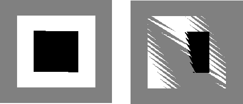
    - In the two pictures shown here, a gray square was drawn, followed by a white square, followed by a black square. 
        - The squares all lie in the same plane. A very small rotation was applied, to force the computer do some calculations before drawing the objects. 
        - The picture on the left was drawn with the depth test disabled, so that, for example, when a pixel of the white square was drawn, the computer didn't try to figure out whether it lies in front of or behind the gray square; it simply colored the pixel white. On the right, the depth test was enabled, and you can see the strange result.

 - Finally, by the way, note that the discussion here assumes that there are no transparent objects. 
    - Unfortunately, the depth test does not handle transparency correctly, since transparency means that two or more objects can contribute to the color of the pixel, but the depth test assumes that the pixel color is the color of the object nearest to the viewer at that point. 
    - To handle 3D transparency correctly in OpenGL, you pretty much have to resort to implementing the painter's algorithm by hand, at least for the transparent objects in the scene.

---

<h2 id="5975c2bc961ef61cf4840b9dbc325f46"></h2>


## 3.2 3D Coordinates and Transforms

<h2 id="8af4638ee01c1e09f9c685365c276bfc"></h2>


### 3.2.1  3D Coordinates

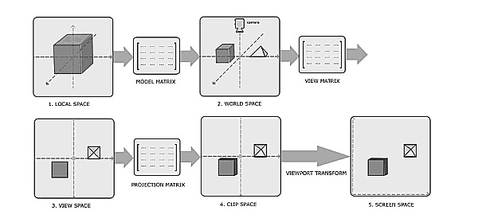

- local space, aka object space
    - view space, aka eye space
    - screen space, aka windows space


- OpenGL programmers usually think in terms of a coordinate system is right-handed (z-axis pointing out of the screen towards the viewer)
    - The default internal coordinate system in OpenGL, *the one that you are using if you apply no transformations at all,* , is left-handed (z-axis pointing into the screen, (which is hardly ever used) .
        - The glDepthRange is by default [0, 1] (near, far) making the +z axis point into the screen and with +x to the right and +y up it is a left-handed system.
        - Changing the depth range to [1, 0] will make the system right-handed.
    - This is not a contradiction: 
        - The coordinate system that is actually used is arbitrary.  It is set up by a transformation. 
        - The convention in OpenGL is to work with a right-handed coordinate system. The transformation into default coordinates reverses the direction of the z-axis.

- Right-handed coordinate system is the natural coordinate system from the viewer's point of view, the so-called "eye" or "viewing" coordinate system. 

- OpenGL is right handed in object(local) space and world space.  But in window space (aka screen space) we are suddenly left handed.
    - **How did this happen?**
    - The way we get from right-handed to left-handed is *a negative z scaling entry in the `glOrtho` or `glFrustum` projection matrices* .


<h2 id="0890c9c579e155c44153869f09be0222"></h2>


### 3.2.2  Basic 3D Transforms

 - `glTranslate*( dx, dy, dz );`
 - `glScale*( sx, sy, sz );`
 - `glRotate*(r,ax,ay,az)`.
 - where `*` can be *f*, or *d*.
 - Rotation in 3D is harder.
    - In 3D, rotation is rotation about a line, which is called the axis of rotation.  (For a math view, the axis of rotation is an eigen vector of the roation matrix).
    - In OpenGL: An axis of rotation is specified by three numbers, (ax,ay,az), which are **not all zero**. The axis is the line through (0,0,0) and (ax,ay,az). 
    - We still have to account for the difference between positive and negative angles. 
        - We can't just say clockwise or counterclockwise. 
        - To define the direction of rotation in 3D, we use the **right-hand rule**, Point the thumb of your right hand in the direction of the axis of rotateion.
        - I should emphasize that the right-hand rule only works if you are working in a right-handed coordinate system. 
            - If you have switched to a left-handed coordinate system, then you need to use a left-hand rule to determine the positive direction of rotation. 
 - OpenGL does not have 2D transform functions, but you can just use the 3D versions with appropriate parameters:
    - `glTranslatef(dx, dy, 0)`
    - `glScalef(sx, sy, 1)`
    - For rotation through an angle r about the origin in 2D, use `glRotatef(r, 0, 0, 1)`. 

<h2 id="4420bf2fbaf2c8d3729a0c749d26fa16"></h2>


### 3.2.3  Hierarchical Modeling

 - In OpenGL, the functions for operating on the stack are named glPushMatrix() and glPopMatrix().
 - OpenGL keeps track of a current matrix, which is the composition of all transforms that have been applied. 
    - Calling a function such as *glScalef* simply modifies the current matrix.
    - When an object is drawn, using the `glVertex*` functions, the coordinates that are specified for the object are transformed by the **current** matrix.
 - There is another function that affects the current matrix: *glLoadIdentity()*.
    - It will set the current matrix to be the identity transform.
 - As an example, suppose that we want to draw a cube. It's not hard to draw each face using glBegin/glEnd.

```c
void square( float r, float g, float b ) {
    glColor3f(r,g,b);
    glBegin(GL_TRIANGLE_FAN);
    glVertex3f(-0.5, -0.5, 0.5);
    glVertex3f(0.5, -0.5, 0.5);
    glVertex3f(0.5, 0.5, 0.5);
    glVertex3f(-0.5, 0.5, 0.5);
    glEnd();
}
```


 - 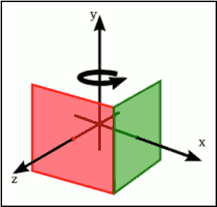
 - To make a red front face for the cube, we just need to call square(1,0,0).    
    - and we can draw a green right face for the cube with:

```c
glPushMatrix();
glRotatef(90, 0, 1, 0);
square(0, 1, 0);
glPopMatrix();
```

<h2 id="46c52ffa486761351207cd8f88831f9a"></h2>


## 3.3 Projection and Viewing

 - In the previous section, we looked at the modeling transformation, which transforms from object coordinates to world coordinates.
 - However, when working with OpenGL 1.1, you need to know about several other coordinate systems and the transforms between them. 

<h2 id="a8042d52694c52f0c6bff88f6f019219"></h2>


### 3.3.1  Many Coordinate Systems

 - The coordinates that you actually use for drawing an object are called *object coordinates*.
    - The object coordinate system is chosen to be convenient for the object that is being drawn. 
    - A modeling transformation can then be applied to set the size, orientation, and position of the object in the overall scene.
    - The modeling transformation is the first that is applied to the vertices of an object.
 - The coordinates in which you build the complete scene are called *world coordinates*. 
    - The modeling transformation maps *from object coordinates to world coordinates*.
 - In the real world, what you see depends on where you are standing and the direction in which you are looking. 
    - For the purposes of OpenGL, we imagine that the viewer is attached to their own individual coordinate system, which is known as *eye coordinates*. 
    - In this coordinate system, the viewer is at the origin, (0,0,0), looking in the direction of the **negative** z-axis, the positive direction of the y-axis is pointing straight up, and the x-axis is pointing to the right. This is a viewer-centric coordinate system.
    - In other words, eye coordinates are (almost) the coordinates that you actually want to use for drawing on the screen. 
    - The transform from world coordinates to eye coordinates is called the  *viewing transformation*.
    - Note, by the way, that OpenGL doesn't keep track of separate modeling and viewing transforms. 
        - They are combined into a single transform, which is known as the **modelview transformation**.
        - In fact, OpenGL doesn't have any representation for world coordinates , only object and eye coordinates have meaning. 
        - OpenGL goes directly from object coordinates to eye coordinates by applying the modelview transformation.
 - The viewer can't see the entire 3D world, only the part that fits into the *viewport* , which is the rectangular region of the screen or other display device where the image will be drawn.
    - We say that the scene is "clipped" by the edges of the viewport.
    - Furthermore, in OpenGL, the viewer can see only a limited range of z-values in the eye coordinate system. 
        - (This is not  the way that viewing works in the real world, but it's required by the use of the depth test in OpenGL.)
    - The volume of space that is actually rendered into the image is called the **view volume**.
    - For purposes of drawing, OpenGL applies a coordinate transform that maps the view volume onto a **cube**. 
        - The cube is centered at the origin and extends from -1 to 1 in the x-direction, in the y-direction, and in the z-direction. 
    - The coordinate system on this cube is referred to as *clip coordinates*. 
    - The transformation from eye coordinates to clip coordinates is called the *projection transformation*. 
    - At this point, we haven't quite projected the 3D scene onto a 2D surface, but we can now do so simply by discarding the z-coordinate. 
        -  (The z-coordinate, however, is still needed to provide the depth information that is needed for the depth test.)
 - In the end, when things are actually drawn, there are **device coordinates**, the 2D coordinate system in which the actual drawing takes place on a physical display device such as the computer screen. 
    - The drawing region is a rectangle of pixels. This is the rectangle that is called the *viewport*. 
    - The  *viewport transformation* takes x and y from the clip coordinates and scales them to fit the viewport.

 - Let's go through the sequence of transformations one more time. 
    - Think of a  primitive, such as a line or triangle, the primitive goes through the following sequence of operations:
    - 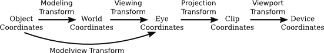
        1. The points that define the primitive are specified in object coordinates. ( glVertex3f )
        2. The points are first subjected to the modelview transformation, which is a combination of 
            - the modeling transform that places the primitive into the world 
            - and the viewing transform that maps the primitive into eye coordinates.
        3. The projection transformation is then applied to map the view volume.
            - If the transformed primitive lies outside that cube, it will not be part of the image, and the processing stops. 
            - If part of the primitive lies inside and part outside, only the part that remains is processed further.
        4. Finally, the viewport transform is applied to produce the device coordinates that will actually be used to draw the primitive on the display device.
            - After that, it's just a matter of deciding how to color the individual pixels that are part of the primitive.

<h2 id="bb1dfff0fea73b750d9e7fd08a6cfcc2"></h2>


### 3.3.2  The Viewport Transformation

 - The simplest of the transforms is the viewport transform.
    - It transforms x and y clip coordinates to the coordinates that are used on the display device. 
    - To specify the viewport transform, it is only necessary to specify the rectangle on the device where the scene will be rendered.
    - This is done using the *glViewport* function.
 - OpenGL must be provided with a drawing surface by the environment in which it is running, such as
    - JOGL for Java 
    - or the GLUT library for C. 
    - OpenGL uses a coordinate system on the drawing surface that puts (0,0) at the lower left. 
    - When the drawing surface is first given to OpenGL, the viewport is set to be the entire drawing surface. 
    - However, it is possible for OpenGL to draw to a different rectangle by calling

```c
// custom viewport
glViewport( x, y, width, height );
```

 - where (x,y) is the lower left corner of the viewport, in the drawing surface coordinate system, and width and height are the size of the viewport.
    - Clip coordinates from -1 to 1 will then be mapped to the specified viewport. 
 - When the size of the drawing surface changes, such as when the user resizes a window that contains the drawing surface, OpenGL does not automatically change the viewport to match the new size.
    - However, the environment in which OpenGL is running might do that for you. 
 - *glViewport* is often used to draw several different scenes, or several views of the same scene, on the same drawing surface. 
    

<h2 id="df5b10466accf17ff29913799be96672"></h2>


### 3.3.3  The Projection Transformation

 - OpenGL keeps track of the projection matrix separately from the matrix that represents the modelview transformation. 
    - The same transform functions, such as glRotatef, can be applied to both matrices, so OpenGL needs some way to know which matrix those functions apply to. 
 - This is determined by an OpenGL state property called the **matrix mode**. 
    - The value of the matrix mode is a constant such as GL_PROJECTION or GL_MODELVIEW. 
    - The value is set by calling the function *glMatrixMode*.
    - The initial value is GL_MODELVIEW. 
 - The view volume is determined by a combination of the viewing transformation and the projection transformation.
    - The viewing transform determines where the viewer is located and what direction the viewer is facing.
    - But it doesn't say how much of the world the viewer can see. The projection transform does that: It specifies the shape and extent of the region that is in view. 
 - Think of the viewer as a camera, with a big invisible box attached to the front of the camera.
    - The shape and size of the box correspond to the projection transform. 
    - The position and orientation of the camera correspond to the viewing transform.
 - Mathematically, the OpenGL projection transformation transforms eye coordinates to clip coordinates, mapping the view volume onto the 2x2x2 clipping cube that contains everything that will be visible in the image. 
    - To specify a projection just means specifying the size and shape of the view volume, relative to the viewer.
 - There are two general types of projection, perspective projection and orthographic projection. 
 - In a *perspective* view, the apparent size of an object depends on how far it is away from the viewer. 
    - Only things that are in front of the viewer can be seen.
    - Since the depth buffer can only store a finite range of depth values, only objects in a certain range of distances from the viewer can be part of the image. 
    - That range of distances is specified by two values, *near* and *far*. 
    - 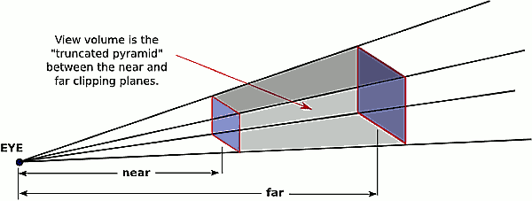
    - **The projection transformation maps the six sides of the truncated pyramid in eye coordinates to the six sides of the clipping cube in clip coordinates.**.
    - A perspective transformation can be set up with the glFrustum command:
        - `glFrustum( xmin, xmax, ymin, ymax, near, far );`
    - near and far specifies the distances from the viewer.
        - The viewer is assumed to be at the origin, (0,0,0), facing in the direction of the negative z-axis. (This is the eye coordinate system.) 
        - So, the near clipping plane is at z = −near, and the far clipping plane is at z = −far. (Notice the minus signs!)
    - The first four parameters specify the sides of the pyramid: 
        - xmin, xmax, ymin, and ymax specify the horizontal and vertical limits of the view volume **at the near clipping plane**. 
        - For example, the coordinates of the upper-left corner of the small end of the pyramid are (xmin, ymax, -near).
        - Note that x and y limits in glFrustum are usually symmetrical about zero.   
            - That is, xmin is usually equal to the negative of xmax. 
            - However, this is not required. It is possible to have asymmetrical view volumes where the z-axis does not point directly down the center of the view.
    - glFrustum is often used in a code segment of the form:
        - The call to glLoadIdentity ensures that the starting point is the identity transform.
        - This is important since glFrustum modifies the existing projection matrix rather than replacing it. 

```c
glMatrixMode(GL_PROJECTION);
glLoadIdentity();
glFrustum( xmin, xmax, ymin, ymax, near, far );
glMatrixMode(GL_MODELVIEW);
```

 - In an *orthographic* projection, the 3D world is projected onto a 2D image by discarding the z-coordinate of the eye-coordinate system.
    - This type of projection is unrealistic: in that it is not what a viewer would see. 
    - Nevertheless, for orthographic projection in OpenGL, there is considered to be a viewer. 
    - The viewer is located at the eye-coordinate origin, facing in the direction of the negative z-axis. 
    - Theoretically, a rectangular corridor extending infinitely in both directions, in front of the viewer and in back, would be in view. 
    - However, as with perspective projection, only a finite segment of this infinite corridor can actually be shown in an OpenGL image. 
    - This finite view volume is a parallelepiped. 
    - The value of far must be greater than near, but for an orthographic projection, the value of near is allowed to be negative, putting the "near" clipping plane behind the viewer.
    - 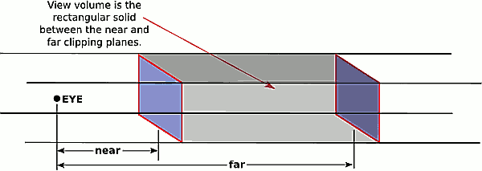
    - An orthographic projection can be set up in OpenGL using the glOrtho method, which is has the following form:
        - `glOrtho( xmin, xmax, ymin, ymax, near, far );`
    - As an example, suppose that we want the view volume to be the box centered at the origin containing x, y, and z values in the range from -10 to 10. 

```c
glMatrixMode(GL_PROJECTION);
glLoadIdentity();
glOrtho( -10, 10, -10, 10, -10, 10 );
glMatrixMode(GL_MODELVIEW);
```

--- 

 - The *glFrustum* method is not particularly easy to use.
    - There is a library known as GLU that contains some utility functions for use with OpenGL. 
    - The GLU library includes the method gluPerspective as an easier way to set up a perspective projection. 

```c
gluPerspective( fieldOfViewAngle, aspect, near, far );
```

 - It can be used instead of glFrustum. 
    - The fieldOfViewAngle is the **vertical** angle, measured in **degrees**, between the upper side of the view volume pyramid and the lower side. 
        - Typical values are in the range 30 to 60 degrees. 
    - The aspect parameter is the aspect ratio of the view, that is, width/height
    - The near and far parameters in gluPerspective have the same meaning as for glFrustum.


<h2 id="ba8673c03c50d25dca9dc436e3bfe4d6"></h2>


### 3.3.4  The Modelview Transformation

 - "Modeling" and "viewing" might seem like very different things, conceptually, but OpenGL combines them into a single transformation. 
    - This is because there is no way to distinguish between them in principle; the difference is purely conceptual. 
    - That is, a given transformation can be considered to be either a modeling transformation or a viewing transformation, depending on how you think about it.
    - (One significant difference, conceptually, is that the viewing transformation usually applies to an entire scene as a whole, while modeling transformations are applied to individual objects. But this is not a difference in principle.)
    - 对 object 做 transformation 很多时候和 对 viewer 做transformation 是等价的.
 - It can be difficult to set up a view by combining rotations, scalings, and translations, so OpenGL provides an easier way to set up a typical view.
    - The command is not part of OpenGL itself but is part of the GLU library.

```c
gluLookAt( eyeX,eyeY,eyeZ, refX,refY,refZ, upX,upY,upZ );
```

 - This method places the viewer at the point (eyeX,eyeY,eyeZ), looking towards the point (refX,refY,refZ).
    - The viewer is oriented so that the vector (upX,upY,upZ) points upwards in the viewer's view. 
    - or example, to position the viewer on the positive x-axis, 10 units from the origin, looking back at the origin, with the positive direction of the y-axis pointing up as usual, use: 
        - `gluLookAt( 10,0,0,  0,0,0,  0,1,0 );`
 - With all this, we can give an outline for a typical display routine for drawing an image of a 3D scene with OpenGL 1.1:


```c
// possibly set clear color here, if not set elsewhere

glClear( GL_COLOR_BUFFER_BIT | GL_DEPTH_BUFFER_BIT );

// possibly set up the projection here, if not done elsewhere

glMatrixMode( GL_MODELVIEW );
glLoadIdentity();
gluLookAt( eyeX,eyeY,eyeZ, refX,refY,refZ, upX,upY,upZ );  // Viewing transform

glPushMatrix();
  .
  .   // apply modeling transform and draw an object
  .
glPopMatrix();

glPushMatrix();
  .
  .   // apply another modeling transform and draw another object
  .
glPopMatrix();
  .
  .
  .
```


<h2 id="1fc3e9e3dd17e17d60dc489e75b8606b"></h2>


### 3.3.5  A Camera Abstraction

 - Projection and viewing are often discussed using the analogy of a camera.
 - TODO

<h2 id="7815beca17bdc6ba3d2cb928032b8719"></h2>


### 3.3.6 笔记

 - viewport transform : glViewport 
 - projection transform :  glFrustum , gluPerspective  
 - view transform :  gluLookAt 


<h2 id="468ebc8b8f7030d296eb83b3a5afe3e9"></h2>


## 3.4 Polygonal Meshes and glDrawArrays

 - Now, our problem is to represent a set of polygons—most often a set of triangles. 

<h2 id="f43fcc7f1d64d133c6e5594e21c9757f"></h2>


### 3.4.1  Indexed Face Sets

 - The polygons in a polygonal mesh are also referred to as "faces", and one of the primary means for representing a polygonal mesh is as an **indexed face set**, or IFS.
 - The data for an IFS includes a list of all the vertices that appear in the mesh, giving the coordinates of each vertex. 
    - A vertex can then be identified by an integer that specifies its *index* in the list.
    - As an example, consider this "house," a polyhedron with 10 vertices and 9 faces:
        - 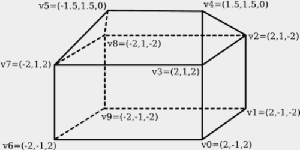
    - The vertex list for this polyhedron has the form
        - 
        ```
        Vertex #0.  (2, -1, 2)
        Vertex #1.  (2, -1, -2)
        Vertex #2.  (2, 1, -2)
        Vertex #3.  (2, 1, 2)
        Vertex #4.  (1.5, 1.5, 0)
        Vertex #5.  (-1.5, 1.5, 0)
        Vertex #6.  (-2, -1, 2)
        Vertex #7.  (-2, 1, 2)
        Vertex #8.  (-2, 1, -2)
        Vertex #9.  (-2, -1, -2)
        ```
    - The order of the vertices is completely arbitrary. The purpose is simply to allow each vertex to be identified by an integer.
 - To describe one of the polygonal faces of a mesh, we just have to list its vertices, in order going around the polygon. 
    - For an IFS, we can specify a vertex by giving its index in the list. 
    - For example, we can say that one of the triangular faces of the pyramid is the polygon formed by vertex #3, vertex #2, and vertex #4. 
    - So, we can complete our data for the mesh by giving a list of vertex indices for each face. 
    - Here is the face data for the house. 
        -
        ```
        Face #0:  (0, 1, 2, 3)
        Face #1:  (3, 2, 4)
        Face #2:  (7, 3, 4, 5)
        Face #3:  (2, 8, 5, 4)
        Face #4:  (5, 8, 7)
        Face #5:  (0, 3, 7, 6)
        Face #6:  (0, 6, 9, 1)
        Face #7:  (2, 1, 9, 8)
        Face #8:  (6, 7, 8, 9)
        ```
    - Again, the order in which the faces are listed in arbitrary. 
    - There is also some freedom in how the vertices for a face are listed. 
        - You can start with any vertex. 
    - Once you've picked a starting vertex, there are two possible orderings.
        - For example, starting with vertex 0, the first face in the list could be specified either as (0,1,2,3) or as (0,3,2,1). 
        - However, the first possibility is the right one in this case.
 - A polygon in 3D can be viewed from either side; we can think of it as having two faces, facing in opposite directions.
    - the "front face" of the polygon and the "back face." 
    - The usual rule is that the vertices of a polygon should be listed in **counter-clockwise** order when looking at the front face of the polygon. 
    - When looking at the back face, the vertices will be listed in clockwise order. 
    - This is the default rule used by OpenGL.
    - 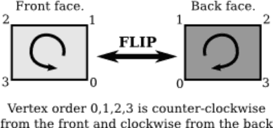
 - The vertex and face data for an indexed face set can be represented as a pair of two-dimensional arrays.

```java
double[][] vertexList =
         {  {2,-1,2}, {2,-1,-2}, {2,1,-2}, {2,1,2}, {1.5,1.5,0},
               {-1.5,1.5,0}, {-2,-1,2}, {-2,1,2}, {-2,1,-2}, {-2,-1,-2}  };
         
int[][] faceList =
         {  {0,1,2,3}, {3,2,4}, {7,3,4,5}, {2,8,5,4}, {5,8,7},
               {0,3,7,6}, {0,6,9,1}, {2,1,9,8}, {6,7,8,9}  };
```

 - In most cases, there will be additional data for the IFS. 
    - For example, if we want to color the faces of the polyhedron, with a different color for each face, then we could add another array, faceColors, to hold the color data. 

```java
// java JOGL
for (int i = 0; i < faceList.length; i++) {
    gl2.glColor3dv( faceColors[i], 0 );  // Set color for face number i.
    gl2.glBegin(GL2.GL_TRIANGLE_FAN);
    for (int j = 0; j < faceList[i].length; j++) {
        int vertexNum = faceList[i][j];  // Index for vertex j of face i.
        double[] vertexCoords = vertexList[vertexNum];  // The vertex itself.
        gl2.glVertex3dv( vertexCoords, 0 );
    }
    gl2.glEnd();
}
```

 - Indexed face sets have another advantage. Suppose that we want to modify the shape of the polygon mesh by moving its vertices...
 - There are other ways to store the data for an IFS. 
    - In C, for example, where two-dimensional arrays are more problematic, we might use one dimensional arrays for the data.

```c
int vertexCount = 10;  // Number of vertices.
double vertexData[] =
          {  2,-1,2, 2,-1,-2, 2,1,-2, 2,1,2, 1.5,1.5,0,
                 -1.5,1.5,0, -2,-1,2, -2,1,2, -2,1,-2, -2,-1,-2  };

int faceCount = 9;  // Number of faces.
int[][] faceData =
          {  0,1,2,3,-1, 3,2,4,-1, 7,3,4,5,-1, 2,8,5,4,-1, 5,8,7,-1,
               0,3,7,6,-1, 0,6,9,1,-1, 2,1,9,8,-1, 6,7,8,9,-1  };
```

 - We can use the following C code to draw the house:

```c
int i,j;
j = 0; // index into the faceData array
for (i = 0; i < faceCount; i++) {
    glColor3dv( &faceColors[ i*3 ] );  // Color for face number i.
    glBegin(GL_TRIANGLE_FAN);
    while ( faceData[j] != -1) { // Generate vertices for face number i.
        int vertexNum = faceData[j]; // Vertex number in vertexData array.
        glVertex3dv( &vertexData[ vertexNum*3 ] );
        j++;
    }
    j++;  // increment j past the -1 that ended the data for this face.
    glEnd();
}
```
 
---

 - We could easily draw the **edges** of the polyhedron instead of the faces simply by using GL_LINE_LOOP instead of GL_TRIANGLE_FAN in the drawing code.
    - An interesting issue comes up if we want to draw both the faces and the edges. 
    - 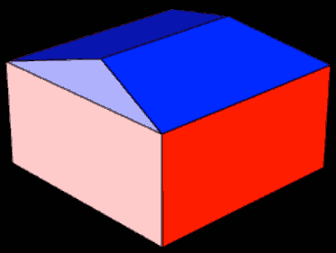
    - This can be a nice effect, but we run into a problem with the depth test: Pixels along the edges lie at the same depth as pixels on the faces. 
        - the depth test cannot handle this situation well. 
    - However, OpenGL has a solution: a feature called "polygon offset." 
    - This feature can adjust the depth, in clip coordinates, of a polygon, in order to avoid having two objects exactly at the same depth. 
    - To apply polygon offset, you need to set the amount of offset by calling 
        - `glPolygonOffset(1,1);`
    - The second parameter gives the amount of offset, in units determined by the first parameter. 
    - The meaning of the first parameter is somewhat obscure;
        - a value of 1 seems to work in all cases.
    - You also have to enable the GL_POLYGON_OFFSET_FILL feature while drawing the faces.

```c
glPolygonOffset(1,1);
glEnable( GL_POLYGON_OFFSET_FILL );
   .
   .   // Draw the faces.
   .
glDisable( GL_POLYGON_OFFSET_FILL );
   .
   .   // Draw the edges.
   .
```

<h2 id="5869e262d8529c4c438e54c49a5043c2"></h2>


### 3.4.2  glDrawArrays and glDrawElements

 - All of the OpenGL commands that we have seen so far were part of the original OpenGL 1.0.
    - One complaint about the original OpenGL was the large number of function calls such as glVertex2d and glColor3fv with glBegin/glEnd. 
 - OpenGL 1.1 added some features to increase performance.  OpenGL 1.1 introduced the functions glDrawArrays and glDrawElements. 
 - When using glDrawArrays, all of the data needed to draw a primitive, including vertex coordinates, colors, and other vertex  attributes, can be packed into arrays.
    - Once that is done, the primitive can be drawn with a single call to glDrawArrays.
 - To use glDrawArrays, you must store all of the vertex coordinates for a primitive in a single one-dimensional array.
    - You can use an array of int, float, or double, and you can have 2, 3, or 4 coordinates for each vertex. 
    - You need to tell OpenGL where to find the data by calling
        - `void glVertexPointer(int size, int type, int stride, void* array)` 
    - size:  the number of coordinates per vertex
    - type: GL_FLOAT, GL_INT, and GL_DOUBLE. 
    - stride: usually 0, meaning that the data values are stored consecutively; 
        - if that is not the case, then stride gives the distance **in bytes** between the location of the data for one vertex and location for the next vertex. 
    - (描述数据的存取方式)
 - For example, suppose that we want to draw a square in the xy-plane. 

```c
float coords[8] = { -0.5,-0.5, 0.5,-0.5, 0.5,0.5, -0.5,0.5 };
glVertexPointer( 2, GL_FLOAT, 0, coords );
```

 - In addition to setting the location of the vertex coordinates, you have to enable use of the array by calling

```c
glEnableClientState(GL_VERTEX_ARRAY);
```

 - Finally, in order to actually draw the primitive, you would call the function

```c
void glDrawArrays( int primitiveType, int firstVertex, int vertexCount)
```

 - This function call corresponds to one use of glBegin/glEnd. 
    - The primitiveType tells which primitive type is being drawn
    - firstVertex is the number of the first vertex that is to used for drawing the primitive (corresponding array index). 
    - vertexCount is the number of vertices to be used, just as if `glVertex*` were called vertexCount times.
    - (描述 draw 所需要的数据数量 )
    - Often, firstVertex will be zero, and vertexCount will be the total number of vertices in the array. 
    - `glDrawArrays( GL_TRIANGLE_FAN, 0, 4 );`
 - Often there is other data associated with each vertex in addition to the vertex coordinates. 
    - For example, you might want to specify a different color for each vertex.

```c
glEnableClientState(GL_COLOR_ARRAY);

void glColorPointer(int size, int type, int stride, void* array)
```

 - Let's put this together to draw the standard OpenGL red/green/blue triangle:

```c
float coords[6] = { -0.9,-0.9,  0.9,-0.9,  0,0.7 }; // two coords per vertex.
float colors[9] = { 1,0,0,  0,1,0,  1,0,0 };  // three RGB values per vertex.

glVertexPointer( 2, GL_FLOAT, 0, coords );  // Set data type and location.
glColorPointer( 3, GL_FLOAT, 0, colors );

glEnableClientState( GL_VERTEX_ARRAY );  // Enable use of arrays.
glEnableClientState( GL_COLOR_ARRAY );

glDrawArrays( GL_TRIANGLES, 0, 3 ); // Use 3 vertices, starting with vertex 0.
```

---

 - The function glDrawElements is similar to glDrawArrays, but it is designed for use with data in a format similar to an indexed face set. 
    - With glDrawArrays, OpenGL pulls data from the enabled arrays in order, vertex 0, then vertex 1, then vertex 2, and so on. 
    - With glDrawElements, you provide a list of vertex numbers. OpenGL will go through the list of vertex numbers, pulling data for the specified vertices from the arrays. 
 - The advantage of this comes, as with indexed face sets, from the fact that the same vertex can be reused several times.
 - To use glDrawElements to draw a primitive, you need an array to store the vertex numbers. 
    - The numbers in the array can be 8, 16, or 32 bit integers.
    - You also need arrays to store the vertex coordinates and other vertex data, and you must enable those arrays in the same way as for glDrawArrays, using functions such as glVertexArray and glEnableClientState.

```c
void glDrawElements( int primitiveType, vertexCount, dataType, void *array)
```

 - vertexCount is the number of vertices to be drawn, dataType specifies the type of data in the array (in GL_UNSIGNED_BYTE, GL_UNSIGNED_SHORT, or GL_UNSIGNED_INT ), and array is the array that holds the list of vertex numbers. 
 - As an example, we can draw a cube. 

```c
float vertexCoords[24] = {  // Coordinates for the vertices of a cube.
           1,1,1,   1,1,-1,   1,-1,-1,   1,-1,1,
          -1,1,1,  -1,1,-1,  -1,-1,-1,  -1,-1,1  };

float vertexColors[24] = {  // An RGB color value for each vertex
           1,1,1,   1,0,0,   1,1,0,   0,1,0,
           0,0,1,   1,0,1,   0,0,0,   0,1,1  };

int elementArray[24] = {  // Vertex numbers for the six faces.
          0,1,2,3, 0,3,7,4, 0,4,5,1,
          6,2,1,5, 6,5,4,7, 6,7,3,2  };

glVertexPointer( 3, GL_FLOAT, 0, vertexCoords );
glColorPointer( 3, GL_FLOAT, 0, vertexColors );

glEnableClientState( GL_VERTEX_ARRAY );
glEnableClientState( GL_COLOR_ARRAY );

glDrawElements( GL_QUADS, 24, GL_UNSIGNED_INT, elementArray );
```

<h2 id="df7256da675c160c19a7725685d90320"></h2>


### 3.4.3  Data Buffers in Java

 - Ordinary Java arrays are not suitable for use with glDrawElements and glDrawArrays, partly because of the format in which data is stored in them and partly because of inefficiency in transfer of data between Java arrays and the GPU.
    - These problems are solved by using **direct nio buffers**. 
    - The term "nio" here refers to the package java.nio, which contains classes for input/output. 
    - A "buffer" in this case is an object of the class java.nio.Buffer or one of its subclasses, such as FloatBuffer or IntBuffer. 
    - Finally, "direct" means that the buffer is optimized for direct transfer of data between memory and other devices such as the GPU. 
    - Like an array, an nio buffer is a numbered sequence of elements, all of the same type.
 - For example, JOGL has the following glVertexPointer method in the GL2 class:
    - Only the last parameter differs from the C version. 


```java
public void glVertexPointer(int size, int type, int stride, Buffer buffer)
```

 - The class com.jogamp.common.nio.Buffers contains static utility methods for working with direct nio buffers. 
    - The easiest to use are methods that create a buffer from a Java array. 

```java
float[] vertexCoords = {  // Coordinates for the vertices of a cube.
            1,1,1,   1,1,-1,   1,-1,-1,   1,-1,1,
            -1,1,1,  -1,1,-1,  -1,-1,-1,  -1,-1,1  };
            
int[] elementArray = {  // Vertex numbers for the six faces.
            0,1,2,3, 0,3,7,4, 0,4,5,1,
            6,2,1,5, 6,5,4,7, 6,7,3,2  };

// Buffers for use with glVertexPointer and glDrawElements:            
FloatBuffer vertexCoordBuffer = Buffers.newDirectFloatBuffer(vertexCoords);
IntBuffer elementBuffer = Buffers.newDirectIntBuffer(elementArray);

gl2.glVertexPointer( 3, GL2.GL_FLOAT, 0, vertexCoordBuffer );
gl2.glDrawElements( GL2.GL_QUADS, 24, GL2.GL_UNSIGNED_INT, elementBuffer );
```


<h2 id="5c4ae378eebbbd5ee7a2881615bd486a"></h2>


### 3.4.4  Display Lists and VBOs

 - All of the OpenGL drawing commands that we have considered so far have an unfortunate inefficiency when the same object is going be drawn more than once: 
    - The commands and data for drawing that object must be transmitted to the GPU each time the object is drawn.
 - It should be possible to store information on the GPU, so that it can be reused without retransmitting it.  We will look at two techniques for doing this: **display lists** and  **vertex buffer objects (VBOs)**. 
    - Display lists were part of the original OpenGL 1.0, but they are not part of the modern OpenGL API. 
    - VBOs were introduced in OpenGL 1.5 and are still important in modern OpenGL.
    - we will discuss them only briefly here and will consider them more fully when we get to WebGL.
 - Display lists are useful when the same sequence of OpenGL commands will be used several times. 
    - A display list is a list of graphics commands and the data used by those commands. 
    - A display list can be stored in a GPU. 
    - The contents of the display list only have to be transmitted once to the GPU. Once a list has been created, it can be "called."  
    - The key point is that calling a list requires only one OpenGL command. 
    - Note that calling a display list twice can result in two different effects, since the effect can depend on the OpenGL state at the time the display list is called. 
    - If you want to use a display list, you first have to ask for an integer that will identify that list to the GPU. 
        - `listID = glGenLists(1);`
        - The return value is an *int* which will be the identifier for the list. 
        - The parameter to glGenLists is also an *int*, which is usually 1. 
            - You can actually ask for several list IDs at once; the parameter tells how many you want. 
            - The list IDs will be consecutive integers, so that if listA is the return value from glGenLists(3), then the identifiers for the three lists will be listA, listA + 1, and listA + 2.)
    - Once you've allocated a list in this way, you can store commands into it. 
        - 
        ```
        glNewList(listID, GL_COMPILE);
           ...  // OpenGL commands to be stored in the list.
        glEndList();
        ```
    - The parameter GL_COMPILE means that you only want to store commands into the list, not execute them. 
        - If you use the alternative parameter GL_COMPILE_AND_EXECUTE, then the commands will be executed immediately as well as stored in the list for later reuse.
    - Once you have created a display list in this way, you can call the list with the command
        - `glCallList(listID);`
    - You can tell the graphics card that a list is no longer needed by calling 
        - `gl.glDeleteLists(listID, 1);`
        - The second parameter in this method call plays the same role as the parameter in glGenLists; that is, it allows you delete several sequentially numbered lists. 

---

 - Vertex buffer objects take a different approach to reusing information. 
    - They only store data, not commands.
    - A VBO is similar to an array. In fact, it is essentially an array that can be stored on the GPU for efficiency of reuse. 
    - There are OpenGL commands to create and delete VBOs and to transfer data from an array on the CPU side into a VBO on the GPU. 
    - You can configure glDrawArrays() and glDrawElements() to take the data from a VBO instead of from an ordinary array (in C) or from an nio Buffer (in JOGL). 
    - This means that you can send the data once to the GPU and use it any number of times.
    - I will not discuss how to use VBOs here, since it was not a part of OpenGL 1.1. 


<h2 id="bce3f3035dda5f8e228be992180b0763"></h2>


## 3.5 Some Linear Algebra

<h2 id="bddd30ae2afa887d75b9ee8272bc0fda"></h2>


### 3.5.2  Matrices and Transformations

 - Rotation and scaling are **linear** transformations, but translation is not a **linear** transformaton. 
    - To include translations, we have to widen our view of transformation to include *affine transformations*. 
 - An *affine transformation* can be defined, roughly, as a linear transformation followed by a translation. 
    - Geometrically, an affine transformation is a transformation that preserves parallel lines; 
    - that is, if two lines are parallel, then their images under an affine transformation will also be parallel lines. 
 - Note first of all that an affine transformation in 3D transforms a vector (x1,y1,z1) into a vector (x2,y2,z2) given by formulas
    - 
    ```
    x2 = a1*x1 + a2*y1 + a3*z1 + t1
    y2 = b1*x1 + b2*y1 + b3*z1 + t2
    z2 = c1*x1 + c2*y1 + c3*z1 + t3
    ```
 - These formulas express a linear transformation given by multiplication by the 3-by-3 matrix,
    - followed by translation by t1 in the x direction, t2 in the y direction and t3 in the z direction. 
 - The trick is to replace each 3D  vector (x,y,z) with the four-dimensional vector (x,y,z,1), adding a "1" as the fourth coordinate. 
 - And instead of the 3-by-3 matrix, we use the 4-by-4 matrix
    - 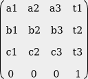
 - If the vector (x1,y1,z1,1) is multiplied by this 4-by-4 matrix, the result is precisely the vector (x2,y2,z2,1).
    - That is, instead of applying an affine transformation to the 3D vector (x1,y1,z1), we can apply a linear transformation to the 4D vector (x1,y1,z1,1).
 - An affine transformation is represented as a 4-by-4 matrix in which the bottom row is (0,0,0,1), and a three-dimensional vector is changed into a four dimensional vector by adding a 1 as the final coordinate.
    - The result is that all the affine transformations that are so important in computer graphics can be implemented as multiplication of vectors by matrices.
 - 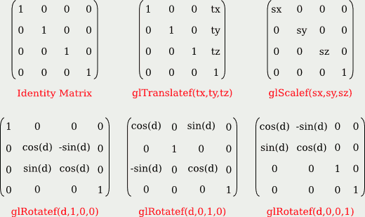
 - It is even possible to use an arbitrary transformation matrix in OpenGL, using the function glMultMatrixf(T) or glMultMatrixd(T). 
    - The parameter, T, is an array of numbers of type float or double, representing a transformation matrix. 
    - The array is a one-dimensional array of length 16. 
    - The items in the array are the numbers from the transformation matrix, stored in  **column-major order**, 
        - that is, the numbers in the fist column, followed by the numbers in the second column, and so on. 
    - These functions multiply the current matrix by the matrix T, on the right.  
    - You could use them, for example, to implement a shear transform, which is not easy to represent as a sequence of scales, rotations, and translations.


<h2 id="d1a87f1305aec980ce641a28e82a93b5"></h2>


### 3.5.3  Homogeneous Coordinates

 - There is one common transformation in computer graphics that is not an affine transformation: 
    - In the case of a perspective projection, the projection transformation is not affine.
    - In a perspective projection, an object will appear to get smaller as it moves farther away from the viewer, and that is a property that no affine transformation can express, since 
        - affine transforms preserve parallel lines and parallel lines will seem to converge in the distance in a perspective projection.
 - Surprisingly, we can still represent a perspective projection as a 4-by-4 matrix, provided(假如,前提是) we are willing to stretch our use of coordinates even further than we have already. 
    - We have already represented 3D vectors by 4D vectors in which the fourth coordinate is 1. 
    - We now allow the fourth coordinate to be anything at all. 
    - When the fourth coordinate, w, is non-zero, we consider the coordinates (x,y,z,w) to represent the three-dimensional vector (x/w,y/w,z/w). 
        - When the fourth coordinate is zero, there is no corresponding 3D vector, 
        - but it is possible to think of (x,y,z,0) as representing a 3D "point at infinity" in the direction of (x,y,z), as long as at least one of x, y, and z is non-zero.
 - Coordinates (x,y,z,w) used in this way are referred to as **homogeneous coordinates**. 
 - If we use homogeneous coordinates, then any 4-by-4 matrix can be used to transform three-dimensional vectors, including matrices whose bottom row is not (0,0,0,1). 
    - Among the transformations that can be represented in this way is the projection transformation for a perspective projection. 
    - And in fact, this is what OpenGL does internally. It represents all three-dimensional points and vectors using homogeneous coordinates, and it represents all transformations as 4-by-4 matrices.
        - You can even specify vertices using homogeneous coordinates. For example, the command  `glVertex4f(x,y,z,w);`  with a non-zero value for w, generates the 3D point (x/w,y/w,z/w). 
 - Fortunately, you will almost never have to deal with homogeneous coordinates directly. 
    - The only real exception to this is that homogeneous coordinates are used, surprisingly, when configuring OpenGL lighting.


<h2 id="3918af2a03c631f9ffdc3cfcb307c657"></h2>


## 3.6 Using GLUT and JOGL

 - For simple applications written in C or C++, one possible windowing API is GLUT (OpenGL Utility Toolkit). 
    - GLUT is a small API. It is used to create windows that serve as simple frames for OpenGL drawing surfaces. 
    - It has support for handling mouse and keyboard events, and it can do basic animation. 
    - It does not support controls such as buttons or input fields, but it does allow for a menu that pops up in response to a mouse action. 
 - You can find information about the GLUT API at https://www.opengl.org/resources/libraries/glut/
 - If possible, you should use FreeGLUT, which is compatible with GLUT but has a few extensions and a fully open source license.
    - http://freeglut.sourceforge.net/docs/api.php
 - JOGL (Java OpenGL) is a collection of classes that make it possible to use OpenGL in Java applications.
    - JOGL is integrated into Swing and AWT, the standard Java graphical user interface APIs. 
    - JOGL is not a standard part of Java. It's home web site is http://jogamp.org/jogl/www/


<h2 id="1fbcde3b7f6c98a4fb0a7592100836b5"></h2>


### 3.6.1  Using GLUT

 - To work with GLUT, you will need a C compiler and copies of the OpenGL and GLUT (or FreeGLUT) development libraries. 
 - You may compile it using a command such as 
    - `gcc -o glutprog glutprog.c -lGL -lglut`
 - If the program also uses the GLU library, compiling it would require the option "-lGLU", and if it uses the math library, it would need the option "-lm".
 - The GLUT library makes it easy to write basic OpenGL applications in C. 
    - GLUT uses event-handling functions. 
    - You write functions to handle events that occur when the display needs to be redrawn or when the user clicks the mouse or presses a key on the keyboard.
 - To use GLUT, you need to include the header file glut.h (or freeglut.h) , along with the general OpenGL header file, gl.h. 
    - The header files should be installed in a standard location, in a folder named GL. So, the program usually begins with

```c
#include <GL/gl.h>
#include <GL/glut.h>
// #include <GL/freeglut.h>
```

 - The program's main() function must contain some code to initialize GLUT, to create and open a window, and to set up event handling by registering the functions that should be called in response to various events. 
    - After this setup, it must call a function that runs the GLUT event-handling loop. 
 - To set up the event-handling functions, GLUT uses the fact that in C, it is possible to pass a function name as a parameter to another function.

```c
    glutDisplayFunc(display);
```


```c
void display() {
   .
   .  // OpenGL drawing code goes here!
   .
}
```

 - There are a lot of possible event-handling functions, and I will only cover some of them here. Let's jump right in and look at a possible main() routine for a GLUT program that uses most of the common event handlers:

```c
int main(int argc, char** argv) {
    glutInit(&argc, argv);  // Required initialization!
    glutInitDisplayMode(GLUT_DOUBLE | GLUT_DEPTH);
    glutInitWindowSize(500,500);        // size of display area, in pixels
    glutInitWindowPosition(100,100);    // location in screen coordinates
    glutCreateWindow("OpenGL Program"); // parameter is window title  

    glutDisplayFunc(display);       // called when window needs to be redrawn
    glutReshapeFunc(reshape);       // called when size of the window changes
    glutKeyboardFunc(keyFunc);      // called when user types a character
    glutSpecialFunc(specialKeyFunc);// called when user presses a special key
    glutMouseFunc(mouseFunc);       // called for mousedown and mouseup events
    glutMotionFunc(mouseDragFunc);  // called when mouse is dragged
    glutIdleFunc(idleFun);          // called when there are no other events

    glutMainLoop(); // Run the event loop!  This function never returns.
    return 0;  // (This line will never actually be reached.)
}
```
 
 - `glutInitDisplayMode(GLUT_DOUBLE | GLUT_DEPTH)` — Must be called to define some characteristics of the OpenGL drawing context. 
    - The parameter specifies features that you would like the OpenGL context to have.
    - GLUT_DEPTH says that a depth buffer should be created;  without it, the depth test won't work.
    - GLUT_DOUBLE asks for double buffering, which means that drawing is actually done off-screen, and the off-screen copy has to copied to the screen to be seen. 
        - The copying is done by glutSwapBuffers(), which must be called at the end of the display function. 
        - (You can use GLUT_SINGLE instead of GLUT_DOUBLE to get single buffering; in that case, you have to call glFlush() at the end of the display function instead of glutSwapBuffers(). )
 - `glutReshapeFunc(reshape)` — The reshape function is called when the user changes the size of the window. 
    - Its parameters tell the new width and height of the drawing area: `void reshape( int width, int height )`
    - For example, you might use this method to set up the projection transform, if the projection depends only on the window size. 
        - A reshape function is not required, but if one is provided, it should always set the OpenGL viewport, which is the part of the window that is used for drawing. Do this by calling `glViewport(0,0,width,height);` 
        - The viewport is set automatically if no reshape function is specified.
 - `glutKeyboardFunc(keyFunc)`
    - void keyFunc( unsigned char ch, int x, int y )
    - ch: key code
    - x,y : mouse position
 - Whenever you make any changes to the program's data that require the display to be redrawn, you should call *glutPostRedisplay()*.
    - This is similar to calling repaint() in Java. 
 - `glutMouseFunc(mouseFunc)`

```c
void mouseFunc(int button, int buttonState, int x, int y) {
   if (buttonState == GLUT_DOWN) {
        // handle mousePressed event
   }
   else { // buttonState is GLUT_UP
        // handle mouseReleased event
   }
}
```

 - GLUT also has a timer function, which schedules some function to be called once, after a specified delay. 
    - To set a timer, call 
        - `glutTimerFunc(delayInMilliseconds, timerFunction, userSelectedID)`
    - and define timerFunction as
        - `void timerFunction(int timerID) { ...`
    - If you want to use glutTimerFunc for animation, then timerFunction should end with another call to glutTimerFunc.
 - A GLUT window does not have a menu bar, but it is possible to add a hidden popup menu to the window. 
    - TODO

---

 - GLUT includes some functions for drawing basic 3D shapes such as spheres, cones, and regular polyhedra. 
    - It has two functions for each shape, a "solid" version that draws the shape as a solid object, and a wireframe version .
    - For example, the function
        - `void glutSolidSphere(double radius, int slices, int stacks)`
        - draws a solid sphere with the given radius, centered at the origin. 
        - the sphere is divided by lines of longitude, like the slices of an orange, and by lines of latitude, like a stack of disks. 
        - The parameters *slices* and *stacks* tell how many subdivisions to use. 
        -  Typical values are 32 and 16, but the number that you need to get a good approximation for a sphere depends on the size of the sphere on the screen. 
    - The function *glutWireframeSphere* has the same parameters but draws only the lines of latitude and longitude.
 - There are functions for the other regular polyhedra that have no parameters and draw the object at some fixed size: 
    - glutSolidTetrahedron(), glutSolidOctahedron(), glutSolidDodecahedron(), and glutSolidIcosahedron(). 
 - There is also glutSolidTeapot(size) that draws a famous object that is often used as an example.


<h2 id="5ce1e0a88afa1e1ebaf17f7946d196cc"></h2>


### 3.6.3  About glsim.js

 - The JavaScript library glsim.js was written to accompany and support this textbook. 
    - It implements the subset of OpenGL 1.1 that is discussed in Chapter 3 and Chapter 4, except for display lists (Subsection 3.4.4). 
    - Note that glsim is meant for experimentation and practice only, not for serious applications.
 - The OpenGL API that is implemented by glsim.js is essentially the same as the C API, although some of the details of semantics are different. 
 - To use glsim.js, you need to create an HTML document with a `<canvas>` element to serve as the drawing surface. 
    - and `<script src="glsim.js"></script>`
    - To create the OpenGL drawing context, use the JavaScript command 
        - `glsimUse(canvas);`

  


