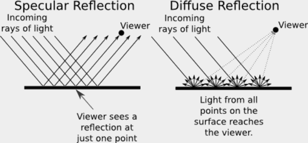
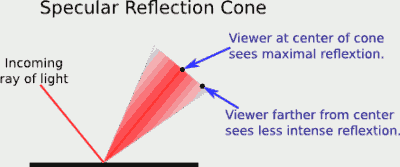
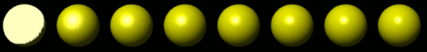
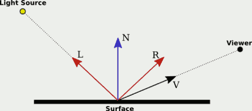
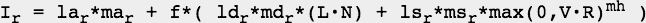
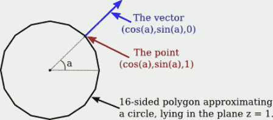
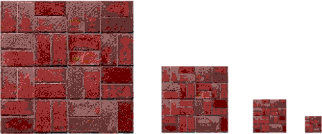
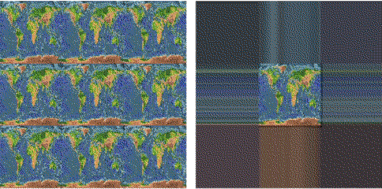
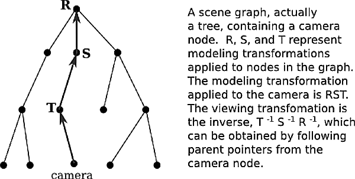

...menustart

- [Chapter 4  OpenGL 1.1: Light and Material](#38013a2053e186e2a913a847302cb961)
    - [4.1 Introduction to Lighting](#28d62d201f9f167a46bf8fa48482df0f)
        - [4.1.1  Light and Material](#6788faf44f9f4aa1051a042070db7ea4)
        - [4.1.2  Light Properties](#7cc9fc44683838aea8d3ee51ca72df05)
        - [4.1.3  Normal Vectors](#40178615255ddfc4be6f8dab0edd186d)
        - [4.1.4  The OpenGL Lighting Equation](#4b1becbc8f61f667b2cd75515f209e62)
    - [4.2 Light and Material in OpenGL 1.1](#1d7df9b9e73b274a6944e83f35506827)
        - [4.2.1  Working with Material](#212d60534ffdbd3cc3d30ed2081eb957)
        - [4.2.2  Defining Normal Vectors](#76c4b248421ab6f8ed3961772257e729)
        - [4.2.3  Working with Lights](#2be3f5e0b0764ab9809f624e5d350be3)
        - [4.2.4  Global Lighting Properties](#ff6ef9be13faeb818ed39d487cfe0929)
    - [4.3 Image Textures](#d96740a4938a1526bdbf9e5bd480f733)
        - [4.3.1  Texture Coordinates](#4d2bd57affe01ae466ff1eec96336e2f)
        - [4.3.2  MipMaps and Filtering](#9dfb35408c40a9f6a06f637d39978d1f)
        - [4.3.3  Texture Target and Texture Parameters](#71891ecbd1c91d5bc9cf1dca41bba204)
        - [4.3.4  Texture Transformation](#77215f4c082667d223529a170e100b17)
        - [4.3.5  Loading a Texture from Memory](#4cbbc83d1742387d548637c963cd179f)
        - [4.3.6  Texture from Color Buffer](#9a610c4b77e55f70493fb18040a49abe)
        - [4.3.7  Texture Objects](#f195611b7e066702888980514017d6d8)
        - [4.3.8  Loading Textures in C](#fa9c0146e107924356825bdad1b96a79)
    - [4.4 Lights, Camera, Action](#1cfd2f92a424424d1d932006d298c47f)
        - [4.4.1  Attribute Stack](#014e48c86844b30ed1ee648f92fef39a)
        - [4.4.2  Moving Camera](#e90e1158c70aef209dda35c28cbf6feb)
        - [4.4.3  Moving Light](#a8f9ce93e94e7809b551454814dda1d1)
    - [4.n 笔记](#61af40d9607525b33bc4bc11f91078b0)

...menuend


<h2 id="38013a2053e186e2a913a847302cb961"></h2>


# Chapter 4  OpenGL 1.1: Light and Material

<h2 id="28d62d201f9f167a46bf8fa48482df0f"></h2>


## 4.1 Introduction to Lighting

 - Lighting calculations are disabled by default in OpenGL.
 - you need to enable lighting by calling `glEnable(GL_LIGHTING)`.
    - If that's all you do, you will find that your objects are all completely black. If you want to see them, you have to turn on some lights.
 - The properties of a surface that determine how it interacts light are referred to as the **material** of the surface.  

<h2 id="6788faf44f9f4aa1051a042070db7ea4"></h2>


### 4.1.1  Light and Material

 - When light strikes a surface, some of it will be reflected. 
 - In OpenGL , the complexity is approximated by two general types of reflection,  *specular reflection* and *diffuse reflection*.



 - In perfect specular ("mirror-like") reflection, an incoming ray of light is reflected from the surface intact(完整地).
    - The reflected ray makes the same angle with the surface as the incoming ray. 
    - A viewer can see the reflected ray only if the viewer is in exactly the right position.
    - Such reflections are referred to as  *specular highlights*.
    - In practice, we think of a ray of light as being reflected not as a single perfect ray, but as a cone of light, which can be more or less narrow.



 - Specular reflection from a very shiny surface produces very narrow cones of reflected light; specular highlights on such a material are small and sharp. 
    - A duller surface will produce wider cones of reflected light and bigger, fuzzier specular highlights.
    - In OpenGL, the material property that determines the size and sharpness of specular highlights is called *shininess*.
    - Shininess in OpenGL is a number in the range 0 to 128.  As the number increases, specular highlights get smaller. 
    - This image shows eight spheres that differ only in the value of the shininess material property: (from 0, increade by 16)
    - 


 - In pure diffuse reflection, an incoming ray of light is scattered in all directions equally.
    - A viewer would see reflected light from all points on the surface. 
    - 如果入射光是均匀的平行光，责表面看起来被均匀照亮。如果入射光以不同的角度射入，比如来自附近的灯 或者照射表面是弯曲的，那么某一点的照射强度取决于光在改点的入射角度.

 - When light strikes a surface, some of the light can be absorbed, some can be reflected diffusely, and some can be reflected specularly. 
    - The amount of reflection can be different for different wavelengths.  材质反射各种波长光的程度 各不相同，这一性质形成了 材质特有的颜色。
    - We now see that a material can have two different colors -- a *diffuse color*  and a *specular color*. 
    - The diffuse color is the basic color of the object. The specular color determines the color of specular highlights. 
    - The diffuse and specular colors can be the same; for example, this is often true for metallic surfaces.  
        - Or they can be different; for example, a plastic surface will often have white specular highlights no matter what the diffuse color.
 - OpenGL goes even further.
    - In fact, there are two more colors associated with a material. 
 - The third color is the *ambient color* of the material, which tells how the surface reflects *ambient light*.
    - Ambient light refers to a general level of illumination that does not come directly from a light source. 
    - It consists of light that has been reflected and re-reflected so many times that it is no longer coming from any particular direction. 
    - Ambient light is why shadows are not absolutely black. 
    - 事实上，环境光只是对多重反射光的现实的粗略近似，但它比完全忽略多次反射要好。
    - The ambient color of a material determines how it will reflect various wavelengths of ambient light. 
    - *Ambient color* is generally set to be the same as the *diffuse color*. 
 - The fourth color associated with a material is an *emission color*.
    - 它不是和 前面3中颜色 同一意义上的颜色。 That is, it has nothing to do with how the surface reflects light. 
    - The emission color is color that does not come from any external source, and therefore seems to be emitted by the material itself. 
    - This does not mean that the object is giving off light that will illuminate other objects, 
        - but it does mean that the object can be seen even if there is no source of light (not even ambient light). (即便没有任何光源甚至环境光，物体也能被看到)
    - The emission color is usually black; that is, the object has no emission at all.
 - Material colors can also have *alpha components*,  but in OpenGL the only one may use alpha component is *diffuse* color .
 - In the case of the red, blue, and green components of the ambient, diffuse, or specular color, the term "color" really means reflectivity. 
    - That is, the red component of a color gives the proportion of red light hitting the surface that is reflected by that surface, and similarly for green and blue.

<h2 id="7cc9fc44683838aea8d3ee51ca72df05"></h2>


### 4.1.2  Light Properties

 - Leaving aside ambient light, the light in an environment comes from a light source such as a lamp or the sun. 
 - In fact, a lamp and the sun are examples of two essentially different kinds of light source: 
    - *point light* and *directional light*.
 - A light can have color. 
    - In fact, in OpenGL, each light source has three colors: an ambient color, a diffuse color, and a specular color. 
 - Just as the color of a material is more properly referred to as reflectivity, color of a light is more properly referred to as **intensity** or energy.
    - More exactly, color refers to how the light's energy is distributed among different wavelengths. 
    - 真实的光线可以包含无数个不同的波长; 当波长分离时，您会得到包含连续色彩的光谱或彩虹。
 - Light as it is usually modeled on a computer contains only the three basic colors, red, green, and blue. 
 - The diffuse intensity of a light is the aspect of the light that interacts with diffuse material color, 
    - and the specular intensity of a light is what interacts with specular material color. 
 - It is common for the diffuse and specular light intensities to be the same.
 - The ambient intensity of a light works a little differently. 
    - The ambient intensity of a light in OpenGL is added to the general level of ambient light. 
    - (There can also be global ambient light, which is not associated with any of the light sources in the scene.) 
    - Ambient light interacts with the ambient color of a material, and this interaction has no dependence on the position of the light sources or viewer. 
    - So, a light doesn't have to shine on an object for the object's ambient color to be affected by the light source; 
        - the light source just has to be turned on.

 - I should emphasize again that this is all just an approximation.
    - Real light sources do not have separate ambient, diffuse, and specular colors, and some computer graphics systems model light sources using just one color.

<h2 id="40178615255ddfc4be6f8dab0edd186d"></h2>


### 4.1.3  Normal Vectors

 - The visual effect of a light shining on a surface depends on the properties of the surface and of the light. 
 - But it also depends to a great extent on the angle at which the light strikes the surface. 
    - The angle is essential to specular reflection and also affects diffuse reflection. 
 - OpenGL needs to know the direction in which the surface is facing.
    - That direction is specified by a vector that is perpendicular to the surface. 
    - Another word for "perpendicular" is "normal," and a non-zero vector that is perpendicular to a surface at a given point is called a **normal vector** to that surface. 
 - When used in lighting calculations, a normal vector must have **length equal to one**.
    - A normal vector of length one is called a **unit normal**. 
 - For proper lighting calculations in OpenGL, a unit normal must be specified for each vertex. 
 - In OpenGL, normal vectors are actually assigned only to the vertices of a *primitive*. 
    - The normal vectors at the vertices of a primitive are used to do lighting calculations for the entire primitive.
 - A normal vector at a vertex is whatever you say it is, and it does not have to be literally perpendicular to the polygon. 
    - The normal vector that you choose should depend on the object that you are trying to model.
    - 事实上，顶点一般会被多个多边形共享，这个顶点的法线 一般就会选择为 所有共享面法线的和 再 normalize的结果。
 - There is one other issue in choosing normal vectors: 
    - There are always two possible unit normal vectors at a point on a surface, *pointing in opposite directions*. 
    - A polygon in 3D has two faces, facing in opposite directions. 
    - OpenGL considers one of these to be the *front face* and the other to be the *back face*. 
        - OpenGL通过 顶点的顺序区分它们： the order of the vertices is counterclockwise when looking at the front face.
    - When specifying a normal vector for the polygon, the vector should point out of the front face of the polygon. 


<h2 id="4b1becbc8f61f667b2cd75515f209e62"></h2>


### 4.1.4  The OpenGL Lighting Equation

 - What does it actually mean to say that OpenGL performs "lighting calculations"? 
    - The goal of the calculation is to produce a color, (r,g,b,a), for a point on a surface. 
    - In OpenGL 1.1, lighting calculations are actually done only at the vertices of a primitive. 
        - Colors for interior points of the primitive are obtained by interpolating the vertex colors.
 - The alpha component of the vertex color, a, is easy: It's simply the alpha component of the diffuse material color at that vertex. 
 - The calculation of r, g, and b is fairly complex and rather mathematical, and you don't necessarily need to understand it. 
    - But here is a short description of how it's done...
 - Ignoring alpha components, let's assume that 
    - components (mar,mag,mab), (mdr,mdg,mdb), (msr,msg,msb), and (mer,meg,meb)
    - the global ambient intensity is (gar,gag,gab)
    - There can be several point and directional light sources, which we refer to as light number 0, light number 1, light number 2, and so on.
 - With this setup, the red component of the vertex color will be:
    - r = mer + gar\*mar + I<sub>0,r</sub> + I<sub>1,r</sub> + I<sub>2,r</sub> + ...
    - where I<sub>0,r</sub> is the contribution to the color that comes from light number 0
    - This equation says that the emission color, mer, is simply added to others ...
    - And the contribution of global ambient light is obtained by multiplying the global ambient intensity, gar, by the material ambient color, mar. 
        - This is the mathematical way of saying that the material ambient color is the fraction of the ambient light that is reflected by the surface.
 - The terms I<sub>0,r</sub>, I<sub>1,r</sub>, and so on, represent the contribution to the final color from the various light sources in the environment. 
    - For an enabled light source, we have to look at the geometry as well as the colors:
    - 
    - N is the normal vector at the point whose color we want to compute.
    - L is a vector that points back to the light source
    - V is a vector that points in the direction of the viewer.
    - R is the direction of the reflected ray
    - **All of the vectors are unit vectors, with length 1**. 
 - Now, let's say that the light has ambient, diffuse, and specular color components (lar,lag,lab), (ldr,ldg,ldb), and (lsr,lsg,lsb).
    - let mh be the value of the shininess property of the material. 
    - Then the contribution of this light source to the red component of the vertex color can be computed as
    - 
    - `lar*mar`  is the contribution of the ambient light from this light source to the color of the surface.
        - This term is added to the color whether or not the surface is facing the light.
    - `f` means `facing` , it is 0 if the surface is facing away from the light , otherwise 1.
        - that is, the light only illuminates one side of the surface. 
        - To test whether f is 0 or 1, we can check whether L·N is less than 0. 
            - L·N  is less than 0 means angle is greater than 90 degrees. which would mean that the normal vector is on the opposite side of the surface from the light. 
        - When f is zero, there is no diffuse or specular contribution from the light to the color of the vertex.
    - The diffuse component is given by `ldr*mdr*(L·N)`.  
        - The angle is involved because for a larger angle, the same amount of energy from the light is spread out over a greater area.
        - so the larger the angle, the smaller the value will be.
    - For the specular component, the closer the viewer is to the center of the cone(R), the more intense the specular reflection.
        - Taking the maximum of 0 and V·R ensures that the specular contribution is zero if the angle between V and R is greater than 90 degrees. 
        - Note that this dot product is raised to the exponent mh, which is the material's shininess property. 
            - When mh is 0, (V·R)<sup>mh</sup> is 1, and there is no dependence on the angle; 
            - in that case, the result is the sort of huge and undesirable specular highlight that we have seen for shininess equal to zero. 
        - For positive values of shininess, the specular contribution is maximal when the angle between V and R is zero, and it decreases as the angle increases.
            - The larger the shininess value, the faster the rate of decrease. 
            - The result is that larger shininess values give smaller, sharper specular highlights.
 - 当有多个光源的时候，颜色分量相加很容易就会 大于1.0, 在最后上色之前，必须将这些颜色分量限制[0,1]的范围之内, 
    - 这使得很容易产生丑陋的图像，其中大部分区域是均匀的白色。 效果类似于过度曝光的照片。
    - It can take some work to find appropriate lighting levels to avoid this kind of over-exposure.

---

 - The discussion of lighting in this section leaves out some factors. The equation as presented doesn't take into account the fact that 
    - the effect of a point light can depend on the distance to the light,
    - and it doesn't take into account spotlights, which emit just a cone of light. 
 - Both of these can configured in OpenGL, but I won't discuss them in this book. 
 - There are also many aspects of light that are not captured by the simple model used in OpenGL. 
    - One of the most obvious omissions is shadows: 
        - Objects don't block light!
        - Light shines right through them. 


<h2 id="1d7df9b9e73b274a6944e83f35506827"></h2>


## 4.2 Light and Material in OpenGL 1.1

 - The use of light and material must be enabled by calling 
    - `glEnable(GL_LIGHTING)`
 - When lighting is disabled, the color of a vertex is simply the current color as set by `glColor*`. 
 - It is common for lighting to be turned on for rendering some parts of a scene, but turned off for other parts. 
    - We will say that some objects are "lit" while others aren't. 
    - For example, wireframe objects are usually drawn with lighting disabled, even if they are part of a scene in which solid objects are lit.
    - But note that it is illegal to call glEnable or glDisable between calls to glBegin and glEnd, 
        - so it is not possible for part of a primitive to be lit while another part of the same primitive is unlit. 
 - To light a scene, in addition to enabling GL_LIGHTING, you must configure at least one source of light.
    - For very basic lighting, it often suffices to call `glEnable(GL_LIGHT0)`;
    - This command turns on a **directional** light that shines from the direction of the **viewer** into the scene.
    - Since it shines from the direction of the viewer, it will illuminate everything that the user can see. 
    - The light is white, with no specular component; 
        - that is, you will see the diffuse color of objects, without any specular highlights. 

<h2 id="212d60534ffdbd3cc3d30ed2081eb957"></h2>


### 4.2.1  Working with Material

 - Material properties are vertex attributes,  in the same way that color is a vertex attribute.
    - That is, the OpenGL state includes a current value for each of the material properties. 
    - When a vertex is generated by a call to one of the `glVertex*` functions, a copy of each of the current material properties is stored, along with the vertex coordinates.
 - This is complicated by the fact that polygons are two-sided, and the front face and back face of a polygon can have different materials. 
    - This means that, in fact, two sets of material property values are stored for each vertex:
        - the front material and the back material. 
    - (The back material isn't actually used unless you turn on two-sided lighting.)
 - With all that in mind, we will look at functions for setting the current values of material properties.
    - For setting the ambient, diffuse, specular, and emission material colors, the function is
    - `void glMaterialfv( int side, int property, float* valueArray )`
    - The first parameter can be GL_FRONT_AND_BACK, GL_FRONT, or GL_BACK. 
    - The second parameter tells which material property is being set. 
        - It can be GL_AMBIENT, GL_DIFFUSE, GL_SPECULAR, GL_EMISSION, or GL_AMBIENT_AND_DIFFUSE(use same value). 
    - The last parameter is an array containing four float numbers.
        - The numbers give the RGBA color components as values in the range from 0.0 to 1.0; 
        - values outside this range are actually allowed, and will be used in lighting computations, but such values are unusual. 
        - Note that an alpha component is required, but it is used only in the case of diffuse color: 
            - When the vertex color is computed, its alpha component is set equal to the alpha component of the diffuse material color.
 - The shininess material property is a single number rather than an array, and there is a different function for setting its value 
    - (without the "v" at the end)
    - `void glMaterialf( int side, int property, float value )`
    - The property must be GL_SHININESS.
    - And the value is a float in the range 0.0 to 128.0.

```c
float bgcolor[4] = { 0.0, 0.7, 0.5, 1.0 };
glMaterialfv( GL_FRONT_AND_BACK, GL_AMBIENT_AND_DIFFUSE, bgcolor );
```

```c
float gold[13] = { 0.24725, 0.1995, 0.0745, 1.0,      /* ambient */
                   0.75164, 0.60648, 0.22648, 1.0,    /* diffuse */
                   0.628281, 0.555802, 0.366065, 1.0, /* specular */
                   50.0                               /* shininess */
    };

glMaterialfv( GL_FRONT_AND_BACK, GL_AMBIENT, gold );
glMaterialfv( GL_FRONT_AND_BACK, GL_DIFFUSE, &gold[4] );
glMaterialfv( GL_FRONT_AND_BACK, GL_SPECULAR, &gold[8] );
glMaterialf( GL_FRONT_AND_BACK, GL_SHININESS, gold[12] );
```

 - The functions glMaterialfv and glMaterialf can be called at any time, including between calls to glBegin and glEnd. 
    - This means that different vertices of a primitive can have different material properties.

---

 - So, maybe you like `glColor*` better than glMaterialfv? 
    - If so, you can use it to work with material as well as regular color. If you call
    - `glEnable( GL_COLOR_MATERIAL );`
    - then some of the material color properties will track the color. By default, setting the color will also set the current front and back, ambient and diffuse material properties. 
    - That is, for example, calling `glColor3f( 1, 0, 0,);` will, if lighting is enabled, have the same effect as calling
        - `glMaterialfv( GL_FRONT_AND_BACK, GL_AMBIENT_AND_DIFFUSE, array );`
        - where array contains the values 1, 0, 0, 1.
    - You can change the material property that tracks the color using
        - `void glColorMaterial( side, property );`
    - where side can be GL_FRONT_AND_BACK, GL_FRONT, or GL_BACK, 
        - and property can be GL_AMBIENT, GL_DIFFUSE, GL_SPECULAR, GL_EMISSION, or GL_AMBIENT_AND_DIFFUSE.
    - Neither glEnable nor glColorMaterial can be called between calls to glBegin and glEnd, so all of the vertices of a primitive must use the same setting.

<h2 id="76c4b248421ab6f8ed3961772257e729"></h2>


### 4.2.2  Defining Normal Vectors

 - Like color and material, normal vectors are attributes of vertices. 
 - The OpenGL state includes a current normal vector, which is set using functions in the family `glNormal*`. 
 - When a vertex is specified with `glVertex*`, a copy of the current normal vector is saved as an attribute of the vertex.
    - glNormal3f, glNormal3d, glNormal3fv, and glNormal3dv. 

```c
glNormal3f( 0, 0, 1 );  // (This is the default value.)
glNormal3d( 0.707, 0.707, 0.0 );
float normalArray[3] = { 0.577, 0.577, 0.577 };
glNormal3fv( normalArray );
```

 - Remember that the normal vector should point out of the front face of the polygon, and that the front face is determined by the order in which the vertices are generated. 
    - If a normal vector for a vertex points in the wrong direction, then lighting calculations will not give the correct color for that vertex.
 - When modeling a smooth surface, normal vectors should be chosen perpendicular to the surface, rather than to the polygons that approximate the surface. 
 - Suppose that we want to draw the side of a cylinder with radius 1 and height 2, where the center of the cylinder is at (0,0,0) and the axis lies along the z-axis. 
    - We can approximate the surface using a single triangle strip. 
    - The top and bottom edges of the side of a cylinder are circles. 
    - Vertices along the top edge will have coordinates (cos(a),sin(a),1) and vertices along the bottom edge will have coordinates (cos(a),sin(a),−1), where a is some angle. 
    - The normal vector points in the same direction as the radius, but its z-coordinate is zero since it points directly out from the side of the cylinder. 
    - So, the normal vector to the side of the cylinder at both of these points will be (cos(a),sin(a),0). 
    - Looking down the z-axis at the top of the cylinder, it looks like this:
    - 

 - When we draw the side of the cylinder as a triangle strip, we have to generate pairs of vertices on alternating edges(top & buttom).
    - The normal vector is the same for the two vertices in the pair, but it is different for different pairs. Here is the code:

```c
glBegin(GL_TRIANGLE_STRIP);
for (i = 0; i <= 16; i++) {
   double angle = 2*3.14159/16 * i;  // i 16-ths of a full circle
   double x = cos(angle);
   double y = sin(angle);
   glNormal3f( x, y, 0 );  // Normal for both vertices at this angle.
   glVertex3f( x, y, 1 );  // Vertex on the top edge.
   glVertex3f( x, y, -1 ); // Vertex on the bottom edge.
}
glEnd();
```

 - When we draw the top and bottom of the cylinder, on the other hand, we want a flat polygon, with the normal vector pointing in the direction (0,0,1) for the top and in the direction (0,0,−1) for the bottom:

```c
glNormal3f( 0, 0, 1);
glBegin(GL_TRIANGLE_FAN);  // Draw the top, in the plane z = 1.
for (i = 0; i <= 16; i++) {
   double angle = 2*3.14159/16 * i;
   double x = cos(angle);
   double y = sin(angle);
   glVertex3f( x, y, 1 );
}
glEnd();

glNormal3f( 0, 0, 1 );
glBegin(GL_TRIANGLE_FAN);  // Draw the bottom, in the plane z = -1
for (i = 16; i >= 0; i--) {
   double angle = 2*3.14159/16 * i;
   double x = cos(angle);
   double y = sin(angle);
   glVertex3f( x, y, -1 );
}
glEnd();
```

 - Note that the vertices for the bottom are generated in the opposite order from the vertices for the top, to account for the fact that the top and bottom face in opposite directions.
 
---
 
 - When drawing a primitive with glDrawArrays or glDrawElements, it is possible to provide a different normal for each vertex by using a normal array to hold the normal vectors. 
    - The normal array works in the same way as the color array and the vertex array. 
    - To use one, you need to enable the use of a normal array by calling
        - `glEnableClientState(GL_NORMAL_ARRAY);`
    - then calling
        - `glNormalPointer( type, stride, data );`
        - type: GL_INT, GL_FLOAT, or GL_DOUBLE. 

---

 - The lighting equation assumes that normal vectors are unit normals.
    - The default in OpenGL is to use normal vectors as provided, even if they don't have length one, which will give incorrect results. 
    - However, if you call 
        - `glEnable(GL_NORMALIZE);`
    - then OpenGL will automatically convert every normal vector into a unit normal.
 - Note that when a geometric transform is applied, normal vectors are transformed along with vertices.
    - so even if you provided unit normal vectors, they will not be unit normals after a scaling transformation. 
    - However, if you have enabled GL_NORMALIZE, the transformed normals will automatically be converted back to unit normals. 
    - My recommendation is to always enable GL_NORMALIZE as part of your OpenGL initialization.

<h2 id="2be3f5e0b0764ab9809f624e5d350be3"></h2>


### 4.2.3  Working with Lights

 - OpenGL 1.1 supports at least eight light sources, GL_LIGHT0, GL_LIGHT1, ..., GL_LIGHT7. 
 - Each light source can be configured to be either a *directional light* or a  *point light*, 
    - and each light can have its own diffuse, specular, and ambient intensities. 
 - By default, all of the light sources are disabled. To enable a light, call glEnable(light).
    - However, just enabling a light does not give any illumination, except in the case of GL_LIGHT0, 
    - since all light intensities are zero by default, with the single exception of the diffuse color of *GL_LIGHT0*.
 - To get any light from the other light sources, you need to change some of their properties.
    - `void glLightfv( int light, int property, float* valueArray );`
    - property: GL_DIFFUSE, GL_SPECULAR, GL_AMBIENT, or GL_POSITION 
    - valueArray: {r,g,b,a}  , The alpha component is not actually used for anything.
        - The values generally lie in the range 0.0 to 1.0, but can lie outside that range; 
        - in fact, values larger than 1.0 are occasionally useful. 
    - Remember that the diffuse and specular colors of a light tell how the light interacts with the diffuse and specular material colors
        - **the ambient color is simply added to the global ambient light when the light is enabled**.
 - For example, to set up light zero as a bluish light, with blue specular highlights, that adds a bit of blue to the ambient light when it is turned on, you might use:

```c
float blue1[4] = { 0.4, 0.4, 0.6, 1 };
float blue2[4] = { 0.0, 0, 0.8, 1 };
float blue3[4] = { 0.0, 0, 0.15, 1 };
glLightfv( GL_LIGHT1, GL_DIFFUSE, blue1 );
glLightfv( GL_LIGHT1, GL_SPECULAR, blue2 );
glLightfv( GL_LIGHT1, GL_AMBIENT, blue3 );
```

---

 - The GL_POSITION property of a light is quite a bit different. 
    - It is used both to set 
        - whether the light is a point light or a directional light, 
        - and to set its position or direction. 
    - The property value for GL_POSITION is an array of four numbers (x,y,z,w), of which at least one must be non-zero. 
        - When the fourth number, w, is zero, then the light is directional ,and the point (x,y,z) specifies the direction of the light: 
            - The light rays shine in the direction of the line from the point (x,y,z) towards the origin. 
            - The source of the light can be considered to be a point at infinity in the direction of (x,y,z).
        - On the other hand, if the fourth number, w, is non-zero, then the light is a point light, and it is located at the point (x/w,y/w,z/w). 
 - The default position for all lights is (0,0,1,0), representing a directional light shining from the positive direction of the z-axis.
 - One important and potentially confusing fact about lights is that 
    - the position that is specified for a light is transformed by the modelview transformation that is in effect **at the time the position is set** using glLightfv. 
        - ( 为灯光指定的位置会被模型视图变换转换，该变换在使用glLightfv设置位置时生效。)
    - That is , the position is set in eye coordinates, not in  world coordinates.
    - Calling glLightfv with the property set to GL_POSITION is very much like calling `glVertex*`. The light position is transformed in the same way that the vertex coordinates would be transformed. 
    - For example,

```c
    float position[4] = { 1,2,3,1 }
    glLightfv(GL_LIGHT1, GL_POSITION, position);

// puts the light in the same place as

    glTranslatef(1,2,3);
    float position[4] = { 0,0,0,1 }
    glLightfv(GL_LIGHT1, GL_POSITION, position);
``` 

 - For a directional light, the direction of the light is transformed by the rotational part of the modelview transformation.

 - There are three basic ways to use light position. It is easiest to think in terms of potentially animated scenes.
 - **First**, if the position is set before any modelview transformation is applied, then the light is fixed with respect to the viewer. 
    - For example, the default light position is effectively set to (0,0,1,0) while the modelview transform is the identity. This means that it shines in the direction of the negative z-axis, *in the coordinate system of the viewer*, where the negative z-axis points into the screen. 
    - Another way of saying this is that the light always shines from the direction of the viewer into the scene.
    - It's like the light is attached to the viewer. If the viewer moves about in the world, the light moves with the viewer.
 - **Second**, if the position is set after the viewing transform has been applied and before any modeling transform is applied, then the position of the light is fixed in world coordinates. 
    - It will not move with the viewer, and it will not move with objects in the scene. It's like the light is attached to the world.
 - **Third**, if the position is set after a modeling transform has been applied, then the light is subject to that modeling transformation. 
    - This can be used to make a light that moves around in the scene as the modeling transformation changes.
    - If the light is subject to the same modeling transformation as an object, then the light will move around with that object, as if it is attached to the object.
 
    
<h2 id="ff6ef9be13faeb818ed39d487cfe0929"></h2>


### 4.2.4  Global Lighting Properties

 - OpenGL lighting system uses several global properties. 
 - There are only three such properties in OpenGL 1.1. 
 - One of them is the global ambient light.
    - Global ambient light will be present in the environment even if all of GL_LIGHT0, GL_LIGHT1, ... are disabled.
    - By default, the global ambient light is black. The value can be changed using the function
    - 
    ```c
    void glLightModelfv( int property, float* value )
    ```
    - where the property must be GL_LIGHT_MODEL_AMBIENT. 
    - In general, the global ambient light level should be quite low. For example, in C:
    - 
    ```c
    float ambientLevel[] = { 0.15, 0.15, 0.15, 1 };
    glLightModelfv( GL_LIGHT_MODEL_AMBIENT, ambientLevel );
    ``` 
    - The alpha component of the color is usually set to 1, but it is not used for anything.
 - The other two light model properties are options that can be either off or on. 
    - GL_LIGHT_MODEL_TWO_SIDE
    - GL_LIGHT_MODEL_LOCAL_VIEWER
    - They can be set using the function 
    - 
    ```c
    void glLightModeli( int property, int value )
    ```
 - GL_LIGHT_MODEL_TWO_SIDE is used to turn on two-sided lighting. 
    - When two-sided lighting is off, which is the default, only the front material is used; it is used for both the front face and the back face of the polygon. 
    - Furthermore, the same normal vector is used for both faces. 
    - When two-sided lighting is on,  the back material is used on the back face and the direction of the normal vector is reversed when it is used in lighting calculations for the back face.
 - You should use two-sided lighting whenever there are back faces that might be visible in your scene. 
    - 比如 没有盖子的 小熊饼干盒
    - With two-sided lighting, you have the option of using the same material on both faces or specifying different materials for the two faces. 
    - For example, to put a shiny purple material on front faces and a duller yellow material on back faces:

```c
glLightModeli( GL_LIGHT_MODEL_TWO_SIDE, 1 ); // Turn on two-sided lighting.

float purple[] = { 0.6, 0, 0.6, 1 };
float yellow[] = { 0.6, 0.6, 0, 1 };
float white[] = { 0.4, 0.4, 0.4, 1 }; // For specular highlights.
float black[] = { 0, 0, 0, 1 };


glMaterialfv( GL_FRONT, GL_AMBIENT_AND_DIFFUSE, purple );  // front material
glMaterialfv( GL_FRONT, GL_SPECULAR, white );
glMaterialf( GL_FRONT, GL_SHININESS, 64 );

glMaterialfv( GL_BACK, GL_AMBIENT_AND_DIFFUSE, yellow );  // back material
glMaterialfv( GL_BACK, GL_SPECULAR, black );  // no specular highlights
```

 - The third material property, GL_LIGHT_MODEL_LOCAL_VIEWER, is much less important. 
    - It has to do with *the direction from a surface to the viewer* in the lighting equation. 
    - By default, this direction is always taken to point directly out of the screen, which is true for an orthographic projection but is not for not accurate for a perspective projection. 
    - If you turn on the local viewer option, the true direction to the viewer is used. In practice, the difference is usually not very noticeable.


<h2 id="d96740a4938a1526bdbf9e5bd480f733"></h2>


## 4.3 Image Textures

 - A texture, in general, is some sort of variation from pixel to pixel within a single primitive. 
 - We will consider only one kind of texture:  **image textures**. 
 - Textures  become more complicated, in the most modern OpenGL versions. This section covers only part of the OpenGL 1.1 texture API. 
 - Note that an image that is used as a texture should have a width and a height that are **powers of 2**. This is a requirement in OpenGL 1.1.
    - The requirement might be relaxed in some versions, but it's still a good idea to use power-of-two textures 
    - Some of the things will not work with non-power-of-two textures, even on modern systems.
 - When an image texture is applied to a surface, the default behavior is to multiply the RGBA color components of pixels on the surface by the color components from the image.
    - The surface color will be modified by light effects, if lighting is turned on, before it is multiplied by the texture color. 
    - It is common to use white as the surface color. 

<h2 id="4d2bd57affe01ae466ff1eec96336e2f"></h2>


### 4.3.1  Texture Coordinates

 - When a texture is applied to a surface, each point on the surface has to correspond to a point in the texture. 
 - There has to be a way to determine how this mapping is computed. 
 - For that, the object needs **texture coordinates**. 
    - As is generally the case in OpenGL, texture coordinates are specified for each vertex of a primitive. 
 - A texture image comes with its own 2D coordinate system.
    - Traditionally, *s* used for the horizontal coordinate on the image and *t* is used for the vertical coordinate.
    - (0,0) is at left-bottom
    - s or t outside of the range [0,1] are still valid  as texture coordinates. 
 - To draw a textured primitive, we need a pair of numbers (s,t) for each vertex. 
 - The texture coordinates of a vertex are an *attribute* of the vertex, just like color, normal vectors, and material properties. 
    - `glTexCoord2f(s,t), glTexCoord2d(s,t), glTexCoord2fv(array), glTexCoord2dv(array)`
 - The OpenGL state includes a current set of texture coordinates , as specified by these functions.

```c
glNormal3d(0,0,1);       // This normal works for all three vertices.
glBegin(GL_TRIANGLES);
glTexCoord2d(0.3,0.1);   // Texture coords for vertex (0,0)
glVertex2d(0,0);
glTexCoord2d(0.45,0.6);  // Texture coords for vertex (0,1)
glVertex2d(0,1);
glTexCoord2d(0.25,0.7);  // Texture coords for vertex (1,0)
glVertex2d(1,0);
glEnd();
```

 - One last question: What happens if you supply texture coordinates that are not in the range from 0 to 1? 
    - By default, in OpenGL 1.1, they behave as though the entire st-plane is filled with copies of the image. 
    - For example, if the texture coordinates for a square range from 0 to 3 in both directions, instead of 0 to 1, then you get 9 copies of the image on the square (3 copies horizontally by 3 copies vertically).

---

 - To draw a textured primitive using glDrawArrays or glDrawElements, you will need to supply the texture coordinates in a  vertex array, 
    - in the same way that you supply vertex coordinates, colors, and normal vectors.

```c
glEnableClientState(GL_TEXTURE_COORD_ARRAY);

void glTexCoordPointer( int size, int dataType, int stride, void* array)
```


<h2 id="9dfb35408c40a9f6a06f637d39978d1f"></h2>


### 4.3.2  MipMaps and Filtering

 - When a texture is applied to a surface, the pixels in the texture do not usually match up one-to-one with pixels on the surface, 
    - and in general, the texture must be stretched or shrunk as it is being mapped onto the surface. 
 - Sometimes, several pixels in the texture will be mapped to the same pixel on the surface. 
    - In this case, the color that is applied to the surface pixel must somehow be computed from the colors of all the texture pixels that map to it. 
    - This is an example of "**filtering**"; in particular, it uses a *minification filter* because the texture is being shrunk. 
 - When one pixel from the texture covers more than one pixel on the surface, the texture has to be magnified, and we need a *magnification filter*.
 - One bit of terminology before we proceed: 
    - The pixels in a texture are referred to as **texels**, short for "texture pixel" or "texture element".
 - When deciding how to apply a texture to a point on a surface, OpenGL knows the texture coordinates for that point. 
    - Those texture coordinates correspond to one point in the texture, and that point lies in one of the texture's texels. 
    - The easiest thing to do is to apply the color of that texel to the point on the surface.
        - This is called "*nearest texel filtering*." It is very fast, but it does not usually give good results.
        - It doesn't take into account the difference in size between the pixels on the surface and the texels in the image.
    - An improvement on nearest texel filtering is "*linear filtering*," which can take an average of several texel colors to compute the color that will be applied to the surface.
 - The problem with linear filtering is that it will be very inefficient when a large texture is applied to a much smaller surface area. 
    - In this case, many texels map to one pixel, and computing the average of so many texels becomes very inefficient. 
    - There is a neat solution for this:  **mipmaps**.
 - A mipmap for a texture is a scaled-down version of that texture. 
    - A complete set of mipmaps consists of the full-size texture, a half-size version in which each dimension is divided by two, a quarter-sized version, a one-eighth-sized version, and so on. 
    - In any case, the final mipmap consists of a single pixel. 
    - Here are the first few images in the set of mipmaps for a brick texture:
    - 
    - The total memory used by a set of mipmaps is only about one-third more than the memory used for the original texture.
 - Mipmaps are used only for minification filtering. 
    - They are essentially a way of pre-computing the bulk of the averaging that is required when shrinking a texture to fit a surface. 
    - To texture a pixel, OpenGL can first select the mipmap whose texels most closely match the size of the pixel. 
 - In newer versions of OpenGL, you can get OpenGL to generate mipmaps automatically.
    - In OpenGL 1.1, if you want to use mipmaps, you must either load each mipmap individually, or you must generate them yourself. 
    - (The GLU library has a method, gluBuild2DMipmaps that can be used to generate a set of mipmaps for a 2D texture.) 


<h2 id="71891ecbd1c91d5bc9cf1dca41bba204"></h2>


### 4.3.3  Texture Target and Texture Parameters

 - OpenGL can actually use 1D and 3D textures, as well as 3D . 
    - Because of this, many OpenGL functions dealing with textures take a texture target as a parameter, to tell whether the function should be applied to one, two, or three dimensional textures. 
    - For us, the only texture target will be GL_TEXTURE_2D.
 - There are a number of options that apply to textures, to control the details of how textures are applied to surfaces. 
    - Some of the options can be set using the glTexParameteri() function.

```c
glTexParameteri(GL_TEXTURE_2D, GL_TEXTURE_MAG_FILTER, magFilter);
glTexParameteri(GL_TEXTURE_2D, GL_TEXTURE_MIN_FILTER, minFilter);
```

 - The values of *magFilter* and *minFilter* are constants that specify the filtering algorithm. 
    - GL_NEAREST , GL_LINEAR
    - The default for the MAG filter is GL_LINEAR , and there is rarely any need to change it. 
    - For minFilter, in addition to GL_NEAREST and GL_LINEAR, there are four options that use mipmaps for more efficient filtering. 
    - The default MIN filter is GL_NEAREST_MIPMAP_LINEAR,
        - which does averaging between mipmaps and nearest texel filtering within each mipmap. 
    - For even better results, at the cost of greater inefficiency, you can use GL_LINEAR_MIPMAP_LINEAR, 
        - which does averaging both between and within mipmaps. 
    - The other two options are GL_NEAREST_MIPMAP_NEAREST and GL_LINEAR_MIPMAP_NEAREST.
 - **One very important note:** , If you are **not** using mipmaps for a texture, it is imperative that you change the minification filter for that texture to GL_LINEAR or, less likely, GL_NEAREST. 
    - The default MIN filter requires mipmaps, and if mipmaps are not available, then the texture is considered to be improperly formed, and OpenGL ignores it! 
    - Remember that if you don't create mipmaps and if you don't change the minification filter, then your texture will simply be ignored by OpenGL.
 - There is another pair of texture parameters to control how texture coordinates outside the range 0 to 1 are treated. 
    - The default is to repeat the texture. 
    - The alternative is to "clamp" the texture. 
        - This means that when texture coordinates outside the range 0 to 1 are specified, those values are forced into that range: Values less than 0 are replaced by 0, and values greater than 1 are replaced by 1. 

```c
glTexParameteri(GL_TEXTURE_2D, GL_TEXTURE_WRAP_S, GL_CLAMP);
glTexParameteri(GL_TEXTURE_2D, GL_TEXTURE_WRAP_T, GL_CLAMP);
```

 - Passing GL_REPEAT as the last parameter restores the default behavior. 
 - When clamping is in effect, texture coordinates outside the range 0 to 1 return the same color as a texel that lies along the outer edge of the image.
    - Here is what the effect looks like on two textured squares:
    - 
    - The two squares in this image have s and t texture coordinates that range from −1 to 2. 


<h2 id="77215f4c082667d223529a170e100b17"></h2>


### 4.3.4  Texture Transformation

 - OpenGL  supports textures in 1D,2D,3D.
    - This means that texture coordinates cannot be restricted to 2D.
    - In fact, a set of texture coordinates in OpenGL is represented internally in the form of homogeneous coordinates, which are referred to as (s,t,r,q). 
    - We have used `glTexCoord2*` to specify texture s and t coordinates, is really just shorthand for `glTexCoord4f(s,t,0,1)`.
 - Since texture coordinates are no different from vertex coordinates, they can be transformed in exactly the same way. 
 - OpenGL maintains a *texture transformation* as part of its state, along with the modelview and projection transformations. 
    - The current value of each of the three transformations is stored as a matrix.
    - When a texture is applied to an object, the texture coordinates that were specified for its vertices are transformed by the texture matrix.
    - The transformed texture coordinates are then used to pick out a point in the texture.
    - Of course, the default texture transform is the identity transform, which doesn't change the coordinates.
 - The texture matrix can represent scaling, rotation, translation and combinations of these basic transforms. 
    - For example to install a texture transform that scales texture coordinates by a factor of two in each direction, you could say:

```c
glMatrixMode(GL_TEXTURE);
glLoadIdentity(); // Make sure we are starting from the identity matrix.
glScalef(2,2,1);
glMatrixMode(GL_MODELVIEW); // Leave matrix mode set to GL_MODELVIEW.
```

 - In the example, the scaling transform multiplies each texture coordinate by 2. 
    - If a vertex was assigned 2D texture coordinates (0.4,0.1), then after the texture transform is applied, that vertex will be mapped to the point (s,t) = (0.8,0.2) in the texture. 
    - The texture coordinates vary twice as fast on the surface as they would without the scaling transform. 
    - A region on the surface that would map to a 1-by-1 square in the texture image without the transform will instead map to a 2-by-2 square in the image
        - so that a larger piece of the image will be seen inside the region. 
    - In other words, the texture image will be shrunk by a factor of two on the surface!
    - More generally, the effect of a texture transformation on the appearance of the texture is the **inverse** of its effect on the texture coordinates.
    - If the texture transform is translation to the right, then the texture moves to the left on the surface. 
    - If the texture transform is a counterclockwise rotation, then the texture rotates clockwise on the surface.

<h2 id="4cbbc83d1742387d548637c963cd179f"></h2>


### 4.3.5  Loading a Texture from Memory

 - OpenGL does not have functions for loading images from a file. 
 - For now, we assume that the file has already been loaded from the file into the computer's memory.
 - The OpenGL function for loading image data from the computer's memory into a 2D texture:

```c
glTexImage2D(target, mipmapLevel, internalFormat, width, height, border,
                            format, dataType, pixels);
```
 
 - The target should be GL_TEXTURE_2D. 
 - The mipmapLevel should ordinarily be 0. 
    - The value 0 is for loading the main texture; a larger value is used to load an individual mipmap. 
 - The internalFormat tells OpenGL how you want the texture data to be stored in OpenGL texture memory. 
    - It is ordinarily GL_RGB to store an 8-bit red/green/blue component for each pixel.
    - Another possibility is GL_RGBA, which adds an alpha component.
 - The width and height give the size of the image; the values should usually be powers of two. 
 - The value of border should be 0; 
    - the only other possibility is 1, which indicates that a one-pixel border has been added around the image data for reasons that I will not discuss.
 - The last three parameters describe the image data. 
    - The format tells how the original image data is represented in the computer's memory, such as GL_RGB or GL_RGBA. 
    - The dataType is usually GL_UNSIGNED_BYTE, indicating that each color component is represented as a one-byte value in the range 0 to 255. 
    - And pixels is a pointer to the start of the actual color data for the pixels. 
 - This all looks rather complicated, but in practice, a call to glTexImage2D generally takes the following form

```c
glEnable(GL_TEXTURE_2D);
...
glTexImage2D(GL_TEXTURE_2D, 0, GL_RGB, width, height, 0,
                    GL_RGB, GL_UNSIGNED_BYTE, pixels);
```

 - If you want to use the texture on some objects but not others, you can enable GL_TEXTURE_2D before drawing objects that you want to be textured and disable it before drawing untextured objects.
    - You can also change the texture that is being used at any time by calling glTexImage2D.

<h2 id="9a610c4b77e55f70493fb18040a49abe"></h2>


### 4.3.6  Texture from Color Buffer

 - OpenGL is itself a powerful engine for creating images. Sometimes, instead of loading an image file, it's convenient to have OpenGL create the image internally, by rendering it.
    - This is possible because OpenGL can read texture data from its own color buffer, where it does its drawing.
 - To create a texture image using OpenGL, you just have to draw the image using standard OpenGL drawing commands and then load that image as a texture using 

```c
glCopyTexImage2D( target, mipmapLevel, internalFormat,
                                     x, y, width, height, border );
```

 - In this method, target will be GL_TEXTURE_2D; 
    - mipmapLevel should be zero;
    - internalFormat will ordinarily be GL_RGB or GL_RGBA;
    - x and y specify the lower left corner of the rectangle from which the texture will be read; 
    - width and height are the size of that rectangle; should be power of 2
    - and border should be 0.
 - A call to glCopyTexImage2D will typically look like

```c
glCopyTexImage2D(GL_TEXTURE_2D, 0, GL_RGB, x, y, width, height, 0);
```

 - The end result is that the specified rectangle from the color buffer will be copied to texture memory and will become the current 2D texture.
    - This works in the same way as a call to glTexImage2D(), except for the source of the image data.
 - The texture can be animated!


<h2 id="f195611b7e066702888980514017d6d8"></h2>


### 4.3.7  Texture Objects

 - Everything that I've said so far about textures was already true for OpenGL 1.0. 
 - OpenGL 1.1 introduced a new feature called  **texture objects** to make texture handling more efficient. 
 - Texture objects are used when you need to work with several texture images in the same program. 
 - The usual method for loading texture images, glTexImage2D, transfers data from your program into the graphics card. 
    - This is an expensive operation, and switching among multiple textures by using this method can seriously degrade a program's performance. 
 - Texture objects offer the possibility of storing texture data for multiple textures on the graphics card.
 - With texture objects, you can switch from one texture object to another with a single, fast OpenGL command: 
    - You just have to tell OpenGL which texture object you want to use.
    - (Of course, the graphics card has only a limited amount of memory for storing textures, and you aren't guaranteed that all of your texture objects will actually be stored on the graphics card. )
 - Texture objects are managed by OpenGL and the graphics hardware. 
 - A texture object is identified by an integer ID number. 
 - To use a texture object, you need to obtain an ID number from OpenGL. This is done with the glGenTextures function:

```c
void glGenTexures( int textureCount, int* array )
```

 - This function can generate multiple texture IDs with a single call. 
    - The first parameter specifies how many IDs you want.
    - The second parameter says where the generated IDs will be stored.
    - It should be an array whose length is at least textureCount. 
 - For example, if you plan to use three texture objects, you can say

```c
int idList[3];
glGenTextures( 3, idList );
```

 - Every texture object has its own state, which includes the values of texture parameters such as GL_TEXTURE_MIN_FILTER as well as the texture image itself. 
 - To work with a specific texture object, you must first call

```c
// use a texture
glBindTexture( GL_TEXTURE_2D, texID )
```

 - where texID is the texture ID returned by glGenTextures.
 - After this call, any use of glTexParameteri, glTexImage2D, or glCopyTexImage2D will be applied to the texture object with ID texID.
 - A typical pattern would be to load and configure a number of textures during program initialization:

```c
glGenTextures( n, textureIdList );
for (i = 0; i < n; i++) {
    glBindTexture( textureIDList[i] );
      .
      .  // Load texture image number i
      .  // Configure texture image number i
      .
}
```

 - Then, while rendering a scene, you would call glBindTexture every time you want to switch from one texture image to another texture image.
 - OpenGL 1.1 reserves texture ID zero as the default texture object, which is bound initially. 
    - It is the texture object that you are using if you never call *glBindTexture*. 
    - This means that you can write programs that use textures without ever mentioning glBindTexture. 
    - (However, I should note that when we get to WebGL, that will no longer be true.) 


<h2 id="fa9c0146e107924356825bdad1b96a79"></h2>


### 4.3.8  Loading Textures in C

 - Several free image processing libraries are available.  I will discuss one of them, *FreeImage*.
 - FreeImage can be obtained from http://freeimage.sourceforge.net/, but I was able to use it in Linux simply by installing the package *libfreeimage-dev*. 
    - header:  `#include "FreeImage.h"` 
    - lib: `-lfreeimage`


<h2 id="1cfd2f92a424424d1d932006d298c47f"></h2>


## 4.4 Lights, Camera, Action

 - When designing scene graphs, there are many options to consider. For example, 
    - should transforms be properties of object nodes, or should there be separate nodes to represent transforms? 
 - The same question can be asked about attributes.
 - Another question is whether an attribute value should apply only to the node of which it is a property, or should it be inherited by the children of that node?
 - A fundamental choice is the shape of the graph.
 - In general, a scene graph can be a directed acyclic graph, or "dag",  which is a tree-like structure except that a node can have several parents in the graph. 
    - This has the advantage that a single node in the graph can represent several objects in the scene, since in a dag, a node can be encountered several times as the graph is traversed. 
    - On the other hand, representing several objects with one scene graph node can lead to a lack of flexibility, since those objects will all have the same value for any property encoded in the node. 
 - So, in some applications, scene graphs are required to be trees. 
    - In a tree, each node has a unique parent, and the node will be encountered only once as the tree in traversed. 


<h2 id="014e48c86844b30ed1ee648f92fef39a"></h2>


### 4.4.1  Attribute Stack

 - We have seen how the functions glPushMatrix and glPopMatrix are used to manipulate the transform stack.
 - These functions are useful when traversing a scene graph: 
    - When a node that contains a transform is encountered during a traversal of the graph, glPushMatrix can be called before applying the transform. 
    - Then, after the node and its descendants have been rendered, glPopMatrix is called to restore the previous modelview transformation.
 - Something similar can be done for attributes such as color and material, if it is assumed that an attribute value in a scene graph node should be inherited as the default value of that attribute for children of the node. 
 - OpenGL 1.1 maintains an attribute stack, which is manipulated using the functions glPushAttrib and glPopAttrib. 
    - In addition to object attributes like the current color, the attribute stack can store global attributes like the global ambient color and the enabled state of the depth test. 
 - Since there are so many possible attributes, glPushAttrib does not simply save the value of every attribute. 
    - Instead, it saves a subset of the possible attributes. 
    - The subset that is to be saved is specified as a parameter to the function. For example, the command
        - `glPushAttrib(GL_ENABLED_BIT);`
        - will save a copy of each of the OpenGL state variables that can be enabled or disabled.
        - This includes the current state of GL_DEPTH_TEST, GL_LIGHTING, GL_NORMALIZE, and others. 
    - Similarly
        - `glPushAttrib(GL_CURRENT_BIT);`
        - saves a copy of the current color, normal vector, and texture coordinates. 
    - And 
        - `glPushAttrib(GL_LIGHTING_BIT);`
        - saves attributes relevant to lighting such as the values of material properties and light properties, the global ambient color, color material settings, and the enabled state for lighting and each of the individual lights.
 - Other constants can be used to save other sets of attributes; see the OpenGL documentation for details. 
 - It is possible to call 
    - `glPushAttrib(GL_LIGHTING_BIT | GL_ENABLED_BIT)`
 - Calling glPopAttrib() will restore all the values that were saved by the corresponding call to glPushAttrib. 
    - There is no need for a parameter to glPopAttrib, since the set of attributes that are restored is determined by the parameter that was passed to glPushAttrib.

---

 - There is an alternative way to save and restore values. 
 - OpenGL has a variety of "get" functions for reading the values of various state variables. I will discuss just some of them here. 
 - For example,
    - 
    ```c
    glGetFloatv( GL_CURRENT_COLOR, floatArray );
    ```
    - retrieves the current color value, as set by `glColor*`.  The floatArray parameter should be an array of float, whose length is at least four. 
    - Note that, later, you can simply call glColor4fv(colorArray) to restore the color. 
 - The same function can be used with different first parameters to read the values of different floating-point state variables.
    - To find the current value of the viewport, use
    - 
    ```c
    glGetIntegerv( GL_VIEWPORT, intArray );
    ```
    - To read the current values of material properties, use
    - 
    ```c
    glGetMaterialfv( face, property, floatArray );
    ```
 - Finally, I will mention `glIsEnabled(name)`, which can be used to check the enabled/disabled status of state variables such as GL_LIGHTING and GL_DEPTH_TEST. 
    - The parameter should be the constant that identifies the state variable. 
    - function returns 0 if the state variable is disabled and 1 if it is enabled.
 - Since glPushAttrib can be used to push large groups of attribute values, you might think that it would be more efficient to use glIsEnabled and the `glGet*` family of commands to read the values.
    - recall that OpenGL can queue a number of commands into a batch to be sent to the graphics card, and those commands can be executed by the GPU at the same time that your program continues to run. 
    - A glGet command can require your program to communicate with the graphics card and wait for the response. 
    - This is the kind of thing that can hurt performance.
    - In fact, you should generally prefer using glPushAttrib/glPopAttrib instead of a glGet command when possible.

<h2 id="e90e1158c70aef209dda35c28cbf6feb"></h2>


### 4.4.2  Moving Camera
 
 - To apply a modeling transformation to the camera, we really want to apply a viewing transformation to the scene as a whole,
    - and that viewing transformation is the **inverse** of the camera's modeling transformation.
 - When using scene graphs, it can be useful to include a camera object in the graph. 
    - That is, we want to be able to include a node in the graph that represents the camera, and we want to be able to use the camera to view the scene.
    - It can even be useful to have several cameras in the scene, providing alternative points of view. 
 - To implement this, we need to be able to render a scene from the point of view of a given camera. 
    - In order to do that, we need to use a viewing transformation that is the inverse of the modeling transformation that is applied to the camera object.
    - The viewing transform must be applied before any of the objects in the scene are rendered.
 - When a scene graph is traversed, a modeling transformation can be applied at any node. 
    - The modeling transform that is in effect when a given node is encountered 
        - is the composition of all the transforms that were applied at nodes along the path that led to given node.
    - However, if the node is a camera node, we don't want to apply that modeling transform; 
        - we want to apply its inverse as a viewing transform. 
    - To get the inverse, we can start at the camera node and follow the path backwards, applying the inverse of the modeling transform at each node.
    - 
 - To easily implement this, we can add "parent pointers" to the scene graph data structure. 
    - A parent pointer for a node is a link to the parent of that node in the graph.
    - Note that this only works if the graph is a tree; in a tree, each node has a unique parent, but that is not true in a general directed acyclic graph.
    - It is possible to travel up the tree by following parent pointers.
 - With this in mind, the algorithm for rendering the scene from the point of view of a camera goes as follows:
    - Set the modelview transform to be the identity, by calling glLoadIdentity(). 
    - Start at the camera node, and follow parent pointers until you reach the root of the tree. 
    - At each node, apply the *inverse* of any modeling transformation in that node.  
        -  (For example, if the modeling transform is translation by (a,b,c), call glTranslatef(−a,−b,−c).) 
    - Upon reaching the root, the viewing transform corresponding to the camera has been established. 
    - Now, traverse the scene graph to render the scene as usual. During this traversal, camera nodes should be ignored.
 - Note that a camera can be attached to an object, in the sense that the camera and the object are both subject to the same modeling transformation and so move together as a unit. 
    - In modeling terms, the camera and the object are sub-objects in a complex object. 
    - For example, a camera might be attached to a car to show the view through the windshield of that car. If the car moves, because its modeling transformation changes, the camera will move along with it.


<h2 id="a8f9ce93e94e7809b551454814dda1d1"></h2>


### 4.4.3  Moving Light

 - It can also be useful to think of lights as objects, even as part of a complex object. 
 - Suppose that a scene includes a model of a lamp. The lamp is a complex object made up of an OpenGL light source plus some geometric objects.
    - Any modeling transformation that is applied to the lamp should affect the light source as well as the geometry. 
 - In terms of the scene graph, the light is represented by a node in the graph, and it is affected by modeling transformations in the same way as other objects in the scene graph. 
 - You can even have animated lights -- or animated objects that include lights as sub-objects, such as the headlights on a car.
 - Recall that a light source is subject to the modelview transform that is in effect at the time the position of the light source is set by *glLightfv*.
 - If the light is represented as a node in a scene graph, then the modelview transform that we need is the one 
    - that is in effect when that node is encountered during a traversal of the scene graph. 
 - So, it seems like we should just traverse the graph and set the position of the light when we encounter it during the traversal.
 - But there is a problem: Before any geometry is rendered, all the light sources that might affect that geometry must already be configured and enabled. 
    - In particular, the lights' positions must be set before rendering any geometry. 
    - This means that you can't simply set the position of light sources in the scene graph as you traverse the graph in the usual way.
 - One solution is to do two traversals of the scene graph, the first to set up the lights and the second to draw the geometry. 
    - Since lights are affected by the modelview transformation, you have to set up the modeling transform during the first traversal in exactly the same way that you do in the second traversal. 
    - When you encounter the lights during the first traversal, you need to set the position of the light, since setting the position is what triggers the application of the current modelview transformation to the light. 
    - You also need to set any other properties of the light. 
    - During the first traversal, geometric objects in the scene graph are ignored. 
    - During the second traversal, when geometry is being rendered, light nodes can be ignored.


<h2 id="61af40d9607525b33bc4bc11f91078b0"></h2>


## 4.n 笔记

 - 材质各种颜色属性，可以理解为 对各种光源的反射的衰减程度。
 - back face 没有 镜面反射和漫反射
 - 漫反射和viewer 无关. 
 - 各个光源的环境光强度 会加到 全局环境光上.


        


