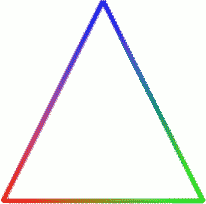
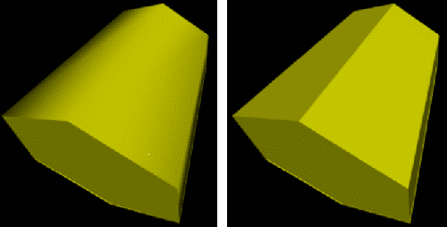
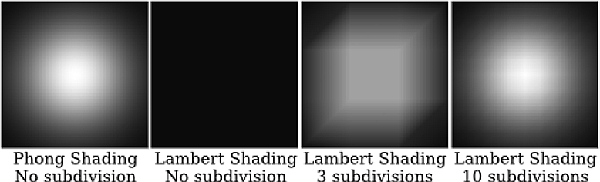
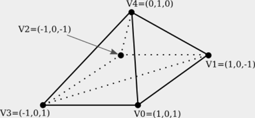
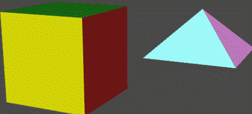
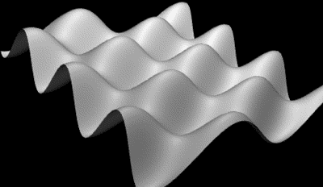
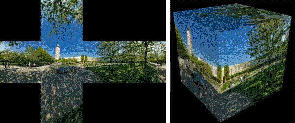

...menustart

 - [Chapter 5 Three.js: A 3D Scene Graph API](#2f919e61bdb79078128c481d71fd720b)
     - [5.1 Three.js Basics](#14e4a4fe172e55cfa45e6ca746e28e5b)
         - [5.1.1  Scene, Renderer, Camera](#11264913f1512eb55f68818fa592eccd)
         - [5.1.2  THREE.Object3D](#ee13f30b73ddd35611705260b1c59a55)
         - [5.1.3  Object, Geometry, Material](#c85bd0f12f8ccf0590a0f94a07d4f485)
         - [5.1.4  Lights](#f5fb4ac9a33c1420ea3ab24bb4862f2a)
         - [5.1.5  A Modeling Example  (TODO)](#7875c6ab7291f7ebf883ff4e54577cd0)
     - [5.2 Building Objects](#ac25e95e050cf746608c774cbf3bbfa1)
         - [5.2.1  Indexed Face Sets](#c32a740d9368792da43e9d5b31e198b3)
         - [5.2.2  Curves and Surfaces ( TODO )](#63048108e85b88474903113a83294634)
         - [5.2.3  Textures](#bb9f792c2deb60dc6a34f27a8b34272e)
         - [5.2.4  Transforms](#6b780b49cb849f516f778d2b37ec3360)
         - [5.2.5  Loading JSON Models](#d2b076d05d575eff735326dbcef8bcb7)
     - [5.3 Other Features](#7238dee8fcef92918d2c3b043796faa1)
         - [5.3.2  User Input (TODO)](#e0d87f90aa1ac53a7994aed8dbe3f25a)
         - [5.3.3  Shadows](#8d080d15b3503afbab1f4b88d57797e2)
         - [5.3.4  Cubemap Textures and Skyboxes](#e347cba73e770eb5ea399889e4f575ba)
         - [5.3.5  Reflection and Refraction](#2d3ad59ecbb3d0404bf4c488f7336c93)
     - [Blender -> Three.js](#472673a7cd60b3501ca207fabbc88de5)
         - [rendered as same looking in blender](#ada1d3b53e891b194499e8c02e868022)

...menuend


<h2 id="2f919e61bdb79078128c481d71fd720b"></h2>


# Chapter 5 Three.js: A 3D Scene Graph API

 - [three.js](https://github.com/mrdoob/three.js) a is higher-level  API for 3D web graphics that is built on top of WegGL.
    - There are several reasons for starting at this high level. 
    - It will allow you to see how some of the things that you have learned are used in a modern graphics package. 
    - It will allow me to introduce some new features such as shadows and environment mapping. 
    - It will let you work with a graphics library that you might use in real web applications.
    - And it will be a break from the low-level detail we have been dealing with, before we move on to an even lower level.

<h2 id="14e4a4fe172e55cfa45e6ca746e28e5b"></h2>


## 5.1 Three.js Basics

 - Three.js is an object-oriented JavaScript library for 3D graphics.
    - https://mrdoob.com/
    - Three.js uses concepts that you are already familiar with, such as geometric objects, transformations, lights, materials, textures, and cameras. 
    - But it also has additional features that build on the power and flexibility of WegGL.
 - download: https://threejs.org/
    - The download is quite large, since it includes many examples and support files. 
    - In this book, I use Release 89 of the software, from December, 2017.
    - (Unfortunately, the API has not been as stable as I had hoped. Example in this book should work with Release 89 but might not work with other releases of three.js.)  
 - The core features of three.js are defined in a single large JavaScript file named "three.js", which can be found in a build directory in the download. 
    - There is also a smaller "minified" version, three.min.js, that contains the same definitions in a format that is not meant to be human-readable.
    - You can also find them in website: http://math.hws.edu/graphicsbook/source/threejs/
 - To use three.js on a web page, you need to include one of the two scripts in a `<script>` element on the page.
    - 
    ```js
    <script src="three.min.js"></script>
    ```
 - In addition to this core, the three.js download has a directory containing many examples and a variety of support files that are used in the examples. 


<h2 id="11264913f1512eb55f68818fa592eccd"></h2>


### 5.1.1  Scene, Renderer, Camera

 - Three.js works with the HTML `<canvas>` element.
 - The basic procedure is to build a scene graph out of three.js objects, and then to render an image of the scene it represents. 
    - Animation can be implemented by modifying properties of the scene graph between frames.
 - The three.js library is made up of a large number of classes.  Three of the most basic are 
    - THREE.Scene, 
    - THREE.Camera, 
    - THREE.WebGLRenderer. 
 - A three.js program will need at least one object of each type.
 - Those objects are often stored in global variables 
    - `var scene, renderer, camera;`
 - Note that almost all of the three.js classes and constants are properties of an object named THREE, and their names begin with "`THREE.`"
 - A *Scene* object is a holder for all the objects that make up a 3D world, 
    - including lights, graphical objects, and possibly cameras. 
    - It acts as a root node for the scene graph.
 - A *Camera* is a special kind of object that represents a viewpoint from which an image of a 3D world can be made. 
    - It represents a combination of a *viewing transformation* and a *projection*. 
 - A *WebGLRenderer* is an object that can create an image from a scene graph.
 - The scene is the simplest of the three objects. 
    - 
    ```js
    scene = new THREE.Scene();
    ```
 - The function `scene.add(item)` can be used to add cameras, lights, and graphical objects to the scene.
 - The function `scene.remove(item)`, which removes an item from the scene, is also occasionally useful.

---

 - There are two kinds of camera, one using *orthographic projection* and one using *perspective projection*. 
    - They are represented by classes THREE.OrthographicCamera and THREE.PerspectiveCamera, which are subclasses of THREE.Camera. 

```js
camera = new THREE.OrthographicCamera( left, right, top, bottom, near, far );
or
camera = new THREE.PerspectiveCamera( fieldOfViewAngle, aspect, near, far );
```

 - The parameters for the orthographic camera specify the x, y, and z limits of the view volume, in *eye coordinates*
    - that is, in a coordinate system in which the camera is at (0,0,0) looking in the direction of the negative z-axis, with the y-axis pointing up in the view. 
    - The near and far parameters give the z-limits in terms of distance from the camera.
    - For an orthographic projection, near can be negative, putting the "near" clipping plane in back of the camera. 
    - The parameters are the same as for the OpenGL function glOrtho(), except for 
        - reversing the order of the two parameters that specify the top and bottom clipping planes.
 - Perspective cameras are more common. 
    - The parameters for the perspective camera come from the function gluPerspective() in OpenGL's GLU library. 
    - The first parameter determines the vertical extent of the view volume, given as an angle measured in degrees. 
    - The aspect is the ratio between the horizontal and vertical extents; it should usually be set to the width of the canvas divided by its height. 
    - And near and far give the z-limits on the view volume as distances from the camera.
    - For a perspective projection, both must be positive, with near less than far.  
    - 
    ```js
    camera = new THREE.PerspectiveCamera( 45, canvas.width/canvas.height, 1, 100 );
    ```
    - The near and far values mean that only things between 1 and 100 units in front of the camera are included in the image. 
 - A camera, like other objects, can be added to a scene, but it does not have to be part of the scene graph to be used. 
    - You might add it to the scene graph if you want it to be a parent or child of another object in the graph.
    - In any case, you will generally want to apply a  modeling transformation to the camera to set its position and orientation in 3D space.
 - The three.js download includes several examples of alternative renderer classes, which can render to different targets.
    - For example, there is a CanvasRenderer that translates 3D graphics into the 2D canvas API that was covered in Section 2.6.
    - Other renderers can render 3D graphics using SVG and even CSS.
    - However, these alternative renderers do not support many features of the WebGL renderer. This book will only use the WebGL renderer.
 - A renderer that renders using WebGL is an instance of the class THREE.WebGLRenderer. 
    - Its constructor has one parameter, which is a JavaScript object containing settings that affect the renderer. 
    - The settings you are most likely to specify are canvas, which tells the renderer where to draw, 
    - and antialias, which asks the renderer to use antialiasing if possible:
    - 
    ```js
    renderer = new THREE.WebGLRenderer( {
                         canvas: theCanvas,
                         antialias: true
                     } );
    ```
 - The main thing that you want to do with a renderer is render an image.
    - For that, you also need a scene and a camera. 
    - To render an image of a given scene from the point of view of a given camera, call
    - 
    ```js
    renderer.render( scene, camera );
    ```
 - This is really the central command in a three.js application.
 - I should note that most of the examples that I have seen do not provide a canvas to the renderer; 
    - instead, they allow the renderer to create it. 
    - The canvas can then be obtained from the renderer and added to the page.  
    - Furthermore, the canvas typically fills the entire browser window. See [full-window.html](http://math.hws.edu/graphicsbook/source/threejs/full-window.html)


<h2 id="ee13f30b73ddd35611705260b1c59a55"></h2>


### 5.1.2  THREE.Object3D

 - A three.js scene graph is made up of objects of type THREE.Object3D(including objects that belong to subclasses of that class). 
    - Cameras, lights, and visible objects are all represented by subclasses of Object3D. 
    - In fact, THREE.Scene itself is also a subclass of Object3D.
 - Any Object3D contains a list of child objects, which are also of type Object3D.
    - The child lists define the structure of the scene graph. 
    - If node and object are of type Object3D, then the method node.add(object) adds object to the list of children of node.
    - The method node.remove(object) can be used to remove an object from the list.
 - A three.js scene graph must, in fact, be a tree. 
    - An Object3D, obj, has a property obj.parent that points to the parent of obj in the scene graph, if any. 
    - You should never set this property directly. It is set automatically when the node is added to the child list of another node.
    - If obj already has a parent when it is added as a child of node, then obj is first removed from the child list of its current parent before it is added to the child list of node.
 - The children of an Object3D, obj, are stored in a property named obj.children, which is an ordinary JavaScript array.
    - However, you should always use obj.add() and obj.remove().
 - To make it easy to duplicate parts of the structure of a scene graph, Object3D defines a clone() method. 
    - This method copies the node, including the recursive copying of the children of that node. 
    - This makes it easy to include multiple copies of the same structure in a scene graph:

```js
var node = THREE.Object3D();
      .
      .  // Add children to node.
      .
scene.add(node);
var nodeCopy1 = node.clone();
      .
      .  // Modify nodeCopy1, maybe apply a transformation.
      .
scene.add(nodeCopy1)
var nodeCopy2 = node.clone();
      .
      .  // Modify nodeCopy2, maybe apply a transformation.
      .
scene.add(nodeCopy2);
```

 - An Object3D, obj, has an associated transformation, which is given by properties obj.scale, obj.rotation, and obj.position.
    - The object is first scaled, then rotated, then translated according to the values of these properties. 
    - (Transformations are actually more complicated than this, but we will keep things simple for now and will return to the topic later.)
 - The values of obj.scale and obj.position are objects of type THREE.Vector3. 
    - (There are similar classes THREE.Vector2 and THREE.Vector4 for vectors in 2 and 4 dimensions.) 
    - 
    ```js
    var v = new THREE.Vector3( 17, -3.14159, 42 );
    ```
    - This vector object has properties v.x, v.y, and v.z representing the coordinates. 
    - values can be set : `v.x = 10;  v.set(x,y,z)`
    - The Vector3 class also has many methods implementing vector operations such as addition, dot product, and cross product.
 - For an Object3D, the properties obj.scale.x, obj.scale.y, and obj.scale.z give the amount of scaling.
    - Similarly, the properties obj.position.x, obj.position.y, and obj.position.z give the translation amounts.
    - The object obj.rotation has properties obj.rotation.x, obj.rotation.y, and obj.rotation.z that represent rotations.
        - The angles are measured in radians. 
        - The object is rotated first about the x-axis, then about the y-axis, then about the z-axis. (It is possible to change this order.) 
        - The value of obj.rotation is not a vector. Instead, it belongs to a similar type, THREE.Euler, and the angles of rotation are called *Euler angles*.

<h2 id="c85bd0f12f8ccf0590a0f94a07d4f485"></h2>


### 5.1.3  Object, Geometry, Material

 - A visible object in three.js is made up of either points, lines, or triangles. 
 - An individual object corresponds to an OpenGL primitive such as GL_POINTS, GL_LINES, or GL_TRIANGLES.
 - There are five classes to represent these possibilities:
    - THREE.Points for points, 
    - THREE.Mesh for triangles, 
    - and three classes for lines: 
        - THREE.Line, which uses the GL_LINE_STRIP,
        - THREE.LineSegments, which uses the GL_LINES ,
        - THREE.LineLoop, which uses the GL_LINE_LOOP
 - A visible object is made up of some geometry plus a *material*.
    - In three.js, the geometry and material of a visible object are themselves represented by JavaScript classes THREE.Geometry and THREE.Material.
 - An object of type THREE.Geometry has a property named *vertices* that is an array of Vector3. 
    - When creating a geometry by hand, we can simply push vectors onto that array. 
    - For example, suppose that we want to represent a cloud of 1000 random points inside the sphere of radius one centered at the origin:

```js
var points = new THREE.Geometry();
while ( points.vertices.length < 1000 ) {
    var x = 2*Math.random() - 1;  // (between -1 and 1)
    var y = 2*Math.random() - 1;
    var z = 2*Math.random() - 1;
    if ( x*x + y*y + z*z < 1 ) { // use vector only if length is less than 1
        var pt = new THREE.Vector( x, y, z );
        points.vertices.push(pt);
    }
}
```

 - To make this point cloud into a visible object, we also need a material. 
 - For an object of type THREE.Points, we can use a material of type THREE.PointsMaterial, which is a subclass of Material. 
    - The material can specify the color and the size of the points, among other properties:
    -
    ```js
    var pointMaterial = new THREE.PointsMaterial( {
                  color: "yellow",
                  size: 2,
                  sizeAttenuation: false;
              } );
    ```
    - Default sizeAttenuation is true. 
        - it means  the size is scaled to reflect distance from the viewer.
        - if sizeAttenuation is false, the size is given in pixels; 
    - If the color is omitted, a default value of white is used. 
    - The default for size is 1 .
    - A PointsMaterial is not affected by lighting; it simply shows the color specified by its color property.
    - It is also possible to assign values to properties of the material after the object has been created.
    -
    ```js
    var pointMaterial = new THREE.PointsMaterial();
    pointMaterial.color = new THREE.Color("yellow");
    pointMaterial.size = 2;
    pointMaterial.sizeAttenuation = false;
    ```
    - Note that the color is set as a value of type THREE.Color, which is constructed from a string, "yellow". 
 - Once we have the geometry and the material, we can use them to create the visible object, of type THREE.Points, and add it to a scene:

```
var sphereOfPoints = new THREE.Points( points, pointMaterial );
scene.add( sphereOfPoints );
```

 - Colors in three.js are stored as values of type THREE.Color. 
    - The class THREE.Color represents an RGB color. 
    - A Color object c has properties c.r, c.g, and c.b , value is from 0.0 to 1.0. 
    - Note that there is no alpha component; three.js handles transparency separately from color.
 - There are several ways to construct a THREE.Color object. 
    - examples include "white", "red", "rgb(255,0,0)", and "#FF0000". 
    - Or the color constructor can take a single integer parameter in which each color component is given as an eight-bit field in the integer. 
        - i.e. `0xff0000` for red

```js
var c1 = new THREE.Color("skyblue");
var c2 = new THREE.Color(1,1,0);  // yellow
var c3 = new THREE.Color(0x98fb98);  // pale green
```

- A WebGLRenderer object has a "clear color" property that is used as the background color when the renderer renders a scene. 
    - This property could be set using any of the following commands:

```js
renderer.setClearColor( new THREE.Color(0.6, 0.4, 0.1) );
renderer.setClearColor( "darkgray" );
renderer.setClearColor( 0x112233 );
```

---

 - An object of type THREE.Line represents a line strip.  THREE.LineLoop represents a looped line strip.
    - For the outline of a triangle, for example, we can push three vertices onto the vertex array of a geometry object, and then use that geometry in a THREE.LineLoop object:

```js
var lineGeom = new Geometry();
lineGeom.vertices.push( new THREE.Vector3(-2,-2,0) );
lineGeom.vertices.push( new THREE.Vector3(2,-2,0) );
lineGeom.vertices.push( new THREE.Vector3(0,2,0) );
```

 - Alternatively, we could create a new array containing the vertices and then assign that array to the property lineGeom.vertices:

```js
lineGeom.vertices = [
    new THREE.Vector3(-2,-2,0),
    new THREE.Vector3(2,-2,0),
    new THREE.Vector3(0,2,0),
];
```

 - We will also need a material. 
 - For lines, the material can be represented by an object of type THREE.LineBasicMaterial. 

```js
var lineMat = new THREE.LineBasicMaterial( {
    color:  0xA000A0,  // purple; the default is white
    linewidth: 2       // 2 pixels; the default is 1
} );
```

 - With the geometry and material in hand, we can create a LineLoop object.

```js
var line = new THREE.LineLoop( lineGeom, lineMat );
```

 - Let's look at one more option: using a different color for each vertex.
    - To do this, you need to add vertex colors to the Geometry object. 

```js
var lineGeom = new THREE.Geometry();
lineGeom.vertices.push( new THREE.Vector3(-2,-2,0) );
lineGeom.vertices.push( new THREE.Vector3(2,-2,0) );
lineGeom.vertices.push( new THREE.Vector3(0,2,0) );
lineGeom.colors.push( new THREE.Color(0xff0000) );
lineGeom.colors.push( new THREE.Color(0x00ff00) );
lineGeom.colors.push( new THREE.Color(0x0000ff) );
var lineMat = new THREE.LineBasicMaterial({
        linewidth: 3,
        vertexColors: THREE.VertexColors
    });
var triangle = new THREE.LineLoop( lineGeom, lineMat );
scene.add(triangle);  // scene is of type THREE.Scene
```

 - This produces the image:
    - 
 - The "Basic" in LineBasicMaterial indicates that this material uses basic colors that do not require lighting to be visible and are not affected by lighting. 
    - This is generally what you want for lines.

---

 - A mesh object in three.js corresponds to the OpenGL primitive GL_TRIANGLES. 
    - The geometry object for a mesh must specify the triangles, in addition to the vertices. 
    - However, three.js comes with classes to represent common mesh geometries, such as a sphere, a cylinder, and a torus.
    - For these built-in classes, you just need to call a constructor to create the geometry. 
    - 
    ```js
    new THREE.CylinderGeometry(radiusTop, radiusBottom, height,
           radiusSegments, heightSegments, openEnded, thetaStart, thetaLength)
    ```
 - Other standard mesh geometries are similar. Here are some constructors, listing all parameters (but keep in mind that most of the parameters are optional):

```js
new THREE.BoxGeometry(width, height, depth,
                         widthSegments, heightSegments, depthSegments)
new THREE.PlaneGeometry(width, height, widthSegments, heightSegments)
// a disk with a smaller disk removed from its center. x-y
new THREE.RingGeometry(innerRadius, outerRadius, thetaSegments, phiSegments,
                         thetaStart, thetaLength)
// as CylinderGeometry, with the radiusTop set to zero. 
new THREE.ConeGeometry(radiusBottom, height, radiusSegments, 
                         heightSegments, openEnded, thetaStart, thetaLength)

new THREE.SphereGeometry(radius, widthSegments, heightSegments,
                         phiStart, phiLength, thetaStart, thetaLength)
                         
new THREE.TorusGeometry(radius, tube, radialSegments, tubularSegments, arc)
```


 - There are also geometry classes representing the  regular polyhedra: 
    - THREE.TetrahedronGeometry, THREE.OctahedronGeometry, THREE.DodecahedronGeometry, and THREE.IcosahedronGeometry. 

---

 - To create a mesh object, you need a material as well as a geometry. 
 - There are several kinds of material suitable for mesh objects, including THREE.MeshBasicMaterial, THREE.MeshLambertMaterial, and THREE.MeshPhongMaterial. 
    - (There are also two newer mesh materials, THREE.MeshStandardMaterial and THREE.MeshPhysicalMaterial, that implement techniques associated with  physically based rendering, an approach to improved rendering that has become popular recently. )
 - A MeshBasicMaterial represents a color that is not affected by lighting; 
    - it looks the same whether or not there are lights in the scene, and it is not shaded, giving it a flat rather than 3D appearance.
 - The other two classes represent materials that need to be lit to be seen. They implement models of lighting known as *Lambert shading* and *Phong shading*. 
    - The major difference is that MeshPhongMaterial has a specular color but MeshLambertMaterial does not. 
    - Both can have diffuse and emissive colors.

```js
var mat = new THREE.MeshPhongMaterial( {
          color: 0xbbbb00,     // reflectivity for diffuse and ambient light
          emissive: 0,         // emission color; this is the default (black)
          specular: 0x070707,  // reflectivity for specular light
          shininess: 50        // controls size of specular highlights
    } );
```

 - A Lambert material lacks specular and shininess, and a basic mesh material has only the color parameter.
 - There are a few other material properties that you might need to set in the constructor. Except for flatShading, these apply to all three kinds of mesh material:
    - wireframe
        - a boolean value that indicates whether the mesh should be drawn as a wireframe model
        - A true value works best with MeshBasicMaterial.
    - wireframeLinewidth
        - in pixels, default is 1.
    - visible
        - controls whether rendered or not
    - side 
        - THREE.FrontSide, THREE.BackSide, or THREE.DoubleSide, with the default being THREE.FrontSide.
    - flatShading
        - default being false. 
        - When making a Lambert or Phong material for an object that is supposed to look "faceted," with flat sides, it is important to set this property to true. 
        - That would be the case, for example, for a cube or for a cylinder with a small number of sides. 
        - The property is not used by MeshBasicMaterial.
 - As an example, let's make a shiny, blue-green, open, five-sided tube with flat sides:

```js
var mat = new THREE.MeshPhongMaterial( {
       color: 0x0088aa, 
       specular: 0x003344, 
       shininess: 100,
       flatShading: true,  // for flat-looking sides
       side: THREE.DoubleSide  // for drawing the inside of the tube
    } );
var geom = new THREE.CylinderGeometry(3,3,10,5,1,true);
var obj = new THREE.Mesh(geom,mat);
scene.add(obj);
```

 - smooth vs flat :
    - 

 - Drawing two objects at exactly the same depth can be a problem for the *depth test*. 
 - You might remember hat OpenGL uses polygon offset to solve the problem.
 - In three.js, you can apply polygon offset to a material. For example:

```js
mat = new THREE.MeshLambertMaterial({
      polygonOffset: true,  
      polygonOffsetUnits: 1,
      polygonOffsetFactor: 1,
      color: "yellow",
      side: THREE.DoubleSide
  });
```

 - The settings shown here for polygonOffset, polygonOffsetUnits, and polygonOffsetFactor will increase the depth of the object
 - One final note: You don't always need to make new materials and geometries to make new objects. You can reuse the same materials and geometries in multiple objects.

<h2 id="f5fb4ac9a33c1420ea3ab24bb4862f2a"></h2>


### 5.1.4  Lights

 - Compared to geometries and materials, lights are easy!
 - Three.js has several classes to represent lights. 
 - Light classes are subclasses of THREE.Object3D.
 - A light object can be added to a scene and will then illuminate objects in the scene. 
 - We'll look at directional lights, point lights, ambient lights, and spotlights.

 - THREE.DirectionalLight .
    - light shines from the given position towards the origin.
    - The default position is the vector (0,1,0), which gives a light shining down the y-axis.
    - 
    ```js
    new THREE.DirectionalLight( color, intensity )
    ```
    - color specifies the color of the light, given as a THREE.Color object, or as a hexadecimal integer, or as a CSS color string. 
    - **Lights do not have separate diffuse and specular colors**, as they do in OpenGL. 
    - The intensity is a non-negative number that controls the brightness of the light, with larger values making the light brighter.
        - optional, 
    - The default for color is white (0xffffff) and for intensity is 1.
    - The intensity can be greater than 1, but values less than 1 are usually preferable, to avoid having too much illumination in the scene.
    - 
    ```js
    var light = new THREE.DirectionalLight(); // default white light
    light.position.set( 0, 0, 1 );
    scene.add(light);
    ``` 
 - The class THREE.PointLight represents a light that shines in all directions from a point. 
    - 
    ```js
    new THREE.PointLight( color, intensity, cutoff )
    ```
    - cutoff is a non-negative number.
        - If the value is 0, which is the default, then the illumination from the light extends to infinity , and intensity does not decrease with distance. 
            - While this is not physically realistic, it generally works well in practice.
        - If cutoff is greater than zero, then the intensity falls from a maximum value at the light's position down to an intensity of zero at a distance of cutoff from the light; 
            - the light has no effect on objects that are at a distance greater than cutoff. 
            - 光源衰减
 - A third type of light is THREE.AmbientLight, to add ambient light to a scene. 
    - 
    ```js
    new THREE.AmbientLight( color )
    ```
    - The color components of an ambient light should be rather small to avoid washing out colors of objects.
 - The fourth type of light, THREE.SpotLight, is something new for us. 聚光灯
    - similar to a point light, except that instead of shining in all directions, a spotlight only produces a cone of light. 
    - The vertex of the cone is located at the position of the light.
    - By default, the axis of the cone points from that location towards the origin.
        - so unless you change the direction of the axis, you should move the position of the light away from the origin.
    - 
    ```js
    new THREE.SpotLight( color, intensity, cutoff, coneAngle, exponent )
    ```
    - The coneAngle is a number between 0 and Math.PI/2 that determines the size of the cone of light.The default value is Math.PI/3. 
    - The exponent is a non-negative number that determines how fast the intensity of the light decreases as you move from the axis of the cone toward the side. 
        - 中心轴 到 锥体边缘的 衰减速率
        - The default value, 10, gives a reasonable result. 
        - An exponent of zero gives no falloff at all, so that objects at all distances from the axis are evenly illuminated.
    - The technique for setting the direction of a three.js spotlight is a little odd, but it does make it easy to control the direction. 
        - An object spot of type SpotLight has a property named spot.target. 
        - The target is a scene graph node. The cone of light  is pointed in the direction from spotlight's position towards the target's position. 
        - When a spotlight is first created, its target is a new, empty Object3D, with position at (0,0,0). 
    - For three.js to calculate the spotlight direction, a target whose position is anything other than the origin must actually be a node in the scene graph. 
    - For example, suppose we want a spotlight located at the point (0,0,5) and pointed towards the point (2,2,0):
    -
    ```js
    spotlight = new THREE.SpotLight();
    spotlight.position.set(0,0,5);
    spotlight.target.position.set(2,2,0);
    scene.add(spotlight);
    scene.add(spotlight.target);
    ```
 - The interaction of spotlights with material illustrates an important difference between Phong and Lambert shading.
    - With a MeshLambertMaterial, the  lighting equation is applied at the vertices of a primitive, and the vertex colors computed by that equation are then interpolated to calculate colors for the pixels in the primitive. 
    - With MeshPhongMaterial, on the other hand, the lighting equation is applied at each individual pixel. 
    - The following illustration shows what can happen when we shine a spotlight onto a square that was created using THREE.PlaneGeometry:
    - 
    - For the two squares on the left, the square was not subdivided; it is made up of two triangular faces. 
        - in the second picture, I got no illumination at all! The vertices of the the square lie outside the cone of light from the spotlight. 
        - When the lighting equation is applied, the vertices are black, and the black color of the vertices is then applied to all the pixels in the square.
 - The upshot is, if you want an object to be properly illuminated by a spotlight, use a **MeshPhongMaterial** on the object, even if it has no specular reflection. 
 - A MeshLambertMaterial will only give acceptable results if the faces of the object are very small.

<h2 id="7875c6ab7291f7ebf883ff4e54577cd0"></h2>


### 5.1.5  A Modeling Example  (TODO)

 - Now you already know enough to build 3D models from basic geometric objects. An example is in the sample program [threejs/diskworld-1.html](http://math.hws.edu/graphicsbook/source/threejs/diskworld-1.html).

---

<h2 id="ac25e95e050cf746608c774cbf3bbfa1"></h2>


## 5.2 Building Objects

 - In this section, we will see how to create new mesh geometries from scratch. 
 - We'll also look at some of the other support that three.js provides for working with objects and materials.

<h2 id="c32a740d9368792da43e9d5b31e198b3"></h2>


### 5.2.1  Indexed Face Sets

 - A mesh in three.js is what we called an indexed face set in Subsection 3.4.1.
 - In a three.js mesh, all the polygons are triangles.  
 - A geometry in three.js is an object of type THREE.Geometry.  Any geometry object contains an array of vertices, represented as objects of type THREE.Vector3.
 - For a mesh geometry, it also contains an array of faces, represented as objects of type THREE.Face3. 
 - Each object of type Face3 specifies one of the triangular faces of the geometry. 
 - The three vertices of the triangle are specified by three integers. Each integer is an index into the geometry's vertex array. 
 - 
 ```js
 var f = new THREE.Face3( 0, 7, 2 );
 ```
 - The three indices are stored as properties f.a, f.b, and f.c of the face object. 
 - As an example, let's see how to directly create a three.js geometry for this pyramid:
    - 

```js
var pyramidGeom = new THREE.Geometry();

pyramidGeom.vertices = [  // array of Vector3 giving vertex coordinates
        new THREE.Vector3( 1, 0, 1 ),    // vertex number 0
        new THREE.Vector3( 1, 0, -1 ),   // vertex number 1
        new THREE.Vector3( -1, 0, -1 ),  // vertex number 2
        new THREE.Vector3( -1, 0, 1 ),   // vertex number 3
        new THREE.Vector3( 0, 1, 0 )     // vertex number 4
    ];
    
pyramidGeom.faces = [  // array of Face3 giving the triangular faces
        new THREE.Face3( 3, 2, 1 ),  // first half of the bottom face
        new THREE.Face3 3, 1, 0 ),   // second half of the bottom face
        new THREE.Face3( 3, 0, 4 ),  // remaining faces are the four sides
        new THREE.Face3( 0, 1, 4 ),
        new THREE.Face3( 1, 2, 4 ),
        new THREE.Face3( 2, 3, 4 )
    ];
```

 - Note that the order of the vertices on a face is not completely arbitrary:
    - They should be listed in counterclockwise order as seen from in front of the face, that is, looking at the face from the outside of the pyramid.
 - This pyramid geometry as given will work with a MeshBasicMaterial, but to work with lit materials such as MeshLambertMaterial or MeshPhongMaterial, the geometry needs normal vectors.
    - If the geometry has no normal vectors, Lambert and Phong materials will appear black. 
    - It is possible to assign the normal vectors by hand, but you can also have three.js compute them for you.
    - 
    ```js
    pyramidGeom.computeFaceNormals();
    ```
    - This method computes one normal vector for each face, where the normal is perpendicular to the face. 
        - This is sufficient if the material is using flat shading; that is, if the material's flatShading property is set to true. 
    - But when an object is supposed to look smooth rather than faceted, it needs a normal vector for each vertex rather than one for each face. 
    - A Face3 has an array of three vertex normals. 
        - They can be set by hand, 
        - or Three.js can compute by averaging the normals of all faces that share a vertex. 
    -
    ```js
    geom.computeVertexNormals();
    ``` 
    - Note that the face normals must already exist before computeVertexNormals is called, so that usually you will call geom.computeVertexNormals() immediately after calling geom.computeFaceNormals(). 
    - A geometry that has face normals but not vertex normals will not work with a material whose flatShading property has the default value, false. 
        - To make it possible to use smooth shading on a surface like the pyramid, all of the vertex normals of each face should be set equal to its face normal. 
        - In that case, even with smooth shading, the pyramid's side will look flat. 
        - Standard three.js geometries such as BoxGeometry come with correct face and vertex normals.
        - Q: 所以只能手动设置？
 - The face normal for an object, face, of type THREE.Face3 is stored in the property face.normal. 
 - The vertex normals are stored in face.vertexNormals, which is an array of three Vector3. 

---

 - With a full set of normal vectors, the pyramid is ready to be used with any of the mesh materials that we have covered, but it looks a little boring with just one color.
 - It's possible to use several colors on one mesh. 
    - To do that, you can supply an array of materials to the mesh object constructor, instead of a single material. 
    - This makes it possible to apply different materials to different faces. 
 - For example, here is how to make a cube with different materials on its six sides:

```js
var cubeGeom = new THREE.BoxGeometry(10,10,10);
var cubeMaterials =  [
    new THREE.MeshPhongMaterial( { color: "red" } ),     // for the +x face
    new THREE.MeshPhongMaterial( { color: "cyan" } ),    // for the -x face
    new THREE.MeshPhongMaterial( { color: "green" } ),   // for the +y face
    new THREE.MeshPhongMaterial( { color: "magenta" } ), // for the -y face
    new THREE.MeshPhongMaterial( { color: "blue" } ),    // for the +z face
    new THREE.MeshPhongMaterial( { color: "yellow" } )   // for the -z face
];
var cube = new THREE.Mesh( cubeGeom, cubeMaterials );
```

 - For this to work with a geometry, each face of the geometry needs a "material index." 
    - Note that a box geometry has 12 faces, since each rectangular side is divided into two triangular faces.
    - The two triangles that make up a rectangular side have the same material index. 
    - (BoxGeometry is the only standard geometry that I can find that comes with non-zero material indices. The default value for the material index is zero.)
 - Suppose that we want to use different materials on each side of the pyramid that was created above. 
    - each face needs a material index, which is stored in a property of the face named materialIndex.
    - For the pyramid, the first two faces in the array of faces make up the square base of the pyramid. They should probably have the same material index. 

```js
pyramidGeom.faces[0].materialIndex = 0;
for (var i = 1; i <= 5; i++) {
    pyramidGeom.faces[i].materialIndex = i-1;
}
```

 - 

---

 - There is another way to assign a different color to each face of a mesh object:
    - It is possible to store the colors as properties of the face objects in the geometry. You can then use an ordinary material on the object, instead of an array of materials. 
    - But you also have to tell the material to use the colors from the geometry in place of the material's color property.

```js
pyramidGeom.faces[0].color = new THREE.Color(0xCCCCCC);
pyramidGeom.faces[1].color = new THREE.Color(0xCCCCCC);
pyramidGeom.faces[2].color = new THREE.Color("green");
pyramidGeom.faces[3].color = new THREE.Color("blue");
pyramidGeom.faces[4].color = new THREE.Color("yellow");
pyramidGeom.faces[5].color = new THREE.Color("red");

// the vertexColors must be THREE.FaceColors
// which default is THREE.NoColors
material = new THREE.MeshLambertMaterial({
        vertexColors: THREE.FaceColors,
        shading: THREE.FlatShading
    });
```

 - A second way to apply color to a face is to apply a different color to each vertex of the face. 
    - Each face object has a property named vertexColors whose value should be an array of three THREE.Color objects, one for each vertex of the face.
    - To use these colors, the vertexColors property of the material has to be set to THREE.VertexColors.


<h2 id="63048108e85b88474903113a83294634"></h2>


### 5.2.2  Curves and Surfaces ( TODO )

 - In addition to letting you build indexed face sets, three.js has support for working with curves and surfaces that are defined mathematically.
    - Some of the possibilities are illustrated in the sample program [threejs/curves-and-surfaces.html](http://math.hws.edu/graphicsbook/source/threejs/curves-and-surfaces.html)
 - Parametric surfaces are the easiest to work with. 
    - A parametric surface is defined by a mathematical function f(u,v), where u and v are numbers, and each value of the function is a point in space. 
    - The surface consists of all the points that are values of the function for u and v in some specified ranges. 
    - A parametric surface geometry is created by evaluating the function at a grid of uv points. 
    - In three.js, the values of u and v are always in the range 0.0 to 1.0. The geometry is created by a constructor
    - 
    ```js
    new THREE.ParametricGeometry( func, slices, stacks )
    ```
    - where func is the JavaScript function and slices and stacks determine the number of points in the grid; 
        - slices gives the number of subdivisions of the interval from 0 to 1 in the u direction, and stacks, in the v direction. 
        - it should return a THREE.Vector3 object
    - Once you have the geometry, you can use it to make a mesh in the usual way. Here is an example, from the sample program:
    - 
    - This surface is defined by the function

```js
function surfaceFunction( u, v ) {
    var x,y,z;  // A point on the surface, calculated from u,v.
                // u  and v range from 0 to 1.
    x = 20 * (u - 0.5);  // x and z range from -10 to 10
    z = 20 * (v - 0.5);
    y = 2*(Math.sin(x/2) * Math.cos(z));
    return new THREE.Vector3( x, y, z );
}

```

 - and the three.js mesh that represents the surface is created using

```jd
var surfaceGeometry = new THREE.ParametricGeometry(surfaceFunction, 64, 64);
var surface = new THREE.Mesh( surfaceGeometry, material );
```

 - Curves are more complicated in three.js (and, unfortunately, the API for working with curves is not very consistent). 
 - **TODO**


<h2 id="bb9f792c2deb60dc6a34f27a8b34272e"></h2>


### 5.2.3  Textures

 - In three.js, an image texture is represented by an object of type THREE.Texture.
 - Image textures are usually created using the load function in an object of type THREE.TextureLoader. 
    - The function takes a URL (a web address, usually a relative address) as parameter and returns a Texture object:

```js
var loader = new THREE.TextureLoader();
var texture = loader.load( imageURL );
```

 - A texture in three.js is considered to be part of a material. To apply a texture to a mesh, 
    - 
    ```js
    material.map = texture;
    ```
    - The map property can also be set in the material constructor. 
    - All three types of mesh material (Basic, Lambert, and Phong) can use a texture. 
    - In general, the material base color will be white, since the material color will be multiplied by colors from the texture.
    - The texture coordinates that are needed to map the image to a mesh are part of the mesh geometry. 
    - The standard mesh geometries such as THREE.SphereGeometry come with texture coordinates already defined.
 - That's the basic idea: create a texture object from an image URL and assign it to the map property of a material. 
    - However, there are complications.  Image loading is "asynchronous." 
 - In fact, the load function in a TextureLoader has several optional parameters:

```js
loader.load( imageURL, onLoad, undefined, onError );
```

 - The third parameter here is given as undefined because that parameter is no longer used. 
 - The onLoad and onError parameters are callback functions. For example, if there is a function render() that renders the scene, then render itself could be used as the onLoad function:

```js
var texture = new THREE.TextureLoader().load( "brick.png", render );
```

 - Another possible use of onLoad would be to delay assigning the texture to a material until the image has finished loading.
    - If you do change the value of material.map, be sure to set
    - 
    ```js
    material.needsUpdate = true;
    ```
    - to make sure that the change will take effect when the object is redrawn.
 - A Texture has a number of properties that can be set, including properties to set the minification and magnification filters for the texture and a property to control the generation of mipmaps, which is done automatically by default. 
    - The properties that you are most likely to want to change are 
        - the wrap mode for texture coordinates outside the range 0 to 1 
        - and the texture transformation. 
 - For a Texture object tex, the properties tex.wrapS and tex.wrapT control how s and t texture coordinates outside the range 0 to 1 are treated.
    - The default is "clamp to edge."
    - You will most likely want to make the texture repeat in both directions by setting the property values to THREE.RepeatWrapping:

```js
tex.wrapS = THREE.RepeatWrapping;
tex.wrapT = THREE.RepeatWrapping;
```

 - RepeatWrapping works best with "seamless" textures, where the top edge of the image matches up with the bottom edge and the left edge with the right. 
 - Three.js also offers an interesting variation called "mirrored repeat" in which every other copy of the repeated image is flipped. 

```js
tex.wrapS = THREE.MirroredRepeatWrapping;
tex.wrapT = THREE.MirroredRepeatWrapping;
```

 - The texture properties *repeat* and *offset* control the scaling and translation that are applied to the texture as  texture transformations. 
    - There is no texture rotation
    - The values of these properties are of type THREE.Vector2, so that each property has an x and a y component. 
    - tex.offset give the texture translation in the horizontal and vertical directions. 
        - To offset the texture by 0.5 horizontally, you can say either
        - 
        ```js
        tex.offset.x = 0.5; 
        // or
        tex.offset.set( 0.5, 0 );
        ```
    - tex.repeat give the texture scaling in the horizontal and vertical directions. For example,
        - 
        ```js
        tex.repeat.set(2,3);
        ```
        - will scale the texture coordinates by a factor of 2 horizontally and 3 vertically. 
        - Again, the effect on the image is the inverse, so that the image is shrunk by a factor of 2 horizontally and 3 vertically. 
            - The result is that you get two copies of the image in the horizontal and three vertically. 

---
 
 - Suppose that we want to use an image texture on the pyramid that was created at the beginning of this section. 
    - In order to apply a texture image to an object, WebGL needs texture coordinates for that object.
    - When we build a mesh from scratch, we have to supply the texture coordinates as part of the mesh's geometry object.
 - A geometry object  has a property named *faceVertexUvs* to hold texture coordinates. 
    - ("UV" refers to the coordinates on an object that are mapped to the s and t coordinates in a texture.)
    - The value of faceVertexUvs is 3-dimension array
        - in most cases only the element faceVertexUvs[0] is used, but additional sets of uv coordinates are used in some advanced applications. 
    - faceVertexUvs[0][N] is an array containing 3 coordinates (THREE.Vector2) of the vertices of face #N. 
 - The pyramid has six triangular faces. 
    - We need an array of three objects of type Vector2 for each face. 

```js
// Note that this is a three-dimensional array.
pyramidGeometry.faceVertexUvs = [[
  [ new THREE.Vector2(0,0), new THREE.Vector2(0,1), new THREE.Vector2(1,1) ],
  [ new THREE.Vector2(0,0), new THREE.Vector2(1,1), new THREE.Vector2(1,0) ],
  [ new THREE.Vector2(0,0), new THREE.Vector2(1,0), new THREE.Vector2(0.5,1) ],
  [ new THREE.Vector2(1,0), new THREE.Vector2(0,0), new THREE.Vector2(0.5,1) ],
  [ new THREE.Vector2(0,0), new THREE.Vector2(1,0), new THREE.Vector2(0.5,1) ],
  [ new THREE.Vector2(1,0), new THREE.Vector2(0,0), new THREE.Vector2(0.5,1) ],
]];
```


<h2 id="6b780b49cb849f516f778d2b37ec3360"></h2>


### 5.2.4  Transforms

 - In order to understand how to work with objects effectively in three.js, it can be useful to know more about how it implements  transforms.
 - Object3D, obj, has properties obj.position, obj.scale, and obj.rotation that specify its modeling transformation in its own local coordinate system.
 - But these properties are not used directly when the object is rendered.
 - Instead, they are combined to compute another property, **obj.matrix**, that represents the transformation as a matrix. 
 - By default, this matrix is recomputed automatically every time the scene is rendered.
 - This can be inefficient if the transformation never changes, so obj has another property, **obj.matrixAutoUpdate**, that controls whether obj.matrix is computed automatically. 
 - If you set obj.matrixAutoUpdate to false, the update is not done. 
    - In that case, if you do want to change the modeling transformation, you can call obj.updateMatrix() to compute the matrix from the current values of obj.position, obj.scale, and obj.rotation.
 - You know how to directly changing the values of the properties obj.position, you can also change the position by calling the function 
    - `obj.translateX(dx), obj.translateY(dy), or obj.translateZ(dz)`
    - `obj.translateOnAxis(axis,amount)`
        - where axis is a Vector3 and amount is a number giving the distance to translate the object.  The vector must be normalized; 
        - 
        ```js
        obj.translateOnAxis( new THREE.Vector3(1,1,1).normalize(), 5 );
        ```
 - There are no functions for changing the scaling transform. 
 - But you can use  `obj.rotateX(angle), obj.rotateY(angle), and obj.rotateZ(angle)` to rotate the object about the coordinate axes, (in radians)
    - Calling obj.rotateX(angle) is not the same as adding angle onto the value of obj.rotation.x, since it applies a rotation about the x-axis on top of other rotations that might already have been applied.
    - There is also a function obj.rotateOnAxis(axis,angle), where axis is a Vector3.  
 - I should emphasize that the translation and rotation functions modify the position and rotation properties of the object. 
    - That is, they apply in object coordinates, not world coordinates, 
    - and they are applied as the first modeling transformation on the object when the object is rendered. 
 - (Rotation is actually even more complicated. The rotation of an object, obj, is actually represented by the property obj.quaternion, not by the property obj.rotation.)
    - Quaternions are mathematical objects that are often used in computer graphics as an alternative to Euler angles, to represent rotations. 
    - However, when you change one of the properties obj.rotation or obj.quaterion, the other is automatically updated to make sure that both properties represent the same rotation.
    - So, we don't need to work directly with the quaternions.

 - There is one more useful method for setting the rotation: 
    - `obj.lookAt(vec)` , which rotates the object so that it is facing towards a given point.
    - vec, is a Vector3, which must be expressed in the object's own local coordinate system. 
    - The object is also rotated so that its "up" direction is equal to the value of the property `obj.up`, which by default is (0,1,0).  
    - This function can be used with any object, but it is most useful for a camera.

<h2 id="d2b076d05d575eff735326dbcef8bcb7"></h2>


### 5.2.5  Loading JSON Models

 - It's much easier, for example, to design an object in an interactive modeling program such as Blender.
 - Three.js has its own file format, in which models are specified using JSON. 
 - The class THREE.JSONLoader can be used to read model descriptions from such files. 
    - There are some other loaders, which work with other file formats.
 - If loader is an object of type THREE.JSONLoader, you can use its load() method to start the process of loading a model:

```js
loader.load( url, callback );
```

 - The callback function takes two parameters, geometry and materials, which contain the information needed to create the object;
    - The materials parameter is a material or an array of materials that can be used as the second parameter in a mesh object constructor. 
 - Here, then, is a pair of functions that can be used to load a JSON model from a specified url and add it to the scene

```js
function loadModel( url ) {  // Call this function to load the model.
    var loader = new THREE.JSONLoader();
    loader.load( url, modelLoaded ); // Start load, call modelLoaded when done.
}

function modelLoaded( geometry, material ) { // callback function for loader
    var object = new THREE.Mesh( geometry, material );
    scene.add(object);
    render(); // (only need this if there is no animation running)
}
```

 - I'll also mention that JSON models can define simple keyframe animations. 
    - To do this, the file includes alternative sets of vertices for each keyframe (three.js calls them "morph targets"). 
    - Three.js has several classes that support animation, including
    - `THREE.AnimationMixer, THREE.AnimationAction, and THREE.AnimationClip`

<h2 id="7238dee8fcef92918d2c3b043796faa1"></h2>


## 5.3 Other Features

<h2 id="e0d87f90aa1ac53a7994aed8dbe3f25a"></h2>


### 5.3.2  User Input (TODO)

 - The most basic example is using the mouse to rotate the scene. 
    - In three.js, rotation can be implemented using the class THREE.TrackballControls or the class THREE.OrbitControls.
    - The main difference is that with OrbitControls, the rotation is constrained so that the positive y-axis is always the up direction in the view.
    - TrackballControls, on the other hand, allows completely free rotation. 
    - These classes can implement mouse rotation.
 - The two control classes are not part of the main three.js  ,To use one of them, you need the JavaScript file 
    - [OrbitControls.js](http://math.hws.edu/graphicsbook/source/threejs/OrbitControls.js) or [TrackballControls.js](http://math.hws.edu/graphicsbook/source/threejs/TrackballControls.js)

 - TODO

<h2 id="8d080d15b3503afbab1f4b88d57797e2"></h2>


### 5.3.3  Shadows

 - OpenGL, including WebGL, cannot generate shadows automatically. 
 - There are ways to compute shadows that can be implemented in OpenGL, but they are tricky to use and they are not completely realistic physically.
 - One method, which is called *shadow mapping*, is implemented in three.js. 
 - Shadow mapping in three.js is certainly not trivial to use, but it is easier than trying to do the same thing from scratch.

 - The basic idea of shadow mapping is fairly straightforward: 
    - To tell what parts of a scene are in shadow, you have to look at the scene from the point of view of the light source. 
    - Things that are visible from the point of view of the light are illuminated by that light. Things that are not visible from the light are in shadow.   (This is ignoring the possibility of transparency and indirect, reflected light, which cannot be handled by shadow mapping.) 
    - To implement this idea, place a camera at the light source and take a picture. 
    - In fact, you don't need the picture itself. What you need is the depth buffer. 
    - After the picture has been rendered, the value stored in the depth buffer for a given pixel is somethign about the distance from the light to the object *that is visible from the the light* at that point. 
    - If an object is at greater depth than the value stored in the depth buffer, then that object is in shadow. 
    - The depth buffer is the shadow map. 
    - Now, go back to the point of view of the camera, and consider a point on some object as it is rendered from the camera's point of view.
        - Is that point in shadow or not?
    - You just have to transform that point from the camera's viewing coordinates to the light's viewing coordinates and check the depth of the transformed point. 
    - If that depth is greater than the corresponding value in the shadow map, then the point is in shadow. 
    - Note that if there are several lights, each light casts its own shadows, and you need a shadow map for each light.
 - It is computationally expensive to compute shadow maps and to apply them, and shadows are disabled by default in three.js.
    - To get shadows, you need to do several things. 

```js
renderer.shadowMap.enabled = true;
```

 - Only DirectionalLights and SpotLights can cast shadows. 

 - To get shadows from a light, even after enabling shadows in the renderer, you have to set the light's castShadow property to true:

```js
light.castShadow = true;  // This light will cast shadows.
```

 - Furthermore, shadows have to be enabled for each object that will cast or receive shadows.

```js
object.castShadow = true;     // This object will cast shadows.
object.receiveShadow = true;  // Shadows will show up on this object.
```

 - Even this might not make any shadows show up, and if they do they might look pretty bad. 
 - The problem is that you usually have to configure the cameras that are used to make the shadow maps.

 - Each DirectionalLight or SpotLight has its own shadow camera, which is used to create the shadow map from the point of view of that light. 
    - A DirectionalLight has a property named shadow of type THREE.DirectionalLightShadow, which in turn has a property named camera of type THREE.OrthographicCamera that holds the shadow camera. So, the shadow camera for a directional light dl is dl.shadow.camera.
    - The shadow camera for a directional light uses an orthographic projection. 
    - An orthographic projection is configured by view volume limits xmin, xmax, ymin, ymax, near, and far
        - For a directional light, dl, these limits correspond to the properties dl.shadow.camera.left, dl.shadow.camera.right, dl.shadow.camera.bottom, dl.shadow.camera.top, dl.shadow.camera.near, and dl.shadow.camera.far. 
    - These values are in view coordinates for the shadow camera; 
        - that is, they are relative to dl.position. 
        - It is important to make sure that all the objects in your scene, or at least those that cast shadows, are within the view volume of the shadow camera. 
    - Furthermore, you don't want the limits to be too big: If the scene occupies only a small part of the camera's view volume, then only a small part of the shadow map contains useful information—and then since there is so little information about shadows, your shadows won't be very accurate. The default values assume a very large scene. 
    - For a relatively small scene, you might set:

```js
dl.shadow.camera.left = -20;
dl.shadow.camera.right = 20;
dl.shadow.camera.bottom = -20;
dl.shadow.camera.top = 20;
dl.shadow.camera.near = 1;
dl.shadow.camera.far = 30;
``` 

 - The shadow camera for a spotlight is of type THREE.PerspectiveCamera and uses a perspective projection. 
    - The use of a camera with a limited view is why you can have shadows from spotlights but not from point lights.
    - For a spotlight sl, the shadow camera is configured by the properties sl.shadow.camera.near, sl.shadow.camera.far, and sl.shadow.camera.fov 
    - The default value for fov is probably OK, except that if you change the spotlight's cutoff angle, you will want to change the fov to match. 
    - But you should be sure to set appropriate values for near and far, to include all of your scene and as little extra as is practical. Again, near and far are distances from sl.position.
 - To get more accurate shadows, you might want to increase the size of the shadow map. 
    - The shadow map is a kind of texture image which by default is 512 by 512 pixels. You can increase the accuracy of the shadows by using a larger shadow map. To do that for a light, light, set the values of the properties light.shadow.mapSize.width and light.shadow.mapSize.height. For example,

```js
light.shadow.mapSize.width = 1024;
light.shadow.mapSize.height = 1024;
```

<h2 id="e347cba73e770eb5ea399889e4f575ba"></h2>


### 5.3.4  Cubemap Textures and Skyboxes

 - A skybox is a large cube where a different texture is applied to each face of the cube. 
    - The textures are images of some environment. 
 - For a viewer inside the cube, the six texture images on the cube fit together to provide a complete view of the environment in every direction. 
 - The six texture images together make up what is called a *cubemap texture*. 
 - A cube map of an actual physical environment can be made by taking six pictures of the environment in six directions: left, right, up, down, forward, and back.
    -  (More realistically, it is made by taking enough photographs to cover all directions, with overlaps, and then using software to "stitch" the images together into a complete cube map.) 
 - 
 - [more cubemap download](http://www.humus.name/index.php?page=Textures)
 - For a skybox, a very large cube is used. The camera, lights, and any objects that are to be part of the scene are inside the cube. 
 - The skybox cube itself should not be lit; any lighting of the environment is already part of the cube map texture images.
 - One way to apply a cube map to a cube , but not the method that gives the best result for a skybox , is to load the cube map as a set of six separate texture images, and then use an array of materials on the cube to apply a different texture image to each face. 
    - The material for each face should be a MeshBasicMaterial, which does not use lighting. 
    - The six images can be loaded using THREE.TextureLoaders and can be applied to a material using the map property of the material

```js
var textureURLs = [  // URLs of the six faces of the cube map 
        "cubemap-textures/park/posx.jpg",   // Note:  The order in which
        "cubemap-textures/park/negx.jpg",   //   the images are listed is
        "cubemap-textures/park/posy.jpg",   //   important!
        "cubemap-textures/park/negy.jpg",  
        "cubemap-textures/park/posz.jpg",   
        "cubemap-textures/park/negz.jpg"
   ];

var materials = [];
for (var i = 0; i < 6; i++) {
    var texture = new THREE.TextureLoader().load( textureURLs[i] );
    materials.push( new THREE.MeshBasicMaterial( {
        color: "white",  // Color will be multiplied by texture color.
        side: THREE.DoubleSide,  // IMPORTANT: To see the inside of the cube,
                                 //            back faces must be rendered!
        map: texture
    } ) );

}

cube = new THREE.Mesh( new THREE.CubeGeometry(100,100,100),
                       materials );
```

 - However, WebGL has built-in support for using cubemap textures directly. 
    - It's possible to load the six images of a cube map into a single object representing the cubemap texture as a whole.
    - To map such a cubemap texture onto a skybox, three.js requires a new kind of material called THREE.ShaderMaterial.
    - A shader material uses custom vertex and fragment shaders to render the image. 
    - The shaders that are required in this case are defined in a three.js shader library. 
    - Here's an example of making a skybox using a cubemap texture. 

```js
var texture = new THREE.CubeTextureLoader().load( textureURLs );

var shader = THREE.ShaderLib[ "cube" ]; // contains the required shaders
shader.uniforms[ "tCube" ].value = texture; // data for the shaders
var material = new THREE.ShaderMaterial( {
        // A ShaderMaterial uses custom vertex and fragment shaders.
    fragmentShader: shader.fragmentShader,
    vertexShader: shader.vertexShader,
    uniforms: shader.uniforms, 
    depthWrite: false,
    side: THREE.BackSide
} );

cube = new THREE.Mesh( new THREE.CubeGeometry( 100, 100, 100 ), material );
```

 - [sky-box example](http://math.hws.edu/graphicsbook/source/threejs/skybox.html)

<h2 id="2d3ad59ecbb3d0404bf4c488f7336c93"></h2>


### 5.3.5  Reflection and Refraction

 - A reflective surface shouldn't just reflect light—it should reflect its environment. 
 - Three.js can use *environment mapping* to simulate reflection. 
    - (Environment mapping is also called "reflection mapping.") 
 - Environment mapping uses a cube map texture. 
 - Given a point on a surface, a ray is cast from the camera position to that point, and then the ray is reflected off the surface. 
    - The point where the reflected ray hits the cube determines which point from the texture should be mapped to the point on the surface. 
 - For a simulation of perfect, mirror-like reflection, the surface point is simply painted with the color from the texture. 
    - Note that the surface does not literally reflect other objects in the scene. 
    - It reflects the contents of the cube map texture. 
 - However, if the same cube map texture is used on a skybox, and if the skybox is the only other object in the scene, then it will look like the surface is a mirror that perfectly reflects its environment.

 - This type of reflection is very easy to do in three.js. 
    - You only need to make a MeshBasicMaterial and set its *envMap* property equal to the cubemap texture object. 
 - For example, if texture is the texture object obtained using a THREE.CubeTextureLoader, as in the skybox example above, we can make a sphere that perfectly reflects the texture by saying:

```js
var geometry = new THREE.SphereGeometry(1,32,16);
var material = new THREE.MeshBasicMaterial( { 
        color: "white",  // Color will be multiplied by the environment map. 
        envMap: texture  // Cubemap texture to be used as an environment map.
    } );
var mirrorSphere = new THREE.Mesh( geometry, material );
```

 - For the effect to look good, you would want to use the same texture on a skybox. 
    - Note that no lighting is necessary in the scene, since both the skybox and the sphere use a MeshBasicMaterial.
    - The environment map color is multiplied by the basic color.

---

 - Three.js can also do refraction. 
 - A ray of light will be bent as it passes between the inside of the object and the outside. 
    - 弯曲程度取决于 折射率
 - Even a perfectly transparent object will be visible because of the distortion induced by this bending.
 - In three.js, refraction is implemented using environment maps. 
    - As with reflection, a refracting object does not show its actual environment; it refracts the cubemap texture that is used as the environment map. 
 - For refraction, a special "mapping" must be used for the environment map texture. 
    - The *mapping* property of a texture tells how that texture will be mapped to a surface. 
    - For a cubemap texture being used for refraction, it should be set to THREE.CubeRefractionMapping. 
        - The default value of this property in a cubemap texture is appropriate for reflection rather than refraction.
 - Here is an example of loading a cubemap texture and setting its mapping property for use with refraction:

```js
texture = new THREE.CubeTextureLoader().load( textureURLs );
texture.mapping = THREE.CubeRefractionMapping;
```

 - In addition to this, the refractionRatio property of the material that is applied to the refracting object should be set. 
    - The value is a number between 0 and 1; the closer to 1, the less bending of light. 
    - The default value is so close to 1 that the object will be almost invisible. 
 - This example uses a value of 0.6:

```js
var material = new THREE.MeshBasicMaterial( {
        color: "white",
        envMap: texture,
        refractionRatio: 0.6
    } );
```

 - Another property that you might set is the *reflectivity*. 
    - For a refractive object, this value tells how much light is transmitted through the object rather than reflected from its surface. 
    - The default value, 1, gives 100% transmission of light;
    - smaller values make objects look like they are made out of "cloudy" glass that blocks some of the light.
 - But what if a scene includes more than one object? 
    - The objects won't be in the cubemap texture.
    - However, you can make an object reflect or refract other objects by making an environment map that includes those objects. 
    - If the objects are moving, this means that you have to make a new environment map for every frame. 
    -  Three.js has a kind of camera that can do just that, *THREE.CubeCamera*. 
 - CubeCamera can take a six-fold picture of a scene from a given point of view and make a cubemap texture from those images. 
    - To use the camera, you have to place it at the location of an object—and make the object invisible so it doesn't show up in the pictures. Snap the picture, and apply it as an environment map on the object. For animated scenes, you have to do this in every frame, and you need to do it for every reflective/refractive object in the scene. Obviously, this can get very computationally expensive! And the result still isn't perfect. 
 - For one thing, you won't see multiple reflections, where objects reflect back and forth on each other several times.
 - For that, you need a different kind of rendering from the one used by OpenGL. 


<h2 id="472673a7cd60b3501ca207fabbc88de5"></h2>


## Blender -> Three.js

<h2 id="ada1d3b53e891b194499e8c02e868022"></h2>


### rendered as same looking in blender

```js
// keep same looking as rendered by default blender
renderer.setClearColor( 0x464646 );
renderer.physicallyCorrectLights = true ; 
var light = new THREE.AmbientLight( 0x464646 ); // soft white light
scene.add( light );
renderer.gammaOutput = true
```


  

