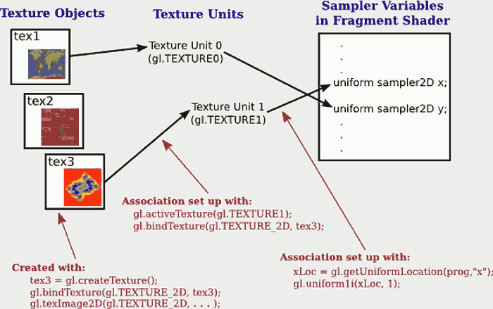

...menustart

 - [Introduction to WebGL](#ee4f3cb275cef5c1d82ace8d34788594)
     - [Section 1: The Programmable Pipeline](#9a3040db06e663f46ca7269b3df96da5)
         - [6.1.1  The WebGL Graphics Context](#4d00c423ae698f2f9609d15a3d6df978)
         - [6.1.2  The Shader Program](#4f31b4e489e41f45a443c8b31846a270)
         - [6.1.3  Data Flow in the Pipeline](#c754edff11c3f2393931f78827b9b007)
         - [6.1.4  Values for Uniform Variables](#339ce22e55c69e7bbd8951f6e94a8586)
         - [6.1.5  Values for Attributes](#969dcaf673eeb3055c02e146d2f2900b)
         - [6.1.6  Drawing a Primitive](#82e825f128e1b88315c25d161f2545b0)
     - [Section 2: First Examples](#e305dfdab0e4cefbd5abea8eacc9c474)
         - [6.2.1  WebGL Context Options](#5e0d0bff36be794f36cc415a1e028547)
         - [6.2.2  A Bit of GLSL](#d63aad2971a949abb24017d785d3e556)
         - [6.2.3  The RGB Triangle in WebGL](#38fef0ba8c35f28806306b0d69e6c5bc)
         - [6.2.4  Shape Stamper](#7dffb95bc8a6bfd9db5183c3517eea68)
         - [6.2.5  The POINTS Primitive](#bc62a575ed06ffa63f83404cd634f185)
         - [6.2.6  WebGL Error Handling](#23dc2ee7e7acb2d786129dac0715532b)
     - [Section 3: GLSL](#512cc0d7b47100675a0c220edf55385a)
         - [6.3.1  Basic Types](#fbcf3140c912e0a15fb7ec4568cbf3f8)
         - [6.3.2  Data Structures](#5e7530b217e8c91ffd8ab502a52c44e7)
         - [6.3.3  Qualifiers](#1158fb2909c793117311e2209b2acb70)
         - [6.3.4  Expressions](#d0d926da814b0f4539d15dcf916330c3)
         - [6.3.5  Function Definitions](#acb12deb98c52a48ea4cf634f0073438)
         - [6.3.6  Control Structures](#48d48d924bdea1d592bee65254d3dfcb)
         - [6.3.7  Limits](#23051d206852e00db9e3b630f217b448)
     - [Section 4: Image Textures](#1f7b297214b84adbccdc248c8f3a7c4e)
         - [6.4.1  Texture Units and Texture Objects](#f5449a0a00f863c2c33f2ffc79920aa0)
         - [6.4.2  Working with Images](#13ed5060549b7511d13507e17ee29faa)
         - [6.4.3  More Ways to Make Textures](#d679e2eade5d6d17970f2d1dd1911954)
         - [6.4.4  Cubemap Texture TODO](#25f1ec59a0dbc8e8aa41a4cc98afcad5)
     - [Section 5: Implementing 2D Transforms](#6f0ba384aa3b845de4898ddb899a037c)
         - [6.5.1  Transforms in GLSL](#a2489f92cd1f40db80144b8eb8e77d93)
     - [Note](#3b0649c72650c313a357338dcdfb64ec)

...menuend


<h2 id="ee4f3cb275cef5c1d82ace8d34788594"></h2>


# Introduction to WebGL

 - WebGL 1.0 is based on OpenGL ES 2.0, a version designed for use on embedded systems 
 - OpenGL ES 1.0 was very similar to OpenGL 1.1. 
    - OpenGL ES 2.0 introduced major changes. It is actually a smaller, simpler API that puts more responsibility on the programmer. 
    - For example, functions for working with transformations, such as glRotatef and glPushMatrix, were eliminated from the API,making the programmer responsible for keeping track of transformations.
 - WebGL does not use glBegin/glEnd to generate geometry, and it doesn't use function such as `glColor*` or `glNormal*` to specify attributes of vertices. 
 - There are two sides to any WebGL program. 
    - Part of the program is written in *JavaScript*
    - The second part is written in *GLSL*


<h2 id="9a3040db06e663f46ca7269b3df96da5"></h2>


## Section 1: The Programmable Pipeline

 - OpenGL 1.1 used a *fixed-function pipeline* for graphics processing.
    - data is provided by a program , and passes through a series of processing stages.
    - the program can enable/disable some of the steps in the process, but there is no way for it to change what happends at each stage.
    - The functionality is fixed.
 - OpenGL 2.0 introduced a *programmable pipeline*. 
    - it is possible to replace certain stages in the pipeline with custom program.
    - This gives the programmer complete control over what happens at that stage. 
    - the programmability was optional
        - the complete fixed-function pipeline was still available for programs that didn't need the flexibility of programmability.
    - WebGL uses a programmable pipeline, and it is **mandatory**. 
        - There is no way to use WebGL without writing programs to implement part of the graphics processing pipeline.
 - The programs that are written as part of the pipeline are called *shaders*. 
    - For WebGL, you need to write a *vertex shader*, which is called once for each vertex in a primitive, 
        - and a *fragment shader*, which is called once for each pixel in the primitive.
    - Aside from these two programmable stages, the WebGL pipeline also contains several stages from the original fixed-function pipeline. 
 - This book covers WebGL 1.0. 
    - Version 2.0 was released in January 2017. and it is compatible with version 1.0.
    - At the end of 2017, WebGL 2.0 is available in some browsers.
    - The later versions of OpenGL have introduced **additional** programmable stages into the pipeline.

<h2 id="4d00c423ae698f2f9609d15a3d6df978"></h2>


### 6.1.1  The WebGL Graphics Context

 - To use WebGL, you need a WebGL graphics context. 
    - ( A few browsers (notably Internet Explorer and Edge) require "experimental-webgl"  )

```js
// <canvas width="800" height="600" id="webglcanvas"></canvas>
...
canvas = document.getElementById("webglcanvas");
gl = canvas.getContext("webgl") || canvas.getContext("experimental-webgl");
```

 - `gl` may be null. You'd better catch the exception

```js
function init() {
    try {
        canvas = document.getElementById("webglcanvas");
        gl = canvas.getContext("webgl") || canvas.getContext("experimental-webgl");
        if ( ! gl ) {
            throw "Browser does not support WebGL";
        }
    }
    catch (e) {
          .
          .  // report the error
          .
        return;
    }
      .
      .  // other JavaScript initialization
      .
    initGL();  // a function that initializes the WebGL graphics context
}
```

 - The init() function could be called, for example, by the onload event handler for the `<body>` element of the web page:

```
<body onload="init()">
```


<h2 id="4f31b4e489e41f45a443c8b31846a270"></h2>


### 6.1.2  The Shader Program

 - Drawing with WebGL requires a shader program. Shaders are written in the language GLSL ES 1.0.
    - The vertex shader and fragment shader are compiled separately,  and then "linked" to produce a complete shader program. 
 - To create the vertex shader.

```js
// vertexShaderSource is a JavaScript string
var vertexShader = gl.createShader( gl.VERTEX_SHADER );
gl.shaderSource( vertexShader, vertexShaderSource );
gl.compileShader( vertexShader );
```

 - Errors in the source code will cause the compilation to fail silently. You need to check for compilation errors by calling the function

```js
gl.getShaderParameter( vertexShader, gl.COMPILE_STATUS )  
```

 - which returns a boolean value to indicate whether the compilation succeeded. 
 - In the event that an error occurred, you can retrieve an error message with

```js
gl.getShaderInfoLog(vertexShader)
```

 - which returns a string containing the result of the compilation. 

 - The fragment shader can be created in the same way. 
 - With both shaders in hand, you can **create** and **link** the **program**. 

```js
var prog = gl.createProgram();
gl.attachShader( prog, vertexShader );
gl.attachShader( prog, fragmentShader );
gl.linkProgram( prog );
```

 - Even if the shaders have been successfully compiled, errors can occur when they are linked into a complete program. 
    - For example, the vertex and fragment shader can share certain kinds of variable.
    - If the two programs declare such variables with the same name but with different types, an error will occur at link time. 
    - Checking for link errors is similar to checking for compilation errors in the shaders.
 - The code for creating a shader program is always pretty much the same.
    - Here is an example function:

```js
/**
 * Creates a program for use in the WebGL context gl, and returns the
 * identifier for that program.  If an error occurs while compiling or
 * linking the program, an exception of type String is thrown.  The error
 * string contains the compilation or linking error. 
 */
function createProgram(gl, vertexShaderSource, fragmentShaderSource) {
   var vsh = gl.createShader( gl.VERTEX_SHADER );
   gl.shaderSource( vsh, vertexShaderSource );
   gl.compileShader( vsh );
   if ( ! gl.getShaderParameter(vsh, gl.COMPILE_STATUS) ) {
      throw "Error in vertex shader:  " + gl.getShaderInfoLog(vsh);
   }
   var fsh = gl.createShader( gl.FRAGMENT_SHADER );
   gl.shaderSource( fsh, fragmentShaderSource );
   gl.compileShader( fsh );
   if ( ! gl.getShaderParameter(fsh, gl.COMPILE_STATUS) ) {
      throw "Error in fragment shader:  " + gl.getShaderInfoLog(fsh);
   }
   var prog = gl.createProgram();
   gl.attachShader( prog, vsh );
   gl.attachShader( prog, fsh );
   gl.linkProgram( prog );
   if ( ! gl.getProgramParameter( prog, gl.LINK_STATUS) ) {
      throw "Link error in program:  " + gl.getProgramInfoLog(prog);
   }
   return prog;
}
```

 - There is one more step: You have to tell the WebGL context to use the program. 

```js
gl.useProgram( prog );
```

 - It is possible to create several shader programs. 
    - You can then switch from one program to another at any time by calling `gl.useProgram`, even in the middle of rendering an image. 
    - (Three.js, for example, uses a different program for each type of Material.)
 - Shaders and programs that are no longer needed can be deleted to free up the resources they consume.
    - Use the functions `gl.deleteShader(shader)` and `gl.deleteProgram(program)`.


<h2 id="c754edff11c3f2393931f78827b9b007"></h2>


### 6.1.3  Data Flow in the Pipeline

 - The basic operation in WebGL is to draw a geometric primitive. 
    - The primitives for drawing quads and polygons have been removed.
    - The remaining primitives draw points, line segments, and triangles.
    - gl.POINTS, gl.LINES, gl.LINE_STRIP, gl.LINE_LOOP, gl.TRIANGLES, gl.TRIANGLE_STRIP, and gl.TRIANGLE_FAN,
 - When WebGL is used to draw a primitive, there are two general categories of data that can be provided for the primitive. 
    - **attribute** variables
    - **uniform** variables
 - A uniform variable has a single value that is the same for the entire primitive, while the value of an attribute variable can be different for different vertices.


must be attribute | attri or uniform | must be uniform  
--- | --- | --- 
coordinates  | | 
 · | color | 
 · | normal vectors | 
 · | material properties | 
Texture coordinates | | 
 · | · | geometric transform 


 - WebGL does not come with **any** predefined attributes. 
    - In the programmable pipeline, the attributes and uniforms that are used *are entirely up to the programmer*. 
 - Attributes are just values that are passed into the vertex shader. 
    - Uniforms can be passed into the vertex shader, the fragment shader, or both. 
 - WebGL does not assign a meaning to the values. The meaning is entirely determined by what the shaders do with the values. 
 - To understand this, we need to look at what happens in the pipeline in a little more detail.
    - When drawing a primitive, the JavaScript program will specify values for any attributes and uniforms in the shader program. 
        - For each attribute, it will specify an array of values, one for each vertex. 
        - For each uniform, it will specify a single value. 
    - The values will all be sent to the GPU before the primitive is drawn.
    - When drawing the primitive, the GPU calls the vertex shader once for each vertex. 
        - The attribute values for the vertex that is to be processed are passed as input into the vertex shader. 
        - Values of uniform variables are also passed to the vertex shader. 
    - Both attributes and uniforms are represented as global variables in the shader, whose values are set before the shader is called.
 - As one of its outputs, the vertex shader must specify the coordinates of the vertex in the *clip coordinate system*.
    - It does that by assigning a value to a special variable named `gl_Position`.
    - The position is often computed by applying a transformation to the coordinates attribute in the *object coordinate system*.
 - After the positions of all the vertices in the primitive have been computed, a fixed-function stage in the pipeline *clips away* the parts of the primitive whose coordinates are outside the range of valid clip coordinates (−1 to 1 along each coordinate axis). 
    - The primitive is then rasterized; that is, it is determined which pixels lie inside the primitive. 
    - The fragment shader is then called once for each pixel that lies in the primitive. 
    - The fragment shader has access to uniform variables (but not attributes). 
        - It can also use a special variable named `gl_FragCoord` that contains the clip coordinates of the pixel. 
        - Pixel coordinates are computed by interpolating the values of gl_Position that were specified by the vertex shader. 
        - The interpolation is done by another fixed-function stage that comes between the vertex shader and the fragment shader. 
 - Other quantities besides coordinates can work in much that same way, suck like *color*. 
    - That is , 
        - the vertex shader computes a value for the quantity at each vertex of a primitive,
        - An interpolator takes the values at the vertices and computes a value for each pixel in the primitive
        - The value for a given pixel is then input into the fragment shader.
    - In GLSL, this pattern is implemented using *varying variables*.
 - A varying variable is declared both in the vertex shader and in the fragment shader.
    - The vertex shader is responsible for assigning a value to the varying variable. 
    - The interpolator takes the values from the vertex shader and computes a value for each pixel. 
    - When the fragment shader is executed for a pixel, the value of the varying variable is the interpolated value for that pixel.
    - PS. In newer versions of GLSL, the term "varying variable" has been replaced by "out variable" in the vertex shader and "in variable" in the fragment shader.
 - After all that, the job of the fragment shader is simply to specify a color for the pixel. 
    - It does that by assigning a value to a special variable named **gl_FragColor**. 
    - That value will then be used in the remaining fixed-function stages of the pipeline.
 - To summarize: 
    1. The JavaScript side of the program sends values for attributes and uniform variables to the GPU and then issues a command to draw a primitive.
    2. The GPU executes the vertex shader once for each vertex. 
        - The vertex shader can use the values of attributes and uniforms. 
        - It assigns values to gl_Position and to any varying variables that exist in the shader. 
    3. After clipping, rasterization, and interpolation, the GPU executes the fragment shader once for each pixel in the primitive. 
        - The fragment shader can use the values of varying variables, uniform variables, and gl_FragCoord. 
        - It computes a value for gl_FragColor.
    4. This diagram summarizes the flow of data:
        - 
        - The diagram is not complete. how are textures used?

<h2 id="339ce22e55c69e7bbd8951f6e94a8586"></h2>


### 6.1.4  Values for Uniform Variables

 - float, int, bool, vec2, vec3, vec4
 - Global variable
    - Global variable declarations in a vertex shader can be marked as *attribute*, *uniform*, or *varying*. 
        - A variable declaration with none of these modifiers defines a variable that is local to the vertex shader. 
    - Global variables in a fragment can optionally be modified with uniform or varying, or they can be declared without a modifier. 
        - A varying variable should be declared in both shaders, with the same name and type. 
 - The JavaScript side of the program needs a way to refer to particular attributes and uniform variables.

```js
//  get a reference to a uniform variable in a shader program
colorUniformLoc = gl.getUniformLocation( prog, "color" );
// The location colorUniformLoc can then be used to set the value of the uniform variable:
gl.uniform3f( colorUniformLoc, 1, 0, 0 );
gl.uniform3fv( colorUniformLoc, [ 1, 0, 0 ] );
// gl.uniform*
```

<h2 id="969dcaf673eeb3055c02e146d2f2900b"></h2>


### 6.1.5  Values for Attributes

 - Attribute is more complicated, because an attribute can take a different value for each vertex in a primitive. 
    - The basic idea is to copy the complete set of data for the attribute from JavaScript  into GPU memory.  
    - But it is non-trivial.
 - A regular JS array is not suitable for this purpose.  For efficiency , we need the data to be in a block of memory holding values in successive locations  , but JS array don't have that form. 
    - To fixe this problem, a new kind of array ,called *typed arrays* , was introduced into JS.  
 - A typed array has a fixed length, which is assigned when it is created by a constructor. 

```js
var color = new Float32Array( 12 );  // space for 12 floats
var coords = new Float32Array( [ 0,0.7, -0.7,-0.5, 0.7,-0.5 ] );
```

 - For use in WebGL, the attribute data must be transferred into a VBO (vertex buffer object).
    - A VBO is a block of memory that is accessible to the GPU. 
 - To use a VBO:

```js
// call gl.createBuffer() to create a VBO
colorBuffer = gl.createBuffer();

// Before transferring data into the VBO, you must "bind" the VBO:
// here, `gl.ARRAY_BUFFER` is called the "target"
// Only one VBO at a time can be bound to a given target.
gl.bindBuffer( gl.ARRAY_BUFFER, colorBuffer );

// copy data into that buffer, use gl.bufferData().
// 1st param is again 'target' , 2nd is the typed array
gl.bufferData(gl.ARRAY_BUFFER, colorArray, gl.STATIC_DRAW);
```
 - `gl.bufferData()`
    - All the elements of the typed array are copied into the buffer, and the size of the array determines the size of the buffer. 
        - Note that this is a  transfer of raw data bytes; WebGL does not remember whether the data represents floats or ints or some other kind of data.
    - The 3rd parameter is one of the constants gl.STATIC_DRAW, gl.STREAM_DRAW, or gl.DYNAMIC_DRAW.
        - It is a hint to WebGL about how the data will be used, and it helps WebGL to manage the data in the most efficient way. 
        - gl.STATIC_DRAW means that you intend to use the data many times without changing it. 
            - WebGL will probably store the data on the graphics card itself where it can be accessed most quickly by the graphics hardware. 
        - gl.STEAM_DRAW is for data that will be used only once, then discarded. 
            - It can be "streamed" to the card when it is needed.
        - gl.DYNAMIC_DRAW  is somewhere between the other two values; it might be used for data that will be used a couple of times and then discarded.

 - Getting attribute data into VBOs is only part of the story.
    - You also have to tell WebGL to use the VBO as the source of values for the attribute. 

```js
// get attribute location
colorAttribLoc = gl.getAttribLocation(prog, "a_color");

// enable the use of a VBO for that attribute
// it is reasonable to call this method just once, during initialization.
gl.enableVertexAttribArray( colorAttribLoc );

// tell WebGL which buffer contains the data and 
// how the bits in that buffer are to be interpreted.
// A VBO must be bound to the ARRAY_BUFFER target
gl.bindBuffer( gl.ARRAY_BUFFER, colorBuffer );
gl.vertexAttribPointer( colorAttribLoc, 3, gl.FLOAT, false, 0, 0 );
```

 - `gl.vertexAttribPointer`
    - the 2nd param is the number of values per vertex
    - the 3rd parma is the type of value 
        - Other values include gl.BYTE, gl.UNSIGNED_BYTE, gl.UNSIGNED_SHORT, and gl.SHORT for integer values
 - Here is the full set of commands:

```js
// the following 3 commands are often done in initialization
colorAttribLoc = gl.getAttribLocation( prog, "a_color" );
colorBuffer = gl.createBuffer();
gl.enableVertexAttribArray( colorAttribLoc );

gl.bindBuffer( gl.ARRAY_BUFFER, colorBuffer );
gl.vertexAttribPointer( colorAttribLoc, 3, gl.FLOAT, false, 0, 0 );
gl.bufferData( gl.ARRAY_BUFFER, colorArray, gl.STATIC_DRAW );
```

<h2 id="82e825f128e1b88315c25d161f2545b0"></h2>


### 6.1.6  Drawing a Primitive

 - After the shader program has been created and values have been set up for the uniform variables and attributes, it takes just one more command to draw a primitive:

```js
gl.drawArrays( primitiveType, startVertex, vertexCount );
```
 
 - In WebGL, support for ordinary arrays was dropped, and gl.drawArrays can only work with VBOs, even though the name still refers to arrays.
 - Parmas:
    - primitiveType
        - such as gl.TRIANGLES, gl.LINE_LOOP, and gl_POINTS. 
    - startVetex 
        - the starting vertex number of the data within the VBOs
    - vertexCount 
        - the number of vertices in the primitive. 
 - A gl.drawElements function is also available in WebGL.


<h2 id="e305dfdab0e4cefbd5abea8eacc9c474"></h2>


## Section 2: First Examples
<h2 id="5e0d0bff36be794f36cc415a1e028547"></h2>


### 6.2.1  WebGL Context Options

```
var options = {
    alpha: false,
    depth: false
};
gl = canvas.getContext( "webgl", options );
```

 - All of the options are boolean-valued.

option | desc 
--- | ---
alpha | determines whether the drawing buffer has an alpha component (letting the background (on the web page behind the canvas) show through). Default is true. It is safe to set the value to false.
depth | determines whether a depth buffer is allocated. The default value is true.You only need a depth buffer if you enable the  depth test. The depth buffer is generally not needed for 2D graphics. 
antialias | is used to request that antialiasing be applied to the image.  A WebGL implementation might ignore the request, for example if antialiasing is not supported by the GPU. The default value is true. Antialiasing can improve the quality of an image, but it can also significantly increase the computation time.
preserveDrawingBuffer | determines whether the contents of the drawing buffer are discarded after the image has been copied to the web page. The default value is false. As long as your rendering functions completely redraw the image every time they called, the default is fine. You should set the value to true only if you need to keep the image around so that you can add to it incrementally over time (i.e. painter).


<h2 id="d63aad2971a949abb24017d785d3e556"></h2>


### 6.2.2  A Bit of GLSL

 - A vertex or fragment shader can contain global variable declarations, type definitions, and function definitions. 
 - One of the functions must be main(), which is the entry point for the shader.
    - takes no parameters and does not return a value
 - Control structures in GLSL are limited. 
    - If statements take the same form as in C or Java. 
    - But some limitations are placed on the `for` loop syntax, and `while` and `do...while` loops are not allowed. 
 - Data structures include arrays and structs, again with some limitations.
 - GLSL's strength lies in its built-in data types and functions for working with vectors and matrices. 

```
attribute vec3 a_coords;  // (only in vertex shader)
vec3 rgb;
float width, height;
uniform vec2 u_size;
varying vec4 v_color;
```

---


```
rgb = vec3( 1.0, 0.7, 0.0 );  // construct a vec3 from constants
v_color = vec4( rgb, 1.0 );  // construct a vec4 from a vec3 and a constant
gl_Position = vec4( a_coords, 0.0, 1.0 );  // vec4 from a vec2 and 2 constants
```

 - A vertex shader needs, at a minimum, an attribute to give the coordinates of the vertex. 
    - For 2D drawing, it's natural for that attribute to be of type vec2.
    - If we assume that the values of the attributes are already expressed in clip coordinates, then the complete source code for the vertex shader could be as simple as:

```
attribute vec2 coords;
void main() {
    gl_Position = vec4( coords, 0.0, 1.0 );
}
```

 - For a corresponding minimal fragment shader, we might simply draw everything in yellow.

```
precision mediump float;
void main() {
    gl_FragColor = vec4( 1.0, 1.0, 0.0, 1.0 );
}
```

<h2 id="38fef0ba8c35f28806306b0d69e6c5bc"></h2>


### 6.2.3  The RGB Triangle in WebGL

http://math.hws.edu/graphicsbook/source/webgl/webgl-rgb-triangle.html

```
gl.drawArrays(gl.TRIANGLES, 0, 3);
```

<h2 id="7dffb95bc8a6bfd9db5183c3517eea68"></h2>


### 6.2.4  Shape Stamper

```
gl.enable( gl.BLEND );
gl.blendFunc( gl.SRC_ALPHA, gl.ONE_MINUS_SRC_ALPHA );
```

 - WebGL uses a default coordinate system in which each of the coordinates ranges from −1 to 1
    - To convert pixel coordinates on the canvas into that  default coordinate system :

```
x2 = -1 + 2*( x1 / canvas.width );
y2 = 1 - 2*( y1 / canvas.height );
```

 - In WebGL, the coordinate transformation is usually applied in the vertex shader. 
    - In this case, to implement the transformation, the vertex shader just needs to know the width and height of the canvas.

```
attribute vec2 a_coords;   // pixel coordinates
uniform float u_width;     // width of canvas
uniform float u_height;    // height of canvas
void main() {
   float x = -1.0 + 2.0*(a_coords.x / u_width);
   float y = 1.0 - 2.0*(a_coords.y / u_height);
   gl_Position = vec4(x, y, 0.0, 1.0);
}
```

 - Transformations can be much more complicated than this, especially in 3D, but the general pattern holds: 
    - Transformations are represented by uniform variables and are applied in the vertex shader. 

```
gl.drawArrays(gl.TRIANGLE_FAN, 0, coords.length/2);
```

<h2 id="bc62a575ed06ffa63f83404cd634f185"></h2>


### 6.2.5  The POINTS Primitive

 - By default, each vertex is rendered as a single pixel. However, a program can specify a larger size. 
    - In OpenGL 1.1, this was done with the function gl_PointSize(). 
    - In WebGL, that function does not exist. Instead, the size is under the control of the vertex shader.
 - The vertex shader should assign a value to the special built-in variable gl_PointSize.  The variable is of type float.
 - When the fragment shader is called for a POINTS primitive, it is processing one pixel in the square of pixels surrounding the vertex.
    - The special fragment shader variable gl_PointCoord tells the shader the location of the pixel within that square.
    - The value of gl_PointCoord is an input to the shader. The type of gl_PointCoord is vec2.

```
float distanceFromCenter = distance( gl_PointCoord, vec2(0.5,0.5) );
if ( distanceFromCenter >= 0.5 ) {
   discard;  // don't draw this pixel!
}
```

<h2 id="23dc2ee7e7acb2d786129dac0715532b"></h2>


### 6.2.6  WebGL Error Handling

 - 在WebGL和更常见的OpenGL中，诸如非法参数值之类的错误通常不会使程序崩溃或产生任何错误的自动通知。
    - 而是 当WebGL检测到这样的错误时，它会忽略非法的函数调用，并设置错误代码的值，以指示错误的性质。
 - A program can check the current value of the error code by calling gl.getError(). 
    - This function returns an integer error code. 
    - The return value is gl.NO_ERROR if no error has occurred. 

```
console.log("Error code is " + gl.getError());
```
 


<h2 id="512cc0d7b47100675a0c220edf55385a"></h2>


## Section 3: GLSL

<h2 id="fbcf3140c912e0a15fb7ec4568cbf3f8"></h2>


### 6.3.1  Basic Types

kink | types
--- | --- 
scalar | float, *int*, *bool* (may actually represented as float)
vector | vec2, vec3, vec4 , ivec*n*, bvec*n*  (v.rgb or v.zx or even v.yyy)
matrix | mat2 , mat3, mat4
texture | sampler2D , samplerCube

 - vectors
 
```
vec4 rgba = vec4( 0.1, 0.2, 0.3, 0.4 );
vec3 rgb = vec3( rgba );  // takes 3 items from rgba; rgb is (0.1, 0.2, 0.3)
float r = float( rgba );  // r is 0.1
vec2 v = vec2( rgb, rgba );    // ERROR: No values from rgba are used.

vec4 black = vec4( 1.0 );  // black is ( 1.0, 1.0, 1.0, 1.0 )
```


 - matrix 
    - Arrays in GLSL, as in OpenGL, use  **column-major** order.
    - This means that M[2] is column number 2 in M. rather than row number 2 (as it would be in Java),
    - and `M[2][1]` is the element in column 2 and row 1.

```
mat3 m1 = mat3( 1.0, 2.0, 3.0, 4.0, 5.0, 6.0, 7.0, 8.0, 9.0 );
vec3 v = vec3( 1, 2, 3 );
mat3 m2 = mat3( v, v, v );
```

 - As a special case, if a matrix M is constructed from a single scalar value, then that value is put into all the diagonal elements of M (M[0][0], M[1][1], and so on). 
    - The non-diagonal elements are all set equal to zero. For example, mat4(1.0) constructs the four-by-four  identity matrix.


<h2 id="5e7530b217e8c91ffd8ab502a52c44e7"></h2>


### 6.3.2  Data Structures

 - A GLSL program can define new types using the **struct** keyword.
 - The syntax is the same as in C, with some limitations. 

```
struct LightProperties {
    vec4 position;
    vec3 color;
    float intensity;
};

LightProperties light;
```

 - Struct types have constructors, but their constructors do not support type conversion.

```
light = LightProperties( vec4(0.0, 0.0, 0.0, 1.0), vec3(1.0), 1.0 );
```

 - GLSL also supports arrays. **Only one-dimensional arrays are allowed**. 
    - There are no array constructors, and it is not possible to initialize an array as part of its declaration.
    - Array indexing **can contain only integer constants and for loop variables** . That is the expression `palette[i+1]` would only be legal inside a *for* loop.

```
int A[10];
vec3 palette[8];
LightProperties lights[3];
```

<h2 id="1158fb2909c793117311e2209b2acb70"></h2>


### 6.3.3  Qualifiers

 - Variable declarations can be modified by various qualifiers.
 - You have seen examples of the qualifiers *attribute*, *uniform*, and *varying*. These are called **storage qualifiers**. 
 - The other possible storage qualifier is *const*.
 - In addition, it is not legal to assign a value to an attribute or uniform variable; their values come from the JavaScript side, and they are considered to be read-only. 

---


 - The attribute qualifier can only be used for global variables in the vertex shader, and it only applies to the built-in floating point types float, vec2, vec3, vec4, mat2, mat3, and mat4. 
 - Both the vertex shader and the fragment shader can use uniform variables.
    - Uniform variables can be of any type, including array and structure types. 
    - Now, JavaScript only has functions for setting uniform values that are scalar variables, vectors, or matrices. 
    - There are no functions for setting the values of structs or arrays. 
        - The solution to this problem requires treating every component of a struct or array as a separate uniform value. 
        - For example, consider the declarations
        - 
        ```
        struct LightProperties {
            vec4 position;
            vec3 color;
            float intensity;
        };
        uniform LightProperties light[4];
        ```

        - The variable light contains twelve basic values, which are of type vec4, vec3, or float. 
            - To work with the light uniform in JavaScript, we need twelve variables to represent the locations of the 12 components of the uniform variable.
            - When using gl.getUniformLocation to get the location of one of the 12 components, you need to give the full name of the component in the GLSL program. 
                - For example: `gl.getUniformLocation(prog, "light[2].color")`.

```
lightLocations = new Array(4);
for (i = 0; i < light.length; i++) {
    lightLocations[i] = {
        position: gl.getUniformLocation(prog, "light[" + i + "].position" );
        color: gl.getUniformLocation(prog, "light[" + i + "].color" );
        intensity: gl.getUniformLocation(prog, "light[" + i + "].intensity" );
    };
}

for (i = 0; i < light.length; i++) {
    gl.uniform4f( lightLocations[i].position, 0, 0, 0, 1 );
    gl.uniform3f( lightLocations[i].color, 1, 1, 1 );
    gl.uniforma1f( lightLocations[i].intensity, 0 );
}
```

 - For uniform shader variables that are matrices, the JavaScript function that is used to set the value of the uniform is gl.uniformMatrix2fv for a mat2, gl.uniformMatrix3fv for a mat3, or gl.uniformMatrix4fv for a mat4. 
    - Even though the matrix is two-dimensional, the values are stored in a one dimensional array. 
    - The values are loaded into the array in column-major order.
    - For example, if transform is a uniform mat3 in the shader, then JavaScript can set its value to be the identity matrix with
    - 
    ```
    transformLoc = gl.getUniformLocation(prog, "transform");
    gl.uniformMatrix3fv( transformLoc, false, [ 1,0,0, 0,1,0, 0,0,1 ] );
    ```
    - The second parameter must be false.
        - (In some other versions of OpenGL, the second parameter can be set to true to indicate that the values are in row-major instead of column-major order, but WebGL requires column-major order.)

 - As for the varying qualifier, it can be used only for the built-in floating point types (float, vec2, vec3, vec4, mat2, mat3, and mat4) and for arrays of those types. 
    - A varying variable should be declared in both the vertex and fragment shader. 
    - (This is not actually a requirement; an error only occurs if the fragment shader tries to use the value of a varying variable that does not exist in the vertex shader.) 
 - Variable declarations can also be modified by **precision qualifiers**. 
    - lowp : -2⁸ ~ 2⁸
    - mediump : -2¹⁰ ~ 2¹⁰
    - highp : -2¹⁶ ~ 2¹⁶
 - A precision qualifier can be used on any variable declaration. If the variable also has a storage qualifier, the storage qualifier comes first. For example

```
lowp int n;
varying highp float v;
uniform mediump vec3 colors[3];
```

 - A varying variable can have different precisions in the vertex and in the fragment shader. 
 - The default precision for integers and floats in the vertex shader is highp. 
 - Fragment shaders are not required to support highp, although it is likely that they do so, except on older mobile hardware.
    - In the fragment shader, the default precision for integers is mediump, but floats do not have a default precision. 
    - This means that every floating point variable in the fragment shader has to be explicitly assigned a precision. 
    - Alternatively, it is possible to set a default precision for floats with the statement
        - `precision mediump float;`
    - This statement was used at the start of each of the fragment shaders. 
    - Of course, if the fragment shader does support highp, this restricts the precision unnecessarily.
    - The following code sets the default precision to highp if it is available and to mediump if not. 

```
#ifdef GL_FRAGMENT_PRECISION_HIGH
    precision highp float;
#else
    precision mediump float;
#endif
```

 - The last qualifier, **invariant**, is even more difficult to explain, and it has only a very limited use. 
    - Invariance refers to the requirement that when the same expression is used to compute the value of the same variable (possibly in different shaders), then the value that is assigned to the variable should be exactly the same in both cases. 
    - This is not automatically the case. For example, the values can be different if a compiler uses different optimizations or evaluates the operands in a different order in the two expressions
    - The invariant qualifier on the variable will force the compiler to use exactly the same calculations for the two assignment statements. 
    - The qualifier can only be used on declarations of varying variables. It must be the first qualifier in the declaration. For example,
    - `invariant varying mediump vec3 color;`
    - It can also be used to make the predefined variables such as gl_Position and gl_FragCoord invariant, using a statement such as
    - `invariant gl_Position;`
 - Invariance can be important in a **multi-pass algorithm** that applies two or more shader programs in succession to compute an image.
    - It is important, for example, that both shaders get the same answer when they compute gl_Position for the same vertex, using the same expression in both vertex shaders. Making gl_Position invariant in the shaders will ensure that.
 

<h2 id="d0d926da814b0f4539d15dcf916330c3"></h2>


### 6.3.4  Expressions


type | operators
--- | --- 
Arithmetic | `+, −, *, /, ++ and −−`, work with vectors and matrices (but %, <<, and >> are not supported)
Relational | `<, >, <=, and >=` , (can only be applied to ints and floats)
Relational 2 |  `== and !=` , work with all built-in types except *sampler*. work with vectors, matraices, structs, but not arrays.
Logical | `!, &&, \|\|, and ^^` , operands must be of type *bool*
Assignment | `=, +=, −=, *=, and /=`  


 - vector algebra functions 
    - dot, cross, length, distance, normalize
    - There are also functions named reflect and refract that can be used to compute the direction of reflected and refracted light rays.
    - mix(x,y,t) computes `x*(1−t) + y*t`.
    - clamp(x,low,high) clamps x to the range low to high;  return as min(max(x,low),high)
        - If rgb is a vector representing a color, we could ensure that all of the components of the vector lie in the range 0 to 1 with the command
        - `rgb = clamp( rgb, 0.0, 1.0 );`
    - If s and t are floats, with s < t, then smoothstep(s,t,x) returns 0.0 for x less than s and returns 1.0 for x greater than t. 
        - Here is an example that might be used in a fragment shader for rendering a gl.POINTS primitive, with transparency enabled:
        - 
        ```
        float dist = distance( gl_PointCoord, vec2(0.5) );
        float alpha = 1.0 - smoothstep( 0.45, 0.5, dist );
        if (alpha == 0.0) {
            discard; // discard fully transparent pixels
        }
        gl_FragColor = vec4( 1.0, 0.0, 0.0, alpha );
        ```
 - mathematical functions
    - sin, cos, tan, asin, acos, atan, log, exp, pow, sqrt, abs, floor, ceil, min, and max.
    - parameters can be any of the types float, vec2, vec3, or vec4.
    - The return value is of the same type, and the function is applied to each component separately. 
        - sqrt(vec3(16.0,9.0,4.0))  = vec3(4.0,3.0,2.0). 
    - mod(x,y) : `x − y*floor(x/y)`. 


<h2 id="acb12deb98c52a48ea4cf634f0073438"></h2>


### 6.3.5  Function Definitions

 - Unlike C, function names can be overloaded
 - A function must be declared before it is used. As in C, it can be declared by giving either a full definition or a function prototype.
 - Function parameters can be of any type. 
    - The return type for a function can be any type except for array types. 
    - A struct type can be a return type, as long as the structure does not include any arrays. 
 - When an array is used a formal parameter, the length of the array must be specified by an integer constant. For example,

```
float arraySum10( float A[10] ) {
   float sum = 0.0;
   for ( int i = 0; i < 10; i++ ) {
       sum += A[i];
   }
   return sum;
}
```

 - Function parameters can be modified by the qualifiers in, out, or inout. 
    - The default, if no qualifier is specified, is *in*. 
    - For output parameters, the value of the formal parameter is copied back to the actual parameter when the function returns. 
    - For an inout parameter, the value is copied in both directions. 
        - This type of parameter passing is referred to as "call by value/return."  (like pointer)
 - Recursion is not supported for functions in GLSL. 
    - This is a limitation of the type of processor that is typically found in GPUs. 
    - There is no way to implement a stack of activation records.
 - Also, GLSL for WebGL does not support computations that can continue indefinitely.


<h2 id="48d48d924bdea1d592bee65254d3dfcb"></h2>


### 6.3.6  Control Structures

 - **if** and **for**  , on *while* loop.
 - **If** statements are supported with the full syntax from C, including else and else if.
 - In a for loop, the loop control variable must be declared in the loop, and it must be of type int or float. 
    - For loops can include break and continue statements.
    - The initial value for the loop control variable must be a constant expression .
    - The code inside the loop is not allowed to change the value of the loop control variable.
    - The test for ending the loop can only have the form `var op expression`
    - Finally, the update expression must have one of the forms var++, var--, var+=expression, or var-=expression,

```
for (int i = 0; i < 10; i++)
for (float x = 1.0; x < 2.0; x += 0.1)
for (int k = 10; k != 0; k -= 1)
```

<h2 id="23051d206852e00db9e3b630f217b448"></h2>


### 6.3.7  Limits

 - WebGL imposes a set of minimum requirements that all implementations must satisfy.
    - For example, any WebGL implementation must allow at least 8 attributes in a vertex shader.
    - it is available on the JavaScript side as the value of the expression
        - `gl.getParameter( gl.MAX_VERTEX_ATTRIBS )`
    - Attribute variables of type float, vec2, vec3, and vec4 all count as one attribute against the limit.
    - For a matrix-valued attribute, each column counts as a separate attribute as far as the limit goes.

```
gl_MaxVertexAttribs >= 8;
gl_MaxVertexUniformVectors >= 128;
gl_MaxFragmentUniformVectors >= 16;
gl_MaxVaryingVectors >= 8;

gl_MaxTextureImageUnits >= 8;         // limit for fragment shader
gl_MaxVertexTextureImageUnits >= 0;   // limit for vertex shader
gl_MaxCombinedTextureImageUnits >= 8; // total limit for both shaders
```

 - Textures are usually used in fragment shaders, but they can sometimes be useful in vertex shaders. 
    - Note however, that gl_MaxVertexTextureImageUnits can be zero, which means that implementations are not required to allow texture units to be used in vertex shaders.


<h2 id="1f7b297214b84adbccdc248c8f3a7c4e"></h2>


## Section 4: Image Textures

 - there is one feature that is new since OpenGL 1.1: **texture units**

<h2 id="f5449a0a00f863c2c33f2ffc79920aa0"></h2>


### 6.4.1  Texture Units and Texture Objects

 - A texture unit, also called a texture mapping unit (TMU) or a texture processing unit (TPU), is a hardware component in a GPU that does sampling.
    - Sampling is the process of computing a color from an image texture and texture coordinates. 
    - Mapping a texture image to a surface is a fairly complex operation, since 
        - it requires more than just returning the color of the texel that contains some given texture coordinates. 
        - It also requires applying the appropriate minification or magnification filter, possibly using mipmaps if available. 
 - A texture unit must access a texture object to do its work.
    - We encountered texture objects in Subsection 4.3.7. 
 - In GLSL, texture lookup is done using **sampler variables**. 
    - a variable in a shader program of type sampler2D or samplerCube.
    - The value of a sampler variable is a reference to a texture unit.
    - The number of units can be determined as the value of the expression
    - `gl.getParameter( gl.MAX_COMBINED_TEXTURE_IMAGE_UNITS )`

 -  If you want a sampler variable to use texture unit number 2, then you set the value of the sampler variable to 2

```
// suppose in sharer: uniform sampler2D u_texture;

// get texture unit location 
u_texture_location = gl.getUniformLocation( prog, "u_texture" );
// Then, you can tell the sampler variable to use texture unit number 2 by calling
gl.uniform1i( u_texture_location, 2 );
```

 - To use an image texture, you also need to create a texture object, and you need to load an image into the texture object. 

```js
// creating a texture object
textureObj = gl.createTexture();

// To make texture unit number 2 active
gl.activeTexture( gl.TEXTURE2 );
// "bind" the texture object, the texture target is texture2D
// tells the texture unit which texture object to use. 
gl.bindTexture( gl.TEXTURE_2D, textureObj );
```



 - A sampler variable uses a texture unit, which uses a texture object, which holds a texture image.
 - Suppose that you have several images that you would like to use on several different primitives. 
    - Between drawing primitives, you need to change the texture image that will be used. 
 - There are at least three different ways to manage the images in WebGL:
    1. You could use a single texture object and a single texture unit.
        - The bound texture object, the active texture unit, and the value of the sampler variable can be set once and never changed. 
        - To change to a new image, you would use gl.texImage2D to load the image into the texture object. 
            - This is essentially how things were done in OpenGL 1.0. 
            - It's very inefficient. That's why texture objects were introduced.
    2. You could use a different texture object for each image, but use just a single texture unit.
        - The active texture and the value of the sampler variable will never have to be changed. 
        - You would switch to a new texture image using gl.bindTexture to bind the texture object that contains the desired image.
    3. You could use a different texture unit for each image. 
        - You would load a different image into its own texture object and bind that object to one of the texture units. 
        - You would switch to a new texture image by changing the value of the sampler variable.

 - I don't know how options 2 and 3 compare in terms of efficiency. 
    - Note that you are only **forced** to use more than one texture unit if you want to apply more than one texture image to the same primitive. 
        - that is, 当一个 primitive 用到了不止 一张贴图时， 必需使用方法 *3* . 
    - To do that, you will need several sampler variables in the shader program.
        - They will have different values so that they refer to different texture units. 

<h2 id="13ed5060549b7511d13507e17ee29faa"></h2>


### 6.4.2  Working with Images

 - loaded an image into a texture object

```js
gl.texImage2D( target, 0, gl.RGBA, gl.RGBA, gl.UNSIGNED_BYTE, image );
```

 - target: 
    - gl.TEXTURE_2D for ordinary textures; there are other targets for loading cubemap textures.
 - second parameter is the mipmap level
    - which is 0 for the main image.
    - Although it is possible to load individual mipmaps, that is rarely done. 
 - The next two parameters give the format of the texture inside the texture object and in the original image.
    - In WebGL, the two format parameters must have the same value. 
    - And by using gl.LUMINANCE or gl.LUMINANCE_ALPHA, you can convert the image to grayscale. 
 - The fourth parameter is always going to be gl.UNSIGNED_BYTE
    - Although other values are possible, they don't really make sense for web images.
 - image:
    - Ordinarily, image will be a DOM image element that has been loaded asynchronously by JavaScript. 
    - The image can also be a `<canvas>` element. 
        - This means that you can draw on a canvas, using the HTML canvas 2D graphics API, and then use the canvas as the source for a texture image.
        - You can even do that with an  off-screen canvas that is not visible on the web page.

---

 - The image is loaded into the texture object that is currently bound to target in the currently active texture unit. 
    - The active texture unit is the one that has been selected using gl.activeTexture, or is texture unit 0 if gl.activeTexture has never been called. 
 - Using images in WebGL is complicated by the fact that images are loaded asynchronously. 
    - You can specify a callback function that will be executed when the loading completes. 

```
/**
 *  Loads a texture image asynchronously.  The first parameter is the url
 *  from which the image is to be loaded.  The second parameter is the
 *  texture object into which the image is to be loaded.  When the image
 *  has finished loading, the draw() function will be called to draw the
 *  triangle with the texture.  (Also, if an error occurs during loading,
 *  an error message is displayed on the page, and draw() is called to
 *  draw the triangle without the texture.)
 */
function loadTexture( url, textureObject ) {
    var img = new Image();  //  A DOM image element to represent the image.
    img.onload = function() {
        // This function will be called after the image loads successfully.
        // We have to bind the texture object to the TEXTURE_2D target before
        // loading the image into the texture object.
        gl.bindTexture(gl.TEXTURE_2D, textureObject);
        gl.texImage2D(gl.TEXTURE_2D,0,gl.RGBA,gl.RGBA,gl.UNSIGNED_BYTE,img);
        gl.generateMipmap(gl.TEXTURE_2D);  // Create mipmaps; you must either
                              // do this or change the minification filter.
        draw();  // Draw the canvas, with the texture.
    }
    img.onerror = function(e,f) {
        // This function will be called if an error occurs while loading.
        document.getElementById("headline").innerHTML =
                        "<p>Sorry, texture image could not be loaded.</p>";
        draw();  // Draw without the texture; triangle will be black.
    }
    img.src = url;  // Start loading of the image.
                    // This must be done after setting onload and onerror.
}
```

 - Note that image textures for WebGL should be power-of-two textures. 
    - That is, the width and the height of the image should each be a power of 2, such as 128, 256, or 512.
    - You can, in fact, use non-power-of-two textures, but you can't use mipmaps with such textures, and the only texture repeat mode that is supported by such textures is gl.CLAMP_TO_EDGE

 - There are several parameters associated with a texture object, including the texture repeat modes and the minification and magnification filters. 
    - They can be set using the function gl.texParameteri.  The setting applies to the currently bound texture object. 
    - Most of the details are the same as in OpenGL 1.1 (Subsection 4.3.3). 
    - For example, the minification filter can be set to LINEAR using
        - `gl.texParameteri( gl.TEXTURE_2D, gl.TEXTURE_MIN_FILTER, gl.LINEAR);`
    - Recall that the default minification filter won't work without mipmaps. 
        - Fortunately, WebGL has a function that will generate the mipmaps for you:
        - `gl.generateMipmap( gl.TEXTURE_2D );`

 - The texture repeat modes determine what happens when texture coordinates lie outside the range 0.0 to 1.0. 
    - There is a separate repeat mode for each direction in the texture coordinate system.
    - In WebGL, the possible values are gl.REPEAT, gl.CLAMP_TO_EDGE, and gl.MIRRORED_REPEAT. 
    - The default is gl.REPEAT. 
 
---

 - In WebGL, texture coordinates are usually input to the vertex shader as an attribute of type vec2. 
    - They are communicated to the fragment shader in a varying variable. 
    - Often, the vertex shader will simply copy the value of the attribute into the varying variable. 
        - Another possibility is to apply an affine *texture transformation* to the coordinates in the vertex shader before passing them on to the fragment shader. 
 - In the fragment shader, the texture coordinates are used to sample a texture. 

```
texture2D( samplerVariable, textureCoordinates );
```

 - The return value is an RGBA color, represented as a value of type vec4. 
 - minimal example:

```
precision mediump float;
uniform sampler2D u_texture;
varying vec2 v_texCoords;
void main() {
   vec4 color = texture2D( u_texture, v_texCoords );
   gl_FragColor = color;
}
```

 - Textures are sometimes used on primitives of type gl.POINTS.

---

 - The pixel data for a texture image in WebGL is stored in memory starting with the row of pixels at the bottom of the image and working up from there.
    - When WebGL creates the texture by reading the data from an image, it assumes that the image uses the same format.
    - However, images in a web browser are stored in the opposite order, starting with the pixels in the top row of the image and working down. 
    - The result of this mismatch is that texture images will appear upside down. You can account for this by modifying your texture coordinates. 
    - However, you can also tell WebGL to invert the images for you as it "unpacks" them. To do that, call

```js
gl.pixelStorei( gl.UNPACK_FLIP_Y_WEBGL, 1 );
```

 - Generally, you can do this as part of initialization. 
    - Note however that for gl.POINTS primitives, the coordinate system used by gl_PointCoord is already upside down, with the y-coordinate increasing from top to bottom.
    - So, if you are loading an image for use on a POINTS primitive, you might want to set gl.UNPACK_FLIP_Y_WEBGL to its default value, 0.


<h2 id="d679e2eade5d6d17970f2d1dd1911954"></h2>


### 6.4.3  More Ways to Make Textures

 - We have seen how to create a texture from an image or canvas element using gl.texImage2D.
    - There are several more ways to make an image texture in WebGL. 
 - First of all, the following function which was covered in Subsection 4.3.6 also exists in WebGL. 
    - 
    ```
    glCopyTexImage2D( target, mipmapLevel, internalFormat,
                                         x, y, width, height, border );
    ```
    - This function copies data from the color buffer (where WebGL renders its images) into the currently bound texture object.
    - The data is taken from the rectangular region in the color buffer with the specified width and height and with its lower left corner at (x,y). 
    - The internalFormat is usually gl.RGBA. For WebGL, the border must be zero. 
    - For example, `glCopyTexImage2D( gl.TEXTURE_2, 0, gl.RGBA, 0, 0, 256, 256, 0);`

 - More interesting, perhaps, is the ability to take the texture data directly from an array of numbers.
    - The numbers will become the color component values for the pixels in the texture. 
    - The function that is used for this is an alternative version of texImage2D:
        - *dataArray* of texImage2D must be a typed array of type Uint8Array or Uint16Array, depending on the dataFormat of the texture. 
```
texImage2D( target, mipmapLevel, internalFormat, width, height,
                                  border, dataFormat, dataType, dataArray )

// and a typical function call would have the form
gl.texImage2D(gl.TEXTURE_2D, 0, gl.RGBA, 16, 16,
                                  0, gl.RGBA, gl.UNSIGNED_BYTE, pixels);
```

<h2 id="25f1ec59a0dbc8e8aa41a4cc98afcad5"></h2>


### 6.4.4  Cubemap Texture TODO

http://math.hws.edu/graphicsbook/c6/s4.html


<h2 id="6f0ba384aa3b845de4898ddb899a037c"></h2>


## Section 5: Implementing 2D Transforms

<h2 id="a2489f92cd1f40db80144b8eb8e77d93"></h2>


### 6.5.1  Transforms in GLSL

 - scaling, rotation, translation, 这些变化的组合，可以使用一个 affine transform 完成
 - 2D, (x,y) -> (x2,y2)

```
x2 = a*x1 + c*y1 + e
y2 = b*x1 + d*y1 + f

⎡ a c e⎤ ⎡ x⎤
⎢ b d f⎥·⎢ y⎥
⎣ 0 0 1⎦ ⎣ 1⎦
```

 - 一个2D vertex shader的例子

```
attribute vec2 a_coords;
uniform mat3 u_transform;
void main() {
   vec3 transformedCoords = u_transform * vec3(a_coords,1.0);
   gl_Position = vec4(transformedCoords.xy, 0.0, 1.0);
}
```

 - In the last line, the value for gl_Position must be a **vec4**. 


<h2 id="3b0649c72650c313a357338dcdfb64ec"></h2>


## Note 

 - webGL shader 没有预定义的attributes和uniform变量，程序员自己定义使用
 - webGL 特殊变量:
    - gl_Position
    - gl_FragCoord
    - gl_FragColor

