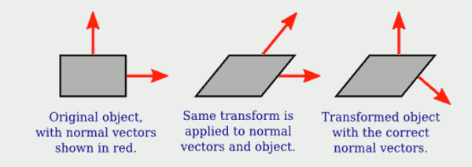
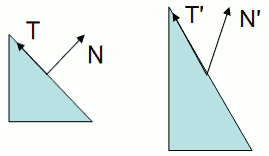

...menustart

- [7 3D Graphics with WebGL](#357aa0eaaaeef801f1492788310cb7be)
    - [Section 7.1 Transformations in 3D](#dd2ae5afe7a2b9b238ae7ef9ebc002a4)
        - [7.1.1  About Shader Scripts](#d7e9359f5c67d29398a9a63005ea1d5f)
        - [7.1.2  Introducing glMatrix (TODO)](#946786c5977adc425dfb64f6ad11dbb0)
        - [7.1.3  Transforming Coordinates](#fb11bb92ab03584cb21aff9f56123db8)
        - [7.1.4  Transforming Normals](#51ac8c3a78a5610dfe32a5cbbbd92793)
    - [Section 7.2 Lighting and Material](#ed46036a806368c04e89b1863df8b00e)

...menuend


<h2 id="357aa0eaaaeef801f1492788310cb7be"></h2>


# 7 3D Graphics with WebGL

<h2 id="dd2ae5afe7a2b9b238ae7ef9ebc002a4"></h2>


## Section 7.1 Transformations in 3D

<h2 id="d7e9359f5c67d29398a9a63005ea1d5f"></h2>


### 7.1.1  About Shader Scripts

 - how to inclulde shader source code on a web ?
    1. storing the code in JavaScript string literals  (hard read and edit)
    2. puting shader source code inside `<script>` elements.  For example


```html
<script type="x-shader/x-vertex" id="vshader">
    attribute vec3 a_coords;
    uniform mat4 modelviewProjection;
    void main() {
        vec4 coords = vec4(a_coords,1.0);
        gl_Position = modelviewProjection * coords;
    }
</script>
```

 - 浏览器不会真正执行这段 script， 因为 不能识别 "x-shader/x-vertex". 
    - But it does store the content of the `<script>` element in the DOM data structure. 
    - The content can be retrieved as a string using the standard DOM API.

```js
function getTextContent( elementID ) {
    var element = document.getElementById(elementID);
    var node = element.firstChild;
    var str = "";
    while (node) {
        if (node.nodeType == 3) // this is a text node
            str += node.textContent;
        node = node.nextSibling;
    }
    return str;
}

// call getTextContent("vshader") 
```


<h2 id="946786c5977adc425dfb64f6ad11dbb0"></h2>


### 7.1.2  Introducing glMatrix (TODO)

 - JavaScript library for 3D transformation : [glMatrix](http://glmatrix.net)
    - `<script src="gl-matrix-min.js"></script>`
 - a glMatrix *mat4* can be passed to a shader program to specify the value of a GLSL *mat4*, and similarly for the other vector and matrix types.

```
transform = mat4.create();
vector = vec3.create();
saveTransform = mat4.clone(modelview);
```

 - Most other functions do **NOT** create new arrays. Instead, they modify the contents of their first parameter. 
    - `mat4.multiply(A,B,C)` will modify A , so that it holds the matrix product of B and C.
    - `mat4.translate(A,B,v)` makes A equal to the product of B and v
        - `mat4.translate( modelview, modelview, [dx,dy,dz] );`  is equivalent to calling `glTranslatef(dx,dy,dz)` in OpenGL

<h2 id="fb11bb92ab03584cb21aff9f56123db8"></h2>


### 7.1.3  Transforming Coordinates


```
attribute vec3 a_coords;           // (x,y,z) object coordinates of vertex.
uniform mat4 modelviewProjection;  // Combined transformation matrix.
void main() {
    vec4 coords = vec4(a_coords,1.0);   // Add 1.0 for the w-coordinate.
    gl_Position = modelviewProjection * coords;  // Transform the coordinates.
}
```


<h2 id="51ac8c3a78a5610dfe32a5cbbbd92793"></h2>


### 7.1.4  Transforming Normals

 - Normal vectors are essential for lighting calculations.
 - 大部分情况下，如果 surface 有一个 transformation, 这个 surface的 normal vectors 也会相应变化。 唯一的例外 translation. 平移一个vector是没有意义的.
 - 你可能猜想，transformation 中的 rotation/scaling 部分，会被作用到 normal vectors上？
    - 猜想 这是个3x3矩阵，该矩阵是通过从4x4坐标变换矩阵中删除右列和底行而获得的。
    - 很多情况下，这是不正确的。 比如 一个切变矩阵。 ( 仅举例用，实际上很多缩放的情况都有这个问题 )
    - 
 - Nevertheless, it is possible to get the correct transformation matrix for normal vectors from the coordinate transformation matrix. 
    - 事实证明，您需要删除第四行和第四列，然后采用所谓的3乘3矩阵的“inverse transpose 逆转置”。 
    - 对normal vector 进行变换不能直接乘以变换矩阵，必须乘以inverse transpose matrix
        - 
        - 如图，假设 变换中代表 rotation/scaling 的3x3矩阵为M，法线矩阵为G,
            - N'·T' = (GN)·(MT) = 0  , 因为 **点积可以转换成 向量积**
            - 0 = (GN)·(MT) = (GN)ᵀ(MT) = NᵀGᵀMT , 因为 NᵀᵀT= 0 , 所以我们猜测
            - GᵀM = I , 所以 G=(M = I , 所以 G=(M⁻¹)ᵀ
    - The glMatrix library will compute it for you.
 
```
mat3.normalFromMat4( normalMatrix, coordinateMatrix );
```

 - Since we need normal vectors for lighting calculations, and lighting calculations are done in eye coordinates, the coordinate transformation that we are interested in is usually the modelview transform.

```
attribute vec3 a_coords;   // Untransformed object coordinates.
attribute vec3 normal;     // Normal vector.
uniform mat4 projection;   // Projection transformation matrix.
uniform mat4 modelview;    // Modelview transformation matrix.
uniform mat3 normalMatrix; // Transform matrix for normal vectors.
  .
  .  // Variables to define light and material properties.
  .
void main() {
    vec4 coords = vec4(a_coords,1.0);  // Add a 1.0 for the w-coordinate.
    vec4 eyeCoords = modelview * coords;  // Transform to eye coordinates.
    gl_Position = projection * eyeCoords;  // Transform to clip coordinates.
    vec3 transformedNormal = normalMatrix*normal;  // Transform normal vector.
    vec3 unitNormal = normalize(transformedNormal);  // Normalize.
       .
       .  // Use eyeCoords, unitNormal, and light and material
       .  // properties to compute a color for the vertex.
       .
}
```


<h2 id="ed46036a806368c04e89b1863df8b00e"></h2>


## Section 7.2 Lighting and Material


