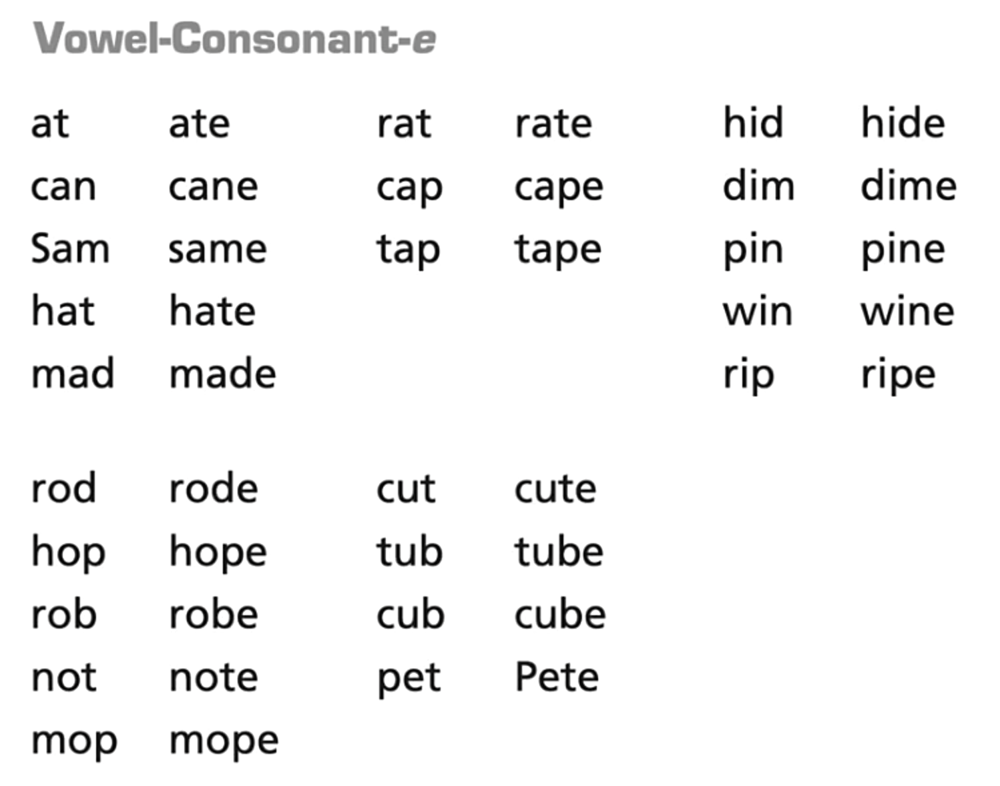

[](...menustart)

- [Phonics Rules](#1655cffa40b51304803e39ee8b5de503)
    - [1. Closed syllable](#77556b3cb3f4c7d3be14f34e4568e224)
    - [2. Open syllable](#998d8b7fa953068bd5a52d955ddb11a9)
    - [3. silent "e"](#d4f6c6fd9d452c0f6b7117223d8f3952)
    - [4. vowel combination](#ba62558f2ca56236f21d5d3c44d8e82e)
    - [5. consonant + "l" + "e"   子+le](#548e677117e1493a20d04b70647bf3a3)
    - [6. R-controlled syllable](#759282e7f43770ffb1d471cd07029f82)
- [英语 6种音节类型](#6cb58295f6aa9e94fc6f93b01597dcda)
    - [clover](#177f6b75da142d09d92cab3c06218e2c)
        - [c : closed](#4452a33da577f7cb1ba5e99b58058a5b)
        - [e : slient e](#aaf6ae4a0b539ae6a0fe4d26e66f1b96)
        - [o : open](#c94030caf35d026d76bfb3a21ff1e3ef)
        - [l : c + le](#91d2050a06c5b18b1f2c45ecb69a5315)
        - [v : vowel team](#497b8b89c02359a8e2010ca9fb94a3fe)
        - [r : r-controlled](#106cc989bb32820c13f2786d3717b5d1)
    - [REVLOC 音节划分](#3012d9af1321c9e9a3a2de937608c894)

[](...menuend)


<h2 id="1655cffa40b51304803e39ee8b5de503"></h2>

# Phonics Rules

<h2 id="77556b3cb3f4c7d3be14f34e4568e224"></h2>

## 1. Closed syllable

syllable 音节， 音标中一般使用 **·** 表示音节符号

```
eat   母母子|      long
dog     母子|      short
eaten  母母子|母子|   long|weak

音节门的前面，如果是一个子音，那么就称为是 closed ( 门被孩子挡住了 )
音节门的前面，如果是一个母音，那么就称为是 open   (门直接被妈妈打开来了)
```

注: 一些不规则的情况，使得 phonics 规则变得复杂，在一些特殊情况，单词里只有一个元音的时候，该元音是发长音:

- i后面接gh, gh, ld, nd 
    - sign, high, child, kind
- o后面接 ld,st 时，o 有时候发长音 cold, gold, most, host
    - 但接st时，有时候还发短音:  lost, cost

<h2 id="998d8b7fa953068bd5a52d955ddb11a9"></h2>

## 2. Open syllable

```
he       母|		 long
she      母|     long
```

只要是元音在单词 或 音节结尾，发长音

paper, fiber, piano, open

y 在单音节单词结尾时，被当作元音来用  cry, dry, my

<h2 id="d4f6c6fd9d452c0f6b7117223d8f3952"></h2>

## 3. silent "e"

```
date      母子e|       
pipe      母子e|       
```

e不直接发音，而是和 前面的母音结合， 1+1=长母音

<h2 id="ba62558f2ca56236f21d5d3c44d8e82e"></h2>

## 4. vowel combination

· | · | · | · | ·
--- | --- | --- | --- | ---
aa | **ea** | ia | **oa** | ua
ae | **ee** | ie | oe | ue 
**ai** | ei | ii | **oi** | ui 
ao | eo | io | **oo** | uo
au | eu | iu | **ou** | uu

上面表格中，粗体的组合，遵循母+母 念长母音的规则， 

其他的都没有特定的发音规则.


<h2 id="548e677117e1493a20d04b70647bf3a3"></h2>

## 5. consonant + "l" + "e"   子+le

ble, ple, dle, zle 

后面的 le 会做一个颠倒   /bəl/

<h2 id="759282e7f43770ffb1d471cd07029f82"></h2>

## 6. R-controlled syllable

r 是一个变数，是一个假性母音 , 有点像 /aə/

· | ·
--- | --- 
ar | bar
er | her
ir | fir
or | for
ur | fur


----

[知乎-自然拼读法基本规则及技巧汇总](https://zhuanlan.zhihu.com/p/55146679)

一般来说，除了以下几种情况外，元音都发短音：

1. 元音字母组合
2. 跟着字母r；
3. 单词或重读音节的结尾
4. 单词以字母e结尾；
5. 该元音是元音规则的特例。


<h2 id="6cb58295f6aa9e94fc6f93b01597dcda"></h2>

# 英语 6种音节类型

<h2 id="177f6b75da142d09d92cab3c06218e2c"></h2>

## clover

<h2 id="4452a33da577f7cb1ba5e99b58058a5b"></h2>

### c : closed

闭音节 cvc结构： 辅1 + 元音 + 辅2,  2个辅音字母 把 元音字母关闭起来，元音字母发 短音。

e.g. quiz

因为 辅音字母音节划分的多是 优先和后面的元音结合， 所以闭音节总是在**单词末尾**。（但是并不绝对，比如`cam el`）

辅1 可以是 qu ， 发音 /qw/ .

辅2 不能是 w, y 这两个半元音。 因为半元音w,y 会和前面的元音结合， 如 snow不是闭音节.


<h2 id="aaf6ae4a0b539ae6a0fe4d26e66f1b96"></h2>

### e : slient e

元 + 辅 + e(不发音)




<h2 id="c94030caf35d026d76bfb3a21ff1e3ef"></h2>

### o : open

开音节 辅 + 元

e.g. be


<h2 id="91d2050a06c5b18b1f2c45ecb69a5315"></h2>

### l : c + le

辅 + le

e.g. apple


<h2 id="497b8b89c02359a8e2010ca9fb94a3fe"></h2>

### v : vowel team

元音组合

e.g. steak

发音:

1. 发两个字母其中一个的长元音
2. 发音和 原来的两个字母完全不同
    - aw, au (law, author)
    - ew, oo (brew, food)
    - oi, oy (point, boy)
    - ow, ou (how, out)


<h2 id="106cc989bb32820c13f2786d3717b5d1"></h2>

### r : r-controlled

元音 + r

元音 即不发 长元音， 也不发短元音， 发音完全变掉了。

- ar (car)
- er-ir-ur (jerk, shirt, hurt)
- or (fort)


<h2 id="3012d9af1321c9e9a3a2de937608c894"></h2>

## REVLOC 音节划分

- 一个口诀 REVLOC
    - 划分音节， 音节类型的优先级
    - 先找 r-controlled， 再找 slient-e ...
- 三个步骤
    1. 找元音
    2. 用口诀排查音节类型
    3. 用6种方法/规则 划分
- 六种方法
    1. rabbit rule
        - `rab bit`, `fun ny`, `in side`
        - 元音之间，有2个或多个辅音，在两个辅音中间做出划分
    2. reptile
        - `rep tile`
        - slient-e 结构看作一个整体，然后依照rabbit rule 在pt中间做出划分
    3. camel tiger
        - `cam el`, `hab it`, `com ic`
        - `ti ger`, `ro tate`, `ho tel`
            - er r-controlled 结构
        - 两个元音中间只有一个辅音， 辅音的划分 没有规律。
    4. turtle
        - `tur tle`
            - ur r-controlled
            - tle  cle结构
    5. raccoon
        - `rac coon`
    6. lion
        - io 不是一个元音组合
        - 两个元音在一起，但不是元音组合， 从元音中间划分
        - `li on`, `po et`, `ne on`

其他

- 辅音组合不拆开
- 词缀不拆开
- 复合词先分单词，再划音节
    - `sandbox`

