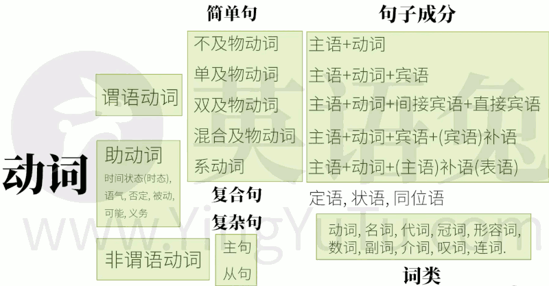

<h2 id="1b30dae33d16eab9bde306ab4b758372"></h2>

# 英语发音笔记

- [Phonics Rules](english_phonics_rules.md)
- [如何用26個英文字母來帶出所有的美式音標符號](english_26.md)
- [特殊单一子音， 不发音的t,b,n](english_silent.md)
- [简单语法笔记](english_gramma.md)

- 动词的语法体系
    - 

