...menustart

- [chapter 1: Essense of Calculus](#5c6d0419bdcc965d881019d989ad6f1a)
- [chapter 2: Paradox of the derivatives](#b872997f4e311706ca6628e823fc3459)
- [chapter 3: Derivative formulas through geometry](#13e7953947a312a1272a400065326d94)
- [chapter 4: Visualizing the chain rule and product rule](#9546814bd16cc3f81d041e7b9b643ecb)
    - [Sum rule](#06aa9025652035d38814388a75abf573)
    - [Multiply rule](#418eebdc34081971062598381d44d9ad)
    - [Chain rule](#eb0c844221ea9727339a6c0c9233c27f)
- [chapter 5: What's so special about Euler's number e?](#a80580cc58514e0b419bbc32ed0e79d2)
- [chapter 6: Implicit differentiation, what's going on here?](#91cb2bc00b850ea33ca8919983c5f6fe)
- [chapter 7: Limits, L'Hopital's rule, and epsilon delta definitions](#59a59b02331a322ab57018951bb6d886)
- [chapter 8: Integration and the fundamental theorem of calculus](#eeacb3a6987b61fae56993eb1f78fd4f)
- [chapter 9: What does area have to do with slope?](#b9130735d7a51c85445d7b6434f2dea9)
- [chapter 11: Taylor series](#f4c4612f181889150de4d5e6175f2839)

...menuend


<h2 id="5c6d0419bdcc965d881019d989ad6f1a"></h2>


# chapter 1: Essense of Calculus

**The art of doing mathematics is finding that** ***special case*** **that contains all the germs of generality**.

- how to calculate the area of round ? 
- hard problem -> sum of many small values -> **Area under a graph**
- Many of these types of problems turn out be to equivalent to finding the area under some graph.

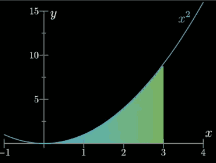

- What's the are underneath that curve , say between the values of x=0 and x=3 ? 
- Let's reframe this question in a slightly different way:
    - we'll fix that left endpoint in place at 0, and let the right endpoint vary.
    - Are you able to find a function A(x) that gives you the area under x² between 0 and x?
- A function `A(x)` like this is called an integral of x².
- Calculus holds within it the tools to figure out what an integral like this is.
- Finding this area , this integral function , is genuinely hard. 
    - And whenever you com across a genuinely hard question in math a good policy is to not try too hard to get the answer directly, since usually you just end up banging your head against a wall. 
    - Instead , play around with the idea, with no particular goal in mind. Spend some time building up familiarity with the interplay between the function defining the graph(in this case x²)  and the function give the area. 
- In that playful spirit , if you are lucky  , here's something that you might notice :
    - When you slightly increase x by some tiny nudge *dx* , looking that resulting change in sliver area  represented with *dA* , for a tiny difference in area. 
    - 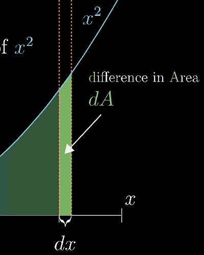
    - That sliver can be pretty well approximated with a rectanalge : dA ≈ x²·dx.  That is , dA/dx ≈ x².
    - When you look at 2 nearby pointer , 3 & 3.001, ( A(3.001)-A(3) )/0.001 ≈ 9. 
    - this ratio of *dA/dx* is called **derivative** of A. 
- We care about derivatives because they help us solve problems. Thay are the key to solving integral questions, problem that finding the area under a curve. 
    - Once you gain enough familiarity with computing derivatives, you'll be able to look at a situation like this one:
        - when you don't know what a function is , but you do know that its derivative should be x².
        - and from that , reverse engineer what the function must be. 
- And this back and forth between integrals and derivatives , where the derivative of a function for the area under a graph gives you back the function defining the graph itself is called the 
    - **Fundamental theorem of calculus**. 
    - It ties together the 2 big ideas of integrals and derivatives.  in some sense , eacho one is an inverse of the other. 


<h2 id="b872997f4e311706ca6628e823fc3459"></h2>


# chapter 2: Paradox of the derivatives
 
- Goal
    - 1 : Learn Derivatives
    - 2 : Avoid Paradoxes
- What is Derivatives?
    - Instantaneous rate of change
        - instantaneous means over a very small time 
- example 
    - 距离时间 s(t) = t³, 计算 t=2 时的速度
    - 
    ```
    ds/dt(2) = ( (2+dt)³ - 2³ ) / dt 
             = ( 2³ + 3(2)²dt + 3(2)(dt)² + (dt)³ - 2³  ) / dt
             = 3(2)² + 3(2)dt + (dt)²
             = 3(2)² , as dt→0
    ```
    - There was nothing special about choosing t=2, more generally we'd say that 
        - the derivative of t³ , as a function of t, is 3t²


<h2 id="13e7953947a312a1272a400065326d94"></h2>


# chapter 3: Derivative formulas through geometry 

- how to calculate the derivative of f(x)=x²
- let's see what happens when x is increased a bit :
    - 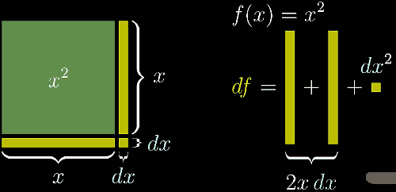
    - Since the *dx* is very tiny, a good rule of thumb is that **you can ingore anything that includes a dx raised to a power greate than 1**.
    - so, df = 2xdx  =>   df/dx = 2x 


<h2 id="9546814bd16cc3f81d041e7b9b643ecb"></h2>


# chapter 4: Visualizing the chain rule and product rule

**Using the chain rule is like peeling an onion: you have to deal with each layer at a time, and if it is too big you will start crying**,

- 3 basic ways to combine functions together
    1. Adding them  ( also substracting  )
    2. multiplying them ( also dividing )
    3. puting one inside the other 

<h2 id="06aa9025652035d38814388a75abf573"></h2>


## Sum rule

- sum rule is the easiest. 
    - the derivative of a sum of n functions ,  is the sum of their derivatives.

<h2 id="418eebdc34081971062598381d44d9ad"></h2>


## Multiply rule

- thinking df in area increasing 
- Left·*d(Right)* + Right·*d(Left)*

<h2 id="eb0c844221ea9727339a6c0c9233c27f"></h2>


## Chain rule 
- g(h(x))
- for an example: f = sin(x²)
    - let h = x²
    - df = cos(h)dh ,  substitude h with x²
    - df = cos(x²)d(x²) = cos(x²) 2x dx
- 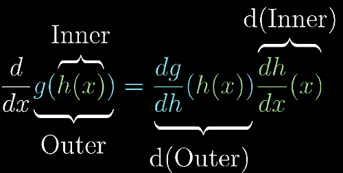
- 


<h2 id="a80580cc58514e0b419bbc32ed0e79d2"></h2>


# chapter 5: What's so special about Euler's number e?

**Who has not been amazed to learn that the function y=eˣ, like a phoenix rising again from its own ashes, is its own derivative?**

- exponentials function , like 2ˣ, 7ˣ, eˣ
- let's start with M(t) = 2ᵗ
- dM/dt(t) = (2ᵗ⁺ᵈᵗ - 2ᵗ)/dt
    - = (2ᵗ·2ᵈᵗ - 2ᵗ)/dt
    - = 2ᵗ· (2ᵈᵗ-1)/dt
- 右半部分的 只和 *dt* 有关的项非常重要, 它并不依赖于 *t*
    - when dt→0, this value (right part) approaches a very specific number: 0.6931...
- so, the derivative of 2ᵗ is itself, but multiplied by some constant. 
- And there's not too much special about the number 2 here,  if instead we had dealt with the function 3ᵗ, the derivative of 3ᵗ is proportional to itself, but this time it would have had a proportional constant 1.0986... .
- **d(aᵗ)/dt = aᵗ(some constant)**
    - whether there's some base where that proportional constant is 1 ? 
    - There is !  e = 2.71828... 
- d(e<sup>ct</sup>)/dt = ce<sup>ct</sup>
    - 2 = e<sup>ln(2)</sup>
    - 2ᵗ = e<sup>ln(2)t</sup>  -- Derivative --> ln(2)e<sup>ln(2)t</sup>  = ln(2)2ᵗ
    - ln(2) = 0.6931...
- **The mystery proportional constant** that pops up when taking derivatives is just the natural log of the base.
    - 事实上，在微积分的应用中， 你很少见到 aᵗ 这种写法，而经常会以 e<sup>ct</sup> 出现 : 5ᵗ = e<sup>(1.6094...)t</sup>
- I really want to emphasize that there are many many ways to write down any particular exponential function,
    - 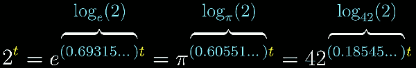
    - 指数函数之所以 选择使用  e<sup>ct</sup>,  is to gives that constant *c*  a nice, readable meaning. 
    - e<sup>ct</sup> = (e<sup>c</sup>)ᵗ


<h2 id="91cb2bc00b850ea33ca8919983c5f6fe"></h2>


# chapter 6: Implicit differentiation, what's going on here? 

- implicit differentiation 隐微分 是一种在特殊情况下使用的求导方法
    - 一般我们碰到y=xsinx还是可以很轻松的直接求导的，但是面对x²+y²=5² 的时候，就比较棘手了.
    - 这时用implicit differentiation来解决就能方便很多。(要用到chain rule)
- 举例: x²+y²=5² 求导
    - 方法1: y=±√(5²-x²) ,  看到根号就不想进行下去了...
    - 方法2: 使用隐微分.
- This curve is not the graph of a function. so we can not take a simple derivative. 
    - x is not an input, and y is not an output. they're both just independent values related by some equation. 
    - This is called an "implicit curve".  It's just the set of all points (x,y) that satisfy some property written in terms of 2 variables x and y. 
- The procedure for how you acutllay find dy/dx for curve like this ( implicit differentiation ) is the thing I fould very weird as a calculus student. 
    1. take derivative of both sides
        - 2xdx + 2ydy = 0 
    2. you get 
        - dy/dx = -x/y
        - this is the slop of point(3,4)  , is -3/4
- But first, I want to set aside this particular problem, and show how this is related to a different type of calculus problem : **Related rates**. 
    - Imagining a 5 meter long ladder up against a wall, where the top of the ladder starts 4 meters above the ground, which means the bottom is 3 meters away from the wall. 
    - and let's say it's slipping down in such way that the top of the ladder is dropping at 1m/s. 
- The question is , in that initial moment , what is the rate at which the bottom of the ladder is moving away from the wall. 
    - Let's label that distance from the top of the ladder to the ground y(t) ,  written in a function of time t because it's changing. 
    - Likewise label the distance between the bottom of the ladder to the wall x(t).
    - 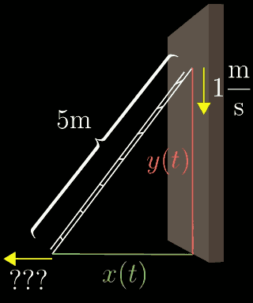
    - key equation:  x(t)² + y(t)² = 5²
        - The left-hand side is a function of time, it just so **happens to equal a constant**, meaning this value evidently doesn't change while time passes, but it's still written as an expression dependent on time. 
        - In particular, we can take a derivative of the left-hand side, which is a way of saying 
            - "If I let a little bit of time pass, dt, which causes y to slightly decrease, and x to slightly increase, how much does this expression change"
        - d(x(t)² + y(t)²)/dt = 0 
        - what you get when you computing the derivative ? 
        - 2x(t)dx/dt + 2y(t)dy/dt = 0  
        - That is equivalent to saying x²+y² must not change while the ladder moves. 
    - so, at the initial beginning 
        - 2(3)dx/dt + 2(4)-1 = 0  =>  dx/dt = 4/3
- The reason I bring up this ladder problem is that I want to compare this to the problem of finding the slope of tangent line to the circle.
- As one more example, let me show how you can use this technique to help find new derivative formulas.
    - d(ln(x))/dx = ???
    - The curve is `y = ln(x)` , first rearrange this equation to be 
        - eʸ = x 
    - take the derivative both sides
        - eʸdy = dx 
    - we get
        - dy/dx = 1/eʸ =>  dy/dx = 1/x 
- By the way, all of this a little peek into **multivariable** calculus , where you consider functions with multiple inputs, and how they change as you tweak those multiple inputs. 
    - The key, as always, is to have a clear image in your head of what tiny nudges are at play, and how exactly they depend on each other 

<h2 id="59a59b02331a322ab57018951bb6d886"></h2>


# chapter 7: Limits, L'Hopital's rule, and epsilon delta definitions

- this course
    1. df/dx
    2. lim
    3. ∫
- lim
    - Goal 1: Formal definition of a derivative
    - Goal 2: (ε,δ) definition of limits
    - Goal 3: L'Hopital's rule
- 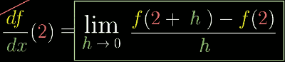
    - Lefthand side: Limit idea is built in , it is just a shorthand for what the righthand side 
    - righthand side: Formal derivative difinition
        - here, I want to emphasize that nothing about this righthand side references the paradoxical idea of an "infinitely small" change. 
        - the point of limits is to avoid that. 
        - This value h is the exact something as the *dx* referenced throughout the series. It's a nudge to the input of *f* with some nonzero, finitely small size, like 0.001.
- when a limit exists , you can make this output range as small as you want, 
    - 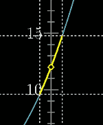
- but when the limit doesn't exists, that output range can't get smaller thant some value, not matter how much you shrink the input range around the limiting input. 
    - 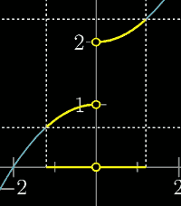
- What it means for the limit to exist is that you can always find a range of inputs around our limiting input , some distance δ around from some value x , 
    - 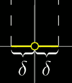
    - so that any input within a distance δ of x corresponds to an output with a distance ε of f(x). 
    - 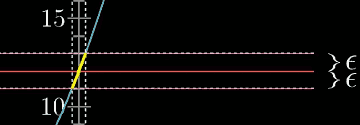
    - The key point here is that this is true for any ε , no matter how small, you always be able to find a corresponding δ.
- In contrast, when a limit doesn't exist, as in this example , 
    - 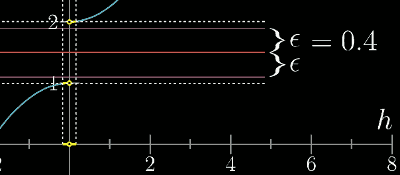
    - you can find a sufficiently small ε , like 0.4, so that no matter how tiny δ is , the corresponding range of outputs is just always too big. 
- How do you compute limits ?
    - For example, let's say for some reason you were studying the functiong  sin(πx)/(x²-1)
        - 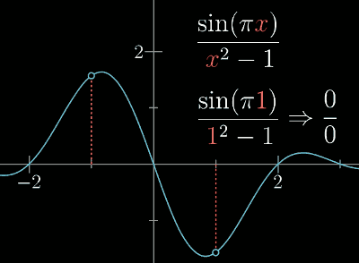
        - it looks pretty continuous , but there's a problematic value, x=1. The function is actually not defined there, and the graph should really have a hole there.
    - The graph certainly does seem to approach some distinct value at that point. So you might ask, how do you figure out what output this approaches as x approaches 1, since you can't just plug in 1 ?
    - Well, one way to approximate it would be to plug in a number very close to 1, like 1.00001 , sin(π·1.00001)/(1.00001²-1) = 1.5708...
    - But is there away to know exactly what it is ? Some systematic process to take an expression like this one , 0/0 at some input?
        - 
    - consider what happends just a tiny nudge dx away. 
        - The value of sin(πx) is bumped down. 
        - and the value of that nudge, is d(sin(πx)) = cos(πx)πdx , we plug in x=1 to this expression. we get  -πdx. 
        - similarly , the value of x²-1 graph has changed by some d(x²-1) = 2xdx, plug in x=1, we get 2dx 
        - 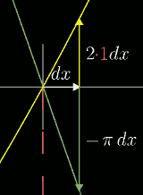
    - so lim<sub>x→1</sub> sin(πx)/(x²-1) ≈ -πdx/2dx = -π/2
    - This ratio -π/2 actually tells us the precise limiting value as x approaches 1. Remember, what that meas is that the limiting height on our original graph is evidently exactly -π/2. 
        - 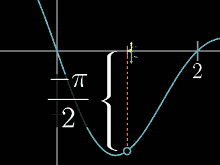
- More generally , think of any 2 functions f(x) and g(x) , which are both 0 at some common value x = a.
    - 0/0 型， 两条曲线 f(x),g(x) 相交于某个点 a  , f(a)=g(a) = 0
    - The only constraints is they have to be functions where you're able to take a derivative of them at x=a. Which means that they each basically look like a line when you zoom in close enough to that value. 
    - 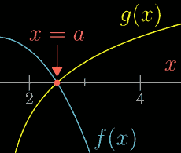
    - Even though you can't compute f/g at the trouble point, you **CAN** ask about this ratio for values of x very close to a, the limit as x approaches a. 
    -This clever trick is called **L'Hopital's rule**. 


<h2 id="eeacb3a6987b61fae56993eb1f78fd4f"></h2>


# chapter 8: Integration and the fundamental theorem of calculus

- 小车匀速行驶 v=10m/s, 8秒后 s=10x8 =80米.
    - 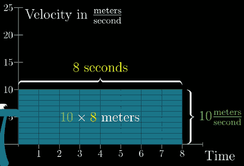
- What if the velocity is not constant? 
    - v(t) = t(8-t)
    - ∫₀⁸v(t)dt
    - 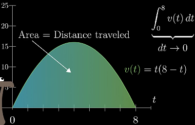
- But finding the area between a function's graph and the horizontal axis is somewhat a common language for many disparate problems that can be broken down and approximated as the sum of a large number of small things. 
- How interpret and compute the area under a graph is a very general problem-solving tool. 

---

- For our velocity example, think of this right endpoint as a variable, T. 
- So we thinking of this integral of the velocity function between 0 and T , the area under the curve between those two inputs , as a function, where that upper bound is the variable.  ∫₀ᵀ v(t)dt.
- That area represents the distance the car has traveled after T seconds. So this is really a distance vs. time function s(T).
- 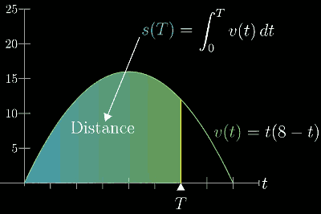
- Now ask yourself, what is the deriviate of that function ? 
    - A slight nudge of dT to the input causes that area to increase , some little ds represented by the area of this sliver. 
    - The height of that sliver is the height of the graph at that point, v(T),  and its width is dT. 
    - And for small enough dT, we can basically consider that sliver to be a rectangle. 
    - 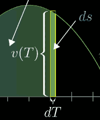
    - ds, is paproximately equals to `v(T)*dT`.   so  ds/dT = v(T).
    - And right there, that is super general idea, **the derivative of any function giving the area under a graph is equal to the function for the graph itself.**

---

- **Fundamental theorem of calculus**
    - ∫<sub>a</sub>ᵇf(x)dx = F(b) - F(a)
- One important thing to bring up before leaving is the idea of negative area. 
    - What if our velocity function was negative at some point ? It means the car is going backwards. 
    - In terms of our thin rectangles, if the rectangle goes below the horizontal axis like this, its area represents a bit of distance traveled backwards. 
    - So if what you want is to find the distance between the car's start point and end point, you'd want to **subtract** it. 
- This is generally true of integrals: Whenever a graph dips below the horizontal axis, the area underneath is counted as negative. 
- What you'll commonly hear is that integrals measure the "signed" area between a graph and the horizontal axis. 
- 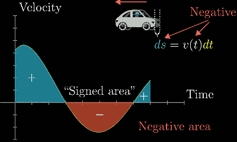


<h2 id="b9130735d7a51c85445d7b6434f2dea9"></h2>


# chapter 9: What does area have to do with slope? 

- Here, I want to disscuss one common type of problem where integration comes up:
    - Finding the average of a continuous variable. 
    - 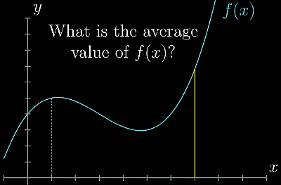
    - It gives a completely different perspective for why integrals and derivatives are inverses of each other. 
- What is the average of f(x) = sin(x) , between 0 and π? 
    - Usually, with averages , we think of a finite number of values, where you add all them up , and divide that sum by how many values there are. 
    - BUt there are infinitely many values of sin(x) between 0 and π, and it's not like we can add them up and divide by infinity. 
    - When you have this vague sense that you want to add together infinitely many values associated with a continuum like this, even though that doesn't really make sense. Almost always, when you get this sense, the key will be to use an integral somehow. 
    - Average height = Area / Width = ∫₀<sup>π</sup>sin(x)dx / π . 
    - 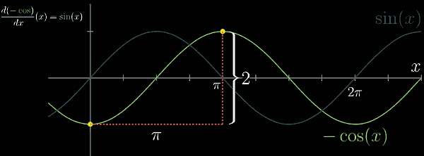
    - 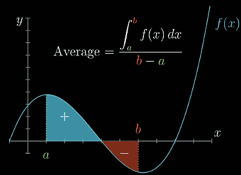


<h2 id="f4c4612f181889150de4d5e6175f2839"></h2>


# chapter 11: Taylor series

- Taylor series are one of the most powerful tools that math has to offer for approximating functions. 
- i.e.   Near θ=0, cos(θ) = 1- 1/2·θ² 
    - 
- Bug how would you even think to make this approximation ? And how would you find this particular quadratic ? 
- The study of Taylor series is largely about takeing non-polynomial functions, and finding polynomials that approximate them near some input. 
- The motive is that polynomials tend to be much easier to deal with than other functions: 
    - They're easier to compute , easier to take derivative, easier to integrate... 
- Let's look at the function cos(x) , and think about how you might constructor a quadratic approximation near x=0. 
    - That is , among all the polynomials that look like P(x)=c₀+c₁x+c₂x² , find the one that most resembles cos(x) near x=0; whose graph kind of spoons with the graph of cos(x) at that point. 
- Well, first of all, at the input 0, the value of cos(x) is 1. so if our approximation is going to be any good at all, it should also equal 1 when you plug in 0.
    - P(0) = c₀+c₁0+c₂0² = 1  ,  so we can set c₀ equal to 1.  so **P(x) = 1+c₁x+c₂x²** . 
    - This leaves us free to choose constant c₁ and c₂ to make this approximation as good as we can, be nothing we do to them will change the fact that the polynomial equals 1 at x=0.
- It also be good if our approximation had the same tangent slope as cos(x) at this point of interest. Otherwise this approximation drifts away from the cos(x) graph even for value of x very close to 0.
    - 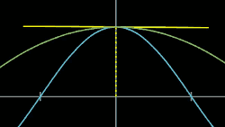 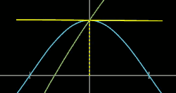
    - The derivative of cos(x) is -sin(x) , and at x=0 that equals 0.   d(cos)/dx (0) = -sin(0) = 0 
    - On the other hand, when working out the derivative of our quadratic, you get  dP/dx (x) = c₁+2c₂x. At x=0, dP/dx (0) = c₁+0.  Setting c₁ equal to 0 ensures that our approximation has the same derivative as cos(x), and hence the same tangent slope. **P(x) = 1+c₂x²** 
    - This leaves us free to change c₂, but the value and slope of our polynomial at x=0 are locked in place to match that of cos(x). 
- The final thing is that the cos(x) graph curves downward above x=0. 
    - 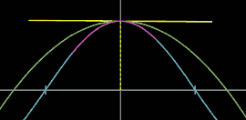
    - It has a negative second derivative. Or in another words, even though the rate of change is 0 at that point, the rate of change itself is decreasing around that point. 
    - Specifically , since its derivative is -sin(x) , its second derivative is -cos(x), so at x=0, its second derivative is -1.  d²(cos)/dx² (0) = -cos(0) = -1. 
        - d²P/dx² (x) = 2c² ,  so c₂ = -1/2.   **P(x) = 1 -1/2·x²**
- To get a feel for how good this is :
    - cos(0.1) ≈ 1-1/2·(0.1)² = 0.995
    - cos(0.1) = 0.9950042...
- Take a moment to reflect on what just happened. 
    - You has 3 degrees of freedom with a quadratic approximation, c₀,c₁,c₂ .
    - c₀ was responsible for making sure that the output of the approximation matches that of cos(x) at x=0.
    - c₁ was in charge of making sure the derivative match at that point. 
    - and c₂ was responsible for making sure the second derivatives match up. 
    - This ensurs that the way your approximation changes as you move away from x=0, and the way that the rate of change itself changes, is as similar as possible to behavior of cos(x), given the amount of control you have. 
- You could give yourself more control by allowing more terms in your polynomial , and matching higher order derivatives of cos(x). 
    - 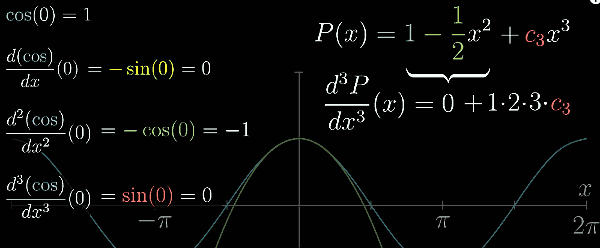
    - 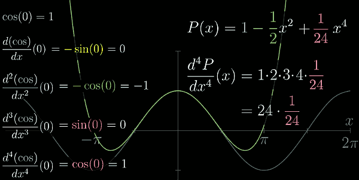
- Notice a few things
    - First, **factorial** terms naturally come up in this process.
        - d³(c₈x⁸)dx³ = 6·7·8·c₈x⁵
        - d⁸(c₈x⁸)dx⁸ = 1·2·3·4·5·6·7·8·c₈x⁰.   Set c₈ = Desired derivative value/8!
    - The second thing to notice is that adding new terms , like c₄x⁴ , doesn't mess up what old terms should be, and that's important.
        - 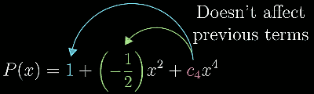
        - For example, the second derivative of this polynomial at x=0 is still equal to 2 times the second coefficient, even after introducing higher order terms to the polynomial.
            - 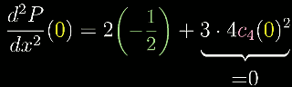
            - It's becuase we're plugging in x=0, so the second derivative of any higher order terms , which all include an x, will wash away. 
        - The same goes for any other derivative, which is why each derivative of a polynomial at x=0  is controlled by one and only one coefficient. 
            - 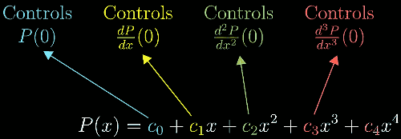
    - If instead you were approximating near an input other that 0, like x=π,  in order to get the same effect you would have to write your polynomial in terms of powers of (x-π), or whatever input you're looking at. 
        - **P<sub>π</sub>(x) = c₀ + c₁(x-π)¹ + c₂(x-π)² + c₃(x-π)³ + c₄(x-π)⁴**
        - This makes it look more complicated, but all we are doing is just making sure that the point π looks and behaviors like 0.  
        - so the pluggin in x=π will result in a lot of nice cancelation that leaves only one constant. 
        - **Plugging in x=π is very nice.**
    - And finally, on a more philosophical level, notice how what we're doing here is basically taking information about the higher order derivatives of a function at a single point, and then translateing it into information about the value of that function near that point. 
        - Derivative information at a point ---> Output information near that point  
        - We can take as many derivatives of cos(x) as we want, it follows a nice cyclic pattern.  And the value of these derivative of x=0 have the cyclic pattern 1,0,-1,0, and repeat.
        - 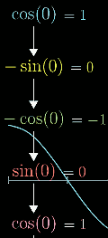
        - So what we are doing is leveraging that information to get an approximation around this input. And we do it by creating a polynomial whose higher order derivatives are designed to match up those of cos(x), following this same 1,0,-1,0 cyclic pattern. 
        - And to do that, you just make sure each coefficient of this polynomial follow this same pattern, but divide each one by the appropriate factorial, so as to cancel out the cascading effects of many power rule applications. 
        - 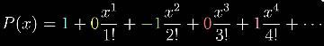
        - The polynomials you get by stopping this process at any point are called **Taylor polynomials**  for cos(x) around the input x=0.
- More generally , for any function f(x)
    - 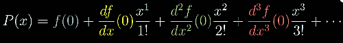
    - for input other than 0 
    - 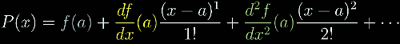
        - Changing the value of a changes where the approximation is hugging the original function; where its higher order derivative will be equal to those of the original function. 

--- 

- One of the simplest meaningful examples is eˣ , around the input x=0. 
    - 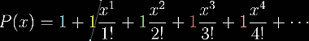
- A geometric view  to understand the second order term.  d²f/dx²(a) (x-a)².
    - It's related to the fundamental theorem of calculus: graph itself represents the derivative of the area function.
    - 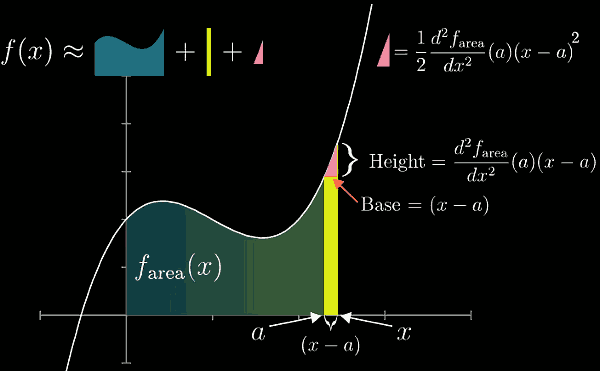
    - Each term has a clear meaning you can point to on the diagram, and they are exactly what you see with Taylor polynomials. 
- If you add up infinite Taylor polynomial terms , it's called Taylor series.
    - for functions like eˣ , the taylor series converges to eˣ for any input, even though these Taylor polynomials are constructed only from derivative information gathered at input 0. 
        - 
        - In case like this, we say eˣ equals its own Taylor series at all inputs x, which is kind of a magical thing to have happen.
        - Although this is also true for some other important functions, like sine and cosine, sometimes these series only converge with a certain range around the input whose derivative information you're using.
    - buf for functions like ln(x), around the input x=1.
        - 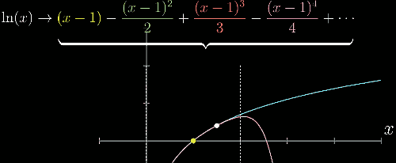
        - When you plug in an input between 0 and 2, adding more and more terms of this series will indeed get you closer and closer to the ln of that input. 
        - But outside that range, even by just a bit, the series fails to approach anything. You say the series diverges. And the maximum distance between the input you're approximating near , and points where the outputs of these polynomials actually do converge , is called the **radius of convergence** for the Taylor series. 
        - 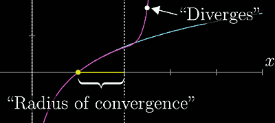

---

- Keep in your mind, Taylor series translate derivative information at a single point  to approximation information around that point. 


