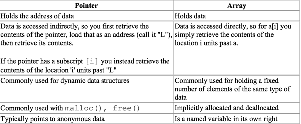
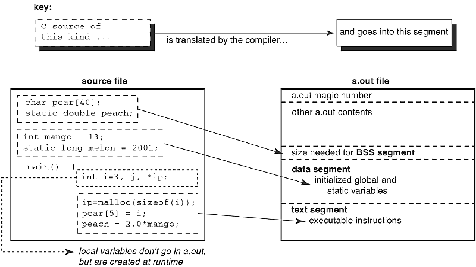
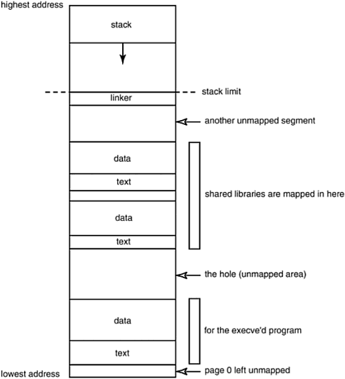
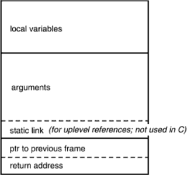
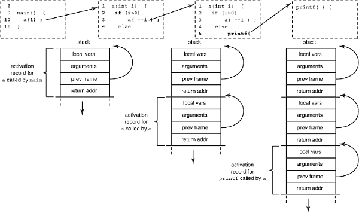
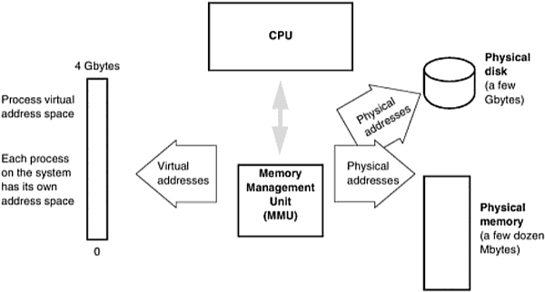
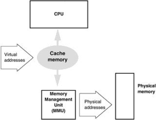
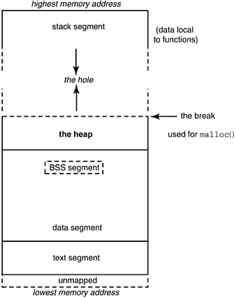

...menustart

 - [0 你清楚吗？](#c2c09bef45ddf1df36d0a55702903cba)
 - [1 Misc](#8ae7a9d09b91039571924826ab5018b8)
     - [register keyword 是个错误](#e540c9df86ffde8f8d8443c5347dab50)
     - [`char **argv` 和 `const char **p` 并不匹配](#f478e0a5be9950a75d566a3de6949efa)
     - [隐式类型转换的坑](#7441ae385364f96b273420fec579d734)
 - [2 It's Not a Bug, It's a Language Feature](#7e14dfcaec2adef0aa128a546178eb6b)
     - [空格连接字符串](#9b2b1da3319fe706936ecc07f63165b3)
     - [Too Much Default Global Visibility](#57627d14558e5f49e76b214f3cedf6bb)
     - [sizeof is operator](#8c120ee8f50200d57dc2c236a4aea6c2)
     - [Some of the Operators Have the Wrong Precedence](#892ab9a4c1d171fd57439aa763e50a23)
     - [Order of Evaluation is always undefined](#646b355af48a02490fb7d836806d222e)
 - [3. Unscrambling Declarations in C](#72b031c516a7abf0388911bba461224a)
 - [4 C Arrays and Pointers Are NOT the Same!](#b7e9138ae25a9bed094f2fc2baac2ec7)
     - [Arrays Are NOT Pointers!](#1eaa14e0cd93829351bf9715d9f5b6b9)
     - [What's a Declaration? What's a Definition?](#a8d312913a6f076559c8def2be972777)
     - [How Arrays and Pointers Are Accessed](#75a4728af33d339b0fb4e5f6c1c77f62)
     - [What Happens When You "Define as Pointer/Reference as Array"](#cdf62163f96ec1f81f8371491bb91d37)
     - [Other Differences Between Arrays and Pointers](#e6020bd3340b06367a4f39ac38b701c1)
 - [Thinking of Linking](#4517a8b879a5e0c25240ae3929d48981)
     - [The Benefits of Dynamic Linking](#a51694b67188edc8683e477e426a56ef)
     - [Five Special Secrets of Linking with Libraries](#450da0dd9224f10691b980ac70d782d3)
 - [6. Poetry in Motion: Runtime Data Structures](#56db6fe00c1a63b2206da1b3fc9d1dac)
     - [Segments](#fb9a488a6fe2d37f9a17651d744997f6)
     - [What the OS Does with Your a.out](#cf9c9db19b149da7bf46731588f14a1c)
     - [What the C Runtime Does with Your a.out](#9b556298edbaee22cddaf42efe61cba0)
         - [The Stack Segment](#3cf675eeba8bca26ae8a7b7b3e3f1b35)
     - [What Happens When a Function Gets Called: The Procedure Activation Record](#b50aba5b915400027367a056c9c39e9b)
     - [Threads of Control](#ff5dffd1a63cfb6268aa15dc53997150)
     - [setjmp and longjmp](#33d032016b5ee178e526ce98a619238f)
     - [Useful tool](#34973b949955301f78e9a38ca4003f83)
 - [7. Thanks for the Memory](#07467f535850babca09c42bcce7740b3)
     - [Virtual Memory](#b5e87cd12de6caadb66a8dddbea8135f)
     - [Cache Memory](#1a1efe6a58f7e5cbe9f0f80b3398ae3c)
     - [The Data Segment and Heap](#a47e4b5f84fb4d03a91154232aeaab75)
     - [Bus Error](#9832805d1fa6d0233d047a31da5ec39d)
     - [Segmentation Fault](#96498b0170eccc6027f7f4cea59bedf9)
 - [9 More about Arrays](#8d68ff4961d87e1341081e9b11f35ca9)
     - [When an Array Is a Pointer](#04c05fff18502967f0b95ac10adb75db)
     - [Why C Treats Array Parameters as Pointers](#e2195f06bcab48f9bc6fbb7f1cc693dc)
     - [Arrays and Pointers Interchangeability Summary](#24f1b01738a1f67b8bc231debf87a70d)
 - [11 You Know C, So C++ is Easy!](#927ac867951fec8e4915977d2999fb9f)
     - [Improvements in C++ Over C](#86ed791708ce65e7edac93b014c46870)
     - [Restrictions in C++ that are not in C](#a3f3a90203b121a6a75f03bea0e1a2eb)
     - [C中如何调用C++函数?](#d4b84ef9c02abca153e5728b87c7fb16)

...menuend


<h2 id="c2c09bef45ddf1df36d0a55702903cba"></h2>


# 0 你清楚吗？

 - 除了 数组， 所有的参数传递都是 值传递！！！  
 - 除了数组， 其它 lvalue 都 可 modify
 - 结构体 赋值 是直接 memcpy


<h2 id="8ae7a9d09b91039571924826ab5018b8"></h2>


# 1 Misc

<h2 id="e540c9df86ffde8f8d8443c5347dab50"></h2>


## register keyword 是个错误

 - The `register` keyword.
    - 这被证明是一个错误，这只是把原本编译器应该做的事情，强加给程序员
    - 由编译器而不是程序员 来决定为哪个变量使用寄存器，将会得到更好的代码
 - C强调硬件直接支持的低级操作带来了速度和可移植性，反过来又有利于UNIX的良性循环


<h2 id="f478e0a5be9950a75d566a3de6949efa"></h2>


## `char **argv` 和 `const char **p` 并不匹配

```c
foo(const char **p) { }

main(int argc, char **argv) {
    // line 5: warning: argument is incompatible with prototype
    foo(argv);
}
```

 - So doesn't argument `char **argv` match parameter `const char **p` ?
    - no, it does not.
    - 这要从赋值说起。
 - 函数传参是 赋值操作. 其中有一条限制 constraint:
    - Both operands are pointers to qualified or unqualified versions of compatible types
    - and the type pointed to by the left has all the qualifiers of the type pointed to by the right. 
 - 所以下面的语句是 完全合法的

```c
char * cp;
const char *ccp;
ccp = cp;
```

 - 因为
    1. The left operand is a pointer to "char qualified by const". (  qualifiers: const )
    2. The right operand is a pointer to "char" unqualified.   ( qualifiers: none )
    3. The type char is a compatible type with char, and
        - the type pointed to by the left operand has all the qualifiers of the type pointed to by the right operand (none) , plus one of its own (const)
 - 但是 operand 反过来 就会触发一个编译警告

```c
cp = ccp; /* results in a compilation warning */
```

 - 但是为什么前面的 `const char ** = char **` 也有警告呢？
    - 简单说，`const float *` 是一个指针(pointer to const-qualified float)，他不是一个 qualified type！！  
    - 同样的 `const char **` denotes a pointer to an unqualified pointer ,
        - its type is  a pointer to a pointer to a qualified type. 
 - 所以，`char **` and `const char **`  are both pointers to unqualified types( 指针 ) that are not the same type , they are not compatible types. 
 - 关于const
    - const 限定的是 type, 不是 variable, 因为const的功能是得到“限定的类型” 
    - C 引入const关键字的目的是优化代码，这是程序员和编译器间的约定： 
        - 他不会改变对象的值，所以可以直接使用对象的初始值而不用费工夫去读对象。

<h2 id="7441ae385364f96b273420fec579d734"></h2>


## 隐式类型转换的坑

 - Operands with different types get converted when you do arithmetic. 
    - Everything is converted to the type of the floatiest, longest operand, signed if possible without losing bits.
 - A Subtle Bug:
    - 下面程序的打印语句并不会被执行到
    - `sizeof` 的返回值是 unsigned int (maybe long) , 
    - The test is comparing a signed int with an unsigned int quantity.
    - So d is promoted to unsigned int, yields a big positive number


```c
int array[] = { 23, 34, 12, 17, 204, 99, 16 };
#define TOTAL_ELEMENTS (sizeof(array) / sizeof(array[0]))

int main(int argc, char **argv) {
    int d = -1;
    if (d <= TOTAL_ELEMENTS-2)
        printf( "can I be here ?\n" );
}
```

<h2 id="7e14dfcaec2adef0aa128a546178eb6b"></h2>


# 2 It's Not a Bug, It's a Language Feature

<h2 id="9b2b1da3319fe706936ecc07f63165b3"></h2>


## 空格连接字符串 

```c
    printf(  "a" 
             "b" 
             "c"  ) ;  // $ abc

    char * str = "d" "e" ;
    printf( "%s" , str ) ; //de
```

 - 这个特性 在以下情况下有可怕的后果：
 
```c
char *available_resources[] = {
  "color monitor",
  "big disk",
  "Cray" /*           whoa! no comma! */
  "on-line drawing routines",
  "mouse",
  "keyboard",
  "power cables",     /* and what's this extra comma? */
};
```
 
<h2 id="57627d14558e5f49e76b214f3cedf6bb"></h2>


## Too Much Default Global Visibility

 - C函数，默认是全局可见。
    - The function is visible to anything that links with that object file
 - 如果你想限制对函数的访问，你必须指定static关键字。

```c
       function apple (){ /* visible everywhere */ }
extern function pear () { /* visible everywhere */ }
static function turnip(){ /* not visible outside this file */ }
```

 - 太多的全局可见性会导致 方法名很容易和 库函数同名。


<h2 id="8c120ee8f50200d57dc2c236a4aea6c2"></h2>


## sizeof is operator

 - when sizeof's operand is a type it has to be enclosed in parentheses 
 - when operand is variable , parentheses is not required .

```c
p = N * sizeof * q; // there is noly 1 multiplication
r = malloc( p ); 
```

<h2 id="892ab9a4c1d171fd57439aa763e50a23"></h2>


## Some of the Operators Have the Wrong Precedence

```c
int i ;
i=1,2;
```

 - what value does i end up with?
    - 逗号表达式，所以i == 2 ?
    - 错， assignment has higher precedence ， you actually get:
        - `(i=1),2;` 
        - i gets the value 1; then the literal 2 is evaluated and thrown away. i ends up being one, not two.


<h2 id="646b355af48a02490fb7d836806d222e"></h2>


## Order of Evaluation is always undefined

```c
x = f() + g() * h();
```

 - The values returned by g() and h() will be grouped together for multiplication, but g and h might be called in any order. 
 - Similarly, f might be called before or after the multiplication, or even between g and h. 
 - All we can know for sure is that the multiplication will occur before the addition
 - Most programming languages don't specify the order of operand evaluation.
    - It is left undefined so that compiler-writers can take advantage of any quirks in the architecture, or special knowledge of values that are already in registers.

<h2 id="72b031c516a7abf0388911bba461224a"></h2>


# 3. Unscrambling Declarations in C

 - C's declaration syntax is trivial for a compiler (or compiler-writer) to process, but hard for the average programmer.
 - The BCPL language (the grandfather of C) was type-poor, having the binary word as its only data type, so C drew on a base that was deficient. 
 - And then, there is the C philosophy that the declaration of an object should look like its use.
    - An array of pointers-to-integers is declared by `int * p[3];`
    - and an integer is referenced or used in an expression by writing `*p[i]`
    - so the declaration resembles the use.
 - The advantage of this is that the precedence of the various operators in a "declaration" is the same as in a "use".
 - The disadvantage is that operator precedence
    - Programmers have to remember special rules to figure out whether int `*p[3]` is an array of pointers-to-int, or a pointer to an array of ints.
 - A better idea would have been to declare a pointer as 
    - `int &p;`
    - which at least suggests that p is the address of an integer. 
    - This syntax has now been claimed by C++ to indicate a call by reference parameter.
 - But the biggest problem is that you can no longer read a declaration from left to right, as people find most natural. 
    - The situation got worse with the introduction of the `volatile` and `const` keywords with ANSI C; 
    - since these keywords appear only in a declaration (not in a use), there are now fewer cases in which the use of a variable mimics its declaration. 
 - If you want to cast something to the type of pointer-to-array, you have to express the cast as:

```c
char (*j)[20]; /* j is a pointer to an array of 20 char */
j = (char (*)[20]) malloc( 20 );
```

 - What exactly, for example, does the following declaration (adapted from the telnet program) declare?

```c
char* const *(*next)();
```

 - see [c declaration,struct/union/enums/typedef](c_declaration.md) 


<h2 id="b7e9138ae25a9bed094f2fc2baac2ec7"></h2>


# 4 C Arrays and Pointers Are NOT the Same!

<h2 id="1eaa14e0cd93829351bf9715d9f5b6b9"></h2>


## Arrays Are NOT Pointers!

```c
extern int *x;
extern int y[];
```

 - The first declares x to be a pointer to int;
 - the second declares y to be an array of int of unspecified size (an incomplete type),
    - the storage for which is defined elsewhere.

<h2 id="a8d312913a6f076559c8def2be972777"></h2>


## What's a Declaration? What's a Definition?

· | · | ·
--- | --- | --- 
definiton | occurs in only one place |  specifies the type of an object; reserves storage for it; is used to create new objects
· | · | example: `int my_array[100];`
declaration | can occur multiple times | describes the type of an object; is used to refer to objects defined elsewhere (e.g., in another file)
· | · | example: `extern int my_array[];`


<h2 id="75a4728af33d339b0fb4e5f6c1c77f62"></h2>


## How Arrays and Pointers Are Accessed

 - address y and contents of address y

```c
x = y ;
```

x | y
--- | ---
x, in this context, means the **address** that x represents | y, in this context, means the **contents of the address** that y represents
This is termed **l-value**  | This is termed **r-value**
An **l-value** is known at compiletime | an **r-value** is not known until runtime. 
An **l-value** says where to store the result | "The value of y" means the **r-value**  unless otherwise stated

 - A "modifiable l-value" is a term introduced by C. 
 - It means an l-value that is permitted to appear on the left-hand side of an assignment statement. 
 - This weirdness was introduced to cope with arraynames which are l-values that locate objects, but in C may not be assigned to.
 - Hence , an arrayname is an l-value but not a modifialbe l-value.  
 - The standard stipulates that an assignment operator must have a modifiable l-value as its left operand. 
 - **You can only assign into things that you can change.**.

---

 - The compiler allocates an address (or l-value) to each variable (x , y).
 - This address is known at compiletime, and is where the variable will be kept at runtime. 
 - In contrast, the value stored in a variable at runtime (its r-value) is not known until runtime.
    - If the value stored in a variable is required, the compiler emits code to read the value from the given address and put it in a register.
 - The key point here is that the address of each symbol is known at compiletime. 
    - 所以，如果编译器需要用地址做一些事情（可能是增加一个偏移量），它可以直接做到这一点，不需要植入代码来首先取到地址。
    - In contrast, the current value of a pointer must be retrieved at runtime before it can be dereferenced
 - A Subscripted Array Reference:

```c
char a[9] = "abcdefg" ; 
...
c = a[i] ;
``` 

 - compiler symbol table has *a* as address 9980
    - runtime step1:  get value i , add add it to 9980
    - runtime step2:  get the contents from address (9980+i)
 - That's why you can equally write `extern char a[];` as well as `extern char a[100];`

    
<h2 id="cdf62163f96ec1f81f8371491bb91d37"></h2>


## What Happens When You "Define as Pointer/Reference as Array"

 - Consider the case of an external declaration
    - `extern char *p;`
 - but a definition of 
    - `char p[10];`
 - When we retrieve the contents of `p[i]` using the extern, we get characters, but we treat it as a pointer.
 - Interpreting ASCII characters as an address is garbage . and 
    - if you're lucky the program will coredump at that point. 
    - If you're not lucky it will corrupt something in your address space, causing a mysterious failure at some later point in the program.


 - **Match Your Declarations to the Definition**

<h2 id="e6020bd3340b06367a4f39ac38b701c1"></h2>


## Other Differences Between Arrays and Pointers



---

<h2 id="4517a8b879a5e0c25240ae3929d48981"></h2>


# Thinking of Linking

 - A Compiler is Often Split into Smaller Programs
    - C Preprocessor  : Phase p
    - Front-end   : Phase 0
    - Back-end (code generator) : Phase c
    - Optimizer : Phase 2
    - Assembler : Phase a
    - Link-loader : Phase l 
 - You can look at the individual phases of compilation by using the `-v` option.
 - You can pass options to each phase, by giving the compiler-driver a special `-W` option
    - that says "pass this option to that phase." 
    - The "W" will be followed by a *character indicating the phase*, a *comma*, and then the *option*. 
 - So to pass any option through the compiler driver to the linker, you have to prefix it by "-Wl," to tell the compiler driver that this option is intended for the link editor , not the others.
 - The command 
    - `cc -Wl,-m main.c > main.linker.map`
    - will give ld the "-m" option, telling it to produce a linker map. 

<h2 id="a51694b67188edc8683e477e426a56ef"></h2>


## The Benefits of Dynamic Linking

 - Dynamic linking permits easy versioning of libraries. 
    - New libraries can be shipped; once installed on the system, old programs automatically get the benefit of the new versions without needing to be relinked.
 - Dynamic linking is "just-in-time" linking. It does mean that programs need to be able to find their libraries at runtime.
    - 链接器通过将库文件名或路径名放入可执行文件来完成此操作;
    - and this in turn, means that libraries cannot be moved completely arbitrarily.
    - 当你在 与编译的机器 不同的机器上执行时，这也是一个问题。 
        - 执行机器必须包含所有链接的库，并且必须将它们放在您告诉链接器的目录中。 
        - 对于标准系统库，这不是问题。
 - The main reason for using shared libraries is to get the benefit of the ABI
    - freeing your software from the need to recompile with each new release of a library or OS. 
    - As a side benefit, there are also overall system performance advantages.
 - 任何人都可以创建一个静态或动态库。 
    - 只需编译一些没有 main routine 的代码，然后 使用正确的工具来处理 生成的.o文件
    - ar for static library
    - ld for dynamic library

<h2 id="450da0dd9224f10691b980ac70d782d3"></h2>


## Five Special Secrets of Linking with Libraries
 
 1. Dynamic libraries are called lib something.so , and static libraries are called lib something.a
 2. You tell the compiler to link with, for example, `libthread.so` by giving the option `-lthread`
 3. The compiler expects to find the libraries in certain directories
    - 编译器会查找一些特殊的地方，例如`/usr/lib/`
    - 编译器选项-Lpathname用于告诉链接器其他目录的列表，用于搜索已经使用 `-l`选项指定的库
 4. Identify your libraries by looking at the header files you have used
 5. Symbols from static libraries are extracted in a more restricted way than symbols from dynamic libraries


<h2 id="56db6fe00c1a63b2206da1b3fc9d1dac"></h2>


# 6. Poetry in Motion: Runtime Data Structures

<h2 id="fb9a488a6fe2d37f9a17651d744997f6"></h2>


## Segments

 - 就 object files 而言, they are simply areas within a binary file , where all the information of a particular type (e.g., symbol table entries) is kept.
 - The term *section* is also widely used. 
 - A segment typically contains several sections.

--- 

 - Don't confuse the concept of segment on UNIX with the concept of segment on the Intel x86 architecture.
    - A segment on UNIX is *a section of related stuff in a binary*.
    - A segment in the Intel x86 memory model is *the result of a design in which (for compatibility reasons) the address space is not uniform, but is divided into 64-Kbyte ranges known as segments.*

 - When you run size on an executable, it tells you the size of three segments known as text, data, and bss in the file:

```bash
# size a.out
text    data     bss     dec     hex filename
1250     568      72    1890     762 a.out
```

 - Another way to examine the contents of an executable file is to use the *nm* or *dump* utilities. 

---



 - BSS
    - The BSS segment, also known as *uninitialized data* , is usually adjacent to the data segment.
    - The BSS segment contains all global variables and static variables that are initialized to zero or do not have explicit initialization in source code. 
    - The name of BSS segment is from "Block Started by Symbol"
    - Some people like to remember it as "Better Save Space." 
        - Since the BSS segment only holds variables that don't have any value yet, it doesn't actually need to store the image of these variables. 
    - The size that BSS will require at runtime is recorded in the object file, 
        - but BSS (unlike the data segment) doesn't take up any actual space in the object file.
 - 上图显示的程序中，
    - 如果加上一个 全局数组 `int test[1000];` 
        - `size a.out` 显示 bss 大小 从 72 变成了4096 ， 但是 `ls -l` 显示 a.out 大小并没有变化 
    - 现在， 给 test 一个非0初始化器 . i.e. `int test[1000] = {1};`
        - `size a.out` 显示 bss 恢复到 72， 而 data 从 568 增加到了 4592  , `ls -l` 显示 a.out 文件也变大了
    - 现在，在函数中，加入两个大数组声明: `int test_local[1000] ; int test_local2[1000] = {1} ;` 
        - 仅仅 text 段有 略微增加， data , bss 没有变化
    - 最后 打开优化选项, `-O2`
 - results
    - the data segment is kept in the object file
    - the BSS segment isn't kept in the object file (except for a note of its runtime size requirements)
    - the text segment is the one most affected by optimization


<h2 id="cf9c9db19b149da7bf46731588f14a1c"></h2>


## What the OS Does with Your a.out


 - Now we see why the a.out file is organized into segments.
 - The segments conveniently map into objects that the runtime linker can load directly!
 - The loader just takes each segment image in the file and puts it directly into memory.
 - The segments essentially become memory areas of an executing program, each with a dedicated purpose.


 - The text segment contains the program instructions.
    - The loader copies that directly from the file into memory (typically with the `mmap()` system call)
    - and need never worry about it again, as program text typically never changes in value nor size.
 - The data segment contains the initialized global and static variables, complete with their assigned values. 
    - The size of the BSS segment is then obtained from the executable, and the loader obtains a block of this size, putting it right after the data segment. 
    - 分配  BSS size 大小的内存
 - The of data and BSS is usually just referred to jointly as the *data segment*.
    - This is because a segment, in OS memory management terms, is simply a range of consecutive virtual addresses, so adjacent segments are coalesced.
    - The data segment is typically the largest segment in any process.
 - We still need some memory space for local variables, temporaries, parameter passing in function calls, and the like.
    - A stack segment is allocated for this.
 - We also need heap space for dynamically allocated memory.
    - This will be set up on demand, as soon as the first call to `malloc()` is made.
 - Note that the lowest part of the virtual address space is unmapped
    - that is, it is within the address space of the process, but has not been assigned to a physical address, so any references to it will be illegal.
    - This is typically a few Kbytes of memory from address zero up.
    - It catches references through null pointers, and pointers that have small integer values.

---

 - When you take shared libraries into account :



<h2 id="9b556298edbaee22cddaf42efe61cba0"></h2>


## What the C Runtime Does with Your a.out

 - how does C organize the data structures of a running program ?
 - There are a number of runtime data structures: 
    - the stack, activation records, data, heap, and so on. 

<h2 id="3cf675eeba8bca26ae8a7b7b3e3f1b35"></h2>


### The Stack Segment

 - The runtime maintains a pointer, often in a register and usually called `sp` , 
    - that indicates the current top of the stack.
 - The stack segment has three major uses, two concerned with functions and one with expression evaluation:
    - The stack provides the storage area for local variables declared inside functions. 
        - These are known as "automatic variables" in C terminology.
    - The stack stores the "housekeeping" information involved when a function call is made. 
        - This housekeeping information is known as a stack frame or, more generally, a procedure activation record. 
        - it includes 
            - the address from which the function was called  (i.e., where to jump back to when the called function is finished) ,
            - any parameters that won't fit into registers, 
            - and saved values of registers.
    - The stack also works as a scratch-pad area
        - every time the program needs some temporary storage, perhaps to evaluate a lengthy arithmetic expression, it can push partial results onto the stack, popping them when needed.
        - Storage obtained by the `alloca()` call is also on the stack. 
 - 如果不是要支持递归的话，其实可以不需要Stack.  
    - local variables, parameters, and return addresses 需要的空间是固定的，在编译阶段就可以知道，并且可以在BSS 中分配。
    - 这样的话，并不需要 动态堆栈。
    - 允许递归，意味着 我们必须找到 允许同时存在多个局部变量的实例的方法，并且只有最近创建的才能被访问。

 - Compile and run this small test program to discover the approximate location of the stack on your system:

```c
#include <stdio.h>
main() {
    int i;
    printf("The stack top is near %p\n", &i);
    return 0; 
}
```

 - 类似的方法，也可以找到 data and text segment  的地址.

<h2 id="b50aba5b915400027367a056c9c39e9b"></h2>


## What Happens When a Function Gets Called: The Procedure Activation Record

 - keeping track of the call chain
    - which routines have called which others ,
    - and where control will pass back to, on the next "return" statement. 
 - The classic mechanism that takes care of this is the procedure activation record on the stack.
 - There will be a procedure activation record (or its equivalent) for each call statement executed.
 - The procedure activation record is a data structure that 
    - supports an invocation of a procedure, 
    - and also records everything needed to get back to where you came from before the call. 
 - A Canonical Procedure Activation Record:
    - 
    - It is just illustrative. 
        - The exact structure will vary from implementation to implementation. 
        - The order of the fields may be quite different.
        - There may be an area for saving register values before making the call.
    - ptr to previous frame : 指向上一个frame 在 栈上的地址
    - return address 告诉下一个指令的地址 ?
    - `/usr/include/sys/frame.h`, shows how a stack frame looks on your UNIX system.
 - The runtime maintains a pointer, often in a register and usually called `fp`,  which indicates the active stack frame. This will be the stack frame nearest to or at the top of the stack.

```c
a (int i) {
    if (i>0)
        a(--i);
    else
        printf("i has reached zero ");
    return ;
}

main() {
    a(1) ;
}
```



 - Compiler-writers will try to speed up programs by  not storing information that will not be used.
 - Other optimizations include 
    - keeping information in registers instead of on the stack, 
    - not pushing a complete stack frame for a leaf function (a function that doesn't make any calls itself),
    - and making the callee responsible for saving registers, rather than the caller.
 - The "pointer to previous frame" within each frame simplifies the task of popping the stack back to the previous record when the current function returns.
 - Remember that compiler-writers will try to place as much of an activation record in registers as possible (because it's faster), so some of this may not be visible on the stack. 


<h2 id="ff5dffd1a63cfb6268aa15dc53997150"></h2>


## Threads of Control

 - It should now be clear how different threads of control can be supported within a process. 
 - Simply have a different stack dedicated to each thread of control.
 - Each thread gets a stack of 1Mb (grown as needed) and a page of red zone betweeen each thread's stack. 

<h2 id="33d032016b5ee178e526ce98a619238f"></h2>


## setjmp and longjmp

 - `setjmp()` and `longjmp()` are implemented by manipulating activation records.
 - it's a feature unique to C. 
 - they works like `long goto` in some other language
    - `setjmp(jmp_buf j)` must be called first.
        - it store the context to jmp_buf `j` , Return 0 from first time calling. 
    - `longjmp(jmp_buf j,int i)` can then be called.
        - it restore the saved context, and continue executing from that point.
        - longjmp never return,  it returns from setjmp, the return value is its 2nd parameter `i`
    - The contents of the j are destroyed when it is used in a `longjmp()`.
    - It's termed "unwinding the stack," because you unroll activation records from the stack until you get to the saved one.  
 - Although it causes a branch, longjmp differs from a goto in that:
    - A goto can't jump out of the current function in C 
        - that's why this is a "longjmp"— you can jump a long way away, even to a function in a different file
    - You can only longjmp back to somewhere you have already been, where you did a setjmp, and that still has a live activation record.
        - In this respect, setjmp is more like a "come from" statement .
        - Longjmp takes an additional integer argument that is passed back, and lets you figure out whether you got here from longjmp or from carrying on from the previous statement.
 - Example 

```c
#include <setjmp.h>
jmp_buf buf;
#include <setjmp.h>
banana() {
    printf("in banana()\n");
    longjmp(buf, 1);
    /*NOTREACHED*/
    printf("you'll never see this, because I longjmp'd");
}
main()
{
    // when return back from banan
    // setjmp will return 1
    if (setjmp(buf))  
        printf("back in main\n");
    else {
        printf("first time through\n");
        banana(); 
    }
}
```

```bash
$ ./a.out
first time through
in banana()
back in main
```

 - Point to watch: the only reliable way to ensure that a local variable retains the value that it had at the time of the longjmp is to declare it volatile. (This is for variables whose value changes between the execution of setjmp and the return of longjmp.)

 - A setjmp/longjmp is most useful for error recovery.
    - They have mutated into the more general exception routines "catch" and "throw" in C++.

```c
switch(setjmp(jbuf)) {
    case 0:
        apple = *suspicious;
        break;
    case 1:
        printf("suspicious is indeed a bad pointer\n");
        break;
    default:
        die("unexpected value returned by setjmp");
}
```

 - Like goto's, setjmp/longjmp can make it hard to understand and debug a program. They are best avoided except in the specific situations described.

---

 - 在 UNIX 上，程序员可以认为 堆栈是无限大的。
 - 当您尝试访问超出当前分配给堆栈的空间时，它会生成一个称为页面错误的硬件中断。
 - 页面错误以几种方式之一处理，具体取决于引用是有效的还是无效的。
    - 无效地址:内核通常会通过向违规进程发送适当的信号（可能是 segment fault）来处理对无效地址的引用。
    - red zone:
        - There's a small "red zone" region just below the top of the stack. 
        - A reference to there doesn't pass on a fault; instead, the operating system increases the stack segment size by a good chunk. 
 - 在DOS中，堆栈大小必须被指定为构建可执行文件的一部分，并且不能在运行时增长。
    - 指定堆栈大小的方法因编译器而异。 

<h2 id="34973b949955301f78e9a38ca4003f83"></h2>


## Useful tool

 - cdecl 
    - explain c declaration , brew install cdecl
 - strings 
    - Looks at the strings embedded in a binary. 
 - file
    - Tells you what a file contains (e.g., executable, data, ASCII, shell script, archive, etc.).
 - time
    - Displays the total real and CPU time used by a program.
    - `time ./a.out`

---

<h2 id="07467f535850babca09c42bcce7740b3"></h2>


# 7. Thanks for the Memory

 - A knowledge of memory architecture helps a programmer to understand some of the C conventions and restrictions.

<h2 id="b5e87cd12de6caadb66a8dddbea8135f"></h2>


## Virtual Memory

 - If it's there and you can see it—it's real
 - If it's not there and you can see it—it's virtual
 - If it's there and you can't see it—it's transparent
 - If it's not there and you can't see it—you erased it!

--- 

 - It is very inconvenient for a program to be restricted by the amount of main memory installed on a machine
 - So early on in computing, the concept of virtual memory was developed to remove this restriction. 
 - The basic idea is to use cheap but slow disk space to extend your fast but expensive main memory. 
    - 程序在任何时刻实际使用的内存区域都被带入物理内存。
    - 当记忆区域未被触动一段时间时，它们可能会被保存到磁盘中，从而腾出空间来引入正在使用的其他存储区域。
    - 所有现代计算机系统从最大的超级计算机到最小的工作站，除了个人电脑以外，都使用虚拟内存。

---

 - Multilevel store is a familiar concept.  We see it elsewhere on a computer (e.g., in registers vs. main memory). 
 - In theory, every memory location could be a register. 
    - In practice, this would be prohibitively expensive, so we trade off access speed for a cheaper implementation. 
    - 虚拟内存只是进一步扩展了这个阶段，使用磁盘而不是主内存来保存正在运行的进程的映像。



 - 虚拟内存被组织成“页面”。
 - 一个页面是操作系统移动和保护的单位，通常是几K字节的大小。
 - 您可以通过输入 `/usr/ucb/` pagesize来查看系统中的页面大小。

```bash
$ pagesize
4096
```

 - 内存映像在磁盘和物理内存之间传输时, we say it is being paged in (if going to memory) or paged out (going to disk).
 - 一个进程的内存，有可能，全部会被操作系统 拿回去。
    - 如果进程暂时不太可能会运行( 可能是 优先级低，或 正在睡眠状态 ) ， 则分配给它的所有物理内存资源 都可以被带走并备份到磁盘上。
    - The process is then said to be "swapped out." 
    - 磁盘上有一个特殊的“swap area”，用于保存已被分页或交换的内存。
 - 只有用户进程处理页面和交换。 SunOS内核始终是内存驻留。
 - A process can only operate on pages that are in memory. 
    - 当进程引用不在内存中的页面时，MMU会 产生一个 page fault 。
    - The kernel responds to the event and decides whether the reference was valid or invalid. 
    - 如果无效，则内核向进程发出“segmentation violation”的信号。
    - If valid, the kernel retrieves the page from the disk.  
 
<h2 id="1a1efe6a58f7e5cbe9f0f80b3398ae3c"></h2>


## Cache Memory

 - 高速缓存是多级存储概念的进一步扩展。
 - 它是一个小而昂贵的，但速度非常快的内存缓冲区，位于CPU和物理内存之间。




 - 所有现代处理器都使用高速缓存
 - 无论何时从内存中读取数据，整个“行”（通常为16或32字节）被带入缓存。
 - If the program exhibits good locality of reference (e.g., it's striding down a character string), 则后续数据 可以从cache 而不是main memory 中获取。
 - 高速缓存的运行速度与系统的周期时间相同，因此对于50 MHz处理器，高速缓存运行时间为20纳秒。
    - 主内存通常比这慢四倍！
 - Cache比较昂贵，需要比普通内存更多的空间和功耗.
 - The cache contains a list of **addresses** and **their contents**. 
    - 它的地址列表不断变化，因为处理器引用了新的位置。
 - Both reads and writes go through the cache. 
    - 当处理器想要从特定地址取数据时，请求首先进入缓存。
    - 如果数据已经存在于缓存中，则可以立即交付。
    - 否则，高速缓存 将传递请求，并对主内存进行访问。
        - 一个新行被取回， 并放入缓存
 - 如果你的程序写的很任性,每次都错过了缓存，那么最终的性能会比根本没有缓存的性能更差。
 - Sun currently uses two types of cache:
    - Write-through cache
        - 写入缓存的同时启动对主内存的写入。
    - Write-back cache
        - 第一次只写入缓存
        - 当缓存行 将要被重新写入并且还没有发生保存时，数据被写到主存储器。
        - 当一个上下文切换发生( 切换到另一个进程或内核 ) ， 缓存数据也会被 写回主存储器.
 - 无论用哪种类型的缓存，只要对缓存访问完成，指令流就会继续，不会等待主内存完成写操作。
 - Cache Memories Are Made of This

Term | Definition
--- | ---
Line | A Line 是访问缓存的单位。 每一行都有两个部分：一个数据部分和一个指定它所代表的地址的标签
Block | 一个行的数据部分 称为一个block. 通常32字节.
 

```c
#include <string.h>

#define DUMBCOPY for (i = 0; i < 65536; i++) \
      destination[i] = source[i]

#define SMARTCOPY memcpy(destination, source, 65536)


int main()
{
    char source[65536], destination[65536];
    long i, j;
    for (j = 0; j < 100; j++)
        SMARTCOPY; 
        /* DUMBCOPY ;  */
}
```

 - 分别使用 memcpy 和 依次赋值的运行差别

```bash
$ time ./a.out

real    0m0.005s
user    0m0.002s
sys 0m0.002s


$ time ./a.out

real    0m0.021s
user    0m0.017s
sys 0m0.002s
```

 - 在这种特殊情况下，源和目标都使用相同的高速缓存行，导致每个内存引用都会错过高速缓存，并在等待正常内存交付时停止处理器。
 - 库memcpy（）特别针对高性能进行了优化。
    - It unrolls the loop to read for one cache line and then write, which avoids the problem. 


<h2 id="a47e4b5f84fb4d03a91154232aeaab75"></h2>


## The Data Segment and Heap

 - Heap 是用于动态分配的存储空间，即通过malloc（内存分配）获得并通过指针访问的存储空间。
 - 堆中的所有东西都是匿名的 -- 你不能直接通过名字访问它，只能通过指针间接访问。
 - The malloc (and friends: calloc, realloc, etc.) library call is the only way to obtain storage from the heap. 
    - 函数calloc就像malloc，但在给你指针之前将内存清零。
    - 函数realloc（）改变指向的内存块的大小，不管是增长还是缩小，往往通过将内容复制到其他地方并给你一个指向新位置的指针。
        - 在动态增加表的大小时这很有用.



 - 堆必须跟踪不同的区域，以及它们是否正在使用或malloc可用。
 - 一个方案是有一个可用块（“free store”）的链表. 
 - Some people use the term **arena** to describe the set of blocks managed by a memory allocator.
 - Malloced memory is always aligned appropriately for the largest size of atomic access on a machine, 
    - and a `malloc` request may be rounded up in size to some convenient power of two. 
 - 释放的内存回到堆中以供重用，但没有（方便的）方式将其从进程中移除并将其交还给操作系统。 代价很高
 - The end of the heap is marked by a pointer known as the "break".
    - *Your programs will "break" if they reference past the break...*
 - When the heap manager needs more memory, it can push the break further away using the system calls `brk` and `sbrk`
    - You typically don't call `brk` yourself explicitly
 - The calls that manage memory are:
    - `malloc` and `free` — get memory from heap and give it back to heap 
    - `brk` and `sbrk` — adjust the size of the data segment to an absolute value/by an increment

<h2 id="9832805d1fa6d0233d047a31da5ec39d"></h2>


## Bus Error

 - 总线错误几乎总是由读取或写入错位导致的。
 - It's called a bus error, 因为地址总线是 请求未对齐的地址读写而出错的组件。
 - 对齐意味着数据项只能存储在其大小倍数的地址处。
    - 如果没有对齐，整个操作系统会更慢.
 - 通过强制每个单独的内存访问保留在一个缓存行中或单个页面上，我们大大简化了（并因此加速了）hardware like cache controllers and memory management units.
    - 我们表达“没有数据项可能跨越一个页面或缓存边界”的规则有点间接，这里我们用地址对齐的方式来说明它，而不是禁止跨越页面边界，但它归结为同样的事情。
    - 例如，访问一个8字节的double是只允许在8个字节的倍数的地址。 所以一个double可以存储在地址24，地址8008，或 地址32768, 但不能是地址 1006.
 - Page and cache sizes are carefully designed so that keeping the alignment rule will ensure that no atomic data item spills over a page or cache block boundary.
 - 一个会导致总线错误的小程序是：

```c
union { char a[10];
    int i;
} u;
int *p= (int*) &(u.a[1]);
*p = 17; /* the misaligned addr in p causes a bus error! */
```

 - 编译器自动分配和填充数据（在内存中）以实现对齐。

<h2 id="96498b0170eccc6027f7f4cea59bedf9"></h2>


## Segmentation Fault

 - 导致分段错误的小程序是：

```c
int *p=0;
*p = 17;     /* causes a segmentation fault */
```

 - 一个总线错误意味着CPU不喜欢那个内存引用，而segv意味着MMU不喜欢它。

---

<h2 id="8d68ff4961d87e1341081e9b11f35ca9"></h2>


# 9 More about Arrays

<h2 id="04c05fff18502967f0b95ac10adb75db"></h2>


## When an Array Is a Pointer

 - 前面的章节强调了当数组不能写成指针时最常见的情况。
 - 很多情况下，数组可以与指针互换
 - Declarations themselves can be further split into three cases:
    1. declaration of an external array
    2. definition of an array 
        - a definition is just a special case of a declaration; it allocates space and may provide an initial value
    3. declaration of a function parameter

 - 所有作为函数参数的数组名称总是由编译器转换为指针。
    - `func( char a[] )`
 - 在所有其他情况下，数组的声明给了你一个数组，一个指针的声明给你一个指针.
    - `extern char[]`
    - `char a[10]`
    - can not be rewritten as a pointer  
 - 但是一个数组的使用（在一个语句或表达式中的引用）总是可以被重写为 使用一个指针。
    - `c = a[i]` 
 - 数组是地址， 指针是 地址的地址
 
 - Rules for when arrays are pointers
    - rule 1: An array name **in an expression** (in contrast with a declaration) is treated by the compiler as a pointer to the first element of the array.
        - `p=a; `
        - `p=a+i;`
    - rule 2: A subscript is always equivalent to an offset from a pointer
    - rule 3: An array name **in the declaration of a function parameter** is treated by the compiler as a pointer to the first element of the array 

<h2 id="e2195f06bcab48f9bc6fbb7f1cc693dc"></h2>


## Why C Treats Array Parameters as Pointers

 - 数组作为指针传递给函数的原因是效率，所以通常是违反良好软件工程实践的理由。
 - C中的所有 非数组 数据参数都是“通过值”传递的
    - a copy of the argument is made and passed to the called function
 - 复制数组的内存和时间可能非常昂贵
    - 而大多数情况下，实际上并不需要数组的副本，您只需要在函数中指明您现在感兴趣的特定数组。
 - 如果 所有数组都作为指针传递给开始，其他所有数据都通过复制来传递， 那么 编译器的工作就可以极大的简化
 - 函数的返回值也不能是数组或函数，只能是指向数组或函数的指针。
 - 给出以下定义

```c
   func( int * turnip){...}
or
    func( int turnip[]){...}
or
    func( int turnip[200]){...}

int my_int; /* data definitions */
int * my_int_ptr;
int my_int_array[10];
```

 - 以下调用都是合法的
    - 所以， 在func（）里面，你没有任何简单方法知道 这个函数调用的方式和目的.

```c
func(&my_int );
func( my_int_ptr );
func( my_int_array );
func(&my_int_array[i] );
```

<h2 id="24f1b01738a1f67b8bc231debf87a70d"></h2>


## Arrays and Pointers Interchangeability Summary

 1. 数组访问`a[i]`总是被编译器“重写”或解释为指针访问`*（a + i）;`
 2. 函数 形参parameter中的 数组声明 等同于指针; 函数调用中的 数组实参argument 总是由编译器改变为指向数组开始的指针。
 3. 因此，你可以定义一个函数的 数组参数  无论用数组或指针。
 4. 在所有其他情况下，定义应该与声明相匹配。

---

<h2 id="927ac867951fec8e4915977d2999fb9f"></h2>


# 11 You Know C, So C++ is Easy!

 - 面向对象编程的特点是继承和动态绑定。
    - C ++通过类派生支持继承。
    - 动态绑定由virtual class functions 提供

<h2 id="86ed791708ce65e7edac93b014c46870"></h2>


## Improvements in C++ Over C

 - 初始化一个char数组,没有足够的空间用于结尾nul  的容易出错的构造, 被认为是一个错误。
    - `char b[3]="Bob";`  will cause an error in C++, but not in C.
 - 类型转换可以写成 float(i) 这种看着正常的 格式
    - 当然也可以是c风格的 (float)i
 - C ++允许一个constant integer定义一个数组的大小。
    - `const int size=128;   char a[size];` is allowed in C++, but will generate an error message from C.

<h2 id="a3f3a90203b121a6a75f03bea0e1a2eb"></h2>


## Restrictions in C++ that are not in C

 - 函数原型在C ++中是必需的，但在C中是可选的
 - Typedef names 不能与C++中的 struct tag 冲突，但C中可以( 它们属于不同的名称空间 )
 - `void *` 指针 赋值给 其它类型指针， C++ 中需要一个强制类型转换
 - 字符文字 'x' 在C++中 是char类型，但在C中是int 类型。也就是说，sizeof（'a'）在C++中为1，而在C中为4.

<h2 id="d4b84ef9c02abca153e5728b87c7fb16"></h2>


## C中如何调用C++函数?

 - 对于非成员函数，  将 C++ 函数声明为``extern "C"''（在你的 C++ 代码里做这个声明），然后调用它（在你的 C 或者 C++ 代码里调用）

```cpp
// C++ code declare:
extern "C" void f(int);
void f(int i) {
     // ...
}
```

 - call it 

```c
/* C code: */
void f(int);
void cc(int i) {
    f(i);
   /* ... */
}
```

 - 对于成员函数（包括虚函数）, 则需要提供一个简单的包装（wrapper）

```cpp
// C++ code:
class C {
       // ...
       virtual double f(int);
};

extern "C" double call_C_f(C* p, int i) // wrapper function
{
       return p->f(i);
}
```

 - call `C::F()`

```c
/* C code: */
double call_C_f(struct C* p, int i);
void ccc(struct C* p, int i) {
       double d = call_C_f(p,i);
       /* ... */
}
```

 - 如果你想在 C 里调用重载函数，则必须提供不同名字的包装，这样才能被 C 代码调用。

```cpp
// C++ code:
void f(int);
void f(double);

extern "C" void f_i(int i) { f(i); }
extern "C" void f_d(double d) { f(d); }
```


