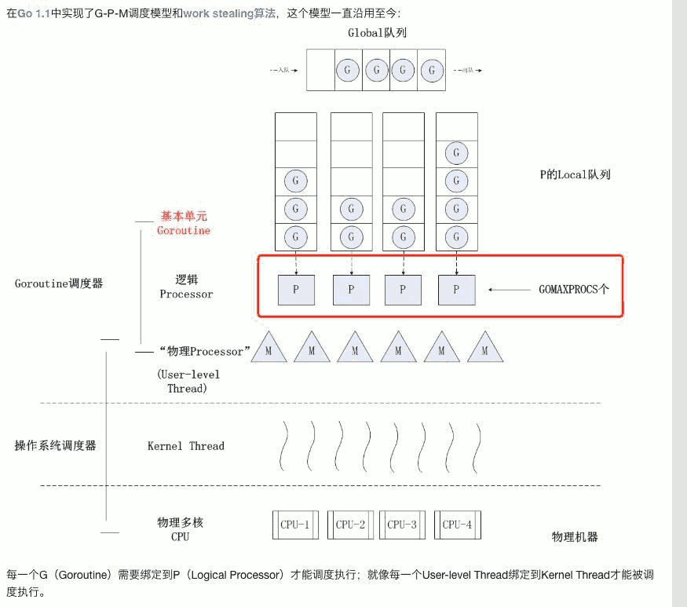

- [goroutine   调度模型](#f4826ea9897f6bce6753b7e50f3b09a8)
    - [goroutine 调度器](#082161a812b70f02ba7d92f847db36a4)

<h2 id="f4826ea9897f6bce6753b7e50f3b09a8"></h2>

# goroutine   调度模型

- Q: 线程切换开销大
- A:
    - Go 语言的调度器通过使用与 CPU 数量相等的线程， 以减少线程频繁切换的开销， 同时在每一个线程上执行额外开销更低的 Goroutine 来降低操作系统和硬件的负载。

---

- 

<h2 id="082161a812b70f02ba7d92f847db36a4"></h2>

## goroutine 调度器

- v1.1 任务窃取调度器
    - 引入处理器， G-M-P 模型
    - P 持有一个G的队列，还反向持有一个 线程M， 调度器 在调度时 会从P的队列中取G 放到M上执行。
    - 任务窃取调度器将每一个线程绑定到了独立的 CPU 上，这些线程会被不同的P管理。不同的P通过工作窃取对任务进行再分配实现任务的平衡，
- 问题： 在某些情况下，Goroutine 不会让出线程，进而造成饥饿问题；

- v1.2 抢占式调度器
    - 引入基于协作的抢占式调度 解决饥饿问题
    - 抢占是通过编译器插入函数实现的，还是需要函数调用作为入口才能触发抢占，所以这是一种协作式的抢占式调度。
    - 

    - app -> 在某个P上生成 goroutine, G ， 放入该P的本地队列，如果放不下了，放入全局队列。 
        - 其他P 如果本地队列空了，会去 全局队列，或者 其他P的本地队列里 偷取 G。

- v1.4 基于信号的抢占式调度。

