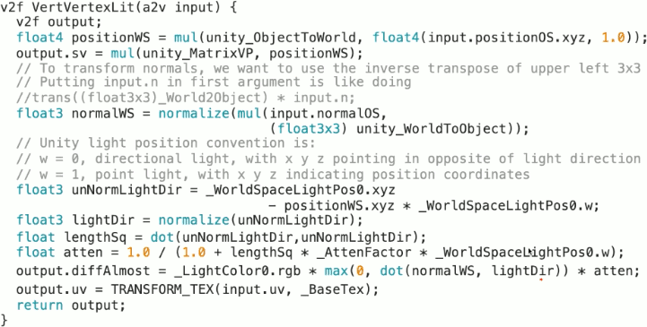
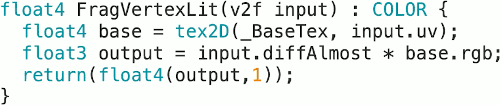
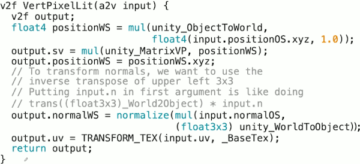
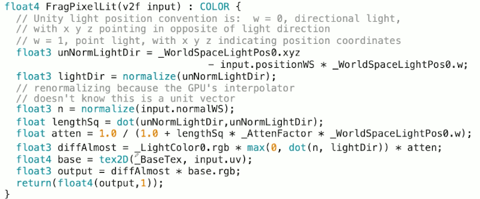
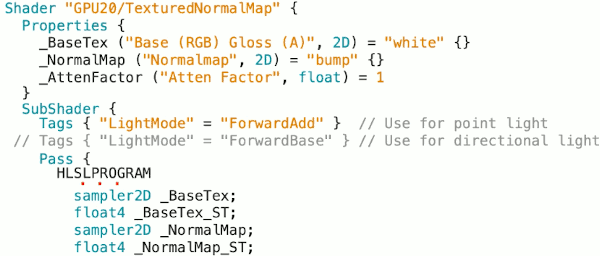
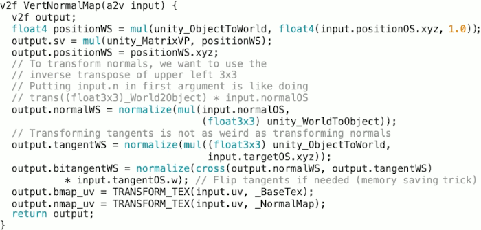
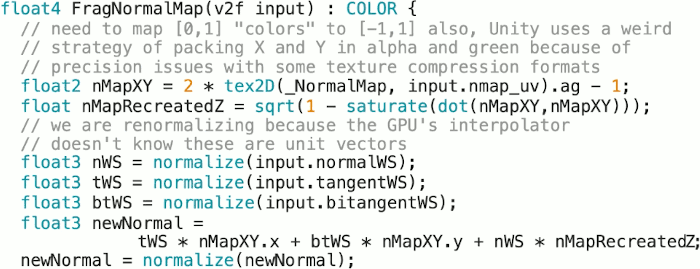

...menustart

- [23: Simple Lit Shaders](#c2084b938f5c0d2971f9f94dba225a6c)
    - [Diffuse Light Only Shader](#2cdfd700b06528d28ef8d892c3f00651)
    - [VertexLit & PixelLit Uniforms](#fdfd84e9ccc7ed4576a2f61d1047aca2)
    - [VertexLit Structures](#8b64f1adb7792fcd69026766af09fb51)
    - [VertexLit ( Vertex Shader )](#9553b17701c2b7d161a1b4f813b10ef0)
    - [VertexLit ( Pixel Shader)](#a20b822bf05cc5df06ca61cbdc59718d)
    - [PixelLit Structure](#17f40169fc0fda2a46a76a660bb8f1c2)
    - [PixelLit (Vertex Shader)](#90370e2dc9eb658baec70bf1f4a022f7)
    - [PixelLit (Pixel Shader)](#a131ac99e46d94895215a93795832fe9)
- [24: Normal Mapping](#8abb75bb97b7011e50b6ae080dd00d09)
    - [NormalMap Structure](#f9bef842891a4adee8f2c393d55b7c0f)
    - [NormalMap ( Vertex Shader )](#289daec20d989b15cf284fd25c79d41a)
    - [Normal Map (Pixel Shader)](#f5607ccd9042e1327a7d369b3e5556e5)

...menuend


<h2 id="c2084b938f5c0d2971f9f94dba225a6c"></h2>


# 23: Simple Lit Shaders

- note
    - VertexLight  只计算顶点的光照，其他靠GPU插值
    - PixelLight   法线 经过插值，分别计算每个点的光照，更加细腻真实
    - LightMode: ForwardAdd, ForwardBase
    - _WorldSpaceLightPos0.w to distinct dictional light and point light
    - trick of transform normal
    - do not forget to re-normalize unit vector after interpolation
    - normal map in card, is compressed in only green and alpha channel

<h2 id="2cdfd700b06528d28ef8d892c3f00651"></h2>


## Diffuse Light Only Shader

- 
    - per-vertex lighting
    ```cpp
    _AttenFactor("Atten Factor", float) = 1
    ```
        - attenuation factor to control how the intensity of the light falls off with range.

    - SubShader / Tags
        - the "LightMode" tag indicates certain kinds of bits of shader code that the unity render function will run at different points.
        - I don't want to get into too much detail here about what these mean. Basically there's a single directional light that's computed as part of what's called "ForwardBase" pass that includes some other things. And then any additional directional lights and any point lights are computed in these additional "ForwardAdd" runs. 
        - If I wanted to make this more robust I would actually have two copies of the sahder code here with minor tweaks , one for the "ForwardAdd" and one for the "ForwardBase". But here I'm just going to say, oh since ths is a demo example and I want to make the code as compact as possible, just comment in or out whichever one you want based on whichever light you're using.


<h2 id="fdfd84e9ccc7ed4576a2f61d1047aca2"></h2>


## VertexLit & PixelLit Uniforms 

```c
sampler2D _BaseTex;
float4 _BaseTex_ST;

float _AttenFactor;

// Unity fills for us
float4 _LightColor0;
```

- There's something a little strange in the actual HLSL uniform variable declarations: Most of the unity side variables that we use, such as the transformation matrices, are automatically grabbed by Unity in one of the include files, there's  a `_LightColor0` variable that Unity fills in for us , this is not part of those include files. It might be deprecated and removed in a further version ?


<h2 id="8b64f1adb7792fcd69026766af09fb51"></h2>


## VertexLit Structures

```c
struct a2v {
    float4 positionOS: POSITION:
    float3 normalOS: NORMAL;
    float2 uv: TEXCOORD0 ;
};

struct v2f {
    float4 sv: SV_POSITION; 
    flaot2 uv: TEXCOORD0 ;
    float3 diffAlomost: TEXCOORD1 ;
}
```

- something interesting here is the vertex shader is going to send some results of a lighting calculation. I call it `diffAmost` because it doesn't include the actual image texture information, but the overall light intensity is computed here.  
- And we're going to transmit that information through `TEXCOORD1`.  We're using a texture coordinate register to transmit information that's not actually a texture coordinate. We're gonna to a lot of this and you just need to get used to it.


<h2 id="9553b17701c2b7d161a1b4f813b10ef0"></h2>


## VertexLit ( Vertex Shader )

- 
- To transform normals, we want to use the inverse transpose of upper left 3x3 matrix
    - W = (Mᵀ)⁻¹
    - unity actually has an inverse matrix computed already for us on the inverse side `unity_WorldToObject` , so we're not having to constantly  redo that in the shader code.
    - so n' = `unity_WorldToObjectᵀ`n 
    - (n')ᵀ = nᵀ`unity_WorldToObject`  , (n')ᵀ and n' are same in that float3 representation.
    ```c
    float3 normalWS = normalize(  
        mul( input.normalOS, (float3x3)unity_WorldToObject )
    );
    ```
- another unity specific thing is that  unity is going to fill in this `_WorldSpaceLightPos0` for us, which, if you have apoint light unsurprisingly is the position of the light in world space. 
    - But unity does a clever thing, it uses this variable in 2 different ways. It can be either be the postion of the point light , or it can be the position of the directional light.
        - `_WorldSpaceLightPos0.w` = 0, directional light
        - `_WorldSpaceLightPos0.w` = 1, point light
    ```c
    float3 unNormLightDir = _WorldSpaceLightPos0.xyz - positionWS.xyz * _WorldSpaceLightPos0.w ;
    ```
- so the reason I call this `diffAlmost` is it doesn't have the final application of the actual texture image that's something we have to do in pixel shader. So it's not quite the diffuse light calculation yet, it's almost.
    - this `diffAlmost` is something I want to pass into the pixel shaders through the interpolation hardware.


<h2 id="a20b822bf05cc5df06ca61cbdc59718d"></h2>


## VertexLit ( Pixel Shader)

- 


<h2 id="17f40169fc0fda2a46a76a660bb8f1c2"></h2>


## PixelLit Structure

```c
struct a2v {
    float4 positionOS: POSITION:
    float3 normalOS: NORMAL;
    float2 tc: TEXCOORD0 ;
};

struct v2f {
    float4 sv: SV_POSITION; 
    flaot2 uv: TEXCOORD0 ;
    float3 positionWS: TEXCOORD1 ;
    float3 normalWS: TEXCOORD2 ;
}
```

- The overall structure is pretty similar.
    - but what I'm passing along to the pixel shader is different. 
    - I'm still passing along the texture coordinate for later texture lookup.
    - Now because I'm doing so much of the lighting in pixel shader, I'm not passing the lighting calculation like the `diffAlmost` I computed in the per-vertex shader. I'm going to pass along the clip space postion `sv`,  positon of the point in world space, and I'm also going to pass along the normal in world space.


<h2 id="90370e2dc9eb658baec70bf1f4a022f7"></h2>


## PixelLit (Vertex Shader)

- 

<h2 id="a131ac99e46d94895215a93795832fe9"></h2>


## PixelLit (Pixel Shader)

- 

- the interpolation hardware doesn't know that you hijacked one of the texture coordinate registers to hold something that's not a texture coordinate. It doesn't know that the normal vectors need to be normalized to have unit length.
    ```c
    // renormalizeing because the GPU's interpolator
    // doesn't know this is a unit vector
    float3 n = normalize( input.normalWS) ;
    ```

<h2 id="8abb75bb97b7011e50b6ae080dd00d09"></h2>


# 24: Normal Mapping

- 
- the main addition we're going to have here is this `_NormalMap`


<h2 id="f9bef842891a4adee8f2c393d55b7c0f"></h2>


## NormalMap Structure

```c
struct a2v {
    float4 positionOS: POSITION:
    float3 normalOS: NORMAL;
    float4 tangentOS: TANGENT; // new
    float2 uv: TEXCOORD0 ;
};

struct v2f {
    float4 sv: SV_POSITION; 
    flaot2 bmap_uv: TEXCOORD0 ; // new
    flaot2 nmap_uv: TEXCOORD1 ; // new
    float3 positionWS: TEXCOORD2 ;
    float3 normalWS: TEXCOORD3 ;
    float3 tangentWS: TEXCOORD4 ; // new
    float3 bitangentWS: TEXCOORD5 ; // new
}
```

- There are some new things
    - `tangentOS`
    - just for thoroughness even though a single set of texture coordinates (`uv`) coming in for the vertices, I'm going to go ahead and pass these in separately for the bump map and normal map (`bmap_uv, nmap_uv`) , even though we'll usually keep these the same.


<h2 id="289daec20d989b15cf284fd25c79d41a"></h2>


## NormalMap ( Vertex Shader )

- 
- Transforming tangent vectors is not as strange as transforming normals.
    - A tangent is a **unit-length vector that follows Mesh surface along horizontal (u)** texture direction.
        - 
        - Tangents in Unity are represented as Vector4, with x,y,z components defining the vector, and w used to flip the binormal if needed.
    - We still use the upper left 3x3 part of the ObjectToWorld matrix, because we want just do rotations and not any translations. 
    ```c
    output.tangentWS = normalize(  
        mul( (float3x3)unity_ObjectToWorld, input.targetOS.xyz )
    ); 
    ```
- Binormal vector is effectively the "other" tangent vector for the surface, which is orthogonal to both the Normal vector and the chosen Tangent vector, to create a 3D orthogonal basis.
    ```c
    output.bitangentWS = normalize( corss( output.normalWS, output.tangentWS ) 
        * input.tangentOS.w ); // flip tangents if needed ( memory saving trick )
    ```
    - Unity calculates the other surface vector (binormal) by taking a cross product between the normal and the tangent, and multiplying the result by tangent.w. Therefore, w should always be 1 or -1.
- The only way we're going to get different bump map and normal map vectors is if for some reason the user wanted to do something strange and use different scaling and offsets for the base map and the normal map.
    ```c
    output.bmap_uv = TRANSFORM_TEX(intput.uv, _BASETex) ;
    output.nmap_uv = TRANSFORM_TEX(intput.uv, _NormalMap) ;
    ```


<h2 id="f5607ccd9042e1327a7d369b3e5556e5"></h2>


## Normal Map (Pixel Shader)

- 
- there is some weird stuff in here.
    - we've always talked about normal maps as being represented as red,green,blue textures, where x information is stored in red, y in green, z in blue. and this is the way you'll see these normal maps show up in the unity inspector.
    - but **the way it is actually stored and transmitted into the card actually just ignores the red and the blue**. It stores the x and y information in the alpha register and in the green register.
    - if you wandering why it's doing that it has to do with the way sometimes textures are compressed, either when they're sent to the card or inside the card itself or any number of strange things. and it turns out that the kind of image compression that's used  is not used on the alpha channel. The alpha channel is left alone and uncompressed. So you're guaranteed to get some good quality there. also it turns out that humans are more sensitive to variations in green than they are red and blue. so as a result of this the various rgb compression formats will often put more bits into correctly representing green.
    ```c
    float2 nMapXY = 2 * Tex2D( NormalMap, input.nmap_uv ).ag -1 ;
    ```
    - so once you get the appropriate pixel from the normal map, we're just pulling out the alpha and green register, that's our x and y.  It's stored in the normal map as beiing [0,1], we need make it between [-1,1].
    - and then at that point, we can do a bit of math, to reconstruct what the z was. That's how we can get away with only having 2 of the components of that 3d vector because we know **it needs to be unit length**.
    ```c
    float nMapRecreatedZ = sqrt( 1 - saturate( dot( nMapXY, nMapXY )) );
    ```
- Now we can actually apply the normal map.
    - so think about these world space vector tWS, btWs, nWS as being the unperturbed vertor that any normal map perturbation that you apply is going to work around. and so multiplying these 3 coordinates by the equivalent x,y,z from the normal map is basically doing a projection.
    ```c
    // mebusy: isn't it a linear combination of 3 basis tWs|btWS|nWS
    float3 newNormal = 
        tWs * nMapXY.x + btWS * nMapXY.y + nWS * nMapRecreatedZ ;
    newNormal = normalize( newNormal ) ;
    ```
    - if you image a normal map where all of the vectors are pointing straight up, that would essentially show as blue in unity inspector,  that would have a 1 in the z component and 0 in x and y components.

- 
    - the rest of the shader code is pretty much what we saw before.


