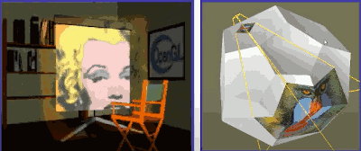
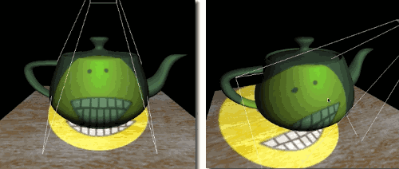
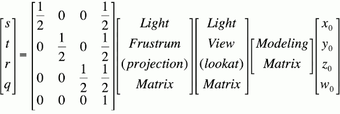
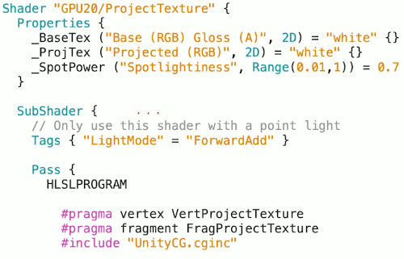
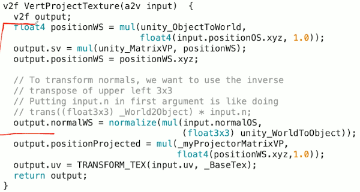
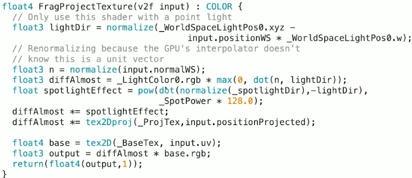
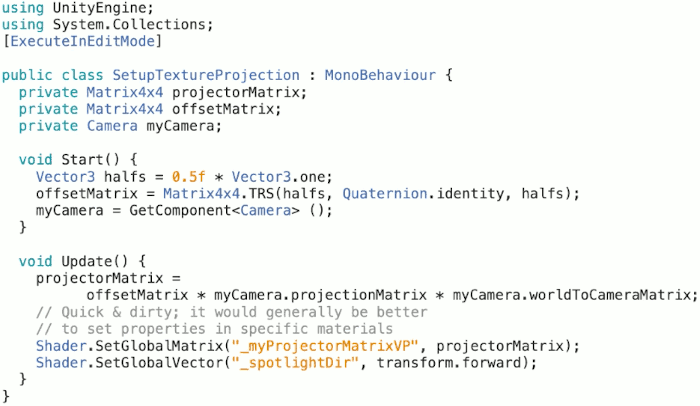
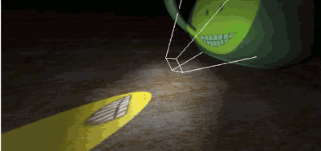

# 27: Projective Textures

## What is projective texturing ?

- An intuition for projective texturing
    - The slide projector analogy
    - 
    - project onto various objects in the scene

- Another exmaple:  different locations
    - 


## Texture matrix

from "The Cg Tutorial", p.252

- 
- The way we formulate this is basically to setup the same set of matrix transformation we would, when taking 3D object in the scene and projecting them onto a camera plane, except here we're using the light position and orientation as if the light itself is the camera.
- so we still have the same  modeling matrix which translates model coordiantes into world space.
- and then transform into a view space, but this view space is from the point of the projecting light, not the camera.
- similarly we will go through a projection matrix, again, from the point of view of the light, not the camera.
- the last matrix is used to shift  everything from [-1,1] to [0,1] because that's what texture lookups expect.

## ProjectTexture -- setup

- 
    - "ForwardAdd" lightmode


## ProjectTexture -- uniforms

```c
sampler2D _BaseTex;
float4 _BaseTex_ST;
sampler2D _SpotPower;

float _SpotPower;

float4x4 _myProjectorMatrixVP;
float3 _spotlightDir;
```

- `_myProjectorMatrixVP` view projection matrix for the light


## ProjectTexture -- structures

```c
struct a2v { // application to vertex
    float4 positionOS: POSITION;
    float3 normalOS: NORMAL;
    float2 uv : TEXCOORD0;
}; 

struct v2f { // vertex 2 fragment
    float4 sv: SV_POSITION;
    float2 uv: TEXCOORD0;
    float3 positionWS: TEXCOORD1;
    float3 normalWS: TEXCOORD2;
    float4 positionProjected: TEXCOORD3;
};
```

## ProjectTexture -- vertex program

- 


## ProjectTexture -- fragment program

- 
    - the `lightDir` vector is pointing from vertex to the light, the `_spotlightDir` is pointing out of the light, so I put the minus sign on `lightDir` in `spotlightEffect` computation, and take dot product on that to get something falls off as the angle increases to get nice spot effect.
        - and then we take it to some `pow`, and by changing the power we can change the size of the spot.
    ```c
    diffAlmost *= tex2Dproj( _ProjTex, input.positionProjected );
    ```
        - new version of `tex2D` : `tex2Dproj`
        - instead of giving a 2D `uv` coordinate, you give it a 4D vector that represents s,t,r,q coordinates space related to the light source.  and this `tex2Dproj` handles that divide by q.


## C# script to set up projector matrix

- 
- this is a c# script to define component that will attach to a camera object. but this camera object is attached to is not the main camera, it's sort of a fake camera we're using for the spot light effect.
- I set this `[ExecuteInEditMode]` directive that tells unity to run this in editor, not just in game.
- once we have `myCamera` component, we can go ask it what's the projection matrix that you're using and what the world to camera matrix is.
    - `myCamera.projectionMatrix` , `myCamera.worldToCameraMatrix`
- And now I'm goging to engage in some bad programming practice.
    ```c
    // Quick & dirty; it would generally be better to set properties in specific materials.
    // qibinyi:  use component.material.Setxxxx ?
    Shader.SetGlobalMatrix( "_myProjectorMatrixVP", projectionMatrix );
    Shader.SetGlobalVector( "_spotlightDir", transform.forward );
    ```
    - the `Shader` class has some static methods, those static methods will go through **EVERY** single material . And each time they find a shader that has the variable with the specific name they set the values. But it does that for **EVERY** single material. So this wouldn't work if you want to have multiple spot light. And looking string in unity is extreamly time comsuming.


## Watch out for the reverse projection!

- 

- There is one  interesting effect that sometimes you have to watch out for ,  the underlying projection matrix math doesn't care which direction you're going.
    - so you can have this weird mirrored projections what you might have to be careful about.
- The most common use actually is as the core of implementing shadows maps, which is method of handling shadow effects.
- I should let you know that unity does have spot light builtin to it, along with the ability for those spot light to project textures.
    - Unity implements this in the way that is different that what I describes here.


