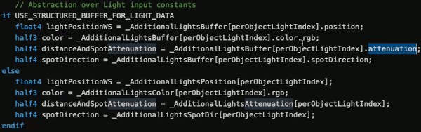

# 30: Updating Shaders for the Universal Render Pipeline

## Installing the Universal Render Pipeline into an existing Project

- Installing URP
    - In the top navigation bar, select Window > Package Manager to open the Package Manager window.
    - Select Universal RP from the list of package, install
    - be careful about color space !!

- Creating the Universal Render Pipeline Asset
    - In the Editor, go to the Project window.
    - Right-click in the Project window, and select Create > Rendering > Universal Render Pipeline > Pipeline Asset. Alternatively, navigate to the menu bar at the top, and select Assets > Create > Rendering > Universal Render Pipeline > Pipeline Asset.

- Adding the Asset to your Graphics settings
    - you need to add the newly created Universal Render Pipeline Asset to your Graphics settings in Unity. If you don't, Unity still tries to use the Built-in render pipeline.
    - Navigate to Edit > Project Settings... > Graphics.
    - In the Scriptable Render Pipeline Settings field, add the Universal Render Pipeline Asset you created earlier. When you add the Universal Render Pipeline Asset, the available Graphics settings immediately change. Your Project is now using URP.

- Upgrading your shaders
    - https://docs.unity3d.com/Packages/com.unity.render-pipelines.universal@10.7/manual/upgrading-your-shaders.html
    - To upgrade built-in Shaders:
        - Open your Project in Unity, and go to Edit > Render Pipeline > Universal Render Pipeline.
        - According to your needs, select either Upgrade Project Materials to URP Materials or Upgrade Selected Materials to URP Materials.
    - `#include "UnityCG.cginc"`
        - => `#include "Packages/com.unity.render-pipelines.universal/ShaderLibrary/Core.hlsl"`
    - change Tags
        ```c
        // SubShader Tags define when and under which conditions a SubShader block or
        // a pass is executed.
        Tags { "RenderType" = "Opaque" "RenderPipeline" = "UniversalPipeline" }
        ```
    - pre-built variables
        - `_WorldSpaceLight0` -> `_MainLightPosition`
            - in the original built-in render pipeline, they generally in forward lighting mode did 2 passes, actually they did a bunch of passes. 
                - They did base pass that could potentially include a directional light if you had one, and also the per-vertex/HS( spherical harmonic  )lights.
                - and then most of your other lights were actually computed in separate passes
            - the universal render pipeline does everything in one pass. 
            - But it looks like they kept a similar overall data structure format for the lights and that there's some main light and then other lights we need to add. And the Main Light they setup is a directional light.
            - Additional PerObject Light:
                - 
        - `_LightColor0` -> `_MainLightColor` (not necessary)

