...menustart

- [32: DIY Postprocessing with the Built-In Pipeline, with a Taste of Deferred Rendering](#ecf2d2baf3a85614fed652e8202506d5)
    - [Setup for Postprocessing](#0619c5d6918abcf32a904fce06373556)
    - [Outline Shader](#417b745a4173afc57e75ae3d40323f0e)
    - [Outline Camera Script](#7cb3bdab742ab4ffd7ff17ff5175da4c)
    - [DepthNormal Shader](#abab460191bed0a6461073795868dc4b)
    - [DecodeDepthNormal](#60f4cbd5a20c45e3f0c99a02becc2679)
    - [DepthNormal Camera Script](#b54ff5be5aa2dbc7357a3b966b22583b)
    - [Deferred Rendering Shader](#4ec4cbc2ce27a23ff2ac10fb1762cfb7)
    - [Deferred Rendering Camera Script](#a6381a42bc72e226d2bf8e8ddc014747)
    - [Misc](#74248c725e00bf9fe04df4e35b249a19)

...menuend


<h2 id="ecf2d2baf3a85614fed652e8202506d5"></h2>


# 32: DIY Postprocessing with the Built-In Pipeline, with a Taste of Deferred Rendering

https://github.com/lantertronics/CS-ECE4795-GPU-Prog-for-Video-Games


- this is not what you would want to do if you're actually writing a unity game with the built-in pipeline in real life.
    - you'd want to use the post-processing stack package that unity provides.
    - here I'm showing you this DIY version to emphasize some of the things taking place behind the scenes that unity's post-processing stack code would take care of for you.

<h2 id="0619c5d6918abcf32a904fce06373556"></h2>


## Setup for Postprocessing

- 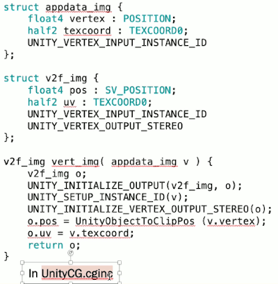
- all of the codes including the `UnityCG.cginc` file, in post-processing essentially you're rendering a complete frame as usual then snarfing that entire image treating it as a texture and then rendering another frame that consists of nothing but 2 triangles that fill up the entire space of the screen.
- `UnityCG.cginc` provides our vertex shader for us, and all of it really needs to do is  pass along texture coordinates. We won't worry about the details.


<h2 id="417b745a4173afc57e75ae3d40323f0e"></h2>


## Outline Shader 

- 
- the shader that we're going to write now is not like the regular shaders we had before where we would assign shader to a material and then attach material to an object.
    - so we use special "Hidden" feature that causes this shader to not appear when you click on the shader entry for a material.
- `_MainTex`
    - we're going to externally define, we're not going to pick a texture for this as usual. This is something that our post-processing code will handle and basically what it's going to do is it will tell the gpu to render frame as usual all of your various 3D objects then take that resulting image and treat it as a texture and that's what becomes the `_mainTex`.

- 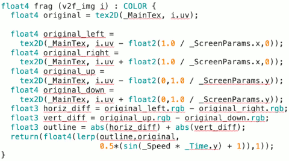
    - this is our job to define the fragment shader. And this is where we put our post-processing effect.
    - unity fills in the `_ScreenParams`   vector for us, `_ScreenParams.x` basically gives you the width of the image.

<h2 id="7cb3bdab742ab4ffd7ff17ff5175da4c"></h2>


## Outline Camera Script

- 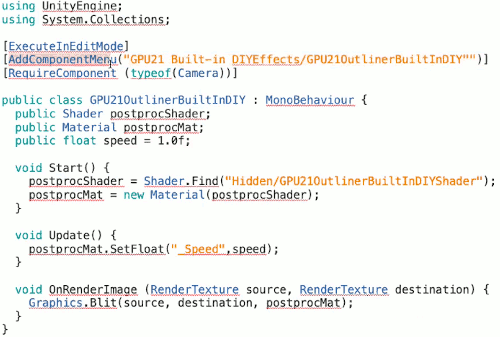
- `[AddComponentMenu]` is what lets us organzie our various components.
- Since this is a script that is meant to be attached to a camera, we include this line so that unity complain if we attach it to something that doesn't have a camera.
    - `[RequireComponent (typeof(Camera))]`
- The `Start()` routine basically assigns our shader and material variables.
- `postprocMat.SetFloat( "_Speed", speed );`
    - this line calls material's `SetFloat` method , to set the shader variable `_Speed`.
- `OnRenderImage` is a callback that gets run after your boring 3D objects have been rendered but before it actually shows an image to the user.
    - These 2 `RenderTexture` source and destination are actual images that are living on the GPU. 
    - the `Blit` method basically tells the GPU to take this source which is that frame was rendered by the normal rendering process, and copy it to the destination, but do it through this material that is using our fancy outlining shader.

- 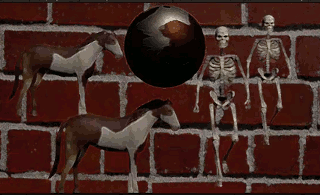


<h2 id="abab460191bed0a6461073795868dc4b"></h2>


## DepthNormal Shader

- 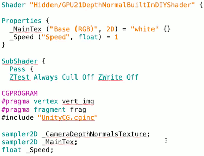
    - The only thing that's really new here is that we're declaring a 2D texture `sampler2D _CameraDepthNormalsTexture`.  This is something that unity fills in for us that contains information about the depth and normal at each pixel. 
    - In this particular shader we won't actually use `_MainTex` because all we're doing is displaying the depth and normal information. But in a more general context you might use the depth information for something like a depth of field effect.
        - 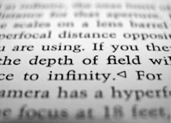
        - and normal information is used in advanced effects like screen space reflections.

- 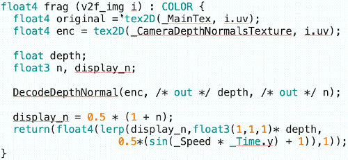
    - the depth and normal information is encoded in the rgb alpha of `_CameraDepthNormalsTexture`.
        - `UnityCG` provoids a method `DecodeDepthNormal` to decode that information, and pull out the associated depth and normal inforamtion.
    - the normals go between [-1,1],  to scale then to fit [0,1] to display them as colors.
        - `display_n = 0.5 * (1+n)`
    - The [0,1] depth value that you get from `DecodeDepthNormal` and that we display in the shader here, that's just like a raw z-buffer value.
        - what we actually need to do to get the distance to the camera is to run it through this function.
        - 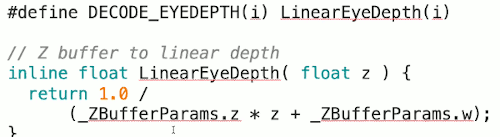
        - it uses the information in the `_ZBufferParams` varialbe. That tells you that the GPU is using a non-linear mapping for the z-buffer. 

<h2 id="60f4cbd5a20c45e3f0c99a02becc2679"></h2>


## DecodeDepthNormal 

- Here is the `DecodeDepthNormal` function from the `UnityCG`
- 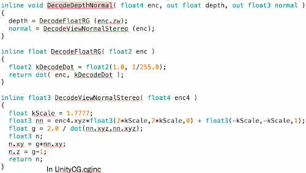

<h2 id="b54ff5be5aa2dbc7357a3b966b22583b"></h2>


## DepthNormal Camera Script

- 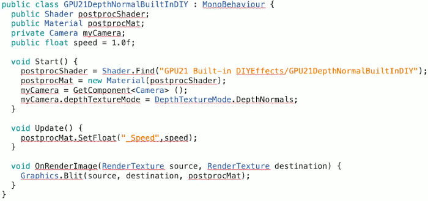
    - set depthTextureMode
    ```c
    myCamera.depthTextureMode = DepthTextureMode.DepthNormals;
    ```
- Deferred shading
    - all of the rendering we've looked at in this course so far goes under the category of "forwarding" rendering. 
    - in deferred rendering, you don't actually do any lighting calculations when your first rendering your 3D objects. 
        - what you do is you store in something called G-buffer all of the information that you need to do lighting calculations that you do later hence the term **deferred rendering**.
    - In the example I'm going to show you here , our G-buffer information is just the depth and the normal map. A real deferred rendering implementation will also have additional information in the G-buffer and other G-buffer textures like diffuse material color, specular color basically the F₀ fresnel parameter, etc...

- 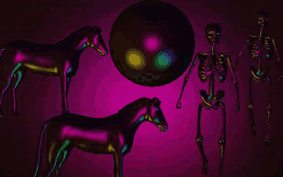


<h2 id="4ec4cbc2ce27a23ff2ac10fb1762cfb7"></h2>


## Deferred Rendering Shader

- 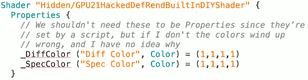
- 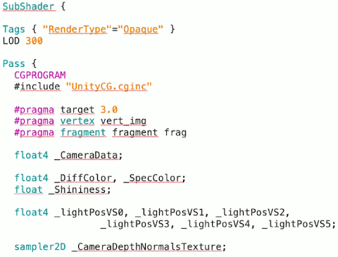
    - in this demo I completely bypassing unity's lighting system, I'm doing my own thing. so here I have a bunch of values for different lights
    ```c
    float4 _lightPosVS0, _lightPosVS1, ...
    ```

- 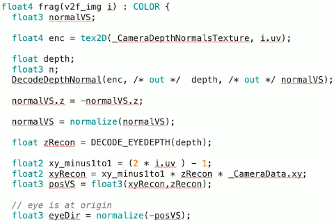
    - I found that the z coordinate of normal was facing opposite of the way I expected so I negate that. I really confess that this is a thing that I often do when writing code which is something;s minus what I think so I just negate it where I need to do get it going the direction that I think it should be for what I'm doing and I move on without thinking about it much further.
        ```c
        normalVS.z = -normalVS.z;
        ```
    - The next 3 lines took me ages to figure out.
        ```c
        // take the texture coordiante, make it [-1,1
        float2 xy_minus1to1 = (2 * i.uv ) - 1;
        // multiply it by z-distance to essentially undo that perspective division
        //   and then multiply it by xy in camera data verctor,
        //   in order to get what the x,y coordinates in view space are.
        float2 xyReco = xy_minus1to1 * zRecon * _CameraData.xy ;
        // append the z cooridnate to that go get the positon in view space.
        float3 posVS = float3(xyRecon, zRecon);
        ```
        - when you do perspective projection, you divide by the z coordinate. Now essentially here what we need to do it to take each pixel on the screen and find the associated position in view space.
        - so need to undo that transformation.
    - Now we can compute the various vectors we need to do lighting calculations. 
        - for specular reflections we need the Eye vector. That is a vector pointing from a point on an object to the camera. And here the camera is at zeros ( view space).
            - so essentailly the eye vector is 0 minus the position in view space because the camera is at origin in view space.
        ```c
        float3 eyeDir = normalize( -posVS );
        ```
- 
    - here's where I finally compute the lights.

<h2 id="a6381a42bc72e226d2bf8e8ddc014747"></h2>


## Deferred Rendering Camera Script

- 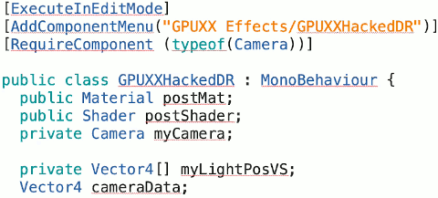
- 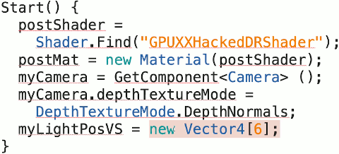
- 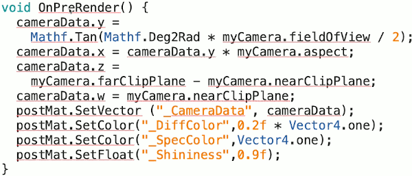
    - this `OnPreRender` routine is a callback that gets run before the main rendering of the scene.
    - here we set up the camera data that we need in order to properly decode the depth and normal information, and also undo the perspective projection effect in order to figure out where various pixels live in view space.  This is the sort of stuff that in the previous examples unity set for us, but here since I'm bypassing unity's lighting system, I need to set this for myself.

- 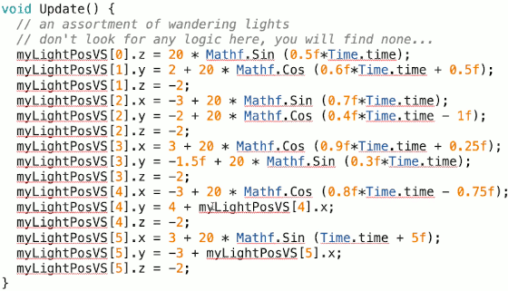
    - The `Update()` routine basically moves the lights around.
- 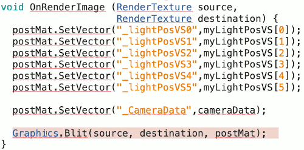
    - actually we don't need this line `postMat.SetVector("_CameraData",  cameraData); ` because we already did it in `OnPreRender` routine.

<h2 id="74248c725e00bf9fe04df4e35b249a19"></h2>


## Misc

- something kind of interesting that I noticed is that these effects will apparently cascade. We can mix serveral post-processing effect.
    - 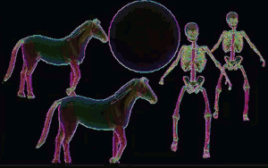
