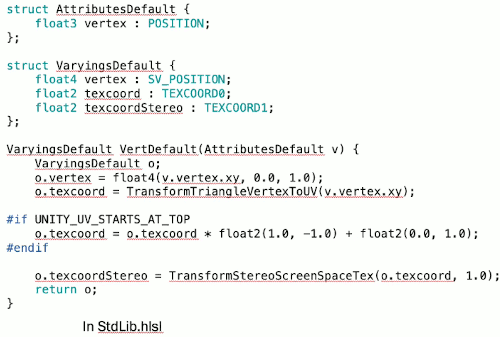
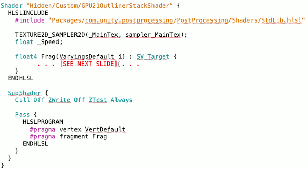
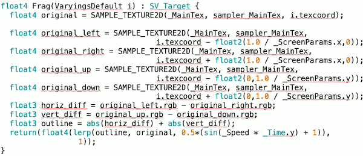
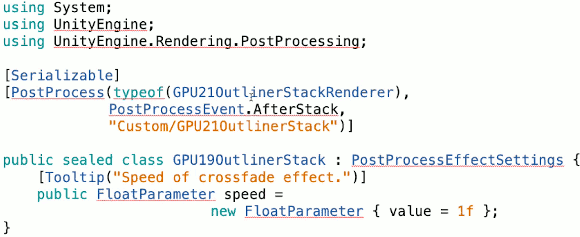
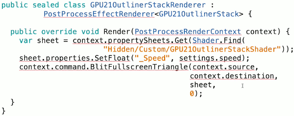
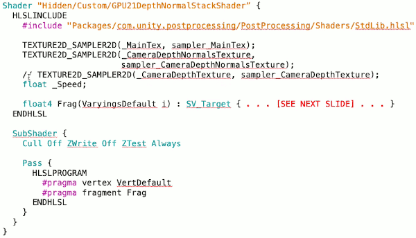
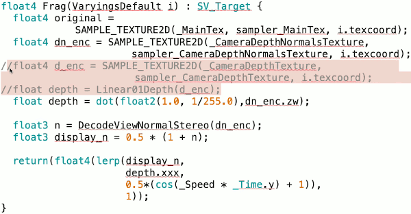
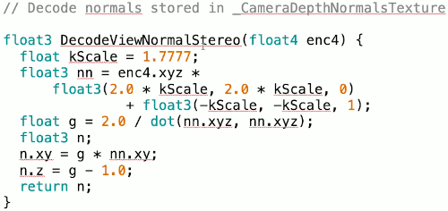
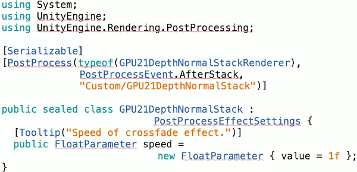
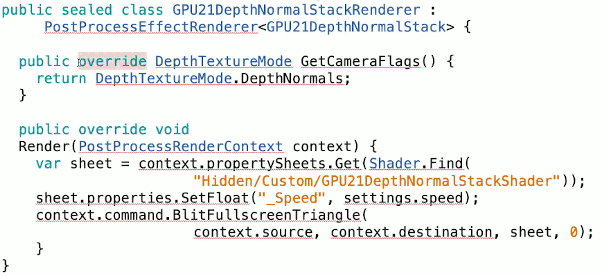

# 33: Unity's Postprocessing Stack for the Built-In Pipeline

Unity has something called the post-processing stack which works in the built-in pipeline and lets you write you own custom effects that also play nicely with the post-processing effects that unity's already provided.

- Package Mange 
    - install `Post Processing` package. This package only works with the built-in pipeline.

## Setup for Post-processing -- Stack Style

- 
    - the struct `AttributesDefault` basically corresponds to something that I used to call a2v ( application to vertex ) struct.
    - the struct `VaryingsDefault` corresponds v2f (vertex to fragment) struct.

## Outline Shader -- Stack Style 

- 
    - unity's style for writing these custom shaders is to put all this hlsl code first (in `HLSLINCLUDE` ) , and put all the stuff about the `#pragma` down.
    - the main difference compared to what you might have seen before, is that where we used to have something like `sampler2D _MainTex;` , here we have this weired `TEXTURE2D_SAMPLER2D(_MainTex, sampler_MainTex);` macro. 
        - See  https://docs.unity3d.com/Manual/SL-SamplerStates.html

- 
    - the fragment code is basically the same as the DIY version.
    - `SAMPLE_TEXTURE2D`  is something like `tex2D`.

## Outline Script -- Stack Style

- 
- `the [PostProcess]` directive refers to a class `CPU21OutlineStackRenderer` that I'll define on the next slide.
    - `PostProcessEvent.AfterStack` makes this effect happen after whatever built-in unity effects you've selected occur.
    - `"Custom/GPU21OutlineStack"` the string here specifies the name of the actual shader that it uses.
- Instead of just a goold old-fashioned `float` for some reason fancy post-processing thing has a `FloatParameter` type which gives it extra coolness or something.
    - and you can even add a tooltip for it. 

- 
    - you don't need to know all of the details here. I don't know the details either.
    - apparently you need to get some sort of property sheet, and then you can set that float parameter via the sheet.
    - `context.command.BlitFullscreenTriangle` this is the magic command that actually takes the original image of your 3D objects that were rendered in the regular way, and then copies that to the destination texture using your particular fancy custom shader.

## DepthNormal Shader  -- Stack Style

- 
- 
- 
- 
- 

